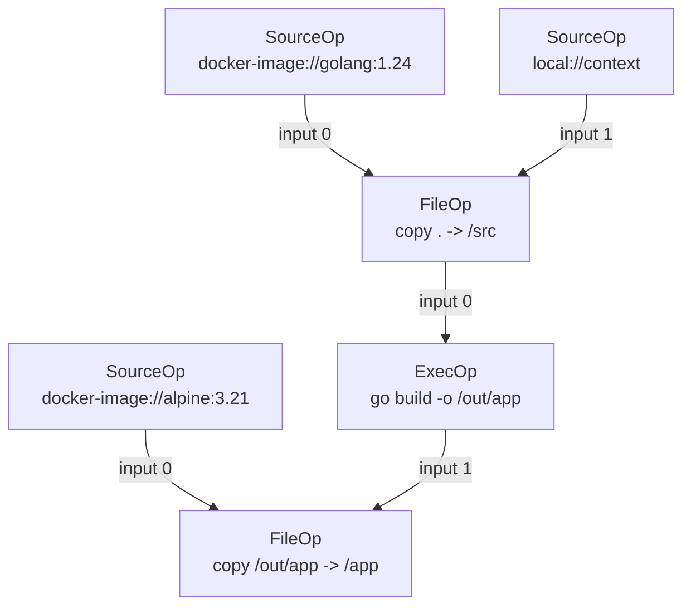

## 何を学んだか

LLB (low-level build) は、ビルドを表す DAG の直列化形式だ。実体は `Op` メッセージをバイト列にしたものの**フラットな配列**で、グラフの辺はポインタでも配列インデックスでもなく「入力 Op のバイト列の digest」で表される。頂点の ID が頂点の内容そのものから決まる — つまり LLB は content-addressable な DAG である。

この 1 つの選択から、章の軸である 3 つが出てくる。辺のない頂点は並列に解けること、頂点の ID がそのままキャッシュキーの材料になること、そして「LLB を吐く」という契約さえ満たせば入力の記法は何でもよくなること。

## Op と Input と Definition

proto は 3 つのメッセージで DAG を表す。

```proto title="solver/pb/ops.proto"
// Op represents a vertex of the LLB DAG.
message Op {
	// changes to this structure must be represented in json.go.
	// inputs is a set of input edges.
	repeated Input inputs = 1;
	oneof op {
		ExecOp exec = 2;
		SourceOp source = 3;
		FileOp file = 4;
		BuildOp build = 5;
		MergeOp merge = 6;
		DiffOp diff = 7;
		PassthroughOp passthrough = 8;
	}
	Platform platform = 10;
	WorkerConstraints constraints = 11;
}

// Input represents an input edge for an Op.
message Input {
	// digest of the marshaled input Op
	string digest = 1;
	// output index of the input Op
	int64 index = 2;
}
```

([solver/pb/ops.proto L9-L42](https://github.com/moby/buildkit/blob/ca4838f8ddbd3612bca94bcb8a938d8a326110a3/solver/pb/ops.proto#L9-L42))

`Input` は 2 フィールドしかない。**どの頂点か** (`digest`) と、**その頂点の何番目の出力か** (`index`) だ。頂点が複数の出力を持ちうるのは、`ExecOp` が複数のマウントを書き換えて返せるからで、`Mount` にも `input` と `output` の番号がある ([ExecOp — mount から入力と出力の番号を決める](../exec-op/))。

グラフ全体は `Definition` に入る。

```proto title="solver/pb/ops.proto"
// Definition is the LLB definition structure with per-vertex metadata entries
message Definition {
	// def is a list of marshaled Op messages
	repeated bytes def = 1;
	// metadata contains metadata for the each of the Op messages.
	// A key must be an LLB op digest string. Currently, empty string is not expected as a key, but it may change in the future.
	map<string, OpMetadata> metadata = 2;
	// Source contains the source mapping information for the vertexes in the definition
	Source Source = 3;
}
```

([solver/pb/ops.proto L309-L318](https://github.com/moby/buildkit/blob/ca4838f8ddbd3612bca94bcb8a938d8a326110a3/solver/pb/ops.proto#L309-L318))

注目したいのは `def` の型が `repeated bytes` であって `repeated Op` ではないことだ。**マーシャル済みのバイト列をそのまま持つ。** これは digest が「その Op をシリアライズしたバイト列のハッシュ」であることを保証するためで、受け取った側が再シリアライズして digest がずれる余地をなくしている ([決定性 marshal がキャッシュの前提になっている](../deterministic-marshal/))。

メタデータが `Op` の中ではなく `Definition` の脇に digest をキーとした map で置かれているのも意図的だ。`ignore_cache` や進捗表示用の `description` は頂点の同一性に影響してはいけないので、digest の計算対象から外れる位置に置く必要がある ([solver/pb/ops.proto L220-L234](https://github.com/moby/buildkit/blob/ca4838f8ddbd3612bca94bcb8a938d8a326110a3/solver/pb/ops.proto#L220-L234))。同じ考えは solver 側の `VertexOptions` にも現れる。

```go title="solver/types.go"
// VertexOptions define optional metadata for a vertex that doesn't change the
// definition or equality check of it. These options are not contained in the
// vertex digest.
type VertexOptions struct {
	IgnoreCache  bool
	// ...
}
```

([solver/types.go L49-L60](https://github.com/moby/buildkit/blob/ca4838f8ddbd3612bca94bcb8a938d8a326110a3/solver/types.go#L49-L60))

## 簡単な Dockerfile が DAG になる

2 ステージの Dockerfile を考える。

```dockerfile
FROM golang:1.24 AS build
COPY . /src
RUN go build -o /out/app /src

FROM alpine:3.21
COPY --from=build /out/app /app
```

これが LLB になると、こうなる。



`alpine` の取得 (`S3`) は `golang` 側の枝と辺で繋がっていない。だから solver から見ると、両者を同時に解いてよいことが構造から明らかになる。Dockerfile 上では `FROM alpine` が 4 行目にあるという事実は、DAG に落ちた時点で消えている。

## DAG にしたことで手に入る 3 つ

### 1. 並列化

`Input` に現れない頂点同士には順序制約がない。solver は `Vertex.Inputs()` だけを見て依存を判断するので ([solver/types.go L30-L33](https://github.com/moby/buildkit/blob/ca4838f8ddbd3612bca94bcb8a938d8a326110a3/solver/types.go#L30-L33))、並列化のために別途「このステップとこのステップは独立」という情報を持つ必要がない。マルチステージビルドの独立ステージが自動的に並走するのは、この副作用にすぎない。

### 2. キャッシュ

頂点 ID が内容から決まるので、「同じ digest の頂点 = 同じ操作」が定義から言える。BuildKit のキャッシュキーはこの digest をそのまま使うのではなく、Op ごとの `CacheMap` が返す digest と入力のキーを合成して作るが ([「何をキャッシュヒットとみなすか」を定義する](../what-is-a-cache-hit/))、いずれにせよ**実行せずにキーが計算できる**という性質は DAG が content-addressable であることから来ている。

同じ digest の頂点が複数の枝に現れたら、それは同じものだ。クライアント側の marshal は、この重複排除を明示的にやっている。

```go title="client/llb/state.go"
func marshal(ctx context.Context, v Vertex, def *Definition, s *sourceMapCollector, cache map[digest.Digest]struct{}, vertexCache map[Vertex]struct{}, c *Constraints) (*Definition, error) {
	if _, ok := vertexCache[v]; ok {
		return def, nil
	}
	for _, inp := range v.Inputs() {
		var err error
		def, err = marshal(ctx, inp.Vertex(ctx, c), def, s, cache, vertexCache, c)
		// ...
	}

	dgst, dt, opMeta, sls, err := v.Marshal(ctx, c)
	// ...
	if _, ok := cache[dgst]; ok {
		return def, nil
	}
	def.Def = append(def.Def, dt)
	cache[dgst] = struct{}{}
	return def, nil
}
```

([client/llb/state.go L196-L223](https://github.com/moby/buildkit/blob/ca4838f8ddbd3612bca94bcb8a938d8a326110a3/client/llb/state.go#L196-L223))

深さ優先で入力を先に出力し、`cache` に入っている digest はスキップする。結果として `def` は**トポロジカル順に並んだ、重複のない Op の配列**になる。

### 3. フロントエンドの差し替え

LLB を吐けるものは何でもフロントエンドになれる。Go の `client/llb` パッケージはその一例で、`State` という immutable な値を連結して DAG を組み立てる。

```go title="client/llb/state.go"
// State represents all operations that must be done to produce a given output.
// States are immutable, and all operations return a new state linked to the previous one.
// State is the core type of the LLB API and is used to build a graph of operations.
// The graph is then marshaled into a definition that can be executed by a backend (such as buildkitd).
//
// Operations performed on a State are executed lazily after the entire state graph is marshalled and sent to the backend.
type State struct {
	out   Output
	prev  *State
	key   any
	value func(context.Context, *Constraints) (any, error)
	opts  []ConstraintsOpt
	async *asyncState
}
```

([client/llb/state.go L54-L67](https://github.com/moby/buildkit/blob/ca4838f8ddbd3612bca94bcb8a938d8a326110a3/client/llb/state.go#L54-L67))

`prev` を辿る連結リストになっていて、環境変数や作業ディレクトリといった「文脈」は `key`/`value` として鎖に積まれる。`Marshal` を呼ぶまで何も起きない。詳細は [State API — immutable な連結リストと遅延評価](../state-api/)。

## 平坦な配列から DAG に戻す

デーモン側は受け取った `Definition` を DAG に復元する。ここで digest がどう使われるかが端的に出る。

```go title="solver/llbsolver/vertex.go"
	for _, dt := range def.Def {
		var pbop pb.Op
		if err := pbop.Unmarshal(dt); err != nil {
			return solver.Edge{}, errors.Wrap(err, "failed to parse llb proto op")
		}
		// ...
		dgst := digest.FromBytes(dt)
		// ...
		allOps[dgst] = &op{
			Op:       &pbop,
			Metadata: def.Metadata[string(dgst)],
		}
		lastDgst = dgst
	}
```

([solver/llbsolver/vertex.go L365-L384](https://github.com/moby/buildkit/blob/ca4838f8ddbd3612bca94bcb8a938d8a326110a3/solver/llbsolver/vertex.go#L365-L384))

digest はバイト列から計算し直す。送り手が申告した ID を信用しない構造になっている。あとは配列の最後の Op を起点に `Input.digest` を再帰的に辿るだけで DAG が復元される。

```go title="solver/llbsolver/vertex.go"
	var rec func(dgst digest.Digest) (solver.Vertex, error)
	rec = func(dgst digest.Digest) (solver.Vertex, error) {
		if v, ok := cache[dgst]; ok {
			return v, nil
		}
		op, ok := allOps[dgst]
		if !ok {
			return nil, errors.Errorf("invalid missing input digest %s", dgst)
		}
		// ...
	}
```

([solver/llbsolver/vertex.go L441-L459](https://github.com/moby/buildkit/blob/ca4838f8ddbd3612bca94bcb8a938d8a326110a3/solver/llbsolver/vertex.go#L441-L459))

配列の最後の要素は、`State.Marshal` が最後に足す「入力が 1 本だけの空 Op」だ ([client/llb/state.go L160-L165](https://github.com/moby/buildkit/blob/ca4838f8ddbd3612bca94bcb8a938d8a326110a3/client/llb/state.go#L160-L165))。これが root を指すポインタとして働く。ここは [Op の平坦な配列が DAG になる](../llb-definition/) で詳しく扱う。

## なぜそうなっているか

digest で辺を表すのは、配列インデックスで表すより明らかに面倒だ。それでもこの形になっているのは、**同一性の定義を転送形式に埋め込むため**だと読める。インデックス参照なら、2 つの Definition をマージしたり一部を差し替えたりするたびに番号を振り直す必要があり、そのたびに「同じ操作かどうか」の判定が壊れる。digest ならマージは配列を連結するだけで済み、同じ操作は自動的に同じ ID になる。

`repeated bytes def` という選択も同じ動機だ。proto3 のマップやフィールド順序には正規形が保証されない場面があるため、受け手が再シリアライズすると digest が変わりうる。バイト列をそのまま運べば、その問題は最初から起きない。

## どう活かすか

**グラフの辺を、位置ではなく内容で指す。** 配列のインデックスやポインタで依存を書くと、グラフの結合・分割・部分差し替えのたびに参照の張り替えが要る。内容の digest で指しておくと、それらがすべて「集合の操作」に落ちる。中間表現を設計するとき、ノード ID を採番するか内容から導くかは、後から効いてくる分岐点になる。

**同一性に効くフィールドと効かないフィールドを、型のレベルで分ける。** BuildKit は `Op` (digest に入る) と `OpMetadata` (入らない) を別のメッセージにし、solver 側でも `Vertex` と `VertexOptions` に分けている。「このフィールドはキャッシュキーに含めるべきか」を毎回考えるのではなく、置き場所で決まるようにしてある。

**転送形式に「送り手が計算した ID」を含めても、受け手は再計算する。** `digest.FromBytes(dt)` は 1 行だが、これがあることで、壊れた・悪意ある Definition が「別の頂点のふりをする」経路を塞いでいる。content-addressable なプロトコルでは、ID の検証を省かないこと自体が信頼境界の一部になる ([スコープと信頼境界](../scope-and-trust/))。
