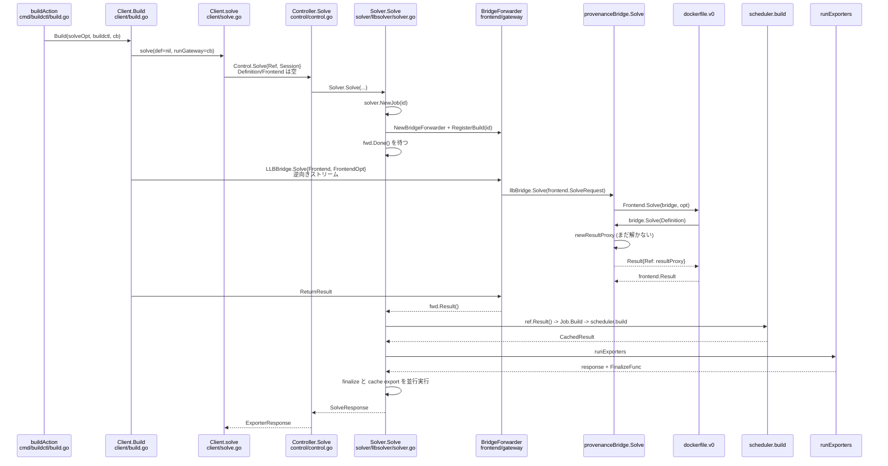

## 何を学んだか

`buildctl build` の経路を実際に追うと、想像とずれる箇所が 1 つある。**buildctl は `Control.Solve` に LLB もフロントエンド名も入れない。** 送るのは空のリクエストで、クライアント自身がゲートウェイフロントエンドとして振る舞い、逆向きの `LLBBridge.Solve` で本当のリクエストを送る。

つまり `buildctl build --frontend dockerfile.v0 ...` は、次の 2 段になっている。

1. `Control.Solve{Ref, Session}` — Definition も Frontend も空。デーモンはこれを見て「クライアントがゲートウェイとして接続してくる」と判断し、待機する。
2. `LLBBridge.Solve{Frontend: "dockerfile.v0", ...}` — 逆向きのストリームで本当のリクエストが来る。

以下、この経路を関数単位で辿る。

## 全体のシーケンス



## 1. buildAction — フラグを SolveOpt に詰める

`cmd/buildctl/build.go` の `buildAction` が入口だ。やっているのは、CLI フラグを `client.SolveOpt` に写す作業に尽きる。

```go title="cmd/buildctl/build.go"
	solveOpt := client.SolveOpt{
		Exports: exports,
		// LocalMounts is set later
		Frontend: clicontext.String("frontend"),
		// FrontendAttrs is set later
		// OCILayouts is set later
		CacheExports:        cacheExports,
		CacheImports:        cacheImports,
		Session:             attachable,
		AllowedEntitlements: clicontext.StringSlice("allow"),
		// ...
		Ref:                 ref,
	}
```

([cmd/buildctl/build.go L255-L268](https://github.com/moby/buildkit/blob/ca4838f8ddbd3612bca94bcb8a938d8a326110a3/cmd/buildctl/build.go#L255-L268))

`Session` に入るのは `session.Attachable` のスライスで、この時点ですでにレジストリ認証プロバイダが登録されている ([cmd/buildctl/build.go L196-L199](https://github.com/moby/buildkit/blob/ca4838f8ddbd3612bca94bcb8a938d8a326110a3/cmd/buildctl/build.go#L196-L199))。`--local` は `LocalMounts` に、`--opt` は `FrontendAttrs` に入る。

`--frontend` が指定されていなければ、LLB を標準入力から読む。

```go title="cmd/buildctl/build.go"
	var def *llb.Definition
	if clicontext.String("frontend") == "" {
		// ...
		def, err = read(os.Stdin, clicontext)
		// ...
	} else if clicontext.Bool("no-cache") {
		solveOpt.FrontendAttrs["no-cache"] = ""
	}
```

([cmd/buildctl/build.go L285-L299](https://github.com/moby/buildkit/blob/ca4838f8ddbd3612bca94bcb8a938d8a326110a3/cmd/buildctl/build.go#L285-L299))

`--no-cache` の扱いが分岐で違うのが面白い。LLB を直接読んだ場合は各 Op の `OpMetadata.IgnoreCache` を立てて回り ([cmd/buildctl/build.go L131-L142](https://github.com/moby/buildkit/blob/ca4838f8ddbd3612bca94bcb8a938d8a326110a3/cmd/buildctl/build.go#L131-L142))、フロントエンドを使う場合はフロントエンドへのオプションとして渡す。キャッシュ無効化をどのレイヤで解釈するかが違う。

最後に `c.Build` を呼ぶ。

```go title="cmd/buildctl/build.go"
		sreq := gateway.SolveRequest{
			Frontend:    solveOpt.Frontend,
			FrontendOpt: solveOpt.FrontendAttrs,
		}
		// ...
		if def != nil {
			sreq.Definition = def.ToPB()
		}
		resp, err := c.Build(ctx, solveOpt, "buildctl", func(ctx context.Context, c gateway.Client) (*gateway.Result, error) {
			// ...
			return c.Solve(ctx, sreq)
		}, progresswriter.ResetTime(mw.WithPrefix("", false)).Status())
```

([cmd/buildctl/build.go L367-L398](https://github.com/moby/buildkit/blob/ca4838f8ddbd3612bca94bcb8a938d8a326110a3/cmd/buildctl/build.go#L367-L398))

`Frontend` も `Definition` も、`SolveOpt` ではなく **`gateway.SolveRequest` の側に載っている**。これが冒頭の「ずれ」の正体になる。

## 2. Client.Build — 自分をゲートウェイにする

```go title="client/build.go"
func (c *Client) Build(ctx context.Context, opt SolveOpt, product string, buildFunc gateway.BuildFunc, statusChan chan *SolveStatus) (*SolveResponse, error) {
	// ...
	opt.Frontend = ""
	// ...
	cb := func(ref string, s *session.Session, opts map[string]string) error {
		// ...
		gwClient := c.gatewayClientForBuild(ref)
		g, err := grpcclient.New(ctx, feOpts, s.ID(), product, gwClient, gworkers)
		// ...
		return g.Run(ctx, buildFunc)
	}

	return c.solve(ctx, nil, cb, opt, statusChan)
}
```

([client/build.go L17-L63](https://github.com/moby/buildkit/blob/ca4838f8ddbd3612bca94bcb8a938d8a326110a3/client/build.go#L17-L63))

`opt.Frontend = ""` と `c.solve(ctx, nil, cb, ...)` の 2 行がすべてだ。定義もフロントエンド名も `Control.Solve` から抜き、代わりに `runGateway` コールバックを渡す。`grpcclient.New` が作るのは、フロントエンドコンテナの中で動くのと**同じ gateway クライアント**で、`c.gatewayClientForBuild(ref)` が `LLBBridge` サービスへの gRPC クライアントになる。

つまり buildctl は「たまたまローカルプロセスで動いているフロントエンド」として振る舞う。

## 3. Client.solve — 3 本 + 1 本の goroutine

`client/solve.go` の `solve` は [前ページ](../daemon-client-frontend/) で見たとおりセッション・Solve・Status の 3 本を並行に走らせ、`runGateway` があるときは 4 本目が加わる。

```go title="client/solve.go"
	if runGateway != nil {
		eg.Go(func() error {
			err := runGateway(ref, s, frontendAttrs)
			if err == nil {
				return nil
			}

			// If the callback failed then the main
			// `Solve` (called above) should error as
			// well. However as a fallback we wait up to
			// 5s for that to happen before failing this
			// goroutine.
			select {
			case <-solveCtx.Done():
			case <-time.After(5 * time.Second):
				cancelSolve(errors.WithStack(context.Canceled))
			}
			return err
		})
	}
```

([client/solve.go L348-L367](https://github.com/moby/buildkit/blob/ca4838f8ddbd3612bca94bcb8a938d8a326110a3/client/solve.go#L348-L367))

コメントが構造をよく説明している。ゲートウェイのコールバックが失敗したら本体の `Solve` も失敗するはずだが、それが起きない場合に備えて 5 秒待ってから強制的にキャンセルする。**2 本の独立した RPC が同じビルドを表しているので、片方の失敗をもう片方に伝える経路を明示的に作る必要がある。**

`ref` は両方の RPC を結びつける ID で、`identity.NewID()` で生成される ([client/solve.go L107-L110](https://github.com/moby/buildkit/blob/ca4838f8ddbd3612bca94bcb8a938d8a326110a3/client/solve.go#L107-L110))。`Status` の購読キーであり、ゲートウェイ側では gRPC メタデータの build ID になる。

## 4. Controller.Solve — 周辺を組み立てて委譲

デーモン側の入口。長いが、やっているのは 5 種類の準備だけだ。互換バージョンの検証 (`compat.ValidateCompatibilityVersion`)、`SOURCE_DATE_EPOCH` のエクスポータ属性への伝播、`req.Exporters` の `exporter.ExporterInstance` への解決、`req.Cache` からキャッシュエクスポータ・インポータの構成、`--attest` から SBOM / provenance のプロセッサ組み立て。そして委譲する。

そして `c.solver.Solve(ctx, req.Ref, req.Session, frontend.SolveRequest{...}, compatibilityVersion, llbsolver.ExporterRequest{...}, ...)` に委譲する ([control/control.go L575-L585](https://github.com/moby/buildkit/blob/ca4838f8ddbd3612bca94bcb8a938d8a326110a3/control/control.go#L575-L585))。buildctl 経由なら、この `frontend.SolveRequest` は `Frontend` も `Definition` も空だ。

## 5. Solver.Solve — ジョブを作り、ゲートウェイを登録して待つ

最初に `s.solver.NewJob(id)` でジョブを作る ([solver/llbsolver/solver.go L210-L215](https://github.com/moby/buildkit/blob/ca4838f8ddbd3612bca94bcb8a938d8a326110a3/solver/llbsolver/solver.go#L210-L215))。`Job` は solver の中でこのビルドを表す単位で、複数のジョブが同じ頂点を共有しうる ([Job / state / edge / sharedOp の 4 層](../job-state-edge/))。entitlements、source policy、互換バージョンはジョブの値として設定される。

次が分岐点だ。

```go title="solver/llbsolver/solver.go"
	var fwd gateway.LLBBridgeForwarder
	if s.gatewayForwarder != nil && req.Definition == nil && req.Frontend == "" {
		fwd = gateway.NewBridgeForwarder(ctx, br, br, s.workerController.Infos(), req.FrontendInputs, sessionID, s.sm)
		defer fwd.Discard()
		// Register build before calling s.recordBuildHistory, because
		// s.recordBuildHistory can block for several seconds on
		// LeaseManager calls, and there is a fixed 3s timeout in
		// GatewayForwarder on build registration.
		s.gatewayForwarder.RegisterBuild(ctx, id, fwd)
		defer s.gatewayForwarder.UnregisterBuild(context.Background(), id)
	}
```

([solver/llbsolver/solver.go L272-L282](https://github.com/moby/buildkit/blob/ca4838f8ddbd3612bca94bcb8a938d8a326110a3/solver/llbsolver/solver.go#L272-L282))

`Definition == nil && Frontend == ""` — buildctl の経路がまさにここだ。ビルド ID で forwarder を登録して、あとは待つ。コメントに登録順の理由が書かれているのが実用的で、履歴記録が数秒ブロックしうるのに対し、ゲートウェイ側の登録待ちは 3 秒でタイムアウトする。

`fwd` が立っていれば `<-fwd.Done()` を待って `fwd.Result()` を取り、そうでなければ `br.Solve(ctx, req, sessionID)` をその場で呼ぶ ([solver/llbsolver/solver.go L303-L320](https://github.com/moby/buildkit/blob/ca4838f8ddbd3612bca94bcb8a938d8a326110a3/solver/llbsolver/solver.go#L303-L320))。`--frontend dockerfile.v0` を付けた `buildctl build` は前者を通る。

## 6. 逆向きの LLBBridge.Solve

クライアント側のコールバックが `gateway.Client.Solve(ctx, sreq)` を呼ぶと、`LLBBridge` の gRPC が飛ぶ。`control/gateway` が build ID で forwarder を引き当て、forwarder がそれを bridge に渡す。

```go title="frontend/gateway/gateway.go"
	res, err := lbf.llbBridge.Solve(ctx, frontend.SolveRequest{
		Evaluate:    req.Evaluate,
		Definition:  req.Definition,
		Frontend:    req.Frontend,
		FrontendOpt: req.FrontendOpt,
		// ...
	}, lbf.sid)
```

([frontend/gateway/gateway.go L744-L752](https://github.com/moby/buildkit/blob/ca4838f8ddbd3612bca94bcb8a938d8a326110a3/frontend/gateway/gateway.go#L744-L752))

ここで初めて `Frontend: "dockerfile.v0"` が現れる。あとは [前ページ](../daemon-client-frontend/) で見た `provenanceBridge.Solve` の分岐に入り、`dockerfile.v0` フロントエンドが呼ばれ、その中から `bridge.Solve(Definition)` が再帰的に呼ばれる。

## 7. resultProxy — ここではまだ解かない

`Definition` を渡した `bridge.Solve` が返すのは、`newResultProxy` で作られた**まだ解かれていない参照**だ ([solver/llbsolver/provenance.go L187-L189](https://github.com/moby/buildkit/blob/ca4838f8ddbd3612bca94bcb8a938d8a326110a3/solver/llbsolver/provenance.go#L187-L189))。実際に解かれるのは `Result()` が呼ばれたときで、`flightcontrol.Group` で重複実行を潰しつつ 1 回だけ走る。

```go title="solver/llbsolver/result.go"
func (rp *resultProxy) Result(ctx context.Context) (res solver.CachedResult, err error) {
	// ...
	return rp.g.Do(ctx, "result", func(ctx context.Context) (solver.CachedResult, error) {
		// ...
		v, err := rp.loadResult(ctx)
```

([solver/llbsolver/result.go L129-L143](https://github.com/moby/buildkit/blob/ca4838f8ddbd3612bca94bcb8a938d8a326110a3/solver/llbsolver/result.go#L129-L143))

`Solver.Solve` はフロントエンドから結果を受け取ったあと、全 ref を並行に評価する。

```go title="solver/llbsolver/solver.go"
	eg, ctx2 := errgroup.WithContext(ctx)
	res.EachRef(func(ref solver.ResultProxy) error {
		eg.Go(func() error {
			_, err := ref.Result(ctx2)
			return err
		})
		return nil
	})
```

([solver/llbsolver/solver.go L336-L346](https://github.com/moby/buildkit/blob/ca4838f8ddbd3612bca94bcb8a938d8a326110a3/solver/llbsolver/solver.go#L336-L346))

マルチプラットフォームビルドのように ref が複数ある場合、ここで並列に解かれる。

## 8. loadResult — LLB を DAG にして Job.Build

`resultProxy.loadResult` は `llbBridge.loadResult` を呼ぶ。ここが LLB が DAG になる場所だ。

```go title="solver/llbsolver/bridge.go"
	edge, err := loadWithProxyNetwork(ctx, def, b.policy(polEngine), b.proxyNetwork, dpc.Load, ValidateEntitlements(ent, w.CDIManager()), WithCacheSources(cms), NormalizeRuntimePlatforms(), WithValidateCaps(), WithLinuxResourcesMetadata())
	// ...
	res, err := b.builder.Build(ctx, edge)
```

([solver/llbsolver/bridge.go L145-L158](https://github.com/moby/buildkit/blob/ca4838f8ddbd3612bca94bcb8a938d8a326110a3/solver/llbsolver/bridge.go#L145-L158))

`LoadOpt` の並びが、頂点を作るときに走る検証と変換の一覧になっている — entitlement の検証、キャッシュソースの注入、プラットフォームの正規化、apicaps の検証。返り値の `solver.Edge` が DAG の根を指す。`b.builder.Build` は `Job.Build` だ。

```go title="solver/jobs.go"
func (j *Job) Build(ctx context.Context, e Edge) (CachedResultWithProvenance, error) {
	// ...
	v, err := j.list.load(ctx, e.Vertex, nil, j)
	// ...
	e.Vertex = v

	res, err := j.list.s.build(ctx, e)
```

([solver/jobs.go L785-L804](https://github.com/moby/buildkit/blob/ca4838f8ddbd3612bca94bcb8a938d8a326110a3/solver/jobs.go#L785-L804))

`j.list.load` は頂点をジョブ間で共有される `state` に登録する。同じ digest の頂点が別のジョブですでに走っていれば、そこに合流する ([ジョブの共有と破棄](../job-sharing/))。

## 9. scheduler.build — DAG を解く

```go title="solver/scheduler.go"
// build evaluates edge into a result
func (s *scheduler) build(ctx context.Context, edge Edge) (CachedResult, error) {
	// ...
	p := s.newPipe(e, nil, pipeRequest{Payload: &edgeRequest{desiredState: edgeStatusComplete}})
	p.OnSendCompletion = func() {
		p.Receiver.Receive()
		if p.Receiver.Status().Completed {
			close(wait)
		}
	}
	// ...
	<-wait
	// ...
	return p.Receiver.Status().Value.(*edgeState).result.CloneCachedResult(), nil
}
```

([solver/scheduler.go L209-L242](https://github.com/moby/buildkit/blob/ca4838f8ddbd3612bca94bcb8a938d8a326110a3/solver/scheduler.go#L209-L242))

外から見た solver の入口はこれだけだ。「根の edge に `edgeStatusComplete` を要求するパイプを 1 本張って、完了を待つ」。あとはスケジューラのループが edge を順に `unpark` し、各 edge が入力に要求を出し、キャッシュを探し、必要なら実行する。この中身が [solver — DAG を解く](../scheduler-loop/) の群にあたる。

## 10. exporter — 結果を出す

`Solver.Solve` に戻ると、結果を `cache.ImmutableRef` に変換して exporter に渡す。その前に lease を取る。

```go title="solver/llbsolver/solver.go"
	// ... because creating a lease is not cheap and requires a disk write, we create a single lease here
	// early and let all the exporters, cache export, provenance creation, and finalize callbacks use the
	// same one. The lease must span both artifact creation and the finalize phase (registry push) to
	// prevent GC from collecting blobs before they are pushed.
	lm, err := s.leaseManager()
	// ...
	ctx, done, err := leaseutil.WithLease(ctx, lm, leaseutil.MakeTemporary)
```

([solver/llbsolver/solver.go L379-L389](https://github.com/moby/buildkit/blob/ca4838f8ddbd3612bca94bcb8a938d8a326110a3/solver/llbsolver/solver.go#L379-L389))

lease を 1 本にまとめる理由がコメントに書いてある。ディスク書き込みを伴うので安くない、という理由と、**artifact 作成から finalize (registry への push) までを 1 本の lease が跨がないと、push 前に GC が blob を回収しうる**という理由。

エクスポートは 2 相に分かれる。まず `runExporters` が並行に走り、

```go title="solver/llbsolver/export.go"
	for i, exp := range exporters {
		id := exporterVertexID(job.SessionID, i)
		eg.Go(func() error {
			return inBuilderContext(ctx, job, exp.Name(), id, func(ctx context.Context, _ solver.JobContext) error {
				// ...
				resp, finalize, desc, expErr := exp.Export(ctx, inp, exporter.ExportBuildInfo{ /* ... */ })
```

([solver/llbsolver/export.go L188-L225](https://github.com/moby/buildkit/blob/ca4838f8ddbd3612bca94bcb8a938d8a326110a3/solver/llbsolver/export.go#L188-L225))

そのあと `FinalizeFunc` とキャッシュエクスポートを並行に走らせる。

```go title="solver/llbsolver/solver.go"
	// Run image finalize and cache export in parallel.
	// Image Export has already created layers in the content store,
	// so cache exporters can see and reuse them.
	eg, egCtx := errgroup.WithContext(ctx)
	for i, finalize := range finalizers {
		// ...
	}
	eg.Go(func() error {
		cacheExporterResponse, err = runCacheExporters(egCtx, cacheExporters, j, cached, inp)
		return err
	})
```

([solver/llbsolver/solver.go L414-L435](https://github.com/moby/buildkit/blob/ca4838f8ddbd3612bca94bcb8a938d8a326110a3/solver/llbsolver/solver.go#L414-L435))

順番の理由がまたコメントに書いてある。イメージのエクスポートは content store にレイヤを作るところまでを `Export` で済ませているので、キャッシュエクスポータがそれを再利用できる。だから push (finalize) とキャッシュエクスポートは並行に走らせてよい ([Export と Finalize の 2 相分割](../export-finalize/))。

最後に、`frontend.` と `cache.` で始まるメタデータを集めて `SolveResponse` を返す。クライアント側では `Status` ストリームが `io.EOF` で閉じ、`errgroup` の 4 本が揃って `buildAction` に戻る。

## なぜそうなっているか

buildctl が自分をゲートウェイフロントエンドとして登録するのは、**`buildctl build` が「1 回のビルド」ではなく「クライアント側で書かれた任意のビルドロジック」を表現できるようにするため**だと読める。`Client.Build` のシグネチャは `buildFunc gateway.BuildFunc` を取り、そのコールバックの中では `c.Solve` を何度でも呼べる。サブリクエスト (`--opt requestid=`) がこの上に乗っているのは、フロントエンドを呼んで結果を受け取ったあとにクライアント側で分岐する必要があるからだ。

副作用として、2 つの独立した RPC が 1 つのビルドを表すことになり、片方の失敗をもう片方に伝える仕掛け (5 秒のフォールバック) や build ID による突き合わせが必要になった。抽象の対価がはっきり見える箇所になっている。

もう 1 つの一貫した特徴は、**遅延評価が層をまたいで貫かれている**ことだ。`client/llb` の `State` は `Marshal` まで何もせず、`resultProxy` は `Result()` まで何もせず、`scheduler.build` は「完了を要求するパイプ」を張るだけで、実際の判断は edge の状態機械に委ねられる。どの層でも「要求されるまで解かない」形になっているので、フロントエンドが結果を使わずに捨てた枝は最後まで実行されない。

## どう活かすか

**1 つの操作を 2 本の RPC で表すなら、失敗の伝播を明示的に書く。** `client/solve.go` の 5 秒フォールバックは、コメントごと残されている。並行する 2 つのストリームが 1 つの論理操作を表す設計では、片方だけが失敗して他方が永久に待つ状態を必ず考える必要がある。

**リソースの寿命を跨ぐ処理は、寿命を明示的に 1 本にまとめる。** exporter と cache export と provenance が別々に lease を取ると、コストが増えるうえに「artifact は作ったが push 前に GC された」という穴が開く。BuildKit は Solve の途中で 1 本の lease を取り、`releasers` に登録して最後にまとめて閉じる。

**「解かれていない結果」を型で表す。** `solver.ResultProxy` は `Result(ctx)` を呼ぶまで何も起きない。呼び出し側が結果を必要とするかどうかを型が表現しているので、フロントエンドが返した ref のうち使われないものは評価されない。遅延を実装の都合ではなくインターフェースの一部にすると、上の層がそれを前提に組み立てられる。
