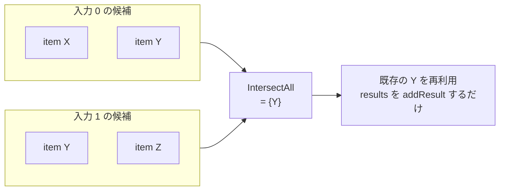

## 何を学んだか

`--export-cache` で書き出されるキャッシュは、solver から流れてくるレコードを直接 JSON にしているのではない。いったん `CacheChains` というメモリ上のグラフを組み立て、`Marshal` のときにまとめて直列化する。中間表現をもう 1 枚挟んでいる。

面白いのはその歴史のほうだ。かつて `CacheChains` は「レコードは順不同で入ってくる。あとから既存レコードにリンクが生えることもある」という前提で作られていて、`Marshal` の頭で `normalize()` という巨大な後始末パスを回していた。重複ノードのマージ、到達不能ノードの削除、閉路の除去がそこにまとまっていた。**2025 年 6 月の改修で、この正規化パスは丸ごと削除された。** 代わりに、重複の解消は `Add` の中で「各入力ごとの候補集合の積」を取ることで、挿入のたびにその場で行われるようになった。

## CacheChains は何を持っているか

構造体としては、根のマップ 1 個しかない。

```go title="cache/remotecache/v1/chains.go"
type CacheChains struct {
	roots map[digest.Digest]*item
}

var _ solver.CacheExporterTarget = &CacheChains{}
```

([cache/remotecache/v1/chains.go L27-L31](https://github.com/moby/buildkit/blob/ca4838f8ddbd3612bca94bcb8a938d8a326110a3/cache/remotecache/v1/chains.go#L27-L31))

`solver.CacheExporterTarget` は solver 側から見た「キャッシュの書き出し先」で、メソッドは 1 つだけだ。

```go title="solver/types.go"
// CacheExporterTarget defines object capable of receiving exports
type CacheExporterTarget interface {
	Add(dgst digest.Digest, deps [][]CacheLink, results []CacheExportResult) (CacheExporterRecord, bool, error)
}
```

([solver/types.go L132-L135](https://github.com/moby/buildkit/blob/ca4838f8ddbd3612bca94bcb8a938d8a326110a3/solver/types.go#L132-L135))

`deps` は「入力番号ごとの、依存レコードとセレクタの組の配列」。`[][]CacheLink` の外側の添字が入力番号 (`ExecOp` の mount 番号などに対応する) で、内側が「その入力に到達しうる複数のキー」だ。1 つの入力に複数のリンクが並ぶのは、[fast cache と slow cache](../fast-slow-cache/) のように 1 つの頂点が複数のキーを生むためである。

ノードは `item` で、リンクは双方向に張られる。

```go title="cache/remotecache/v1/chains.go"
type item struct {
	solver.CacheExporterRecordBase

	id string

	// dgst is the unique identifier for each record.
	// This *roughly* corresponds to an edge (vertex cachekey + index) in the
	// solver - however, a single vertex can produce multiple unique cache keys
	// (e.g. fast/slow), so it's a one-to-many relation.
	dgst digest.Digest

	children map[unique.Handle[linkv2]]map[*item]struct{}

	parents []map[link]struct{}

	results []solver.CacheExportResult

	cc *CacheChains
}
```

([cache/remotecache/v1/chains.go L294-L312](https://github.com/moby/buildkit/blob/ca4838f8ddbd3612bca94bcb8a938d8a326110a3/cache/remotecache/v1/chains.go#L294-L312))

名前に一度つまずくところがある。**`parents` が依存 (入力) 側、`children` が依存されている側**だ。`addChild` の呼ばれ方を見ると分かる。

```go title="cache/remotecache/v1/chains.go"
			d.Src.(*item).addChild(r, i, d.Selector)
```

([cache/remotecache/v1/chains.go L177](https://github.com/moby/buildkit/blob/ca4838f8ddbd3612bca94bcb8a938d8a326110a3/cache/remotecache/v1/chains.go#L177))

いま追加しようとしているレコード `r` が、依存 `d.Src` の「子」として登録される。だから `roots` は「依存を持たないレコード」= ソース系のキー、`leaves()` が返すのは「誰からも依存されていないレコード」= ビルドの終端になる。データの流れの向きとは逆の言葉づかいなので、読むときは毎回確認したほうがよい。

`children` のキーは `linkv2` を `unique.Make` で内部化したハンドルだ。

```go title="cache/remotecache/v1/chains.go"
type linkv2 struct {
	selector string
	index    int
	digest   digest.Digest
}
```

([cache/remotecache/v1/chains.go L285-L289](https://github.com/moby/buildkit/blob/ca4838f8ddbd3612bca94bcb8a938d8a326110a3/cache/remotecache/v1/chains.go#L285-L289))

「どの入力番号として、どのセレクタで、どのダイジェストのレコードに繋がっているか」の 3 つ組。Go 1.23 の `unique` パッケージでハンドルにしているので、比較もマップのキーもポインタ 1 語で済む。

## Add が挿入時に重複を潰す

`Add` の本体は、この 3 つ組を使った候補集合の絞り込みである。

```go title="cache/remotecache/v1/chains.go"
	matchDeps := make([]func() map[*item]struct{}, len(deps))
	for i, dd := range deps {
		// ...
		matchDeps[i] = func() map[*item]struct{} {
			candidates := map[*item]struct{}{}
			for _, it := range items {
				maps.Copy(candidates, it.Src.children[unique.Make(linkv2{
					selector: it.Selector,
					index:    i,
					digest:   dgst,
				})])
			}
			return candidates
		}
	}
	items := IntersectAll(matchDeps)
```

([cache/remotecache/v1/chains.go L74-L109](https://github.com/moby/buildkit/blob/ca4838f8ddbd3612bca94bcb8a938d8a326110a3/cache/remotecache/v1/chains.go#L74-L109))

入力番号 `i` ごとに「その依存の子のうち、`(selector, i, dgst)` というリンクで繋がっているもの」を集める。それを全入力について積を取る。



積が空でなければ、**そのレコードは既に存在する**。新しい `item` を作らず、既存のものに `results` を足すだけで済む。ここが、かつて `normalizeItem` が後段でやっていた重複マージの置き換えにあたる。`IntersectAll` は積が空になった時点で打ち切る素直な実装だ ([cache/remotecache/v1/chains.go L183-L205](https://github.com/moby/buildkit/blob/ca4838f8ddbd3612bca94bcb8a938d8a326110a3/cache/remotecache/v1/chains.go#L183-L205))。

依存が 0 個のレコード (ソース) は、そもそも `roots` マップで digest 一意になるので積を取るまでもない ([cache/remotecache/v1/chains.go L63-L72](https://github.com/moby/buildkit/blob/ca4838f8ddbd3612bca94bcb8a938d8a326110a3/cache/remotecache/v1/chains.go#L63-L72))。

積の要素が 2 つ以上になることもある。その場合はどれか 1 つを `main` に選び、他のノードの子リンクと結果を `main` に寄せて 1 本に潰す ([cache/remotecache/v1/chains.go L111-L147](https://github.com/moby/buildkit/blob/ca4838f8ddbd3612bca94bcb8a938d8a326110a3/cache/remotecache/v1/chains.go#L111-L147))。この分岐が入ったのは `remotecache: add merge keys for loops` (846a4ccd1) で、それ以前は `errors.Errorf("TODO: multiple matching dependencies ...")` で落ちていた。

先頭には、キャッシュに載せてはいけないキーを弾く早期 return がある。

```go title="cache/remotecache/v1/chains.go"
	if strings.HasPrefix(dgst.String(), "random:") {
		return nil, false, nil
	}
```

([cache/remotecache/v1/chains.go L54-L56](https://github.com/moby/buildkit/blob/ca4838f8ddbd3612bca94bcb8a938d8a326110a3/cache/remotecache/v1/chains.go#L54-L56))

`random:` 前綴のダイジェストは毎回変わるので、書き出しても二度と当たらない。返り値の 2 つ目 `bool` が false になり、呼び出し側 (`solver/exporter.go`) はそのレコードをリンクの元にしない。

## Marshal は葉から辿る

直列化は葉集合から始まる。

```go title="cache/remotecache/v1/chains.go"
func (c *CacheChains) Marshal(ctx context.Context) (*cacheimporttypes.CacheConfig, DescriptorProvider, error) {
	st := &marshalState{ /* ... */ }

	for it := range c.leaves() {
		if err := marshalItem(ctx, it, st); err != nil {
			return nil, nil, err
		}
	}

	cc := cacheimporttypes.CacheConfig{
		Layers:  st.layers,
		Records: st.records,
	}
	sortConfig(&cc)

	return &cc, st.descriptors, nil
}
```

([cache/remotecache/v1/chains.go L213-L233](https://github.com/moby/buildkit/blob/ca4838f8ddbd3612bca94bcb8a938d8a326110a3/cache/remotecache/v1/chains.go#L213-L233))

`leaves()` は `roots` から `walkChildren` で全体を歩き、子を持たないノードを集める ([cache/remotecache/v1/chains.go L39-L51](https://github.com/moby/buildkit/blob/ca4838f8ddbd3612bca94bcb8a938d8a326110a3/cache/remotecache/v1/chains.go#L39-L51))。そこから `marshalItem` が `parents` を再帰的に降りて、後行順でレコード配列に詰める。`sortConfig` が何をしているかは [content-addressable な config の決定性](../cache-config-determinism/) で扱う。

`Marshal` は破壊的ではないので何度でも呼べる。テストは、同じレコードを 2 回 `Add` しても `Marshal` の結果が変わらないことを確認している ([cache/remotecache/v1/chains_test.go L77-L83](https://github.com/moby/buildkit/blob/ca4838f8ddbd3612bca94bcb8a938d8a326110a3/cache/remotecache/v1/chains_test.go#L77-L83))。

## なぜそうなっているか

削除された `normalize()` は、こういう構造だった。

```go title="cache/remotecache/v1/chains.go (2d7ef04df 以前)"
func (c *CacheChains) normalize(ctx context.Context) error {
	st := &normalizeState{ /* ... */ }

	validated := make([]*item, 0, len(c.items))
	for _, it := range c.items {
		it.backlinksMu.Lock()
		it.validate()
		it.backlinksMu.Unlock()
	}
	// ... invalid なものを落とす
	for _, it := range c.items {
		_, err := normalizeItem(it, st)
		// ...
	}

	st.removeLoops(ctx)
	// ...
}
```

`validate` が「入力番号のどれかにリンクが 1 本も無いレコード」を無効化してバックリンク経由で伝播させ、`normalizeItem` が重複ノードを 1 つに寄せ、`removeLoops` が閉路を切る。3 つの後始末が直列に並んでいた。`item` に `backlinksMu sync.Mutex` があることから分かるとおり、この時期の `CacheChains` は**並行に、任意の順序で書き換えられる**前提だった。旧 API は `Add(dgst)` でレコードを作り、あとから `LinkFrom` / `AddResult` を呼ぶ形だったからだ。

改修のコミットメッセージがそのまま理由になっている。

> Main aspect is to provide a strictly ordered walk of the cache tree instead of previous one where modification could be added to cache tree at any time by any component.
>
> This should address subtle concurrency issues and remove large parts of complicated (and likely buggy) normalization and deduplication steps.

([2d7ef04df](https://github.com/moby/buildkit/commit/2d7ef04dfd0defe3120a29a5711e36ffbe6c1c11))

「グラフの走査を厳密に順序づける」ことと「正規化を消す」ことは同じ 1 つの変更だ。`Add(dgst, deps, results)` というシグネチャは、**依存が先に `Add` 済みでなければリンクを張れない**という順序を型で強制している。実際 `Add` は、渡された `CacheLink.Src` が `*item` であること、しかも同じ `CacheChains` に属することを検査して弾く。

```go title="cache/remotecache/v1/chains.go"
			it, ok := d.Src.(*item)
			if !ok {
				return nil, false, errors.Errorf("invalid dependency type %T for %s", d.Src, dgst)
			}
			if it.cc != c {
				return nil, false, errors.Errorf("dependency %s is not part of the same cache chain", it.dgst)
			}
```

([cache/remotecache/v1/chains.go L85-L91](https://github.com/moby/buildkit/blob/ca4838f8ddbd3612bca94bcb8a938d8a326110a3/cache/remotecache/v1/chains.go#L85-L91))

依存が確定した状態でしか挿入できないなら、挿入時点で「同じ依存集合を持つ既存ノード」を引けるので、後段のマージは要らなくなる。「入力番号のどれかにリンクが無い」という不完全な状態も作れないので `validate` も要らない。旧 API にあった `Visit` / `Visited` (エクスポート済みの目印を外部に持たせるためのメソッド) も、同時に削除されている。

残ったのは、これらで消せない 1 つ — 閉路だけだ。それは [循環をどこで切るか](../cycle-breaking/) で扱う。

## どう活かすか

**「入れる順序を縛れるなら、後段の正規化は消える」**という交換関係がここにある。一般に、グラフを組み立てる API には 2 つの形がある。

1. ノードを先に全部作り、あとから辺を張る。呼び出し側は楽だが、途中経過は常に不完全でありうる。整合性は最後にまとめて回復するしかない
2. 辺の行き先が確定してからノードを作る。呼び出し側は依存順に走査する義務を負うが、**不完全な状態がそもそも表現できない**

BuildKit は 1 から 2 へ移った。移ったことで、正規化・重複排除・無効ノードの伝播という 3 つのパスが `Add` の中の数十行に畳まれた。API の返り値が `(record, ok, error)` の 3 つ組になり、`ok=false` で「このレコードは受け取らなかった」を表現できるようになったのも、判断を挿入時点に寄せた結果である。

自分のコードで「最後に整合性を取り直す関数」が育っているなら、それは組み立て API の順序が緩すぎるサインかもしれない。正規化パスのバグは、入力が壊れているのか正規化が壊れているのか切り分けにくいという性質があり、そこが `likely buggy` と書かれた理由だと読める。順序を縛れるかどうかを先に検討する価値がある。

関連するページ: エクスポート側から見た呼び出し元は [キャッシュのエクスポート](../cache-export/)、読み込み側で `CacheChains` が `CacheKeyStorage` に変わるところは [manifest がある世界とない世界](../remotecache-backends/) を参照。
