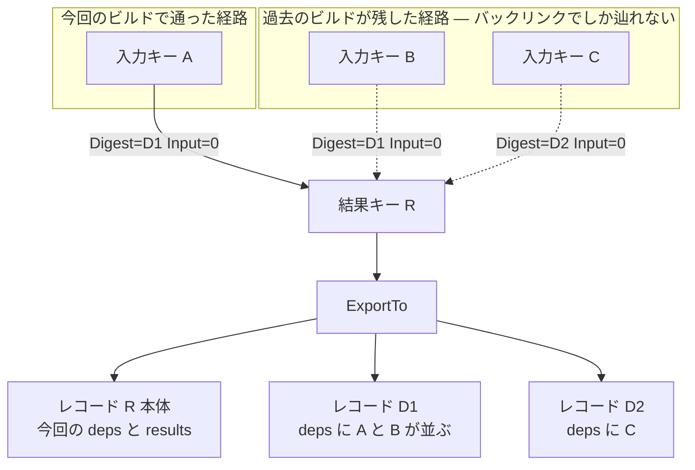

## 何を学んだか

キャッシュのエクスポートは「今回のビルドの記録を書き出す」処理に見えるが、実際には 2 方向に広がる。

- **下向き** — `CacheKey.deps` を再帰的に辿り、入力のキーとその結果を書き出す。これが「通った経路」。
- **横向き** — キャッシュ DB のバックリンクを辿り、**同じ結果キーに至る、今回のビルドが通らなかった経路も書き出す**。

2 つ目は `CacheExportOpt.IgnoreBacklinks` で切れる。フィールドのコメントが挙動をそのまま説明している。

```go title="solver/types.go"
	// IgnoreBacklinks defines if other cache chains for same result that did not
	// participate in the current build should be exported.
	IgnoreBacklinks bool
```

([solver/types.go L122-L124](https://github.com/moby/buildkit/blob/ca4838f8ddbd3612bca94bcb8a938d8a326110a3/solver/types.go#L122-L124))

「今回のビルドに参加しなかった、同じ結果に対する他のキャッシュチェーン」。デフォルトは `false`、つまり**書き出す**。

## エクスポートの入口

エクスポータはキーに貼り付いている。`ExportableCacheKey` が `*CacheKey` と `CacheExporter` の組で ([solver/types.go L249-L254](https://github.com/moby/buildkit/blob/ca4838f8ddbd3612bca94bcb8a938d8a326110a3/solver/types.go#L249-L254))、実体は `exporter` 構造体になる。

```go title="solver/exporter.go"
type exporter struct {
	k             *CacheKey
	records       []*CacheRecord
	record        *CacheRecord
	recordCtxOpts func(context.Context) context.Context

	edge     *edge // for secondaryExporters
	override *bool
}
```

([solver/exporter.go L12-L20](https://github.com/moby/buildkit/blob/ca4838f8ddbd3612bca94bcb8a938d8a326110a3/solver/exporter.go#L12-L20))

`record` は「このキーで確定した 1 件」(`Save` 直後や `loadCache` 直後に入る)、`records` は「候補の一覧」(`recalcCurrentState` が `Records` の結果を渡す)。両方あるときは `record` が優先され、無ければ `records` を新しい順に試す ([solver/exporter.go L141-L160](https://github.com/moby/buildkit/blob/ca4838f8ddbd3612bca94bcb8a938d8a326110a3/solver/exporter.go#L141-L160))。並べ替えの基準はこうなっている。

```go title="solver/exporter.go"
func compareCacheRecord(a, b *CacheRecord) int {
	// ...
	if v := b.CreatedAt.Compare(a.CreatedAt); v != 0 {
		return v
	}
	return a.Priority - b.Priority
}
```

([solver/exporter.go L324-L338](https://github.com/moby/buildkit/blob/ca4838f8ddbd3612bca94bcb8a938d8a326110a3/solver/exporter.go#L324-L338))

`b.CreatedAt.Compare(a.CreatedAt)` なので**新しい方が先**。同時刻なら `Priority` の小さい方が先になる。

書き出し先はインターフェース 1 本しかない。

```go title="solver/types.go"
// CacheExporterTarget defines object capable of receiving exports
type CacheExporterTarget interface {
	Add(dgst digest.Digest, deps [][]CacheLink, results []CacheExportResult) (CacheExporterRecord, bool, error)
}
```

([solver/types.go L132-L135](https://github.com/moby/buildkit/blob/ca4838f8ddbd3612bca94bcb8a938d8a326110a3/solver/types.go#L132-L135))

`deps [][]CacheLink` の形が `CacheKey.deps` と同じ二重スライスになっている ([キャッシュキーの合成](../cachekey-composition/))。**エクスポート形式もキーの構造をそのまま保つ。** 実装は `CacheChains` で、そこで DAG が組み直される ([キャッシュチェーンの構築](../cache-chains/))。

## 下向き — deps の再帰

```go title="solver/exporter.go"
	srcs := make([][]CacheLink, len(deps))

	for i, deps := range deps {
		for _, dep := range deps {
			rec, err := dep.CacheKey.Exporter.ExportTo(ctx, t, opt)
			if err != nil {
				continue
			}
			for _, r := range rec {
				srcs[i] = append(srcs[i], CacheLink{Src: r, Selector: string(dep.Selector)})
			}
		}
	}
```

([solver/exporter.go L234-L246](https://github.com/moby/buildkit/blob/ca4838f8ddbd3612bca94bcb8a938d8a326110a3/solver/exporter.go#L234-L246))

入力ごとの許容キーそれぞれに `ExportTo` を再帰させ、返ってきたレコードを `srcs[i]` に積む。**入力 1 つに複数の `CacheLink` が並ぶ**ので、エクスポート先でも OR 構造が保たれる。

エラーは `continue` で無視される。1 本の経路が書き出せなくても、他の経路が残れば十分だからだ。

書き出さない判定はこうなっている。

```go title="solver/exporter.go"
	// validate deps are present
	for _, deps := range srcs {
		if len(deps) == 0 {
			res[e] = nil
			return res[e], nil
		}
	}
```

([solver/exporter.go L269-L275](https://github.com/moby/buildkit/blob/ca4838f8ddbd3612bca94bcb8a938d8a326110a3/solver/exporter.go#L269-L275))

**入力のうち 1 つでも書き出せなかったら、このレコード自体を書き出さない。** 入力が欠けたレコードはインポート時に一致判定ができないので、あっても害にしかならない。同じ検査が `addBacklinks` にもある ([solver/exporter.go L65-L74](https://github.com/moby/buildkit/blob/ca4838f8ddbd3612bca94bcb8a938d8a326110a3/solver/exporter.go#L65-L74))。

edge がマージされていた場合は、マージされた側のキーも入力として足される。

```go title="solver/exporter.go"
	if e.edge != nil {
		for _, de := range e.edge.secondaryExporters {
			recs, err := de.cacheKey.CacheKey.Exporter.ExportTo(mainCtx, t, opt)
			if err != nil {
				continue
			}
			for _, r := range recs {
				srcs[de.index] = append(srcs[de.index], CacheLink{Src: r, Selector: de.cacheKey.Selector.String()})
			}
		}
	}
```

([solver/exporter.go L248-L258](https://github.com/moby/buildkit/blob/ca4838f8ddbd3612bca94bcb8a938d8a326110a3/solver/exporter.go#L248-L258))

`secondaryExporters` はスケジューラが edge をマージするときに移し替える ([solver/scheduler.go L312-L324](https://github.com/moby/buildkit/blob/ca4838f8ddbd3612bca94bcb8a938d8a326110a3/solver/scheduler.go#L312-L324))。マージで消えた edge が持っていた入力キーが、ここで生き返る。**マージは実行を減らすが、キャッシュの記録は減らさない** ([edge のマージ](../edge-merge/))。

## 横向き — バックリンクを辿る

```go title="solver/exporter.go"
	if !opt.IgnoreBacklinks {
		for cm, id := range k.ids {
			_, err := addBacklinks(t, cm, id, bkm)
			if err != nil {
				return nil, err
			}
		}
	}
```

([solver/exporter.go L260-L267](https://github.com/moby/buildkit/blob/ca4838f8ddbd3612bca94bcb8a938d8a326110a3/solver/exporter.go#L260-L267))

`k.ids` はキャッシュマネージャごとの ID の map だ。それぞれについて `addBacklinks` を呼ぶ。

```go title="solver/exporter.go"
	m := map[digest.Digest][][]CacheLink{}
	isRoot := true
	if err := cm.backend.WalkBacklinks(id, func(id string, link CacheInfoLink) error {
		isRoot = false
		recs, err := addBacklinks(t, cm, id, bkm)
		if err != nil { // TODO: should we continue on error?
			return err
		}
		links := m[link.Digest]
		for int(link.Input) >= len(links) {
			links = append(links, nil)
		}
		for _, rec := range recs {
			links[int(link.Input)] = append(links[int(link.Input)], CacheLink{Src: rec, Selector: link.Selector.String()})
		}
		m[link.Digest] = links
		return nil
	}); err != nil {
		return nil, err
	}
```

([solver/exporter.go L31-L50](https://github.com/moby/buildkit/blob/ca4838f8ddbd3612bca94bcb8a938d8a326110a3/solver/exporter.go#L31-L50))

やっていることを言葉にすると、こうなる。**「この結果キー ID に入ってくる辺」をすべて列挙し、辺のラベルの `Digest` (= その辺を張った Op の同一性) ごとにグループ化して、各グループを 1 つのレコードとして書き出す。**

`m` のキーが `link.Digest` であることが決定的だ。同じ結果キーに、**別々の Op から辺が入っている**ことがある。それぞれが独立した「この Op をこの入力で実行するとこの結果が出る」という知識なので、別レコードとして書き出す価値がある。



今回のビルドで A から R に到達したとしても、DB に B や C からの辺が残っていれば、それらもエクスポート対象になる。**エクスポートされたキャッシュを取り込んだ別のマシンは、B や C の経路でもヒットできる。**

葉に着いたときの扱いも見ておく。

```go title="solver/exporter.go"
	if isRoot {
		dgst, err := digest.Parse(id)
		if err == nil {
			rec, ok, err := t.Add(dgst, nil, nil)
			// ...
		}
	}
```

([solver/exporter.go L52-L63](https://github.com/moby/buildkit/blob/ca4838f8ddbd3612bca94bcb8a938d8a326110a3/solver/exporter.go#L52-L63))

入ってくる辺が 1 本も無ければ root だ。root のキー ID は `rootKey()` が作った digest 文字列なので `digest.Parse` が通る。合成キーの ID は `identity.NewID()` の base36 文字列なのでパースに失敗し、その場合は何も書かれない。**「ID が digest としてパースできるか」で root かどうかを再確認している。**

## 重複排除と循環の防止

再帰があるので、同じキーを 2 度書き出さない工夫が要る。エクスポートは 2 つの map を `context.Context` に載せて共有する。

```go title="solver/exporter.go"
var (
	backlinkKey = contextT("solver/exporter/backlinks")
	resKey      = contextT("solver/exporter/res")
)
```

([solver/exporter.go L96-L99](https://github.com/moby/buildkit/blob/ca4838f8ddbd3612bca94bcb8a938d8a326110a3/solver/exporter.go#L96-L99))

`res map[*exporter][]CacheExporterRecord` はエクスポータ単位のメモ。

```go title="solver/exporter.go"
	if v, ok := res[e]; ok {
		return v, nil
	}
	res[e] = nil
```

([solver/exporter.go L118-L121](https://github.com/moby/buildkit/blob/ca4838f8ddbd3612bca94bcb8a938d8a326110a3/solver/exporter.go#L118-L121))

**再帰に入る前に `nil` を入れておく。** 循環があって同じエクスポータに戻ってきたら、`ok` が真になって `nil` が返り、そこで止まる。DAG なので本来循環しないはずだが、キーのマージやバックリンクによって輪ができうる。

`bkm map[string][]CacheExporterRecord` も同じ形で、しかも「未訪問」「処理中」「完了」を 3 状態で区別している。

```go title="solver/exporter.go"
func addBacklinks(t CacheExporterTarget, cm *cacheManager, id string, bkm map[string][]CacheExporterRecord) ([]CacheExporterRecord, error) {
	out, ok := bkm[id]
	if ok && out != nil {
		return out, nil
	} else if ok && out == nil {
		return nil, nil
	}
	bkm[id] = nil
```

([solver/exporter.go L22-L29](https://github.com/moby/buildkit/blob/ca4838f8ddbd3612bca94bcb8a938d8a326110a3/solver/exporter.go#L22-L29))

`ok && out != nil` は完了済みで結果あり、`ok && out == nil` は処理中または結果なし、`!ok` は未訪問。map の「キーの有無」と「値が nil か」で 3 状態を表現している。

map を引数ではなく `context.Context` で運んでいるのは、`mergedExporter` を挟んで複数のエクスポータが 1 回のエクスポートに参加するためだ ([solver/exporter.go L340-L353](https://github.com/moby/buildkit/blob/ca4838f8ddbd3612bca94bcb8a938d8a326110a3/solver/exporter.go#L340-L353))。インターフェース `CacheExporter.ExportTo` のシグネチャを変えずに、呼び出し全体で状態を共有する手段になっている。

## モード — どこまで書き出すか

```go title="solver/types.go"
const (
	// CacheExportModeMin exports a topmost allowed vertex and its dependencies
	// that already have transferable layers
	CacheExportModeMin CacheExportMode = iota
	// CacheExportModeMax exports all possible non-root vertexes
	CacheExportModeMax
	// CacheExportModeRemoteOnly only exports vertexes that already have
	// transferable layers
	CacheExportModeRemoteOnly
)
```

([solver/types.go L98-L107](https://github.com/moby/buildkit/blob/ca4838f8ddbd3612bca94bcb8a938d8a326110a3/solver/types.go#L98-L107))

`min` と `max` の差は、1 行の書き換えで実現されている。

```go title="solver/exporter.go"
	if remote != nil && opt.Mode == CacheExportModeMin {
		opt.Mode = CacheExportModeRemoteOnly
	}
```

([solver/exporter.go L230-L232](https://github.com/moby/buildkit/blob/ca4838f8ddbd3612bca94bcb8a938d8a326110a3/solver/exporter.go#L230-L232))

`opt` は値渡しなので、この書き換えは**この呼び出しより下 (= 入力側) の再帰にだけ効く**。意味はこうなる。「この頂点の結果が既に転送可能なレイヤになっていたら、そこから下は『既にレイヤを持っているものだけ』書き出す」。最終イメージのレイヤは持っているが、中間ステージのファイルシステムはレイヤ化していない、という典型的な状況で、`min` は最終レイヤだけを書き出して止まる。

`max` は書き換えが起きないので、再帰の全域で通常モードのままになり、中間結果も `opt.ResolveRemotes` でレイヤ化されて書き出される ([solver/exporter.go L190-L217](https://github.com/moby/buildkit/blob/ca4838f8ddbd3612bca94bcb8a938d8a326110a3/solver/exporter.go#L190-L217))。**モードの違いが分岐の網ではなく、再帰に渡す値の書き換え 1 箇所に集約されている。**

root を書き出すかどうかは別のフラグになる。

```go title="solver/exporter.go"
	exportRecord := opt.ExportRoots
	if len(deps) > 0 {
		exportRecord = true
	}
```

([solver/exporter.go L136-L139](https://github.com/moby/buildkit/blob/ca4838f8ddbd3612bca94bcb8a938d8a326110a3/solver/exporter.go#L136-L139))

入力を持つ頂点は常に書き出す。root (ベースイメージや git ソース) は `ExportRoots` 次第になる。root の結果はレジストリから引き直せるので、キャッシュに含める必要が薄い。

## IgnoreBacklinks が切られる唯一の場所

`IgnoreBacklinks: true` を指定しているのは provenance の生成だけだ。

```go title="solver/llbsolver/provenance.go"
				ExportRoots:     true,
				IgnoreBacklinks: true,
```

([solver/llbsolver/provenance.go L486-L487](https://github.com/moby/buildkit/blob/ca4838f8ddbd3612bca94bcb8a938d8a326110a3/solver/llbsolver/provenance.go#L486-L487))

provenance は「このビルドが実際に何を使ったか」の証明書なので ([provenance](../provenance/))、通らなかった経路が混ざってはいけない。逆に `ExportRoots: true` になっているのは、「どのベースイメージを使ったか」こそが証明したい情報だからだ。

**同じ `ExportTo` を、キャッシュ用と証明用の 2 つの目的で使い回し、2 つのフラグで振る舞いを切り替えている。** キャッシュ用は「使えるものは全部」、証明用は「使ったものだけ」で、要求が正反対になる。

## どう活かすか

**「実際に起きたこと」と「起こりえたこと」を分けて扱えるようにしておく。** キャッシュとしては後者が価値を持ち、監査としては前者しか許されない。BuildKit は同じ探索コードにフラグ 1 つを足して両方を賄った。記録を残す仕組みを作るときは、どちらの意味で使われるかを最初に決め、切り替えられるようにしておくと後で分岐が増えない。

**再帰の重複排除は「処理中」を表現できる形にする。** `map[K]V` で「未訪問 / 処理中 / 完了」を区別するには、キーの有無と値の nil を組み合わせるか、明示的な状態を持つ。BuildKit は前者を選び、再帰に入る直前に `nil` を書くことで循環を止めている。値を返す再帰でメモ化するときの定型として使える。

**再帰に渡すオプションの書き換えで、モードの伝播を表す。** `opt` を値渡しにして途中で書き換えると、「ここから下は別のモード」が 1 行で書ける。呼び出し側にモードごとの分岐を並べるより、変化する条件が 1 箇所に集まるので追いやすい。
