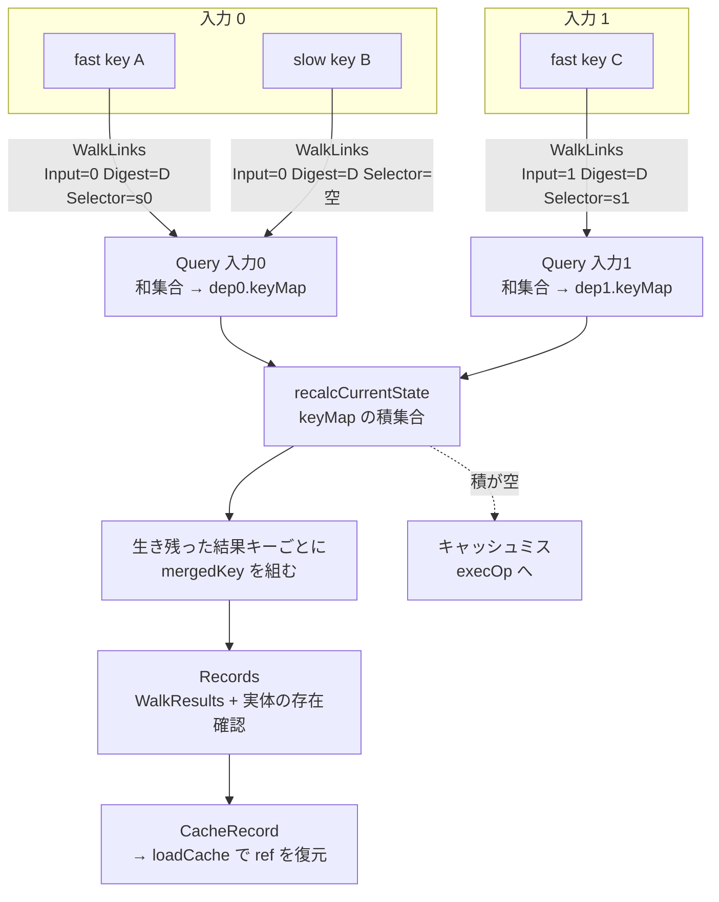

## 何を学んだか

キャッシュ検索の実体は、2 段階の集合演算になっている。

1. **入力ごとに和を取る** — `cacheManager.Query` は「1 つの入力について許容されるキーの一覧」を受け取り、それぞれからリンクを辿って結果キーを集める。**和集合**になる。
2. **入力を跨いで積を取る** — `edge.recalcCurrentState` が、すべての入力の候補集合の**積集合**を取る。全入力から到達できた結果キーだけが生き残る。

そして、この構造は単純なハッシュ合成では置き換えられない。**同じ結果に到達する入力キーの組み合わせが複数ありうる**からだ。ハッシュ合成は「入力キーの組 1 つ」から「結果キー 1 つ」への関数だが、実際に必要なのは「入力キーの集合の組」から「結果キーの集合」への写像になる。

## Query は 1 つの入力についての問い合わせ

シグネチャを正確に読むのが重要になる。

```go title="solver/types.go"
	// Query searches for cache paths from one cache key to the output of a
	// possible match.
	Query(inp []CacheKeyWithSelector, inputIndex Index, dgst digest.Digest, outputIndex Index) ([]*CacheKey, error)
```

([solver/types.go L288-L290](https://github.com/moby/buildkit/blob/ca4838f8ddbd3612bca94bcb8a938d8a326110a3/solver/types.go#L288-L290))

`inp` はスライスだが、`inputIndex` は 1 つしかない。つまり `inp` の要素はすべて**同じ入力番号についての候補キー**だ。「入力 0 の候補は A か B、入力 1 の候補は C」という状況を 1 回の `Query` で問い合わせることはできない。呼び出し側は入力ごとに `Query` を呼ぶ。

```go title="solver/edge.go"
func (e *edge) probeCache(d *dep, depKeys []CacheKeyWithSelector) bool {
	if len(depKeys) == 0 {
		return false
	}
	if e.op.IgnoreCache() {
		return false
	}
	keys, err := e.op.Cache().Query(depKeys, d.index, e.cacheMap.Digest, e.edge.Index)
	if err != nil {
		e.err = errors.Wrap(err, "error on cache query")
	}
	found := false
	for _, k := range keys {
		k.vtx = e.edge.Vertex.Digest()
		if _, ok := d.keyMap[k.ID]; !ok {
			d.keyMap[k.ID] = k
			found = true
		}
	}
	return found
}
```

([solver/edge.go L194-L216](https://github.com/moby/buildkit/blob/ca4838f8ddbd3612bca94bcb8a938d8a326110a3/solver/edge.go#L194-L216))

`d` は 1 つの `dep` (= 1 つの入力) で、結果は `d.keyMap` に蓄積される。**`keyMap` は「この入力から到達できた結果キーの集合」**になる。返り値の `found` は「新しいキーが増えたか」だけを表し、キーそのものは `dep` に溜まっていく。

## Query の中身 — リンクを辿って和を取る

```go title="solver/cachemanager.go"
	allRes := map[string]*CacheKey{}
	for _, d := range allDeps {
		if err := c.backend.WalkLinks(c.getID(d.key.CacheKey.CacheKey), CacheInfoLink{input, output, dgst, d.key.Selector}, func(id string) error {
			d.results[id] = struct{}{}
			if _, ok := allRes[id]; !ok {
				allRes[id] = c.newKeyWithID(id, dgst, output)
			}
			return nil
		}); err != nil {
			return nil, err
		}
	}
```

([solver/cachemanager.go L100-L111](https://github.com/moby/buildkit/blob/ca4838f8ddbd3612bca94bcb8a938d8a326110a3/solver/cachemanager.go#L100-L111))

`WalkLinks(id, link, fn)` は「キー `id` から、ラベル `link` の辺を辿って行ける先」を列挙する。ラベルは 4 つ組だ。

```go title="solver/cachestorage.go"
// CacheInfoLink is a link between two cache keys
type CacheInfoLink struct {
	Input    Index         `json:"Input,omitempty"`
	Output   Index         `json:"Output,omitempty"`
	Digest   digest.Digest `json:"Digest,omitempty"`
	Selector digest.Digest `json:"Selector,omitempty"`
}
```

([solver/cachestorage.go L38-L44](https://github.com/moby/buildkit/blob/ca4838f8ddbd3612bca94bcb8a938d8a326110a3/solver/cachestorage.go#L38-L44))

`Digest` はこの Op の `CacheMap.Digest`、`Input` は入力番号、`Output` は出力番号、`Selector` は入力に付いたセレクタ。**辺のラベルに「消費する側の同一性」が全部入っている**ので、同じ入力キーから多数の Op に向かう辺が生えていても混ざらない。

各候補キーからの結果を `allRes` に**足していく**ので、これは和集合だ。1 つの入力について「fast key でも slow key でも、どちらかで辿り着ければよい」という OR がここで実現される。

入力を持たない Op は特別扱いになる。

```go title="solver/cachemanager.go"
	if len(deps) == 0 {
		if !c.backend.Exists(rootKey(dgst, output).String()) {
			return nil, nil
		}
		return []*CacheKey{c.newRootKey(dgst, output)}, nil
	}
```

([solver/cachemanager.go L129-L134](https://github.com/moby/buildkit/blob/ca4838f8ddbd3612bca94bcb8a938d8a326110a3/solver/cachemanager.go#L129-L134))

root だけは `Exists` による直接引きになる。グラフに辺がないので、探索も要らない。

## 積集合は edge 側で取る

入力を跨いだ AND は `recalcCurrentState` にある。

```go title="solver/edge.go"
func (e *edge) recalcCurrentState() {
	// TODO: fast pass to detect incomplete results
	newKeys := map[string]*CacheKey{}

	for i, dep := range e.deps {
		if i == 0 {
			for id, k := range dep.keyMap {
				if _, ok := e.keyMap[id]; ok {
					continue
				}
				newKeys[id] = k
			}
		} else {
			for id := range newKeys {
				if _, ok := dep.keyMap[id]; !ok {
					delete(newKeys, id)
				}
			}
		}
		if len(newKeys) == 0 {
			break
		}
	}
```

([solver/edge.go L424-L446](https://github.com/moby/buildkit/blob/ca4838f8ddbd3612bca94bcb8a938d8a326110a3/solver/edge.go#L424-L446))

入力 0 の `keyMap` で候補を作り、入力 1 以降で落としていく。`e.keyMap` は「この edge で既に処理済みのキー」で、同じキーを 2 度処理しないための記録だ。途中で空になったら `break` する。

生き残ったキーごとに、許容キーを揃えた合成キーを作り、そのキーで結果レコードを引く。

```go title="solver/edge.go"
	for _, r := range newKeys {
		// TODO: add all deps automatically
		mergedKey := r.clone()
		mergedKey.deps = make([][]CacheKeyWithSelector, len(e.deps))
		// ... 入力ごとに result.CacheKeys() と slowCacheKey を詰める ...

		records, err := e.op.Cache().Records(context.Background(), mergedKey)
		// ...
		for _, r := range records {
			if _, ok := e.cacheRecordsLoaded[r.ID]; !ok {
				e.cacheRecords[r.ID] = r
			}
		}

		e.keys = append(e.keys, e.makeExportable(mergedKey, records))
	}
```

([solver/edge.go L452-L484](https://github.com/moby/buildkit/blob/ca4838f8ddbd3612bca94bcb8a938d8a326110a3/solver/edge.go#L452-L484))

`Records` はキー ID から結果を引く。ここで初めて「実際にロード可能な ref」の存在が確認される。

```go title="solver/cachemanager.go"
	outs := make([]*CacheRecord, 0)
	if err := c.backend.WalkResults(c.getID(ck), func(r CacheResult) error {
		if c.results.Exists(ctx, r.ID) {
			outs = append(outs, &CacheRecord{...})
		} else {
			c.backend.Release(r.ID)
		}
		return nil
	}); err != nil {
```

([solver/cachemanager.go L158-L173](https://github.com/moby/buildkit/blob/ca4838f8ddbd3612bca94bcb8a938d8a326110a3/solver/cachemanager.go#L158-L173))

`c.results.Exists` が偽なら `Release` する。**メタデータのグラフと実体 (ref) は別管理**なので、グラフ上に経路があっても実体が GC で消えていることがある。読むついでに掃除している。

## 全体の流れ



`Query` の返り値が結果キーであって結果そのものではないこと、`Records` がもう一段引くこと、この 2 段が分かれているのが構造上の要点になる。**グラフの探索 (キー空間) と実体の解決 (ref 空間) が分離されている。**

## メモリ上にも同じ探索がある

永続ストレージとは別に、実行中の solver は自前のインデックスを持つ。

```go title="solver/index.go"
func (ei *edgeIndex) getAllMatches(k *CacheKey) []string {
	deps := k.Deps()

	if len(deps) == 0 {
		return []string{rootKey(k.Digest(), k.Output()).String()}
	}
	// ...
	for i, dd := range deps {
		if i == 0 {
			for _, d := range dd {
				ll := CacheInfoLink{Input: Index(i), Digest: k.Digest(), Output: k.Output(), Selector: d.Selector}
				for _, ckID := range d.CacheKey.indexIDs {
					item, ok := ei.items[ckID]
					if ok {
						for l := range item.links[ll] {
							matches[l] = struct{}{}
						}
					}
				}
			}
			continue
		}

		if len(matches) == 0 {
			break
		}
		// 入力 i からも辿り着けないものを matches から落とす
	}
```

([solver/index.go L174-L238](https://github.com/moby/buildkit/blob/ca4838f8ddbd3612bca94bcb8a938d8a326110a3/solver/index.go#L174-L238))

構造は `getIDFromDeps` と同じで、辺のラベルも同じ `CacheInfoLink`。違いは辿る先が `ei.items` というメモリ上の map であることと、**マッチしたものを全部返す**ことだ。用途が「同じキーを持つ edge を見つけてマージする」なので、取りこぼすと同じ処理が 2 回走ってしまう ([edge のマージ](../edge-merge/))。

同じ探索が、永続層 (`cacheManager`)・メモリ層 (`edgeIndex`)・edge の状態計算 (`recalcCurrentState`) の 3 箇所に、それぞれ少しずつ違う目的で書かれている。共通化されていないのは、「1 つ返す / 全部返す / 積を取る」が微妙に違うからだと読める。

複数のキャッシュソースがあるときは、`combinedCacheManager` がそれぞれに並列で `Query` を投げ、結果 ID で束ねる。

```go title="solver/combinedcache.go"
			recs, err := c.Query(inp, inputIndex, dgst, outputIndex)
			// ...
			for _, r := range recs {
				if _, ok := keys[r.ID]; !ok || c == cm.main {
					keys[r.ID] = r
				}
			}
```

([solver/combinedcache.go L55-L65](https://github.com/moby/buildkit/blob/ca4838f8ddbd3612bca94bcb8a938d8a326110a3/solver/combinedcache.go#L55-L65))

`c == cm.main` のときだけ上書きするので、**同じ ID がローカルとリモートの両方から返ったらローカルを優先する**。ロードコストが安い方を選ぶための 1 行になっている。

## なぜハッシュ合成にできないか

素朴な設計なら、こう書きたくなる。

```
resultKey = H(opDigest, inputKey[0], inputKey[1], ...)
```

これが成立しない理由が 3 つある。

**入力ごとにキーが複数ある。** fast key と slow key が同時に立つので、上の式は「どの組み合わせを使うか」で複数の値を取る。入力が 2 つあって各々 2 個のキーを持てば 4 通りで、入力が増えると指数的に増える。全部計算して全部引くこともできるが、BuildKit は代わりに「入力ごとに和を取ってから積を取る」形にしている。この形なら計算量は入力数とキー数の積で済む。

**キーは時間とともに増える。** ある入力の slow key は、その入力を実行し終えるまで存在しない。ハッシュ合成方式だと「入力キーが揃ってから初めて結果キーが計算できる」ので、揃うまでキャッシュを一切引けない。リンク方式なら、分かっているキーから順に辺を辿って候補を絞れる。edge の状態機械が「まだ知らないキーがあるか」で動くのは、この漸進性を前提にしている ([edge の状態機械](../edge-state-machine/))。

**同じ結果に別経路から到達しうる。** 別のビルドが別の入力キーで同じ ref を作ったとき、それらは同じ結果キーに合流してほしい。ハッシュ合成では別の値になるので合流できない。リンク方式なら、既存の結果キー ID に新しい辺を張るだけで合流する ([キャッシュキーの合成](../cachekey-composition/))。

## どう活かすか

**「キーの集合」を扱うなら、和と積の 2 段に分解する。** 入力ごとに OR、入力を跨いで AND、という分解は、直積を列挙するより計算量が小さく、途中で空になったら打ち切れる。BuildKit は `if len(newKeys) == 0 { break }` と `if len(matches) == 0 { break }` を各所に置いて、この打ち切りを効かせている。

**探索の中間結果を「どこに溜めるか」を決めておく。** `dep.keyMap` は入力ごとの探索結果、`e.keyMap` は処理済みの記録、`e.cacheRecords` は実体が確認できたもの。3 つが別の map として明示されているので、「どこまで進んだか」がコードを読むだけで分かる。漸進的な探索では、この中間状態の置き場所が設計の中心になる。

**メタデータのグラフと実体を分離し、突き合わせは読み出し時に行う。** `Records` が `results.Exists` を毎回確認して、無ければその場で `Release` する。グラフと実体を強く同期させる代わりに、「グラフは楽観的に持ち、読むときに検証する」設計にしている。実体側が独立に GC されるシステムでは、この方が同期のコストが低くなる ([prune と GC](../prune-and-gc/))。
