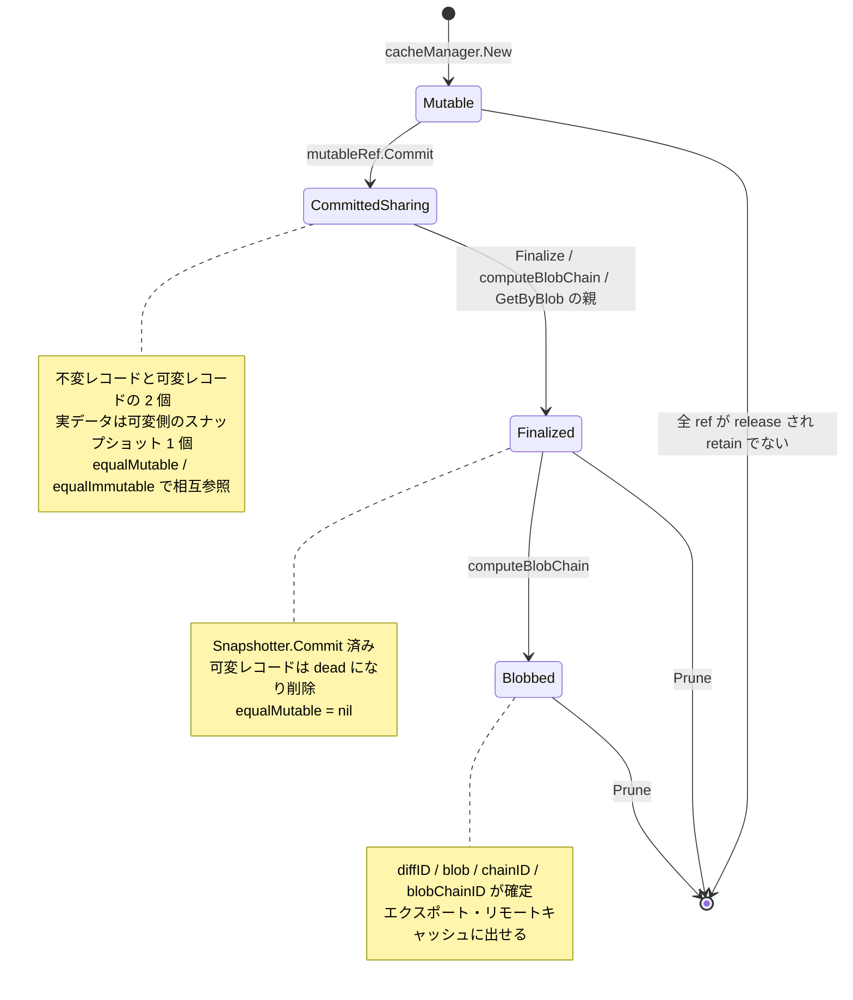

## 何を学んだか

BuildKit の `cache` パッケージには、「レイヤ 1 枚分のデータ」を表す `cacheRecord` と、それを掴む使い捨てのハンドル `immutableRef` / `mutableRef` の 2 層がある。ハンドルは `*cacheRecord` を埋め込んでいるだけで、固有の状態は「最終使用時刻を更新するか」「どの blob をどこから引けるか」といった呼び出し側の都合しか持たない。

そして「不変にする」操作が 2 つに割れている。`Commit` はメタデータ上で新しい不変レコードを作るだけで、スナップショットは依然として書き込み可能なまま元の mutable 側に残る。`Finalize` になって初めてスナップショッタに `Commit` を投げ、データが読み取り専用に固まり mutable 側が消える。この「まだデータを共有している 2 つのレコード」を両側から辿るために、`equalMutable` / `equalImmutable` という相互参照フィールドが要る。

## cacheRecord — 掴まれる側

```go title="cache/refs.go"
type cacheRecord struct {
	cm *cacheManager
	mu *sync.Mutex // the mutex is shared by records sharing data

	mutable bool
	refs    map[ref]struct{}
	parentRefs
	*cacheMetadata

	// dead means record is marked as deleted
	dead bool

	mountCache snapshot.Mountable

	sizeG flightcontrol.Group[int64]

	// these are filled if multiple refs point to same data
	equalMutable   *mutableRef
	equalImmutable *immutableRef

	layerDigestChainCache []digest.Digest
}
```

([cache/refs.go L86-L106](https://github.com/moby/buildkit/blob/ca4838f8ddbd3612bca94bcb8a938d8a326110a3/cache/refs.go#L86-L106))

注目すべき点が 3 つある。

第一に `mu *sync.Mutex` がポインタであること。コメントのとおり、データを共有するレコード同士は同じミューテックスを共有する。`commit()` で作られる不変レコードは `mu: sr.mu` と元の mutable のロックをそのまま受け取る ([cache/refs.go L1558](https://github.com/moby/buildkit/blob/ca4838f8ddbd3612bca94bcb8a938d8a326110a3/cache/refs.go#L1558))。同じスナップショットを指す 2 レコードが別々のロックで守られていたら、片方を finalize している間にもう片方が mount する、といった競合が起きる。

第二に `*cacheMetadata` の埋め込み。レコードの永続化された属性 (chainID, blob, サイズ, 最終使用時刻) はすべて bbolt 上のレコードに載っており、`cacheRecord` はそのラッパを埋め込んで `sr.getChainID()` のように直接呼ぶ。詳細は [cache/metadata — bbolt と自前の二次索引](../cache-metadata/)。

第三に `refs map[ref]struct{}` が参照カウンタではなく集合であること。これは [参照カウントをカウンタではなく集合で持つ](../refcount-set/) で扱う。

`parentRefs` は「親がいるならどういう形でいるか」の直和型になっている。

```go title="cache/refs.go"
// parentRefs is a disjoint union type that holds either a single layerParent for this record, a list
// of parents if this is a merged record or all nil fields if this record has no parents. At most one
// field should be non-nil at a time.
type parentRefs struct {
	layerParent  *immutableRef
	mergeParents []*immutableRef
	diffParents  *diffParents
}
```

([cache/refs.go L132-L141](https://github.com/moby/buildkit/blob/ca4838f8ddbd3612bca94bcb8a938d8a326110a3/cache/refs.go#L132-L141))

どのフィールドが埋まっているかで `kind()` が `BaseLayer` / `Layer` / `Merge` / `Diff` を返す ([cache/refs.go L230-L242](https://github.com/moby/buildkit/blob/ca4838f8ddbd3612bca94bcb8a938d8a326110a3/cache/refs.go#L230-L242))。Merge / Diff は [MergeOp と DiffOp](../merge-diff-op/) が作る種類で、ここでも 1 レコードとして扱われる。

## 2 種類の ref — 掴む側

```go title="cache/refs.go"
type immutableRef struct {
	*cacheRecord
	triggerLastUsed bool
	descHandlers    DescHandlers
	// TODO:(sipsma) de-dupe progress with the same field inside descHandlers?
	progress progress.Controller
}

type mutableRef struct {
	*cacheRecord
	triggerLastUsed bool
	descHandlers    DescHandlers
}
```

([cache/refs.go L492-L499](https://github.com/moby/buildkit/blob/ca4838f8ddbd3612bca94bcb8a938d8a326110a3/cache/refs.go#L492-L499), [L635-L639](https://github.com/moby/buildkit/blob/ca4838f8ddbd3612bca94bcb8a938d8a326110a3/cache/refs.go#L635-L639))

外に公開されるインターフェースは `ImmutableRef` と `MutableRef` で、両者に共通の `Ref` が `Mount` / `Release` / `RefMetadata` を持つ。差分は次のとおり。

```go title="cache/refs.go"
type ImmutableRef interface {
	Ref
	Clone() ImmutableRef
	// Finalize commits the snapshot to the driver if it's not already.
	// This means the snapshot can no longer be mounted as mutable.
	Finalize(context.Context) error

	Extract(ctx context.Context, s session.Group) error // +progress
	GetRemotes(ctx context.Context, createIfNeeded bool, cfg config.RefConfig, all bool, s session.Group) ([]*solver.Remote, error)
	LayerChain() RefList
	FileList(ctx context.Context, s session.Group) ([]string, error)
}

type MutableRef interface {
	Ref
	Commit(context.Context) (ImmutableRef, error)
}
```

([cache/refs.go L60-L76](https://github.com/moby/buildkit/blob/ca4838f8ddbd3612bca94bcb8a938d8a326110a3/cache/refs.go#L60-L76))

`MutableRef` にできるのは `Commit` だけ。blob 化、エクスポート、レイヤ列の取得は全部 `ImmutableRef` の側にある。「まだ変わりうるもの」からレイヤダイジェストを計算しても意味がないので、型でそれを禁じている。

## Commit — メタデータ上の不変化

`mutableRef.Commit` は `cm.mu` と `sr.mu` を取ってから `commit()` を呼ぶ。中身はこうなっている。

```go title="cache/refs.go"
func (sr *mutableRef) commit() (_ *immutableRef, rerr error) {
	if !sr.mutable || len(sr.refs) == 0 {
		return nil, errors.Wrapf(errInvalid, "invalid mutable ref %p", sr)
	}

	id := identity.NewID()
	md, _ := sr.cm.getMetadata(id)
	rec := &cacheRecord{
		mu:            sr.mu,
		cm:            sr.cm,
		parentRefs:    sr.cloneParentRefs(),
		equalMutable:  sr,
		refs:          make(map[ref]struct{}),
		cacheMetadata: md,
	}
	// ...
	md.queueCommitted(true)
	md.queueSize(sizeUnknown)
	md.queueSnapshotID(id)
	md.setEqualMutable(sr.ID())
	// ...
	ref := rec.ref(true, sr.descHandlers, nil)
	sr.equalImmutable = ref
	return ref, nil
}
```

([cache/refs.go L1550-L1594](https://github.com/moby/buildkit/blob/ca4838f8ddbd3612bca94bcb8a938d8a326110a3/cache/refs.go#L1550-L1594))

ここでスナップショッタは 1 回も呼ばれていない。やっているのは、新しい ID を採番して新しい `cacheRecord` を作り、メタデータに「committed = true」「snapshotID = 新 ID」「equalMutable = 元の mutable の ID」を書くことだけ。実データはまだ mutable 側のスナップショットにある。

したがって Commit 直後の状態は「不変レコードが 1 個、可変レコードが 1 個、実データは 1 個」になる。`mount()` はそれを知っていて、`equalMutable != nil` なら mutable 側のスナップショット ID をマウントする ([cache/refs.go L404-L407](https://github.com/moby/buildkit/blob/ca4838f8ddbd3612bca94bcb8a938d8a326110a3/cache/refs.go#L404-L407))。

## Finalize — スナップショッタ上の不変化

```go title="cache/refs.go"
// caller must hold cacheRecord.mu
func (cr *cacheRecord) finalize(ctx context.Context) error {
	mutable := cr.equalMutable
	if mutable == nil {
		return nil
	}
	// ... リースを作り、スナップショットをリースの資源として登録 ...
	if err := cr.cm.Snapshotter.Commit(ctx, cr.getSnapshotID(), mutable.getSnapshotID()); err != nil {
		_ = cr.cm.LeaseManager.Delete(context.WithoutCancel(ctx), leases.Lease{ID: cr.ID()})
		return errors.Wrapf(err, "failed to commit %s to %s during finalize", mutable.getSnapshotID(), cr.getSnapshotID())
	}
	cr.mountCache = nil

	mutable.dead = true
	go func() {
		// ... mutable.remove(cleanupCtx, true) ...
	}()

	cr.equalMutable = nil
	cr.clearEqualMutable()
	return cr.commitMetadata()
}
```

([cache/refs.go L1498-L1545](https://github.com/moby/buildkit/blob/ca4838f8ddbd3612bca94bcb8a938d8a326110a3/cache/refs.go#L1498-L1545))

`equalMutable == nil` なら何もしないので冪等。呼ぶと、可変スナップショットの内容が新しい ID の不変スナップショットとして固まり、可変レコードは `dead` を立てて別 goroutine で消される。以降このレコードは書き込み可能なマウントを返せない。

Finalize が強制されるのは、レイヤダイジェストを必要とする操作の直前だ。`computeBlobChain` の冒頭 ([cache/blobs.go L58](https://github.com/moby/buildkit/blob/ca4838f8ddbd3612bca94bcb8a938d8a326110a3/cache/blobs.go#L58))、`GetByBlob` が親を受け取ったとき ([cache/manager.go L164](https://github.com/moby/buildkit/blob/ca4838f8ddbd3612bca94bcb8a938d8a326110a3/cache/manager.go#L164))、`New` が親の上に新しい可変レイヤを作るとき ([cache/manager.go L582](https://github.com/moby/buildkit/blob/ca4838f8ddbd3612bca94bcb8a938d8a326110a3/cache/manager.go#L582))。いずれも「この下のレイヤはもう動かない」という前提が要る場所である。



## equalMutable / equalImmutable が要る理由

相互参照は「同じデータを指す 2 レコードのどちらを掴んでも、もう片方に届かないと正しい判断ができない」ために必要になる。実際に効いているのは次の 4 箇所だ。

**マウント先の決定**。不変側を mount するとき、まだ finalize されていなければ実データは可変側にある。`cr.mount()` は `cr.equalMutable != nil` なら `cr.equalMutable.getSnapshotID()` を使う。

**生死判定**。`isDead()` は自分だけでなく相方も見る。

```go title="cache/refs.go"
// hold ref lock before calling
func (cr *cacheRecord) isDead() bool {
	return cr.dead || (cr.equalImmutable != nil && cr.equalImmutable.dead) || (cr.equalMutable != nil && cr.equalMutable.dead)
}
```

([cache/refs.go L244-L246](https://github.com/moby/buildkit/blob/ca4838f8ddbd3612bca94bcb8a938d8a326110a3/cache/refs.go#L244-L246))

**解放時の連鎖**。可変 ref の release は、相方の不変 ref が retain ポリシーを持っていなければ両方を消す。逆に不変 ref の release は、最後の 1 個が外れたとき可変側も release する。

```go title="cache/refs.go"
	if len(sr.refs) == 0 {
		if sr.equalMutable != nil {
			sr.equalMutable.release(ctx)
		} else {
			// view のリースを消す
		}
	}
```

([cache/refs.go L1477-L1487](https://github.com/moby/buildkit/blob/ca4838f8ddbd3612bca94bcb8a938d8a326110a3/cache/refs.go#L1477-L1487))

**Prune 時の重複除去**。`pruneOnce` は「データを共有する重複」を明示的に飛ばす。

```go title="cache/manager.go"
		// ignore duplicates that share data
		if cr.equalImmutable != nil && len(cr.equalImmutable.refs) > 0 || cr.equalMutable != nil && len(cr.refs) == 0 {
			cr.mu.Unlock()
			continue
		}
```

([cache/manager.go L1137-L1141](https://github.com/moby/buildkit/blob/ca4838f8ddbd3612bca94bcb8a938d8a326110a3/cache/manager.go#L1137-L1141))

この関係は再起動をまたぐ。`equalMutable` はメタデータのキー `cache.equalMutable` に保存され、起動時の `getRecord` が読み直して両方のレコードを作り、`rec.equalMutable` と `mutable.equalImmutable` をその場で張り直す ([cache/manager.go L440-L455](https://github.com/moby/buildkit/blob/ca4838f8ddbd3612bca94bcb8a938d8a326110a3/cache/manager.go#L440-L455))。さらに、可変側が見つからないのに自分のスナップショットは存在する場合を「finalize 中にクラッシュした」と解釈して `clearEqualMutable()` で復旧する経路まで書かれている。

## なぜそうなっているか

Commit と Finalize を分ける理由は、スナップショッタの `Commit` が不可逆かつコストのある操作だからだ。overlayfs 系のスナップショッタでは commit すると upperdir が読み取り専用の layer ディレクトリに移り、以後そのスナップショットに書き戻せない。一方 BuildKit は、`ExecOp` の出力を作った直後に必ずレイヤ化したいわけではない。

- ビルド結果としてまだ次の `ExecOp` の入力にしか使わないなら、レイヤ tar を作る必要はない
- 途中で失敗してジョブごと捨てられるかもしれない
- そもそもエクスポートされない中間段階なら、diff の計算自体が無駄

そこで「論理的には確定した (もう書き込むつもりはない)」だけを Commit で表し、「物理的に固める」のはレイヤダイジェストが実際に必要になった時点まで遅らせる。`computeBlobChain` / `GetByBlob` / `New` の頭でだけ Finalize が呼ばれるのはこのためだ。

`mu` を共有し `equalMutable` / `equalImmutable` で相互参照する構造は、この遅延の代償である。データが 1 個なのにレコードが 2 個ある期間が存在する以上、どちらから来ても同じ結論に到達できる必要がある。`isDead` や prune の重複除去が両方向を見ているのは、片方向だけでは「もう死んでいるレコードを掴む」「同じデータを 2 回数える」が起きるからだ。

## どう活かすか

**「論理的な確定」と「物理的な確定」を別のメソッドにする。** データベースのトランザクション commit と、ディスクへの fsync を分けるのと同じ発想だ。上位層は「もう書かない」と宣言でき、下位層は「本当に固める」タイミングを、それが必要になった呼び出し元に決めさせる。両方を 1 つの API にまとめてしまうと、固める必要がないケースまでコストを払う。

**冪等な finalize を書く。** `finalize` は `equalMutable == nil` で即 return する。複数の経路 (`computeBlobChain`、`GetByBlob`、`New`) がそれぞれ独立に「念のため呼ぶ」ことができるのは、冪等だからだ。呼び出し側に「もう finalize したかどうか」を管理させない。

**同一データを指す複数レコードを作るなら、ロックも共有する。** `mu *sync.Mutex` をポインタで持ち回して共有する形は素直ではないが、「守る対象はデータであってレコードではない」という事実を型に出している。レコード単位でロックを持たせると、共有期間に必ず順序問題が出る。

**クラッシュ後の中途半端な状態を、起動時に解釈できるようにしておく。** `equalMutable` をメタデータに書いてあるおかげで、「可変側が消えているのに equalMutable が残っている」= finalize の途中で落ちた、と判定して自動復旧できる。二相の操作を導入するなら、その中間状態が永続層から読み取れるかを必ず確認する。
