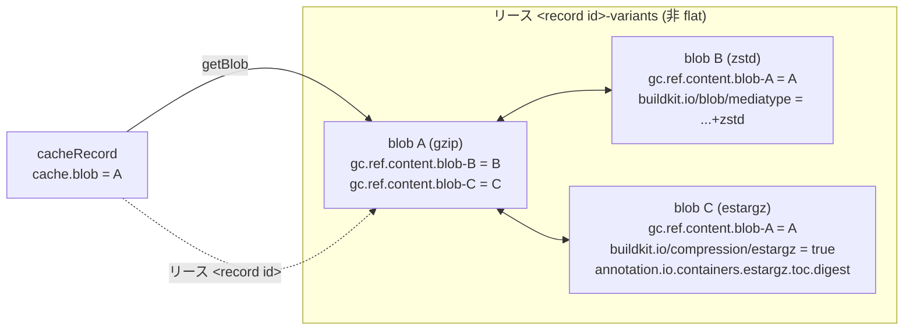

## 何を学んだか

1 つのキャッシュレコードは、同じ内容を別の圧縮形式でエンコードした複数の blob を持てる。それらを束ねる仕掛けが、containerd の content store のラベル 1 種類だけで作られている。

```go title="cache/refs.go"
const (
	blobVariantGCLabel         = "containerd.io/gc.ref.content.blob-"
	blobAnnotationsLabelPrefix = "buildkit.io/blob/annotation."
	blobMediaTypeLabel         = "buildkit.io/blob/mediatype"
)
```

([cache/refs.go L767-L771](https://github.com/moby/buildkit/blob/ca4838f8ddbd3612bca94bcb8a938d8a326110a3/cache/refs.go#L767-L771))

`containerd.io/gc.ref.content.<任意の接尾辞>` は containerd の GC が理解する「この content は別の content を参照している」という宣言だ。BuildKit はこれを **GC から守る目的と、バリアントを辿る索引の目的で兼用している**。ラベルを増やさないので、GC のルートから到達できるものと辿れるものが定義上ずれない。

もう 1 つの主題は estargz だ。estargz は「gzip として展開できる形式」なので、mediaType では gzip と区別がつかない。実際に `estargzType.MediaType()` は gzip のそれを返す。判定はバイト列を読んで行い、結果をラベルにキャッシュする。

## compression.Type — 4 つの実装

```go title="util/compression/compression.go"
type Type interface {
	Compress(ctx context.Context, comp Config) (compressorFunc Compressor, finalize Finalizer)
	Decompress(ctx context.Context, cs content.Store, desc ocispecs.Descriptor) (io.ReadCloser, error)
	NeedsConversion(ctx context.Context, cs content.Store, desc ocispecs.Descriptor) (bool, error)
	NeedsComputeDiffBySelf(comp Config) bool
	OnlySupportOCITypes() bool
	MediaType() string
	String() string
}

type (
	uncompressedType struct{}
	gzipType         struct{}
	estargzType      struct{}
	zstdType         struct{}
)
```

([util/compression/compression.go L25-L40](https://github.com/moby/buildkit/blob/ca4838f8ddbd3612bca94bcb8a938d8a326110a3/util/compression/compression.go#L25-L40))

`MediaType()` を並べると、estargz の異質さが見える。

| Type         | `String()`     | `MediaType()`                                 |
| ------------ | -------------- | --------------------------------------------- |
| Uncompressed | `uncompressed` | `application/vnd.oci.image.layer.v1.tar`      |
| Gzip         | `gzip`         | `application/vnd.oci.image.layer.v1.tar+gzip` |
| EStargz      | `estargz`      | `application/vnd.oci.image.layer.v1.tar+gzip` |
| Zstd         | `zstd`         | `application/vnd.oci.image.layer.v1.tar+zstd` |

([util/compression/estargz.go L145-L147](https://github.com/moby/buildkit/blob/ca4838f8ddbd3612bca94bcb8a938d8a326110a3/util/compression/estargz.go#L145-L147), [gzip.go L50-L52](https://github.com/moby/buildkit/blob/ca4838f8ddbd3612bca94bcb8a938d8a326110a3/util/compression/gzip.go#L50-L52))

estargz は gzip ストリームとして完全に valid で、estargz を知らないランタイムがそのまま展開できる。互換性のためにそう設計されているので、mediaType を分けるわけにいかない。

`NeedsConversion` の実装がこの事情を吸収する。zstd 版は mediaType を見るだけ。

```go title="util/compression/zstd.go"
func (c zstdType) NeedsConversion(ctx context.Context, cs content.Store, desc ocispecs.Descriptor) (bool, error) {
	if !images.IsLayerType(desc.MediaType) {
		return false, nil
	}
	ct, err := FromMediaType(desc.MediaType)
	// ...
	if ct == Zstd {
		return false, nil
	}
	return true, nil
}
```

([util/compression/zstd.go L27-L39](https://github.com/moby/buildkit/blob/ca4838f8ddbd3612bca94bcb8a938d8a326110a3/util/compression/zstd.go#L27-L39))

gzip 版は content store を読みに行く。

```go title="util/compression/gzip.go"
func (c gzipType) NeedsConversion(ctx context.Context, cs content.Store, desc ocispecs.Descriptor) (bool, error) {
	esgz, err := EStargz.Is(ctx, cs, desc.Digest)
	if err != nil {
		return false, err
	}
	if !images.IsLayerType(desc.MediaType) {
		return false, nil
	}
	ct, err := FromMediaType(desc.MediaType)
	if err != nil {
		return false, err
	}
	if ct == Gzip && !esgz {
		return false, nil
	}
	return true, nil
}
```

([util/compression/gzip.go L23-L39](https://github.com/moby/buildkit/blob/ca4838f8ddbd3612bca94bcb8a938d8a326110a3/util/compression/gzip.go#L23-L39))

`ct == Gzip && !esgz` の `!esgz` が要点だ。「plain な gzip が欲しい」と言われたとき、estargz を返してはいけない。estargz は TOC のぶんだけサイズが大きく、展開すれば同じ tar になるとはいえ blob としては別物になる。`NeedsConversion` が `cs content.Store` を引数に取っているのは、この判定にバイト列が要るからだ。インターフェースの形が estargz の存在に引きずられている。

## estargz かどうかをどう見分けるか

```go title="util/compression/estargz.go"
const estargzLabel = "buildkit.io/compression/estargz"

// isEStargz returns true when the specified digest of content exists in
// the content store and it's eStargz.
func (c estargzType) Is(ctx context.Context, cs content.Store, dgst digest.Digest) (bool, error) {
	info, err := cs.Info(ctx, dgst)
	if err != nil {
		return false, nil
	}
	if isEsgzStr, ok := info.Labels[estargzLabel]; ok {
		if isEsgz, err := strconv.ParseBool(isEsgzStr); err == nil {
			return isEsgz, nil
		}
	}

	res := func() bool {
		// ...
		// Does this have the footer?
		tocOffset, _, err := estargz.OpenFooter(sr)
		if err != nil {
			return false
		}

		// Is TOC the final entry?
		decompressor := new(estargz.GzipDecompressor)
		rr, err := decompressor.Reader(io.NewSectionReader(sr, tocOffset, sr.Size()-tocOffset))
		// ...
		tr := tar.NewReader(rr)
		h, err := tr.Next()
		// ...
		if h.Name != estargz.TOCTarName {
			return false
		}
		if _, err = tr.Next(); !errors.Is(err, io.EOF) { // must be EOF
			return false
		}

		return true
	}()

	if info.Labels == nil {
		info.Labels = make(map[string]string)
	}
	info.Labels[estargzLabel] = strconv.FormatBool(res) // cache the result
	if _, err := cs.Update(ctx, info, "labels."+estargzLabel); err != nil {
		return false, err
	}

	return res, nil
}
```

([util/compression/estargz.go L25, L153-L210](https://github.com/moby/buildkit/blob/ca4838f8ddbd3612bca94bcb8a938d8a326110a3/util/compression/estargz.go#L153-L210))

判定は 2 段階。blob 末尾のフッタを読んで TOC の位置を得て、そこから先を gzip として展開したら TOC の tar エントリ 1 個だけで EOF になる、という構造を確認する。フッタだけでは不十分で、たまたま同じバイト列で終わる gzip があるかもしれないからだ。

そして結果をラベル `buildkit.io/compression/estargz` に真偽値として書き戻す。この判定は `NeedsConversion` の中から呼ばれ、`getBlobWithCompression` はバリアントを 1 個ずつ辿りながらこれを呼ぶので、キャッシュしないとレイヤ数 × バリアント数だけ blob の I/O が発生する。

なお圧縮形式の自動判定 (`detectCompressionType`) でも estargz が最初にチェックされる。マジックナンバーの照合より前にフッタを見るのは、estargz が gzip のマジックナンバーも持っているからだ ([util/compression/compression.go L146-L179](https://github.com/moby/buildkit/blob/ca4838f8ddbd3612bca94bcb8a938d8a326110a3/util/compression/compression.go#L146-L179))。

もう 1 つの手がかりがアノテーションだ。estargz を作ったときの finalizer が TOC のダイジェストと非圧縮サイズを埋める。

```go title="util/compression/estargz.go"
			// Fill annotations
			a := make(map[string]string)
			a[estargz.TOCJSONDigestAnnotation] = cInfo.tocDigest.String()
			a[estargz.StoreUncompressedSizeAnnotation] = fmt.Sprintf("%d", cInfo.uncompressedSize)
			a[labels.LabelUncompressed] = cInfo.uncompressedDigest.String()
			return a, nil
```

([util/compression/estargz.go L113-L118](https://github.com/moby/buildkit/blob/ca4838f8ddbd3612bca94bcb8a938d8a326110a3/util/compression/estargz.go#L113-L118))

TOC ダイジェストはマニフェストに出す必要がある。estargz を使うランタイム (stargz-snapshotter) が、blob 全体をダウンロードせずに TOC の正当性を検証するのに使うからだ。BuildKit はこれを「保存すべきアノテーション」のリストに載せている。

```go title="cache/refs.go"
var additionalAnnotations = append(append(compression.EStargzAnnotations, obdlabel.OverlayBDAnnotations...), labels.LabelUncompressed)
```

([cache/refs.go L49](https://github.com/moby/buildkit/blob/ca4838f8ddbd3612bca94bcb8a938d8a326110a3/cache/refs.go#L49))

## linkBlob — 双方向のラベルを張る

バリアントの登録はここに集約されている。

```go title="cache/refs.go"
// linkBlob makes a link between this ref and the passed blob. The linked blob can be
// acquired during walkBlob. This is useful to associate a compression variant blob to
// this ref. This doesn't record the blob to the cache record (i.e. the passed blob can't
// be acquired through getBlob). Use setBlob for that purpose.
func (sr *immutableRef) linkBlob(ctx context.Context, desc ocispecs.Descriptor) error {
	if _, err := sr.cm.LeaseManager.Create(ctx, func(l *leases.Lease) error {
		l.ID = sr.compressionVariantsLeaseID()
		// do not make it flat lease to allow linking blobs using gc label
		return nil
	}); err != nil && !cerrdefs.IsAlreadyExists(err) {
		return err
	}
	// ... リースに desc.Digest を content として登録 ...
	vInfo.Labels = map[string]string{
		blobVariantGCLabel + blobDigest.String(): blobDigest.String(),
	}
	vInfo = addBlobDescToInfo(desc, vInfo)
	if _, err := cs.Update(ctx, vInfo, fieldsFromLabels(vInfo.Labels)...); err != nil {
		return err
	}
	// ... サイズを再計算させる ...
	if desc.Digest == blobDigest {
		return nil
	}
	info.Labels = map[string]string{
		blobVariantGCLabel + desc.Digest.String(): desc.Digest.String(),
	}
	_, err = cs.Update(ctx, info, fieldsFromLabels(info.Labels)...)
	return err
}
```

([cache/refs.go L777-L824](https://github.com/moby/buildkit/blob/ca4838f8ddbd3612bca94bcb8a938d8a326110a3/cache/refs.go#L777-L824))

3 つのことをしている。

1. **専用のリースを作る。** レコード本体のリース (`<id>`) とは別に `<id>-variants` を立てる ([cache/refs.go L331-L333](https://github.com/moby/buildkit/blob/ca4838f8ddbd3612bca94bcb8a938d8a326110a3/cache/refs.go#L331-L333))。コメントの `do not make it flat lease to allow linking blobs using gc label` が重要で、flat リースは配下のラベルを辿らない。ここではラベル経由でバリアントの連鎖を生かしたいので flat にしない
2. **両方向にラベルを張る。** 元の blob から新しいバリアントへ、そしてバリアントから元の blob へ。どちらの blob を起点にしても全バリアントに辿り着ける
3. **ディスクリプタをラベルに畳み込む。** content store が持つのはダイジェスト・サイズ・ラベルだけなので、mediaType とアノテーションを `buildkit.io/blob/mediatype` と `buildkit.io/blob/annotation.<キー>` に保存する ([cache/refs.go L931-L960](https://github.com/moby/buildkit/blob/ca4838f8ddbd3612bca94bcb8a938d8a326110a3/cache/refs.go#L931-L960))



`remove` はレコードを消すとき、本体のリースとバリアント用のリースの両方を削除する ([cache/refs.go L471-L481](https://github.com/moby/buildkit/blob/ca4838f8ddbd3612bca94bcb8a938d8a326110a3/cache/refs.go#L471-L481))。

## walkBlob — ラベルのグラフを辿る

双方向にラベルを張った結果、グラフには循環ができる。走査は `visited` で守る。

```go title="cache/refs.go"
func walkBlobVariantsOnly(ctx context.Context, cs content.Store, dgst digest.Digest, f func(ocispecs.Descriptor) bool, visited map[digest.Digest]struct{}) (bool, error) {
	if visited == nil {
		visited = make(map[digest.Digest]struct{})
	}
	visited[dgst] = struct{}{}
	info, err := cs.Info(ctx, dgst)
	if errors.Is(err, cerrdefs.ErrNotFound) {
		return true, nil
	} else if err != nil {
		return false, err
	}
	var children []digest.Digest
	for k, dgstS := range info.Labels {
		if !strings.HasPrefix(k, blobVariantGCLabel) {
			continue
		}
		cDgst, err := digest.Parse(dgstS)
		if err != nil || cDgst == dgst {
			continue
		}
		if cDesc, err := getBlobDesc(ctx, cs, cDgst); err == nil {
			if !f(cDesc) {
				return false, nil
			}
		}
		children = append(children, cDgst)
	}
	for _, c := range children {
		if _, isVisited := visited[c]; isVisited {
			continue
		}
		if isContinue, err := walkBlobVariantsOnly(ctx, cs, c, f, visited); !isContinue || err != nil {
			return isContinue, err
		}
	}
	return true, nil
}
```

([cache/refs.go L861-L897](https://github.com/moby/buildkit/blob/ca4838f8ddbd3612bca94bcb8a938d8a326110a3/cache/refs.go#L861-L897))

blob が content store に無ければ (GC で消えたなど) エラーにせず打ち切る。コールバックが false を返したら走査を止める。この 2 つで、探索と早期終了が同じ関数で表現できている。

`getBlobDesc` はラベルからディスクリプタを組み立て直す。`buildkit.io/blob/mediatype` が無ければエラーで、その blob は「BuildKit が管理しているバリアント」ではないと判断される ([cache/refs.go L899-L929](https://github.com/moby/buildkit/blob/ca4838f8ddbd3612bca94bcb8a938d8a326110a3/cache/refs.go#L899-L929))。

用途は 3 つある。

**目的の圧縮形式を探す。**

```go title="cache/refs.go"
func getBlobWithCompression(ctx context.Context, cs content.Store, desc ocispecs.Descriptor, compressionType compression.Type) (ocispecs.Descriptor, error) {
	var target *ocispecs.Descriptor
	if err := walkBlob(ctx, cs, desc, func(desc ocispecs.Descriptor) bool {
		if needs, err := compressionType.NeedsConversion(ctx, cs, desc); err == nil && !needs {
			target = &desc
			return false
		}
		return true
	}); err != nil || target == nil {
		return ocispecs.Descriptor{}, cerrdefs.ErrNotFound
	}
	return *target, nil
}
```

([cache/refs.go L837-L849](https://github.com/moby/buildkit/blob/ca4838f8ddbd3612bca94bcb8a938d8a326110a3/cache/refs.go#L837-L849))

「変換が要らない = すでにその形式である」で判定する。estargz の判定がここに入ってくる。

**サイズを数える。** `cacheRecord.size` はバリアントを全部足す。バリアントを作れば `du` の数字が増えるのはこのため。`linkBlob` が最後に `queueSize(sizeUnknown)` するのは、次の `size()` 呼び出しで再計算させるためだ ([cache/refs.go L339-L395](https://github.com/moby/buildkit/blob/ca4838f8ddbd3612bca94bcb8a938d8a326110a3/cache/refs.go#L339-L395))。

**エクスポート時に全組み合わせを列挙する。** `GetRemotes(all=true)` は、各レイヤのバリアントの直積を作って複数の `solver.Remote` を返す ([cache/remote.go L103-L149](https://github.com/moby/buildkit/blob/ca4838f8ddbd3612bca94bcb8a938d8a326110a3/cache/remote.go#L103-L149))。リモートキャッシュのマニフェストに「同じレイヤの別圧縮」を全部載せておくと、pull 側が自分の得意な形式を選べる ([リモートキャッシュ](../remotecache-backends/))。

## バリアントはいつ作られるか

`--output type=image,compression=zstd` のように圧縮形式を指定すると `compression.Config` に載り、`computeBlobChain` に届く。新しく作るレイヤはその形式で圧縮される。すでに blob を持っているレイヤは、`Force` が立っているときだけ変換される。

```go title="cache/blobs.go"
			if comp.Force {
				if err := ensureCompression(ctx, sr, comp, s); err != nil {
					return errors.Wrapf(err, "failed to ensure compression type of %q", comp.Type)
				}
			}
```

([cache/blobs.go L286-L290](https://github.com/moby/buildkit/blob/ca4838f8ddbd3612bca94bcb8a938d8a326110a3/cache/blobs.go#L286-L290))

`ensureCompression` は、変換器を作る → 不要なら何もしない → ローカルにバリアントがあるか探す → 無ければ unlazy して変換し `linkBlob`、という順に進む。

```go title="cache/blobs.go"
		// First, lookup local content store
		if _, err := ref.getBlobWithCompression(ctx, comp.Type); err == nil {
			return l, nil // found the compression variant. no need to convert.
		}

		// Convert layer compression type
		if err := (lazyRefProvider{...}).Unlazy(ctx); err != nil {
			return l, err
		}
		newDesc, err := layerConvertFunc(ctx, ref.cm.ContentStore, desc)
		if err != nil {
			return nil, errors.Wrapf(err, "failed to convert")
		}

		// Start to track converted layer
		if err := ref.linkBlob(ctx, *newDesc); err != nil {
			return nil, errors.Wrapf(err, "failed to add compression blob")
		}
```

([cache/blobs.go L485-L507](https://github.com/moby/buildkit/blob/ca4838f8ddbd3612bca94bcb8a938d8a326110a3/cache/blobs.go#L485-L507))

変換の前に必ずローカルを見るので、2 回目以降のエクスポートで再圧縮は起きない。この検索がラベルのグラフ走査に乗っている。

`linkBlob` は `lazyRefProvider.Unlazy` の完了時にも呼ばれる ([cache/remote.go L340-L345](https://github.com/moby/buildkit/blob/ca4838f8ddbd3612bca94bcb8a938d8a326110a3/cache/remote.go#L340-L345))。ダウンロードしてきた blob をレコードのバリアントとして登録し、リースで GC から守るためだ。

## なぜそうなっているか

バリアントを「別のキャッシュレコード」にしなかったのは、キャッシュキーの観点では同じレイヤだからだ。別レコードにすると、`chainID` が同じレコードが圧縮形式のぶんだけ増え、`GetByBlob` の検索も `du` の集計も複雑になる。1 レコード + 複数 blob なら、レコードの側は「主たる blob」を 1 つ持ち、残りはラベルグラフの先にぶら下がる。

そのグラフを新しいメタデータではなく GC ラベルで表したのは、寿命管理と索引を一致させるためだ。専用の「バリアント表」を作ると、表にはあるが GC で消えた blob、あるいは GC には守られているが表に無い blob が生まれうる。`containerd.io/gc.ref.content.<接尾辞>` は containerd がすでに理解するラベルなので、これを索引としても使えば「辿れる = 生きている」が構造的に保証される。`walkBlobVariantsOnly` が not found を静かに打ち切るのは、それでも競合で消えることがあるからだ。

estargz を別 mediaType にしなかったのは BuildKit の判断ではなく estargz 側の設計だが、その帰結が `NeedsConversion(ctx, cs, desc)` というシグネチャに現れている。「形式の判定にバイト列が要ることがある」を許すインターフェースにしておかないと、estargz のような後方互換を狙った形式を扱えない。判定結果をラベルにキャッシュするのは、その代償を 1 回に抑えるためだ。

## どう活かすか

**寿命管理の仕組みをそのまま索引に使う。** 「参照されているから生きている」を表す構造がすでにあるなら、そこを辿れば「関連するものの一覧」も得られる。別途インデックスを持つと、GC と索引が食い違ったときに孤児や dangling が出る。同じ辺を両方の目的に使えば、そのクラスのバグが構造的に消える。

**同一性の粒度を、識別子と表現で分ける。** 「論理的には同じレイヤ」を 1 レコードにし、「バイト列としての表現」を複数の blob にする。両者を同じ粒度で扱うと、どちらかの操作 (検索、集計、GC) が必ず不自然になる。

**型を宣言 (mediaType) だけで判定せず、内容を見る余地を残す。** 後方互換のために既存の型を名乗る形式は珍しくない。判定関数にストアやリーダを渡せるシグネチャにしておくと、そういう形式を後から足せる。そのうえで、判定結果は必ずキャッシュする。

**双方向のリンクを張るなら、走査に `visited` を用意する。** 相互参照は循環を作る。「どちらから来ても全部に辿り着ける」という利点と引き換えなので、走査側で必ず訪問済み集合を持つ。

**再生成の前に必ずローカルを探す。** `ensureCompression` が変換の直前に `getBlobWithCompression` を呼ぶ形は、「変換は高価、検索は安い」という非対称性をコードの順序に出している。キャッシュを持つ処理では、生成経路の入口に検索を必ず 1 段挟む。
