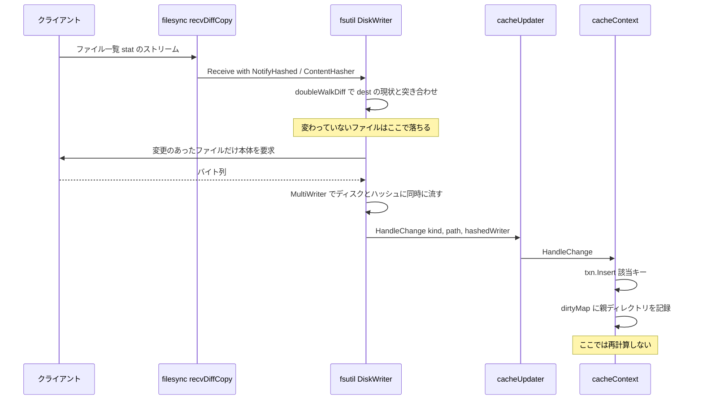

## 何を学んだか

`COPY . /src` のキャッシュキーはコンテキスト全体のダイジェストだが、BuildKit はビルドのたびに全ファイルを読み直してはいない。仕組みは 3 段だ。

1. **転送のついでにハッシュが取れる。** クライアントから差分転送されてきたファイルは、ディスクに書きながら同じバイト列がハッシュにも流れる。ハッシュのために読み直しは起きない。
2. **変更通知が届いたパスだけを木に書き、親をルートまで無効化する。** 無効化は「`CacheRecord.Digest` を空文字にする」ことでしかない。
3. **再計算は `Checksum` が呼ばれるまで走らない。** しかも `Digest` が残っている枝は再帰の入口で打ち切られるので、変わっていないサブツリーには触らない。

つまり、無効化はプッシュ、再計算はプルになっている。この分離が効いているのは、変更通知が来る時点では「どのパスのダイジェストが最終的に必要になるか」がまだ分からないからだ。

## 誰が HandleChange を呼ぶのか

呼び出し元は `local` ソース、つまり `COPY` のコピー元になるビルドコンテキストの取り込み処理だ。

```go title="source/local/source.go"
	cc, err := contenthash.GetCacheContext(ctx, mutable)
	if err != nil {
		return nil, err
	}

	opt := filesync.FSSendRequestOpt{
		Name:            ls.src.Name,
		// ...
		DestDir:         dest,
		CacheUpdater:    &cacheUpdater{cc, mount.IdentityMapping()},
```

([source/local/source.go L264-L275](https://github.com/moby/buildkit/blob/ca4838f8ddbd3612bca94bcb8a938d8a326110a3/source/local/source.go#L264-L275))

`cacheUpdater` は `contenthash.CacheContext` を埋め込んだだけの型で、`HandleChange` はそのまま `cacheContext` のものが使われる。自前で足しているのは `ContentHasher()` が `contenthash.NewFromStat` を返すことだけだ ([source/local/source.go L360-L370](https://github.com/moby/buildkit/blob/ca4838f8ddbd3612bca94bcb8a938d8a326110a3/source/local/source.go#L360-L370))。

これが [filesync](../filesync/) の受信側に渡り、fsutil の `Receive` の 2 つのフックになる。

```go title="session/filesync/diffcopy.go"
	var cf fsutil.ChangeFunc
	var ch fsutil.ContentHasher
	if cu != nil {
		cu.MarkSupported(true)
		cf = cu.HandleChange
		ch = cu.ContentHasher()
	}
	// ...
	return errors.WithStack(fsutil.Receive(ds.Context(), ds, dest, fsutil.ReceiveOpt{
		NotifyHashed:  cf,
		ContentHasher: ch,
```

([session/filesync/diffcopy.go L90-L106](https://github.com/moby/buildkit/blob/ca4838f8ddbd3612bca94bcb8a938d8a326110a3/session/filesync/diffcopy.go#L90-L106))

fsutil 側では、ファイルを書くライタが `io.MultiWriter(w, h)` で二股になる ([vendor/github.com/tonistiigi/fsutil/diskwriter.go L289-L294](https://github.com/moby/buildkit/blob/ca4838f8ddbd3612bca94bcb8a938d8a326110a3/vendor/github.com/tonistiigi/fsutil/diskwriter.go#L289-L294))。ディスクに書くのと同じバイト列がハッシュにも流れるので、**ハッシュのためのファイル読み直しが発生しない**。書き終えて `Close` したときのダイジェストは `hashedWriter.Digest()` として取れ、`HandleChange` に渡る `fi` がその `hashedWriter` そのものなので、`cacheContext` 側は `fi.(Hashed)` の型アサーション 1 回で digest を取り出せる ([cache/contenthash/checksum.go L358-L361](https://github.com/moby/buildkit/blob/ca4838f8ddbd3612bca94bcb8a938d8a326110a3/cache/contenthash/checksum.go#L358-L361))。

`ChangeKind` は fsutil の enum で `ChangeKindAdd` / `ChangeKindModify` / `ChangeKindDelete` の 3 つ。誰が値を決めているかというと、fsutil の `doubleWalkDiff` が「送信側が申告したファイル一覧」と「受信側のディレクトリの現状」を並行に走査して差分を出している。**同じ ref を使い回す限り、変更のなかったファイルには通知が来ない。** ここが増分の源泉だ。



## HandleChange は木を書くだけ

`HandleChange` はトランザクションを開いたまま呼ばれ続ける。最初の 1 回で `txn` と、その時点のスナップショット `node` を確保する。

```go title="cache/contenthash/checksum.go"
	if cc.txn == nil {
		cc.txn = cc.tree.Txn()
		cc.node = cc.tree.Root()

		// root is not called by HandleChange. need to fake it
		if _, ok := cc.node.Get([]byte{0}); !ok {
			cc.txn.Insert([]byte{0}, &CacheRecord{
				Type:   CacheRecordTypeDirHeader,
				Digest: string(digest.FromBytes(nil)),
			})
			cc.txn.Insert([]byte(""), &CacheRecord{
				Type: CacheRecordTypeDir,
			})
		}
	}
```

([checksum.go L324-L338](https://github.com/moby/buildkit/blob/ca4838f8ddbd3612bca94bcb8a938d8a326110a3/cache/contenthash/checksum.go#L324-L338))

ルートは差分の対象にならないので手で入れる。ルートヘッダには空バイト列のダイジェストを固定で入れ、ルート内容は `Digest` 空 = 未計算のままにする。この 2 レコードの置き方は [radix tree のレイアウト](../contenthash-radix-tree/)そのままだ。

書き込みの本体はレコードを 1 つ作って `Insert` するだけで、ダイジェストの再計算はどこにも出てこない。

```go title="cache/contenthash/checksum.go"
	cr := &CacheRecord{
		Type: CacheRecordTypeFile,
	}
	if fi.Mode()&os.ModeSymlink != 0 {
		cr.Type = CacheRecordTypeSymlink
		cr.Linkname = filepath.ToSlash(stat.Linkname)
	}
	if fi.IsDir() {
		cr.Type = CacheRecordTypeDirHeader
		cr2 := &CacheRecord{
			Type: CacheRecordTypeDir,
		}
		cc.txn.Insert(k, cr2)
		k = append(k, 0)
		p += "/"
	}
	cr.Digest = string(h.Digest())
```

([checksum.go L371-L387](https://github.com/moby/buildkit/blob/ca4838f8ddbd3612bca94bcb8a938d8a326110a3/cache/contenthash/checksum.go#L371-L387))

ディレクトリのときは DIR レコードを `Digest` 空で入れ直す。中身が変わったかどうかに関係なく、いったん未計算に戻す。そして最後に、親を dirty に積む。

```go title="cache/contenthash/checksum.go"
	d := path.Dir(p)
	if d == "/" {
		d = ""
	}
	cc.dirtyMap[d] = struct{}{}
```

([checksum.go L416-L420](https://github.com/moby/buildkit/blob/ca4838f8ddbd3612bca94bcb8a938d8a326110a3/cache/contenthash/checksum.go#L416-L420))

積まれるのは**直上の親だけ**で、ルートまでは遡らない。遡るのはコミットのときだ。

削除の経路も同じ形をしている。木からキーを消し、ディレクトリならサブツリーごと消して、親を dirty に積む。

```go title="cache/contenthash/checksum.go"
	deleteDir := func(cr *CacheRecord) {
		if cr.Type == CacheRecordTypeDir {
			cc.node.WalkPrefix(append(k, 0), func(k []byte, v *CacheRecord) bool {
				cc.txn.Delete(k)
				return false
			})
		}
	}
```

([checksum.go L313-L320](https://github.com/moby/buildkit/blob/ca4838f8ddbd3612bca94bcb8a938d8a326110a3/cache/contenthash/checksum.go#L313-L320))

走査するのは `cc.node` (トランザクション開始時のスナップショット)、削除するのは `cc.txn` (進行中のバージョン) だ。読みと書きを別のバージョンに向けているので、走査中に木が変わる心配がない。同じ `deleteDir` は「ディレクトリがファイルで置き換えられた」場合にも呼ばれる ([checksum.go L364-L369](https://github.com/moby/buildkit/blob/ca4838f8ddbd3612bca94bcb8a938d8a326110a3/cache/contenthash/checksum.go#L364-L369))。

### ハードリンクは後から埋める

ファイル本体の転送は非同期なので、ハードリンクの通知がリンク元より先に来ることがある。`linkMap` がその穴を塞ぐ。

```go title="cache/contenthash/checksum.go"
	// if we receive a hardlink just use the digest of the source
	// note that the source may be called later because data writing is async
	if fi.Mode()&os.ModeSymlink == 0 && stat.Linkname != "" {
		ln := path.Join("/", filepath.ToSlash(stat.Linkname))
		v, ok := cc.txn.Get(convertPathToKey(ln))
		if ok {
			cr = v.CloneVT()
		}
		cc.linkMap[ln] = append(cc.linkMap[ln], k)
	}
```

([checksum.go L389-L398](https://github.com/moby/buildkit/blob/ca4838f8ddbd3612bca94bcb8a938d8a326110a3/cache/contenthash/checksum.go#L389-L398))

リンク元が既にあればそのレコードを複製し、なければ待ち行列に積む。そして通常のファイルを書いた直後に、自分を待っていたリンクを一括で埋める ([checksum.go L401-L414](https://github.com/moby/buildkit/blob/ca4838f8ddbd3612bca94bcb8a938d8a326110a3/cache/contenthash/checksum.go#L401-L414))。ここで埋めたリンク側の親も dirty に積まれる。

## 無効化の伝播はコミットの 1 回で済ませる

`dirtyMap` が実際に木へ反映されるのは `commitActiveTransaction` だ。

```go title="cache/contenthash/checksum.go"
func (cc *cacheContext) commitActiveTransaction() {
	for d := range cc.dirtyMap {
		addParentToMap(d, cc.dirtyMap)
	}
	for d := range cc.dirtyMap {
		k := convertPathToKey(d)
		if _, ok := cc.txn.Get(k); ok {
			cc.txn.Insert(k, &CacheRecord{Type: CacheRecordTypeDir})
		}
	}
	cc.tree = cc.txn.Commit()
	cc.node = nil
	cc.dirtyMap = map[string]struct{}{}
	cc.txn = nil
}
```

([checksum.go L849-L863](https://github.com/moby/buildkit/blob/ca4838f8ddbd3612bca94bcb8a938d8a326110a3/cache/contenthash/checksum.go#L849-L863))

`addParentToMap` が再帰でルートまで親を積み ([checksum.go L1245-L1255](https://github.com/moby/buildkit/blob/ca4838f8ddbd3612bca94bcb8a938d8a326110a3/cache/contenthash/checksum.go#L1245-L1255))、その全部を `Digest` 空の DIR レコードで上書きする。**無効化とは digest を消すことだ。** レコードの型は保つので、木の形は壊れない。

`map` を集合として使っているので、同じディレクトリの下で 1000 ファイルが変わっても、親の無効化は 1 回にまとまる。深さ `d` のパスが `n` 個変わったとき、無効化のコストは `O(n * d)` ではなく、実際に触られたディレクトリの数に比例する。

呼び出し箇所は 3 つで、いずれも**読む直前**だ。`save` ([L278-L280](https://github.com/moby/buildkit/blob/ca4838f8ddbd3612bca94bcb8a938d8a326110a3/cache/contenthash/checksum.go#L278-L280))、`includedPaths` ([L473-L475](https://github.com/moby/buildkit/blob/ca4838f8ddbd3612bca94bcb8a938d8a326110a3/cache/contenthash/checksum.go#L473-L475))、`lazyChecksum` ([L831-L833](https://github.com/moby/buildkit/blob/ca4838f8ddbd3612bca94bcb8a938d8a326110a3/cache/contenthash/checksum.go#L831-L833))。転送中は 1 つのトランザクションが開きっぱなしで、最初の読みでまとめて閉じる。

## 再計算は「digest が空の枝」だけを降りる

`checksum` の先頭 2 行が枝刈りの全部だ。

```go title="cache/contenthash/checksum.go"
	if cr.Digest != "" {
		return cr, false, nil
	}
```

([checksum.go L897-L899](https://github.com/moby/buildkit/blob/ca4838f8ddbd3612bca94bcb8a938d8a326110a3/cache/contenthash/checksum.go#L897-L899))

無効化されたのはルートから変更点までの経路上のディレクトリだけなので、再帰は「変更のあったパスへ降りる細い枝」と「その途中の各ディレクトリの子 1 段」しか触らない。兄弟のサブツリーは DIR レコードのダイジェストが生きているので、その 1 レコードを読むだけで畳まれる。

計算結果は新しいレコードとして書き戻され、`updated` フラグが立つ。

```go title="cache/contenthash/checksum.go"
	cr2 := &CacheRecord{
		Digest:   string(dgst),
		Type:     cr.Type,
		Linkname: cr.Linkname,
	}

	txn.Insert(k, cr2)

	return cr2, true, nil
```

([checksum.go L953-L961](https://github.com/moby/buildkit/blob/ca4838f8ddbd3612bca94bcb8a938d8a326110a3/cache/contenthash/checksum.go#L953-L961))

`updated` は `cc.dirty` に集約され、読み終わりに非同期で永続化を起動する。

```go title="cache/contenthash/checksum.go"
	defer func() {
		if cc.dirty {
			go cc.save()
			cc.dirty = false
		}
	}()
```

([checksum.go L835-L840](https://github.com/moby/buildkit/blob/ca4838f8ddbd3612bca94bcb8a938d8a326110a3/cache/contenthash/checksum.go#L835-L840))

## 永続化 — 木をそのまま proto にする

`save` / `load` は木を平らな `CacheRecords` にして ref のメタデータに書く。専用のフォーマットも差分エンコーディングもない。

```go title="cache/contenthash/checksum.go"
	var l CacheRecords
	node := cc.tree.Root()
	node.Walk(func(k []byte, v *CacheRecord) bool {
		l.Paths = append(l.Paths, &CacheRecordWithPath{
			Path:   string(k),
			Record: v,
		})
		return false
	})

	dt, err := l.MarshalVT()
```

([checksum.go L282-L292](https://github.com/moby/buildkit/blob/ca4838f8ddbd3612bca94bcb8a938d8a326110a3/cache/contenthash/checksum.go#L282-L292))

保存先は ref のメタデータの 1 キー `buildkit.contenthash.v0` だ ([checksum.go L194](https://github.com/moby/buildkit/blob/ca4838f8ddbd3612bca94bcb8a938d8a326110a3/cache/contenthash/checksum.go#L194) / [キャッシュメタデータ](../cache-metadata/))。`Path` として保存されるのは `convertPathToKey` 済みのキー、つまり 0x00 区切りのバイト列を文字列にしたものだ。`load` はそれをそのまま `txn.Insert` に戻すので、変換を挟まない ([checksum.go L266-L270](https://github.com/moby/buildkit/blob/ca4838f8ddbd3612bca94bcb8a938d8a326110a3/cache/contenthash/checksum.go#L266-L270))。

ここで 1 つ仕掛けがある。`Checksum` が見に行くメタデータは、ref そのものではない。

```go title="cache/contenthash/checksum.go"
func ensureOriginMetadata(md cache.RefMetadata) cache.RefMetadata {
	em, ok := md.GetEqualMutable()
	if !ok {
		em = md
	}
	return em
}
```

([checksum.go L1257-L1263](https://github.com/moby/buildkit/blob/ca4838f8ddbd3612bca94bcb8a938d8a326110a3/cache/contenthash/checksum.go#L1257-L1263))

`local` ソースは mutable ref にファイルを同期して `cc` を育て、最後に `Commit` して immutable ref を作る。`Checksum` が immutable ref で呼ばれたとき、`GetEqualMutable` で元の mutable ref のメタデータに辿り着くので、同期中に育てた木がそのまま使える。**コミットの前後でキャッシュが切れない**ようにするための 1 段だ。

なお `local` ソースは、転送が途中で失敗したら `contenthash.ClearCacheContext(mutable)` で木を捨てる。コメントは `on error remove the record as checksum update is in undefined state` ([source/local/source.go L235-L244](https://github.com/moby/buildkit/blob/ca4838f8ddbd3612bca94bcb8a938d8a326110a3/source/local/source.go#L235-L244))。差分適用が中断した木は「一部だけ新しい」状態になり、どこが正しいかを判定する手段がない。増分キャッシュを持つ側は、失敗時に部分状態を残さないことが正しさの条件になる。

## なぜそうなっているか

**なぜ無効化と再計算を分けるのか。** 変更通知が届く時点では、どのパスのダイジェストが要求されるか分からない。`COPY package.json /app` しか書かれていない Dockerfile なら、必要なのは 1 ファイル分のダイジェストだけで、コンテキスト全体の集約値は誰も見ない。変更のたびに親のダイジェストを計算し直すと、その大半が捨てられる。「無効化は安いのでプッシュ、計算は高いのでプル」という素直な使い分けだ。

**なぜ digest を空にするだけなのか。** `CacheRecord` から digest を消しても型と linkname は残るので、木の構造 (どこにディレクトリがあり、どこにシンボリックリンクがあるか) は失われない。構造が残っていれば `needsScan` はディスクを見に行かなくて済む ([シンボリックリンク解決と、スキャンが要るかの判定](../contenthash-symlink/))。無効化するのは「計算結果」だけで、「観測した事実」は保つ。

**なぜトランザクションを開きっぱなしにするのか。** 転送は数万ファイルの変更通知になりうる。1 通知 1 コミットにすると、immutable radix tree のパス複製が通知の回数だけ走る。読む直前まで開いておけば、コミットは 1 回で済む。代償として `cc.txn != nil` の間は木の読みが古い、という状態が生まれるが、`lazyChecksum` は `txn` があれば速いパスを諦める、という形でこれを吸収している ([checksum.go L812-L826](https://github.com/moby/buildkit/blob/ca4838f8ddbd3612bca94bcb8a938d8a326110a3/cache/contenthash/checksum.go#L812-L826))。

## どう活かすか

- **転送とハッシュを同じ 1 回の読みで済ませる。** `io.MultiWriter` でライタを二股にするだけで、ハッシュのための再読み込みが消える。「データが手元を通る瞬間」は、そのデータについて何かを計算する唯一の無料の機会だ。
- **無効化は「計算結果を消す」、構造は残す。** キャッシュエントリを丸ごと削除すると、次回は構造の再取得からやり直しになる。何が高くて何が安いかを分け、高いほうだけを捨てる。
- **無効化の伝播はコミット時にまとめる。** 変更 1 件ごとに親をルートまで遡ると `O(n * d)`。dirty 集合に直上の親だけ積んでおき、読む直前に一度だけ祖先へ展開すれば、重複が集合演算で潰れる。
- **増分状態は失敗したら捨てる。** 「一部だけ更新された増分キャッシュ」は、正しさを検査する手段がないぶん、キャッシュがないより悪い。エラー経路で丸ごと破棄する 1 行を先に書く。
- **中間状態と最終状態でキャッシュを共有する導線を用意する。** `GetEqualMutable` の 1 段がないと、コミットのたびに増分の蓄積がリセットされる。「作業中のオブジェクト」と「確定したオブジェクト」を別 ID にする設計では、キャッシュの参照だけは繋いでおく。
