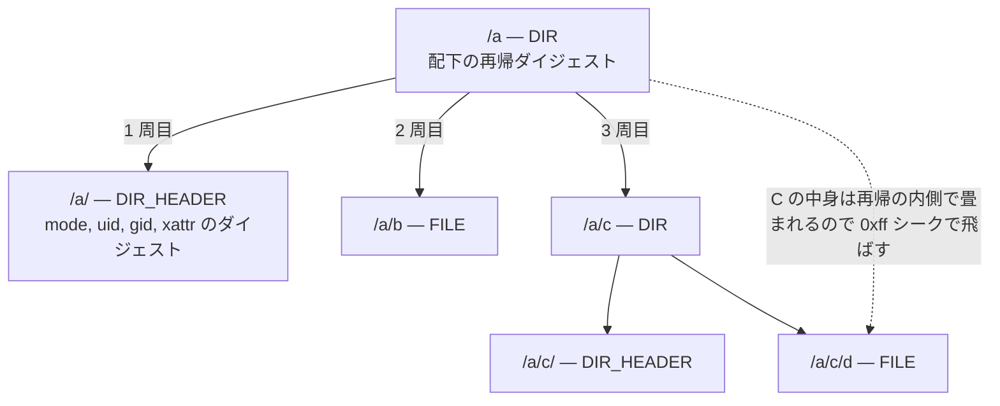

## 何を学んだか

`COPY` のキャッシュキーは、コピー対象のファイルツリーを実際にハッシュして決まる ([「何をキャッシュヒットとみなすか」を定義する](../what-is-a-cache-hit/))。そのハッシュを保持するのが `cache/contenthash` の `cacheContext` で、中身は 1 本の immutable radix tree でしかない。

設計の芯は 2 つある。

1. **キーは「パス区切りを 0x00 に置き換えた絶対パス」**。`/` (0x2f) のままだと、`/a.txt` が `/a` と `/a/b` の間に割り込んでしまい、ディレクトリの子孫がキー空間で連続しなくなる。0x00 はどの文字コードよりも小さいので、置き換えるだけで「ディレクトリの子孫は必ずそのディレクトリの直後に連続して並ぶ」が成立する。
2. **ディレクトリには 2 つのレコードを置く**。`/dir` に配下の再帰ダイジェスト、`/dir/` にディレクトリ自身のメタデータのダイジェスト。前者はサブツリーの手前に、後者はサブツリーの先頭に置かれる。この非対称が、`COPY dir/` と `COPY --exclude=... dir/` を同じ木で扱えるようにしている。

## レイアウトはファイル先頭のコメントに書いてある

```go title="cache/contenthash/checksum.go"
// Layout in the radix tree: Every path is saved by cleaned absolute unix path.
// Directories have 2 records, one contains digest for directory header, other
// the recursive digest for directory contents. "/dir/" is the record for
// header, "/dir" is for contents. For the root node "" (empty string) is the
// key for root, "/" for the root header
```

([cache/contenthash/checksum.go L53-L57](https://github.com/moby/buildkit/blob/ca4838f8ddbd3612bca94bcb8a938d8a326110a3/cache/contenthash/checksum.go#L53-L57))

レコードは 4 種類ある。proto の enum に別名を付けただけの定数だ。

```go title="cache/contenthash/checksum.go"
const (
	CacheRecordTypeFile      = CacheRecordType_FILE
	CacheRecordTypeDir       = CacheRecordType_DIR
	CacheRecordTypeDirHeader = CacheRecordType_DIR_HEADER
	CacheRecordTypeSymlink   = CacheRecordType_SYMLINK
)
```

([checksum.go L46-L51](https://github.com/moby/buildkit/blob/ca4838f8ddbd3612bca94bcb8a938d8a326110a3/cache/contenthash/checksum.go#L46-L51))

レコード本体は 3 フィールドしかない。

```proto title="cache/contenthash/checksum.proto"
message CacheRecord {
	string digest = 1;
	CacheRecordType type = 2;
	string linkname = 3;
}
```

([checksum.proto L14-L18](https://github.com/moby/buildkit/blob/ca4838f8ddbd3612bca94bcb8a938d8a326110a3/cache/contenthash/checksum.proto#L14-L18))

`digest` が空文字なのが「まだ計算していない / 無効化された」を意味する。この 1 つの表現に増分更新が乗る ([増分更新](../contenthash-incremental/))。

## キーの正規化は 1 行

```go title="cache/contenthash/checksum.go"
func convertPathToKey(p string) []byte {
	return bytes.ReplaceAll([]byte(p), []byte("/"), []byte{0})
}

func convertKeyToPath(p []byte) string {
	return string(bytes.ReplaceAll(p, []byte{0}, []byte("/")))
}
```

([checksum.go L1277-L1283](https://github.com/moby/buildkit/blob/ca4838f8ddbd3612bca94bcb8a938d8a326110a3/cache/contenthash/checksum.go#L1277-L1283))

パス側は `keyPath` で先に正規化される。`path.Join("/", ...)` で絶対パスにして `..` を潰し、ルートだけは `"/"` ではなく空文字にする。

```go title="cache/contenthash/checksum.go"
func keyPath(p string) string {
	p = path.Join("/", filepath.ToSlash(p))
	if p == "/" {
		p = ""
	}
	return p
}
```

([checksum.go L300-L306](https://github.com/moby/buildkit/blob/ca4838f8ddbd3612bca94bcb8a938d8a326110a3/cache/contenthash/checksum.go#L300-L306))

結果、`/a` が dir、`/a/b` がその中のファイル、`/a.txt` がルート直下のファイルという木は、こう並ぶ。

```
パス       キー (0x00 を \0 と表記)   レコード種別   digest の意味
/          ""                        DIR            ルート配下の再帰ダイジェスト
/          "\0"                      DIR_HEADER     ルート自身のメタデータ
/a         "\0a"                     DIR            /a 配下の再帰ダイジェスト
/a/        "\0a\0"                   DIR_HEADER     /a 自身のメタデータ
/a/b       "\0a\0b"                  FILE
/a.txt     "\0a.txt"                 FILE

バイト順 (radix tree の走査順):
  ""  <  "\0"  <  "\0a"  <  "\0a\0"  <  "\0a\0b"  <  "\0a.txt"
                   ^^^^     ^^^^^^^^^^^^^^^^^^^^^
                   /a の DIR     /a のサブツリーが連続する

区切りを '/' (0x2e < 0x2f) のままにすると順序が壊れる:
  "/a"  <  "/a.txt"  <  "/a/b"
              ^^^^^^ 無関係なファイルが /a のサブツリーに割り込む
```

区切りを 0x00 にする理由はソースにコメントされていないが、後述する `checksum` の走査ループが `bytes.HasPrefix` で終端を判定しているので、この順序が崩れると `/a/b` を取りこぼす。置き換えは飾りではなく、走査アルゴリズムの前提だ。

## 2 レコードの上に再帰ダイジェストが乗る

ディレクトリのダイジェストを計算する `checksum` の `CacheRecordTypeDir` 分岐が、レイアウトをそのまま使っている。

```go title="cache/contenthash/checksum.go"
	case CacheRecordTypeDir:
		h := cachedigest.NewHash(cachedigest.TypeFileList)
		next := append(k, 0)
		iter := root.Iterator()
		iter.SeekLowerBound(append(slices.Clone(next), 0))
		subk := next
		ok := true
		for ok && bytes.HasPrefix(subk, next) {
			h.Write(bytes.TrimPrefix(subk, k))

			// We do not follow trailing links when checksumming a directory's
			// contents.
			subcr, _, err := cc.checksum(ctx, root, txn, m, subk, false)
			if err != nil {
				return nil, false, err
			}

			h.Write([]byte(subcr.Digest))

			if subcr.Type == CacheRecordTypeDir { // skip subfiles
				next := append(subk, 0, 0xff)
				iter = root.Iterator()
				iter.SeekLowerBound(next)
			}
			subk, _, ok = iter.Next()
		}
		dgst = h.Sum()
```

([checksum.go L902-L929](https://github.com/moby/buildkit/blob/ca4838f8ddbd3612bca94bcb8a938d8a326110a3/cache/contenthash/checksum.go#L902-L929))

読みどころが 3 つある。

- **最初の `subk` は `next`、つまり DIR_HEADER のキーそのもの**。ループの 1 周目でディレクトリ自身のメタデータのダイジェストが混ぜられる。ヘッダをサブツリーの先頭に置いたので、特別扱いなしで「自身 → 子」の順に並ぶ。
- **イテレータの開始位置は `next + 0x00`**。DIR_HEADER のキー (`next`) より真に大きいので、ヘッダは `iter.Next()` からは出てこない。手で 1 周目に入れているぶんと重複しない。
- **子がディレクトリなら `subk + 0x00 + 0xff` までシークして飛ばす**。子ディレクトリの DIR レコードのダイジェストだけを混ぜ、その中身は再帰の内側で畳み込まれるので、ここで再訪する必要がない。0xff はファイル名に現れうる最大バイトの上を取っている (UTF-8 の先頭バイトに 0xff は現れない)。



## フィルタがあるときは DIR レコードを使わない

`Checksum` は入口で 2 経路に分かれる。

```go title="cache/contenthash/checksum.go"
	if !opts.Wildcard && len(opts.IncludePatterns) == 0 && len(opts.ExcludePatterns) == 0 {
		return cc.lazyChecksum(ctx, m, p, opts.FollowLinks)
	}

	prefix, includedPaths, err := cc.includedPaths(ctx, m, p, opts)
```

([checksum.go L429-L436](https://github.com/moby/buildkit/blob/ca4838f8ddbd3612bca94bcb8a938d8a326110a3/cache/contenthash/checksum.go#L429-L436))

前者はディレクトリの DIR レコードを 1 つ引くだけで済む。後者はパターンに合う要素を 1 つずつ拾って並べ直すが、そのとき DIR レコードは意図的に捨てられる。

```go title="cache/contenthash/checksum.go"
		if cr.Type == CacheRecordTypeDir {
			// We only hash dir headers and files, not dir contents. Hashing
			// dir contents could be wrong if there are exclusions within the
			// dir.
			shouldInclude = false
		}
```

([checksum.go L663-L668](https://github.com/moby/buildkit/blob/ca4838f8ddbd3612bca94bcb8a938d8a326110a3/cache/contenthash/checksum.go#L663-L668))

ここが 2 レコードにした実利だ。`--exclude=node_modules` が付いた瞬間、ディレクトリの「配下の再帰ダイジェスト」は答えとして使えなくなる。しかし「ディレクトリ自身のメタデータ」は依然として結果に含めなければならない (パーミッションが変われば `COPY` の結果は変わる)。1 レコードしかなければ、この 2 つを分離できない。

フィルタ経路の最終ハッシュは、パスとダイジェストのペアを順に並べたものになる。

```go title="cache/contenthash/checksum.go"
	h := cachedigest.NewHash(cachedigest.TypeFileList)
	for _, w := range includedPaths {
		path := strings.TrimPrefix(w.path, prefix)
		k := convertPathToKey(path)
		if len(k) == 0 {
			k = []byte{0}
		}
		h.Write(k)
		h.Write([]byte(w.record.Digest))
	}
	return h.Sum(), nil
```

([checksum.go L456-L466](https://github.com/moby/buildkit/blob/ca4838f8ddbd3612bca94bcb8a938d8a326110a3/cache/contenthash/checksum.go#L456-L466))

`prefix` を剥がしているので、`COPY src/ /dst` の `src` を別名にリネームしてもダイジェストは変わらない。ハッシュ対象は「コピー先から見た相対パスと内容」であって、コピー元の絶対パスではない。

## immutable であることが効く場所

木は `hashicorp/go-immutable-radix/v2` の永続データ構造だ。

```go title="cache/contenthash/checksum.go"
type cacheContext struct {
	mu    sync.RWMutex
	md    cacheMetadata
	tree  *iradix.Tree[*CacheRecord]
	dirty bool // needs to be persisted to disk

	// used in HandleChange
	txn      *iradix.Txn[*CacheRecord]
	node     *iradix.Node[*CacheRecord]
	dirtyMap map[string]struct{}
	linkMap  map[string][][]byte
}
```

([checksum.go L177-L188](https://github.com/moby/buildkit/blob/ca4838f8ddbd3612bca94bcb8a938d8a326110a3/cache/contenthash/checksum.go#L177-L188))

ライブラリ側のコメントが性質を言っている。

```go title="vendor/github.com/hashicorp/go-immutable-radix/v2/iradix.go"
// Tree implements an immutable radix tree. This can be treated as a
// Dictionary abstract data type. The main advantage over a standard
// hash map is prefix-based lookups and ordered iteration. The immutability
// means that it is safe to concurrently read from a Tree without any
// coordination.
```

([vendor/github.com/hashicorp/go-immutable-radix/v2/iradix.go L21-L25](https://github.com/moby/buildkit/blob/ca4838f8ddbd3612bca94bcb8a938d8a326110a3/vendor/github.com/hashicorp/go-immutable-radix/v2/iradix.go#L21-L25))

これが 3 箇所で効いている。

1. **`root := cc.tree.Root()` でスナップショットが定数時間で取れる。** `checksum` は読み取りに `root`、書き戻しに `txn` と、別々のバージョンを同時に持って走る ([checksum.go L888-L959](https://github.com/moby/buildkit/blob/ca4838f8ddbd3612bca94bcb8a938d8a326110a3/cache/contenthash/checksum.go#L888-L959))。再帰の途中で `txn.Insert` してもイテレータが壊れない。
2. **`SetCacheContext` で木だけを別の ref に付け替えられる。** ID が違えば新しい `cacheContext` を作り、`tree` フィールドだけを共有する。コピーは発生しない ([checksum.go L153-L159](https://github.com/moby/buildkit/blob/ca4838f8ddbd3612bca94bcb8a938d8a326110a3/cache/contenthash/checksum.go#L153-L159))。
3. **`lazyChecksum` の先頭で `RLock` だけ取って木を読める。** ダイジェストが既にあれば、書き込みロックを一度も取らずに返る ([checksum.go L811-L823](https://github.com/moby/buildkit/blob/ca4838f8ddbd3612bca94bcb8a938d8a326110a3/cache/contenthash/checksum.go#L811-L823))。`COPY` が複数並列に走る `NewContentHashFunc` の errgroup から見て、これが素直に効く。

`cacheContext` 自体は ref ID ごとに LRU で 20 個までキャッシュされ、生成は `locker` でシリアライズされる。

```go title="cache/contenthash/checksum.go"
		lru, _ := simplelru.NewLRU[string, *cacheContext](20, nil) // error is impossible on positive size
		defaultManager = &cacheManager{lru: lru, locker: locker.New()}
```

([checksum.go L40-L41](https://github.com/moby/buildkit/blob/ca4838f8ddbd3612bca94bcb8a938d8a326110a3/cache/contenthash/checksum.go#L40-L41))

## なぜそうなっているか

素直な代案は「パスをキーにした `map[string]digest.Digest`」だ。これで壊れるのは 2 点ある。

**ディレクトリの再帰ダイジェストを計算できない。** map では「`/a` の子を列挙する」ができない。子の一覧を別に持てば、それは結局ツリー構造の再発明になる。radix tree は前方一致の範囲走査が O(サブツリーのサイズ) でできるので、`SeekLowerBound` 1 回でサブツリーの先頭に飛べる。

**無効化の伝播が全走査になる。** ファイルが 1 つ変わったとき、無効化すべきなのはその親からルートまでだけだ。木ならキーの接頭辞をたどるだけで済む。

そして「なぜ 2 レコードか」は、ディレクトリが 2 種類のダイジェストを持たなければならないから、に尽きる。フィルタなしの `COPY dir` はサブツリー全体の集約値が欲しく、フィルタありの `COPY --exclude` は集約値を使えずヘッダだけが欲しい。同じキーに 2 つの値を入れる代わりに、キーを 1 バイト (末尾の 0x00) だけ変えて 2 つ置いた。この 1 バイトの差が、そのままキー順における「サブツリーの外」と「サブツリーの先頭」の差になっている。

キー空間の設計と走査アルゴリズムが同じ 1 つの規則 (`/` → 0x00) に乗っていることが、この実装の密度の理由だ。

## どう活かすか

- **順序に意味を持たせたいキーは、区切り文字のバイト値から設計する。** 「パスを文字列キーにする」で止めず、「辞書順が包含関係と一致するか」まで確かめる。`/` を 0x00 に置き換える 1 行は、範囲走査の正しさそのものだ。同じ罠は S3 のキー設計や LSM ツリーの prefix scan でも起きる。
- **1 つのエンティティが 2 種類の集約値を要求するなら、レコードを 2 つに割る。** 「メタデータのハッシュ」と「配下の再帰ハッシュ」を 1 つに混ぜると、部分的な除外が入った瞬間に使えなくなる。分けておけば、フィルタありの経路は片方だけを使える。
- **読みが並列で走るキャッシュには永続データ構造が向く。** スナップショットが定数時間で取れるので、読み側はロックなし、書き側はトランザクションを別に組んで最後に差し替える、という形にできる。ロックの粒度を細かくするより、そもそもロックが要らない形にするほうが安い。
- **レイアウトの規則はファイル先頭にコメントで置く。** `checksum.go` の 5 行のコメントがなければ、`append(k, 0)` が何をしているかは追いにくい。データ表現の規約は、実装の隣ではなくファイルの入口に書く。
