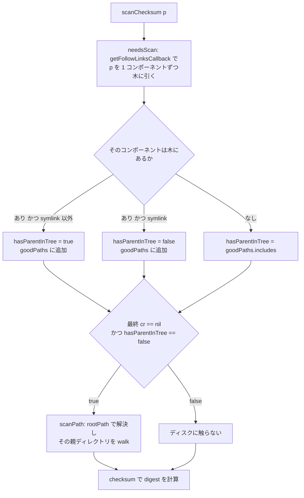

## 何を学んだか

`COPY /usr/bin/app /app` の `/usr/bin` がシンボリックリンクだったら、contenthash はそれを解決してから中身をハッシュしなければならない。ただし解決先が `/etc/passwd` や `../../../../etc` を指していても、**ホスト側のファイルに触ってはいけない**。マウントしたスナップショットのルートが、そのまま `/` として扱われる必要がある ([スコープと信頼境界](../scope-and-trust/))。

BuildKit は同じ解決アルゴリズムを 2 回実装している。

- `cache/contenthash/path.go` の `rootPath` — **実ファイルシステムの上**で解決する。`os.Lstat` / `os.Readlink` を叩く。
- `cache/contenthash/checksum.go` の `getFollowLinksCallback` — **radix tree の上**で解決する。ディスクに触らない。

どちらも `filepath-securejoin` を出発点にしていて、コンポーネントを 1 つずつ足しながら `filepath.Join("/", ...)` で正規化するため、`..` がルートより上に抜けない。そしてもう 1 つの主題が `needsScan` だ。木の上の解決が答えを出せたなら、ディスク走査は起きない。

## rootPath — ディスク側の解決

ライセンスヘッダが出自を明示している。

```go title="cache/contenthash/path.go"
// This code mostly comes from <https://github.com/cyphar/filepath-securejoin>.
```

([cache/contenthash/path.go L1](https://github.com/moby/buildkit/blob/ca4838f8ddbd3612bca94bcb8a938d8a326110a3/cache/contenthash/path.go#L1))

```go title="cache/contenthash/path.go"
var errTooManyLinks = errors.New("too many links")

const maxSymlinkLimit = 255

type onSymlinkFunc func(string, string) error

// rootPath joins a path with a root, evaluating and bounding any symlink to
// the root directory. This is a slightly modified version of SecureJoin from
// github.com/cyphar/filepath-securejoin, with a callback which we call after
// each symlink resolution.
func rootPath(root, unsafePath string, followTrailing bool, cb onSymlinkFunc) (string, error) {
```

([path.go L18-L28](https://github.com/moby/buildkit/blob/ca4838f8ddbd3612bca94bcb8a938d8a326110a3/cache/contenthash/path.go#L18-L28))

脱出を防いでいるのは、ループ本体の 2 行だ。

```go title="cache/contenthash/path.go"
		nextPath := filepath.Join(string(filepath.Separator), currentPath, part)
		if nextPath == string(filepath.Separator) {
			// If we end up back at the root, we don't need to re-evaluate /.
			currentPath = ""
			continue
		}
		fullPath := root + string(filepath.Separator) + nextPath
```

([path.go L58-L64](https://github.com/moby/buildkit/blob/ca4838f8ddbd3612bca94bcb8a938d8a326110a3/cache/contenthash/path.go#L58-L64))

`nextPath` は毎回 `/` から始まる絶対パスとして `Join` されるので、`..` はそこで潰れる。`/a/../..` は `Join` の時点で `/` になり、それ以上は上がらない。`fullPath` は常に `root` の下だ。**1 コンポーネントずつ足して毎回 Clean する**のが肝で、`Join(root, unsafePath)` を一度やってから解決すると、途中に現れるリンクの内容で脱出できてしまう。

絶対リンクの扱いも同じ発想でできている。

```go title="cache/contenthash/path.go"
		unsafePath = dest + string(filepath.Separator) + unsafePath
		// Absolute symlinks reset any work we've already done.
		if filepath.IsAbs(dest) {
			currentPath = ""
		}
```

([path.go L100-L104](https://github.com/moby/buildkit/blob/ca4838f8ddbd3612bca94bcb8a938d8a326110a3/cache/contenthash/path.go#L100-L104))

`/etc/passwd` を指すリンクは「ホストの `/etc/passwd`」ではなく「`root` から見た `/etc/passwd`」に解決される。`currentPath` を空に戻すだけで、`root` の連結は次のループ頭で必ず起きるからだ。

`followTrailing` は「最後のコンポーネントを解決するか」のフラグで、`O_PATH|O_NOFOLLOW` に相当する。

```go title="cache/contenthash/path.go"
		// Don't resolve the final component with !followTrailing.
		if !followTrailing && unsafePath == "" {
			currentPath = nextPath
			break
		}
```

([path.go L77-L81](https://github.com/moby/buildkit/blob/ca4838f8ddbd3612bca94bcb8a938d8a326110a3/cache/contenthash/path.go#L77-L81))

`COPY link /dst` はリンクそのものをコピーするので `followTrailing=false`、`COPY link/ /dst` や `COPY link/file /dst` は辿る。`ChecksumOpts.FollowLinks` がこの値の出所だ。

リンクを踏むたびに `linksWalked` が増え、255 を超えたら `errTooManyLinks` になる ([path.go L85-L88](https://github.com/moby/buildkit/blob/ca4838f8ddbd3612bca94bcb8a938d8a326110a3/cache/contenthash/path.go#L85-L88))。循環リンクを検出する専用の仕組みはなく、回数の上限だけで打ち切る。

`path_test.go` は `./link1sub/../notaloop` のような「リンクを経由してから `..` する」ケースを網羅している。字句的な `..` の除去と、リンク解決後の `..` の除去は結果が違うので、そこがテストの主題になっている ([cache/contenthash/path_test.go L14-L54](https://github.com/moby/buildkit/blob/ca4838f8ddbd3612bca94bcb8a938d8a326110a3/cache/contenthash/path_test.go#L14-L54))。

## getFollowLinks — 木の上の解決

`Checksum` の実処理はまず radix tree を引く。木には `CacheRecordTypeSymlink` のレコードと `Linkname` が入っているので、ディスクを叩かずに同じ解決ができる。

```go title="cache/contenthash/checksum.go"
func getFollowLinksCallback(root *iradix.Node[*CacheRecord], k []byte, followTrailing bool, cb followLinksCallback) ([]byte, *CacheRecord, error) {
	v, ok := root.Get(k)
	if ok && (!followTrailing || v.Type != CacheRecordTypeSymlink) {
		return k, v, nil
	}
```

([cache/contenthash/checksum.go L1149-L1153](https://github.com/moby/buildkit/blob/ca4838f8ddbd3612bca94bcb8a938d8a326110a3/cache/contenthash/checksum.go#L1149-L1153))

まずキーの直引きを試し、当たれば終わり。当たらないか、あるいは末尾を辿る必要があるときだけコンポーネント分解に降りる。ループの構造は `rootPath` と同じで、リンクを見つけたら残りのパスの前に `Linkname` を差し込む。

```go title="cache/contenthash/checksum.go"
		remainingPath = cr.Linkname + "/" + remainingPath
		if path.IsAbs(cr.Linkname) {
			currentPath = "/"
		}
```

([checksum.go L1205-L1208](https://github.com/moby/buildkit/blob/ca4838f8ddbd3612bca94bcb8a938d8a326110a3/cache/contenthash/checksum.go#L1205-L1208))

上限も `rootPath` と同じ `maxSymlinkLimit` を共有している。

木の側にしかない事情が 1 つある。**末尾のスラッシュに意味がある**ことだ。`/dir` は DIR レコード、`/dir/` は DIR_HEADER レコードで、別のキーになる ([radix tree のレイアウト](../contenthash-radix-tree/))。`path.Clean` は末尾スラッシュを落とすので、先に外して最後に付け直す。

```go title="cache/contenthash/checksum.go"
	// Trailing slashes are significant for the cache, but path.Clean strips
	// them. We only care about the slash for the final lookup.
	remainingPath, hadTrailingSlash := strings.CutSuffix(remainingPath, "/")
```

([checksum.go L1164-L1166](https://github.com/moby/buildkit/blob/ca4838f8ddbd3612bca94bcb8a938d8a326110a3/cache/contenthash/checksum.go#L1164-L1166))

コールバックは「各コンポーネントを引いた直後」に呼ばれる。見つからなければ `cr` が `nil` で渡る。この「見つからなかったことも通知する」設計が、次の `needsScan` を成立させている。

## needsScan — 走査が要るかを木だけで決める

```go title="cache/contenthash/checksum.go"
// needsScan returns false if path is in the tree or a parent path is in tree
// and subpath is missing.
func (cc *cacheContext) needsScan(root *iradix.Node[*CacheRecord], path string, followTrailing bool) (bool, error) {
	var (
		goodPaths       pathSet
		hasParentInTree bool
	)
	k := convertPathToKey(path)
	_, cr, err := getFollowLinksCallback(root, k, followTrailing, func(subpath string, cr *CacheRecord) error {
		// If we found a path that exists in the cache, add it to the set of
		// known-scanned paths. Otherwise, verify whether the not-found subpath
		// is inside a known-scanned path (we might have hit a "..", taking us
		// out of the scanned paths, or we might hit a non-existent path inside
		// a scanned path). getFollowLinksCallback iterates left-to-right, so
		// we will always hit ancestors first.
		if cr != nil {
			hasParentInTree = cr.Type != CacheRecordTypeSymlink
			goodPaths.add(subpath)
		} else {
			hasParentInTree = goodPaths.includes(subpath)
		}
		return nil
	})
	if err != nil {
		return false, err
	}
	return cr == nil && !hasParentInTree, nil
}
```

([checksum.go L1002-L1029](https://github.com/moby/buildkit/blob/ca4838f8ddbd3612bca94bcb8a938d8a326110a3/cache/contenthash/checksum.go#L1002-L1029))

判定は「最終的に引けなかった **かつ** 既知の走査済み領域の中にいない」ときだけ真になる。逆に言うと、**走査済みのディレクトリの中で存在しないパスを引いても、走査は起きない**。これが重要で、走査済みなら「無い」という答えも信用できるからだ。

`goodPaths` の型 `pathSet` は接頭辞の集合で、コメントどおり `/a/b` を `/a/b/c` の親と認めつつ `/a/bc` の親とは認めないよう、末尾に `/` を付けて保持する ([checksum.go L967-L971](https://github.com/moby/buildkit/blob/ca4838f8ddbd3612bca94bcb8a938d8a326110a3/cache/contenthash/checksum.go#L967-L971))。

シンボリックリンクが見つかったときだけ `hasParentInTree` が偽になるのは、リンクは「木に記録されてはいるが、その先が走査済みとは限らない」からだ。`scanPath` はリンクを踏むたびにコールバックでレコードを入れるので ([checksum.go L1049-L1057](https://github.com/moby/buildkit/blob/ca4838f8ddbd3612bca94bcb8a938d8a326110a3/cache/contenthash/checksum.go#L1049-L1057))、通り道のリンクは木にあるが、そのリンクが含まれるディレクトリは走査されていないことがありうる。



`TestChecksumSymlinkNoParentScan` がこの境界をそのまま検証している。`aa/ln/bb/cc/dd` のチェックサムを取った後、`/aa/bb/cc` 配下は (存在しないパスであっても) 走査不要、`/aa` や `/aa/bb` は走査必要、と分かれる ([cache/contenthash/checksum_test.go L69-L98](https://github.com/moby/buildkit/blob/ca4838f8ddbd3612bca94bcb8a938d8a326110a3/cache/contenthash/checksum_test.go#L69-L98))。

## scanPath — 親ディレクトリだけを walk する

走査が要ると判定されたら、`rootPath` で実際のパスを解決し、その**親ディレクトリ**を `filepath.Walk` する。

```go title="cache/contenthash/checksum.go"
	// Scan the parent directory of the path we resolved, unless we're at the
	// root (in which case we scan the root).
	scanPath := filepath.Dir(resolvedPath)
	if !strings.HasPrefix(filepath.ToSlash(scanPath)+"/", filepath.ToSlash(mp)+"/") {
		scanPath = resolvedPath
	}
```

([checksum.go L1062-L1067](https://github.com/moby/buildkit/blob/ca4838f8ddbd3612bca94bcb8a938d8a326110a3/cache/contenthash/checksum.go#L1062-L1067))

親を選ぶのは、ダイジェストの計算には兄弟ファイルが要ることが多いからだ。`filepath.Walk` は再帰なので、`/aa/bb/cc/dd` を要求すると `/aa/bb/cc` 以下が丸ごと木に入る。ガードは「`Dir` がマウントポイントの外に出た場合」、つまり `resolvedPath` がルートそのものだった場合に効く。

walk が入れるレコードには digest がない。

```go title="cache/contenthash/checksum.go"
		k := convertPathToKey(keyPath(rel))
		if _, ok := n.Get(k); !ok {
			cr := &CacheRecord{
				Type: CacheRecordTypeFile,
			}
```

([checksum.go L1084-L1088](https://github.com/moby/buildkit/blob/ca4838f8ddbd3612bca94bcb8a938d8a326110a3/cache/contenthash/checksum.go#L1084-L1088))

`n` はトランザクション開始前のスナップショットなので、**既にレコードがあるパスは上書きされない**。転送のときに計算済みだったダイジェストが、走査で消えることはない ([増分更新](../contenthash-incremental/))。ここで入るのは「構造だけ分かっていて中身は未計算」というレコードで、digest は `checksum` が必要になった時点で埋める。

走査が実際に抑制されているかは、テスト専用のカウンタ `scanCounter` で検証されている。コメントは `Only used by TestNeedScanChecksumRegression to make sure scanPath is not called for paths we have already scanned` ([checksum.go L1031-L1036](https://github.com/moby/buildkit/blob/ca4838f8ddbd3612bca94bcb8a938d8a326110a3/cache/contenthash/checksum.go#L1031-L1036))。

対応する `TestNeedScanChecksumRegression` は [issue 5042](https://github.com/moby/buildkit/issues/5042) の回帰テストで、興味深い挙動を固定している。**ルート直下の存在しないパスを引くと木全体が走査される**ので、それ以降は何を引いても `needsScan` が偽になる ([checksum_test.go L184-L218](https://github.com/moby/buildkit/blob/ca4838f8ddbd3612bca94bcb8a938d8a326110a3/cache/contenthash/checksum_test.go#L184-L218))。「一度全部見たなら、無いものは無い」を素直に実装するとこうなる。

## ワイルドカードとフィルタがあるときは全走査

`includedPaths` はパターンマッチのために全エントリを列挙するので、入口で必ずルートの走査を確認する。

```go title="cache/contenthash/checksum.go"
	root := cc.tree.Root()
	scan, err := cc.needsScan(root, "", false)
	if err != nil {
		return "", nil, err
	}
	if scan {
		if err := cc.scanPath(ctx, m, "", false); err != nil {
			return "", nil, err
		}
	}
```

([checksum.go L477-L486](https://github.com/moby/buildkit/blob/ca4838f8ddbd3612bca94bcb8a938d8a326110a3/cache/contenthash/checksum.go#L477-L486))

そのうえで、ワイルドカードの前にある固定部分だけを先にリンク解決する。

```go title="cache/contenthash/checksum.go"
	// For consistency with what the copy implementation in fsutil
	// does: split pattern into non-wildcard prefix and rest of
	// pattern, then follow symlinks when resolving the non-wildcard
	// prefix.

	d1, d2 := splitWildcards(p)
	// ...
	// Only resolve the final symlink component if there are components in the
	// wildcard segment.
	k, cr, err := getFollowLinks(root, convertPathToKey(d1), d2 != "")
```

([checksum.go L755-L773](https://github.com/moby/buildkit/blob/ca4838f8ddbd3612bca94bcb8a938d8a326110a3/cache/contenthash/checksum.go#L755-L773))

`COPY dir/*.go` の `dir` はリンクなら辿るが、`COPY link*` の `link*` 自体は辿らない。判断基準は「ワイルドカード区間に成分があるか」だけだ。`splitWildcards` は `*` `?` `[` の最初の出現でパスを 2 つに割る ([checksum.go L775-L805](https://github.com/moby/buildkit/blob/ca4838f8ddbd3612bca94bcb8a938d8a326110a3/cache/contenthash/checksum.go#L775-L805))。

リンクを解決したあとには、パターンマッチのためにパスを**元の表記に戻す**必要がある。

```go title="cache/contenthash/checksum.go"
		// For example, if the original 'p' argument was /a/b and there
		// is a symlink a->c, we want fn to be /a/b/foo rather than
		// /c/b/foo. This is necessary to ensure correct pattern
		// matching.
		if after, ok := strings.CutPrefix(fn, resolvedPrefix); ok {
			fn = origPrefix + after
		}
```

([checksum.go L570-L579](https://github.com/moby/buildkit/blob/ca4838f8ddbd3612bca94bcb8a938d8a326110a3/cache/contenthash/checksum.go#L570-L579))

`--exclude=a/vendor` と書いたユーザは `a` がリンクであることを知らない。マッチはユーザが書いた表記で行い、木の走査は解決後の表記で行う。この 2 つの座標系の変換が 1 箇所に閉じている。

最後に、列挙された要素のうち**最上位のもの**がリンクだった場合は、あらためて解決してダイジェストを取り直す。

```go title="cache/contenthash/checksum.go"
	for i, w := range includedPaths {
		if w.followLinks && w.record.Type == CacheRecordTypeSymlink {
			dgst, err := cc.lazyChecksum(ctx, m, w.path, opts.FollowLinks)
			if err != nil {
				return "", err
			}
			includedPaths[i].record = &CacheRecord{Digest: string(dgst)}
		}
	}
```

([checksum.go L438-L446](https://github.com/moby/buildkit/blob/ca4838f8ddbd3612bca94bcb8a938d8a326110a3/cache/contenthash/checksum.go#L438-L446))

`followLinks` が立つのは親ディレクトリを持たない要素だけだ ([checksum.go L604-L607](https://github.com/moby/buildkit/blob/ca4838f8ddbd3612bca94bcb8a938d8a326110a3/cache/contenthash/checksum.go#L604-L607))。`COPY link* /dst` でマッチしたリンクは辿るが、ディレクトリの中に入っていたリンクはリンクのままコピーされる、という `COPY` の挙動に合わせてある。

## なぜそうなっているか

**なぜ 2 つの解決器があるのか。** ディスク側 (`rootPath`) は走査の前に「どこを walk すべきか」を決めるために要る。木の側 (`getFollowLinksCallback`) は「ディスクを見ずに答えられるか」を決めるために要る。木だけで済ませると、まだ走査していない領域のリンクが辿れない。ディスクだけで済ませると、`COPY` のたびにファイルシステムを触ることになる。役割が違うので統合できず、代わりに**同じアルゴリズムの 2 実装**という形になっている。片方を直したらもう片方も直す必要がある、という保守コストを、両方に securejoin という共通の出自を持たせることで抑えている。

**なぜ「1 コンポーネントずつ Join」なのか。** `filepath.Join(root, unsafePath)` を先にやってから `EvalSymlinks` する実装は壊れる。`unsafePath` の途中に `../../..` を指すリンクがあると、解決結果が `root` の外に出る。`..` の除去は「リンクを 1 つ解決するたびに」やらなければ意味がない。これはコンテナランタイム一般に共通する罠で、`checksum` 側にも痕跡がある。

```go title="cache/contenthash/checksum.go"
		// no FollowSymlinkInScope because invalid paths should not be inserted
		fp := filepath.Join(target, filepath.FromSlash(p))
```

([checksum.go L939-L940](https://github.com/moby/buildkit/blob/ca4838f8ddbd3612bca94bcb8a938d8a326110a3/cache/contenthash/checksum.go#L939-L940))

ここで素の `Join` を使っているのは、**木に入っている時点でパスは検証済み**だからだ。検証の責務を入口 (`scanPath` と `HandleChange`) に集約し、そこから先は信用する、という切り方をしている。

**なぜ走査を渋るのか。** `filepath.Walk` はディレクトリの `readdir` と `lstat` を全ファイル分やる。数十万ファイルのビルドコンテキストで `COPY package.json /` のたびに全走査すると、キャッシュを引くコストが計算するコストに近づく。`needsScan` が「走査済みなら『無い』も信用する」を実装しているのは、否定的な答えのためだけに走査したくないからだ。

## どう活かすか

- **パス解決は「1 コンポーネント足す → Clean する」を繰り返す。** 全体を連結してから解決すると、途中のリンクで境界を越えられる。ルートを越えさせない実装は、この順序でしか書けない。他人が書いた `SecureJoin` があるならそれを使い、自作するなら `filepath-securejoin` のテストごと持ってくる。
- **循環は回数上限で切る。** 訪問済み集合を持つより、リンクを踏んだ回数を数えて上限で止めるほうが単純で、カーネルの `ELOOP` と挙動が揃う。
- **キャッシュには「走査済みの領域」を別に持つ。** 「エントリが無い」と「まだ見ていない」を区別できないキャッシュは、否定的な問い合わせのたびに再取得する。`pathSet` のような接頭辞集合を 1 つ持つだけで、存在しないパスへの問い合わせが無料になる。
- **ユーザが書いた表記と解決後の表記を混ぜない。** フィルタのマッチはユーザの表記で、データ構造の走査は解決後の表記で行い、変換は 1 箇所に閉じる。混ぜると「リンクを張ったら `.dockerignore` が効かなくなった」の類のバグになる。
- **検証の責務を境界に集約し、内側では素の関数を使う。** 「ここに来る値は検証済み」とコメントで明示したうえで `filepath.Join` を使うほうが、あらゆる場所で安全版を呼ぶより読みやすい。ただし境界がどこかを、コードとコメントの両方で示せることが条件になる。
