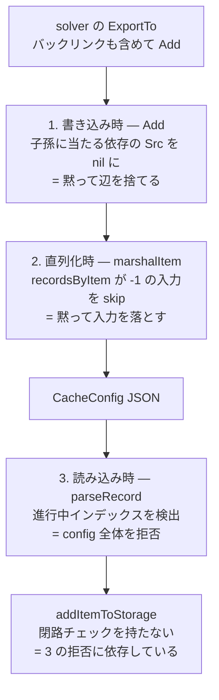

## 何を学んだか

`CacheChains` が組み立てるグラフは、放っておくと閉路を持つ。閉路のあるグラフは JSON に落とすときに無限再帰し、読み込み側でも無限再帰する。BuildKit はこれを 3 か所で防いでいるが、**3 か所とも態度が違う**。

| 場所                                          | 何をするか                               | 閉路を見つけたら                   |
| --------------------------------------------- | ---------------------------------------- | ---------------------------------- |
| 書き込み時 (`Add`)                            | 新レコードの子孫に当たる依存を辺から外す | 黙って辺を捨てる                   |
| 直列化時 (`marshalItem`)                      | 再帰中のノードを指す入力を飛ばす         | 黙って入力を落とす                 |
| 読み込み時 (`parseRecord` / `getRemoteChain`) | 再帰中のインデックスを検出する           | エラーにして config 全体を拒否する |

書く側は best-effort、読む側は厳格。同じ不正に対する扱いが非対称になっている。

## 閉路はどこから来るか

`item.dgst` はビルドの頂点 (vertex) ではなく、**キャッシュキー**である。コメントがその関係を明示している。

```go title="cache/remotecache/v1/chains.go"
	// dgst is the unique identifier for each record.
	// This *roughly* corresponds to an edge (vertex cachekey + index) in the
	// solver - however, a single vertex can produce multiple unique cache keys
	// (e.g. fast/slow), so it's a one-to-many relation.
	dgst digest.Digest
```

([cache/remotecache/v1/chains.go L299-L303](https://github.com/moby/buildkit/blob/ca4838f8ddbd3612bca94bcb8a938d8a326110a3/cache/remotecache/v1/chains.go#L299-L303))

1 つの頂点が複数のキーを持ち、レコードの同一性は「ダイジェスト + 入力ごとの依存集合」で決まる。ここに 2 つの圧力がかかる。

1 つは**バックリンクの書き出し**だ。`ExportTo` は、今回のビルドが通った経路だけでなく、キャッシュ DB のバックリンクを辿って「同じ結果に至る別経路」も `Add` する ([solver/exporter.go L260-L267](https://github.com/moby/buildkit/blob/ca4838f8ddbd3612bca94bcb8a938d8a326110a3/solver/exporter.go#L260-L267))。詳しくは [キャッシュのエクスポート](../cache-export/) を参照。今回のビルドの向きとは無関係に、上流方向のレコードが混ざってくる。

もう 1 つは**マージ**である。`Add` は依存集合の積が複数要素になったとき、それらを 1 ノードに潰す。

```go title="cache/remotecache/v1/chains.go"
	if len(items) > 1 {
		var main *item
		for it := range items {
			main = it
			break
		}
		for it := range items {
			if it == main {
				continue
			}
			// it の children と results を main に寄せる
```

([cache/remotecache/v1/chains.go L111-L147](https://github.com/moby/buildkit/blob/ca4838f8ddbd3612bca94bcb8a938d8a326110a3/cache/remotecache/v1/chains.go#L111-L147))

別々だった 2 ノードを 1 つにすると、片方の祖先だったノードがもう片方の子孫にもなりうる。この分岐を入れたコミットの題が `remotecache: add merge keys for loops` (846a4ccd1) であることからも、マージと閉路が同じ話題として扱われているのが読める。

## 1. 書き込み時 — 子孫を指す依存を外す

マージの直後、`Add` は新しいレコード `r` の子孫を全部集めて、依存の中にそれが含まれていないかを見る。

```go title="cache/remotecache/v1/chains.go"
	for it := range items {
		r = it
		for _, rr := range results {
			r.addResult(rr)
		}

		// make sure that none of the deps are children of r
		allChildren := map[*item]struct{}{}
		if err := r.walkChildren(func(i *item) error {
			allChildren[i] = struct{}{}
			return nil
		}, map[*item]struct{}{}); err != nil {
			return nil, false, errors.Wrapf(err, "failed to walk children of %s", dgst)
		}
		for i, dd := range deps {
			for j, d := range dd {
				if _, ok := allChildren[d.Src.(*item)]; ok {
					deps[i][j].Src = nil
				}
			}
		}
		break
	}
	for i, dd := range deps {
		for _, d := range dd {
			if d.Src == nil {
				continue
			}
			d.Src.(*item).addChild(r, i, d.Selector)
		}
	}
```

([cache/remotecache/v1/chains.go L149-L179](https://github.com/moby/buildkit/blob/ca4838f8ddbd3612bca94bcb8a938d8a326110a3/cache/remotecache/v1/chains.go#L149-L179))

`Src` を `nil` にするのは「この辺は張らない」という印で、直後のループがそれを飛ばす。エラーにもログにもならない。

この防御が効くのは `items` が空でないとき、つまり**既存ノードを再利用したとき**だけだ。新規ノードなら子はまだ 1 つも無いので、そもそも自分の子孫に依存が入る余地がない。`walkChildren` は `visited` マップを持っているので、走査自体は既にある閉路でも止まる ([cache/remotecache/v1/chains.go L408-L424](https://github.com/moby/buildkit/blob/ca4838f8ddbd3612bca94bcb8a938d8a326110a3/cache/remotecache/v1/chains.go#L408-L424))。

## 2. 直列化時 — 進行中マーカ `-1`

かつては `Marshal` の前段に `normalizeState.removeLoops` という専用の閉路除去パスがあり、根から DFS して `visited` に入っているノードへの辺を `removeLink` で消していた。閉路を消せなかったときは `failed to remove looping cache key` と警告ログを出す作りだった。この関数は [CacheChains](../cache-chains/) で触れた 2d7ef04df の改修で削除されている。

いま残っているのは `marshalItem` の中の、進行中マーカだけだ。

```go title="cache/remotecache/v1/utils.go"
func marshalItem(ctx context.Context, it *item, state *marshalState) error {
	if _, ok := state.recordsByItem[it]; ok {
		return nil
	}
	state.recordsByItem[it] = -1

	rec := cacheimporttypes.CacheRecord{
		Digest: it.dgst,
		Inputs: make([][]cacheimporttypes.CacheInput, len(it.parents)),
	}

	for i, m := range it.parents {
		for l := range m {
			if err := marshalItem(ctx, l.src, state); err != nil {
				return err
			}
			idx, ok := state.recordsByItem[l.src]
			if !ok {
				return errors.Errorf("invalid source record: %v", l.src)
			}
			if idx == -1 {
				continue
			}
			rec.Inputs[i] = append(rec.Inputs[i], cacheimporttypes.CacheInput{
				Selector:  l.selector,
				LinkIndex: idx,
			})
		}
	}
	// ...
	state.recordsByItem[it] = len(state.records)
	state.records = append(state.records, rec)
	return nil
}
```

([cache/remotecache/v1/utils.go L183-L227](https://github.com/moby/buildkit/blob/ca4838f8ddbd3612bca94bcb8a938d8a326110a3/cache/remotecache/v1/utils.go#L183-L227))

`-1` は「このノードは再帰の途中で、まだ配列に入っていない」を意味する。依存を辿った先が `-1` なら、それは**いま自分が降りてきた経路上のノード**、つまり閉路だ。その入力を `continue` で捨てる。実インデックスは再帰から戻ったあとに書き込まれるので、後行順で `records` が積まれ、`LinkIndex` は必ず既に確定した値を指す。

ここでも黙って落とす。ただし落とし方には副作用がある。ある入力番号のリンクが全部落ちると `rec.Inputs[i]` が空のままになり、それは読み込み側が拒否する形になる (後述)。だから 1 の書き込み時の防御が実質的な本命で、`-1` は最後の砦という位置づけになる。

## 3. 読み込み時 — エラーで拒否する

`Parse` は JSON の `CacheConfig` を再び `CacheExporterTarget.Add` に流し込んで `CacheChains` を組み直す。ここでは閉路は無視されず、エラーになる。

```go title="cache/remotecache/v1/parse.go"
func parseRecord(cc cacheimporttypes.CacheConfig, idx int, provider DescriptorProvider, t solver.CacheExporterTarget, cache map[int]solver.CacheExporterRecord) (solver.CacheExporterRecord, error) {
	if r, ok := cache[idx]; ok {
		if r == nil {
			return nil, errors.New("invalid looping record")
		}
		return r, nil
	}

	cache[idx] = nil
	if idx < 0 || idx >= len(cc.Records) {
		return nil, errors.Errorf("invalid record ID: %d", idx)
	}
```

([cache/remotecache/v1/parse.go L33-L44](https://github.com/moby/buildkit/blob/ca4838f8ddbd3612bca94bcb8a938d8a326110a3/cache/remotecache/v1/parse.go#L33-L44))

`marshalItem` の `-1` と同じ「進行中は nil」パターンだが、当たったときの反応が真逆で、`errors.New("invalid looping record")` を返して `ParseConfig` ごと失敗させる。空の入力もここで弾かれる。

```go title="cache/remotecache/v1/parse.go"
	for i, inputs := range rec.Inputs {
		if len(inputs) == 0 {
			return nil, errors.Errorf("invalid empty input for record %d", idx)
		}
```

([cache/remotecache/v1/parse.go L49-L52](https://github.com/moby/buildkit/blob/ca4838f8ddbd3612bca94bcb8a938d8a326110a3/cache/remotecache/v1/parse.go#L49-L52))

レイヤ側にも同じ形の防御がある。`CacheLayer.ParentIndex` は親レイヤの添字なので、これも閉路を作れる。

```go title="cache/remotecache/v1/parse.go"
func getRemoteChain(layers []cacheimporttypes.CacheLayer, idx int, provider DescriptorProvider, visited map[int]struct{}) (*solver.Remote, error) {
	if _, ok := visited[idx]; ok {
		return nil, errors.New("invalid looping layer")
	}
	visited[idx] = struct{}{}
```

([cache/remotecache/v1/parse.go L116-L120](https://github.com/moby/buildkit/blob/ca4838f8ddbd3612bca94bcb8a938d8a326110a3/cache/remotecache/v1/parse.go#L116-L120))

`visited` は `CacheResult` 1 件ごとに作り直される ([cache/remotecache/v1/parse.go L67-L69](https://github.com/moby/buildkit/blob/ca4838f8ddbd3612bca94bcb8a938d8a326110a3/cache/remotecache/v1/parse.go#L67-L69))。レイヤ鎖は 1 本道なので、同じ添字に 2 回来たら必ず閉路になる。



## 読み込み側の最後の一段には防御が無い

`Parse` が通ったあと、`CacheChains` は `NewCacheKeyStorage` で solver 用のキーストレージに変換される。その中の `addItemToStorage` は再帰的に `parents` を降りるが、メモ化のマーカを**再帰のあとに**置いている。

```go title="cache/remotecache/v1/cachestorage.go"
func addItemToStorage(k *cacheKeyStorage, it *item) (*itemWithOutgoingLinks, error) {
	// byItem is shared across all leaf traversals and must be the sole source
	// of memoized items. ...
	if id, ok := k.byItem[it]; ok {
		return k.byID[id], nil
	}

	id := it.id

	for i, m := range it.parents {
		for l := range m {
			src, err := addItemToStorage(k, l.src)
			// ...
		}
	}

	itl := &itemWithOutgoingLinks{ /* ... */ }
	k.byItem[it] = id
	k.byID[id] = itl
```

([cache/remotecache/v1/cachestorage.go L41-L72](https://github.com/moby/buildkit/blob/ca4838f8ddbd3612bca94bcb8a938d8a326110a3/cache/remotecache/v1/cachestorage.go#L41-L72))

`k.byItem[it] = id` が再帰ループの後にあるので、閉路があればこの関数は自分自身に戻ってきて止まらない。つまり**この関数は入力が非閉路であることを前提にしている**。その前提を保証しているのが `parseRecord` のエラーであり、`NewCacheKeyStorage` の呼び出し元がすべて `ParseConfig` を通した直後であること (`cache/remotecache/import.go`、`gha`、`s3`、`azblob`) がその条件を満たしている。

なおこの位置には別のバグの跡がある。コメントの後半 —

> A separate per-traversal map can retain a nil marker when this shortcut finds an item completed by an earlier traversal, causing a later reference to that item to silently lose its link.

— は、ここに走査ごとのローカルな `visited` マップを足したときにリンクが 1 本消えるという不具合の説明で、`remotecache: correct cache link fix` (e7050b9ea) で「余分な走査状態を消し、後行順の登録だけを残す」形に戻されている。閉路対策として素朴に `visited` を足すと壊れる場所だ、という警告として読める。

## なぜそうなっているか

書く側と読む側で態度が非対称なのは、それぞれが守っているものが違うからだ。

書く側にとって、閉路のある辺は「たまたま今回の走査順で自己参照になった辺」であり、それを捨てても失われるのはキャッシュヒットの機会だけだ。リモートキャッシュは無くても正しくビルドできる。だから `Add` も `marshalItem` も、黙って辺を落として先へ進む。エクスポートを失敗させるほうが害が大きい。

読む側にとっては逆で、閉路を含む config は**信用できない入力**だ。リモートキャッシュはネットワーク越しの、しばしば他人が書いたレジストリから来る。閉路を許すと `getRemoteChain` も `addItemToStorage` も止まらなくなる。だから `parseRecord` は best-effort をやめて、config 全体を拒否する。読み込み側にはもう 1 つ、config blob のサイズ上限 1 MiB という素朴な上限もある ([cache/remotecache/import.go L132-L136](https://github.com/moby/buildkit/blob/ca4838f8ddbd3612bca94bcb8a938d8a326110a3/cache/remotecache/import.go#L132-L136))。同じ発想の防御だ。信頼境界の考え方は [スコープと信頼境界](../scope-and-trust/) にも通じる。

## どう活かすか

**同じ不変条件でも、境界のどちら側にいるかで違反時の振る舞いを変える。** 自分が作ったデータなら壊れた部分を落として進めばよいが、外から来たデータなら「壊れている」という事実そのものが情報で、静かに修復するとバグを隠すことになる。

もう 1 つは、**進行中マーカを sentinel 値で表す**という小技だ。`marshalItem` は `map[*item]int` の `-1`、`parseRecord` は `map[int]Record` の `nil` で「再帰の途中」を表している。別に `visited` セットを用意するのに比べて、

- 「未訪問」「訪問中」「訪問済み」の 3 状態が 1 つのマップに収まる
- 訪問済みの場合の返り値 (インデックス、レコード) をそのまま流用できる

という利点がある。後行順で確定値を書き込むので、参照先のインデックスが未確定になることもない。DAG を配列に平坦化する処理では使い回しが効く形だ。`addItemToStorage` のコメントが警告しているとおり、この状態を複数のマップに分けて持つと不整合が生まれる。1 つのマップに 3 状態を集約するのは、単なる節約ではなく整合性の担保でもある。
