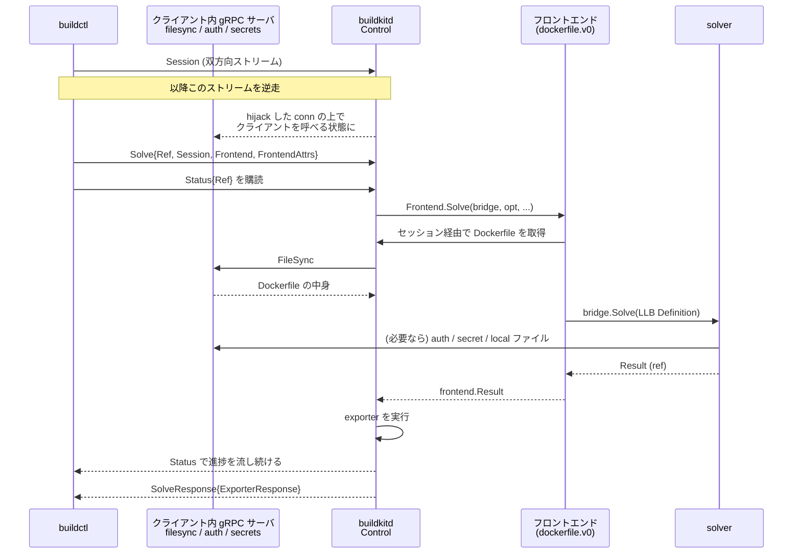

## 何を学んだか

BuildKit の登場人物は 3 つある。**クライアント** (`buildctl` / buildx / Go の `client` パッケージ)、**デーモン** (`buildkitd`)、**フロントエンド** (Dockerfile を LLB に変換するもの) だ。素朴に想像すると「クライアントがファイルを送り、デーモンがビルドし、フロントエンドはデーモンのライブラリ」となりそうだが、実際は 3 つとも向きが違う。

- クライアント → デーモン: `Solve` を 1 回呼ぶ。ここで送るのは**リクエストの記述だけ**で、ファイルも認証情報も入っていない。
- デーモン → クライアント: 別に張った 1 本のストリームを逆走して、クライアント側に立てた gRPC サーバを呼ぶ。ファイル転送・認証・secret はすべてこの向きで流れる。
- フロントエンド → デーモン: フロントエンドは `Frontend` インターフェースの向こう側で動き、`FrontendLLBBridge` を通じて solver を呼び返す。外部フロントエンドの場合はコンテナの中で動くので、これも逆向きの gRPC になる。

つまり **BuildKit の通信は、gRPC の「クライアント」と「サーバ」が役割ごとに入れ替わる構造**になっている。

## Control サービスは 8 本しかない

デーモンが公開する API は小さい。

```proto title="api/services/control/control.proto"
service Control {
	rpc DiskUsage(DiskUsageRequest) returns (DiskUsageResponse);
	rpc Prune(PruneRequest) returns (stream UsageRecord);
	rpc Solve(SolveRequest) returns (SolveResponse);
	rpc Status(StatusRequest) returns (stream StatusResponse);
	rpc Session(stream BytesMessage) returns (stream BytesMessage);
	rpc ListWorkers(ListWorkersRequest) returns (ListWorkersResponse);
	rpc Info(InfoRequest) returns (InfoResponse);

	rpc ListenBuildHistory(BuildHistoryRequest) returns (stream BuildHistoryEvent);
	rpc UpdateBuildHistory(UpdateBuildHistoryRequest) returns (UpdateBuildHistoryResponse);
}
```

([api/services/control/control.proto L14-L25](https://github.com/moby/buildkit/blob/ca4838f8ddbd3612bca94bcb8a938d8a326110a3/api/services/control/control.proto#L14-L25))

ビルドに関わるのは `Solve` / `Status` / `Session` の 3 本だけだ。`Solve` はリクエストとレスポンスが 1 往復のユニコール、`Status` は進捗を返す単方向ストリーム、`Session` は**双方向の生バイトストリーム**になっている。この `Session` が三者関係の鍵になる。

`SolveRequest` に何が入るかを見ると、送っていないものが分かる。

```proto title="api/services/control/control.proto"
message SolveRequest {
	string Ref = 1;
	pb.Definition Definition = 2;
	// ...
	string Session = 5;
	string Frontend = 6;
	map<string, string> FrontendAttrs = 7;
	CacheOptions Cache = 8;
	repeated string Entitlements = 9;
	map<string, pb.Definition> FrontendInputs = 10;
	// ...
}
```

([api/services/control/control.proto L61-L82](https://github.com/moby/buildkit/blob/ca4838f8ddbd3612bca94bcb8a938d8a326110a3/api/services/control/control.proto#L61-L82))

`Ref` はこのビルドを識別する ID、`Session` はセッションの ID。ビルドコンテキストのファイルも、レジストリの認証情報も、`--secret` の中身もここにはない。あるのは「セッション ID」だけで、必要になったらデーモンがそのセッション越しに取りに来る。

## クライアントは 3 本の goroutine を同時に走らせる

`client.Solve` の中身は、1 回の RPC ではなく複数の並行した通信になる。

```go title="client/solve.go"
		eg.Go(func() error {
			sd := c.sessionDialer
			if sd == nil {
				sd = grpchijack.Dialer(c.ControlClient())
			}
			return s.Run(statusContext, sd)
		})
```

([client/solve.go L243-L249](https://github.com/moby/buildkit/blob/ca4838f8ddbd3612bca94bcb8a938d8a326110a3/client/solve.go#L243-L249))

1 本目。`grpchijack.Dialer` は、`Control.Session` の双方向ストリームを `net.Conn` に見せかけるアダプタだ。その上でクライアントは **gRPC サーバとして** `s.Run` を回す。何を提供するかは、事前に `s.Allow(...)` で登録されたアタッチャブルで決まる — filesync (ファイル転送)、auth (レジストリ認証)、secrets、ssh forward などだ ([1 本の接続を逆走させる (grpchijack)](../grpchijack/))。

```go title="client/solve.go"
		resp, err := c.ControlClient().Solve(ctx, sopt)
		if err != nil {
			return errors.Wrap(err, "failed to solve")
		}
```

([client/solve.go L337-L340](https://github.com/moby/buildkit/blob/ca4838f8ddbd3612bca94bcb8a938d8a326110a3/client/solve.go#L337-L340))

2 本目。本体の `Solve` を投げて、返るまで待つ。

```go title="client/solve.go"
	eg.Go(func() error {
		stream, err := c.ControlClient().Status(statusContext, &controlapi.StatusRequest{
			Ref: ref,
		})
```

([client/solve.go L369-L372](https://github.com/moby/buildkit/blob/ca4838f8ddbd3612bca94bcb8a938d8a326110a3/client/solve.go#L369-L372))

3 本目。`Ref` を指定して進捗ストリームを購読する。`Solve` のレスポンスは最終結果だけなので、途中経過は別ストリームで流れてくる ([progress — 意図的に lossy な進捗ツリー](../progress/))。

デーモン側の `Session` ハンドラは、ストリームを hijack してセッションマネージャに渡すだけだ。

```go title="control/control.go"
func (c *Controller) Session(stream controlapi.Control_SessionServer) error {
	bklog.G(stream.Context()).Debugf("session started")

	conn, closeCh, opts := grpchijack.Hijack(stream)
	defer conn.Close()
	// ...
	err := c.opt.SessionManager.HandleConn(ctx, conn, opts)
	bklog.G(ctx).Debugf("session finished: %v", err)
	return err
}
```

([control/control.go L627-L642](https://github.com/moby/buildkit/blob/ca4838f8ddbd3612bca94bcb8a938d8a326110a3/control/control.go#L627-L642))

以降、デーモンの中の誰か (source、executor、exporter) がクライアント側の機能を使いたくなったら、`session.Manager` からセッション ID で `Caller` を引いて gRPC クライアントとして呼ぶ ([SessionManager と、複数ジョブでのセッション共有](../session-manager/))。

## フロントエンドはデーモンの中で動き、solver を呼び返す

`Controller.Solve` はリクエストを組み替えて `llbsolver.Solver.Solve` に渡す。

```go title="control/control.go"
	resp, err := c.solver.Solve(ctx, req.Ref, req.Session, frontend.SolveRequest{
		Frontend:       req.Frontend,
		Definition:     req.Definition,
		FrontendOpt:    req.FrontendAttrs,
		FrontendInputs: req.FrontendInputs,
		CacheImports:   cacheImports,
	}, compatibilityVersion, llbsolver.ExporterRequest{ /* ... */ },
		entitlementsFromPB(req.Entitlements), procs, req.Internal, req.SourcePolicy, req.SourcePolicySession, req.ProxyNetwork)
```

([control/control.go L575-L585](https://github.com/moby/buildkit/blob/ca4838f8ddbd3612bca94bcb8a938d8a326110a3/control/control.go#L575-L585))

`Definition` と `Frontend` は排他だ。前者があれば LLB がそのまま来ているので solver に直行し、後者があればまずフロントエンドを呼んで LLB を作らせる。この分岐は bridge にある。

```go title="solver/llbsolver/provenance.go"
func (b *provenanceBridge) Solve(ctx context.Context, req frontend.SolveRequest, sid string) (res *frontend.Result, err error) {
	req = req.Clone()
	if req.Definition != nil && req.Definition.Def != nil && req.Frontend != "" {
		return nil, errors.New("cannot solve with both Definition and Frontend specified")
	}

	if req.Definition != nil && req.Definition.Def != nil {
		rp := newResultProxy(b, req)
		res = &frontend.Result{Ref: rp}
		// ...
	} else if req.Frontend != "" {
		f, ok := b.frontends[req.Frontend]
		if !ok {
			return nil, errors.Errorf("invalid frontend: %s", req.Frontend)
		}
		// ...
		wb := &provenanceBridge{llbBridge: b.llbBridge, req: &req, rootReq: rootReq}
		res, err = f.Solve(ctx, wb, b.llbBridge, req.FrontendOpt, req.FrontendInputs, sid, b.sm)
		// ...
	}
```

([solver/llbsolver/provenance.go L181-L204](https://github.com/moby/buildkit/blob/ca4838f8ddbd3612bca94bcb8a938d8a326110a3/solver/llbsolver/provenance.go#L181-L204))

重要なのは `f.Solve` の第 2 引数だ。フロントエンドには**自分を呼んだ bridge が渡される**。

```go title="frontend/frontend.go"
type Frontend interface {
	Solve(ctx context.Context, llb FrontendLLBBridge, exec executor.Executor, opt map[string]string, inputs map[string]*pb.Definition, sid string, sm *session.Manager) (*Result, error)
}

type FrontendLLBBridge interface {
	sourceresolver.MetaResolver
	Solve(ctx context.Context, req SolveRequest, sid string) (*Result, error)
	Warn(ctx context.Context, dgst digest.Digest, msg string, opts WarnOpts) error
}
```

([frontend/frontend.go L28-L36](https://github.com/moby/buildkit/blob/ca4838f8ddbd3612bca94bcb8a938d8a326110a3/frontend/frontend.go#L28-L36))

フロントエンドは `llb.Solve(...)` を呼んで LLB を解かせられる。つまり**フロントエンドと solver の関係は再帰的**で、`Frontend.Solve` の中から `FrontendLLBBridge.Solve` を呼び、そこでまた別のフロントエンドが起動されうる。`# syntax=` はまさにこの再帰を使っている ([#syntax= はフロントエンドの再帰呼び出しである](../syntax-directive/))。

外部フロントエンド (`gateway.v0`) の場合、フロントエンドはコンテナとして起動される。そのコンテナから `FrontendLLBBridge` を呼ぶために、デーモンは gRPC サーバをもう 1 つ登録している。

```go title="control/control.go"
func (c *Controller) Register(server *grpc.Server) {
	controlapi.RegisterControlServer(server, c)
	c.gatewayForwarder.Register(server)
	tracev1.RegisterTraceServiceServer(server, c)
	// ...
}
```

([control/control.go L188-L195](https://github.com/moby/buildkit/blob/ca4838f8ddbd3612bca94bcb8a938d8a326110a3/control/control.go#L188-L195))

`gatewayForwarder.Register` は `LLBBridge` サービスを登録する ([control/gateway/gateway.go L25-L27](https://github.com/moby/buildkit/blob/ca4838f8ddbd3612bca94bcb8a938d8a326110a3/control/gateway/gateway.go#L25-L27))。フロントエンドコンテナは stdin/stdout の上に張られた gRPC でこのサービスを呼ぶ ([gateway — コンテナの stdin/stdout の上に gRPC を張る](../gateway-grpc/))。

## 全体の流れ



## なぜそうなっているか

この向きの反転は、PROJECT.md の "Security boundary" が要求している。

> - Buildctl does not allow access to any directories or file paths that are not explicitly set by the user with command line arguments. The untrusted BuildKit daemon does not have any way to access files that were not listed.

([PROJECT.md L144-L145](https://github.com/moby/buildkit/blob/ca4838f8ddbd3612bca94bcb8a938d8a326110a3/PROJECT.md#L144-L145))

「信頼できないデーモン」という言い方に注目したい。ファイルを先にまとめて送る設計だと、何を送るかはクライアントが決めるにせよ、デーモンは受け取ったものを全部持つ。逆向きの gRPC にすると、**クライアント側のプロセスが 1 リクエストごとに「これは渡してよいか」を判断できる**。認証情報については、さらに踏み込んで「そもそもデーモンに渡さない」方針が書かれている。

> - By default, registry credentials are not shared with BuildKit daemon, and short-lived token is generated on client side instead.

([PROJECT.md L170](https://github.com/moby/buildkit/blob/ca4838f8ddbd3612bca94bcb8a938d8a326110a3/PROJECT.md#L170))

トークンをクライアント側で発行してデーモンに渡す、という委譲になっている ([認証情報はクライアントから出ない](../auth-delegation/))。

もう 1 つの理由は効率だ。ビルドコンテキストが 1 GB あっても、Dockerfile が参照するのがその一部なら、必要になったファイルだけを引けばよい。`Solve` にコンテキストを添付する設計ではこれができない ([filesync — メタデータを先に流し、必要なものだけ要求させる](../filesync/))。

フロントエンドに bridge を渡す形については、フロントエンドがデーモンの内部状態に直接触れないという境界がある。フロントエンドが使えるのは `Solve` と `Warn` と メタデータ解決だけで、キャッシュや snapshot に直接触る口はない。外部フロントエンドはさらにコンテナに閉じ込められ、ネットワークも認証情報も持たない ([フロントエンドは LABEL で自己申告し、ネットワークを持たない](../frontend-labels/))。

## どう活かすか

**「サーバがクライアントを呼ぶ必要がある」と気づいたら、接続の向きと gRPC の役割の向きを分けて考える。** TCP や Unix socket の接続を張るのは常にクライアント側でよく、その上に載せるアプリケーションプロトコルの向きは自由に決められる。BuildKit は `Control.Session` という双方向ストリームを `net.Conn` にラップすることでこれを実現していて、追加のポートも逆接続も必要としない。

**API に「データ」ではなく「データの取り方」を載せる。** `SolveRequest` にセッション ID しか入れないことで、リクエストのサイズはビルドの規模に依存しなくなり、同時に「何を渡すか」の判断がクライアント側に残る。大きなペイロードを扱う API を設計するとき、参照だけ渡して pull させる形にできないかを先に検討する価値がある。

**再帰的な拡張点は、拡張先に「自分の入口」を渡すだけで作れる。** `Frontend.Solve` が `FrontendLLBBridge` を受け取る、という 1 行がフロントエンドの入れ子を可能にしている。プラグイン機構を設計するとき、プラグインにホストの API ハンドルを渡すかどうかで表現力が大きく変わる。渡すなら、同時にそのハンドルで何ができるかを最小限に絞る必要がある。
