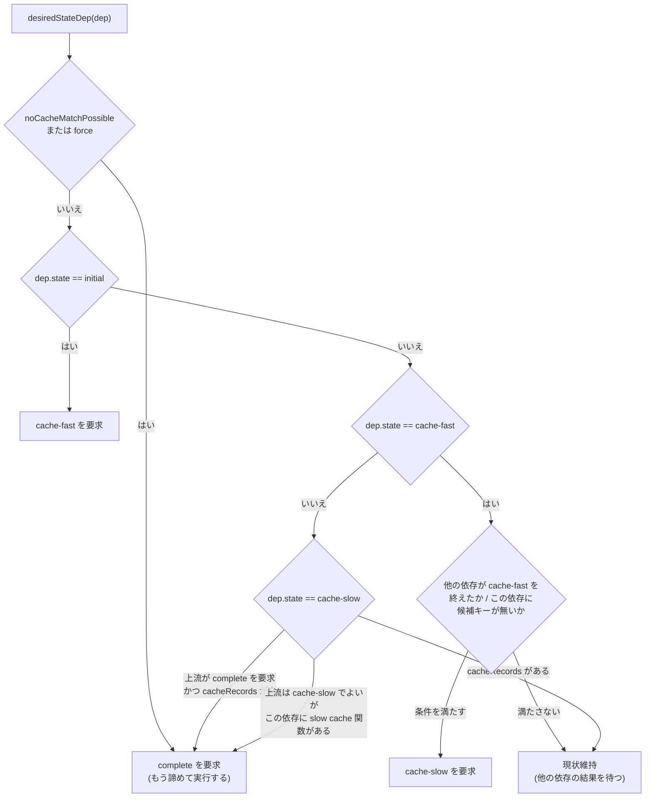

## 何を学んだか

`COPY . /src` の入力であるローカルディレクトリは、キャッシュにヒットするなら転送しなくてよい。`FROM alpine` のイメージは、それを使う `RUN` がキャッシュに当たるなら pull しなくてよい。BuildKit はこれを、**「この入力にどの状態まで到達してほしいか」を毎回計算し直す**ことで実現している。

要求は 3 段階ある。

- `edgeStatusCacheFast` — 定義から決まるキーだけ出してくれ。実体は要らない
- `edgeStatusCacheSlow` — 中身ベースのキーも出してくれ
- `edgeStatusComplete` — 実体をよこせ

この判断をする関数が `desiredStateDep` だ。



## 上流の要求をまとめる

まず「上流が何を欲しがっているか」を `respondToIncoming` が集約する。

```go title="solver/edge.go"
	if !e.isComplete() {
		for _, req := range incoming {
			if !req.Request().Canceled {
				allCanceled = false
				if r := req.Request().Payload; desiredState < r.desiredState {
					desiredState = r.desiredState
					if e.hasActiveOutgoing || r.desiredState == edgeStatusComplete || r.currentKeys == len(e.keys) {
						allIncomingCanComplete = false
					}
				}
			}
		}
	}
```

([solver/edge.go L739-L751](https://github.com/moby/buildkit/blob/ca4838f8ddbd3612bca94bcb8a938d8a326110a3/solver/edge.go#L739-L751))

初期値は `e.state` (自分の現在地) で、そこから incoming の要求の最大値を取る。キャンセル済みの要求は数えない。**3 本の上流のうち 2 本が `cacheFast` で足り、1 本が `complete` を要求していれば、この edge は `complete` を目指す。**

## desiredStateDep — 入力ごとの梯子

```go title="solver/edge.go"
func (e *edge) desiredStateDep(dep *dep, desiredState edgeStatusType, force bool) edgeStatusType {
	if e.noCacheMatchPossible || force {
		return edgeStatusComplete
	}

	if dep.state == edgeStatusInitial && desiredState > dep.state {
		return edgeStatusCacheFast
	}
	// ...
}
```

([solver/edge.go L841-L848](https://github.com/moby/buildkit/blob/ca4838f8ddbd3612bca94bcb8a938d8a326110a3/solver/edge.go#L841-L848))

最初の分岐が結論だ。`noCacheMatchPossible` が立っていれば、キャッシュに当たる望みは無いので、入力には全部 `complete` を要求する。もう遠慮する理由がない。

このフラグが立つ条件は 1 箇所で決まる。

```go title="solver/edge.go"
// checkDepMatchPossible checks if any cache matches are possible past this point
func (e *edge) checkDepMatchPossible(dep *dep) {
	depHasSlowCache := e.cacheMap.Deps[dep.index].ComputeDigestFunc != nil
	if !e.noCacheMatchPossible && (((!dep.slowCacheFoundKey && dep.slowCacheComplete && depHasSlowCache) || (!depHasSlowCache && dep.state >= edgeStatusCacheSlow)) && len(dep.keyMap) == 0) {
		e.noCacheMatchPossible = true
		debugSchedulerNoCacheMatchPossible(e, dep, depHasSlowCache)
	}
}
```

([solver/edge.go L218-L225](https://github.com/moby/buildkit/blob/ca4838f8ddbd3612bca94bcb8a938d8a326110a3/solver/edge.go#L218-L225))

「この依存については調べ尽くしたのに `keyMap` が空だった」という判定だ。slow cache のある依存なら「slow key の計算まで終わって、それでも一致しなかった」、無い依存なら「`cacheSlow` に到達しても一致しなかった」。1 本でもこうなれば、キー合成は全依存の共通部分を取る以上、この edge のキャッシュは絶対に成立しない ([edge の状態機械](../edge-state-machine/))。

### cache-fast から cache-slow へ

```go title="solver/edge.go"
	if dep.state == edgeStatusCacheFast && desiredState > dep.state {
		// wait all deps to complete cache fast before continuing with slow cache
		if (e.allDepsCompletedCacheFast && len(e.keys) == 0) || len(dep.keyMap) == 0 || e.allDepsHaveKeys(true) {
			if !e.skipPhase2FastCache(dep) && e.cacheMap != nil {
				return edgeStatusCacheSlow
			}
		}
		return dep.state
	}
```

([solver/edge.go L850-L858](https://github.com/moby/buildkit/blob/ca4838f8ddbd3612bca94bcb8a938d8a326110a3/solver/edge.go#L850-L858))

コメントどおり、**まず全依存が `cacheFast` を終えるのを待つ**。定義ベースのキー探索は安いので全部やり、その結果を見てから高い探索に進むかを決める。

進んでよい条件は 3 つの OR だ。

1. 全依存が `cacheFast` を終えて、それでも edge のキーが 1 本も立たなかった (`len(e.keys) == 0`)
2. この依存自身に候補キーが無い (`len(dep.keyMap) == 0`)
3. 全依存が候補キーを持っている (`allDepsHaveKeys(true)`)

1 と 2 は「安い探索では答えが出なかったので次へ」、3 は「候補が揃ったので絞り込みに進む」。どちらの向きからも進める。

### 2 フェーズの slow cache

`skipPhase2FastCache` と `skipPhase2SlowCache` は、同じ考え方をもう 1 段細かくやる。

```go title="solver/edge.go"
// slow cache keys can be computed in 2 phases if there are multiple deps.
// first evaluate ones that didn't match any definition based keys
func (e *edge) skipPhase2SlowCache(dep *dep) bool {
	isPhase1 := false
	for _, dep := range e.deps {
		if (!dep.slowCacheComplete && e.slowCacheFunc(dep) != nil || dep.state < edgeStatusCacheSlow) && len(dep.keyMap) == 0 {
			isPhase1 = true
			break
		}
	}

	if isPhase1 && !dep.slowCacheComplete && e.slowCacheFunc(dep) != nil && len(dep.keyMap) > 0 {
		return true
	}
	return false
}
```

([solver/edge.go L291-L306](https://github.com/moby/buildkit/blob/ca4838f8ddbd3612bca94bcb8a938d8a326110a3/solver/edge.go#L291-L306))

コメントが方針を全部言っている。**まず定義ベースのキーで一致しなかった依存から評価する。** そこで結論が出れば、既に候補キーを持っている依存 (フェーズ 2 の対象) の slow cache を計算せずに済む。

具体例で言うと、`RUN` が `FROM alpine` のイメージとローカルのソースコードを両方入力に持つとする。イメージのほうは定義ベースのキーで一致するかもしれないが、ローカルソースは毎回キーが変わるので一致しない。ローカルソースを先にハッシュして「これは前回と違う」と分かれば、イメージ側の探索は無駄になる。逆にイメージ側が「そもそもこのイメージのキーは知らない」と言えば、ローカルソースのハッシュは要らない。`docs/dev/solver.md` の冒頭がまさにこの例を挙げている。

> if one of the inputs (for example image) can produce a definition based cache match for a vertex, and another (for example local source files) can only produce a content-based(slower) cache match, the solver is designed to detect it and skip content-based check for the first input(that would cause a pull to happen).

([docs/dev/solver.md L24-L29](https://github.com/moby/buildkit/blob/ca4838f8ddbd3612bca94bcb8a938d8a326110a3/docs/dev/solver.md#L24-L29))

「そのままだと pull が走ってしまう」と括弧書きされている。節約されているのはハッシュ計算時間ではなく、ネットワーク転送だ。

### cache-slow から complete へ

```go title="solver/edge.go"
	if e.cacheMap != nil && dep.state == edgeStatusCacheSlow && desiredState == edgeStatusComplete {
		// if all deps have completed cache-slow or content based cache for input is available
		if (len(dep.keyMap) == 0 || e.allDepsCompletedCacheSlow || (!e.skipPhase2FastCache(dep) && e.slowCacheFunc(dep) != nil)) && (len(e.cacheRecords) == 0) {
			if len(dep.keyMap) == 0 || !e.skipPhase2SlowCache(dep) {
				return edgeStatusComplete
			}
		}
		return dep.state
	}
```

([solver/edge.go L860-L868](https://github.com/moby/buildkit/blob/ca4838f8ddbd3612bca94bcb8a938d8a326110a3/solver/edge.go#L860-L868))

条件の末尾に `&& (len(e.cacheRecords) == 0)` が付いているのがこのページの主題だ。**キャッシュレコードが 1 件でも見つかっていれば、入力に `complete` を要求しない。** 自分はキャッシュから読めるのだから、入力の実体は要らない。

これが「必要な分だけ深く掘る」の実体で、DAG の下のほうがまるごと実行されずに済むのはここの条件 1 つによる。

### 上流が cache-slow でよくても complete を要求する場合

最後の分岐が意表を突く。

```go title="solver/edge.go"
	if e.cacheMap != nil && dep.state == edgeStatusCacheSlow && e.slowCacheFunc(dep) != nil && desiredState == edgeStatusCacheSlow {
		if len(dep.keyMap) == 0 || !e.skipPhase2SlowCache(dep) {
			return edgeStatusComplete
		}
		return dep.state
	}
```

([solver/edge.go L870-L875](https://github.com/moby/buildkit/blob/ca4838f8ddbd3612bca94bcb8a938d8a326110a3/solver/edge.go#L870-L875))

この edge は自分が `cacheSlow` になれば足りる。しかし依存に `ComputeDigestFunc` がある場合、**その依存の中身を見ないと自分の slow key が計算できない**ので、依存には `complete` を要求せざるを得ない。「自分の要求水準」と「入力への要求水準」は単調ではない。

## 要求の生成と、実行の判断

`unpark` の第 4 フェーズがこれらを呼ぶ。

```go title="solver/edge.go"
	// execute op
	if e.execReq == nil && desiredState == edgeStatusComplete {
		if ok := e.execIfPossible(f); ok {
			return
		}
	}

	if e.execReq == nil {
		if added := e.createInputRequests(desiredState, f, false); !added && !e.hasActiveOutgoing && !cacheMapReq {
			// ...
		}
	}
```

([solver/edge.go L351-L364](https://github.com/moby/buildkit/blob/ca4838f8ddbd3612bca94bcb8a938d8a326110a3/solver/edge.go#L351-L364))

先に実行を試み、できなければ入力に要求を出す。`execIfPossible` は 2 通りに分岐する。

```go title="solver/edge.go"
// execIfPossible creates a request for getting the edge result if there is
// enough state
func (e *edge) execIfPossible(f *pipeFactory) bool {
	if len(e.cacheRecords) > 0 {
		if e.keysDidChange {
			e.postpone(f)
			return true
		}
		e.execReq = f.NewFuncRequest(e.loadCache)
		e.execCacheLoad = true
		for req := range e.depRequests {
			req.Cancel()
		}
		return true
	} else if e.allDepsCompleted {
		// ...
		e.execReq = f.NewFuncRequest(e.execOp)
		e.execCacheLoad = false
		return true
	}
	return false
}
```

([solver/edge.go L921-L945](https://github.com/moby/buildkit/blob/ca4838f8ddbd3612bca94bcb8a938d8a326110a3/solver/edge.go#L921-L945))

キャッシュレコードがあればロードし、**その場で全依存への要求をキャンセルする**。`for req := range e.depRequests { req.Cancel() }` の 1 行が、走りかけていた pull や contenthash 計算を止める。

`keysDidChange` が立っているときは実行せず `postpone` する。

```go title="solver/edge.go"
// postpone delays exec to next unpark invocation if we have unprocessed keys
func (e *edge) postpone(f *pipeFactory) {
	f.NewFuncRequest(func(context.Context) (any, error) {
		return nil, nil
	})
}
```

([solver/edge.go L947-L952](https://github.com/moby/buildkit/blob/ca4838f8ddbd3612bca94bcb8a938d8a326110a3/solver/edge.go#L947-L952))

何もしない関数リクエストを 1 本作るだけ。これが即座に完了して `signal` が飛び、次の `unpark` が呼ばれる。**「もう 1 周してから決める」を、既存の pipe 機構だけで表現している。** 新しい状態も新しいフラグも要らない。同時に、これは `unpark` の契約 (incoming を開けたまま返るなら outgoing を持て) も自動的に満たす ([unpark の 2 つの契約](../unpark-contract/))。

`keysDidChange` を待つのは、実行直前に新しいキーが立てば、他の edge とマージできるかもしれないからだ ([edge のマージ](../edge-merge/))。実行してしまってからでは遅い。

## slow cache 計算の起動条件

入力ごとの content-based ハッシュ計算は、`createInputRequests` の中でもう 1 つ別に起動される。

```go title="solver/edge.go"
func (e *edge) computeCacheKeyFromDep(dep *dep, f *pipeFactory) (addedNew bool) {
	if dep.state != edgeStatusComplete || dep.slowCacheReq != nil || e.cacheMap == nil {
		return false
	}

	pfn := e.preprocessFunc(dep)
	fn := e.slowCacheFunc(dep)
	if pfn == nil && fn == nil {
		return false
	}
	// ...
	dep.slowCacheReq = f.NewFuncRequest(func(ctx context.Context) (any, error) {
		v, err := e.op.CalcSlowCache(ctx, index, pfn, fn, res)
		return v, errors.Wrap(err, "failed to compute cache key")
	})
	return true
}
```

([solver/edge.go L901-L919](https://github.com/moby/buildkit/blob/ca4838f8ddbd3612bca94bcb8a938d8a326110a3/solver/edge.go#L901-L919))

`dep.state != edgeStatusComplete` で即座に返る。**中身のハッシュは、中身が手に入ってからしか計算できない。** だから slow cache の計算は必ず「依存を complete まで解いた後」に来る。上の `desiredStateDep` の最後の分岐が `complete` を返していたのはこのためだ。

## なぜそうなっているか

設計ドキュメントの冒頭が動機を述べている。

> It is expected that calculating the content based checksum of snapshots between every operation or after every command execution is too slow for common use cases and needs to be postponed to when it is likely to have a meaningful impact.

([docs/dev/solver.md L13-L16](https://github.com/moby/buildkit/blob/ca4838f8ddbd3612bca94bcb8a938d8a326110a3/docs/dev/solver.md#L13-L16))

"postponed to when it is likely to have a meaningful impact" — 遅い検査を、意味がありそうなときまで先延ばしする。`desiredStateDep` の分岐は全部この 1 文の展開だ。

そしてすぐ後にこう続く。

> Ideally, the user shouldn't realize that these optimizations are taking place and just get intuitive caching.

([docs/dev/solver.md L16-L17](https://github.com/moby/buildkit/blob/ca4838f8ddbd3612bca94bcb8a938d8a326110a3/docs/dev/solver.md#L16-L17))

ユーザから見れば「キャッシュが効いた」か「効かなかった」かしかない。その裏で「イメージを pull せずに済んだ」「ローカルファイルをハッシュせずに済んだ」が起きていることは見えない。**最適化を可視化しない**という方針が、この複雑さを許容する理由になっている。

この節約の効果は、テストが直接検証している。`TestSlowCacheAvoidAccess` ([solver/scheduler_test.go L2353](https://github.com/moby/buildkit/blob/ca4838f8ddbd3612bca94bcb8a938d8a326110a3/solver/scheduler_test.go#L2353)) と `TestSlowCacheAvoidLoadOnCache` ([solver/scheduler_test.go L2446](https://github.com/moby/buildkit/blob/ca4838f8ddbd3612bca94bcb8a938d8a326110a3/solver/scheduler_test.go#L2446)) は、呼び出し回数のカウンタを使って「呼ばれなかったこと」を assert している。**節約は機能なので、テストで固定されている。**

## どう活かすか

**「どこまでやってほしいか」を要求として明示的に運ぶ。** 「入力を解く」ではなく「入力を cache-fast まで解く」と書けるようにしたことで、遅延評価の粒度が型で表現できている。ブール値の `lazy` フラグでは、この 3 段階は書けない。

**安い検査を先に全部やってから、高い検査に進むか決める。** `allDepsCompletedCacheFast` を待つ設計は、直列化のコストと引き換えに無駄な高コスト処理を避ける。並列度を上げるより、やらずに済ませるほうが速いことは多い。

**「もう 1 周する」を既存の非同期機構で表現する。** `postpone` が空の関数リクエストなのは手抜きに見えるが、新しい状態を導入しないぶん、状態機械の不変条件を壊さない。何もしないイベントを 1 本流すのは、状態を 1 個増やすより安全なことがある。

**節約をテストで固定する。** 「呼ばれない」ことは実装を変えれば簡単に壊れる。カウンタを置いて `require.Equal(t, int64(0), ...)` を書いておけば、性能の退行がコンパイルエラー並みの速さで見つかる。
