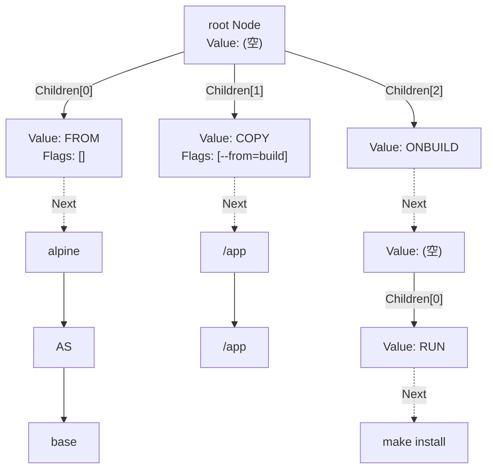

## 何を学んだか

Dockerfile のパーサは、トークナイザもグラマーも持たない。行を読み、先頭の単語で `map[string]func(...)` を引き、命令ごとに用意された 10 個ほどの関数のどれかに残りの文字列を渡す。それだけだ。AST も専用の型を命令ごとに用意せず、`Node` という単一の型が `Next` で横に、`Children` で下に伸びる。

そしてソースコード自身が、この構造は褒められたものではないと書いている。

```go title="frontend/dockerfile/parser/parser.go"
// This data structure is frankly pretty lousy for handling complex languages,
// but lucky for us the Dockerfile isn't very complicated. This structure
// works a little more effectively than a "proper" parse tree for our needs.
type Node struct {
	Value       string          // actual content
	Next        *Node           // the next item in the current sexp
	Children    []*Node         // the children of this sexp
	Heredocs    []Heredoc       // extra heredoc content attachments
	Attributes  map[string]bool // special attributes for this node
	Original    string          // original line used before parsing
	Flags       []string        // only top Node should have this set
	StartLine   int             // the line in the original dockerfile where the node begins
	EndLine     int             // the line in the original dockerfile where the node ends
	PrevComment []string
}
```

([frontend/dockerfile/parser/parser.go L28-L42](https://github.com/moby/buildkit/blob/ca4838f8ddbd3612bca94bcb8a938d8a326110a3/frontend/dockerfile/parser/parser.go#L28-L42))

「Dockerfile はたいして複雑じゃないので運がいい」という一文が、この層の設計判断のすべてを説明している。BuildKit にとって Dockerfile は LLB へのコンパイラの入力形式のひとつでしかなく、言語としての表現力を伸ばす気がない。だからパーサに投資しない。

## Node は S 式のつもりで読む

型コメントにある例がそのまま構造を表している。

```
(value next (child child-next child-next-next) next-next)
```

`Next` は「同じ S 式の中の次の要素」、`Children` は「入れ子になった S 式」。Dockerfile ではルートノードの `Children` が命令の並びで、各命令の引数が `Next` の連鎖になる。



`Children` を持つのは実質ルートと `ONBUILD` だけだ。ネストが 1 段しかないので、リンクリストとツリーを 1 つの型で兼ねても破綻しない。`ONBUILD` の形は line_parsers.go のコメントに明示されている。

```go title="frontend/dockerfile/parser/line_parsers.go"
// used for onbuild. Could potentially be used for anything that represents a
// statement with sub-statements.
//
// ONBUILD RUN foo bar -> (onbuild (run foo bar))
func parseSubCommand(rest string, d *directives) (*Node, map[string]bool, error) {
	if rest == "" {
		return nil, nil, nil
	}
	child, err := newNodeFromLine(rest, d, nil)
	// ...
	return &Node{Children: []*Node{child}}, nil, nil
}
```

([frontend/dockerfile/parser/line_parsers.go L33-L48](https://github.com/moby/buildkit/blob/ca4838f8ddbd3612bca94bcb8a938d8a326110a3/frontend/dockerfile/parser/line_parsers.go#L33-L48))

`parseSubCommand` は `newNodeFromLine` を再帰的に呼ぶ。`ONBUILD ONBUILD` を禁止しているのはパーサではなく後段の [instructions 層](../instruction-flags/)なので、パーサ的には無限にネストできる。

S 式という見立ては飾りではなく、デバッグ出力にそのまま使われている。`Node.Dump()` は AST を S 式として文字列化し、`testfiles/*/result` がその期待値になっている。

```
FROM scratch
COPY --user=me --doit=true foo /tmp/
CMD --doit [ "a", "b" ]
```

に対する `Dump()` の出力が、

```
(from "scratch")
(copy ["--user=me" "--doit=true"] "foo" "/tmp/")
(cmd ["--doit"] "a" "b")
```

になる ([frontend/dockerfile/parser/testfiles/flags/result](https://github.com/moby/buildkit/blob/ca4838f8ddbd3612bca94bcb8a938d8a326110a3/frontend/dockerfile/parser/testfiles/flags/result))。パーサのテストはほぼ全部この「Dockerfile と result のペア」で書かれていて、AST の形を目で確認できる。

## dispatch テーブル — 命令ごとの解釈は 10 個の関数に散る

命令名から解析関数への対応は、`init()` で組まれる 1 枚のマップだ。

```go title="frontend/dockerfile/parser/parser.go"
func init() {
	// Dispatch Table. see line_parsers.go for the parse functions.
	// The command is parsed and mapped to the line parser. The line parser
	// receives the arguments but not the command, and returns an AST after
	// reformulating the arguments according to the rules in the parser
	// functions. ...
	dispatch = map[string]func(string, *directives) (*Node, map[string]bool, error){
		command.Add:         parseMaybeJSONToList,
		command.Arg:         parseNameOrNameVal,
		command.Cmd:         parseMaybeJSON,
		command.Copy:        parseMaybeJSONToList,
		command.Entrypoint:  parseMaybeJSON,
		command.Env:         parseEnv,
		command.Expose:      parseStringsWhitespaceDelimited,
		command.From:        parseStringsWhitespaceDelimited,
		command.Healthcheck: parseHealthConfig,
		// ...
	}
}
```

([frontend/dockerfile/parser/parser.go L194-L221](https://github.com/moby/buildkit/blob/ca4838f8ddbd3612bca94bcb8a938d8a326110a3/frontend/dockerfile/parser/parser.go#L194-L221))

18 個の命令に対して、実体の関数は 9 種類しかない。粒度はこうなっている。

| 関数                              | 何をするか                                     | 使う命令                                   |
| --------------------------------- | ---------------------------------------------- | ------------------------------------------ |
| `parseString`                     | 残り全部を 1 ノードに詰める                    | `WORKDIR` `USER` `STOPSIGNAL` `MAINTAINER` |
| `parseStringsWhitespaceDelimited` | 空白で分割してリンクリストに                   | `FROM` `EXPOSE`                            |
| `parseMaybeJSON`                  | JSON 配列に見えれば配列、でなければ 1 ノード   | `RUN` `CMD` `ENTRYPOINT` `SHELL`           |
| `parseMaybeJSONToList`            | JSON 配列に見えれば配列、でなければ空白分割    | `ADD` `COPY` `VOLUME`                      |
| `parseNameVal`                    | `k=v k=v` または `KEY name value`              | `ENV` `LABEL`                              |
| `parseNameOrNameVal`              | `k=v` に加えて値なしの `k` も許す              | `ARG`                                      |
| `parseHealthConfig`               | 第 1 引数だけ切り出して残りを `parseMaybeJSON` | `HEALTHCHECK`                              |
| `parseSubCommand`                 | 残りをもう一度命令として解析                   | `ONBUILD`                                  |
| `parseIgnore`                     | 空の `Node` を返して引数を捨てる               | 未知の命令                                 |

`FROM alpine AS base` が `parseStringsWhitespaceDelimited` に行くことに注目したい。パーサにとって `AS` はただの 3 単語目で、キーワードですらない。`FROM` の構文検査は instructions 層の `parseBuildStageName` まで持ち越される。

### JSON 形式は `Attributes` に印を付けて覚える

`RUN ["a","b"]` と `RUN a b` は、同じ `Next` チェーンになってしまうと区別できない。`parseJSON` は成功時に属性マップを返し、これが `Node.Attributes` に入る。

```go title="frontend/dockerfile/parser/line_parsers.go"
	return top, map[string]bool{"json": true}, nil
```

([frontend/dockerfile/parser/line_parsers.go L305](https://github.com/moby/buildkit/blob/ca4838f8ddbd3612bca94bcb8a938d8a326110a3/frontend/dockerfile/parser/line_parsers.go#L305))

この `json` フラグは 3 か所で効いてくる。instructions 層で `PrependShell: !req.attributes["json"]` としてシェル経由かどうかを決め、`HEALTHCHECK` では `CMD` を `CMD-SHELL` に書き換えるかを決め、パーサ内では `canContainHeredoc()` が JSON 形式の行で heredoc 探索を打ち切る根拠になる ([../heredoc/](../heredoc/))。

### `parseNameVal` は 3 つ組を吐く

`ENV a=1 b=2` の AST は、`a → 1 → "=" → b → 2 → "="` という 6 ノードのフラットな鎖になる。

```go title="frontend/dockerfile/parser/line_parsers.go"
func newKeyValueNode(key, value, sep string) *Node {
	return &Node{
		Value: key,
		Next: &Node{
			Value: value,
			Next:  &Node{Value: sep},
		},
	}
}
```

([frontend/dockerfile/parser/line_parsers.go L176-L184](https://github.com/moby/buildkit/blob/ca4838f8ddbd3612bca94bcb8a938d8a326110a3/frontend/dockerfile/parser/line_parsers.go#L176-L184))

3 番目のノードは区切り文字そのものだ。`ENV KEY value`(古い記法) なら `""`、`ENV KEY=value` なら `"="` が入る。受け取る側はこれを 3 個ずつ読む。

```go title="frontend/dockerfile/instructions/parse.go"
	if len(args)%3 != 0 {
		// should never get here, but just in case
		return nil, errTooManyArguments(cmdName)
	}
	var res KeyValuePairs
	for j := 0; j < len(args); j += 3 {
		// ...
		name, value, delim := args[j], args[j+1], args[j+2]
		res = append(res, KeyValuePair{Key: name, Value: value, NoDelim: delim == ""})
	}
```

([frontend/dockerfile/instructions/parse.go L214-L231](https://github.com/moby/buildkit/blob/ca4838f8ddbd3612bca94bcb8a938d8a326110a3/frontend/dockerfile/instructions/parse.go#L214-L231))

`Node` に構造を持たせられないので、位置で意味を運んでいる。これが「複雑な言語には向かない」の実例だ。区切り文字を覚えているのは、`ENV KEY value` の古い記法が非推奨であることを linter が警告するため。

## 未知の命令はこの層では通る

`newNodeFromLine` は、dispatch に無い命令を弾かない。

```go title="frontend/dockerfile/parser/parser.go"
	fn := dispatch[strings.ToLower(cmd)]
	// Ignore invalid Dockerfile instructions
	if fn == nil {
		fn = parseIgnore
	}
```

([frontend/dockerfile/parser/parser.go L232-L236](https://github.com/moby/buildkit/blob/ca4838f8ddbd3612bca94bcb8a938d8a326110a3/frontend/dockerfile/parser/parser.go#L232-L236))

`FOOBAR baz` は「Value が `FOOBAR` で Next が nil のノード」として AST に入る。エラーになるのは次の層だ。

```go title="frontend/dockerfile/instructions/parse.go"
	return nil, suggest.WrapError(&UnknownInstructionError{Instruction: node.Value, Line: node.StartLine}, node.Value, allInstructionNames(), false)
```

([frontend/dockerfile/instructions/parse.go L145](https://github.com/moby/buildkit/blob/ca4838f8ddbd3612bca94bcb8a938d8a326110a3/frontend/dockerfile/instructions/parse.go#L145))

`suggest.WrapError` が「もしかして `RUN`?」という候補を付ける。パーサは形だけ見て、意味の検証は全部後段に置く、という分業になっている。

## 行番号は Node に持たせる

`Node` は `StartLine` / `EndLine` を持ち、`Location()` が `[]Range` を返す。ルートノードは `StartLine: -1` で作られ、最初の子が付いたときに実際の行番号で上書きされる。

```go title="frontend/dockerfile/parser/parser.go"
func (node *Node) AddChild(child *Node, startLine, endLine int) {
	child.lines(startLine, endLine)
	if node.StartLine < 0 {
		node.StartLine = startLine
	}
	node.EndLine = endLine
	node.Children = append(node.Children, child)
}
```

([frontend/dockerfile/parser/parser.go L100-L108](https://github.com/moby/buildkit/blob/ca4838f8ddbd3612bca94bcb8a938d8a326110a3/frontend/dockerfile/parser/parser.go#L100-L108))

`-1` が残ったままループを抜けたら子が 1 つも付かなかったということで、`file with no instructions` エラーになる。番兵値が「命令が 1 つもない」の判定を兼ねている。

この `Range` は LLB の `SourceMap` に載って solver まで運ばれ、実行時エラーが Dockerfile の何行目かを指せるようになる ([../source-map/](../source-map/))。だから行番号は「あると便利なデバッグ情報」ではなく、AST の必須のフィールドだ。`PrevComment` (直前のコメント行) も同じで、linter の `# check=` 設定 ([../parser-directives/](../parser-directives/)) と `ARG` の説明文検査に使われる。

## なぜそうなっているか

BuildKit にとって Dockerfile は、[フロントエンド](../syntax-directive/)が受け取る入力形式のひとつにすぎない。DAG を解く側は Dockerfile を知らないし、`# syntax=` で別実装に差し替えられる。そのうえで既存の何百万本もの Dockerfile と 1 バイト単位で互換でなければならない。

この 2 つが重なると、パーサに求められるのは「拡張しやすさ」ではなく「今ある挙動を変えないこと」になる。ちゃんとした文法定義を書き起こせば、`ENV a=1 b=2` と `ENV a 1 b 2` の境界や、引用符の中のエスケープトークンの扱いなど、既存 Dockerfile が依存している細かい挙動をどこかで変えてしまう。`Node` 1 つと dispatch テーブルという構造は、命令ごとの奇妙な規則を関数の中に閉じ込め、他の命令に影響を出さずに保存できる。

`Attributes`、`Flags`、`Heredocs`、`PrevComment` が `Node` に後から生えているのも同じ理屈だ。型を分けずにフィールドを足せば、既存の命令の解析パスに手を入れずに新機能が入る。line_parsers.go 冒頭のコメントが、この方針をそのまま書いている。

```go title="frontend/dockerfile/parser/line_parsers.go"
// line parsers are dispatch calls that parse a single unit of text into a
// Node object which contains the whole statement. Dockerfiles have varied
// (but not usually unique, see ONBUILD for a unique example) parsing rules
// per-command, and these unify the processing in a way that makes it
// manageable.
```

([frontend/dockerfile/parser/line_parsers.go L3-L7](https://github.com/moby/buildkit/blob/ca4838f8ddbd3612bca94bcb8a938d8a326110a3/frontend/dockerfile/parser/line_parsers.go#L3-L7))

「命令ごとに規則がばらばらであることを前提に、それを管理可能な形にまとめる」。文法を統一するのではなく、ばらつきを許したまま処理の入口だけ揃えている。

## どう活かすか

**言語の複雑さの上限を宣言してから、データ構造を選ぶ。** 「将来どんな構文にも対応できるように」と汎用の AST を作ると、ノード型の階層とビジターが増える。BuildKit は「Dockerfile はネストが 1 段しかない命令の並びである」という上限を先に固定し、その上限に合う最小の構造を選んだ。上限を超える要求が来たら別のフロントエンドを書け、というのが答えになっている。設計を軽くするのは、拡張ポイントを増やすことではなく、拡張しない範囲を宣言することでもできる。

**形の検証と意味の検証を層で分ける。** パーサは未知の命令を素通りさせ、instructions 層が「もしかして」付きのエラーを出す。パーサに検証を入れると、エラーメッセージに文脈 (どの命令の何番目の引数か) を持たせられず、テストも Dockerfile 全体を書く必要が出る。パース結果を素直な中間表現にしておくと、検証の側は文脈を持った状態でエラーを組み立てられる。

**AST を文字列にダンプできるようにしておく。** `Node.Dump()` と `testfiles/*/result` の組は、パーサの回帰テストとして極めて安上がりだ。期待値が人間の読める S 式なので、挙動が変わったときに diff がそのまま意味を持つ。パーサやコンパイラを書くなら、中間表現の 1 方向のシリアライズを最初に用意しておくと、テストの書き方が決まる。
