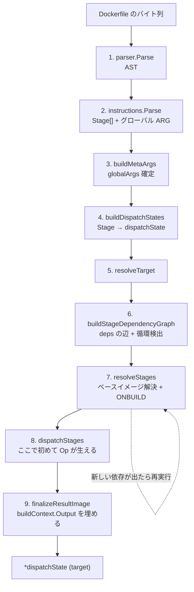

## 何を学んだか

`Dockerfile2LLB` の中身は、`toDispatchState` という 1 本の関数に集約されている。この関数は「Dockerfile を上から実行する」ものではなく、**9 つのフェーズが一直線に並んだコンパイラのドライバ**だ。各フェーズは前のフェーズが確定させた情報だけに依存し、後戻りしない。唯一の例外が ONBUILD で、これだけがフェーズ 7 の中でループを回す。

重要なのは、**LLB の頂点が作られるのはフェーズ 8 だけ**という点だ。フェーズ 1〜7 は「どのステージが必要か」「各ステージのベースイメージは何か」を確定させるだけで、Op は 1 つも作られない。逆にフェーズ 9 は、フェーズ 8 が集めた情報を使って**すでに作った DAG の葉を後から差し替える**。

## ソースコードのどこか

### toDispatchState — 9 フェーズのオーケストレータ

エントリポイントは 3 つあるが、いずれも `toDispatchState` を呼ぶだけの薄い皮だ ([frontend/dockerfile/dockerfile2llb/convert.go L84](https://github.com/moby/buildkit/blob/ca4838f8ddbd3612bca94bcb8a938d8a326110a3/frontend/dockerfile/dockerfile2llb/convert.go#L84))。

```go title="frontend/dockerfile/dockerfile2llb/convert.go"
func Dockerfile2LLB(ctx context.Context, dt []byte, opt ConvertOpt) (*Result, error) {
	ds, err := toDispatchState(ctx, dt, opt)
	// ...
}

func Dockerfile2Outline(...) // 同じく toDispatchState
func DockerfileLint(...)     // 同じく toDispatchState
```

`Dockerfile2Outline` (ARG の一覧を返すサブリクエスト) も `DockerfileLint` (lint 結果を返すサブリクエスト) も、同じ変換を通す。lint は「LLB を作る過程で出た警告」であって、別実装の静的解析器ではない。

`toDispatchState` の本体はおよそ 120 行で、そのうち実質的な処理は次の 9 呼び出しに集約される ([convert.go L236-L360](https://github.com/moby/buildkit/blob/ca4838f8ddbd3612bca94bcb8a938d8a326110a3/frontend/dockerfile/dockerfile2llb/convert.go#L236-L360))。

| #   | 呼び出し                                     | 入力 → 出力                                     |
| --- | -------------------------------------------- | ----------------------------------------------- |
| 1   | `parser.Parse`                               | `[]byte` → AST (行と継続行の解決)               |
| 2   | `instructions.Parse`                         | AST → `[]instructions.Stage` + グローバル `ARG` |
| 3   | `defaultArgs` / `buildMetaArgs` / epoch 解決 | ビルド引数 → 確定した `globalArgs`              |
| 4   | `buildDispatchStates`                        | `[]Stage` → `[]*dispatchState`                  |
| 5   | `resolveTarget`                              | `--target` → ターゲットの `*dispatchState`      |
| 6   | `buildStageDependencyGraph`                  | 各命令 → ステージ間の辺 + 循環検出              |
| 7   | `resolveStages`                              | 到達可能ステージ → ベースイメージの config      |
| 8   | `dispatchStages`                             | 命令 → LLB の Op                                |
| 9   | `finalizeResultImage`                        | ビルドコンテキストの差し込み + platform 正規化  |



### フェーズ 1〜3 — 文字列を「解決済みのステージ列」にする

フェーズ 1 と 2 は [Dockerfile パーサの章](../dockerfile-parser/) の担当で、ここでは結果だけを受け取る。`instructions.Parse` が返す 2 番目の値 `argCmds` が、**最初の `FROM` より前に書かれたグローバル `ARG`** だ。

フェーズ 3 は 2 段構えになっている。まず `defaultArgs` が `TARGETPLATFORM` / `TARGETOS` / `BUILDARCH` / `TARGETSTAGE` などの組み込み値を並べ ([platform.go L39](https://github.com/moby/buildkit/blob/ca4838f8ddbd3612bca94bcb8a938d8a326110a3/frontend/dockerfile/dockerfile2llb/platform.go#L39))、次に `buildMetaArgs` がグローバル `ARG` を上から順に展開しながら畳み込む。

```go title="frontend/dockerfile/dockerfile2llb/convert.go"
	globalArgs := defaultArgs(platformOpt, opt.BuildArgs, targetName)

	// Validate that base images continue to be valid even
	// when no build arguments are used.
	validateBaseImagesWithDefaultArgs(stages, shlex, globalArgs, argCmds, lint)

	// Rebuild the arguments using the provided build arguments
	// for the remainder of the build.
	globalArgs, outline.allArgs, err = buildMetaArgs(globalArgs, shlex, argCmds, opt.BuildArgs)
```

([convert.go L288-L302](https://github.com/moby/buildkit/blob/ca4838f8ddbd3612bca94bcb8a938d8a326110a3/frontend/dockerfile/dockerfile2llb/convert.go#L288-L302))

コメントどおり、`validateBaseImagesWithDefaultArgs` は**引数を渡さない場合でもベースイメージ名が壊れないか**を先に検証してから、実際のビルド引数で `globalArgs` を作り直す。`--build-arg` を渡したときだけ通る Dockerfile を lint で拾うための一手間だ。

`SOURCE_DATE_EPOCH` はここで解決される。値が整数ならそのまま `time.Unix` にし、`context` や `<stage>` ならビルドコンテキスト側を解決してから確定させる ([epoch.go L34](https://github.com/moby/buildkit/blob/ca4838f8ddbd3612bca94bcb8a938d8a326110a3/frontend/dockerfile/dockerfile2llb/epoch.go#L34))。確定した epoch は `dispatchState.epoch` を通じて全命令の履歴タイムスタンプに配られる ([再現可能ビルド](../reproducible-build/))。

### フェーズ 4〜6 — dispatchState とその辺

ここから先の主役は `dispatchState` だ。1 ステージ = 1 `dispatchState` で、変換中のすべての状態 (現在の `llb.State`、イメージ config、依存、使ったコンテキストパス) を持つ。

フェーズ 4 の `buildDispatchStates` は、ステージごとに `FROM` の引数を `globalArgs` で変数展開してから `dispatchState` を作る。無名ステージには `stage-<index>` という名前が付く ([convert.go L477-L479](https://github.com/moby/buildkit/blob/ca4838f8ddbd3612bca94bcb8a938d8a326110a3/frontend/dockerfile/dockerfile2llb/convert.go#L477-L479))。この時点で `cmdTotal` (プログレス表示の分母) も数えられる。数えられるのは `ADD` / `COPY` / `RUN` / `WORKDIR` とベースイメージの取得だけで、`ENV` や `LABEL` は分母に入らない。これは後述するとおり、この 4 命令だけが Op を作るからだ。

フェーズ 5 の `resolveTarget` は 8 行しかないが、`--target` を指定しなかったときに**最後のステージ**が選ばれる、という Dockerfile のセマンティクスを決めている場所だ。

```go title="frontend/dockerfile/dockerfile2llb/convert.go"
func (dctx *dispatchContext) resolveTarget() (*dispatchState, error) {
	if dctx.opt.Target == "" {
		return dctx.allDispatchStates.lastTarget(), nil
	}
	target, ok := dctx.allDispatchStates.findStateByName(dctx.opt.Target)
	if !ok {
		return nil, suggest.WrapError(errors.Errorf("target stage %q could not be found", dctx.opt.Target), ...)
	}
	return target, nil
}
```

([convert.go L507](https://github.com/moby/buildkit/blob/ca4838f8ddbd3612bca94bcb8a938d8a326110a3/frontend/dockerfile/dockerfile2llb/convert.go#L507))

フェーズ 6 の `buildStageDependencyGraph` が、`COPY --from=` と `RUN --mount=from=` を辺に変える。詳細は [ステージ依存グラフ](../stage-graph/) で扱う。

### フェーズ 7〜9 — 解決、生成、後埋め

フェーズ 7 の `resolveStages` は、ターゲットから到達できるステージについてだけ**ベースイメージの config を並列に取得する**。`errgroup` で全ステージのマニフェスト解決を同時に走らせるので、10 ステージある Dockerfile でもレジストリ往復は 1 ラウンドで済む ([convert.go L588](https://github.com/moby/buildkit/blob/ca4838f8ddbd3612bca94bcb8a938d8a326110a3/frontend/dockerfile/dockerfile2llb/convert.go#L588))。取得した config から `ONBUILD` が出てきたら、それを差し込んで**もう一周する** ([ONBUILD の不動点ループ](../onbuild/))。

フェーズ 8 の `dispatchStages` が、初めて `llb.State` を伸ばす。各ステージについて、まずベースイメージの config を状態に反映し (`Env` / `WorkingDir` / `User`)、それから命令を順に `dispatch` に流す。

```go title="frontend/dockerfile/dockerfile2llb/convert.go"
		// initialize base metadata from image conf
		for _, env := range d.image.Config.Env {
			k, v := parseKeyValue(env)
			d.state = d.state.AddEnv(k, v)
		}
		// ...
		for _, cmd := range d.commands {
			if err := dispatch(d, cmd, dopt); err != nil {
				return nil, nil, parser.WithLocation(err, cmd.Location())
			}
		}
```

([convert.go L804-L852](https://github.com/moby/buildkit/blob/ca4838f8ddbd3612bca94bcb8a938d8a326110a3/frontend/dockerfile/dockerfile2llb/convert.go#L804-L852))

エラーは `parser.WithLocation` で命令の位置情報に包まれる。この位置が `llb.SourceMap` を通って solver まで運ばれ、実行時エラーが Dockerfile の行番号として表示される ([source map](../source-map/))。

フェーズ 9 の `finalizeResultImage` は、フェーズ 8 が返した `ctxPaths` (ビルドコンテキストから実際に読まれたパスの集合) を使ってビルドコンテキストの `llb.Local` を作り、**フェーズ 8 の時点ではまだ空だったプレースホルダに埋め込む**。

```go title="frontend/dockerfile/dockerfile2llb/convert.go"
	opts := filterPaths(ctxPaths)
	bctx := dctx.opt.MainContext
	if dctx.opt.Client != nil {
		bctx, err = dctx.opt.Client.MainContext(ctx, opts...)
		// ...
	}
	buildContext.Output = bctx.Output()
```

([convert.go L901-L913](https://github.com/moby/buildkit/blob/ca4838f8ddbd3612bca94bcb8a938d8a326110a3/frontend/dockerfile/dockerfile2llb/convert.go#L901-L913))

この後埋めの仕組みが [mutableOutput](../mutable-output/) だ。

## なぜそうなっているか

このフェーズ分割は、`toDispatchState` が 622 行の一枚岩だったものを分解した結果として今の形になっている。分解コミット `cc59bfcc2` のメッセージは「機能変更なし、`toDispatchState` は約 60 行のオーケストレータになった」と述べており、`dispatchContext` 構造体は**それまでローカル変数とクロージャで引き回していた共有状態 (オプション、platform、args、linter、resolver) をまとめるため**に導入されている。

だがフェーズの**順序そのもの**は、リファクタ以前から Dockerfile のセマンティクスが要求していたものだ。順序を入れ替えられない理由が 3 つある。

1. **依存グラフ (6) はベースイメージ解決 (7) より前でなければならない。** どのステージを解決すべきかを知るには、先に到達可能性が分かっている必要がある。使わないステージのベースイメージを引きにいくのは、レジストリへの無駄な往復であり、認証エラーの原因にもなる。
2. **ベースイメージ解決 (7) は命令の dispatch (8) より前でなければならない。** `ENV` や `WORKDIR` の意味はベースイメージの config に依存する。`WORKDIR app` が `/usr/src/app` になるか `/app` になるかは、ベースイメージの `WorkingDir` 次第だ。
3. **ビルドコンテキストの確定 (9) は dispatch (8) より後でなければならない。** どのパスを転送すべきかは、全 `COPY` を見終わるまで分からない。`llb.FollowPaths` で転送量を絞るには、DAG を作ってから葉を差し替えるしかない。

3 番目が、このパイプラインで唯一「後戻り」しているところで、そのために `mutableOutput` という専用の型が用意されている。

## どう活かすか

- **「解決」と「生成」を別のフェーズに分ける。** 変換器を書くとき、名前解決・型解決を出力生成と混ぜると、生成中に「実はこの参照は解決できなかった」と分かって巻き戻す羽目になる。BuildKit は解決 (4〜7) を全部終えてから生成 (8) に入るので、生成フェーズにエラー分岐がほとんどない。
- **本当に後から決まるものだけを、明示的なプレースホルダにする。** 全部を遅延評価にするのではなく、「dispatch が終わるまで確定しない」ことが分かっている 1 箇所 (ビルドコンテキスト) だけを `mutableOutput` にしている。遅延の範囲が型で見えるので、どこが後埋めされるかを読み手が探さなくていい。
- **並列化できる I/O は 1 フェーズにまとめて、そこで一気に叩く。** ベースイメージのマニフェスト取得は、フェーズ 7 に集約されているから `errgroup` 1 発で並列化できる。命令の dispatch 中に必要になった時点で取りにいく設計だったら、この並列化はできなかった。
- **lint とアウトラインを本番パスに相乗りさせる。** `DockerfileLint` は専用の解析器ではなく、`Warn` コールバックを差し替えて同じ変換を走らせているだけだ。lint が本番と乖離しない。
