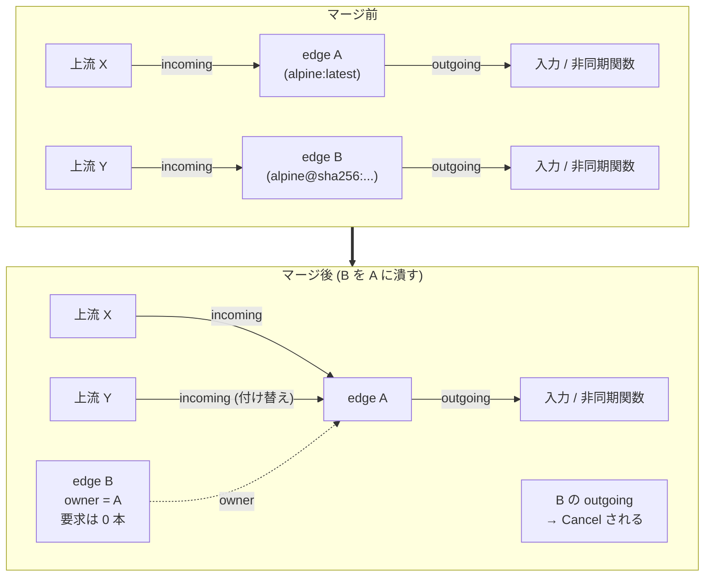

## 何を学んだか

DAG を読み込んだ時点では別々の頂点だったものが、解いている途中で「同じもの」だと判明することがある。`docs/dev/solver.md` の例がわかりやすい。

> In practice, this appears for example when a build uses image references `alpine:latest` and `alpine@sha256:abcabc` in its definition and they actually point to the same image.

([docs/dev/solver.md L360-L365](https://github.com/moby/buildkit/blob/ca4838f8ddbd3612bca94bcb8a938d8a326110a3/docs/dev/solver.md#L360-L365))

頂点ダイジェストは違う (定義の文字列が違う) が、`CacheMap.Digest` は同じ (どちらもマニフェストダイジェストを返す) 。このとき BuildKit は 2 本の `edge` を 1 本に潰す。片方は消え、その上流からの要求はもう片方に付け替えられる。



## きっかけ — キーが増えたら索引を引く

マージ判定は `unpark` の外、`dispatch` の末尾で行われる。

```go title="solver/scheduler.go"
	// if keys changed there might be possiblity for merge with other edge
	if e.keysDidChange {
		if k := e.currentIndexKey(); k != nil {
			// skip this if not at least 1 key per dep
			origEdge := e.index.LoadOrStore(k, e)
			if origEdge != nil {
				if e.isDep(origEdge) || origEdge.isDep(e) {
					debugSchedulerSkipMergeDueToDependency(e, origEdge)
				} else {
					dest, src := origEdge, e
					if s.ef.hasOwner(origEdge.edge, e.edge) {
						debugSchedulerSwapMergeDueToOwner(e, origEdge)
						dest, src = src, dest
					}

					debugSchedulerMergingEdges(src, dest)
					if s.mergeTo(dest, src) {
						s.ef.setEdge(src.edge, dest)
					} else {
						debugSchedulerMergingEdgesSkipped(src, dest)
					}
				}
			}
		}
		e.keysDidChange = false
	}
```

([solver/scheduler.go L153-L178](https://github.com/moby/buildkit/blob/ca4838f8ddbd3612bca94bcb8a938d8a326110a3/solver/scheduler.go#L153-L178))

`keysDidChange` は edge のキーが増えたときに立つフラグで、`processCacheMapReq` / `processDepReq` / `processDepSlowCacheReq` の 3 箇所から立てられる。**キーが増えたときにしか索引を引かない**ので、マージ判定は毎回の `unpark` では走らない。

引くキーは `currentIndexKey()` が作る「今この edge が主張しているキー」で、依存が 1 本でもキーを持っていなければ `nil` を返す。コード上のコメント `// skip this if not at least 1 key per dep` がその条件を指している ([solver/edge.go L262-L289](https://github.com/moby/buildkit/blob/ca4838f8ddbd3612bca94bcb8a938d8a326110a3/solver/edge.go#L262-L289))。

## edgeIndex — 実行中の edge のキー索引

`edgeIndex` はキャッシュデータベースとは別物で、**今この瞬間に動いている edge のためだけの索引**だ。

```go title="solver/index.go"
// edgeIndex is a synchronous map for detecting edge collisions.
type edgeIndex struct {
	mu sync.Mutex

	items    map[string]*indexItem
	backRefs map[*edge]map[string]struct{}
}

type indexItem struct {
	edge  *edge
	links map[CacheInfoLink]map[string]struct{}
	deps  map[string]struct{}
}
```

([solver/index.go L9-L21](https://github.com/moby/buildkit/blob/ca4838f8ddbd3612bca94bcb8a938d8a326110a3/solver/index.go#L9-L21))

構造がキャッシュストアとよく似ている。`items` のキーはランダム生成された ID で、`links` が `CacheInfoLink` (入力番号・ダイジェスト・出力番号・セレクタ) から次の ID の集合への写像を持つ。キーそのものをハッシュして引くのではなく、**「入力のキー ID からリンクを辿って、全入力から到達できる ID を探す」**という形になっている。

`getAllMatches` は、依存 0 の `indexIDs` から `CacheInfoLink` を辿って候補 ID 集合を作り、依存 1 以降で共通部分を取っていく ([solver/index.go L174-L238](https://github.com/moby/buildkit/blob/ca4838f8ddbd3612bca94bcb8a938d8a326110a3/solver/index.go#L174-L238))。キャッシュ検索とまったく同じアルゴリズムだ ([キャッシュ検索はハッシュ計算ではなくグラフ探索である](../cache-query-graph/))。1 つの入力が複数のキーを持ちうるので、単純なハッシュ 1 個では表現できない。

`LoadOrStore` は「一致する既存 edge があれば返す。無ければ自分を登録して `nil` を返す」。

```go title="solver/index.go"
	if old != nil && (isIgnoreCache(old) || !isIgnoreCache(e)) {
		ei.enforceLinked(oldID, k)
		return old
	}
```

([solver/index.go L100-L103](https://github.com/moby/buildkit/blob/ca4838f8ddbd3612bca94bcb8a938d8a326110a3/solver/index.go#L100-L103))

ここでも `IgnoreCache` の非対称性が現れる。既存 edge が `IgnoreCache` なら誰でも相乗りできるが、既存が普通の edge で新しいほうが `IgnoreCache` なら、既存を返さない ([Job / state / edge / sharedOp の 4 層](../job-state-edge/) の `dgstWithoutCache` と同じ規則)。

## 循環を作らない

索引が既存 edge を返しても、無条件にマージはしない。

```go title="solver/scheduler.go"
				if e.isDep(origEdge) || origEdge.isDep(e) {
					debugSchedulerSkipMergeDueToDependency(e, origEdge)
				} else {
```

([solver/scheduler.go L159-L161](https://github.com/moby/buildkit/blob/ca4838f8ddbd3612bca94bcb8a938d8a326110a3/solver/scheduler.go#L159-L161))

```go title="solver/edge.go"
func isDep(vtx, vtx2 Vertex) bool {
	if vtx.Digest() == vtx2.Digest() {
		return true
	}
	for _, e := range vtx.Inputs() {
		if isDep(e.Vertex, vtx2) {
			return true
		}
	}
	return false
}
```

([solver/edge.go L1032-L1042](https://github.com/moby/buildkit/blob/ca4838f8ddbd3612bca94bcb8a938d8a326110a3/solver/edge.go#L1032-L1042))

片方がもう片方の (推移的な) 依存なら、マージすると自己参照になる。頂点グラフを素直に再帰で辿るだけの実装で、メモ化もしていない。マージ判定の頻度が低いことを前提にした割り切りだ。

もう 1 つ、**マージの向きを揃える**仕掛けがある。

```go title="solver/scheduler.go"
					dest, src := origEdge, e
					if s.ef.hasOwner(origEdge.edge, e.edge) {
						debugSchedulerSwapMergeDueToOwner(e, origEdge)
						dest, src = src, dest
					}
```

([solver/scheduler.go L162-L166](https://github.com/moby/buildkit/blob/ca4838f8ddbd3612bca94bcb8a938d8a326110a3/solver/scheduler.go#L162-L166))

これを入れたコミット `4e59c55b8 "scheduler: always edge merge in one direction"` のメッセージが理由を説明している。

> When we perform a vertex merge, we should explicitly track the vertex that it was merged into. This way, we can avoid the case where we merge an index 0 edge from A->B and, later an index 1 edge from B->A.
> With this patch, this scenario instead flips the direction of the merge to merge from A->B for index 1.

頂点 A と B が 2 つずつ出力を持つとき、出力 0 は A→B、出力 1 は B→A の向きにマージされると、`owner` の連鎖が循環する。`hasOwner` は「target 側 (またはその兄弟 edge) の owner を辿った先に owner 側の頂点があるか」を調べ、あれば向きを反転する。

```go title="solver/jobs.go"
// hasOwner returns true if the provided target edge (or any of it's sibling
// edges) has the provided owner.
func (jl *Solver) hasOwner(target Edge, owner Edge) bool {
```

([solver/jobs.go L411-L413](https://github.com/moby/buildkit/blob/ca4838f8ddbd3612bca94bcb8a938d8a326110a3/solver/jobs.go#L411-L413))

実装は、target の `state` にぶら下がる全 edge の `owner` を集め、幅優先で owner の owner を辿るループだ。**「兄弟 edge の owner も見る」**のがポイントで、マージは edge 単位で起きるが循環は頂点単位で起きるからそうなる。この状況は `TestMergedEdgesCycle` ([solver/scheduler_test.go L3143](https://github.com/moby/buildkit/blob/ca4838f8ddbd3612bca94bcb8a938d8a326110a3/solver/scheduler_test.go#L3143)) が意図的に再現していて、テストのコメントがそのまま設計意図になっている。

```go title="solver/scheduler_test.go"
		// 4 edges va[0], va[1], vb[0], vb[1]
		// by ordering them like this, we try and trigger merge va[0]->vb[0] and
		// vb[1]->va[1] to cause a cycle
```

([solver/scheduler_test.go L3172-L3174](https://github.com/moby/buildkit/blob/ca4838f8ddbd3612bca94bcb8a938d8a326110a3/solver/scheduler_test.go#L3172-L3174))

しかもこのテストは 20 回ループして走る。競合でしか出ない不具合なので、1 回では捕まらない。

## mergeTo — pipe の付け替え

```go title="solver/scheduler.go"
// mergeTo merges the state from one edge to another. source edge is discarded.
func (s *scheduler) mergeTo(target, src *edge) bool {
	if !target.edge.Vertex.Options().IgnoreCache && src.edge.Vertex.Options().IgnoreCache {
		return false
	}
	for _, inc := range s.incoming[src] {
		inc.mu.Lock()
		inc.Target = target
		s.incoming[target] = append(s.incoming[target], inc)
		inc.mu.Unlock()
	}

	for _, out := range s.outgoing[src] {
		out.mu.Lock()
		out.From = target
		s.outgoing[target] = append(s.outgoing[target], out)
		out.mu.Unlock()
		out.Receiver.Cancel()
	}

	delete(s.incoming, src)
	delete(s.outgoing, src)
	s.signal(target)
	// ...
}
```

([solver/scheduler.go L288-L310](https://github.com/moby/buildkit/blob/ca4838f8ddbd3612bca94bcb8a938d8a326110a3/solver/scheduler.go#L288-L310))

やっていることは 3 つ。

1. **incoming は付け替えるだけ** — `Target` を書き換えて target 側のリストに移す。上流から見れば、返事をくれる相手が変わったことに気付かない。
2. **outgoing は付け替えたうえでキャンセルする** — `From` を書き換えて移すが、同時に `Cancel()` を呼ぶ。src が出していた要求は target の要求と重複しているので、止めてよい。ただしリストからは外さない。キャンセルは非同期なので、完了通知が来るまで pipe を追跡し続ける必要がある。
3. **target を signal する** — incoming が増えたので、target をもう一度処理させる。

先頭の early return は `IgnoreCache` の検査で、`edgeIndex.LoadOrStore` の検査と同じ条件を二重にかけている。向きが `hasOwner` で反転された後だと `LoadOrStore` の検査だけでは足りないためだ。

マージの副産物として、src が持っていたキーは target のエクスポート対象に加えられる。

```go title="solver/scheduler.go"
	for i, d := range src.deps {
		for _, k := range d.keys {
			target.secondaryExporters = append(target.secondaryExporters, expDep{i, CacheKeyWithSelector{CacheKey: k, Selector: src.cacheMap.Deps[i].Selector}})
		}
		// slowCacheKey と result のキーも同様
	}
```

([solver/scheduler.go L312-L324](https://github.com/moby/buildkit/blob/ca4838f8ddbd3612bca94bcb8a938d8a326110a3/solver/scheduler.go#L312-L324))

`alpine:latest` 経由のキーと `alpine@sha256:...` 経由のキーは別物だが、どちらもこの結果に辿り着ける。両方をキャッシュにエクスポートしておけば、次回どちらの書き方で来てもヒットする ([キャッシュのエクスポート](../cache-export/))。

## 所有権の移譲

pipe の付け替えが済んだら、グラフ側にもマージを記録する。

`Solver.setEdge` が `actives` から両側の `state` を引き ([solver/jobs.go L454-L467](https://github.com/moby/buildkit/blob/ca4838f8ddbd3612bca94bcb8a938d8a326110a3/solver/jobs.go#L454-L467))、`state.setEdge` に渡す。

```go title="solver/jobs.go"
func (s *state) setEdge(index Index, targetEdge *edge, targetState *state) {
	// ...
	targetEdge.takeOwnership(e)

	if targetState != nil {
		targetState.addJobs(s, map[*state]struct{}{})
		targetState.releasers = append(targetState.releasers, s.releasers...)
		s.releasers = nil

		targetState.allPwMu.Lock()
		if _, ok := targetState.allPw[s.mpw]; !ok {
			targetState.mpw.Add(s.mpw)
			targetState.allPw[s.mpw] = struct{}{}
		}
		targetState.allPwMu.Unlock()
	}
}
```

([solver/jobs.go L222-L251](https://github.com/moby/buildkit/blob/ca4838f8ddbd3612bca94bcb8a938d8a326110a3/solver/jobs.go#L222-L251))

3 つが移る。

- **所有権** — `takeOwnership`
- **Job の集合** — `addJobs` で target とその全祖先に src の Job を足す
- **進捗** — src の `MultiWriter` を target に足す。src の頂点を見ていたクライアントにも target の実行ログが流れる
- **解放関数** — `releasers` を target に移し、src からは消す

```go title="solver/edge.go"
// takeOwnership increases the number of times release needs to be
// called to release the edge. Called on merging edges.
func (e *edge) takeOwnership(old *edge) {
	e.releaserCount += old.releaserCount + 1
	old.owner = e
	old.releaseResult()
}
```

([solver/edge.go L122-L128](https://github.com/moby/buildkit/blob/ca4838f8ddbd3612bca94bcb8a938d8a326110a3/solver/edge.go#L122-L128))

`releaserCount` は「あと何回 `release()` を無視してよいか」のカウンタだ。src が持っていたぶんに 1 を足して引き受ける。`state.Release` は自分の `edges` を順に解放するが、マージ済みの edge は `owner` を辿って target に届くので、target が `releaserCount` の回数だけ空振りして、最後の 1 回で本当に解放される。

`addJobs` は再帰で入力側にも伝播する。

```go title="solver/jobs.go"
	for _, inputEdge := range s.vtx.Inputs() {
		inputState, ok := s.solver.actives[inputEdge.Vertex.Digest()]
		// ...
		inputState.addJobs(srcState, memo)

		// tricky case: if the inputState's edge was *already* merged we should
		// also add jobs to the merged edge's state
		mergedInputEdge := inputState.getEdge(inputEdge.Index)
		if mergedInputEdge == nil || mergedInputEdge.edge.Vertex.Digest() == inputEdge.Vertex.Digest() {
			// not merged
			continue
		}
		mergedInputState, ok := s.solver.actives[mergedInputEdge.edge.Vertex.Digest()]
		// ...
		mergedInputState.addJobs(srcState, memo)
	}
```

([solver/jobs.go L270-L295](https://github.com/moby/buildkit/blob/ca4838f8ddbd3612bca94bcb8a938d8a326110a3/solver/jobs.go#L270-L295))

コメントが `tricky case:` と自認している。入力の edge が既にマージ済みなら、Job を足すべき相手は「定義上の入力頂点」ではなく「マージ先の頂点」だ。これを忘れると、マージ先の `state` が誰にも参照されていないと判断されて破棄される。

## マージ後の透過性

マージされた edge を指す参照は各所に残るが、`getEdge` が必ず `owner` を辿るので、外からはマージが見えない。

```go title="solver/jobs.go"
	if e, ok := s.edges[index]; ok {
		for e.owner != nil {
			e = e.owner
		}
		return e
	}
```

([solver/jobs.go L205-L211](https://github.com/moby/buildkit/blob/ca4838f8ddbd3612bca94bcb8a938d8a326110a3/solver/jobs.go#L205-L211))

`state.Release` も同じ辿り方をする ([solver/jobs.go L315-L321](https://github.com/moby/buildkit/blob/ca4838f8ddbd3612bca94bcb8a938d8a326110a3/solver/jobs.go#L315-L321))。**リンクを張り替えるのではなく、間接参照を 1 段挟んで辿らせる**方針で統一されている。既存の参照を全部書き換えて回るより、こちらのほうが漏れが出ない。

## なぜそうなっているか

同じダイジェストの頂点はそもそも `actives` で 1 個に統合されるので、マージが必要なのは**ダイジェストが違うのに実体が同じ**ケースだけだ。これは定義を見ただけでは判定できず、`CacheMap` を計算して初めて分かる。つまり **DAG を読み込んだ時点では分からない同一性を、解いている最中に発見して反映する**機構が要る。

もしマージが無ければ、`alpine:latest` と `alpine@sha256:...` を両方使うビルドは、同じイメージを 2 回 pull し、その上の `RUN` も 2 回実行することになる。頂点ダイジェストによる重複排除は「定義が同じもの」しか捕まえられない。

代償は複雑さで、`docs/dev/solver.md` はマージの節を最後に置き、"One final piece of solver logic" と前置きしている。実行中のグラフの書き換えという、本質的に危ない操作だという自覚がある。危険を抑えるための手当てが 3 つ入っている: 循環検査 (`isDep`)、向きの固定 (`hasOwner`)、そして `IgnoreCache` の二重検査だ。

## どう活かすか

**同一性が後から判明する設計を許す。** 「読み込み時に正規化する」で済むならそれが一番だが、正規化に I/O が要る場合 (レジストリに問い合わせないとタグの実体が分からない) は、後から統合する道を用意するほうが速い。BuildKit はリモートキャッシュ側でも同じ判断をしている ([CacheChains — 「正規化をやめた日」](../cache-chains/))。

**グラフの書き換えは、参照の張り替えではなく間接参照で行う。** `owner` ポインタを 1 個足して辿らせるだけなら、既存の参照はどこに残っていてもよい。全参照を追跡して更新する設計は、1 箇所忘れた時点で壊れる。

**マージの向きを不変条件として固定する。** 「A→B と B→A の両方が起きうる」という状況が循環を生む。向きを一意に決める関数 (`hasOwner`) を用意して、常にそちらへ倒すことで、循環検査を後から足さずに済ませている。

**競合でしか出ない不具合は、テストをループで回す。** `TestMergedEdgesCycle` の `for range 20` は不格好だが、この種の不具合には有効だ。コメントに「どういう順序を狙っているか」を書いておけば、後から読む人が意図を復元できる。
