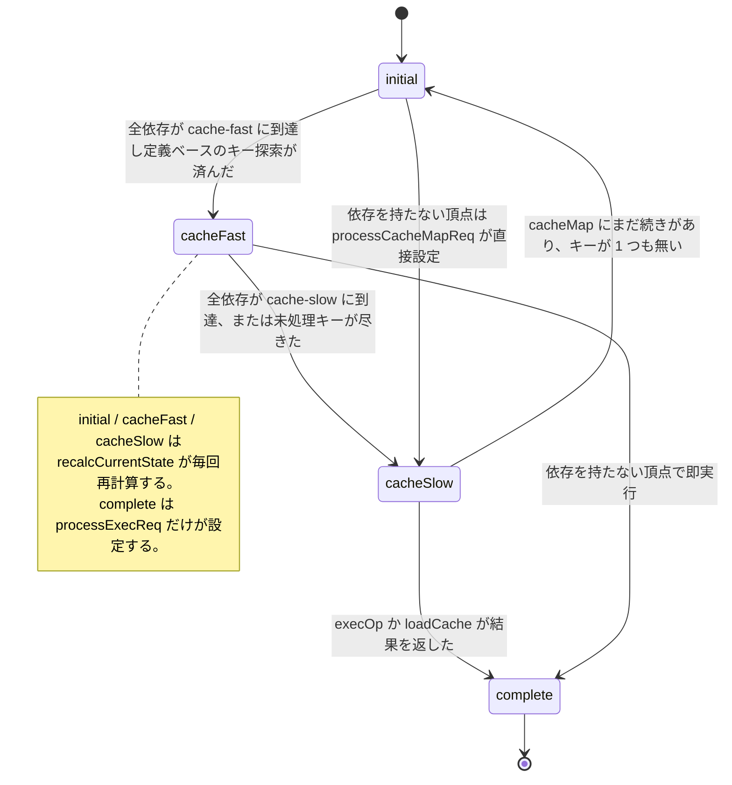

## 何を学んだか

edge の状態は 4 つしかない。

```go title="solver/edge.go"
type edgeStatusType int

const (
	edgeStatusInitial edgeStatusType = iota
	edgeStatusCacheFast
	edgeStatusCacheSlow
	edgeStatusComplete
)

func (t edgeStatusType) String() string {
	return []string{"initial", "cache-fast", "cache-slow", "complete"}[t]
}
```

([solver/edge.go L14-L25](https://github.com/moby/buildkit/blob/ca4838f8ddbd3612bca94bcb8a938d8a326110a3/solver/edge.go#L14-L25))

意味は `docs/dev/solver.md` に書かれている。

> The initial state is the starting state for any edge. If a state has reached a cache-fast state, it means that all the definition based cache key lookups have been performed. Cache-slow means that content-based cache lookup has been performed as well.

([docs/dev/solver.md L271-L275](https://github.com/moby/buildkit/blob/ca4838f8ddbd3612bca94bcb8a938d8a326110a3/docs/dev/solver.md#L271-L275))

つまり状態は「どこまで調べ終わったか」を表す。`complete` だけが実体を持ち、それ以外は「ここまでのキー探索は済んだが、まだ結果は無い」を意味する。

面白いのは遷移の書き方だ。`e.state++` のような進め方はどこにもない。代わりに `recalcCurrentState` が、依存たちの現在の状態から **2 種類の下界を毎回ゼロから計算し直し、その最大値を現在地とする**。



## 2 つの下界

`recalcCurrentState` の後半がこの計算だ。

```go title="solver/edge.go"
	// detect lower/upper bound for current state
	allDepsCompletedCacheFast := e.cacheMap != nil
	allDepsCompletedCacheSlow := e.cacheMap != nil
	allDepsStateCacheSlow := true
	allDepsCompleted := true
	stLow := edgeStatusInitial    // minimal possible state
	stHigh := edgeStatusCacheSlow // maximum possible state
	if e.cacheMap != nil {
		for _, dep := range e.deps {
			// ...
		}
	}
```

([solver/edge.go L486-L493](https://github.com/moby/buildkit/blob/ca4838f8ddbd3612bca94bcb8a938d8a326110a3/solver/edge.go#L486-L493))

コメントは "minimal possible state" / "maximum possible state" と書いているが、コードを追うと**どちらも「edge がここまで進んでいることは確実だ」という下界**として使われている。違うのは根拠だ。

### stHigh — 全依存が到達した水準

```go title="solver/edge.go"
			effectiveState := dep.state
			if dep.state == edgeStatusCacheSlow && isSlowCacheIncomplete {
				effectiveState = edgeStatusCacheFast
			}
			if dep.state == edgeStatusComplete && isSlowCacheIncomplete {
				effectiveState = edgeStatusCacheFast
			}
			if effectiveState < stHigh {
				stHigh = effectiveState
			}
```

([solver/edge.go L501-L510](https://github.com/moby/buildkit/blob/ca4838f8ddbd3612bca94bcb8a938d8a326110a3/solver/edge.go#L501-L510))

全依存の `effectiveState` の**最小値**を取る。「一番遅れている依存がどこまで来たか」であり、そこまでは自分も確実に調べ終わっている。初期値が `edgeStatusCacheSlow` なので、この計算からは絶対に `complete` は出てこない。実体の有無は依存の状態から推論できないからだ。

`effectiveState` の補正が肝で、**依存が `complete` でも、その依存に対する slow cache がまだ計算できていなければ `cacheFast` に引き下げる**。依存の結果は手に入ったが、その中身のハッシュ (contenthash など) がまだなら、自分のキーは作れない。`isSlowCacheIncomplete` の定義はこう。

```go title="solver/edge.go"
			isSlowCacheIncomplete := e.slowCacheFunc(dep) != nil && (dep.state == edgeStatusCacheSlow || (dep.state == edgeStatusComplete && !dep.slowCacheComplete))
```

([solver/edge.go L495](https://github.com/moby/buildkit/blob/ca4838f8ddbd3612bca94bcb8a938d8a326110a3/solver/edge.go#L495))

### stLow — 探索が打ち止めになった水準

```go title="solver/edge.go"
			if dep.state > stLow && len(dep.keyMap) == 0 && !isSlowIncomplete {
				stLow = min(dep.state, edgeStatusCacheSlow)
			}
```

([solver/edge.go L498-L500](https://github.com/moby/buildkit/blob/ca4838f8ddbd3612bca94bcb8a938d8a326110a3/solver/edge.go#L498-L500))

条件は「この依存の `keyMap` が空」だ。`keyMap` は `probeCache` が実際にキャッシュリンクを見つけたキーだけが入る集合なので、**空ということは「この依存経由でこの edge がキャッシュにヒットする可能性はゼロ」**を意味する。

依存が 1 本でもそうなっていれば、他の依存をどれだけ深く掘ってもキャッシュキーは合成できない。だから「この依存が到達した水準までは、自分の探索も (答えが出ないという形で) 終わっている」と言える。こちらは条件を満たす依存の**最大値**を取る。

`keyMap` と `keys` の違いはこの判断の中心なので押さえておきたい。

```go title="solver/edge.go"
// probeCache is called with unprocessed cache keys for dependency
// if the key could match the edge, the cacheRecords for dependency are filled
func (e *edge) probeCache(d *dep, depKeys []CacheKeyWithSelector) bool {
	// ...
	keys, err := e.op.Cache().Query(depKeys, d.index, e.cacheMap.Digest, e.edge.Index)
	// ...
	for _, k := range keys {
		k.vtx = e.edge.Vertex.Digest()
		if _, ok := d.keyMap[k.ID]; !ok {
			d.keyMap[k.ID] = k
			found = true
		}
	}
	return found
}
```

([solver/edge.go L194-L216](https://github.com/moby/buildkit/blob/ca4838f8ddbd3612bca94bcb8a938d8a326110a3/solver/edge.go#L194-L216))

`dep.keys` は「依存が持っているキー全部」、`dep.keyMap` は「そのうちこの edge へのリンクが実在したもの」だ ([キャッシュ検索はハッシュ計算ではなくグラフ探索である](../cache-query-graph/))。

### 合成

```go title="solver/edge.go"
		if stLow > e.state {
			e.state = stLow
		}
		if stHigh > e.state {
			e.state = stHigh
		}
		if !e.cacheMapDone && len(e.keys) == 0 {
			e.state = edgeStatusInitial
		}
```

([solver/edge.go L524-L532](https://github.com/moby/buildkit/blob/ca4838f8ddbd3612bca94bcb8a938d8a326110a3/solver/edge.go#L524-L532))

現在値と 2 つの下界の最大値。単調増加だ。ただし最後の 3 行だけが唯一の巻き戻しで、**`cacheMap` の続きがまだ来る予定で、しかもキーが 1 本も立っていない場合は `initial` に戻す**。

`cacheMapDone` は `Op.CacheMap` の第 2 戻り値から来る。

```go title="solver/types.go"
	// CacheMap returns structure describing how the operation is cached.
	// Currently only roots are allowed to return multiple cache maps per op.
	CacheMap(context.Context, JobContext, int) (*CacheMap, bool, error)
```

([solver/types.go L174-L176](https://github.com/moby/buildkit/blob/ca4838f8ddbd3612bca94bcb8a938d8a326110a3/solver/types.go#L174-L176))

根の頂点だけが複数のキャッシュマップを返せる。イメージ参照を解決する頂点が「タグ由来のキー」と「ダイジェスト由来のキー」を順に出すような場合だ ([ExecOp の CacheMap](../execop-cachemap/))。まだ続きがあるのに `cacheFast` を名乗ると、上流が「もう定義ベースの探索は終わった」と誤解する。だから戻す。

## 依存を持たない頂点は別経路

根の頂点には依存がないので、上のループは 1 周も回らない。状態は `processCacheMapReq` が直接付ける。

```go title="solver/edge.go"
	if len(e.deps) == 0 {
		e.cacheMapDigests = append(e.cacheMapDigests, e.cacheMap.Digest)
		if !e.op.IgnoreCache() {
			keys, err := e.op.Cache().Query(nil, 0, e.cacheMap.Digest, e.edge.Index)
			// ... 見つかったキーごとに Records を引いて e.keys / e.cacheRecords に積む
		}
		e.state = edgeStatusCacheSlow
	}
```

([solver/edge.go L583-L607](https://github.com/moby/buildkit/blob/ca4838f8ddbd3612bca94bcb8a938d8a326110a3/solver/edge.go#L583-L607))

いきなり `cacheSlow` になる。入力がないので content-based の探索が発生しようがなく、「調べられることは全部調べた」からだ。

## complete は 1 箇所からしか付かない

```go title="solver/edge.go"
func (e *edge) processExecReq() {
	upt := e.execReq
	if err := upt.Status().Err; err != nil {
		// ...
		return
	}

	e.result = NewSharedCachedResult(upt.Status().Value.(CachedResult))
	e.state = edgeStatusComplete
	// ...
}
```

([solver/edge.go L621-L648](https://github.com/moby/buildkit/blob/ca4838f8ddbd3612bca94bcb8a938d8a326110a3/solver/edge.go#L621-L648))

`edgeStatusComplete` を書くのはこの 1 行だけだ。しかも `e.result` の代入と同じ行にある。**「complete である」と「result を持っている」が構造的に一致する**ので、`state == complete` なのに `result == nil` という状態が原理的に作れない。

同じ関数の後半には、共有 edge のための追加処理が入っている。

```go title="solver/edge.go"
	// The keys committed by the execution have so far only existed on the
	// result. Add them to e.keys so that a consumer subscribing after this
	// edge has completed (a shared edge kept alive by a concurrent build)
	// still receives them and can probe the cache. Skipped on cache load
	// where the loaded record's key is in e.keys already, and for
	// ignore-cache so that consumers cannot match cache records through a
	// dependency that was itself forced to re-run.
	if !e.execCacheLoad && !e.op.IgnoreCache() {
		e.keys = append(e.keys, e.result.CacheKeys()...)
	}
```

([solver/edge.go L638-L647](https://github.com/moby/buildkit/blob/ca4838f8ddbd3612bca94bcb8a938d8a326110a3/solver/edge.go#L638-L647))

実行で確定したキーは結果オブジェクトの上にしか無い。しかし `edgeState.keys` は「上流に配る用」のフィールドなので、後から参加した上流 edge にもキーが届くようにここでコピーする。`IgnoreCache` の頂点でこれをやらないのは、「強制再実行された頂点を経由してキャッシュに当たる」ことを禁じるためだ。この非対称性は [Job / state / edge / sharedOp の 4 層](../job-state-edge/) の `dgstWithoutCache` と同じ思想で貫かれている。

## 「未処理キーが尽きた」による格上げ

`recalcCurrentState` の末尾には、もう 1 つ状態を進める経路がある。

```go title="solver/edge.go"
		if e.allDepsStateCacheSlow && len(e.cacheRecords) > 0 && e.state == edgeStatusCacheFast {
			openKeys := map[string]struct{}{}
			for _, dep := range e.deps {
				isSlowIncomplete := // ...
				if !isSlowIncomplete {
					openDepKeys := map[string]struct{}{}
					for key := range dep.keyMap {
						if _, ok := e.keyMap[key]; !ok {
							openDepKeys[key] = struct{}{}
						}
					}
					// openKeys を共通部分で絞り込む
					// ...
					if len(openKeys) == 0 {
						e.state = edgeStatusCacheSlow
						debugSchedulerUpgradeCacheSlow(e)
					}
				}
			}
		}
```

([solver/edge.go L539-L565](https://github.com/moby/buildkit/blob/ca4838f8ddbd3612bca94bcb8a938d8a326110a3/solver/edge.go#L539-L565))

`e.keyMap` は「もう edge のキーに合成済みのキー ID」の集合だ。各依存の `keyMap` から未合成のものを抜き出し、全依存に共通するものが残っているかを見る。残っていなければ、**これ以上新しいキーは生まれない**ので `cacheSlow` に上げてよい。デバッグログの文言も `"upgrade to cache-slow because no open keys"` とそのまま書いてある。

キー合成の本体は同じ関数の前半にある。

```go title="solver/edge.go"
	newKeys := map[string]*CacheKey{}

	for i, dep := range e.deps {
		if i == 0 {
			for id, k := range dep.keyMap {
				if _, ok := e.keyMap[id]; ok {
					continue
				}
				newKeys[id] = k
			}
		} else {
			for id := range newKeys {
				if _, ok := dep.keyMap[id]; !ok {
					delete(newKeys, id)
				}
			}
		}
		if len(newKeys) == 0 {
			break
		}
	}
```

([solver/edge.go L426-L446](https://github.com/moby/buildkit/blob/ca4838f8ddbd3612bca94bcb8a938d8a326110a3/solver/edge.go#L426-L446))

依存 0 の候補キーから始めて、依存 1 以降で共通部分を取っていく。**全依存が同じキー ID を指しているものだけが、この edge の新しいキーになる。** 途中で空になったら即座に打ち切る。キーの合成については [キャッシュキーの合成](../cachekey-composition/) で詳しく扱う。

## なぜそうなっているか

`docs/dev/solver.md` は unpark の第 2 フェーズをこう説明する。

> After that, if any of the updates caused changes to edge's properties, a new state is calculated for the current vertex. In this step, all potential cache keys from inputs can cause new cache keys for the edge to be created and the status of an edge might be updated.

([docs/dev/solver.md L286-L289](https://github.com/moby/buildkit/blob/ca4838f8ddbd3612bca94bcb8a938d8a326110a3/docs/dev/solver.md#L286-L289))

"a new state is calculated" — 遷移ではなく計算だ。

再計算にする利点は、**イベントの到着順に依存しないこと**にある。依存 A が先に完了しても、依存 B が先でも、`recalcCurrentState` が見るのは全依存の現在値だけなので同じ答えが出る。スケジューラは `waitq` で通知をまとめてしまうので ([スケジューラのシングルスレッドループと pipe](../scheduler-loop/))、「どのイベントで呼ばれたか」を edge が知る手段はそもそも無い。遷移で書こうとすれば、まとめられたイベントを 1 つずつ復元する必要が出てくる。

`processUpdates` の構造がそれをよく表している。

```go title="solver/edge.go"
func (e *edge) processUpdates(updates []pipe.Receiver[*edgeRequest, any]) {
	depChanged := false
	for _, upt := range updates {
		depChanged = e.processUpdate(upt) || depChanged
	}

	if depChanged {
		e.recalcCurrentState()
	}
}
```

([solver/edge.go L381-L390](https://github.com/moby/buildkit/blob/ca4838f8ddbd3612bca94bcb8a938d8a326110a3/solver/edge.go#L381-L390))

各 update は自分のフィールドを更新するだけで、状態には触らない。**全部反映し終えてから 1 回だけ再計算する。** `depChanged` が 1 つも立たなければ再計算すらしない。

もう 1 つの理由は「早すぎる格上げ」を防ぐことだ。もし遷移で書けば、依存 A が `cacheFast` に達した時点で「自分も `cacheFast` かもしれない」と考えたくなるが、依存 B がまだ `initial` なら間違いだ。全依存の最小値を毎回取るほうが、条件を書き忘れる余地がない。

## どう活かすか

**状態を「進める」のではなく「求める」。** 入力の集合から一意に決まる関数として状態を定義すれば、イベントの順序・重複・取りこぼしがすべて無害になる。差分適用のバグはこの形にすると原理的に発生しない。

**下界を複数の根拠から取り、最大値を採る。** 「全員がここまで来た」と「ここで打ち切りが確定した」は別種の根拠だが、どちらも下界として合成できる。判断材料が増えたら `max` に項を足すだけで済む形にしておくと、条件分岐が増えていかない。

**巻き戻しを 1 箇所に集める。** BuildKit の状態は基本的に単調増加で、例外は「`cacheMap` の続きがある」ケースだけだ。その 1 箇所を `recalcCurrentState` の末尾に隔離しているので、「なぜ状態が下がったのか」を調べるときに見る場所が 3 行しかない。

**「完了」フラグと「結果」を同じ代入にまとめる。** `e.result` と `e.state = complete` が隣接していることで、不整合な組み合わせが表現できなくなる。フラグと実体を別々に更新できる設計は、いつか片方だけ更新するバグを生む。
