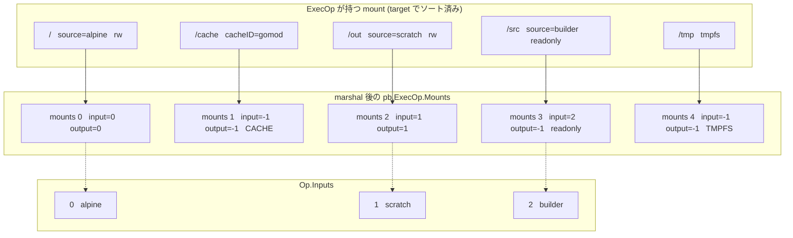

## 何を学んだか

`ExecOp` は「コマンドを 1 個実行する」頂点だが、その入出力はコマンドではなく **mount の集合**で決まる。`Op.Inputs` に何番目として並ぶかも、この頂点の何番目の出力になるかも、mount を走査した順に振られる番号だ。

だから `RUN --mount=type=bind,from=builder,target=/src make` のような 1 行が、「入力 2 本・出力 1 本の頂点」に変換される過程はすべて mount のループの中にある。そしてそのループは、marshal の直前に mount をマウント先パスでソートしてから回る。

## Mount というメッセージ

```proto title="solver/pb/ops.proto"
// Mount specifies how to mount an input Op as a filesystem.
message Mount {
	int64 input = 1;
	string selector = 2;
	string dest = 3;
	int64 output = 4;
	bool readonly = 5;
	MountType mountType = 6;
	TmpfsOpt TmpfsOpt = 19;
	CacheOpt cacheOpt = 20;
	SecretOpt secretOpt = 21;
	SSHOpt SSHOpt = 22;
	string resultID = 23;
	MountContentCache contentCache = 24;
}

enum MountType {
	BIND = 0;
	SECRET = 1;
	SSH = 2;
	CACHE = 3;
	TMPFS = 4;
}
```

([solver/pb/ops.proto L109-132](https://github.com/moby/buildkit/blob/ca4838f8ddbd3612bca94bcb8a938d8a326110a3/solver/pb/ops.proto#L109-L132))

`input` と `output` は int64 だが、`-1` に特別な意味がある。

```go title="solver/pb/const.go"
// RootMount is a base mountpoint
const RootMount = "/"

// SkipOutput marks a disabled output index
const SkipOutput OutputIndex = -1

// Empty marks an input with no content
const Empty InputIndex = -1
```

([solver/pb/const.go L9-16](https://github.com/moby/buildkit/blob/ca4838f8ddbd3612bca94bcb8a938d8a326110a3/solver/pb/const.go#L9-L16))

`input = -1` は「入力を持たない mount」— tmpfs、secret、ssh、そして空のキャッシュマウントだ。`output = -1` は「この mount は結果を残さない」。5 種の `MountType` のうち、実際に `Op.Inputs` に現れうるのは BIND と CACHE だけで、残りは常に `Empty` を指す。

## ルート mount は必ず存在する

`ExecOp` は生成された時点で `/` の mount を 1 つ持つ。

```go title="client/llb/exec.go"
func NewExecOp(base State, proxyEnv *ProxyEnv, readOnly bool, c Constraints) *ExecOp {
	e := &ExecOp{base: base, constraints: c, proxyEnv: proxyEnv}
	root := base.Output()
	rootMount := &mount{
		target:   pb.RootMount,
		source:   root,
		readonly: readOnly,
	}
	e.mounts = append(e.mounts, rootMount)
	if readOnly {
		e.root = root
	} else {
		o := &output{vertex: e, getIndex: e.getMountIndexFn(rootMount)}
		// ...
		e.root = o
	}
	rootMount.output = e.root
	return e
}
```

([client/llb/exec.go L17-37](https://github.com/moby/buildkit/blob/ca4838f8ddbd3612bca94bcb8a938d8a326110a3/client/llb/exec.go#L17-L37))

`readOnly` のとき `e.root = root` になっているのに注目したい。読み取り専用ルートの exec の `Root()` は、**この exec の出力ではなく入力そのもの**を返す。`RUN --network=none` のように何も書き換えない実行を、後続の頂点から見ると「素通し」になる。

daemon 側もルート mount の存在を検証している。

```go title="solver/llbsolver/ops/opsutils/validate.go"
		isRoot := false
		for _, m := range op.Exec.Mounts {
			if m.Dest == pb.RootMount {
				isRoot = true
				break
			}
		}
		if !isRoot {
			return errors.New("invalid exec op with no rootfs")
		}
```

([solver/llbsolver/ops/opsutils/validate.go](https://github.com/moby/buildkit/blob/ca4838f8ddbd3612bca94bcb8a938d8a326110a3/solver/llbsolver/ops/opsutils/validate.go))

## 番号を振るループ

`Marshal` の核心はこの 30 行ほどだ。

```go title="client/llb/exec.go"
	outIndex := 0
	for _, m := range e.mounts {
		inputIndex := pb.InputIndex(len(pop.Inputs))
		if m.source != nil {
			if m.tmpfs {
				return "", nil, nil, nil, errors.New("tmpfs mounts must use scratch")
			}
			inp, err := m.source.ToInput(ctx, c)
			// ...
			newInput := true

			for i, inp2 := range pop.Inputs {
				if inp.EqualVT(inp2) {
					inputIndex = pb.InputIndex(i)
					newInput = false
					break
				}
			}

			if newInput {
				pop.Inputs = append(pop.Inputs, inp)
			}
		} else {
			inputIndex = pb.Empty
		}

		outputIndex := pb.SkipOutput
		if !m.noOutput && !m.readonly && m.cacheID == "" && !m.tmpfs {
			outputIndex = pb.OutputIndex(outIndex)
			outIndex++
		}

		pm := &pb.Mount{
			Input:    int64(inputIndex),
			Dest:     m.target,
			Readonly: m.readonly,
			Output:   int64(outputIndex),
			Selector: m.selector,
		}
```

([client/llb/exec.go L362-403](https://github.com/moby/buildkit/blob/ca4838f8ddbd3612bca94bcb8a938d8a326110a3/client/llb/exec.go#L362-L403))

3 つのことが同時に起きている。

**入力番号の採番と重複除去。** `len(pop.Inputs)` を仮の番号にして、既存の入力と `EqualVT` で比較する。同じ `Input{digest, index}` が既にあれば、その番号を使い回して配列には足さない。同じステージから 2 か所に bind mount しても入力は 1 本になる。

**出力番号の採番。** 出力を持つのは「明示的に出力なしにされておらず、読み取り専用でなく、キャッシュマウントでなく、tmpfs でもない」mount だけだ。この条件を満たすものだけが `outIndex` を消費する。だから mount の並びの中で出力インデックスは飛び飛びにならず、`0, 1, 2, ...` と詰まって振られる。

**書き込み不能な mount の扱い。** 読み取り専用マウントは `SkipOutput` になるので、そもそも結果を持たない。`AddMount` 側では、この種の mount の `output` に「親として使えない」というエラーを埋めた `output` を返している。

```go title="client/llb/exec.go"
	if m.readonly {
		m.output = source
	} else if m.tmpfs {
		m.output = &output{vertex: e, err: errors.Errorf("tmpfs mount for %s can't be used as a parent", target)}
	} else if m.noOutput {
		m.output = &output{vertex: e, err: errors.Errorf("mount marked no-output and %s can't be used as a parent", target)}
	} else {
		o := &output{vertex: e, getIndex: e.getMountIndexFn(m)}
		// ...
	}
```

([client/llb/exec.go L78-90](https://github.com/moby/buildkit/blob/ca4838f8ddbd3612bca94bcb8a938d8a326110a3/client/llb/exec.go#L78-L90))

エラーを返り値ではなく `Output` の中に埋めておくのは、LLB の API が遅延評価だからだ。`AddMount` の時点ではエラーを返す先がない。`ToInput` が呼ばれたときに初めて表面化する ([State API](../state-api/))。



## 出力インデックスは遅延して数える

`AddMount` が返す `Output` は、`getIndex` として関数を持つ。

```go title="client/llb/exec.go"
func (e *ExecOp) getMountIndexFn(m *mount) func() (pb.OutputIndex, error) {
	return func() (pb.OutputIndex, error) {
		// make sure mounts are sorted
		slices.SortFunc(e.mounts, func(a, b *mount) int {
			return strings.Compare(a.target, b.target)
		})

		i := 0
		for _, m2 := range e.mounts {
			if m2.noOutput || m2.readonly || m2.tmpfs || m2.cacheID != "" {
				continue
			}
			if m == m2 {
				return pb.OutputIndex(i), nil
			}
			i++
		}
		return pb.OutputIndex(0), errors.Errorf("invalid mount: %s", m.target)
	}
}
```

([client/llb/exec.go L507-526](https://github.com/moby/buildkit/blob/ca4838f8ddbd3612bca94bcb8a938d8a326110a3/client/llb/exec.go#L507-L526))

`Marshal` の `outIndex++` と、この関数の `i++` は同じ条件で同じ数え方をしている。ただしこちらは `ToInput` が呼ばれるまで実行されない。理由は明快で、**採番の時点では最終的な mount の集合が決まっていない**からだ。

```go
st := base.Run(llb.Shlex("make"))
out := st.AddMount("/out", llb.Scratch())   // ここで出力番号を確定できない
st.AddMount("/aaa", llb.Scratch())          // 後から /aaa が足されると /out は 2 番になる
```

`/aaa` は `/out` よりソート順で前に来るので、後から追加されただけで `/out` の出力番号がずれる。関数にして遅延させることで、`Marshal` の時点の mount 集合に対して正しい番号が出る。同じ理由で `AddMount` は marshal キャッシュを潰している (`cache.Store(nil, nil, nil, nil)`, [client/llb/exec.go L91](https://github.com/moby/buildkit/blob/ca4838f8ddbd3612bca94bcb8a938d8a326110a3/client/llb/exec.go#L91))。

## secret と ssh はループの外で足される

ソートしたループが終わったあと、secret と SSH の mount が追記される。

```go title="client/llb/exec.go"
	for _, s := range e.secrets {
		if s.Env != nil {
			peo.Secretenv = append(peo.Secretenv, &pb.SecretEnv{
				ID: s.ID, Name: *s.Env, Optional: s.Optional,
			})
		}
		if s.Target != nil {
			pm := &pb.Mount{
				Input:     int64(pb.Empty),
				Dest:      *s.Target,
				MountType: pb.MountType_SECRET,
				SecretOpt: &pb.SecretOpt{ /* ... */ },
			}
			peo.Mounts = append(peo.Mounts, pm)
		}
	}
```

([client/llb/exec.go L435-458](https://github.com/moby/buildkit/blob/ca4838f8ddbd3612bca94bcb8a938d8a326110a3/client/llb/exec.go#L435-L458))

これらは `e.mounts` には入らないので、ソートの対象外だ。結果として `pb.ExecOp.Mounts` の並びは「ソート済みの bind/cache/tmpfs」→「secret」→「ssh」になる。

`Input` には明示的に `pb.Empty` (-1) が入るが、`Output` は設定されていない。proto3 のゼロ値は 0 なので、バイト列の上では「出力インデックス 0」に見える。これが問題にならないのは、daemon 側の `PrepareMounts` が `MountType` で switch していて、SECRET と SSH の分岐が `m.Output` を一切読まないからだ。`OutputRefs` に積まれるのは BIND と CACHE だけになっている ([frontend/gateway/container/container.go L192-264](https://github.com/moby/buildkit/blob/ca4838f8ddbd3612bca94bcb8a938d8a326110a3/frontend/gateway/container/container.go#L192-L264))。「出力を持たない」ことが `-1` ではなく mount type で表現されている、暗黙の不変条件だ。

`Mounts` の順序自体は digest に入るので、secret と ssh の並びも `e.secrets` / `e.ssh` の追加順で決まる。ここも決定性が必要になる ([決定性 marshal](../deterministic-marshal/))。

`ID` を持つだけで値そのものは LLB に入らない、という点が secret の設計の要だ。値はセッション経由で実行時に取りに行く ([secret が snapshot に残らない理由](../secrets-and-ssh/))。

## daemon 側 — 番号が何に使われるか

`Mount.input` は、そのまま「依存の何番目か」として使われる。`CacheMap` は入力ごとの `Deps` を用意し、`m.Input` で引いて selector を積む。

```go title="solver/llbsolver/ops/exec.go"
		if m.Input == int64(pb.Empty) {
			continue
		}
		if m.Input < 0 || int(m.Input) >= len(deps) {
			// ...
		}
		deps[m.Input].Selectors = append(deps[m.Input].Selectors, sel)
```

([solver/llbsolver/ops/exec.go L302-310](https://github.com/moby/buildkit/blob/ca4838f8ddbd3612bca94bcb8a938d8a326110a3/solver/llbsolver/ops/exec.go#L302-L310))

`selector` (LLB では `llb.SourcePath`) は「入力のどのサブパスをマウントするか」だ。これはキャッシュキー本体からは外され、依存ごとの selector に移される — 同じ入力の別のサブパスだけを使う exec は、内容ベースのハッシュ計算の対象範囲が変わる ([ExecOp の CacheMap](../execop-cachemap/))。

出力側は `PrepareMounts` が `m.Output != SkipOutput` の mount について `OutputRefs` を作り、その並び順に結果を積む。

```go title="solver/llbsolver/ops/exec.go"
	for i, out := range p.OutputRefs {
		if mutable, ok := out.Ref.(cache.MutableRef); ok {
			ref, err := mutable.Commit(ctx)
			// ...
			results = append(results, worker.NewWorkerRefResult(ref, e.w))
		} else {
			results = append(results, worker.NewWorkerRefResult(out.Ref.(cache.ImmutableRef), e.w))
		}
		p.OutputRefs[i].Ref = nil
	}
```

([solver/llbsolver/ops/exec.go L535-552](https://github.com/moby/buildkit/blob/ca4838f8ddbd3612bca94bcb8a938d8a326110a3/solver/llbsolver/ops/exec.go#L535-L552))

`OutputRefs` は mount 順に組まれ、出力インデックスも mount 順に振られているので、`results[i]` がそのまま出力インデックス `i` に対応する。この一致は明示的なソートやマッピングではなく、**両側が同じ順序で走査していることだけ**で保たれている。

## なぜそうなっているか

「入力配列と出力配列を明示的に書かず、mount から導出する」設計には理由がある。

exec の入出力は、本質的に「どのファイルシステムをどこに見せ、どこへの書き込みを結果として残すか」だ。これを入力配列・出力配列・mount 表の 3 つに分けて持つと、3 つの間の整合性を保つ責務が生まれる。「mount が指す入力番号が入力配列の範囲外」「出力配列に対応する mount がない」といった不整合が表現できてしまい、検証コードが要る。mount だけを正とし、番号は導出値にすれば、この不整合は構造的に作れない。

代償が、順序が意味を持つことだ。mount の追加順で番号が変わってしまうと、同じビルドが違う LLB になる。だからソートが要る。マウント先パスでソートするという選択も自然で、同じパスに 2 つマウントすることはそもそもできない (できたとしても意味がない) から、キーとして一意になる。

そして `Mount.output` に `-1` を許すことで、「読み取り専用マウント」「キャッシュマウント」「tmpfs」が同じ `Mount` メッセージで表現できている。型を分けずに 1 つのメッセージに `oneof` 相当のオプション群を持たせているのは冗長だが、daemon 側が `Mounts` を 1 本のループで処理できる利点のほうを取っている。

## どう活かすか

**インデックスは導出値にする。** 「配列 A の i 番目は配列 B の j 番目に対応する」という関係を 2 つのフィールドで持つと、必ず不整合が入り込む。片方を正とし、もう片方をそこから計算する形にすれば、不整合という状態が消える。ただしその瞬間に「計算の順序」が仕様になるので、順序を決める規則 (ここではマウント先パスのソート) を明示し、複数箇所で同じ規則を使っていることをコメントで結んでおく必要がある。

**遅延評価と採番は相性が悪い。番号を返さず、番号を返す関数を返す。** `AddMount` が `Output` を返す時点では正しい番号が分からない。ここで無理に番号を確定させると、あとから mount を足せなくなるか、間違った番号が残る。`getIndex func() (OutputIndex, error)` という 1 段の間接で、「値が必要になった時点の状態から計算する」に切り替えられる。

**エラーを返せない場所では、エラーを値に埋める。** ビルダー API のように「メソッドチェーンの途中でエラーを返したくない」場合、`&output{err: ...}` のようにエラーを値に持たせて、最終的な評価時に噴出させるのは有効な型だ。ただしエラーの発生源と表面化の場所が離れるので、メッセージに文脈 (`tmpfs mount for /tmp can't be used as a parent`) を十分に入れておく必要がある。
