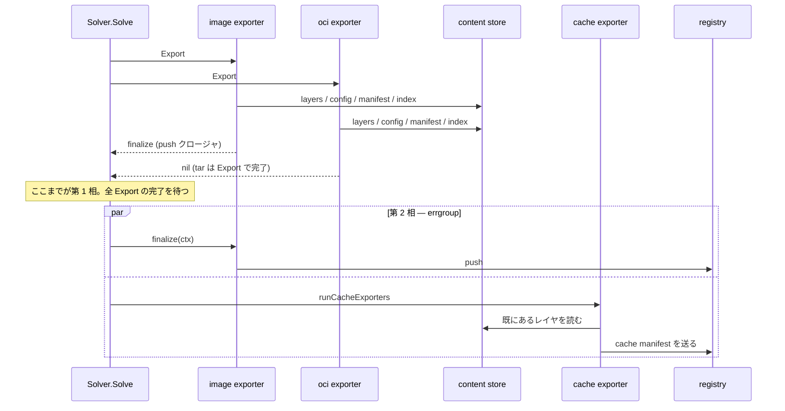

## 何を学んだか

BuildKit のエクスポータは `Export` 1 回では終わらない。`Export` はコンテンツストアにレイヤ・マニフェスト・index を書き込むところまでをやり、**レジストリへの push はその返り値として渡されるクロージャ `FinalizeFunc` に後回しにされる**。

そして相を割った目的は「複数のエクスポータで共有する後処理を 1 回にまとめる」ことではない。実際にはその逆で、**push をリモートキャッシュのエクスポートと並列に走らせる**ためだ。`Export` が先に完了することでレイヤがコンテンツストアに載り、キャッシュエクスポータはそれを見て再利用できる。その状態で「レジストリへ送る」という 2 つのネットワーク仕事を同時に流す。

もう 1 つ注意点として、`ExporterInstance` に `Finalize` というメソッドは無い。相は型ではなく返り値のクロージャで表現されている。

## インターフェース — Finalize は返り値である

```go title="exporter/exporter.go"
type ExporterInstance interface {
	ID() int
	Name() string
	Config() *Config
	Type() string
	Attrs() map[string]string

	// Export performs the export operation and optionally returns a finalize
	// callback. This separates work that must run sequentially from work that
	// can run in parallel with other exports (e.g., cache export).
	//
	// For exporters that complete all work during Export (tar, local),
	// return nil for the finalize callback.
	Export(ctx context.Context, src *Source, buildInfo ExportBuildInfo) (
		response map[string]string,
		finalize FinalizeFunc,
		ref DescriptorReference,
		err error,
	)
}
```

([exporter/exporter.go L31-L50](https://github.com/moby/buildkit/blob/ca4838f8ddbd3612bca94bcb8a938d8a326110a3/exporter/exporter.go#L31-L50))

`FinalizeFunc` の契約はコメントに書かれている。

```go title="exporter/exporter.go"
// FinalizeFunc completes an export operation after all exports have created
// their artifacts. It may perform network operations like pushing to a registry.
//
// Calling FinalizeFunc is optional. If not called (e.g., due to cancellation or
// an error in another operation), the export will be incomplete but no resources
// will leak. FinalizeFunc performs completion work only, not cleanup.
//
// FinalizeFunc is safe to call concurrently with other FinalizeFunc calls.
type FinalizeFunc func(ctx context.Context) error
```

([exporter/exporter.go L21-L29](https://github.com/moby/buildkit/blob/ca4838f8ddbd3612bca94bcb8a938d8a326110a3/exporter/exporter.go#L21-L29))

3 つの条件が重要だ。**呼ばれないことがある**（キャンセルや他のエクスポータのエラー）。呼ばれなくても**リソースは漏れない**（後始末ではなく仕上げしかしない）。そして**並行に呼んでよい**。この 3 つが揃っているから、上位は finalize を errgroup にそのまま投げられる。

`tar` と `local` は `Export` の中ですべて終わるので、finalize には `nil` を返す。`image` エクスポータも `push=false` なら `nil` を返す。

## runExporters — 作る相

エクスポータを回すのは `solver/llbsolver/export.go` の `runExporters`。すべてのエクスポータを errgroup で並列に起動する。

```go title="solver/llbsolver/export.go"
func (s *Solver) runExporters(ctx context.Context, ref string, exporters []exporter.ExporterInstance, inlineCacheExporter inlineCacheExporter, job *solver.Job, cached *result.Result[solver.CachedResult], inp *exporter.Source) (exporterResponse map[string]string, finalizers []exporter.FinalizeFunc, descrefs []exporter.DescriptorReference, err error) {
	warnings, err := verifier.CheckInvalidPlatforms(ctx, inp)
	// ...
	for i, exp := range exporters {
		id := exporterVertexID(job.SessionID, i)
		eg.Go(func() error {
			return inBuilderContext(ctx, job, exp.Name(), id, func(ctx context.Context, _ solver.JobContext) error {
				// ...
				resp, finalize, desc, expErr := exp.Export(ctx, inp, exporter.ExportBuildInfo{...})
				resps[i], finalizeFuncs[i], descs[i] = resp, finalize, desc
```

([solver/llbsolver/export.go L182-L232](https://github.com/moby/buildkit/blob/ca4838f8ddbd3612bca94bcb8a938d8a326110a3/solver/llbsolver/export.go#L182-L232))

ここで「共有される後処理」として実際に 1 回にまとめられているものが 1 つある。インラインキャッシュの生成だ。エクスポータごとに `exptypes.InlineCache` というコールバックが渡されるが、その中身は mutex で直列化されている。

```go title="solver/llbsolver/export.go"
inlineCache := exptypes.InlineCache(func(ctx context.Context) (*result.Result[*exptypes.InlineCacheEntry], error) {
	inlineCacheMu.Lock() // ensure only one inline cache exporter runs at a time
	defer inlineCacheMu.Unlock()
	return runInlineCacheExporter(ctx, exp, inlineCacheExporter, job, cached)
})
```

([solver/llbsolver/export.go L209-L213](https://github.com/moby/buildkit/blob/ca4838f8ddbd3612bca94bcb8a938d8a326110a3/solver/llbsolver/export.go#L209-L213))

レイヤの blob 化そのものは各エクスポータの `ImageWriter.Commit` の中で `GetRemotes` を呼んで行われる。同じ ref から同じ圧縮設定で作れば同じ blob になるので、[compression-variants](../compression-variants/) の仕組みで自然に共有される。相分割はここを狙ったものではない。

## 呼び出し側 — 仕上げる相

```go title="solver/llbsolver/solver.go"
exporterResponse, finalizers, descrefs, err = s.runExporters(ctx, id, exp.Exporters, inlineCacheExporter, j, cached, inp)
if err != nil {
	return nil, err
}

// Run image finalize and cache export in parallel.
// Image Export has already created layers in the content store,
// so cache exporters can see and reuse them.
eg, egCtx := errgroup.WithContext(ctx)
for i, finalize := range finalizers {
	if finalize == nil {
		continue
	}
	// ...
	eg.Go(func() error {
		return inBuilderContext(egCtx, j, name, id, func(ctx context.Context, _ solver.JobContext) error {
			return finalize(ctx)
		})
	})
}
var cacheExporterResponse map[string]string
eg.Go(func() error {
	var err error
	cacheExporterResponse, err = runCacheExporters(egCtx, cacheExporters, j, cached, inp)
	return err
})
if err := eg.Wait(); err != nil {
	return nil, err
}
```

([solver/llbsolver/solver.go L409-L433](https://github.com/moby/buildkit/blob/ca4838f8ddbd3612bca94bcb8a938d8a326110a3/solver/llbsolver/solver.go#L409-L433))

キャッシュエクスポータ側の詳細は [キャッシュのエクスポート](../cache-export/) にある。ここで押さえるのは順序だけだ。**`Export` は全部終わってから、finalize 群とキャッシュエクスポートが同じ errgroup に入る。**



## リースと DescriptorReference — 相をまたぐ生存期間

相を割ると「第 1 相で作った blob が第 2 相の push まで GC されない」ことを保証しなければならない。BuildKit はこれをリースで解決している。ジョブ全体をカバーするリースを `Solve` の 1 か所で取る。

```go title="solver/llbsolver/solver.go"
// Functions that create new objects in containerd (eg. content blobs) need to have a lease to ensure
// that the object is not garbage collected immediately. This is protected by the individual components,
// but because creating a lease is not cheap and requires a disk write, we create a single lease here
// early and let all the exporters, cache export, provenance creation, and finalize callbacks use the
// same one. The lease must span both artifact creation and the finalize phase (registry push) to
// prevent GC from collecting blobs before they are pushed.
```

([solver/llbsolver/solver.go L379-L384](https://github.com/moby/buildkit/blob/ca4838f8ddbd3612bca94bcb8a938d8a326110a3/solver/llbsolver/solver.go#L379-L384))

エクスポータ側もさらに自前のリースを取り、その `done` 関数を `DescriptorReference` に握らせて呼び出し側へ返す。

```go title="exporter/containerimage/export.go"
// On success, we create descref which holds the lease's done function.
// The solver will release descref after recording the descriptor in build
// history. On error (descref is nil), we release the lease here.
defer func() {
	if descref == nil {
		done(context.WithoutCancel(ctx))
	}
}()
```

([exporter/containerimage/export.go L246-L253](https://github.com/moby/buildkit/blob/ca4838f8ddbd3612bca94bcb8a938d8a326110a3/exporter/containerimage/export.go#L246-L253))

`descrefs` は `Solve` の最上位の defer で解放される。ビルド履歴に descriptor を記録し終えるまで、成果物は生きている。

```go title="solver/llbsolver/solver.go"
defer func() {
	for _, f := range releasers {
		f()
	}
	for _, descref := range descrefs {
		if descref != nil {
			descref.Release()
		}
	}
}()
```

([solver/llbsolver/solver.go L228-L237](https://github.com/moby/buildkit/blob/ca4838f8ddbd3612bca94bcb8a938d8a326110a3/solver/llbsolver/solver.go#L228-L237))

## エラーのときに何が起きるか

- 第 1 相のどれか 1 つが失敗すると `runExporters` は `nil, nil, nil, err` を返し、**成功した他のエクスポータの finalize は 1 つも呼ばれない**。push が中途半端に起きるより、何も push されないほうを選んでいる。
- 第 2 相は errgroup の `egCtx` を共有するので、push が失敗するとキャッシュエクスポートもキャンセルされる（逆も同じ）。ただしキャッシュエクスポータには `IgnoreError` があり、これが立っていれば `runCacheExporters` は自分のエラーを握りつぶす。
- finalize が呼ばれずに終わっても、`FinalizeFunc` は「仕上げしかしない、後始末はしない」と決められているのでリークしない。後始末はリースと `descref.Release()` が一手に引き受ける。

## なぜそうなっているか

この分割はコミット `88ef66c6b` (`solver: run image and cache exports in parallel`) で入った。コミットメッセージがそのまま設計意図になっている。

> Split image export into two phases to enable parallel execution:
>
> 1. Export creates artifacts (layers, manifests) in the content store
> 2. FinalizeFunc pushes artifacts to the registry
>
> This allows image push to run in parallel with cache export, reducing overall build time when both image and cache exports are configured.
>
> The cache exporters run after image Export completes, ensuring they can see and reuse the layers in the content store.

つまり分割の境目は「共有できる仕事かどうか」ではなく、**「ローカルのコンテンツストアで完結する仕事か、外部ネットワークに出る仕事か」**だ。前者には依存関係がある（キャッシュエクスポータはレイヤが出来ていないと参照できない）。後者には依存関係がない（push と cache push は互いに独立）。依存のある部分だけを直列にして、無い部分を並列にした。

インターフェースにメソッドを 1 本増やすのではなくクロージャを返す形にしたことも合理的だ。finalize が必要とする状態（`namesToPush`、`desc.Digest`、`src`）は `Export` のローカル変数であって、インスタンスのフィールドではない。メソッドにすると、これらを構造体に持たせて「Export 済みかどうか」の状態管理が要る。クロージャならその状態はキャプチャされるだけで済み、`Export` を呼んでいないインスタンスに `Finalize` が飛んでくる可能性も型のうえで消える。

## どう活かすか

- **「2 相に分ける」の切り口を、共有処理の集約ではなく依存関係の解体として考える。** どの仕事とどの仕事の間に本当の順序制約があるかを書き出すと、直列にすべき境目が 1 本だけ見えることがある。BuildKit の場合それは「レイヤがコンテンツストアに存在すること」だった。
- **相を返り値のクロージャで表す。** 第 2 相が第 1 相のローカル状態しか必要としないなら、インターフェースにメソッドを足すよりクロージャを返すほうが、状態管理も呼び出し順序の不正も消える。「第 2 相が不要なら nil を返す」も自然に表現できる。
- **オプショナルな第 2 相の契約を明文化する。** 「呼ばれないことがある」「呼ばれなくてもリークしない」「並行に呼んでよい」の 3 点をコメントで宣言しておくと、呼び出し側は迷わず errgroup に投げられる。逆にこれを書かないと、呼び出し側は最も保守的な（＝直列で必ず呼ぶ）実装しか選べない。
- **相をまたぐ生存期間はリース 1 本にまとめる。** BuildKit はジョブ単位のリースを最上位で 1 回だけ取り、「リースの取得はディスク書き込みを伴うので安くない」とコメントで理由も残している。細かい単位で取ると、境目ごとに寿命を考える羽目になる。
