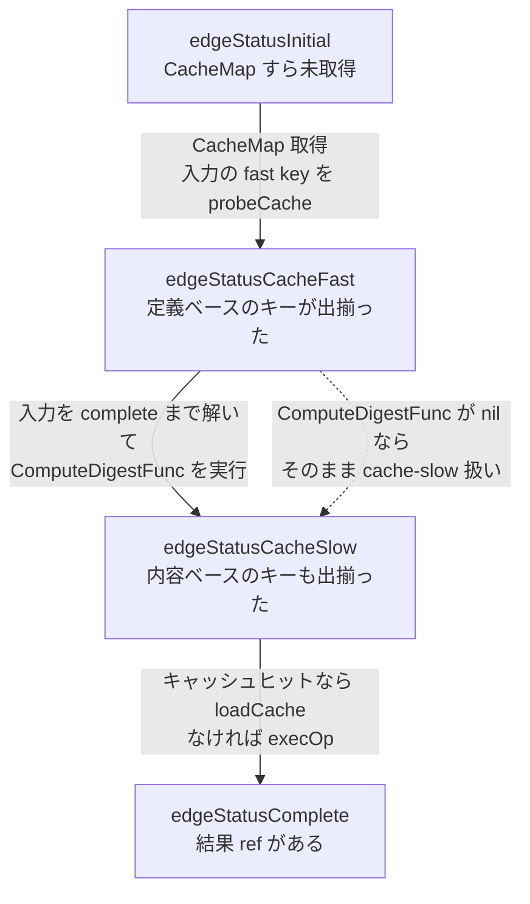

## 何を学んだか

BuildKit のキャッシュキーには、計算コストも計算タイミングも違う 2 系統がある。

- **fast cache key** — 頂点の定義 (LLB の Op) だけから計算できる。入力を 1 バイトも読まずに決まる。
- **slow cache key** — 入力を実際に解いて、そのスナップショットの中身をハッシュしないと決まらない。

この区別は「実装上の最適化」ではなく**型に書き込まれた仕様**だ。`CacheMap.Deps[i].Selector` が fast 側、`CacheMap.Deps[i].ComputeDigestFunc` が slow 側で、両者は別のフィールドになっている。そして `edge` の状態機械には `edgeStatusCacheFast` と `edgeStatusCacheSlow` という 2 つの状態が並んでいる。**キーの種類が状態機械の状態になっている**、というのがこの設計の要点になる。

## CacheMap の型が 2 種類を分けている

```go title="solver/types.go"
type ResultBasedCacheFunc func(context.Context, Result, session.Group) (digest.Digest, error)
type PreprocessFunc func(context.Context, Result, session.Group) error
```

([solver/types.go L210-L211](https://github.com/moby/buildkit/blob/ca4838f8ddbd3612bca94bcb8a938d8a326110a3/solver/types.go#L210-L211))

`ResultBasedCacheFunc` は名前がそのまま定義になっている。**`Result` を受け取る** — つまり入力が既に解けていないと呼べない。対して `Selector` はただの `digest.Digest` で、`CacheMap` を作る時点で値が入っている。

```go title="solver/types.go"
	Deps []struct {
		// Selector is a digest that is merged with the cache key of the input.
		// Selectors are not merged with the result of the `ComputeDigestFunc` for
		// this input.
		Selector digest.Digest

		// ComputeDigestFunc should return a digest for the input based on its return
		// value.
		ComputeDigestFunc ResultBasedCacheFunc

		// PreprocessFunc is a function that runs on an input before it is passed to op
		PreprocessFunc PreprocessFunc
	}
```

([solver/types.go L225-L240](https://github.com/moby/buildkit/blob/ca4838f8ddbd3612bca94bcb8a938d8a326110a3/solver/types.go#L225-L240))

コメントの「Selector は `ComputeDigestFunc` の結果とは合成されない」が両者の役割分担を決めている。`RUN --mount=from=build,src=/out` のような入力を考えると、fast 側は「入力全体のキー + `/out` というセレクタ digest」で作られ、slow 側は「`/out` 以下を実際に読んだ内容ハッシュ」そのものになる。セレクタの情報は内容ハッシュの計算範囲に既に織り込まれているので、二重に混ぜる意味がない。

`ExecOp` はこの 2 つを同じループで埋めている。

```go title="solver/llbsolver/ops/exec.go"
	for i, dep := range deps {
		if len(dep.Selectors) != 0 {
			dgsts := make([][]byte, 0, len(dep.Selectors))
			for _, p := range dep.Selectors {
				dgsts = append(dgsts, []byte(p))
			}
			cm.Deps[i].Selector = digest.FromBytes(bytes.Join(dgsts, []byte{0}))
		}
		if dep.ContentBasedHash {
			cm.Deps[i].ComputeDigestFunc = opsutils.NewContentHashFunc(toSelectors(dedupePaths(dep.Selectors)))
		}
		cm.Deps[i].PreprocessFunc = unlazyResultFunc
	}
```

([solver/llbsolver/ops/exec.go L202-L214](https://github.com/moby/buildkit/blob/ca4838f8ddbd3612bca94bcb8a938d8a326110a3/solver/llbsolver/ops/exec.go#L202-L214))

`Selector` は常に埋まるが、`ComputeDigestFunc` は `dep.ContentBasedHash` が真のときだけ埋まる。**slow cache はオプトインである。**

## edge の状態がキーの種類を表す

```go title="solver/edge.go"
const (
	edgeStatusInitial edgeStatusType = iota
	edgeStatusCacheFast
	edgeStatusCacheSlow
	edgeStatusComplete
)

func (t edgeStatusType) String() string {
	return []string{"initial", "cache-fast", "cache-slow", "complete"}[t]
}
```

([solver/edge.go L14-L25](https://github.com/moby/buildkit/blob/ca4838f8ddbd3612bca94bcb8a938d8a326110a3/solver/edge.go#L14-L25))

この 4 状態は「どこまで情報を出せるか」の段階になっている。`cache-fast` は「定義ベースのキーは出揃った」、`cache-slow` は「内容ベースのキーも出揃った」、`complete` は「結果そのものがある」。上流の edge に対して「どこまで進めてほしいか」を要求する `desiredState` も同じ型なので、**「安いところまでだけ進めてくれ」という要求が型で表現できる** ([desiredState — どこまで進めるかを要求する](../desired-state/))。



`ComputeDigestFunc` を持たない入力は fast から slow へ「何もせずに」上がる。逆に持つ入力は、**slow key を出すために入力を `complete` まで解く必要がある**。ここが BuildKit のキャッシュの一番の非対称点で、「キャッシュが当たるかを知るために、上流を実行してしまう」という状況が起こりうる。

## slow key の作られ方

slow key の計算要求は `computeCacheKeyFromDep` で作られる。

```go title="solver/edge.go"
func (e *edge) computeCacheKeyFromDep(dep *dep, f *pipeFactory) (addedNew bool) {
	if dep.state != edgeStatusComplete || dep.slowCacheReq != nil || e.cacheMap == nil {
		return false
	}

	pfn := e.preprocessFunc(dep)
	fn := e.slowCacheFunc(dep)
	if pfn == nil && fn == nil {
		return false
	}
	// ...
	dep.slowCacheReq = f.NewFuncRequest(func(ctx context.Context) (any, error) {
		v, err := e.op.CalcSlowCache(ctx, index, pfn, fn, res)
		return v, errors.Wrap(err, "failed to compute cache key")
	})
	return true
}
```

([solver/edge.go L901-L919](https://github.com/moby/buildkit/blob/ca4838f8ddbd3612bca94bcb8a938d8a326110a3/solver/edge.go#L901-L919))

1 行目のガードが本質だ。`dep.state != edgeStatusComplete` なら何もしない。**入力が完全に解けるまで slow key は計算できない。**

結果を受け取る側はこうなっている。

```go title="solver/edge.go"
		dgst := upt.Status().Value.(digest.Digest)
		if e.cacheMap.Deps[int(dep.index)].ComputeDigestFunc != nil && dgst != "" {
			k := NewCacheKey(dgst, "", -1)
			dep.slowCacheKey = &ExportableCacheKey{CacheKey: k, Exporter: &exporter{k: k}}
			slowKeyExp := CacheKeyWithSelector{CacheKey: *dep.slowCacheKey}
			// ...
			dep.slowCacheFoundKey = e.probeCache(dep, []CacheKeyWithSelector{slowKeyExp})

			// connect def key to slow key
			e.op.Cache().Query(append(defKeys, slowKeyExp), dep.index, e.cacheMap.Digest, e.edge.Index)
		}
```

([solver/edge.go L708-L721](https://github.com/moby/buildkit/blob/ca4838f8ddbd3612bca94bcb8a938d8a326110a3/solver/edge.go#L708-L721))

`NewCacheKey(dgst, "", -1)` の第 2 引数 (`vtx`) が空文字、第 3 引数 (`output`) が `-1` になっている。fast key は「どの LLB 頂点の何番目の出力か」を持つのに対し、**slow key は内容だけで、どの頂点が作ったかを持たない**。同じ内容のディレクトリなら、どの頂点が作ったものでも同じ slow key になる。これは意図的で、別のビルドステップが偶然同じ内容を作ったときにキャッシュが繋がる。

最後の `Query` 呼び出しは返り値を捨てている。これは検索ではなくリンクを張る副作用が目的で、別ページで扱う ([Query が副作用でリンクを張る](../query-side-effects/))。

## 2 相探索 — 安い方から使う

slow key の計算はコストが高い。だから edge は「fast key で既に候補が絞れている入力については、slow key の計算を後回しにする」という制御を持つ。

```go title="solver/edge.go"
// slow cache keys can be computed in 2 phases if there are multiple deps.
// first evaluate ones that didn't match any definition based keys
func (e *edge) skipPhase2SlowCache(dep *dep) bool {
	isPhase1 := false
	for _, dep := range e.deps {
		if (!dep.slowCacheComplete && e.slowCacheFunc(dep) != nil || dep.state < edgeStatusCacheSlow) && len(dep.keyMap) == 0 {
			isPhase1 = true
			break
		}
	}

	if isPhase1 && !dep.slowCacheComplete && e.slowCacheFunc(dep) != nil && len(dep.keyMap) > 0 {
		return true
	}
	return false
}
```

([solver/edge.go L291-L306](https://github.com/moby/buildkit/blob/ca4838f8ddbd3612bca94bcb8a938d8a326110a3/solver/edge.go#L291-L306))

`dep.keyMap` は「この入力について、キャッシュ上で一致しうると分かっているキー」の集合だ。**フェーズ 1 では `keyMap` が空の入力 (= まだ何も一致していない入力) だけを進める**。他の入力で先に不一致が確定すれば、`keyMap` が埋まっている入力の slow key は計算せずに済む。`skipPhase2FastCache` も同じ構造で、fast 側にも同じ優先順位が入っている ([solver/edge.go L308-L321](https://github.com/moby/buildkit/blob/ca4838f8ddbd3612bca94bcb8a938d8a326110a3/solver/edge.go#L308-L321))。

打ち切りの判定も、slow key の有無で場合分けされている。

```go title="solver/edge.go"
// checkDepMatchPossible checks if any cache matches are possible past this point
func (e *edge) checkDepMatchPossible(dep *dep) {
	depHasSlowCache := e.cacheMap.Deps[dep.index].ComputeDigestFunc != nil
	if !e.noCacheMatchPossible && (((!dep.slowCacheFoundKey && dep.slowCacheComplete && depHasSlowCache) || (!depHasSlowCache && dep.state >= edgeStatusCacheSlow)) && len(dep.keyMap) == 0) {
		e.noCacheMatchPossible = true
		debugSchedulerNoCacheMatchPossible(e, dep, depHasSlowCache)
	}
}
```

([solver/edge.go L218-L225](https://github.com/moby/buildkit/blob/ca4838f8ddbd3612bca94bcb8a938d8a326110a3/solver/edge.go#L218-L225))

slow key を持つ入力は「slow key の計算が終わって (`slowCacheComplete`)、それでも一致しなかった (`!slowCacheFoundKey`)」まで待たないと諦められない。持たない入力は `edgeStatusCacheSlow` に到達した時点で諦められる。**「まだ試していない手が残っているか」を型情報から判断している。**

## なぜそうなっているか

fast/slow を分ける理由は、`COPY` を見れば分かる。`COPY . /src` という LLB 頂点の定義には「カレントディレクトリをコピーする」としか書かれていない。定義だけからキーを作ると、**中身が 1 バイト変わってもキーが変わらない**ので、誤ヒットする。逆に、常に中身をハッシュすることにすると、キャッシュヒットの可能性を確かめるためだけに毎回全ファイルを読むことになる。

BuildKit の答えは「両方持つ」だった。定義ベースのキーは、そもそも定義が違えば確実に別物だと言えるので、候補を安く絞るのに使う。絞り切れなかった分だけ、内容ベースのキーを計算する。内容ハッシュ自体も差分計算できるようにキャッシュされている ([contenthash — immutable radix tree](../contenthash-radix-tree/)、[contenthash の差分計算](../contenthash-incremental/))。

`ExecOp` が slow cache を無条件には有効にしない理由も、ソースにコメントとして残っている。

```go title="solver/llbsolver/ops/exec.go"
		// Allow content-based cached where safe - these are enforced to avoid
		// the following case:
		// - A "snapshot" contains "foo/a.txt" and "bar/b.txt"
		// - "RUN --mount from=snapshot,src=bar touch bar/c.txt" creates a new
		//   file in bar
		// - If we run again, but this time "snapshot" contains a new
		//   "foo/sneaky.txt", the content-based cache matches the previous
		//   run, since we only select "bar"
		// - But this cached result is incorrect - "foo/sneaky.txt" isn't in
		//   our cached result, but it is in our input.
```

([solver/llbsolver/ops/exec.go L316-L325](https://github.com/moby/buildkit/blob/ca4838f8ddbd3612bca94bcb8a938d8a326110a3/solver/llbsolver/ops/exec.go#L316-L325))

**内容ベースのキーは「選択した範囲」しか見ない。** マウントが書き込み可能で、かつ選択範囲外のファイルが結果に混ざりうる場合、内容キーが一致しても結果は同じにならない。だから「出力を持たない」「読み取り専用」「ルート全体を選択している」のいずれかを満たすときだけ有効化する、という条件が付く ([solver/llbsolver/ops/exec.go L326-L339](https://github.com/moby/buildkit/blob/ca4838f8ddbd3612bca94bcb8a938d8a326110a3/solver/llbsolver/ops/exec.go#L326-L339))。

## どう活かすか

**キャッシュキーを「コスト」で層に分ける。** 「安いが粗いキー」と「高いが正確なキー」を別の型フィールドとして持ち、状態機械の状態としても分けたことで、「安い方で絞り込めた分だけ高い方を省く」という制御が素直に書ける。1 つのキー関数で全部やろうとすると、この最適化を後から入れる場所がなくなる。

**「入力を評価しないと決まらないキー」は依存の向きを反転させる。** slow key は入力の実行結果を必要とするので、「キャッシュを引くために上流を実行する」という逆流が起きる。この逆流を許すかどうかは設計判断で、BuildKit は許した上で「どの入力から先に評価するか」の優先順位 (2 相探索) で緩和している。同じ形の問題は、テスト結果や依存解決のキャッシュにも出る。

**内容ベースのキャッシュには「見ていない範囲」の穴が空く。** 「選択した範囲だけをハッシュしたキー」は、選択範囲外が結果に影響しうる場面では誤ヒットする。BuildKit は誤ヒットしうる条件をコードのコメントとして列挙し、そこに当たらない場合だけ有効化した。内容ハッシュを使うときは「このハッシュが見ていないもので結果が変わりうるか」を毎回書き下すのが安全側になる。
