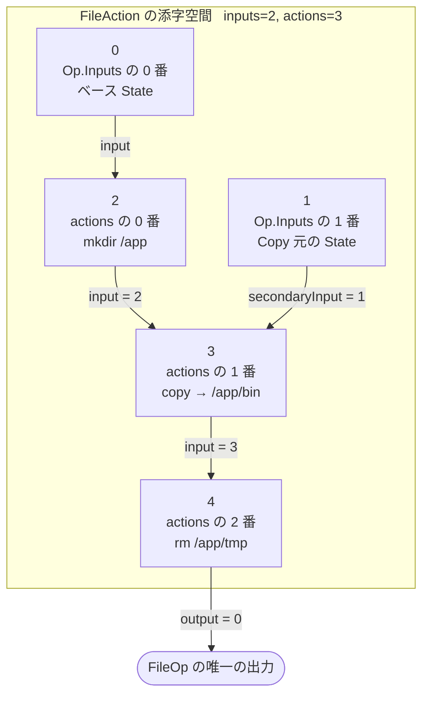

## 何を学んだか

`FileOp` は 1 つの LLB 頂点だが、その中に `FileAction` の列が入る。そして各アクションは「どの入力の上で動くか」を添字で指すのだが、その添字は **Op の入力配列と、同じ FileOp 内の先行アクションの出力を、1 本の番号空間で表している**。境界は `len(inputs)` で、それ未満なら Op の入力、それ以上なら `actions[idx - len(inputs)]` の出力だ。

つまり FileOp は「頂点の中に DAG がある」構造をしている。LLB 全体の DAG が Op と `Input.digest` で表されるのに対し、こちらは相対添字で表される。ループの検出も daemon 側で別途行われる。

## FileOp と FileAction

```proto title="solver/pb/ops.proto"
message FileOp {
	repeated FileAction actions = 2;
}

message FileAction {
	int64 input = 1; // could be real input or target (target index + max input index)
	int64 secondaryInput = 2; // --//--
	int64 output = 3;
	oneof action {
		// FileActionCopy copies files from secondaryInput on top of input
		FileActionCopy copy = 4;
		// FileActionMkFile creates a new file
		FileActionMkFile mkfile = 5;
		// FileActionMkDir creates a new directory
		FileActionMkDir mkdir = 6;
		// FileActionRm removes a file
		FileActionRm rm = 7;
		// FileActionSymlink creates a symlink
		FileActionSymlink symlink = 8;
	}
}
```

([solver/pb/ops.proto L320-341](https://github.com/moby/buildkit/blob/ca4838f8ddbd3612bca94bcb8a938d8a326110a3/solver/pb/ops.proto#L320-L341))

`// could be real input or target (target index + max input index)` という 1 行のコメントが、この設計の全部を言っている。

`input` は「このアクションが書き込む先のファイルシステム」、`secondaryInput` は Copy のときだけ意味を持ち「コピー元のファイルシステム」だ。`output` は `-1` (`SkipOutput`) か、この頂点の何番目の出力になるかを指す。

## クライアント側 — FileAction の鎖

`llb.Mkdir(...)` などは `*FileAction` を返し、そのメソッドを呼ぶと新しい `FileAction` が前を指す形で積まれる。

```go title="client/llb/fileop.go"
type FileAction struct {
	state  *State
	prev   *FileAction
	action subAction
	err    error
}

func (fa *FileAction) Mkdir(p string, m os.FileMode, opt ...MkdirOption) *FileAction {
	a := Mkdir(p, m, opt...)
	a.prev = fa
	return a
}
```

([client/llb/fileop.go L69-80](https://github.com/moby/buildkit/blob/ca4838f8ddbd3612bca94bcb8a938d8a326110a3/client/llb/fileop.go#L69-L80))

`State` と同じ「不変な連結リストを後ろに伸ばす」形だ ([State API](../state-api/))。ただし `FileAction` の場合は `prev` が「時系列の 1 つ前」であり、そのまま**先行アクションの出力に依存する**ことを意味する。

`State.File(a)` に渡された時点で、鎖全体がベース State に束縛される。

```go title="client/llb/fileop.go"
func (fa *FileAction) bind(s State) *FileAction {
	if fa == nil {
		return nil
	}
	fa2 := *fa
	fa2.prev = fa.prev.bind(s)
	fa2.state = &s
	return &fa2
}
```

([client/llb/fileop.go L138-146](https://github.com/moby/buildkit/blob/ca4838f8ddbd3612bca94bcb8a938d8a326110a3/client/llb/fileop.go#L138-L146))

鎖のコピーを作りながら全ノードに `state` を設定している。元の `FileAction` を書き換えないので、同じ `Mkdir(...)` の値を 2 つの State に対して使い回せる。

## marshalState — 添字を決める場所

marshal は `marshalState` に入力とアクションを溜めていく。

```go title="client/llb/fileop.go"
type marshalState struct {
	ctx     context.Context
	visited map[*FileAction]*fileActionState
	inputs  []*pb.Input
	actions []*fileActionState
}

type fileActionState struct {
	base           pb.InputIndex
	input          pb.InputIndex
	inputRelative  *int
	input2         pb.InputIndex
	input2Relative *int
	target         int
	action         subAction
	fa             *FileAction
}
```

([client/llb/fileop.go L712-735](https://github.com/moby/buildkit/blob/ca4838f8ddbd3612bca94bcb8a938d8a326110a3/client/llb/fileop.go#L712-L735))

`input` (絶対の入力番号) と `inputRelative` (先行アクションの番号へのポインタ) が別々のフィールドになっている。どちらが埋まるかで、最終的な添字が入力空間かアクション空間かが決まる。

```go title="client/llb/fileop.go"
	st := &fileActionState{
		action: fa.action,
		input:  -1,
		input2: -1,
		base:   -1,
		fa:     fa,
	}

	if source := fa.state.Output(); source != nil {
		inp, err := ms.addInput(c, source)
		if err != nil {
			return nil, err
		}
		st.base = inp
	}

	if fa.prev == nil {
		st.input = st.base
	} else {
		st.inputRelative = &prevState.target
	}
```

([client/llb/fileop.go L770-790](https://github.com/moby/buildkit/blob/ca4838f8ddbd3612bca94bcb8a938d8a326110a3/client/llb/fileop.go#L770-L790))

鎖の先頭 (`fa.prev == nil`) だけがベース State を直接の入力に取り、それ以外は前のアクションの出力に乗る。`prevState.target` はポインタで持たれている — `target` は `ms.actions` に追加される時点で確定するので、参照を持っておいて後から読む形になっている。

Copy の `secondaryInput` は 2 通りに分岐する。

```go title="client/llb/fileop.go"
	if a, ok := fa.action.(*fileActionCopy); ok {
		if a.state != nil {
			if out := a.state.Output(); out != nil {
				inp, err := ms.addInput(c, out)
				// ...
				st.input2 = inp
			}
		} else if a.fas != nil {
			src, err := ms.add(a.fas.FileAction, c)
			// ...
			st.input2Relative = &src.target
		} else {
			return nil, errors.New("invalid empty source for copy")
		}
	}

	st.target = len(ms.actions)

	ms.visited[fa] = st
	ms.actions = append(ms.actions, st)
```

([client/llb/fileop.go L792-817](https://github.com/moby/buildkit/blob/ca4838f8ddbd3612bca94bcb8a938d8a326110a3/client/llb/fileop.go#L792-L817))

`llb.Copy(someState, ...)` なら別の頂点が入力になる。`llb.Copy(otherAction.WithState(s), ...)` なら、そのアクション鎖も同じ FileOp の中に取り込まれ (`ms.add` の再帰)、相対添字で参照される。ここで**アクションの並びが線形の列ではなく DAG になる**。1 つのアクションの出力を 2 つのアクションが参照できるからだ (`ms.visited` が同じ `*FileAction` を 1 回しか登録しない)。

## 添字の合成は 1 行

絶対と相対を 1 本の番号にするのは、この関数だけだ。

```go title="client/llb/fileop.go"
func getIndex(input pb.InputIndex, len int, relative *int) int64 {
	if relative != nil {
		return int64(len + *relative)
	}
	return int64(input)
}
```

([client/llb/fileop.go L924-929](https://github.com/moby/buildkit/blob/ca4838f8ddbd3612bca94bcb8a938d8a326110a3/client/llb/fileop.go#L924-L929))

そして最後に `pb.FileAction` を組み立てる。

```go title="client/llb/fileop.go"
	for i, st := range state.actions {
		output := pb.SkipOutput
		if i+1 == len(state.actions) {
			output = 0
		}
		// ...
		action, err := st.action.toProtoAction(ctx, parent, st.base)
		// ...
		pfo.Actions = append(pfo.Actions, &pb.FileAction{
			Input:          getIndex(st.input, len(state.inputs), st.inputRelative),
			SecondaryInput: getIndex(st.input2, len(state.inputs), st.input2Relative),
			Output:         int64(output),
			Action:         action,
		})
	}
```

([client/llb/fileop.go L863-888](https://github.com/moby/buildkit/blob/ca4838f8ddbd3612bca94bcb8a938d8a326110a3/client/llb/fileop.go#L863-L888))

出力を持つのは**最後のアクションだけ**だ。`FileOp` は常に出力を 1 本しか持たない。`NewFileOp` が `getIndex` として定数 0 を返す関数を置いているのはそのためだ ([client/llb/fileop.go L44-46](https://github.com/moby/buildkit/blob/ca4838f8ddbd3612bca94bcb8a938d8a326110a3/client/llb/fileop.go#L44-L46))。proto 上は複数出力を表現できるが、Go クライアントは使っていない。ファイル冒頭のコメントは、将来的に複数出力にしたい意図をコード例で残している ([client/llb/fileop.go L29-34](https://github.com/moby/buildkit/blob/ca4838f8ddbd3612bca94bcb8a938d8a326110a3/client/llb/fileop.go#L29-L34))。



## base が使われるもう 1 つの場所 — chown by name

`st.base` は `toProtoAction` に渡される。`Mkdir` や `Rm` は相対パスの解決にしか使わないが、`ChownOpt` はここを使って**ユーザ名を解決するファイルシステム**を指す。

```go title="client/llb/fileop.go"
func (up *UserOpt) marshal(base pb.InputIndex) *pb.UserOpt {
	if up == nil {
		return nil
	}
	if up.Name != "" {
		return &pb.UserOpt{User: &pb.UserOpt_ByName{ByName: &pb.NamedUserOpt{
			Name: up.Name, Input: int64(base),
		}}}
	}
	return &pb.UserOpt{User: &pb.UserOpt_ByID{ByID: uint32(up.UID)}}
}
```

([client/llb/fileop.go L320-330](https://github.com/moby/buildkit/blob/ca4838f8ddbd3612bca94bcb8a938d8a326110a3/client/llb/fileop.go#L320-L330))

`COPY --chown=nginx:nginx` は、数値 UID ではなく名前なので `/etc/passwd` を読まないと解決できない。どのファイルシステムの `/etc/passwd` かを指すのが `NamedUserOpt.input` で、値はそのアクションのベース State の入力番号だ。UID 指定なら参照は要らないので `ByID` になる。同じ「オーナー指定」でも、名前か数値かで依存グラフが変わる。

## daemon 側 — 添字を解いて DAG を歩く

`FileOpSolver.Solve` は、まず全アクションの添字を検証する。

```go title="solver/llbsolver/ops/file.go"
	for i, a := range actions {
		if int(a.Input) < -1 || int(a.Input) >= len(inputs)+len(actions) {
			return nil, errors.Errorf("invalid input index %d, %d provided", a.Input, len(inputs)+len(actions))
		}
		if int(a.SecondaryInput) < -1 || int(a.SecondaryInput) >= len(inputs)+len(actions) {
			return nil, errors.Errorf("invalid secondary input index %d, %d provided", a.Input, len(inputs))
		}
		// ...
		if a.Output != -1 {
			if _, ok := s.outs[int(a.Output)]; ok {
				return nil, errors.Errorf("duplicate output %d", a.Output)
			}
			idx := len(inputs) + i
			s.outs[int(a.Output)] = idx
			s.ins[idx] = input{requiresCommit: true}
		}
	}
```

([solver/llbsolver/ops/file.go L332-361](https://github.com/moby/buildkit/blob/ca4838f8ddbd3612bca94bcb8a938d8a326110a3/solver/llbsolver/ops/file.go#L332-L361))

`idx := len(inputs) + i` が、クライアント側の `getIndex` と対になる変換だ。上限は `len(inputs)+len(actions)` — アクションが自分より後ろのアクションを指すことも、この検証だけでは弾けない。前方参照はループを作りうるので、別途チェックが要る。

```go title="solver/llbsolver/ops/file.go"
func (s *FileOpSolver) validate(idx int, inputs []fileoptypes.Ref, actions []*pb.FileAction, loaded []int) error {
	if slices.Contains(loaded, idx) {
		return errors.Errorf("loop from index %d", idx)
	}
	if idx < len(inputs) {
		return nil
	}
	loaded = append(loaded, idx)
	action := actions[idx-len(inputs)]
	for _, inp := range []int{int(action.Input), int(action.SecondaryInput)} {
		if err := s.validate(inp, inputs, actions, loaded); err != nil {
			return err
		}
	}
	return nil
}
```

([solver/llbsolver/ops/file.go L412-427](https://github.com/moby/buildkit/blob/ca4838f8ddbd3612bca94bcb8a938d8a326110a3/solver/llbsolver/ops/file.go#L412-L427))

`idx < len(inputs)` が再帰の停止条件だ。入力空間に落ちたら葉なので終わり。アクション空間にいる間は `Input` と `SecondaryInput` を辿り続け、経路上に同じ添字が 2 度現れたらループとして拒否する。

LLB 全体の DAG では、`Input.digest` が内容ハッシュなのでループは構造的に作れない (自分の digest を含む Op の digest は計算できない)。FileOp の内側の添字にはその保護がないので、明示的なループ検出が要る。**同じ「DAG」でも、ID の作り方によって保証の強さが違う**という対比になっている。

解決自体は `flightcontrol` でメモ化した再帰だ。

```go title="solver/llbsolver/ops/file.go"
func (s *FileOpSolver) getInput(ctx context.Context, idx int, inputs []fileoptypes.Ref, actions []*pb.FileAction, g session.Group) (input, error) {
	return s.g.Do(ctx, fmt.Sprintf("inp-%d", idx), func(ctx context.Context) (_ input, err error) {
```

([solver/llbsolver/ops/file.go L429-430](https://github.com/moby/buildkit/blob/ca4838f8ddbd3612bca94bcb8a938d8a326110a3/solver/llbsolver/ops/file.go#L429-L430))

添字ごとに 1 回だけ実行され、複数のアクションが同じ添字を参照しても結果は共有される。`Input` と `SecondaryInput` の両方がある Copy では、2 つを `errgroup` で並行に取りに行く ([solver/llbsolver/ops/file.go L571-576](https://github.com/moby/buildkit/blob/ca4838f8ddbd3612bca94bcb8a938d8a326110a3/solver/llbsolver/ops/file.go#L571-L576))。

## つまずきどころ — 空のスライスを回す cap 収集

`FileOp.Marshal` の先頭には、アクションから apicaps を集めるループがある。

```go title="client/llb/fileop.go"
	state := newMarshalState(ctx)
	for _, st := range state.actions {
		if adder, isCapAdder := st.action.(capAdder); isCapAdder {
			adder.addCaps(f)
		}
	}

	pop, md := MarshalConstraints(c, &f.constraints)
	// ...
	_, err := state.add(f.action, c)
```

([client/llb/fileop.go L844-857](https://github.com/moby/buildkit/blob/ca4838f8ddbd3612bca94bcb8a938d8a326110a3/client/llb/fileop.go#L844-L857))

`state.actions` が埋まるのは `state.add(f.action, c)` — ループの**後**だ。生成直後の `marshalState` の `actions` は空なので、このループは 1 回も回らない。`fileActionCopy.addCaps` が宣言するはずの `CapFileCopyIncludeExcludePatterns`・`CapFileCopyRequiredPaths`・`CapFileCopyAlwaysReplaceExistingDestPaths`・`CapFileCopyModeStringFormat` は、Go クライアント経由では `OpMetadata.caps` に載っていないことになる。

これが実害になりにくいのは、cap の申告が主に「古い daemon に新しい機能を投げたときに、意味不明な結果ではなく明確なエラーを返す」ためのものだからだ ([apicaps](../apicaps/))。申告しなければ `WithValidateCaps` のチェックを素通りし、古い daemon はフィールドを unknown field として無視する。ちなみに `fileActionCopy.addCaps` は `a.info.Mode.ModeStr` を nil チェックなしで読んでいるので、仮にこのループが動いたら `llb.Copy` に chmod を指定しない通常のケースで nil 参照になる。ループが死んでいることを前提に、その先が書かれている。

## なぜそうなっているか

FileOp が「1 頂点にアクションの列を詰め込む」形になっているのは、**ファイル操作 1 つを 1 頂点にすると頂点が爆発するから**だ。Dockerfile の `COPY --chown=x:y a b` は、実際には mkdir + copy + chown 相当の複数の操作に分解される。これを個別の頂点にすると、そのたびにスナップショットのコミット、キャッシュキーの計算、キャッシュデータベースへの問い合わせが走る。solver の 1 頂点あたりのコストは小さくないので、まとめたほうが速い。

一方で「まとめる」と、中間結果を再利用できなくなる。そこで添字空間を作って、アクション間の依存を明示できるようにしている。`Copy(a.WithState(...), ...)` のように 2 つのアクション鎖を合流させれば、共通のアクションは 1 回しか実行されない。1 頂点の中に、小さいがちゃんとした DAG がある。

添字を「入力空間 + アクション空間」の 1 本にしたのは、`FileAction.input` を 1 つの int64 で表すためだ。`oneof { int64 input; int64 actionRef; }` にすれば型で区別できたが、proto のフィールドが増えるうえ、daemon 側の分岐も増える。`len(inputs)` を境界にすれば、比較 1 回で分岐でき、境界の計算はどちらの側でも同じ式になる。読みにくさをコメント 1 行 (`could be real input or target`) で引き受けている。

## どう活かすか

**粒度は「表現の単位」と「実行の単位」で別々に決めてよい。** LLB の頂点はスケジューリングとキャッシュの単位であり、ユーザが書く操作の単位とは違う。両者を一致させると、細かい操作が多い領域で頂点が爆発する。「頂点の中にもう 1 段の DAG を持つ」のは、この不一致を吸収する手だ。ただし内側の DAG には外側のインフラ (キャッシュ・進捗・エラー位置) が効かないので、どこまで内側に入れるかは意識的に決める必要がある。

**添字空間を合成するなら、境界を 1 か所の式にする。** `len(inputs)` を境界にするなら、書く側の `getIndex` と読む側の `idx - len(inputs)` が対になっていることが一目で分かる形にしておく。BuildKit はどちらも 3 行以内の関数に閉じている。境界の計算があちこちに散ると、オフバイワンが必ず入る。

**ID の作り方が保証の強さを決める。** 内容ハッシュを ID にした外側の DAG はループを表現できないが、整数添字にした内側の DAG は表現できてしまう。だから内側にだけループ検出が要る。表現力を上げると検証が増える、という交換をどこで受け入れているかを意識しておくとよい。

**「1 行のコメントで済ませる」判断もある。** `could be real input or target (target index + max input index)` は、この設計の全体を説明する唯一の文書だ。フィールドを分けるコストと、コメント 1 行で済ませるコストを比べて後者を取っている。ただしその代償として、この添字空間を誤解した実装は静かに壊れる。proto のコメントは、実装者が最初に読む場所に置いておく価値がある。
