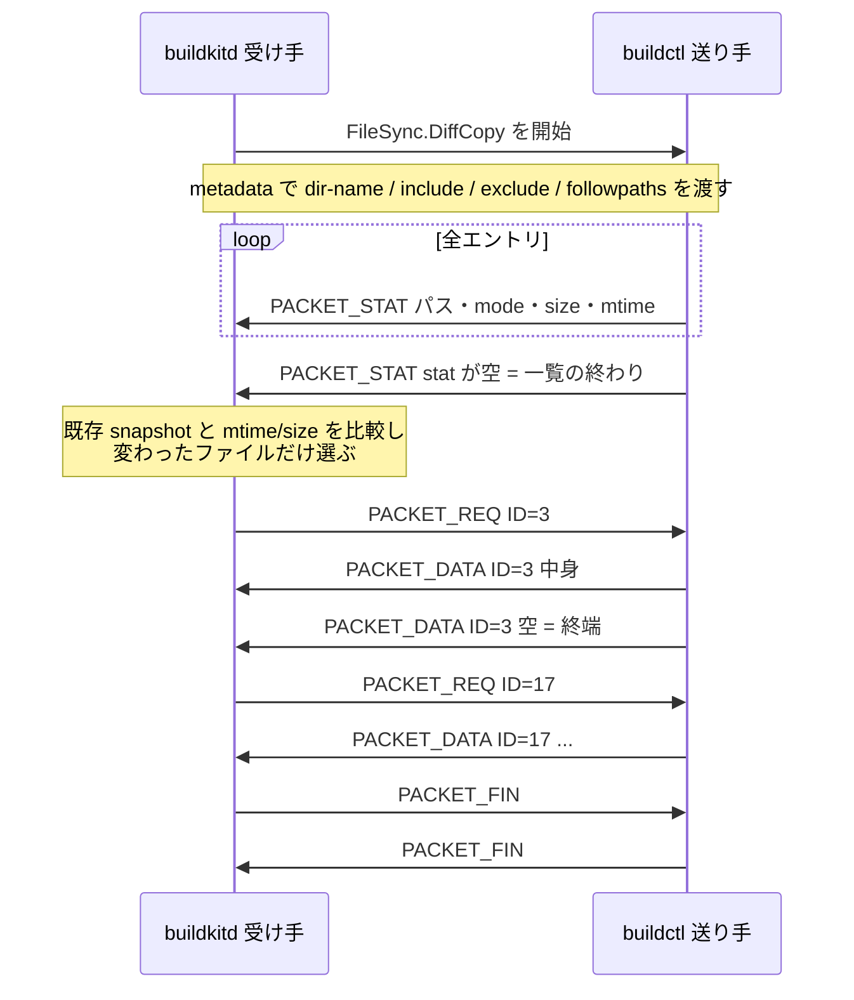

## 何を学んだか

`docker build .` の `.` をデーモンに渡す部分は、素朴には「tar に固めて送る」だ。BuildKit はそうしない。セッションの上に張った `FileSync` サービスで、**送り手がまず全ファイルの `Stat` だけを流し、受け手が中身の要らないファイルを飛ばす**。2 回目以降のビルドでは、変更されたファイルの中身しか線を通らない。

方向は 2 つある。クライアント → デーモン (コンテキストの送信) が `FileSync` サービス、デーモン → クライアント (`--output type=local` などの書き戻し) が `FileSend` サービスで、proto レベルで別サービスとして定義されている。

## ソースコードのどこか

### 2 つのサービス、2 つの方向

```proto title="session/filesync/filesync.proto"
// FileSync exposes local files from the client to the server.
service FileSync{
	rpc DiffCopy(stream fsutil.types.Packet) returns (stream fsutil.types.Packet);
	rpc TarStream(stream fsutil.types.Packet) returns (stream fsutil.types.Packet);
}

// FileSend allows sending files from the server back to the client.
service FileSend{
	rpc DiffCopy(stream BytesMessage) returns (stream BytesMessage);
}
```

([session/filesync/filesync.proto L9](https://github.com/moby/buildkit/blob/ca4838f8ddbd3612bca94bcb8a938d8a326110a3/session/filesync/filesync.proto#L9))

どちらのサービスもクライアント側の gRPC サーバに登録される。デーモンから見れば `DiffCopy` を呼ぶのは常に自分の側で、コンテキストを取りに行くのも成果物を返すのも「デーモンがクライアントの RPC を呼ぶ」形になる ([1 本の接続を逆走させる](../grpchijack/))。

なお `FileSync` サービスには `TarStream` メソッドが定義されハンドラも存在するが、実際に選ばれるプロトコルの表には入っていない。

```go title="session/filesync/filesync.go"
var supportedProtocols = []protocol{
	{
		name:   "diffcopy",
		sendFn: sendDiffCopy,
		recvFn: recvDiffCopy,
	},
}
```

([session/filesync/filesync.go L153](https://github.com/moby/buildkit/blob/ca4838f8ddbd3612bca94bcb8a938d8a326110a3/session/filesync/filesync.go#L153))

`fsSyncProvider.handle("tarstream", stream)` はこの表を引いて見つからず、`failed to negotiate protocol` を返す。tar 転送は互換性のために proto に残っているだけで、現行の経路は `diffcopy` 一択だ。

### 5 種類のパケットしかない

転送そのものは fsutil ライブラリのプロトコルで、パケットは 5 種類に尽きる。

```proto title="vendor/github.com/tonistiigi/fsutil/types/wire.proto"
message Packet {
  option (vtproto.mempool) = true;
  enum PacketType {
    PACKET_STAT = 0;
    PACKET_REQ = 1;
    PACKET_DATA = 2;
    PACKET_FIN = 3;
    PACKET_ERR = 4;
  }
  PacketType type = 1;
  Stat stat = 2;
  uint32 ID = 3;
  bytes data = 4;
}
```

([vendor/github.com/tonistiigi/fsutil/types/wire.proto L10](https://github.com/moby/buildkit/blob/ca4838f8ddbd3612bca94bcb8a938d8a326110a3/vendor/github.com/tonistiigi/fsutil/types/wire.proto#L10))

### 番号は「walk の順番」で暗黙に決まる

プロトコルの肝は `PACKET_REQ` の `ID` だ。この ID はパスでもハッシュでもなく、**送り手が walk した順番の連番**で、両端が独立に同じ数え方をすることで一致する。

送り手:

```go title="vendor/github.com/tonistiigi/fsutil/send.go"
func (s *sender) walk(ctx context.Context) error {
	var i uint32 = 0
	// ...
		p := &types.Packet{
			Type: types.PACKET_STAT,
			Stat: stat,
		}
		if fileCanRequestData(os.FileMode(stat.Mode)) {
			s.mu.Lock()
			s.files[i] = stat.Path
			s.mu.Unlock()
		}
		i++
		s.updateProgress(p.Size(), false)
		return errors.Wrapf(s.conn.SendMsg(p), "failed to send stat %s", path)
```

([vendor/github.com/tonistiigi/fsutil/send.go L149](https://github.com/moby/buildkit/blob/ca4838f8ddbd3612bca94bcb8a938d8a326110a3/vendor/github.com/tonistiigi/fsutil/send.go#L149))

受け手:

```go title="vendor/github.com/tonistiigi/fsutil/receive.go"
				if !metaOnly && fileCanRequestData(os.FileMode(p.Stat.Mode)) {
					r.mu.Lock()
					r.files[p.Stat.Path] = i
					r.mu.Unlock()
				}
				i++
```

([vendor/github.com/tonistiigi/fsutil/receive.go L286](https://github.com/moby/buildkit/blob/ca4838f8ddbd3612bca94bcb8a938d8a326110a3/vendor/github.com/tonistiigi/fsutil/receive.go#L286))

送り手は `i → パス`、受け手は `パス → i` の逆向きの表を作る。カウンタの進み方を揃えるために、増やす条件は共通の関数に切り出されていて、そこにはこう書いてある。

```go title="vendor/github.com/tonistiigi/fsutil/send.go"
func fileCanRequestData(m os.FileMode) bool {
	// avoid updating this function as it needs to match between sender/receiver.
	// version if needed
	return m&os.ModeType == 0
}
```

([vendor/github.com/tonistiigi/fsutil/send.go L185](https://github.com/moby/buildkit/blob/ca4838f8ddbd3612bca94bcb8a938d8a326110a3/vendor/github.com/tonistiigi/fsutil/send.go#L185))

「この関数を変えるな、変えるならバージョンを切れ」— 番号が暗黙の合意である以上、両端の実装が 1 ビットでもずれると別のファイルを転送する。パスを毎回送らずに済ませた代償が、この結合だ。

要求と応答は素直だ。受け手が中身を欲しくなったら `PACKET_REQ` を投げ:

```go title="vendor/github.com/tonistiigi/fsutil/receive.go"
	if err := r.conn.SendMsg(&types.Packet{Type: types.PACKET_REQ, ID: id}); err != nil {
```

送り手はキューに積んで `PACKET_DATA` を流し、最後に空の `PACKET_DATA` で終端を示す ([send.go L136](https://github.com/moby/buildkit/blob/ca4838f8ddbd3612bca94bcb8a938d8a326110a3/vendor/github.com/tonistiigi/fsutil/send.go#L136))。受け手がすべて書き終えたら `PACKET_FIN` を送り、送り手も `PACKET_FIN` を返して終わる。



差分判定は `fsutil.ReceiveOpt.Differ` で切り替わり、local ソースは LLB の属性から `DiffMetadata` (mtime とサイズで比較) か `DiffNone` (全部要求) を選ぶ ([source/local/source.go L85](https://github.com/moby/buildkit/blob/ca4838f8ddbd3612bca94bcb8a938d8a326110a3/source/local/source.go#L85))。

### フィルタは metadata で渡り、送り手側で適用される

除外パターンをどちらの端で評価するかは重要な選択で、BuildKit は**送り手 (クライアント) 側**に置いている。

呼ぶ側:

```go title="session/filesync/filesync.go"
	if opt.IncludePatterns != nil {
		opts[keyIncludePatterns] = opt.IncludePatterns
	}

	if opt.ExcludePatterns != nil {
		opts[keyExcludePatterns] = opt.ExcludePatterns
	}

	if opt.FollowPaths != nil {
		opts[keyFollowPaths] = opt.FollowPaths
	}

	opts[keyDirName] = []string{opt.Name}
```

([session/filesync/filesync.go L198](https://github.com/moby/buildkit/blob/ca4838f8ddbd3612bca94bcb8a938d8a326110a3/session/filesync/filesync.go#L198))

受ける側:

```go title="session/filesync/filesync.go"
	dir, ok := sp.dirs.LookupDir(dirName)
	if !ok {
		return InvalidSessionError{status.Errorf(codes.NotFound, "no access allowed to dir %q", dirName)}
	}
	dir, err := fsutil.NewFilterFS(dir, &fsutil.FilterOpt{
		ExcludePatterns: excludes,
		IncludePatterns: includes,
		FollowPaths:     followPaths,
	})
```

([session/filesync/filesync.go L106](https://github.com/moby/buildkit/blob/ca4838f8ddbd3612bca94bcb8a938d8a326110a3/session/filesync/filesync.go#L106))

- `ExcludePatterns` は `.dockerignore` に相当する。除外されたファイルは `PACKET_STAT` すら流れない。
- `IncludePatterns` は `COPY src/ /app` の `src/` に相当する。デーモンは COPY の対象ディレクトリだけを要求できる。
- `FollowPaths` は「このパスに至るシンボリックリンクを辿って、リンク先も含めろ」という指示。`COPY` のソースがシンボリックリンクだったときにリンク先が欠落しないためのもので、パターンではなく具体的なパスの列だ。

3 つとも gRPC metadata (= HTTP/2 ヘッダ) で渡るので、非 ASCII のファイル名が入ると壊れる。そのため `encodeOpts` / `decodeOpts` が挟まっていて、非 ASCII が含まれるときだけ `url.QueryEscape` し、`<key>-encoded: 1` を添える。

```go title="session/filesync/filesync.go"
// encodeStringForHeader encodes a string value so it can be used in grpc header. This encoding
// is backwards compatible and avoids encoding ASCII characters.
func encodeStringForHeader(inputs []string) ([]string, bool) {
```

([session/filesync/filesync.go L506](https://github.com/moby/buildkit/blob/ca4838f8ddbd3612bca94bcb8a938d8a326110a3/session/filesync/filesync.go#L506))

「後方互換であること」がコメントで明示されている。常にエスケープすると、古いデーモンが `%20` を含むファイル名として解釈してしまう。

### 転送しながらキャッシュキーを計算する

`recvDiffCopy` に `CacheUpdater` が渡っている点が、BuildKit 固有の工夫だ。

```go title="session/filesync/diffcopy.go"
	var cf fsutil.ChangeFunc
	var ch fsutil.ContentHasher
	if cu != nil {
		cu.MarkSupported(true)
		cf = cu.HandleChange
		ch = cu.ContentHasher()
	}
	// ...
	return errors.WithStack(fsutil.Receive(ds.Context(), ds, dest, fsutil.ReceiveOpt{
		NotifyHashed:  cf,
		ContentHasher: ch,
		ProgressCb:    progress,
		Filter:        fsutil.FilterFunc(filter),
		Differ:        differ,
		MetadataOnly:  metadataOnlyFilter,
	}))
```

([session/filesync/diffcopy.go L85](https://github.com/moby/buildkit/blob/ca4838f8ddbd3612bca94bcb8a938d8a326110a3/session/filesync/diffcopy.go#L85))

```go title="session/filesync/filesync.go"
// CacheUpdater is an object capable of sending notifications for the cache hash changes
type CacheUpdater interface {
	MarkSupported(bool)
	HandleChange(fsutil.ChangeKind, string, os.FileInfo, error) error
	ContentHasher() fsutil.ContentHasher
}
```

([session/filesync/filesync.go L176](https://github.com/moby/buildkit/blob/ca4838f8ddbd3612bca94bcb8a938d8a326110a3/session/filesync/filesync.go#L176))

[local ソース](../local-source/) はここに contenthash の `CacheContext` を差し込む ([source/local/source.go L275](https://github.com/moby/buildkit/blob/ca4838f8ddbd3612bca94bcb8a938d8a326110a3/source/local/source.go#L275))。転送で変わったファイルだけが `HandleChange` に通知され、contenthash 側は既存の基数木の該当ノードだけを無効化する。転送し終わったときには、COPY のキャッシュキー計算に使う木も更新済みになっている ([contenthash の増分更新](../contenthash-incremental/))。

「転送」と「ハッシュ計算」を別パスにすると木全体を走査し直すことになるが、差分転送のイベントをそのまま増分更新のイベントに使えば、走査は 1 回で済む。

### 逆方向 — 出力の書き戻し

`--output type=local,dest=./out` の側は `FileSend` を使う。デーモンが `CopyToCaller` でクライアントの `DiffCopy` を呼び、今度は**デーモンが送り手**になる。

```go title="session/filesync/filesync.go"
func CopyToCaller(ctx context.Context, fs fsutil.FS, id int, c session.Caller, progress func(int, bool), copyOpts ...CopyToCallerOpt) error {
	method := session.MethodURL(FileSend_ServiceDesc.ServiceName, "diffcopy")
	if !c.Supports(method) {
		return errors.Errorf("method %s not supported by the client", method)
	}
	// ...
	opts[keyExporterID] = []string{fmt.Sprint(id)}
	ctx = metadata.NewOutgoingContext(ctx, opts)

	cc, err := client.DiffCopy(ctx)
	// ...
	return sendDiffCopy(cc, fs, progress)
}
```

([session/filesync/filesync.go L395](https://github.com/moby/buildkit/blob/ca4838f8ddbd3612bca94bcb8a938d8a326110a3/session/filesync/filesync.go#L395))

`FileSend` サービスは 1 つしかないのに、`--output` は複数指定できる。そこで `buildkit-attachable-exporter-id` という metadata に整数を載せ、クライアント側の `SyncTarget` が転送先を選ぶ。

```go title="session/filesync/filesync.go"
func (sp *SyncTarget) chooser(ctx context.Context) int {
	md, ok := metadata.FromIncomingContext(ctx)
	if !ok {
		return 0
	}
	values := md[keyExporterID]
	// ...
}

func (sp *SyncTarget) DiffCopy(stream FileSend_DiffCopyServer) (err error) {
	id := sp.chooser(stream.Context())
	if target, ok := sp.outdirs[id]; ok {
		// ...
		return syncTargetDiffCopy(stream, target.outdir, target.deleteMode)
	}
	f, ok := sp.fs[id]
	if !ok {
		return errors.Errorf("exporter %d not found", id)
	}
```

([session/filesync/filesync.go L327](https://github.com/moby/buildkit/blob/ca4838f8ddbd3612bca94bcb8a938d8a326110a3/session/filesync/filesync.go#L327))

行き先が 2 種類あることに注意したい。`outdirs` はディレクトリへの展開 (`WithFSSyncDir`)、`fs` は 1 本のストリームをファイルに書く (`WithFSSync`) — tar や OCI アーカイブの出力だ。後者は `writeTargetFile` が `BytesMessage` を順に `io.WriteCloser` へ流すだけで、fsutil のプロトコルは使わない。だから `FileSend.DiffCopy` の proto 上の型が `Packet` ではなく `BytesMessage` になっている。

書き戻し側の `mode=delete` には注意点がある。

```go title="session/filesync/diffcopy.go"
	if deleteMode {
		opt.Merge = false
		// Request every source file so delete mode mirrors file contents without
		// relying on fsutil's path-based content comparison.
		opt.Differ = fsutil.DiffNone
	}
```

([session/filesync/diffcopy.go L138](https://github.com/moby/buildkit/blob/ca4838f8ddbd3612bca94bcb8a938d8a326110a3/session/filesync/diffcopy.go#L138))

出力先を完全にミラーするモードでは、差分判定を切って全ファイルを要求する。mtime ベースの比較を信用すると、内容が違うのに mtime が同じファイルが残ってしまうためだ。

### 4MiB の壁

gRPC のデフォルトのメッセージ上限にぶつからないよう、書き込みは分割される。

```go title="session/filesync/diffcopy.go"
func (wc *streamWriterCloser) Write(dt []byte) (int, error) {
	// grpc-go has a 4MB limit on messages by default. Split large messages
	// so we don't get close to that limit.
	const maxChunkSize = 3 * 1024 * 1024
	if len(dt) > maxChunkSize {
```

([session/filesync/diffcopy.go L44](https://github.com/moby/buildkit/blob/ca4838f8ddbd3612bca94bcb8a938d8a326110a3/session/filesync/diffcopy.go#L44))

4MiB ちょうどではなく 3MiB にしてあるのは、proto のフィールドタグやフレーミングの分の余裕を取っているからだろう。`newStreamWriter` はこれを `bufio.Writer` で包み、小さな `Write` が 1 メッセージずつ飛ぶのを防いでいる。

## なぜそうなっているか

コンテキストの転送で本当に高いのは「一覧を取ること」ではなく「中身を運ぶこと」だ。数万ファイルの `Stat` は数 MB に収まるが、中身は数 GB になりうる。だからメタデータは無条件に全部流し、中身だけを交渉の対象にする。

そして**差分を判断できるのは受け手だけ**だという事実が、プロトコルの向きを決めている。前回のビルドで何を持っているかを知っているのはデーモン側で、クライアントは自分のファイルが変わったかどうかを (デーモンの状態と比べて) 判定できない。だから「送り手が差分を計算して push する」ではなく「受け手が pull する」形になる。rsync がやっていることに近いが、比較の材料をハッシュではなく既存 snapshot との `Stat` 比較に置いた分だけ軽い。

パスではなく連番で要求するのは、`PACKET_REQ` のサイズを固定するためだ。数万ファイルのうち数千を要求する場面で、パス文字列を毎回往復させると無視できない量になる。代償として送受信の実装が walk 順に強結合するので、`fileCanRequestData` に「変えるな」とコメントが刺さっている。

除外パターンを送り手側で評価するのは、単に転送量の問題だけではない。`.dockerignore` に書いた秘密ファイルが、除外されていればデーモンには `Stat` すら渡らない。「デーモンに渡ってから捨てる」のと「そもそも渡さない」のでは、信頼境界の位置が違う ([スコープと信頼境界](../scope-and-trust/))。

## どう活かすか

- **メタデータと本体を分けて、本体の転送を交渉制にする。** 一覧は安く、中身は高い。この非対称があるなら、一覧を先に全部流して受け手に選ばせるだけで転送量が桁で変わる。
- **差分を判定できる側に主導権を渡す。** 「どちらが前回の状態を知っているか」で push か pull かが決まる。送り手が知らないことを送り手に判断させると、無駄な転送か誤ったスキップのどちらかになる。
- **暗黙の連番で識別子を圧縮するなら、その合意をコードに明記する。** `fileCanRequestData` のコメントは仕様書の代わりになっている。「両端で一致していなければならない関数」を 1 箇所に隔離し、変更禁止と明記するのは最低限の防御だ。
- **転送のイベントを、そのまま下流の増分更新に使う。** BuildKit は `CacheUpdater` を差し込むだけで、転送と contenthash の更新を 1 パスにまとめた。「変わったものの通知」は一度手に入れたら複数の消費者に配れる。
- **フィルタは信頼境界の手前で適用する。** 除外の評価を受け手に置くと、除外したはずのものが一度は相手に渡る。
