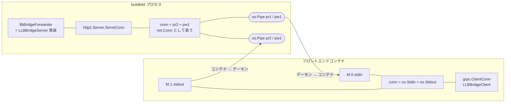

## 何を学んだか

外部フロントエンドは、デーモンから見れば「特別な環境変数を渡して起動したコンテナ」でしかない。それでもフロントエンドはビルド中に `Solve` や `ReadFile` を自由に呼べる。仕掛けは単純で、**コンテナの stdin/stdout を `net.Conn` として扱い、その 1 本のコネクションの上で HTTP/2 サーバを直接動かしている**。リスナも、ポートも、UNIX ソケットも存在しない。`net.Conn` に必要な `LocalAddr` / `SetDeadline` などは、デーモン側もコンテナ側もそれぞれダミー実装で埋めている。

役割は逆転していて、**フロントエンド (コンテナ) が gRPC クライアント、デーモンがサーバ**だ。フロントエンドは仕事を依頼される側なのに、通信では依頼する側になる。

## `gatewayFrontend.Solve` が組み立てるもの

エントリポイントは `gatewayFrontend.Solve` ([frontend/gateway/gateway.go L109](https://github.com/moby/buildkit/blob/ca4838f8ddbd3612bca94bcb8a938d8a326110a3/frontend/gateway/gateway.go#L109))。やることは順に 5 つある。

1. `opts["source"]` からフロントエンドイメージを決め、`allowedRepositories` の許可リストと照合する
2. そのイメージを普通の LLB として `llbBridge.Solve` で解き、書き込み可能な `MutableRef` を作る
3. イメージ config から entrypoint / env / cwd を取り、BuildKit 固有の環境変数を足す
4. gRPC サーバ (`llbBridgeForwarder`) をパイプの上に立てる
5. `exec.Run` でコンテナを起動し、その stdin/stdout をパイプに繋ぐ

3 の環境変数がフロントエンドへの唯一の入力チャネルだ。

```go title="frontend/gateway/gateway.go"
	args := []string{"/run"}
	// ... img.Config.Entrypoint / Env / WorkingDir があればそちらを使う
	i := 0
	for k, v := range opts {
		env = append(env, fmt.Sprintf("BUILDKIT_FRONTEND_OPT_%d", i)+"="+k+"="+v)
		i++
	}

	env = append(env, "BUILDKIT_SESSION_ID="+sid)
	// ...
	env = append(env, "BUILDKIT_WORKERS="+string(dt))
	env = append(env, "BUILDKIT_EXPORTEDPRODUCT="+apicaps.ExportedProduct)
```

([frontend/gateway/gateway.go L225-L251](https://github.com/moby/buildkit/blob/ca4838f8ddbd3612bca94bcb8a938d8a326110a3/frontend/gateway/gateway.go#L225-L251))

`opts` を `BUILDKIT_FRONTEND_OPT_<n>=<key>=<value>` という形で 1 つずつ環境変数にするのは、キーに任意の文字列 (`build-arg:FOO`、`context:base` など) が来るためだ。番号を振っておけば環境変数名の制約に引っかからない。

これに加えて、フロントエンド自身の LLB `Definition` が read-only の bind mount としてコンテナに入る。

```go title="frontend/gateway/gateway.go"
	return &executor.Mount{
			Src:      &bind{dir},
			Dest:     "/run/config/buildkit/metadata",
			Readonly: true,
		}, func() {
			os.RemoveAll(dir)
		}, nil
```

([frontend/gateway/gateway.go L315-L336](https://github.com/moby/buildkit/blob/ca4838f8ddbd3612bca94bcb8a938d8a326110a3/frontend/gateway/gateway.go#L315-L336))

中身は `frontend.bin` という 1 ファイルで、`def.MarshalVT()` の結果、つまり**自分自身がどのイメージから来たかを表す LLB** だ。フロントエンドが自分の出自を証明に載せられるようにするためのもの ([provenance](../provenance/) を参照)。

## パイプを net.Conn に見せる

通信路の実体は `os.Pipe()` 2 組だ。

```go title="frontend/gateway/gateway.go"
type pipe struct {
	Stdin  io.ReadCloser
	Stdout io.WriteCloser
	conn   net.Conn
}

func newPipe() *pipe {
	pr1, pw1, _ := os.Pipe()
	pr2, pw2, _ := os.Pipe()
	return &pipe{
		Stdin:  pr1,
		Stdout: pw2,
		conn: &conn{
			Reader: pr2,
			Writer: pw1,
			Closer: pw2,
		},
	}
}

type conn struct {
	io.Reader
	io.Writer
	io.Closer
}
```

([frontend/gateway/gateway.go L479-L503](https://github.com/moby/buildkit/blob/ca4838f8ddbd3612bca94bcb8a938d8a326110a3/frontend/gateway/gateway.go#L479-L503))

`pipe.Stdin` (= `pr1`) はコンテナの stdin に渡され、コンテナが書いたものはデーモン側の `conn.Read` (= `pr2`) から出てくる。逆にデーモンが `conn.Write` すると `pw1` を通ってコンテナの stdin に届く。この構造体は `io.Reader` / `io.Writer` / `io.Closer` を埋め込んでいるだけなので、`net.Conn` を満たすために残る 5 メソッドをダミーで足す。

```go title="frontend/gateway/gateway.go"
func (s *conn) LocalAddr() net.Addr { return dummyAddr{} }
// ...
func (s *conn) SetDeadline(t time.Time) error { return nil }
// ...
func (d dummyAddr) Network() string { return "pipe" }
func (d dummyAddr) String() string  { return "localhost" }
```

([frontend/gateway/gateway.go L505-L533](https://github.com/moby/buildkit/blob/ca4838f8ddbd3612bca94bcb8a938d8a326110a3/frontend/gateway/gateway.go#L505-L533))

タイムアウトは常に無効。パイプ相手にデッドラインを設定する意味がなく、寿命はコンテナの寿命と ctx で管理されるからだ。

## リスナのない gRPC サーバ

`grpc.Server` は普通 `Serve(net.Listener)` で使うが、ここには受け付けるべきコネクションが 1 本しかない。そこで HTTP/2 サーバを直接呼ぶ。

```go title="frontend/gateway/gateway.go"
func serve(ctx context.Context, grpcServer *grpc.Server, conn net.Conn) {
	go func() {
		<-ctx.Done()
		conn.Close()
	}()
	bklog.G(ctx).Debugf("serving grpc connection")
	(&http2.Server{}).ServeConn(conn, &http2.ServeConnOpts{Handler: grpcServer})
}
```

([frontend/gateway/gateway.go L1732-L1739](https://github.com/moby/buildkit/blob/ca4838f8ddbd3612bca94bcb8a938d8a326110a3/frontend/gateway/gateway.go#L1732-L1739))

`grpc.Server` は `http.Handler` でもあるので、`golang.org/x/net/http2` の `ServeConn` に渡せば 1 コネクション分だけ喋る。TLS もハンドシェイクもない。

サーバの登録側はこう。

```go title="frontend/gateway/gateway.go"
	server := grpc.NewServer(serverOpt...)
	grpc_health_v1.RegisterHealthServer(server, health.NewServer())
	pb.RegisterLLBBridgeServer(server, lbf)

	go func() {
		serve(ctx, server, lbf.conn)
		select {
		case <-ctx.Done():
		default:
			lbf.isErrServerClosed = true
		}
		cancel(errors.WithStack(context.Canceled))
	}()
```

([frontend/gateway/gateway.go L453-L477](https://github.com/moby/buildkit/blob/ca4838f8ddbd3612bca94bcb8a938d8a326110a3/frontend/gateway/gateway.go#L453-L477))

`isErrServerClosed` は「ctx がキャンセルされる前にサーバ側が閉じた」つまりコンテナが gRPC を張ったまま死んだ、という状況を記録するためのフラグ。あとで `frontend grpc server closed unexpectedly` という具体的なエラーに変換される。

コンテナ起動はこの 1 行。

```go title="frontend/gateway/gateway.go"
	_, err = exec.Run(ctx, "", container.MountWithSession(rootFS, session.NewGroup(sid)), mnts, executor.ProcessInfo{Meta: meta, Stdin: lbf.Stdin, Stdout: lbf.Stdout, Stderr: os.Stderr}, nil)
```

([frontend/gateway/gateway.go L296](https://github.com/moby/buildkit/blob/ca4838f8ddbd3612bca94bcb8a938d8a326110a3/frontend/gateway/gateway.go#L296))

stdout は gRPC に使われているので、**フロントエンドのログ出力先は stderr しかない**。`Stderr: os.Stderr` なので buildkitd のログに直接落ちる。フロントエンドが stdout に `fmt.Println` すると HTTP/2 のフレームが壊れる、というのがこの設計の代償だ。

## コンテナ側 — os.Stdin/os.Stdout をそのまま Conn にする

SDK 側は鏡像になっている。

```go title="frontend/gateway/grpcclient/client.go"
func grpcClientConn(ctx context.Context) (context.Context, *grpc.ClientConn, error) {
	dialOpts := []grpc.DialOption{
		grpc.WithContextDialer(func(ctx context.Context, addr string) (net.Conn, error) {
			return stdioConn(), nil
		}),
		grpc.WithTransportCredentials(insecure.NewCredentials()),
		// ...
	}

	//nolint:staticcheck // ignore SA1019 NewClient has different behavior and needs to be tested
	cc, err := grpc.DialContext(ctx, "localhost", dialOpts...)
	// ...
}

func stdioConn() net.Conn {
	return &conn{os.Stdin, os.Stdout, os.Stdout}
}
```

([frontend/gateway/grpcclient/client.go L1447-L1474](https://github.com/moby/buildkit/blob/ca4838f8ddbd3612bca94bcb8a938d8a326110a3/frontend/gateway/grpcclient/client.go#L1447-L1474))

アドレス `"localhost"` は完全に無視される。`WithContextDialer` が何を渡されても `stdioConn()` を返すからだ。`grpc.NewClient` ではなく非推奨の `DialContext` が残っているのは、`NewClient` の挙動 (接続の遅延確立とネームリゾルバの扱い) がこのダミーダイヤラで変わるためで、コメントに「テストが必要」と書かれたまま据え置かれている。

フロントエンドのバイナリが使う入口は `RunFromEnvironment` で、環境変数から `opts` / session ID / workers / product を復元し、まず `Ping` を投げてデーモンの caps を取る ([apicaps](../apicaps/))。

```go title="frontend/gateway/grpcclient/client.go"
func RunFromEnvironment(ctx context.Context, f client.BuildFunc) error {
	client, err := current()
	// ...
	return client.Run(ctx, f)
}
```

([frontend/gateway/grpcclient/client.go L103-L109](https://github.com/moby/buildkit/blob/ca4838f8ddbd3612bca94bcb8a938d8a326110a3/frontend/gateway/grpcclient/client.go#L103-L109))



## LLBBridge が公開する 17 の RPC

フロントエンドがデーモンに対してできることは、この service 定義がすべてだ。

```proto title="frontend/gateway/pb/gateway.proto"
service LLBBridge {
	// apicaps:CapResolveImage
	rpc ResolveImageConfig(ResolveImageConfigRequest) returns (ResolveImageConfigResponse);
	// apicaps:CapSourceMetaResolver
	rpc ResolveSourceMeta(ResolveSourceMetaRequest) returns (ResolveSourceMetaResponse);
	// apicaps:CapSolveBase
	rpc Solve(SolveRequest) returns (SolveResponse);
	// apicaps:CapReadFile
	rpc ReadFile(ReadFileRequest) returns (ReadFileResponse);
	// apicaps:CapReadDir
	rpc ReadDir(ReadDirRequest) returns (ReadDirResponse);
	// apicaps:CapStatFile
	rpc StatFile(StatFileRequest) returns (StatFileResponse);
	// apicaps:CapGatewayEvaluate
	rpc Evaluate(EvaluateRequest) returns (EvaluateResponse);
	rpc Ping(PingRequest) returns (PongResponse);
	rpc Return(ReturnRequest) returns (ReturnResponse);
	// apicaps:CapFrontendInputs
	rpc Inputs(InputsRequest) returns (InputsResponse);

	rpc NewContainer(NewContainerRequest) returns (NewContainerResponse);
	rpc ReleaseContainer(ReleaseContainerRequest) returns (ReleaseContainerResponse);
	rpc ExecProcess(stream ExecMessage) returns (stream ExecMessage);

	// apicaps:CapGatewayExecFilesystem
	rpc ReadFileContainer(ReadFileRequest) returns (ReadFileResponse);
	rpc ReadDirContainer(ReadDirRequest) returns (ReadDirResponse);
	rpc StatFileContainer(StatFileRequest) returns (StatFileResponse);

	// apicaps:CapGatewayWarnings
	rpc Warn(WarnRequest) returns (WarnResponse);
}
```

([frontend/gateway/pb/gateway.proto L15-L46](https://github.com/moby/buildkit/blob/ca4838f8ddbd3612bca94bcb8a938d8a326110a3/frontend/gateway/pb/gateway.proto#L15-L46))

役割で 4 つに分けられる。

- **LLB を解く**: `Solve`、`Evaluate`。返ってくるのは ref の ID であって中身ではない ([ref は不透明 ID と Definition の 2 点セット](../gateway-ref/))
- **解いた結果を覗く**: `ReadFile` / `ReadDir` / `StatFile`。`Dockerfile` の中身を読むのも、multi-stage の途中結果からファイルを 1 つ抜くのも、この 3 つ
- **メタデータを引く**: `ResolveImageConfig` / `ResolveSourceMeta` / `Inputs` / `Ping`
- **コンテナを直接動かす**: `NewContainer` / `ExecProcess` / `ReleaseContainer` と、そのコンテナのファイルを読む `*Container` 系。`buildctl` の `--invoke` 相当のデバッグシェルはこれで実装されている

そして `Return` が終端だ。フロントエンドは結果かエラーのどちらか一方を `Return` で渡し、デーモン側は `doneCh` を閉じる。

```go title="frontend/gateway/gateway.go"
func (lbf *llbBridgeForwarder) setResult(r *frontend.Result, err error) (*pb.ReturnResponse, error) {
	// ...
	if (r == nil) == (err == nil) {
		return nil, errors.New("gateway return must be either result or err")
	}

	if lbf.result != nil || lbf.err != nil {
		return nil, errors.New("gateway result is already set")
	}
	// ...
}
```

([frontend/gateway/gateway.go L397-L413](https://github.com/moby/buildkit/blob/ca4838f8ddbd3612bca94bcb8a938d8a326110a3/frontend/gateway/gateway.go#L397-L413))

`Return` を待つのではなく、`exec.Run` の戻りを待つ設計になっている点に注意。コンテナがプロセスとして終了したあとで `lbf.Result()` を読む。`Return` を呼ばずに死んだフロントエンドは `no result for incomplete build` になり、`Return` でエラーを返してから死んだフロントエンドはそのエラーが優先される。この優先順位はコード中のコメントに明記されている。

```go title="frontend/gateway/gateway.go"
		// An existing error (set via Return rpc) takes
		// precedence over this error, which in turn takes
		// precedence over a success reported via Return.
```

([frontend/gateway/gateway.go L301-L303](https://github.com/moby/buildkit/blob/ca4838f8ddbd3612bca94bcb8a938d8a326110a3/frontend/gateway/gateway.go#L301-L303))

## セッションの逆向き gRPC との違い

BuildKit にはもう 1 つ「gRPC ストリームを `net.Conn` に見立てる」実装がある。クライアントとデーモンの間のセッションだ。

```go title="session/grpchijack/dial.go"
func streamToConn(stream stream) (net.Conn, <-chan struct{}) {
	closeCh := make(chan struct{})
	c := &conn{stream: stream, buf: make([]byte, 32*1<<10), closeCh: closeCh}
	return c, closeCh
}
```

([session/grpchijack/dial.go L38-L42](https://github.com/moby/buildkit/blob/ca4838f8ddbd3612bca94bcb8a938d8a326110a3/session/grpchijack/dial.go#L38-L42))

こちらは既存の gRPC 双方向ストリーム (`controlapi.BytesMessage` を流す) を `Read` / `Write` に見せかけている。gateway が「OS のパイプ → net.Conn」なのに対し、grpchijack は「gRPC ストリーム → net.Conn」。どちらも同じ `dummyAddr` とノーオペの `SetDeadline` を持つ双子のコードで、目的も同じ — **既存の 1 本の全二重バイト列の上に、もう一段 gRPC を乗せる**。詳細は [grpchijack](../grpchijack/) を参照。

## なぜそうなっているか

フロントエンドを「デーモンに RPC できるコンテナ」にするとき、通信路の選択肢は 3 つあった。ネットワーク越しの TCP、bind mount した UNIX ソケット、そして標準入出力だ。

TCP はフロントエンドにネットワーク名前空間とアドレス解決を要求する。BuildKit はむしろフロントエンドからネットワークを取り上げたい ([フロントエンドは LABEL で自己申告し、ネットワークを持たない](../frontend-labels/))。UNIX ソケットはホスト側のパスをマウントすることになり、rootless やリモートワーカーで面倒が増える。

stdin/stdout は、**コンテナランタイムが必ず提供する唯一の通信路**だ。`executor.Executor` の `ProcessInfo` にはもともと Stdin/Stdout/Stderr があり、追加の設定項目は要らない。フロントエンド側も、コンテナイメージとして何のケーパビリティも要求しない。gRPC を HTTP/2 の生 conn に載せられるという Go の実装事情が、この選択を可能にしている。

役割が逆転している (コンテナ側がクライアント) のも自然な帰結だ。デーモンは複数のフロントエンドを並行に動かすが、フロントエンドは 1 つのデーモンとしか話さない。1 対多の側をサーバにするのが素直で、しかもフロントエンドは能動的にファイルを読んだり LLB を解いたりする — 主導権はフロントエンドにある。デーモンは呼ばれるのを待つだけでいい。

## どう活かすか

- **プラグインを別プロセス/別コンテナで動かすなら、通信路は標準入出力を第一候補にする。** ポートもソケットパスも設定項目も増えず、隔離のデフォルトが「何も繋がっていない」になる。Go なら `http2.Server.ServeConn` に 3 メソッドのラッパを渡すだけで gRPC が乗る。
- **`net.Conn` は思っているより薄いインターフェースだ。** `Read`/`Write`/`Close` の実体があれば、残り 5 つはダミーで通ることが多い。既存の全二重バイト列 (パイプ、ストリーム、WebSocket) を持っているなら、その上に成熟した RPC スタックを丸ごと載せられる。
- **stdout を通信に使うなら、ログの行き先を先に決めて明文化する。** BuildKit は stderr をデーモンのログに直結させた。この約束を破ったフロントエンドは「プロトコルエラー」という分かりにくい形で死ぬので、SDK 側で stdout への書き込みを塞ぐくらいの配慮があってもよい。
- **終了経路が 2 つある (明示的な `Return` と、プロセスの死) 場合は、優先順位をコードのコメントで固定する。** BuildKit は「Return のエラー > プロセスのエラー > Return の成功」と決めて書き残している。この順序がないと、コンテナが死んだ理由がフロントエンドの本当のエラーを覆い隠す。
