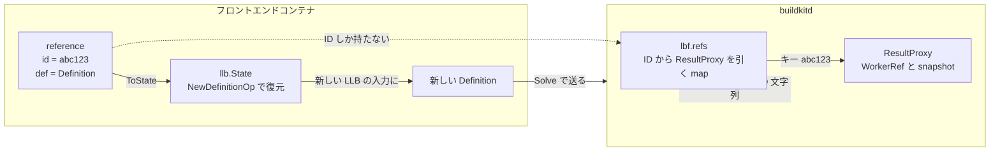

## 何を学んだか

フロントエンドが `Solve` を呼んで受け取るのは、スナップショットでもファイルツリーでもなく `Ref{id, def}` という 2 フィールドのメッセージだ。

- `id` は `identity.NewID()` で作られたランダム文字列。**デーモン側の `map[string]solver.ResultProxy` を引くためのキーでしかなく、フロントエンドから中身は見えない**
- `def` はその結果を生成した LLB の `Definition`。**これがあるおかげで、フロントエンドは受け取った ref を自分の新しい LLB の入力ノードとして繋ぎ直せる**

ハンドルだけなら「デーモンの中の何か」を指す不透明な参照で終わる。値 (DAG) だけなら「どう作るか」は分かるが「もう作ってある」ことが伝わらない。BuildKit は両方を同じメッセージに入れることで、**プロセス境界を越えて DAG を組み立て続けられる**ようにした。

## proto 上の形

```proto title="frontend/gateway/pb/gateway.proto"
message Result {
	oneof result {
		// Deprecated non-array refs.
		string refDeprecated = 1;
		RefMapDeprecated refsDeprecated = 2;

		Ref ref = 3;
		RefMap refs = 4;
	}
	map<string, bytes> metadata = 10;
	// 11 was used during development and is reserved for old attestation format
	map<string, Attestations> attestations = 12;
}

message Ref {
	string id = 1;
	pb.Definition def = 2;
}

message RefMap {
	map<string, Ref> refs = 1;
}
```

([frontend/gateway/pb/gateway.proto L48-L73](https://github.com/moby/buildkit/blob/ca4838f8ddbd3612bca94bcb8a938d8a326110a3/frontend/gateway/pb/gateway.proto#L48-L73))

`oneof` に 4 択あるのはワイヤフォーマットの歴史そのものだ。最初は `string refDeprecated` (ID の文字列 1 個) だけで、そこに「複数プラットフォーム向けに複数の ref を返したい」が加わって `RefMapDeprecated`、さらに「`Definition` も一緒に返したい」で `Ref` / `RefMap` になった。`Definition` を足すことが後方非互換なので新しいフィールドが要る、という判断が `CapProtoRefArray` の下のコメントに残っている。

```go title="frontend/gateway/pb/caps.go"
	// CapProtoRefArray is a capability to return arrays of refs instead of single
	// refs. This capability is only for the wire format change and shouldn't be
	// used in frontends for feature detection.
	CapProtoRefArray apicaps.CapID = "proto.refarray"
```

([frontend/gateway/pb/caps.go L23-L26](https://github.com/moby/buildkit/blob/ca4838f8ddbd3612bca94bcb8a938d8a326110a3/frontend/gateway/pb/caps.go#L23-L26))

「これはワイヤフォーマットの変更のためだけの cap で、機能検出に使うな」という注意書きまで付いている。詳しくは [apicaps](../apicaps/)。

## デーモン側 — ID を発行して map に置く

`Solve` RPC の応答を組み立てる部分。

```go title="frontend/gateway/gateway.go"
		ref := res.Ref
		var id string
		var def *opspb.Definition
		if ref != nil {
			id = identity.NewID()
			def = ref.Definition()
			lbf.refs[id] = ref
		}
		defaultID = id

		if req.AllowResultArrayRef {
			pbRes.Result = &pb.Result_Ref{Ref: &pb.Ref{Id: id, Def: def}}
		} else {
			pbRes.Result = &pb.Result_RefDeprecated{RefDeprecated: id}
		}
```

([frontend/gateway/gateway.go L794-L808](https://github.com/moby/buildkit/blob/ca4838f8ddbd3612bca94bcb8a938d8a326110a3/frontend/gateway/gateway.go#L794-L808))

`lbf.refs` は `map[string]solver.ResultProxy` ([frontend/gateway/gateway.go L546](https://github.com/moby/buildkit/blob/ca4838f8ddbd3612bca94bcb8a938d8a326110a3/frontend/gateway/gateway.go#L546))。`solver.ResultProxy` は「まだ解かれていないかもしれない結果への遅延参照」で、`Definition()` を持っている。ここで返される `def` は、フロントエンドが送ってきた `Definition` そのものではなく、solver が保持している「その結果を作る LLB」だ。



ファイルを読む系の RPC は、この ID で map を引く。

```go title="frontend/gateway/gateway.go"
func (lbf *llbBridgeForwarder) getImmutableRef(ctx context.Context, id string) (cache.ImmutableRef, error) {
	lbf.mu.Lock()
	ref, ok := lbf.refs[id]
	if !ok {
		if lbf.result != nil {
			if r, ok := lbf.result.FindRef(id); ok {
```

([frontend/gateway/gateway.go L865-L871](https://github.com/moby/buildkit/blob/ca4838f8ddbd3612bca94bcb8a938d8a326110a3/frontend/gateway/gateway.go#L865-L871))

`lbf.refs` に無ければ、すでに `Return` された結果の中も探す。`Return` は ref を `refs` から取り出して結果側に移すので、返したあとに読もうとした場合の救済になっている。

## フロントエンド側 — id と def を抱えるだけの構造体

```go title="frontend/gateway/grpcclient/client.go"
type reference struct {
	c   *grpcClient
	id  string
	def *opspb.Definition
}

func newReference(c *grpcClient, ref *pb.Ref) *reference {
	return &reference{c: c, id: ref.Id, def: ref.Def}
}

func (r *reference) ToState() (st llb.State, err error) {
	err = r.c.caps.Supports(pb.CapReferenceOutput)
	if err != nil {
		return st, err
	}

	if r.def == nil {
		return st, errors.New("gateway did not return reference with definition")
	}

	defop, err := llb.NewDefinitionOp(r.def)
	// ...
}
```

([frontend/gateway/grpcclient/client.go L1364-L1390](https://github.com/moby/buildkit/blob/ca4838f8ddbd3612bca94bcb8a938d8a326110a3/frontend/gateway/grpcclient/client.go#L1364-L1390))

これが `client.Reference` インターフェースの実装だ。

```go title="frontend/gateway/client/client.go"
type Reference interface {
	ToState() (llb.State, error)
	Evaluate(ctx context.Context) error
	ReadFile(ctx context.Context, req ReadRequest) ([]byte, error)
	StatFile(ctx context.Context, req StatRequest) (*fstypes.Stat, error)
	ReadDir(ctx context.Context, req ReadDirRequest) ([]*fstypes.Stat, error)
}
```

([frontend/gateway/client/client.go L106-L112](https://github.com/moby/buildkit/blob/ca4838f8ddbd3612bca94bcb8a938d8a326110a3/frontend/gateway/client/client.go#L106-L112))

**中身を取り出すメソッドが 1 つもない。** ファイルを読む 3 つは全部 RPC 経由で、返るのはバイト列と `fstypes.Stat` だけ。フロントエンドがスナップショットのパスに触れる手段は用意されていない。

`ToState` の `llb.NewDefinitionOp(r.def)` が、この設計の要だ。`Definition` から `llb.State` を復元すると、そこから先は普通の LLB として `llb.Copy` や `llb.Image(...).Run(...)` の入力に使える。フロントエンドは「他のフロントエンドが解いた結果」や「自分がさっき `Solve` した中間結果」を、あたかも最初から自分の DAG の一部だったかのように扱える。実際、Dockerfile フロントエンドの `named context` はまさにこれをやっている ([named context がステージ名を乗っ取る](../named-context/))。

ファイル系のリクエストが受け取るのも、同じ ID の文字列だけだ。

```proto title="frontend/gateway/pb/gateway.proto"
message ReadFileRequest {
	string Ref = 1;
	string FilePath = 2;
	FileRange Range = 3;
	int32 MountIndex = 4;
}
```

([frontend/gateway/pb/gateway.proto L254-L259](https://github.com/moby/buildkit/blob/ca4838f8ddbd3612bca94bcb8a938d8a326110a3/frontend/gateway/pb/gateway.proto#L254-L259))

`Ref` は文字列、つまり ID。フロントエンドは何を渡しているのか実は知らない。

## 返すとき — cloneRef が参照を 2 つに割る

`Return` で受け取った ID をそのまま結果にするのではなく、`cloneRef` を通す。

```go title="frontend/gateway/gateway.go"
func (lbf *llbBridgeForwarder) cloneRef(id string) (solver.ResultProxy, error) {
	if id == "" {
		return nil, nil
	}

	lbf.mu.Lock()
	defer lbf.mu.Unlock()

	r, ok := lbf.refs[id]
	if !ok {
		return nil, errors.Errorf("return reference %s not found", id)
	}

	s1, s2 := solver.SplitResultProxy(r)
	lbf.refs[id] = s1
	return s2, nil
}
```

([frontend/gateway/gateway.go L1714-L1730](https://github.com/moby/buildkit/blob/ca4838f8ddbd3612bca94bcb8a938d8a326110a3/frontend/gateway/gateway.go#L1714-L1730))

`SplitResultProxy` で参照を 2 本に分け、片方を `refs` に残して片方を結果として返す。`refs` に残った側は、フロントエンドの終了時に `Discard()` でまとめて解放される ([frontend/gateway/gateway.go L363-L391](https://github.com/moby/buildkit/blob/ca4838f8ddbd3612bca94bcb8a938d8a326110a3/frontend/gateway/gateway.go#L363-L391))。**フロントエンドが同じ ref を「返す」と「使い続ける」の両方をしても、参照カウントが壊れない**ようにするための分岐だ。ref の寿命管理そのものは [refCount と参照の集合](../refcount-set/) を参照。

`Return` は `oneof` の 4 パターンをすべて受けて、同じ `cloneRef` に流し込む。

```go title="frontend/gateway/gateway.go"
	switch res := in.Result.Result.(type) {
	case *pb.Result_RefDeprecated:
		ref, err := lbf.cloneRef(res.RefDeprecated)
		// ...
		r.SetRef(ref)
	// ...
	case *pb.Result_Refs:
		for k, ref := range res.Refs.Refs {
			ref, err := lbf.cloneRef(ref.Id)
			// ...
			r.AddRef(k, ref)
		}
	}
```

([frontend/gateway/gateway.go L1043-L1072](https://github.com/moby/buildkit/blob/ca4838f8ddbd3612bca94bcb8a938d8a326110a3/frontend/gateway/gateway.go#L1043-L1072))

返すときは `Ref.Def` が読まれていないことに注目したい。**行きは `id` + `def`、帰りは `id` だけ**が意味を持つ。`def` はデーモンがすでに知っているからだ。attestation の ref も同じ経路を通る ([attestation の保存](../attestation-storage/))。

## なぜそうなっているか

不透明 ID にした理由は明快で、**実体をプロセス境界の向こうに渡せないから**だ。結果の中身は cache manager が管理する snapshot であり、参照カウントと GC の対象になっている。これをコンテナに渡す方法は無いし、渡したところでフロントエンドが解放を忘れればリークする。ID なら、寿命はデーモン側の `refs` マップと `Discard()` が完全に握れる。

では、なぜ `Definition` も一緒に返すのか。ID だけで足りない場面が 2 つある。

1 つは **DAG の継続**だ。フロントエンドが `Solve` した結果を、さらに別の LLB の入力にしたいことがある。`# syntax=` で呼ばれたフロントエンドが別のフロントエンドをまた呼ぶ場合や、multi-stage で別ステージの成果物を `COPY --from` する場合。ID だけだと「デーモンの中の何か」でしかなく、LLB の頂点として表現できない。`Definition` があれば `llb.NewDefinitionOp` で頂点に戻せて、新しい DAG に繋がる。

もう 1 つは **DAG が最終的に記録に残る必要がある**ことだ。provenance は「この成果物はどの LLB から作られたか」を証明する ([provenance](../provenance/))。フロントエンドが返した結果が ID だけの参照だと、デーモンは「フロントエンドが何かを返した」以上のことを書けない。`Definition` が付いていれば、返された結果を作る DAG を再構成でき、materialize されたレイヤと DAG の対応が取れる。キャッシュのエクスポートも同じ理由で DAG を必要とする ([cache-chains](../cache-chains/))。

つまり `Ref{id, def}` は **「もう作ってある」(id) と「どう作るか」(def) を同時に運ぶ**。片方だけでは、キャッシュか継続性のどちらかが壊れる。

## どう活かすか

- **プロセス境界を越えるハンドルは、値と組にして渡すことを検討する。** ID だけを返すと、受け取った側は「それを使って何かを作る」ことしかできない。定義や仕様を添えれば、受け取った側が自分のグラフに組み込んで再構成できるようになる。逆に値だけを返すと、すでに計算済みであることが伝わらず再計算される。
- **不透明 ID の発行元は、必ずそのライフサイクルも握る。** BuildKit は `identity.NewID()` で発行し、`refs` マップで保持し、`Discard()` で一括解放する。ID を返した相手が解放を忘れても、セッションが終われば必ず回収される。「相手に解放を頼む」設計は、相手がクラッシュしうる境界では成立しない。
- **同じハンドルを「返す」と「使い続ける」が同時に起きうるなら、参照を分割する API を用意する。** `SplitResultProxy` のように、1 つの参照を 2 本の独立した参照に割る操作があると、呼び出し側は所有権の受け渡しを気にせずに済む。
- **ワイヤフォーマットに `oneof` の墓場ができるのは避けられない。** BuildKit の `Result` は 4 世代分の表現を抱えているが、フィールド番号を再利用せず、開発中に使った番号 11 を予約済みとしてコメントに残している。互換性を保ちながら進化させる代償として、この程度の見た目の悪さは受け入れるべきコストだ。
