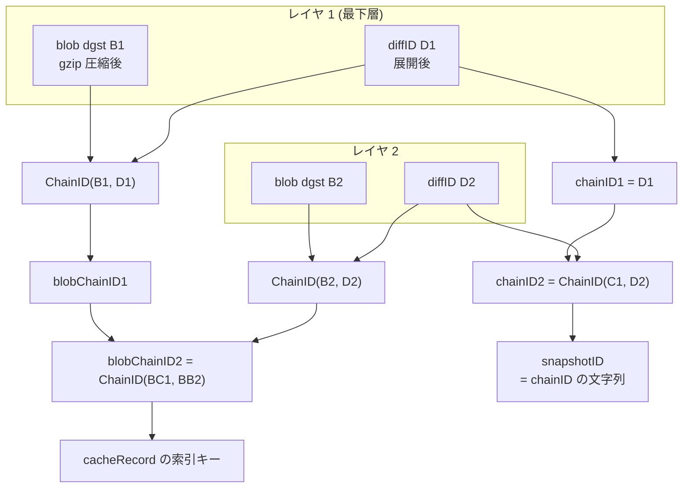

## 何を学んだか

`cacheManager.GetByBlob` は「レジストリから来たレイヤ 1 枚を、キャッシュのレコードとして登録する」入口だ。ここでレイヤに対して 2 つのダイジェストが計算される。

- **chainID** — 非圧縮の内容 (diffID) を下から積み上げた連鎖。OCI image spec の chain ID と同じ定義で、containerd のスナップショットキーにそのまま使われる
- **blobChainID** — 圧縮済み blob のダイジェストも混ぜた連鎖。同じ内容でも gzip と zstd で別の値になる

同じ内容を別の圧縮形式で取ってきたとき、chainID は一致し blobChainID は一致しない。BuildKit はこの差を使って「展開結果のスナップショットは共有するが、キャッシュレコードは別にする」という判断をしている。

## 2 つのダイジェストの作り方

```go title="cache/manager.go"
func (cm *cacheManager) GetByBlob(ctx context.Context, desc ocispecs.Descriptor, parent ImmutableRef, opts ...RefOption) (ir ImmutableRef, rerr error) {
	diffID, err := diffIDFromDescriptor(desc)
	if err != nil {
		return nil, err
	}
	chainID := diffID
	blobChainID := imagespecidentity.ChainID([]digest.Digest{desc.Digest, diffID})
	// ...
	if parent != nil {
		// ...
		chainID = imagespecidentity.ChainID([]digest.Digest{p.getChainID(), chainID})
		blobChainID = imagespecidentity.ChainID([]digest.Digest{p.getBlobChainID(), blobChainID})
	}
```

([cache/manager.go L139-L175](https://github.com/moby/buildkit/blob/ca4838f8ddbd3612bca94bcb8a938d8a326110a3/cache/manager.go#L139-L175))

`diffID` はディスクリプタのアノテーションから取る。

```go title="cache/manager.go"
func diffIDFromDescriptor(desc ocispecs.Descriptor) (digest.Digest, error) {
	diffIDStr, ok := desc.Annotations[labels.LabelUncompressed]
	if !ok {
		return "", errors.Errorf("missing uncompressed annotation for %s", desc.Digest)
	}
	// ...
}
```

([cache/manager.go L1729-L1740](https://github.com/moby/buildkit/blob/ca4838f8ddbd3612bca94bcb8a938d8a326110a3/cache/manager.go#L1729-L1740))

`labels.LabelUncompressed` は containerd の `containerd.io/uncompressed`。つまり 3 種のダイジェストが登場する。

| 名前                 | 何のダイジェストか                                      | 圧縮形式を変えると |
| -------------------- | ------------------------------------------------------- | ------------------ |
| `desc.Digest` (blob) | 圧縮済みレイヤ tar のダイジェスト。レジストリのアドレス | 変わる             |
| `diffID`             | 展開後のレイヤ tar のダイジェスト                       | 変わらない         |
| chainID              | 下から自分までの diffID の連鎖                          | 変わらない         |
| blobChainID          | 下から自分までの (blob, diffID) の連鎖                  | 変わる             |

`ChainID` は OCI image spec の実装 (`github.com/opencontainers/image-spec/identity`) で、`sha256(前の chainID + " " + 次の diffID)` を畳み込む。ここで BuildKit は同じ関数を blobChainID にも流用し、各段で `ChainID([blob, diffID])` を作ってから親の blobChainID と畳んでいる。



## 検索は blobChainID → chainID の順

`GetByBlob` は 2 段階で既存レコードを探す。

**第 1 段: blobChainID で完全一致を探す。**

```go title="cache/manager.go"
	sis, err := cm.searchBlobchain(ctx, blobChainID)
	if err != nil {
		return nil, err
	}

	for _, si := range sis {
		ref, err := cm.get(ctx, si.ID(), nil, opts...)
		// ...
		if ref == nil {
			continue
		}
		if p != nil {
			releaseParent = true
		}
		// ...
		return ref, nil
	}
```

([cache/manager.go L187-L214](https://github.com/moby/buildkit/blob/ca4838f8ddbd3612bca94bcb8a938d8a326110a3/cache/manager.go#L187-L214))

ここで見つかれば、そのレコードをそのまま返して終わり。blob のダイジェストまで含めて一致しているので、圧縮済みデータも展開済みスナップショットも、レコードに紐づくすべてを再利用できる。`releaseParent = true` にして、この呼び出しのために掴んだ親を手放す点に注意。既存レコードは自分の親をすでに保持しているので、二重に持つ必要がない。

**第 2 段: chainID で「スナップショットだけ」を探す。**

```go title="cache/manager.go"
	sis, err = cm.searchChain(ctx, chainID)
	if err != nil {
		return nil, err
	}

	var link *immutableRef
	for _, si := range sis {
		ref, err := cm.get(ctx, si.ID(), nil, opts...)
		// if the error was NotFound or NeedsRemoteProvider, we can't re-use the snapshot from the blob so just skip it
		if err != nil && !IsNotFound(err) && !errors.As(err, &NeedsRemoteProviderError{}) {
			return nil, errors.Wrapf(err, "failed to get record %s by chainid", si.ID())
		}
		if ref != nil {
			link = ref
			break
		}
	}

	id := identity.NewID()
	snapshotID := chainID.String()
	if link != nil {
		snapshotID = link.getSnapshotID()
		go link.Release(context.WithoutCancel(ctx))
	}
```

([cache/manager.go L216-L240](https://github.com/moby/buildkit/blob/ca4838f8ddbd3612bca94bcb8a938d8a326110a3/cache/manager.go#L216-L240))

こちらは見つかっても既存レコードを返さない。新しいレコードを作り、そのスナップショット ID として見つかったレコードのものを流用する。掴んだ `link` はすぐ手放す。

そして見つからなかった場合の `snapshotID` は `chainID.String()` になる。つまり **スナップショットの名前空間は chainID で自然に共有される**。同じ chainID を持つレコードが複数あっても、指すスナップショットは 1 つだ。これは containerd の snapshotter が「同じ chain ID のスナップショットは同一のもの」として扱う規約に乗った形になっている ([containerd 章](../../containerd/)を参照)。

## なぜ 2 つ要るのか

具体的なシナリオで整理する。

**同じイメージを 2 回 pull する。** blob もそのままなので blobChainID が一致し、第 1 段でヒットしてレコードごと再利用される。ネットワークもディスクも消費しない。

**同じ内容が gzip 版と zstd 版で publish されている。** マニフェストが違うので blob ダイジェストが違い、blobChainID は一致しない。しかし展開すれば同じ tar なので diffID が同じで chainID は一致する。この場合、

- レコードは分かれる。それぞれが自分の `desc.Digest` と mediaType を持つ。zstd 版の ref をそのまま別レジストリへ push すれば zstd のまま出ていく
- スナップショットは共有される。すでに gzip 版を展開済みなら、zstd 版の blob をダウンロードして展開する必要がない

これが「レコードは分けるがスナップショットは共有する」の中身になる。blobChainID だけで管理していたら 2 回展開することになり、chainID だけで管理していたら「このレイヤの圧縮済み blob はどれか」を答えられなくなる。

**片方が lazy でもう片方が展開済み。** 第 2 段の `get` は `NeedsRemoteProviderError` を無視して次の候補へ進む。lazy な既存レコードのスナップショットは実体が無いので流用できない。エラーの種類で「スナップショットとして使えるか」を判定している ([lazy ref](../lazy-ref/))。

## 索引は 2 本張られる

`chainID` / `blobChainID` はメタデータに書くときにインデックス名を添える。

```go title="cache/metadata.go"
// Indexes
const blobchainIndex = "blobchainid:"
const chainIndex = "chainid:"
```

```go title="cache/metadata.go"
func (md *cacheMetadata) queueChainID(str digest.Digest) error {
	return md.queueValue(keyChainID, str, chainIndex+str.String())
}

func (md *cacheMetadata) queueBlobChainID(str digest.Digest) error {
	return md.queueValue(keyBlobChainID, str, blobchainIndex+str.String())
}
```

([cache/metadata.go L42-L44](https://github.com/moby/buildkit/blob/ca4838f8ddbd3612bca94bcb8a938d8a326110a3/cache/metadata.go#L42-L44), [L272-L282](https://github.com/moby/buildkit/blob/ca4838f8ddbd3612bca94bcb8a938d8a326110a3/cache/metadata.go#L272-L282))

`searchBlobchain` / `searchChain` はこのプレフィックスを付けて `MetadataStore.Search` を呼ぶだけ。インデックスの実装は [cache/metadata](../cache-metadata/) で扱う。

新しいレコードを作るときは、両方のダイジェストをメタデータに書き、`blobOnly = true` を立てる。

```go title="cache/manager.go"
	rec.queueDiffID(diffID)
	rec.queueBlob(desc.Digest)
	rec.queueChainID(chainID)
	rec.queueBlobChainID(blobChainID)
	rec.queueSnapshotID(snapshotID)
	rec.queueBlobOnly(true)
	rec.queueMediaType(desc.MediaType)
	rec.queueBlobSize(desc.Size)
	rec.appendURLs(desc.URLs)
	rec.queueCommitted(true)
```

([cache/manager.go L297-L306](https://github.com/moby/buildkit/blob/ca4838f8ddbd3612bca94bcb8a938d8a326110a3/cache/manager.go#L297-L306))

`blobOnly` は「blob はあるがスナップショットは無いかもしれない」という印で、lazy 判定と `Extract` の入口条件になる。`committed` が最初から true なのは、レジストリから来たレイヤは最初から不変だからだ ([cacheRecord と 2 種類の ref](../cache-record-refs/))。

## ビルド側から見た使われ方

呼ぶのはイメージ pull だ。マニフェストのレイヤを下から順に、直前の結果を親にして 1 枚ずつ登録していく。

```go title="source/containerimage/pull.go"
	var parent cache.ImmutableRef
	setWindowsLayerType := p.Platform.OS == "windows" && runtime.GOOS != "windows"
	for _, layerDesc := range p.manifest.Descriptors {
		parent = current
		current, err = p.CacheAccessor.GetByBlob(ctx, layerDesc, parent,
			p.descHandlers, cache.WithImageRef(p.manifest.Ref))
		if parent != nil {
			parent.Release(context.TODO())
		}
		// ...
	}
```

([source/containerimage/pull.go L248-L263](https://github.com/moby/buildkit/blob/ca4838f8ddbd3612bca94bcb8a938d8a326110a3/source/containerimage/pull.go#L248-L263))

この時点で blob をダウンロードしていないことに注意。`GetByBlob` は content store に blob が無ければ `NeedsRemoteProviderError` を返すが、`descHandlers` (どこから取ってこられるかのハンドラ) が渡されていればそれで足りる。詳細は [lazy ref](../lazy-ref/) と [image-source](../image-source/)。

## なぜそうなっているか

chainID だけでは、「同じ内容だが別の圧縮」を区別できない。BuildKit は結果をレジストリへ push するとき、可能なら再圧縮せずに元の blob をそのまま送りたい。zstd で pull したものを push するときに gzip へ変換していたら、レイヤダイジェストが変わって差分 push が効かず、CPU も無駄になる。そのためにはレコードが「どの blob 由来か」を覚えている必要がある。

一方 blobChainID だけでは、展開結果を共有できない。展開はレイヤ 1 枚あたり数百 MB の I/O になりうる操作で、内容が同じなら 1 回で済ませたい。しかも containerd の snapshotter は chain ID をキーにする設計なので、chainID を snapshot ID として使えばこの共有が無料で手に入る。

2 つの同一性は「どのレイヤ内容か」と「どのバイト列か」という別の問いに答えている。片方に寄せると必ずどちらかの再利用を落とすので、両方を索引として持ち、検索を厳しい方から順に試す構造になっている。

## どう活かすか

**「同じもの」の定義が 2 つあるなら、両方を索引にして検索順を決める。** 内容の同一性 (chainID) と表現の同一性 (blobChainID) は別の問いで、答えが違う。1 つの ID に無理やり寄せると、どちらかの再利用を捨てることになる。厳しい方 (完全一致) を先に試し、外れたら緩い方で部分的な再利用を拾う。

**部分的な再利用は「新しいレコード + 既存資源への参照」で表す。** chainID ヒット時に既存レコードを返さず、新レコードのスナップショット ID だけを流用する形は、資源の共有とレコードの identity を分離している。共有される側は名前 (chainID 由来の snapshot ID) で参照されるだけなので、参照する側が何個あってもよい。

**内容ベースの ID を、下位ストレージの命名規約に合わせておく。** `snapshotID = chainID.String()` にしてあるので、BuildKit 側で共有テーブルを持たなくても、同じ chainID を持つレコードは自動的に同じスナップショットを指す。下位層がすでに内容アドレスで動いているなら、その名前をそのまま借りる方が安い。

**再利用が成立したときの参照の後始末を書き落とさない。** 第 1 段のヒットでは `releaseParent = true`、第 2 段では `go link.Release(...)`。「探すために掴んだもの」を、結果に応じてどちらも確実に返している。検索でリソースを掴む API は、ヒット・ミスの両方の経路で解放漏れが起きやすい。
