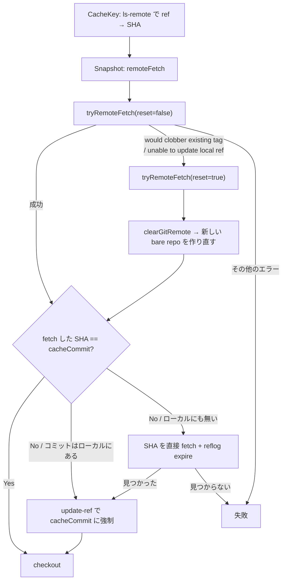

## 何を学んだか

git source の設計は 3 つの判断でできている。

1. **キャッシュキーはブランチ名ではなくコミット SHA**。`CacheKey` は必ず先に `git ls-remote` を打ち、ref を SHA に解決してからキーを組み立てる。
2. **bare リポジトリは remote URL ごとに 1 つで、全ビルドが共有する**。ただしディレクトリ名で管理しているのではなく、cache の `MutableRef` にメタデータインデックス `git-remote::<URL>` を張って引き当てている。
3. **共有しているせいで壊れる**。タグが別コミットに付け替えられた、ブランチが force push された、というときに `git fetch` が失敗する。BuildKit はその失敗を **エラーメッセージの文字列で分類して専用の型に包み**、共有リポジトリを丸ごと捨てて作り直す経路へ落とす。

3 番目が一番おもしろい。共有をやめれば消える問題を、共有を維持したまま回復で吸収している。

## キャッシュキーは ls-remote を打ってから作る

`CacheKey` は `resolveMetadata` を呼び、その結果の `Checksum` (= コミット SHA) からキーを組み立てる。

```go title="source/git/source.go"
func (gs *gitSourceHandler) CacheKey(ctx context.Context, jobCtx solver.JobContext, index int) (string, string, solver.CacheOpts, bool, error) {
	md, err := gs.resolveMetadata(ctx, jobCtx)
	// ...
	shaForCacheKey := md.Checksum
	if md.CommitChecksum != "" && !gs.src.KeepGitDir {
		// prefer commit sha pointed by annotated tag if no git dir is kept for more matches
		shaForCacheKey = md.CommitChecksum
	}
	cacheKey := gs.shaToCacheKey(shaForCacheKey, md.Ref)
	gs.cacheKey = cacheKey
	gs.cacheCommit = md.Checksum
	return cacheKey, md.Checksum, nil, true, nil
}
```

([source/git/source.go L761-L796](https://github.com/moby/buildkit/blob/ca4838f8ddbd3612bca94bcb8a938d8a326110a3/source/git/source.go#L761-L796))

キー文字列そのものは単純な連結だ。

```go title="source/git/source.go"
func (gs *gitSourceHandler) shaToCacheKey(sha, ref string) string {
	key := sha
	if gs.src.KeepGitDir {
		key += ".git"
		if ref != "" {
			key += "#" + ref
		}
	}
	if gs.src.Subdir != "" {
		key += ":" + gs.src.Subdir
	}
	if gs.src.SkipSubmodules {
		key += "(skip-submodules)"
	}
	// ...
}
```

([source/git/source.go L291-L312](https://github.com/moby/buildkit/blob/ca4838f8ddbd3612bca94bcb8a938d8a326110a3/source/git/source.go#L291-L312))

ここで効いているのが `KeepGitDir` の分岐だ。`.git` を残さない場合、**annotated tag が指す先のコミット SHA** をキーに使う。タグオブジェクトの SHA とコミットの SHA は別物なので、`v1.0` (annotated tag) を指定したビルドと `abc123` (そのコミット) を指定したビルドを同じキーに寄せるための正規化になる。逆に `.git` を残す場合は履歴の中身が変わるので、タグ側の SHA と ref 名をキーに入れる。

解決本体は `ls-remote` を 1 回打って 4 つの候補を拾い分ける。

```go title="source/git/source.go"
	buf, err := tmpGit.Run(ctx, "ls-remote", "--", remoteURL, ref, ref+"^{}")
	// ...
	var (
		partialRef      = "refs/" + strings.TrimPrefix(ref, "refs/")
		headRef         = "refs/heads/" + strings.TrimPrefix(ref, "refs/heads/")
		tagRef          = "refs/tags/" + strings.TrimPrefix(ref, "refs/tags/")
		annotatedTagRef = tagRef + "^{}" // dereferenced annotated tag
	)
```

([source/git/source.go L647-L658](https://github.com/moby/buildkit/blob/ca4838f8ddbd3612bca94bcb8a938d8a326110a3/source/git/source.go#L647-L658))

優先順位のコメントが `// git-checkout prefers branches in case of ambiguity` で、`git checkout` の曖昧解決規則に合わせている。ref が `main` のようにブランチともタグとも取れる名前だったとき、CLI と同じ答えを返すためだ。

ref が SHA そのものだった場合は `ls-remote` すら打たない。`gitutil.IsCommitSHA` を見て即座に `Metadata{Ref: sha, Checksum: sha}` を返す ([L555-L563](https://github.com/moby/buildkit/blob/ca4838f8ddbd3612bca94bcb8a938d8a326110a3/source/git/source.go#L555-L563))。SHA はもともと解決済みなので、ネットワークアクセスを 1 往復も使わずにキーが決まる。

## 共有 bare リポジトリはメタデータインデックスで引く

`mountRemote` が共有リポジトリの取得・生成を担う。ディレクトリ名を作るのではなく、cache のメタデータ検索から入る。

```go title="source/git/source.go"
func (gs *Source) mountRemote(ctx context.Context, remote string, authArgs []string, gitAdvice bool, sha256 bool, reset bool, g session.Group) (target string, release func() error, retErr error) {
	sis, err := searchGitRemote(ctx, gs.cache, remote)
	// ...
	var remoteRef cache.MutableRef
	for _, si := range sis {
		if reset {
			if err := si.clearGitRemote(); err != nil { /* ... */ }
		} else {
			remoteRef, err = gs.cache.GetMutable(ctx, si.ID())
			// ...
		}
	}
```

([source/git/source.go L175-L199](https://github.com/moby/buildkit/blob/ca4838f8ddbd3612bca94bcb8a938d8a326110a3/source/git/source.go#L175-L199))

インデックスのキーは定数で決まっている。

```go title="source/git/source.go"
const (
	keyGitRemote     = "git-remote"
	gitRemoteIndex   = keyGitRemote + "::"
	keyGitSnapshot   = "git-snapshot"
	gitSnapshotIndex = keyGitSnapshot + "::"
)
```

([source/git/source.go L1571-L1576](https://github.com/moby/buildkit/blob/ca4838f8ddbd3612bca94bcb8a938d8a326110a3/source/git/source.go#L1571-L1576))

見つからなければ `cache.New` で新しい mutable ref を作り、`CachePolicyRetain` で GC から守り、`git init --bare` してから `remote add origin` する。そして `setGitRemote(remote)` でインデックスを張る ([L201-L265](https://github.com/moby/buildkit/blob/ca4838f8ddbd3612bca94bcb8a938d8a326110a3/source/git/source.go#L201-L265))。

つまり **共有 bare リポジトリも普通のキャッシュ ref** だ。ディスク上の実体は snapshotter が管理し、prune の対象にもなる。git 専用のディレクトリレイアウトは存在しない。

排他は `moby/locker` を使ったプロセス内ロックで、キーは remote URL の文字列そのものだ。

```go title="source/git/source.go"
	remote := gs.src.Remote
	gs.locker.Lock(remote)
	defer gs.locker.Unlock(remote)
```

([source/git/source.go L551-L553](https://github.com/moby/buildkit/blob/ca4838f8ddbd3612bca94bcb8a938d8a326110a3/source/git/source.go#L551-L553))

チェックアウト結果のスナップショットは別のロックとインデックスを使う。こちらのロックキーは `cacheKey + ":" + Subdir` で、同じコミットを 2 つのビルドが同時に要求しても 1 回しかチェックアウトしない。

```go title="source/git/source.go"
	snapshotKey := cacheKey + ":" + gs.src.Subdir
	gs.locker.Lock(snapshotKey)
	defer gs.locker.Unlock(snapshotKey)

	sis, err := searchGitSnapshot(ctx, gs.cache, snapshotKey)
	// ...
	if len(sis) > 0 {
		return gs.cache.Get(ctx, sis[0].ID(), nil)
	}
```

([source/git/source.go L891-L901](https://github.com/moby/buildkit/blob/ca4838f8ddbd3612bca94bcb8a938d8a326110a3/source/git/source.go#L891-L901))

## fetch が壊れる 2 パターンと、その回復

共有リポジトリはローカル ref を持ち続ける。次回の fetch でそれが advertise されて差分転送が効くからだ。コメントにそう書いてある。

```go title="source/git/source.go"
	// local refs are needed so they would be advertised on next fetches. Force is used
	// in case the ref is a branch and it now points to a different commit sha
	// TODO: is there a better way to do this?
	targetRef := ref
	if !strings.HasPrefix(ref, "refs/tags/") {
		targetRef = "tags/" + ref
	}
```

([source/git/source.go L1043-L1049](https://github.com/moby/buildkit/blob/ca4838f8ddbd3612bca94bcb8a938d8a326110a3/source/git/source.go#L1043-L1049))

ローカル ref を持つと、リモート側で ref が動いたときに衝突する。BuildKit は fetch の失敗を **エラー文字列の部分一致で分類**して専用の型に包む。

```go title="source/git/source.go"
		if _, err := git.Run(ctx, args...); err != nil {
			err := errors.Wrapf(err, "failed to fetch remote %s", urlutil.RedactCredentials(gs.src.Remote))
			if strings.Contains(err.Error(), "rejected") && strings.Contains(err.Error(), "(would clobber existing tag)") {
				// this can happen if a tag was mutated to another commit in remote.
				// only hope is to abandon the existing shared repo and start a fresh one
				return nil, &wouldClobberExistingTagError{err}
			}
			if isUnableToUpdateLocalRef(err) {
				// this can happen if a branch updated in remote so that old branch
				// is now a parent dir of a new branch
				return nil, &unableToUpdateLocalRefError{err}
			}
			return nil, err
		}
```

([source/git/source.go L1084-L1098](https://github.com/moby/buildkit/blob/ca4838f8ddbd3612bca94bcb8a938d8a326110a3/source/git/source.go#L1084-L1098))

判定関数も文字列マッチだ。

```go title="source/git/source.go"
func isUnableToUpdateLocalRef(err error) bool {
	// ...
	if !strings.Contains(msg, "some local refs could not be updated;") {
		return false
	}
	return strings.Contains(msg, "(unable to update local ref)") ||
		strings.Contains(msg, "refname conflict")
}
```

([source/git/source.go L1478-L1488](https://github.com/moby/buildkit/blob/ca4838f8ddbd3612bca94bcb8a938d8a326110a3/source/git/source.go#L1478-L1488))

`refname conflict` のほうは、リモートで `refs/heads/feature` が消えて `refs/heads/feature/x` ができた、というケースだ。ローカルに残った `feature` (ファイル) と新しい `feature/x` (ディレクトリ配下) が同じパスを取り合う。

この 2 型だけが `remoteFetch` でリトライされる。

```go title="source/git/source.go"
	repo, err := gs.tryRemoteFetch(ctx, jobCtx, g, false)
	if err != nil {
		var wce *wouldClobberExistingTagError
		var ulre *unableToUpdateLocalRefError
		if errors.As(err, &wce) || errors.As(err, &ulre) {
			repo, err = gs.tryRemoteFetch(ctx, jobCtx, g, true)
			// ...
		}
	}
```

([source/git/source.go L813-L825](https://github.com/moby/buildkit/blob/ca4838f8ddbd3612bca94bcb8a938d8a326110a3/source/git/source.go#L813-L825))

最後の引数が `reset` で、これが `mountRemote` の `clearGitRemote()` に流れる。既存の bare リポジトリのインデックスを消して、新品の bare リポジトリから全部やり直す。

もう 1 つ、**取ってきたコミットがキャッシュキーのコミットと違う**という失敗もある。`CacheKey` の時点で `ls-remote` して SHA を確定したのに、`Snapshot` の時点で `fetch` したら別の SHA が来た、というレース (あるいはその間の force push) だ。

```go title="source/git/source.go"
		// if fetched ref does not match cache key, the remote side has changed the ref
		// if possible we can try to force the commit that the cache key points to, otherwise we need to error
		if strings.TrimSpace(string(dt)) != gs.cacheCommit {
			uptRef := targetRef
			// ...
			// check if the commit still exists in the repo
			if _, err := git.Run(ctx, "cat-file", "-e", gs.cacheCommit); err == nil {
				// force the ref to point to the commit that the cache key points to
				if _, err := git.Run(ctx, "update-ref", uptRef, gs.cacheCommit, "--no-deref"); err != nil {
```

([source/git/source.go L1105-L1117](https://github.com/moby/buildkit/blob/ca4838f8ddbd3612bca94bcb8a938d8a326110a3/source/git/source.go#L1105-L1117))

ローカルに目当てのコミットが残っていればローカル ref を強制的に付け替える。残っていなければ SHA を直接 fetch し、それでも見つからなければエラーで終わる。**キャッシュキーが決めた SHA が絶対で、リモートの現在の ref のほうを曲げる**、という方向になっているのが要点だ。



## `--keep-git-dir` は「もう一度 clone する」

`.git` を残さない場合は、共有 bare リポジトリを `--git-dir` に、チェックアウト先を `--work-tree` にした `git checkout --no-overlay <ref> -- .` で済ませる ([L1279-L1283](https://github.com/moby/buildkit/blob/ca4838f8ddbd3612bca94bcb8a938d8a326110a3/source/git/source.go#L1279-L1283))。共有リポジトリの `.git` はスナップショットに含まれない。

`KeepGitDir` かつ subdir 指定なしのときだけ、チェックアウト先で `git init` し直して**共有リポジトリから改めて fetch する**。

```go title="source/git/source.go"
		// Defense-in-depth: clone using the file protocol to disable local-clone
		// optimizations which can be abused on some versions of Git to copy unintended
		// host files into the build context.
		_, err = checkoutGit.Run(ctx, "remote", "add", "origin", "file://"+gitDir)
```

([source/git/source.go L1217-L1220](https://github.com/moby/buildkit/blob/ca4838f8ddbd3612bca94bcb8a938d8a326110a3/source/git/source.go#L1217-L1220))

`file://` を明示するのは意図的で、コメントどおり **ローカル clone の最適化 (ハードリンク・`objects/info/alternates`) を無効化する**ためだ。パスをそのまま渡すと git がローカル最適化パスに入り、バージョンによっては意図しないホストファイルをビルドコンテキストに混入させられる。

fetch のあとの後始末が 3 つ並ぶ。

```go title="source/git/source.go"
		_, err = checkoutGit.Run(ctx, "remote", "set-url", "origin", urlutil.RedactCredentials(gs.src.Remote))
		// ...
		_, err = checkoutGit.Run(ctx, "reflog", "expire", "--all", "--expire=now")
		// ...
		if err := os.Remove(filepath.Join(checkoutDirGit, "FETCH_HEAD")); err != nil && !errors.Is(err, os.ErrNotExist) {
```

([source/git/source.go L1260-L1270](https://github.com/moby/buildkit/blob/ca4838f8ddbd3612bca94bcb8a938d8a326110a3/source/git/source.go#L1260-L1270))

- origin URL を `file:///var/lib/buildkit/...` から本来のリモート URL に戻す。しかも `RedactCredentials` を通してあるので、URL に埋まっていた認証情報はイメージに残らない。
- reflog を全消し。fetch の履歴はビルド結果に入れない。
- `FETCH_HEAD` を削除。

いずれも「イメージに入る `.git` を、ビルダの都合が漏れない・毎回同じ内容になるものにする」ための処理だ。

サブモジュールはチェックアウト後に一律で回る。

```go title="source/git/source.go"
	git = git.New(gitutil.WithWorkTree(cd), gitutil.WithGitDir(gitDir))
	if !gs.src.SkipSubmodules {
		_, err = git.Run(ctx, "submodule", "update", "--init", "--recursive", "--depth=1")
```

([source/git/source.go L1286-L1291](https://github.com/moby/buildkit/blob/ca4838f8ddbd3612bca94bcb8a938d8a326110a3/source/git/source.go#L1286-L1291))

サブモジュールの内容はキャッシュキーに入らない。入るのは `(skip-submodules)` というフラグの有無だけだ。親リポジトリのコミットが同じならサブモジュールのコミットも固定される、という gitlink の性質に乗っている。

## 認証情報はセッション越しに取る

トークン認証は secret から取って `http.<scope>.extraheader` の形で git のコマンドライン引数に載せる。

```go title="source/git/source.go"
			if s.token {
				dt = []byte("basic " + base64.StdEncoding.EncodeToString(fmt.Appendf(nil, "x-access-token:%s", dt)))
			}
			gs.authArgs = []string{"-c", "http." + tokenScope(gs.src.Remote) + ".extraheader=Authorization: " + string(dt)}
```

([source/git/source.go L453-L456](https://github.com/moby/buildkit/blob/ca4838f8ddbd3612bca94bcb8a938d8a326110a3/source/git/source.go#L453-L456))

スコープの決め方に注意書きがある。

```go title="source/git/source.go"
func tokenScope(remote string) string {
	// generally we can only use the token for fetching main remote but in case of github.com we do best effort
	// to try reuse same token for all github.com remotes. This is the same behavior actions/checkout uses
```

([source/git/source.go L1542-L1544](https://github.com/moby/buildkit/blob/ca4838f8ddbd3612bca94bcb8a938d8a326110a3/source/git/source.go#L1542-L1544))

原則はリモート URL 完全一致にスコープを絞る。GitHub だけは `actions/checkout` の挙動に合わせてホスト単位に広げている。サブモジュールが同一 GitHub 上の別リポジトリだと URL 一致では取れないので、実用に寄せた例外だ。

SSH は `sshforward.MountSSHSocket` でセッション越しに agent socket をマウントし、known_hosts はクライアントから来た文字列を一時ファイルに書き出す ([L467-L528](https://github.com/moby/buildkit/blob/ca4838f8ddbd3612bca94bcb8a938d8a326110a3/source/git/source.go#L467-L528))。どちらもセッション側の詳細は [secrets と SSH の転送](../secrets-and-ssh/) と [認証の委譲](../auth-delegation/) にある。

## なぜそうなっているか

共有 bare リポジトリは、**同じリポジトリを何度も clone しない**ためのものだ。CI で 1 日に何百回も同じリポジトリをビルドする場面で、毎回フル clone するのは帯域と時間の無駄になる。`--depth=1` の shallow fetch を積み重ねて、必要なときだけ `--unshallow` する ([L1070-L1077](https://github.com/moby/buildkit/blob/ca4838f8ddbd3612bca94bcb8a938d8a326110a3/source/git/source.go#L1070-L1077))。

そのコストとして、リポジトリの状態が「前回のビルドの残骸」を持ってしまう。git 自体は「ローカル ref がリモートと矛盾したら失敗する」という安全側の設計なので、共有すると必ずこの矛盾を踏む。BuildKit の対処は、**git が壊れたと言ってきた種類を見て、捨てて作り直せば直るものだけを選別する**というものだ。エラー文字列マッチは脆いが、git は終了コードでこれらを区別しないので他に手がない。`TODO: is there a better way to do this?` というコメントが残っているのはそのためだろう。

キャッシュキーを SHA まで解決してから作るのは、キャッシュキーの契約そのものだ。「`main` ブランチ」ではキーとして意味を持たない — 内容が変わってもキーが変わらない。逆に SHA まで解決すれば、`main` が動いたときにキーも動く。[キャッシュヒットとは何か](../what-is-a-cache-hit/) の原則が、そのままネットワーク往復 1 回のコストとして現れている。

## どう活かすか

- **リモートリソースをキャッシュするなら、可変な名前ではなく解決済みの識別子をキーにする。** タグやブランチ名をキーにすると、内容が変わってもキャッシュヒットしてしまう。1 回の軽い問い合わせ (`ls-remote`、`HEAD` リクエスト) で不変な識別子に変換してからキーを作る。
- **共有ステートを持つと、共有ステートを捨てる経路が必ず要る。** ここでは「エラーを型で分類 → reset フラグ付きでリトライ」という 2 段構えになっている。リトライ対象を型で限定しているので、無関係な失敗が無限リトライにならない。
- **出力に混ざるビルダの都合は明示的に消す。** `.git` の origin URL を戻す・reflog を消す・`FETCH_HEAD` を消す、の 3 点は、放っておけば「同じソースから作ったのに違うイメージ」になる。再現性の話は [再現可能なビルド](../reproducible-build/) にもつながる。
- **git のように「呼ぶだけ」の外部コマンドでも、失敗のモードは自分で分類する価値がある。** そのまま上げると全部「fetch に失敗しました」になり、回復可能な失敗が回復されない。
