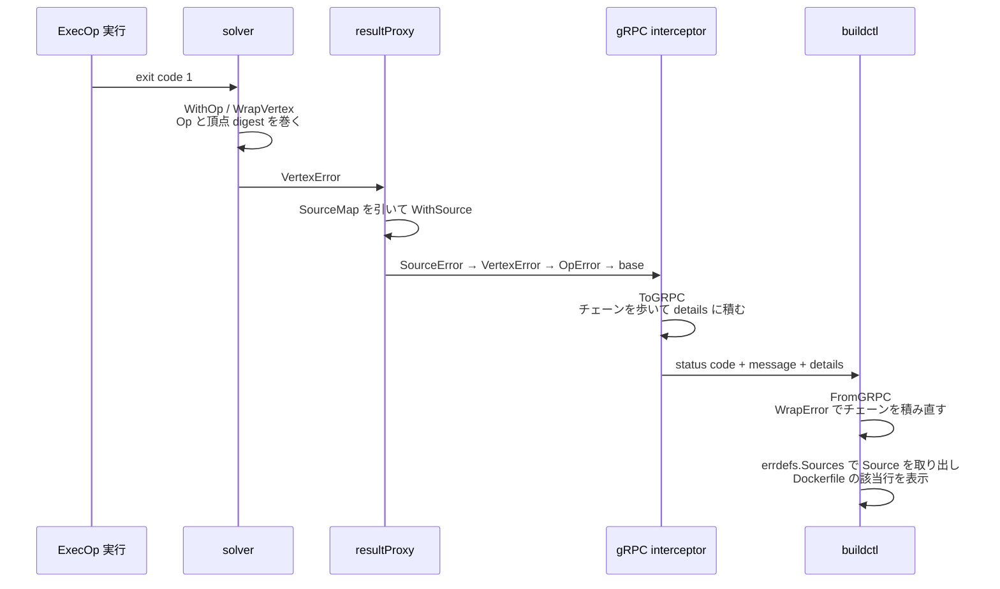

## 何を学んだか

BuildKit のエラーは、デーモンとクライアントの間で**構造を保ったまま**往復する。`errors.New("...")` の文字列だけではなく、「どの頂点で」「LLB のどの Op で」「Dockerfile の何行目で」「デーモンのどの関数で」が全部ついてくる。

やり方は 2 つの型で説明できる。

```go title="util/grpcerrors/grpcerrors.go"
type TypedError interface {
	ToProto() TypedErrorProto
}

type TypedErrorProto interface {
	proto.Message
	WrapError(error) error
}
```

([util/grpcerrors/grpcerrors.go L19-L26](https://github.com/moby/buildkit/blob/ca4838f8ddbd3612bca94bcb8a938d8a326110a3/util/grpcerrors/grpcerrors.go#L19-L26))

`TypedError` は「自分を proto に変換できる Go のエラー」、`TypedErrorProto` は「自分から Go のエラーを再構築できる proto」だ。この 2 つが対になっていて、送信側は `ToProto` でエラーチェーンを proto の列に潰し、受信側は `WrapError` でチェーンを積み直す。

## 送るとき — チェーンを歩いて details に積む

`ToGRPC` はエラーチェーンを 1 度だけ走査し、`TypedError` を実装しているものすべてを detail として集める。

```go title="util/grpcerrors/grpcerrors.go"
	var details []proto.Message

	for _, st := range stack.Traces(err) {
		details = append(details, st)
	}

	each(err, func(err error) {
		if te, ok := err.(TypedError); ok {
			details = append(details, te.ToProto())
		}
	})
```

([util/grpcerrors/grpcerrors.go L54-L64](https://github.com/moby/buildkit/blob/ca4838f8ddbd3612bca94bcb8a938d8a326110a3/util/grpcerrors/grpcerrors.go#L54-L64))

`each` は `Unwrap() error` と `Unwrap() []error` の両方をたどる自前の走査で、`errors.As` のように最初の 1 個で止まらない。同じ種類の detail が複数付くことを許している — 実際 `Source` は入れ子のフロントエンドごとに複数付く。

detail の型 URL は containerd の `typeurl` レジストリから引かれ、本体は proto binary ではなく **JSON** で詰められる。

```go title="util/grpcerrors/grpcerrors.go"
	for _, detail := range details {
		url, err := typeurl.TypeURL(detail)
		if err != nil {
			bklog.G(ctx).Warnf("ignoring typed error %T: not registered", detail)
			continue
		}
		dt, err := json.Marshal(detail)
		if err != nil {
			return nil, err
		}
		p.Details = append(p.Details, &anypb.Any{TypeUrl: url, Value: dt})
	}
```

([util/grpcerrors/grpcerrors.go L94-L106](https://github.com/moby/buildkit/blob/ca4838f8ddbd3612bca94bcb8a938d8a326110a3/util/grpcerrors/grpcerrors.go#L94-L106))

登録は各パッケージの `init` で行う。型名に `+json` が付いているのがエンコード形式の宣言になっている。

```go title="solver/errdefs/vertex.go"
	typeurl.Register((*Vertex)(nil), "github.com/moby/buildkit", "errdefs.Vertex+json")
	typeurl.Register((*Source)(nil), "github.com/moby/buildkit", "errdefs.Source+json")
```

([solver/errdefs/vertex.go L10-L11](https://github.com/moby/buildkit/blob/ca4838f8ddbd3612bca94bcb8a938d8a326110a3/solver/errdefs/vertex.go#L10-L11))

## 受け取るとき — 分からない detail は素通しする

`FromGRPC` は details を 3 つに仕分ける。スタックトレース、既知の `TypedErrorProto`、そして**それ以外**。それ以外は捨てずに、新しい status の details へそのままコピーする。

```go title="util/grpcerrors/grpcerrors.go"
	// details that we don't understand are copied as proto
	for _, d := range pb.Details {
		m, err := typeurl.UnmarshalAny(d)
		if err != nil {
			bklog.L.Debugf("failed to unmarshal error detail with type %q: %v", d.GetTypeUrl(), err)
			n.Details = append(n.Details, d)
			continue
		}

		switch v := m.(type) {
		case *stack.Stack:
			stacks = append(stacks, v)
		case TypedErrorProto:
			details = append(details, v)
		default:
			bklog.L.Debugf("unknown detail with type %T", v)
			n.Details = append(n.Details, d)
		}
	}
```

([util/grpcerrors/grpcerrors.go L228-L246](https://github.com/moby/buildkit/blob/ca4838f8ddbd3612bca94bcb8a938d8a326110a3/util/grpcerrors/grpcerrors.go#L228-L246))

そのうえで、base となる `grpcStatusError` にスタックと detail を順に巻き付けてチェーンを再構築する。

```go title="util/grpcerrors/grpcerrors.go"
	err = &grpcStatusError{st: status.FromProto(n)}

	for _, s := range stacks {
		if s != nil {
			err = stack.Wrap(err, s)
		}
	}

	for _, d := range details {
		err = d.WrapError(err)
	}
```

([util/grpcerrors/grpcerrors.go L248-L258](https://github.com/moby/buildkit/blob/ca4838f8ddbd3612bca94bcb8a938d8a326110a3/util/grpcerrors/grpcerrors.go#L248-L258))

`WrapError` は各 proto 型が自分で実装する。`Vertex` なら `VertexError` を、`Source` なら `SourceError` を作る。

```go title="solver/errdefs/vertex.go"
func (v *Vertex) WrapError(err error) error {
	return &VertexError{error: err, Vertex: v}
}
```

([solver/errdefs/vertex.go L34-L36](https://github.com/moby/buildkit/blob/ca4838f8ddbd3612bca94bcb8a938d8a326110a3/solver/errdefs/vertex.go#L34-L36))

結果として、クライアント側のコードは `errors.As(err, &ve)` でデーモン側と同じ型を取り出せる。gRPC を挟んだことがコードから見えない。

差し込みは interceptor 1 段だけだ。サーバ側で `ToGRPC`、クライアント側で `FromGRPC` を全 RPC にかける。

```go title="util/grpcerrors/intercept.go"
func UnaryClientInterceptor(ctx context.Context, method string, req, reply any, cc *grpc.ClientConn, invoker grpc.UnaryInvoker, opts ...grpc.CallOption) error {
	err := FromGRPC(invoker(ctx, method, req, reply, cc, opts...))
	if err != nil {
		stack.Helper()
	}
	return err
}
```

([util/grpcerrors/intercept.go L40-L46](https://github.com/moby/buildkit/blob/ca4838f8ddbd3612bca94bcb8a938d8a326110a3/util/grpcerrors/intercept.go#L40-L46))

同じ interceptor がデーモン ([cmd/buildkitd/main.go L358-L359](https://github.com/moby/buildkit/blob/ca4838f8ddbd3612bca94bcb8a938d8a326110a3/cmd/buildkitd/main.go#L358-L359))、gateway フロントエンドのサーバ側、gateway クライアントすべてに入っている。だから[フロントエンドがコンテナの中で走って](../gateway-grpc/)いても、その中で起きたエラーはデーモンを経由してクライアントまで型を保ったまま届く。

## スタックトレースも同じ経路で運ぶ

`Stack` は proto で定義されていて、フレームだけでなく**どのプロセスのものか**を持つ。

```proto title="util/stack/stack.proto"
message Stack {
	repeated Frame frames = 1;
	repeated string cmdline = 2;
	int32 pid = 3;
	string version = 4;
	string revision = 5;
}
```

([util/stack/stack.proto](https://github.com/moby/buildkit/blob/ca4838f8ddbd3612bca94bcb8a938d8a326110a3/util/stack/stack.proto))

`cmdline` / `pid` / `version` / `revision` が入っているのは、1 個のエラーに**複数プロセスのスタックが混ざる**からだ。クライアント → デーモン → gateway フロントエンド (別コンテナの別プロセス) と 3 段になれば、3 本のスタックが 1 つのエラーに乗る。表示するときにどれがどのプロセスのものか分からないと読めない。

```go title="util/stack/stack.go"
	out.Cmdline = os.Args
	out.Pid = int32(os.Getpid())
	out.Version = version
	out.Revision = revision
```

([util/stack/stack.go L169-L172](https://github.com/moby/buildkit/blob/ca4838f8ddbd3612bca94bcb8a938d8a326110a3/util/stack/stack.go#L169-L172))

同じ経路を何度も通ると同じフレーム列が何本も溜まるので、`compressStacks` がフレーム数の多い順に並べ、他のスタックの末尾と一致する部分を削る。完全一致かつ同じ pid/version/cmdline なら丸ごと落とす。

```go title="util/stack/compress.go"
			// full match, potentially skip all
			if idx == len(st.Frames)-1 {
				if st.Pid == prev.Pid && st.Version == prev.Version && slices.Equal(st.Cmdline, prev.Cmdline) {
					continue loop0
				}
			}
```

([util/stack/compress.go L24-L30](https://github.com/moby/buildkit/blob/ca4838f8ddbd3612bca94bcb8a938d8a326110a3/util/stack/compress.go#L24-L30))

もう 1 つの細工が `stack.Helper()` だ。呼んだ関数自身をヘルパー集合に登録しておくと、`convertStack` がその関数のフレームをスタックから取り除く。interceptor や `FromGRPC` のような配管がスタックの先頭を埋めるのを防いでいる。

```go title="util/stack/stack.go"
		if _, ok := helpers[p[0]]; ok {
			continue
		}
```

([util/stack/stack.go L152-L154](https://github.com/moby/buildkit/blob/ca4838f8ddbd3612bca94bcb8a938d8a326110a3/util/stack/stack.go#L152-L154))

クライアント側で `%+v` を使うと `stack.Formatter` がすべてのスタックをプロセス情報付きで並べる。`buildctl --debug` がこれを使う。

## Dockerfile の行が出るまで

エラーが Dockerfile の行に戻るまでの巻き付けは、solver から順に 3 段ある。

まず solver が、失敗した頂点の digest と LLB の Op を巻く。`origDigest` を使っているのが要点で、[edge のマージ](../edge-merge/)やキャッシュ用の digest 差し替えを経ていても、クライアントが送った定義の digest に戻して報告する。

```go title="solver/jobs.go"
		err = errdefs.WithOp(err, s.st.vtx.Sys(), s.st.vtx.Options().Description)
		err = errdefs.WrapVertex(err, s.st.origDigest)
```

([solver/jobs.go L1060-L1061](https://github.com/moby/buildkit/blob/ca4838f8ddbd3612bca94bcb8a938d8a326110a3/solver/jobs.go#L1060-L1061))

次に `resultProxy` が、その digest を [SourceMap](../source-map/) の索引に引いて位置情報を足す。

```go title="solver/llbsolver/result.go"
	var ve *errdefs.VertexError
	if errors.As(err, &ve) {
		if rp.req.Definition.Source != nil {
			locs, ok := rp.req.Definition.Source.Locations[ve.Digest]
			if ok {
				for _, loc := range locs.Locations {
					err = errdefs.WithSource(err, &errdefs.Source{
						Info:   rp.req.Definition.Source.Infos[loc.SourceIndex],
						Ranges: loc.Ranges,
					})
				}
			}
		}
	}
```

([solver/llbsolver/result.go L94-L112](https://github.com/moby/buildkit/blob/ca4838f8ddbd3612bca94bcb8a938d8a326110a3/solver/llbsolver/result.go#L94-L112))

`Source` には `SourceInfo` (ファイル名と中身そのもの) が入っているので、クライアントは Dockerfile を手元に持っていなくても該当行を表示できる。表示ロジックは `Source.Print` にあり、対象行に `>>>` を付け、前後に 2 行 (1 行だけなら 4 行) のパディングを取る。

```go title="solver/errdefs/source.go"
	fmt.Fprintf(w, "%s:%d\n--------------------\n", si.Filename, prepadStart)
	for i := start; i <= end; i++ {
		pfx := "   "
		if containsLine(s.Ranges, i) {
			pfx = ">>>"
		}
		fmt.Fprintf(w, " %3d | %s %s\n", i, pfx, lines[i-1])
	}
```

([solver/errdefs/source.go L84-L91](https://github.com/moby/buildkit/blob/ca4838f8ddbd3612bca94bcb8a938d8a326110a3/solver/errdefs/source.go#L84-L91))

最後に `buildctl` が、エラーチェーンから `Source` を全部取り出して順に印字する。`Sources` は再帰で外側から内側の順に返すので、フロントエンドが入れ子になっていれば外側の Dockerfile から順に並ぶ。

```go title="cmd/buildctl/main.go"
	for _, s := range errdefs.Sources(err) {
		s.Print(os.Stderr)
	}
	for _, msg := range policysession.DenyMessages(err) {
		if msg.GetMessage() != "" {
			fmt.Fprintf(os.Stderr, "policy deny: %s\n", msg.GetMessage())
		}
	}
```

([cmd/buildctl/main.go L150-L157](https://github.com/moby/buildkit/blob/ca4838f8ddbd3612bca94bcb8a938d8a326110a3/cmd/buildctl/main.go#L150-L157))

`DenyMessages` も同じ `TypedError` の仕組みで運ばれてくる ([sourcepolicy](../sourcepolicy/))。



## 主な typed error

`solver/errdefs/errdefs.proto` にある型が、そのままエラーに乗る情報の一覧になっている。

| proto                           | Go のエラー型                          | 何を運ぶか                                                                                                       |
| ------------------------------- | -------------------------------------- | ---------------------------------------------------------------------------------------------------------------- |
| `Vertex`                        | `VertexError`                          | 失敗した頂点の LLB digest                                                                                        |
| `Source`                        | `SourceError`                          | ファイル名・中身・行範囲                                                                                         |
| `Solve`                         | `SolveError`                           | Op、失敗した mount/input の ref ID、失敗の主体                                                                   |
| `FileAction`                    | (`Solve` の subject)                   | FileOp の何番目のアクションか                                                                                    |
| `ContentCache`                  | (`Solve` の subject)                   | slow cache 計算が失敗した入力の番号                                                                              |
| `Frontend` / `FrontendCap`      | —                                      | どのフロントエンド / どの capability か                                                                          |
| `CompatibilityFeature`          | `UnsupportedCompatibilityFeatureError` | 指定 `compatibility-version` で使えない機能 ([compatibility-version と cachedigest](../compat-and-cachedigest/)) |
| `Subrequest`                    | —                                      | 未対応の subrequest 名                                                                                           |
| `ProvenanceMaterialsIncomplete` | —                                      | provenance に載せきれなかった素材 ([provenance](../provenance/))                                                 |

`Solve` が持つ `inputIDs` / `mountIDs` は特殊で、**失敗した時点のファイルシステムへのハンドル**だ。gateway が `registerResultIDs` で ref を登録し、その ID をエラーに載せる。

```go title="frontend/gateway/gateway.go"
	if errors.As(solveErr, &ee) {
		var err error
		inputIDs, err = lbf.registerResultIDs(ee.Inputs...)
		// ...
		mountIDs, err = lbf.registerResultIDs(ee.Mounts...)
```

([frontend/gateway/gateway.go L672-L681](https://github.com/moby/buildkit/blob/ca4838f8ddbd3612bca94bcb8a938d8a326110a3/frontend/gateway/gateway.go#L672-L681))

失敗したステップの中身をあとから覗くクライアント側の機能は、この ID を [gateway の ref](../gateway-ref/) として開き直すことで成り立つ。ref を保持するために `ExecError` は `runtime.SetFinalizer` でリークを検出するようになっている ([solver/llbsolver/errdefs/exec.go](https://github.com/moby/buildkit/blob/ca4838f8ddbd3612bca94bcb8a938d8a326110a3/solver/llbsolver/errdefs/exec.go))。エラー値がリソースの所有者になっている、珍しい構造だ。

## なぜそうなっているか

gRPC の `status.details` は、もともと「サーバが構造化された追加情報を返す」ための場所だ。BuildKit はそこに「Go のエラーチェーンを平坦化したもの」を入れると決めた。この決定が効いているのは、**片側だけバージョンが古くても壊れない**点にある。

- 送信側が知らない型は、そもそも `typeurl` に登録されていないので警告を出してスキップする。
- 受信側が知らない型は、`default` 節で proto のまま次の status へコピーされる。エラー全体が読めなくなることはなく、その情報だけが使われないだけになる。

これは[apicaps](../apicaps/) と同じ思想の別の適用だ。機能の有無をバージョン番号ではなく個別の識別子で表現し、知らないものは黙って無視する。エラーの詳細は「あれば便利、なくても致命的ではない」ものなので、この扱いが正解になる。

`Code()` と `AsGRPCStatus()` が `Unwrap() []error` まで丁寧にたどるのも同じ理由で、`errgroup` や `errors.Join` で束ねられたエラーの中から意味のあるコードを拾わないと、並列に走る solver のエラーが全部 `Unknown` になってしまう。

detail を proto binary ではなく JSON にしているのは、`typeurl` レジストリの慣習に合わせた結果だが、副作用として詳細をログにそのまま出せる。

## どう活かすか

- **プロセス境界を越えるエラーは、文字列ではなく「型 + データ」の列にする。** 送信側で `ToProto`、受信側で `WrapError` という 2 メソッドの対を決めるだけで、境界の両側で `errors.As` が同じように使える。ラッパの数が増えても API は増えない。
- **知らない型は捨てずに素通しする。** 「読めないから捨てる」を選ぶと、中継が 1 段入っただけで情報が消える。BuildKit はクライアント → デーモン → フロントエンドの 3 段があるので、これがないと成り立たない。
- **スタックトレースにはプロセスの識別子を付ける。** 分散したコンポーネントのスタックが 1 つのエラーに混ざる設計にした時点で、pid と version がないと読めなくなる。
- **配管をスタックから消す仕組みを用意する。** `stack.Helper()` は `testing.T.Helper()` と同じ発想で、interceptor やラッパ関数が毎回スタックの先頭に出るのを防ぐ。エラー報告の質は、余計なフレームを消せるかでかなり変わる。
- **エラー値にリソースを持たせる選択肢がある。** 失敗した実行環境をあとから調べたいなら、エラーがその ref を握り続けるしかない。ただし解放漏れが直接ディスクを食うので、finalizer での検出のような保険とセットで考える。
