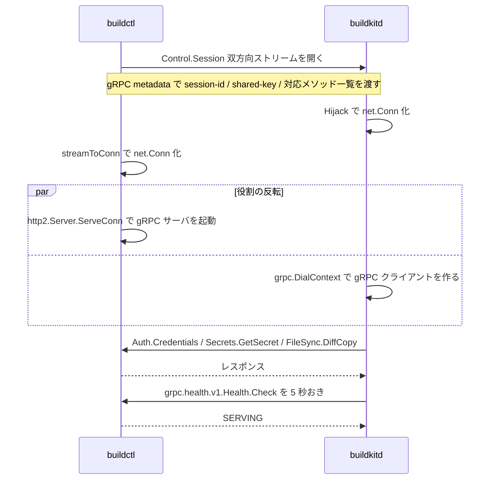

## 何を学んだか

BuildKit のデーモンは、ビルド中にクライアントのファイル・secret・レジストリ認証情報を必要とする。だがデーモンからクライアントへは接続できない (クライアントは NAT の内側かもしれないし、そもそもサーバを立てていない)。

BuildKit の答えは「既にある 1 本のストリームを `net.Conn` に見せかけ、その上で gRPC の役割を反転させる」だった。`Control.Session` という双方向ストリーミング RPC を開き、クライアント側はそのストリームの上で **gRPC サーバ** を、デーモン側は **gRPC クライアント** を動かす。TCP コネクションも Unix ソケットも追加で作らない。

同じ発想はフロントエンドコンテナの stdin/stdout にも使われている ([gateway — コンテナの stdin/stdout の上に gRPC を張る](../gateway-grpc/))。BuildKit の中で 2 か所、独立に「与えられた 1 本のバイトストリームを `net.Conn` に昇格させる」という手を打っている。

## ソースコードのどこか

### 土台は双方向ストリーミング RPC 1 本

```proto title="api/services/control/control.proto"
rpc Session(stream BytesMessage) returns (stream BytesMessage);
```

([api/services/control/control.proto L19](https://github.com/moby/buildkit/blob/ca4838f8ddbd3612bca94bcb8a938d8a326110a3/api/services/control/control.proto#L19))

`BytesMessage` は `bytes data = 1;` だけを持つメッセージ ([同 L166](https://github.com/moby/buildkit/blob/ca4838f8ddbd3612bca94bcb8a938d8a326110a3/api/services/control/control.proto#L166))。つまりこの RPC は「意味のあるメッセージのやりとり」ではなく、**バイト列を双方向に流す土管**として定義されている。

### 両端が同じ `streamToConn` を使う

クライアント側は `Dialer` から:

```go title="session/grpchijack/dial.go"
func Dialer(api controlapi.ControlClient) session.Dialer {
	return func(ctx context.Context, proto string, meta map[string][]string) (net.Conn, error) {
		meta = lowerHeaders(meta)
		md := metadata.MD(meta)
		ctx = metadata.NewOutgoingContext(ctx, md)

		stream, err := api.Session(ctx)
		// ...
		c, _ := streamToConn(stream)
		return c, nil
	}
}
```

([session/grpchijack/dial.go L18](https://github.com/moby/buildkit/blob/ca4838f8ddbd3612bca94bcb8a938d8a326110a3/session/grpchijack/dial.go#L18))

デーモン側は `Hijack` から:

```go title="session/grpchijack/hijack.go"
// Hijack hijacks session to a connection.
func Hijack(stream controlapi.Control_SessionServer) (net.Conn, <-chan struct{}, map[string][]string) {
	md, _ := metadata.FromIncomingContext(stream.Context())
	c, closeCh := streamToConn(stream)
	return c, closeCh, md
}
```

([session/grpchijack/hijack.go L11](https://github.com/moby/buildkit/blob/ca4838f8ddbd3612bca94bcb8a938d8a326110a3/session/grpchijack/hijack.go#L11))

両方が受け取る `stream` は、`Context()` / `SendMsg` / `RecvMsg` の 3 メソッドだけを要求する自前のインターフェースになっている。`grpc.ClientStream` と `grpc.ServerStream` の最大公約数を切り出したので、同じ `conn` 型がそのまま両端で使い回せる。

```go title="session/grpchijack/dial.go"
type stream interface {
	Context() context.Context
	SendMsg(m any) error
	RecvMsg(m any) error
}
```

([session/grpchijack/dial.go L34](https://github.com/moby/buildkit/blob/ca4838f8ddbd3612bca94bcb8a938d8a326110a3/session/grpchijack/dial.go#L34))

### `conn` が `net.Conn` を満たすやり方

`Write` は素直だ。バイト列を 1 メッセージに詰めて送るだけ。

```go title="session/grpchijack/dial.go"
func (c *conn) Write(b []byte) (int, error) {
	c.writeMu.Lock()
	defer c.writeMu.Unlock()
	m := &controlapi.BytesMessage{Data: b}
	if err := c.stream.SendMsg(m); err != nil {
		return 0, err
	}
	return len(b), nil
}
```

`Read` の方が面倒で、ここに 2 つの工夫がある ([session/grpchijack/dial.go L57](https://github.com/moby/buildkit/blob/ca4838f8ddbd3612bca94bcb8a938d8a326110a3/session/grpchijack/dial.go#L57))。

第 1 に、**メッセージ境界と `Read` の境界が合わない**問題。呼び出し側が渡した `b` が受信メッセージより小さいと余りが出るので、`lastBuf` に残して次の `Read` で先に返す。

```go title="session/grpchijack/dial.go"
	if c.lastBuf != nil {
		n := copy(b, c.lastBuf)
		c.lastBuf = c.lastBuf[n:]
		if len(c.lastBuf) == 0 {
			c.lastBuf = nil
		}
		return n, nil
	}
	m := new(controlapi.BytesMessage)
	m.Data = c.buf

	if err := c.stream.RecvMsg(m); err != nil {
		return 0, err
	}
	c.buf = m.Data[:cap(m.Data)]

	n = copy(b, m.Data)
	if n < len(m.Data) {
		c.lastBuf = m.Data[n:]
	}
```

第 2 に、**バッファの再利用**。`m.Data = c.buf` で 32KiB のバッファ (`make([]byte, 32*1<<10)`) を先に載せてから `RecvMsg` を呼び、返ってきた `m.Data` の cap まで伸ばして `c.buf` に書き戻している。デコーダがバッファを使い回せる場合、1 回の `Read` ごとの割り当てが消える。

`LocalAddr` / `RemoteAddr` は `dummyAddr{}` を返し、`Network()` は `"tcp"`、`String()` は `"localhost"` を返す。`SetDeadline` / `SetReadDeadline` / `SetWriteDeadline` はすべて `return nil` で、**何もしない**。gRPC ストリームにはそもそもソケット単位のデッドラインがなく、キャンセルは context に一本化されているからだ。

`Close` はもう少し丁寧で、`sync.Once` の中で `CloseSend()` を呼んでから、EOF が来るまで残りのメッセージを読み切って `lastBuf` に積む ([session/grpchijack/dial.go L95](https://github.com/moby/buildkit/blob/ca4838f8ddbd3612bca94bcb8a938d8a326110a3/session/grpchijack/dial.go#L95))。書き込みを閉じた後もまだ受信途中のデータが残っている可能性があるためで、ここを飛ばすと相手側が送信途中で RST を食らう。

### 役割の反転

`net.Conn` になった後は、両端が普通の HTTP/2 スタックを載せるだけだ。

クライアント側 (gRPC サーバになる):

```go title="session/grpc.go"
func serve(ctx context.Context, grpcServer *grpc.Server, conn net.Conn) {
	go func() {
		<-ctx.Done()
		conn.Close()
	}()
	bklog.G(ctx).Debugf("serving grpc connection")
	(&http2.Server{}).ServeConn(conn, &http2.ServeConnOpts{Handler: grpcServer})
}
```

([session/grpc.go L60](https://github.com/moby/buildkit/blob/ca4838f8ddbd3612bca94bcb8a938d8a326110a3/session/grpc.go#L60))

デーモン側 (gRPC クライアントになる):

```go title="session/grpc.go"
	var dialCount atomic.Int64
	dialer := grpc.WithContextDialer(func(ctx context.Context, addr string) (net.Conn, error) {
		if c := dialCount.Add(1); c > 1 {
			return nil, errors.New("only one connection allowed")
		}
		return conn, nil
	})
	// ...
	cc, err := grpc.DialContext(ctx, "localhost", dialOpts...)
```

([session/grpc.go L69](https://github.com/moby/buildkit/blob/ca4838f8ddbd3612bca94bcb8a938d8a326110a3/session/grpc.go#L69))

`WithContextDialer` は「接続を張れ」と言われたら手持ちの `conn` をそのまま返す。gRPC は透過的に再接続しようとするので、2 回目以降は `only one connection allowed` で明示的に落としている。ダイアル先の `"localhost"` は使われない文字列でしかない。



### ヘッダは gRPC metadata に載せる

セッション ID や対応メソッド一覧は、ストリームを開くときの metadata で一度だけ渡される。

```go title="session/session.go"
const (
	headerSessionID               = "X-Docker-Expose-Session-Uuid"
	headerSessionName             = "X-Docker-Expose-Session-Name"
	headerSessionSharedKey        = "X-Docker-Expose-Session-Sharedkey"
	headerSessionSharedKeyEncoded = headerSessionSharedKey + "-Encoded"
	headerSessionMethod           = "X-Docker-Expose-Session-Grpc-Method"
)
```

([session/session.go L20](https://github.com/moby/buildkit/blob/ca4838f8ddbd3612bca94bcb8a938d8a326110a3/session/session.go#L20))

`Session.Run` が、登録済み gRPC サービスの全メソッドを列挙して `headerSessionMethod` に詰める。

```go title="session/session.go"
	for name, svc := range s.grpcServer.GetServiceInfo() {
		for _, method := range svc.Methods {
			meta[headerSessionMethod] = append(meta[headerSessionMethod], MethodURL(name, method.Name))
		}
	}
	conn, err := dialer(ctx, "h2c", meta)
```

([session/session.go L111](https://github.com/moby/buildkit/blob/ca4838f8ddbd3612bca94bcb8a938d8a326110a3/session/session.go#L111))

デーモンはこれを `Caller.Supports(method)` として持ち、呼ぶ前に対応しているか判定できる。secret を持たないクライアントに `Secrets.GetSecret` を投げて `Unimplemented` を食らってから諦める、という往復が要らない。

HTTP ヘッダ名と gRPC metadata キーの大文字小文字が違うので、送り側は `lowerHeaders` で小文字化し ([dial.go L158](https://github.com/moby/buildkit/blob/ca4838f8ddbd3612bca94bcb8a938d8a326110a3/session/grpchijack/dial.go#L158))、受け側は `canonicalHeaders` で `http.CanonicalHeaderKey` に戻す ([manager.go L210](https://github.com/moby/buildkit/blob/ca4838f8ddbd3612bca94bcb8a938d8a326110a3/session/manager.go#L210))。ヘッダ値に非 ASCII が入りうる `shared-key` は `url.QueryEscape` され、エスケープしたことを別ヘッダ (`-Encoded`) で伝える ([session/header.go](https://github.com/moby/buildkit/blob/ca4838f8ddbd3612bca94bcb8a938d8a326110a3/session/header.go))。

### 生きているかの判定

`net.Conn` としてはデッドラインが効かないので、生存確認は gRPC のレイヤでやる。セッションには標準の health サービスが最初から登録されていて:

```go title="session/session.go"
	grpc_health_v1.RegisterHealthServer(s.grpcServer, health.NewServer())
```

デーモン側は `monitorHealth` が 5 秒間隔で `Check` を投げる。デフォルトのタイムアウトは 15 秒、2 回連続で失敗したら接続を落とす ([session/grpc.go L33](https://github.com/moby/buildkit/blob/ca4838f8ddbd3612bca94bcb8a938d8a326110a3/session/grpc.go#L33))。しかもタイムアウトは `max(15秒, 前回の所要時間 * 1.5)` に伸びる。

```go title="session/grpc.go"
			// This healthcheck can erroneously fail in some instances, such as receiving lots of data in a low-bandwidth scenario or too many concurrent builds.
			// So, this healthcheck is purposely long, and can tolerate some failures on purpose.
```

([session/grpc.go L132](https://github.com/moby/buildkit/blob/ca4838f8ddbd3612bca94bcb8a938d8a326110a3/session/grpc.go#L132))

コンテキストの数 GB を転送している最中はこの 1 本のストリームが飽和する。ヘルスチェックも同じストリームを通るので、遅延を「死んだ」と誤判定しないよう意図的に鈍くしてある。

## なぜそうなっているか

デーモンからクライアントへ繋げないという制約が出発点にある。逆向きの通信路が要るとき、選択肢は「クライアントにサーバを立てさせる」か「既存の接続を再利用する」かのどちらかだ。前者はファイアウォール・ポート番号・TLS 証明書の話が全部ついてくる。後者なら、クライアントが `buildkitd` に繋げている時点で通信路の確保は済んでいる。

そして「既存の接続を再利用する」を選んだ瞬間、抽象化の境界を `net.Conn` に置くのが一番安い。`net.Conn` さえ作れれば、その上の HTTP/2 も gRPC も既製品がそのまま動く。BuildKit が自前で書いたのは `conn` 型 (実質 `Read` / `Write` / `Close` の 3 つ) だけで、多重化・フロー制御・メソッドディスパッチはすべて `golang.org/x/net/http2` と `grpc-go` が持っている。

`SetDeadline` が `nil` を返す手抜きも、この文脈では正当化されている。`net.Conn` を消費するのは `http2.Server` と `grpc-go` だけで、どちらもデッドラインではなく context でキャンセルするからだ。汎用の `net.Conn` として公開するなら通らないが、内部で 2 か所からしか使われないなら実装しない方が正しい。

同じ判断が [gateway-grpc](../gateway-grpc/) でも繰り返されている。あちらはフロントエンドコンテナの stdin/stdout という、ヘッダも metadata も持たない 2 本のパイプが土台で、ここよりさらに素朴な `net.Conn` を作る。土台の形は違うが、「バイトストリーム → `net.Conn` → HTTP/2 → gRPC」という積み上げ方は同一だ。

## どう活かすか

- **逆向きの RPC が要るとき、新しい接続を作る前に既存の接続を見る。** 双方向ストリームが 1 本あれば、その上で役割を反転できる。ポート開放も証明書配布も不要になる。
- **`net.Conn` は安い抽象化の境界。** 自前プロトコルの上に HTTP/2 や TLS を載せたいなら、`Read` / `Write` / `Close` を実装して残りは標準ライブラリに任せる。`SetDeadline` のような使われないメソッドは、消費者が限定されているなら no-op でよい (公開 API なら別)。
- **能力の申告を接続時に済ませる。** 「このクライアントが何を提供できるか」をハンドシェイクのヘッダに載せておくと、呼んでみて `Unimplemented` を受け取る往復が消える。`Caller.Supports` は数行だが、secret・SSH・filesync のすべてで効いている。
- **多重化されたストリーム上のヘルスチェックは鈍くする。** 帯域を食う転送と同じ経路を通るなら、応答遅延は障害ではなく輻輳のサインでしかない。BuildKit は 15 秒タイムアウト × 2 回失敗まで許し、さらに前回の所要時間に応じてタイムアウトを伸ばしている。
