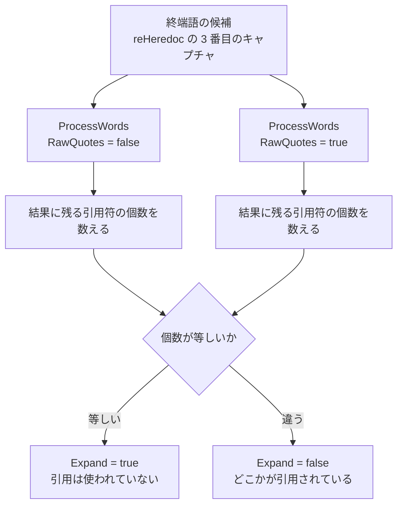

## 何を学んだか

`RUN <<EOT` は本文中の `$VAR` を展開し、`RUN <<'EOT'` は展開しない。sh のこの規則を実装するには「終端語が引用符で囲まれていたか」を知る必要があるが、レキサを通すと引用符は消えてしまう。BuildKit は終端語を **`RawQuotes` を off / on で 2 回レキシングして、結果に含まれる引用符の個数が一致するかを見る**という方法でこれを判定している。

```go title="frontend/dockerfile/parser/parser.go"
	// Attempt to parse both the heredoc both with *and* without quotes.
	// If there are quotes in one but not the other, then we know that some
	// part of the heredoc word is quoted, so we shouldn't expand the content.
	shlex.RawQuotes = false
	words, err := shlex.ProcessWords(rest, emptyEnvs{})
	// ...
	shlex.RawQuotes = true
	wordsRaw, err := shlex.ProcessWords(rest, emptyEnvs{})
	// ...
	word := words[0]
	wordQuoteCount := strings.Count(word, `'`) + strings.Count(word, `"`)
	wordRaw := wordsRaw[0]
	wordRawQuoteCount := strings.Count(wordRaw, `'`) + strings.Count(wordRaw, `"`)

	expand := wordQuoteCount == wordRawQuoteCount
```

([frontend/dockerfile/parser/parser.go L431-L458](https://github.com/moby/buildkit/blob/ca4838f8ddbd3612bca94bcb8a938d8a326110a3/frontend/dockerfile/parser/parser.go#L431-L458))

## なぜ引き算ではなく個数の比較か

`RawQuotes = true` は [shell.Lex](../shell-lex/) に「引用符を結果に残せ」と指示するフラグだ ([`processSingleQuote`](https://github.com/moby/buildkit/blob/ca4838f8ddbd3612bca94bcb8a938d8a326110a3/frontend/dockerfile/shell/lex.go#L246) と `processDoubleQuote` の中で `result.WriteRune(ch)` するかどうかを切り替える)。だから「引用符が使われたか」は素朴には 2 つの結果の長さの差で分かりそうに見える。

ところがエスケープされた引用符がある。`<<eo\'f` の `'` は引用の開始ではなく、ただの文字としての `'` だ。これは `processStopOn` のエスケープ処理で消費されるので、`RawQuotes` の値に関係なく結果に 1 個残る。



実際の値を並べると、なぜ「差」ではなく「個数の一致」なのかが見える。`parser_heredoc_test.go` の 3 ケースがちょうどこの境界を突いている。

| 入力        | `RawQuotes=false` の結果 | 個数 | `RawQuotes=true` の結果 | 個数 | `Expand` |
| ----------- | ------------------------ | ---- | ----------------------- | ---- | -------- |
| `<<eof`     | `eof`                    | 0    | `eof`                   | 0    | `true`   |
| `<<eo\'f`   | `eo'f`                   | 1    | `eo'f`                  | 1    | `true`   |
| `<<eo'f'`   | `eof`                    | 0    | `eo'f'`                 | 2    | `false`  |
| `<<'e'o\'f` | `eo'f`                   | 1    | `'e'o'f`                | 3    | `false`  |

([frontend/dockerfile/parser/parser_heredoc_test.go L259-L282](https://github.com/moby/buildkit/blob/ca4838f8ddbd3612bca94bcb8a938d8a326110a3/frontend/dockerfile/parser/parser_heredoc_test.go#L259-L282))

エスケープされた `'` は両方の欄に等しく 1 を足すので、比較で相殺される。引用として機能した `'` だけが片側にしか現れない。「エスケープされた引用符を除いた引用符が 1 つでもあるか」を、専用のパーサを書かずに 2 回のレキシングと `strings.Count` で判定している。

なお 2 回目のレキシングの前に「1 単語になったか」を確かめている。

```go title="frontend/dockerfile/parser/parser.go"
	// quick sanity check that rest is a single word
	if len(words) != 1 {
		return nil, nil
	}
```

([frontend/dockerfile/parser/parser.go L439-L442](https://github.com/moby/buildkit/blob/ca4838f8ddbd3612bca94bcb8a938d8a326110a3/frontend/dockerfile/parser/parser.go#L439-L442))

`<<'one two'` は引用のおかげで 1 単語になるので heredoc として通り (`Name: "one two"`, `Expand: false`)、引用のない `<<one two` は 2 単語になるので heredoc ではないと判定される。そして両方の結果の単語数が食い違ったら、レキサ自身のバグとして `internal lexing of heredoc produced inconsistent results` で落とす。

## `<<` を見つけるところ

heredoc の検出は 2 段になっている。まず行全体をレキシングして単語に割り、各単語を正規表現に掛ける。

```go title="frontend/dockerfile/parser/parser.go"
var (
	// ...
	reHeredoc     = regexp.MustCompile(`^(\d*)<<(-?)\s*([^<]*)$`)
	reLeadingTabs = regexp.MustCompile(`(?m)^\t+`)
)
```

([frontend/dockerfile/parser/parser.go L118-L123](https://github.com/moby/buildkit/blob/ca4838f8ddbd3612bca94bcb8a938d8a326110a3/frontend/dockerfile/parser/parser.go#L118-L123))

3 つのキャプチャがそのまま `Heredoc` のフィールドになる。先頭の `(\d*)` がファイルディスクリプタ (`RUN 3<<EOF` の `3`)、`(-?)` が chomp 指定 (`<<-EOF`)、残りが終端語。

```go title="frontend/dockerfile/parser/parser.go"
func heredocsFromLine(line string) ([]Heredoc, error) {
	shlex := shell.NewLex('\\')
	shlex.RawQuotes = true
	shlex.RawEscapes = true
	shlex.SkipUnsetEnv = true
	words, _ := shlex.ProcessWords(line, emptyEnvs{})

	var docs []Heredoc
	for _, word := range words {
		heredoc, err := ParseHeredoc(word)
		// ...
	}
	return docs, nil
}
```

([frontend/dockerfile/parser/parser.go L481-L499](https://github.com/moby/buildkit/blob/ca4838f8ddbd3612bca94bcb8a938d8a326110a3/frontend/dockerfile/parser/parser.go#L481-L499))

この 1 段目は情報を消さないように 3 つのフラグを全部立てる。引用符も (`RawQuotes`)、エスケープも (`RawEscapes`)、未定義変数も (`SkipUnsetEnv`) 元のまま残す。判定は 2 段目の `heredocFromMatch` がやるので、ここで壊してはいけない。`RUN <<$EOF` の終端語が `$EOF` のまま残る (テストの期待値も `Name: "$EOF"`) のは `SkipUnsetEnv` のおかげだ。

単語に割る側にも heredoc 専用の分岐がある。`shell.Lex` は `<` を特別扱いする文字として登録している。

```go title="frontend/dockerfile/shell/lex.go"
func (sw *shellWord) processPossibleHeredoc() (string, error) {
	sw.scanner.Next()
	if sw.scanner.Peek() != '<' {
		return "<", nil // not a heredoc
	}
	sw.scanner.Next()

	// heredoc might have whitespace between << and word terminator
	var space bytes.Buffer
	nextCh := sw.scanner.Peek()
	for isWhitespace(nextCh) {
		space.WriteRune(nextCh)
		sw.scanner.Next()
		nextCh = sw.scanner.Peek()
	}
	result := "<<" + space.String()
	return result, nil
}
```

([frontend/dockerfile/shell/lex.go L516-L533](https://github.com/moby/buildkit/blob/ca4838f8ddbd3612bca94bcb8a938d8a326110a3/frontend/dockerfile/shell/lex.go#L516-L533))

`<<` の後の空白を単語の一部として吸い込む。これがないと `RUN <<  EOF` が `<<` と `EOF` の 2 単語に割れて、正規表現に掛からない。返した文字列は `words.addRawString` で追加されるので `inWord` が立ち、続く `EOF` が同じ単語に連結される。`reHeredoc` の `\s*` は、こうして取り込まれた空白を捨てるためにある。

## どの命令で探すか

heredoc 探索を始める条件は 2 つの `and` だ。

```go title="frontend/dockerfile/parser/parser.go"
		if child.canContainHeredoc() && strings.Contains(line, "<<") {
```

([frontend/dockerfile/parser/parser.go L365](https://github.com/moby/buildkit/blob/ca4838f8ddbd3612bca94bcb8a938d8a326110a3/frontend/dockerfile/parser/parser.go#L365))

`strings.Contains` の側は、`<<` が無い大多数の行でレキサを回さないための足切り。本題は `canContainHeredoc` のほうだ。

```go title="frontend/dockerfile/parser/parser.go"
func (node *Node) canContainHeredoc() bool {
	// check for compound commands, like ONBUILD
	if ok := heredocCompoundDirectives[strings.ToLower(node.Value)]; ok {
		if node.Next != nil && len(node.Next.Children) > 0 {
			node = node.Next.Children[0]
		}
	}

	if ok := heredocDirectives[strings.ToLower(node.Value)]; !ok {
		return false
	}
	if isJSON := node.Attributes["json"]; isJSON {
		return false
	}

	return true
}
```

([frontend/dockerfile/parser/parser.go L82-L98](https://github.com/moby/buildkit/blob/ca4838f8ddbd3612bca94bcb8a938d8a326110a3/frontend/dockerfile/parser/parser.go#L82-L98))

許されるのは `ADD` / `COPY` / `RUN` の 3 つだけ。`ONBUILD` は「heredoc を含む命令を含める命令」として別のマップに入っていて、1 段潜って子ノードで再判定する ([../dockerfile-parser/](../dockerfile-parser/) の `parseSubCommand` が作る構造)。

JSON 形式を除外しているのが効いてくる。`RUN ["<<EOF"]` は文字列の中に `<<EOF` があるだけで heredoc ではない。パーサ段で付けた `Attributes["json"]` がここで使われる。同じく `RUN "<<NOHEREDOC"` も、レキサが引用符を `RawQuotes` で残すので単語が `"<<NOHEREDOC"` になり、`^(\d*)<<` に一致しない。

## 本体を読む

条件が満たされると、`Parse` は同じ `scanner` から終端語が来るまで行を読み続ける。

```go title="frontend/dockerfile/parser/parser.go"
			for _, heredoc := range heredocs {
				terminator := []byte(heredoc.Name)
				terminated := false
				var content strings.Builder
				content.WriteString(heredoc.Content)
				for scanner.Scan() {
					bytesRead := scanner.Bytes()
					currentLine++

					possibleTerminator := trimNewline(bytesRead)
					if heredoc.Chomp {
						possibleTerminator = trimLeadingTabs(possibleTerminator)
					}
					if bytes.Equal(possibleTerminator, terminator) {
						terminated = true
						break
					}
					content.Write(bytesRead)
				}
				if !terminated {
					return nil, withLocation(errors.New("unterminated heredoc"), startLine, currentLine)
				}
				// ...
			}
```

([frontend/dockerfile/parser/parser.go L371-L396](https://github.com/moby/buildkit/blob/ca4838f8ddbd3612bca94bcb8a938d8a326110a3/frontend/dockerfile/parser/parser.go#L371-L396))

3 つ、素直でない点がある。

**本文は一切加工しない。** `content.Write(bytesRead)` は改行込みの生バイトを書く。コメントに見える行も読み飛ばさない (テストの `# internal comment` がそのまま `Content` に入る)。`scanLines` が改行を残しているのはこのためだ ([../line-continuation-escape/](../line-continuation-escape/))。

**`Chomp` は終端語の判定にしか使われない。** `<<-EOT` のとき `trimLeadingTabs` されるのは `possibleTerminator` だけで、本文のタブは残る。テストの期待値も `Content: "\tbaz\n\tquux\n", Chomp: true` になっている。本文の chomp は後段の `ChompHeredocContent` が `(?m)^\t+` で一括してやる。パース時に消してしまうと、`Heredoc` から元のバイト列を復元できなくなる。

**複数の heredoc は現れた順に、上から順に読む。** `COPY <<X <<Y /dest` に対して、`X` の本文を読み終えてから `Y` の本文を読む。テストの

```dockerfile
COPY <<X <<Y /dest
Y
X
X
Y
```

の期待値が `X → "Y\n"`、`Y → "X\n"` になるのが証拠で、終端語の照合は現在読んでいる heredoc のものだけと行われる。

## `Expand` が効く先

`Heredoc.Expand` は instructions 層で `SourceContent.Expand` に移される。

```go title="frontend/dockerfile/instructions/parse.go"
		if heredoc := parser.MustParseHeredoc(src); heredoc != nil {
			content := heredocLookup[heredoc.Name].Content
			if heredoc.Chomp {
				content = parser.ChompHeredocContent(content)
			}
			sourceContents = append(sourceContents,
				SourceContent{
					Data:   content,
					Path:   heredoc.Name,
					Expand: heredoc.Expand,
				},
			)
		} else {
			sourcePaths = append(sourcePaths, src)
		}
```

([frontend/dockerfile/instructions/parse.go L292-L306](https://github.com/moby/buildkit/blob/ca4838f8ddbd3612bca94bcb8a938d8a326110a3/frontend/dockerfile/instructions/parse.go#L292-L306))

`COPY` の引数のうち heredoc のものは `SourcePaths` ではなく `SourceContents` に振り分けられる。ファイルパスと無名のファイル内容が別のスライスに分かれるので、後段は「実体のあるファイル」と「Dockerfile に書かれた内容」を型で区別できる。宛先が heredoc だった場合は `errBadHeredoc` で弾かれる。

そして展開の実行は、専用のインターフェースを通る。`SourcesAndDest.ExpandRaw` が `content.Expand` の立っている要素だけを expander に通す ([commands.go L230-L243](https://github.com/moby/buildkit/blob/ca4838f8ddbd3612bca94bcb8a938d8a326110a3/frontend/dockerfile/instructions/commands.go#L230-L243))。`Expand` (通常の変数展開) と `ExpandRaw` の 2 つのインターフェースがあり、呼び出し側は違うレキサを渡す。

```go title="frontend/dockerfile/dockerfile2llb/convert.go"
	if ex, ok := cmd.Command.(instructions.SupportsSingleWordExpansionRaw); ok {
		err := ex.ExpandRaw(func(word string) (string, error) {
			lex := shell.NewLex('\\')
			lex.SkipProcessQuotes = true
			// ...
		})
	}
```

([frontend/dockerfile/dockerfile2llb/convert.go L1051-L1057](https://github.com/moby/buildkit/blob/ca4838f8ddbd3612bca94bcb8a938d8a326110a3/frontend/dockerfile/dockerfile2llb/convert.go#L1051-L1057))

`SkipProcessQuotes = true` が本質だ。heredoc の本文はシェルスクリプトなので、引用符はスクリプトの一部であって Dockerfile の引用ではない。`$VAR` だけを置換し、`'` や `"` には触らずに返す必要がある。インターフェースの型コメントがそう説明している。

```go title="frontend/dockerfile/instructions/commands.go"
// SupportsSingleWordExpansionRaw interface allows a command to support
// variable expansion, while ensuring that minimal transformations are applied
// during expansion, so that quotes and other special characters are preserved.
```

([frontend/dockerfile/instructions/commands.go L102-L105](https://github.com/moby/buildkit/blob/ca4838f8ddbd3612bca94bcb8a938d8a326110a3/frontend/dockerfile/instructions/commands.go#L102-L105))

`RUN` の heredoc は経路が違い、`ShellInlineFile` として `RunCommand.Files` に入る。`dispatchRun` はそれをファイルとして書き出し、シェバンで始まっていれば実行可能ファイルにして `/dev/pipes/` にマウントして実行する。ここには「シェバン付き heredoc に対して展開を選ぶのは意味がないので、指定されていても黙って無視する」というコメントが付いている ([convert.go L1364-L1366](https://github.com/moby/buildkit/blob/ca4838f8ddbd3612bca94bcb8a938d8a326110a3/frontend/dockerfile/dockerfile2llb/convert.go#L1364))。

## なぜそうなっているか

heredoc の終端語の引用規則は、sh が「引用が使われたか」という 1 ビットだけを見るという、パーサとしては変わった仕様だ。素直に実装するなら専用のミニパーサを書いて、引用の開始と終了を追いながら「引用の外にある文字だけを終端語とし、引用が 1 度でも使われたら展開しない」というフラグを立てる。

BuildKit にはすでに `RawQuotes` を持つレキサがある。同じ入力を 2 通りの設定で通して結果を比べれば、そのフラグを外から観測できる。専用のパーサを増やさずに済むだけでなく、引用とエスケープの規則が `shell.Lex` の 1 か所にしか無いままになる。2 つの実装を持つと、片方だけ直したときに `RUN <<EOT` と `RUN echo` で引用の解釈が食い違うようになる。

同じ発想が、`Chomp` を判定にしか使わず本文を無加工で保存するところにも出ている。パース段では入力を減らさず、加工が必要になった層 (`parseSourcesAndDest` と `dispatchRun`) がそれぞれ `ChompHeredocContent` を呼ぶ。パーサの出力を「元に戻せる形」に保っておくと、後から用途が増えたときに情報が足りなくなることがない。

## どう活かすか

**既存のパーサの内部状態は、設定を変えて 2 回通せば外から観測できる。** 「引用符が使われたか」というフラグを返すために API を変えるのではなく、`RawQuotes` の on/off で 2 回呼んで結果を比べる。パースが冪等で副作用がなければ、この手が使える。判定ロジックがレキサ本体に染み出さないので、レキサは他の 20 か所の呼び出し元にとって単純なままでいられる。

**相殺する量を選んで比較する。** エスケープされた引用符が両方に等しく現れるので、個数を比べるだけで「引用として機能した引用符」だけが残る。差分を取る対象を、無視したいノイズが両辺に等しく乗るように選ぶと、除外ロジックを書かずに済むことがある。

**パース段では情報を減らさない。** `Chomp` されていない本文、`SkipUnsetEnv` で残った `$EOF`、`RawEscapes` で残ったバックスラッシュ。どれも「まだ何に使うか決まっていない情報」で、後段が必要になったときに使えるようにしてある。逆に、パース段で正規化してしまった情報は後から復元できない。中間表現は、加工済みの値ではなく元の値 + 加工方法を持たせるほうが寿命が長い。
