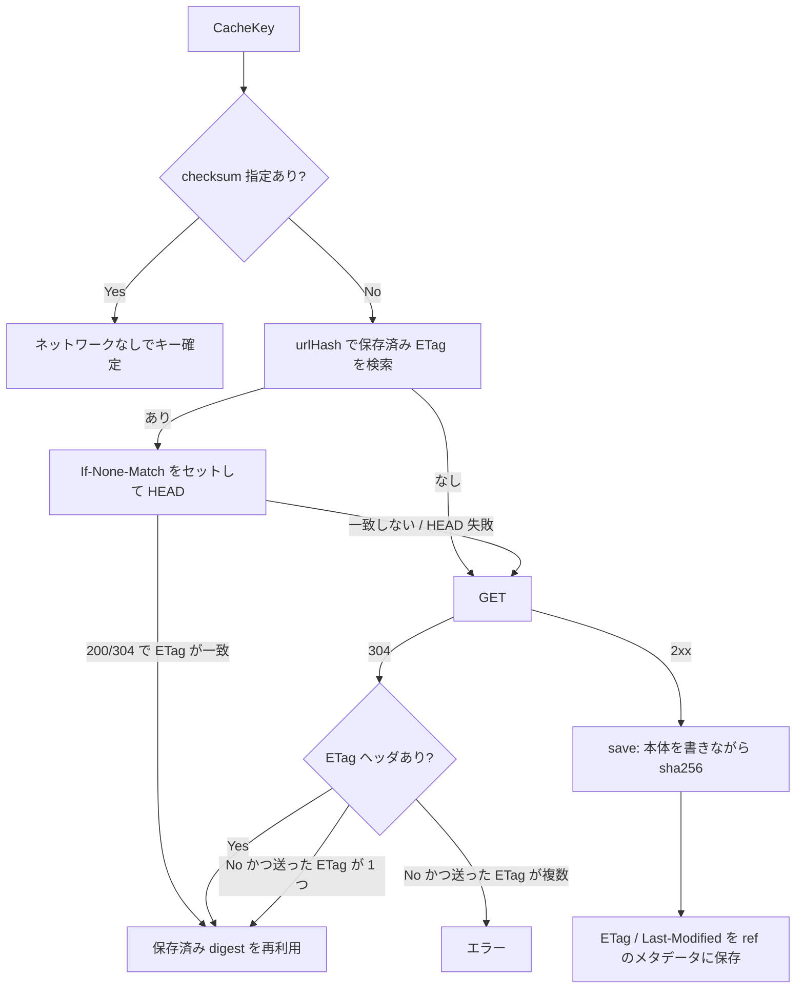

## 何を学んだか

`ADD https://...` の裏側は、キャッシュキーを **ダウンロードした中身の sha256** から作る。URL ではない。だから毎回 URL を叩かないとキーが決まらない — ということにならないよう、3 段の回避が積んである。

1. **`checksum` が指定されていれば、ネットワークに一切触らずキーが決まる。**
2. **保存済み ETag があれば、まず HEAD を打って ETag を手で比べる。** `If-None-Match` を送っているのに 200 を返してくるサーバがいるので、GET の前に HEAD で確かめる。
3. **304 が返ってきても ETag ヘッダが無いことがある。** 1 つしか ETag を送っていないなら「その 1 つのことだ」と補完する。

2 と 3 はどちらも実装のコメントに理由が書いてある。RFC どおりのサーバだけを相手にしていたら要らないコードだ。

## キャッシュキーは 2 つのハッシュでできている

内部用と外部用でハッシュが分かれている。内部用が `urlHash` で、これは「同じ URL・同じ属性の過去のダウンロード結果」を引くためのインデックスキーだ。

```go title="source/http/source.go"
// urlHash is internal hash the etag is stored by that doesn't leak outside
// this package.
func (hs *httpSourceHandler) urlHash() (digest.Digest, error) {
	dt, err := json.Marshal(struct {
		Filename         []byte
		Perm, UID, GID   int
		AuthHeaderSecret string `json:",omitempty"`
		Header           []HeaderField
	}{
		Filename: bytes.Join([][]byte{
			[]byte(hs.src.URL),
			[]byte(hs.src.Filename),
		}, []byte{0}),
		// ...
```

([source/http/source.go L218-L241](https://github.com/moby/buildkit/blob/ca4838f8ddbd3612bca94bcb8a938d8a326110a3/source/http/source.go#L218-L241))

`Filename` フィールドに URL とファイル名を NUL 区切りで詰めているのは、構造体のフィールド名が実態と合っていない。URL が変われば別のインデックスになる、というのが目的だ。

外部に出るキャッシュキーは `formatCacheKey` で、**URL を含まない**。

```go title="source/http/source.go"
func (hs *httpSourceHandler) formatCacheKey(filename string, dgst digest.Digest, lastModTime *time.Time) digest.Digest {
	// ...
	dt, err := json.Marshal(struct {
		Filename         string
		Perm, UID, GID   int
		Checksum         digest.Digest
		LastModTime      string        `json:",omitempty"`
		AuthHeaderSecret string        `json:",omitempty"`
		Header           []HeaderField `json:",omitempty"`
	}{
```

([source/http/source.go L243-L272](https://github.com/moby/buildkit/blob/ca4838f8ddbd3612bca94bcb8a938d8a326110a3/source/http/source.go#L243-L272))

入るのは中身の digest・保存先のファイル名・パーミッション・所有者・`Last-Modified`。URL が違ってもバイト列が同じなら同じキーになる。ミラーを切り替えてもキャッシュが効く、という設計だ。

`Last-Modified` がキーに入っているのは、ファイルの mtime としてスナップショットに焼き込まれるからだ ([L807-L817](https://github.com/moby/buildkit/blob/ca4838f8ddbd3612bca94bcb8a938d8a326110a3/source/http/source.go#L807-L817))。中身が同じでも mtime が違えばスナップショットが違うので、キーも違わなければならない。

## checksum を指定するとネットワークが消える

`CacheKey` の入口は `resolveMetadata` → `resolveMetadataStatic` で、最初の分岐がこれだ。

```go title="source/http/source.go"
func (hs *httpSourceHandler) resolveMetadataStatic(ctx context.Context, jobCtx solver.JobContext) (*Metadata, error) {
	if hs.src.Checksum != "" {
		return &Metadata{
			Digest:   hs.src.Checksum,
			Filename: getFileName(hs.src.URL, hs.src.Filename, nil),
		}, nil
	}
	// ...
	return hs.resolveMetadataRef(ctx, jobCtx)
}
```

([source/http/source.go L292-L303](https://github.com/moby/buildkit/blob/ca4838f8ddbd3612bca94bcb8a938d8a326110a3/source/http/source.go#L292-L303))

`ADD --checksum=sha256:... https://...` を書くと、`Digest` はユーザが宣言した値そのままになる。`formatCacheKey` はこの digest とファイル名から作られるので、**HTTP リクエストを 1 本も出さずにキャッシュキーが確定する**。キーが既存のキャッシュにヒットすれば `Snapshot` も呼ばれない。

`Snapshot` に落ちたときは、実際にダウンロードした digest と宣言値を突き合わせる。

```go title="source/http/source.go"
	if hs.resolved != nil && dgst != hs.resolved.Digest {
		ref.Release(context.TODO())
		return nil, errors.Errorf("digest mismatch %s: %s", dgst, hs.resolved.Digest)
	}
```

([source/http/source.go L904-L907](https://github.com/moby/buildkit/blob/ca4838f8ddbd3612bca94bcb8a938d8a326110a3/source/http/source.go#L904-L907))

checksum の指定は「速くする指定」ではなく「ピン留めの宣言」だが、副作用として resolve フェーズのネットワークアクセスがゼロになる。ビルドの再現性とビルドの速さが同じ 1 つの指定から出てくる。

## 条件付き GET は「HEAD で手で比べる」から始まる

checksum が無いときは、`urlHash` で過去の ref を探し、そこに保存された ETag を全部 `If-None-Match` に載せる。

```go title="source/http/source.go"
	// If we request a single ETag in 'If-None-Match', some servers omit the
	// unambiguous ETag in their response.
	// See: https://github.com/moby/buildkit/issues/905
	var onlyETag string
	// ...
		if len(m) > 0 {
			etags := make([]string, 0, len(m))
			for t := range m {
				etags = append(etags, t)
			}
			req.Header.Set("If-None-Match", strings.Join(etags, ", "))

			if len(etags) == 1 {
				onlyETag = etags[0]
			}
		}
```

([source/http/source.go L368-L398](https://github.com/moby/buildkit/blob/ca4838f8ddbd3612bca94bcb8a938d8a326110a3/source/http/source.go#L368-L398))

ETag が複数あるのは、同じ URL でも `Accept-Encoding` などで別のバイト列が返ってきた履歴があるからだ。

そして条件付き GET を打つ前に、まず HEAD を打つ。

```go title="source/http/source.go"
	// Some servers seem to have trouble supporting If-None-Match properly even
	// though they return ETag-s. So first, optionally try a HEAD request with
	// manual ETag value comparison.
	if len(m) > 0 {
		req.Method = "HEAD"
		// we need to add accept-encoding header manually because stdlib only adds it to GET requests
		// some servers will return different etags if Accept-Encoding header is different
		req.Header.Set("Accept-Encoding", "gzip")
		resp, err := client.Do(req)
		if err == nil {
			if resp.StatusCode == http.StatusOK || resp.StatusCode == http.StatusNotModified {
				respETag := etagValue(resp.Header.Get("ETag"))

				// If a 304 is returned without an ETag and we had only sent one ETag,
				// the response refers to the ETag we asked about.
				if respETag == "" && onlyETag != "" && resp.StatusCode == http.StatusNotModified {
					respETag = onlyETag
				}
				md, ok := m[respETag]
```

([source/http/source.go L403-L421](https://github.com/moby/buildkit/blob/ca4838f8ddbd3612bca94bcb8a938d8a326110a3/source/http/source.go#L403-L421))

コメントの言うとおり、**「ETag は返すのに `If-None-Match` を正しく扱えないサーバ」がいる**。そういうサーバは 200 とボディ全体を返してしまう。HEAD ならボディが来ないので、200 が返っても損はない。返ってきた ETag をこちら側の手で map と突き合わせて、一致すれば保存済みの digest をそのまま使う。

`Accept-Encoding: gzip` を手で足しているのも実利的な理由が書いてある。Go の stdlib は GET にしかこのヘッダを自動で付けないが、サーバによっては `Accept-Encoding` の値で ETag を変える。HEAD と GET で違うヘッダを送ると違う ETag が返ってきて比較が成立しない。

HEAD で決まらなかったら GET に切り替える。このとき `Accept-Encoding` は明示的に消す。

```go title="source/http/source.go"
		req.Method = "GET"
		// Unset explicit Accept-Encoding for GET, otherwise the go http library will not
		// transparently decompress the response body when it is gzipped. It will still add
		// this header implicitly when the request is made though.
		req.Header.Del("Accept-Encoding")
```

([source/http/source.go L450-L454](https://github.com/moby/buildkit/blob/ca4838f8ddbd3612bca94bcb8a938d8a326110a3/source/http/source.go#L450-L454))

明示的に設定すると stdlib は「アプリが自分で圧縮を扱う」と判断して透過展開をやめる。消せば stdlib が暗黙に付けて展開までやってくれる。

GET の結果が 304 のときにも、ETag が無い場合の補完が入る。

```go title="source/http/source.go"
	if resp.StatusCode == http.StatusNotModified {
		respETag := etagValue(resp.Header.Get("ETag"))
		if respETag == "" && onlyETag != "" {
			respETag = onlyETag

			// Set the missing ETag header on the response so that it's available
			// to .save()
			resp.Header.Set("ETag", onlyETag)
		}
		md, ok := m[respETag]
		if !ok {
			return nil, errors.Errorf("invalid not-modified ETag: %v", respETag)
		}
```

([source/http/source.go L465-L477](https://github.com/moby/buildkit/blob/ca4838f8ddbd3612bca94bcb8a938d8a326110a3/source/http/source.go#L465-L477))

補完するのは `onlyETag` が空でないとき、つまり **こちらが 1 つしか ETag を送っていないとき**だけだ。複数送っていたら「どれが一致したのか」が特定できないので、補完せずに `invalid not-modified ETag` で落とす。安全側に倒れている。

弱い ETag (`W/"..."`) の扱いは 1 行だ。

```go title="source/http/source.go"
func etagValue(v string) string {
	// remove weak for direct comparison
	return strings.TrimPrefix(v, "W/")
}
```

([source/http/source.go L1057-L1060](https://github.com/moby/buildkit/blob/ca4838f8ddbd3612bca94bcb8a938d8a326110a3/source/http/source.go#L1057-L1060))

RFC 上は weak と strong を区別すべきだが、ここでの用途は「前回と同じバイト列か」の判定なので、prefix を落として同一視している。



## 保存するのは ETag があるときだけ

`save` はレスポンスボディを書きながら同時に sha256 を取る。

```go title="source/http/source.go"
	h := sha256.New()

	if _, err := io.Copy(io.MultiWriter(f, h), resp.Body); err != nil {
```

([source/http/source.go L781-L785](https://github.com/moby/buildkit/blob/ca4838f8ddbd3612bca94bcb8a938d8a326110a3/source/http/source.go#L781-L785))

そのあとのメタデータ保存で、ETag と checksum は**セットでしか保存されない**。

```go title="source/http/source.go"
	if respETag := resp.Header.Get("ETag"); respETag != "" {
		respETag = etagValue(respETag)
		if err := md.setETag(respETag); err != nil {
			return nil, "", err
		}
		uh, err := hs.urlHash()
		// ...
		if err := md.setHTTPChecksum(uh, dgst); err != nil {
			return nil, "", err
		}
	}
```

([source/http/source.go L831-L843](https://github.com/moby/buildkit/blob/ca4838f8ddbd3612bca94bcb8a938d8a326110a3/source/http/source.go#L831-L843))

インデックスを張るのは `setHTTPChecksum` のほうで、第 2 引数の `urlDgst` がインデックス値になる ([L1037-L1039](https://github.com/moby/buildkit/blob/ca4838f8ddbd3612bca94bcb8a938d8a326110a3/source/http/source.go#L1037-L1039))。つまり **ETag を返さないサーバの結果は、次回の検索に引っかからない**。ETag が無ければ条件付き GET ができず、鮮度を確かめる手段がないからだ。`Last-Modified` は保存されるが、`If-Modified-Since` を送る経路は無い — 条件付き GET は ETag 一本槍になっている。

## ファイル名の決め方

```go title="source/http/source.go"
func getFileName(urlStr, manualFilename string, resp *http.Response) string {
	if manualFilename != "" {
		return pathutil.SafeFileName(manualFilename)
	}
	if resp != nil {
		if contentDisposition := resp.Header.Get("Content-Disposition"); contentDisposition != "" {
			// ...
		}
	}
	u, err := url.Parse(urlStr)
	if err == nil {
		if base := path.Base(u.Path); base != "." && base != "/" {
			return pathutil.SafeFileName(base)
		}
	}
	return pathutil.SafeFileName("")
}
```

([source/http/source.go L987-L1009](https://github.com/moby/buildkit/blob/ca4838f8ddbd3612bca94bcb8a938d8a326110a3/source/http/source.go#L987-L1009))

優先順は「明示指定 → `Content-Disposition` → URL パスの末尾」。ここで重要なのは、最後の候補が **リダイレクト後の URL ではなく元の URL** から取られていることだ。第 1 引数は常に `hs.src.URL` で渡されている。Go の `http.Client` はデフォルトでリダイレクトを追うので、`https://example.com/latest` が `.../v1.2.3/foo.tar.gz` に飛ばされてもファイル名は `latest` になる。ファイル名がキャッシュキーに入る以上、**リダイレクト先が変わってもキーの構成要素が揺れない**ほうが都合がいい。リダイレクト先の名前を使いたければ、サーバが `Content-Disposition` を返すか、ユーザが `--opt filename=` を書くかのどちらかになる。

なお `SafeFileName` を必ず通しているので、`../` を含むファイル名でスナップショットの外に書き出すことはできない。

## セッション上の URL も同じコードを通る

`http://buildkit-session/...` という特別なホスト名だけ、通常の transport ではなくセッション越しの upload に振り替えられる。

```go title="source/http/transport.go"
func (h *sessionHandler) RoundTrip(req *http.Request) (*http.Response, error) {
	if req.URL.Host != "buildkit-session" {
		return h.rt.RoundTrip(req)
	}
	// ...
	resp = &http.Response{
		Status:        "200 OK",
		StatusCode:    http.StatusOK,
		Body:          pr,
		ContentLength: -1,
	}
```

([source/http/transport.go L23-L50](https://github.com/moby/buildkit/blob/ca4838f8ddbd3612bca94bcb8a938d8a326110a3/source/http/transport.go#L23-L50))

`RoundTripper` に挿し込んでいるので、ETag のロジックもファイル名の決定も丸ごと再利用される。ETag は返らないので必ず毎回転送されるが、それは正しい振る舞いだ。

## なぜそうなっているか

http source のコード量の大半が「サーバの仕様違反への対処」に費やされている。BuildKit が相手にするのは自分が運用するサーバではなく、Dockerfile に書かれた任意の URL だ。GitHub Releases、S3、社内の Nexus、素の nginx、CDN — どれも ETag の扱いが微妙に違う。**サーバ側を直せないので、クライアント側で全部吸収するしかない**。

その上で、正しい答えは常に `save` が計算した sha256 に収束するようになっている。ETag の比較が間違ったところで、比較に使うのは「同じ URL の過去のダウンロード結果」であり、そのバイト列の digest は実測値だ。キャッシュキーが URL でなく中身の digest なので、ETag の推測が外れても間違った中身がキーに紐づくことはない。**推測は帯域の節約にだけ効き、正しさは別の層で担保されている**。

`checksum` があればネットワークを飛ばせるのは、この構造の当然の帰結だ。キーの材料が中身の digest で、それをユーザが宣言しているなら、確かめる必要はない。確かめるのは実際にダウンロードするときだけでいい。

## どう活かすか

- **キャッシュキーは「取ってくる場所」ではなく「取ってきた中身」から作る。** URL をキーにすると、ミラーを変えただけでキャッシュが飛ぶし、URL が同じで中身が変わったときに気づけない。
- **ユーザが中身を宣言できる口を作ると、鮮度確認そのものが不要になる。** `--checksum` は安全性のための機能に見えて、実は resolve フェーズのネットワーク往復を丸ごと消す最適化でもある。
- **外部サーバの条件付きリクエストは信用しない。** 「304 を返してくるはず」を前提にせず、200 が返ってきても壊れない経路を用意する。HEAD で先に確かめるのは安いヘッジだ。
- **推測が外れても正しさが壊れない層構造にしておく。** ここでは ETag は「ダウンロードを省けるか」の判断にしか使われず、最終的な同一性判定は実測 digest が担う。推測の精度と正しさを切り離せば、推測を大胆にできる。
