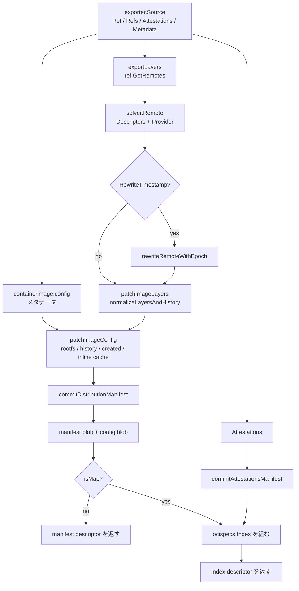

## 何を学んだか

`type=image` / `type=oci` / `type=docker` の 3 つのエクスポータは、成果物を組み立てる部分をまったく共有している。実体は `exporter/containerimage/writer.go` の `(*ImageWriter).Commit` 1 本で、ここが「ref → blob → config → manifest → index」の全部をやる。3 者の違いは `Commit` の**外側**にしかない。image はイメージストアへの名前付けと push、oci/docker は tar かセッション経由のコンテンツストアへの書き出しだ。

そして `Commit` の中で一番の分岐は **manifest を返すか index を返すか**で、これは「複数プラットフォームか」だけでは決まらない。単一プラットフォームでも attestation が付いていれば index になる。

## 入口 — Export は Commit を呼ぶだけ

```go title="exporter/containerimage/export.go"
func (e *imageExporterInstance) Export(ctx context.Context, src *exporter.Source, buildInfo exporter.ExportBuildInfo) (_ map[string]string, _ exporter.FinalizeFunc, descref exporter.DescriptorReference, err error) {
	// ...
	opts.SetOCITypesDefault(DefaultOCITypes(buildInfo.CompatibilityVersion, src))
	opts.SetOCIArtifactDefault(DefaultOCIArtifact(buildInfo.CompatibilityVersion, &opts))
	// ...
	desc, err := e.opt.ImageWriter.Commit(ctx, src, buildInfo.SessionID, buildInfo.InlineCache, &opts, buildInfo.CompatibilityVersion, e.Type())
```

([exporter/containerimage/export.go L223-L258](https://github.com/moby/buildkit/blob/ca4838f8ddbd3612bca94bcb8a938d8a326110a3/exporter/containerimage/export.go#L223-L258))

`Commit` が返すのは `*ocispecs.Descriptor` 1 個。マニフェストか index かはこの descriptor の `MediaType` を見ないと分からない。

## ref から blob を作る

レイヤの blob 化は `exportLayers` に閉じている。やっていることは各 ref に `GetRemotes` を呼ぶだけで、圧縮の実体や既存 blob の再利用は [overlayfs と差分の取り方](../overlayfs-diff/) と [圧縮バリアント](../compression-variants/) の担当だ。

```go title="exporter/containerimage/writer.go"
span, ctx := tracing.StartSpan(ctx, "export layers", trace.WithAttributes(attr...))
eg, ctx := errgroup.WithContext(ctx)
layersDone := progress.OneOff(ctx, "exporting layers")
out := make([]solver.Remote, len(refs))
for i, ref := range refs {
	// ...
	eg.Go(func() error {
		remotes, err := ref.GetRemotes(ctx, true, refCfg, false, s)
		// ...
		out[i] = *remotes[0]
		return nil
	})
}
```

([exporter/containerimage/writer.go L381-L416](https://github.com/moby/buildkit/blob/ca4838f8ddbd3612bca94bcb8a938d8a326110a3/exporter/containerimage/writer.go#L381-L416))

`solver.Remote` は `Descriptors []ocispecs.Descriptor` と `Provider` の組。**diffID は独立に計算されているのではなく、descriptor の annotation として運ばれている。**

```go title="exporter/containerimage/writer.go"
var rootFS ocispecs.RootFS
rootFS.Type = "layers"
for _, desc := range descs {
	rootFS.DiffIDs = append(rootFS.DiffIDs, digest.Digest(desc.Annotations[labels.LabelUncompressed]))
}
```

([exporter/containerimage/writer.go L770-L774](https://github.com/moby/buildkit/blob/ca4838f8ddbd3612bca94bcb8a938d8a326110a3/exporter/containerimage/writer.go#L770-L774))

`labels.LabelUncompressed` は containerd の `containerd.io/uncompressed`。圧縮 blob の digest（manifest の `layers[]` に入る）と非圧縮 tar の digest（config の `rootfs.diff_ids` に入る）の対応を、annotation 1 個が繋いでいる。

この annotation は内部用なので、manifest に書き出す直前で落とされる。

```go title="exporter/containerimage/writer.go"
func RemoveInternalLayerAnnotations(in map[string]string, oci bool) map[string]string {
	if len(in) == 0 || !oci {
		return nil
	}
	// ...
		// oci supports annotations but don't export internal annotations
		switch k {
		case labels.LabelUncompressed, "buildkit/createdat":
			continue
		default:
			if strings.HasPrefix(k, "containerd.io/distribution.source.") {
				continue
			}
```

([exporter/containerimage/writer.go L930-L948](https://github.com/moby/buildkit/blob/ca4838f8ddbd3612bca94bcb8a938d8a326110a3/exporter/containerimage/writer.go#L930-L948))

Docker メディアタイプのときは `oci == false` なので annotation を丸ごと捨てる。Docker schema2 の descriptor には annotation の場所が無いからだ。

## config を組み立てる — History とレイヤ数を合わせる

イメージ config はフロントエンドが `containerimage.config` メタデータとして渡してくる。エクスポータはそれを**パッチする**。config が無ければ `defaultImageConfig` が最低限のもの（プラットフォーム、`RootFS.Type`、`WorkingDir`、`PATH`）を合成する（[writer.go L704-L721](https://github.com/moby/buildkit/blob/ca4838f8ddbd3612bca94bcb8a938d8a326110a3/exporter/containerimage/writer.go#L704-L721)）。

面白いのは `normalizeLayersAndHistory` だ。フロントエンドが渡す `history` の項目数と、実際に出来たレイヤの枚数は一致しない可能性がある。`EmptyLayer: true` の項目（`ENV` や `WORKDIR` のようなレイヤを作らない命令）を除いた数が、レイヤ数と合っていなければならない。

```go title="exporter/containerimage/writer.go"
if historyLayers > len(remote.Descriptors) {
	// this case shouldn't happen but if it does force set history layers empty
	// from the bottom
	bklog.G(ctx).Warn("invalid image config with unaccounted layers")
	// ...
}

if len(remote.Descriptors) > historyLayers {
	// some history items are missing. add them based on the ref metadata
	for _, md := range refMeta[historyLayers:] {
		history = append(history, ocispecs.History{
			Created:   md.createdAt,
			CreatedBy: md.description,
			Comment:   "buildkit.exporter.image.v0",
		})
	}
}
```

([exporter/containerimage/writer.go L853-L880](https://github.com/moby/buildkit/blob/ca4838f8ddbd3612bca94bcb8a938d8a326110a3/exporter/containerimage/writer.go#L853-L880))

足りない分は ref のメタデータから補う。`refMeta` は `LayerChain()` を辿って各レイヤの `GetDescription()` と `GetCreatedAt()` を集めたもので、`CreatedBy` に入るのはキャッシュレコードに記録された説明文だ。「フロントエンドが history を出さなくても、レイヤの数だけは history の行が立つ」ことを保証している。

`created` の決め方はやや込み入っている。

```go title="exporter/containerimage/writer.go"
// Find the first new layer time. Otherwise, the history item for a first
// metadata command would be the creation time of a base image layer.
// If there is no such then the last layer with timestamp.
```

([exporter/containerimage/writer.go L893-L895](https://github.com/moby/buildkit/blob/ca4838f8ddbd3612bca94bcb8a938d8a326110a3/exporter/containerimage/writer.go#L893-L895))

ベースイメージから来た history 項目は元の時刻を持っているので、そのまま前方に埋めると「`ENV` を書いただけの行にベースイメージの古い時刻が入る」ことになる。そこで「時刻が無い項目が 1 つでも現れたあとの、最初の時刻付き項目」を基準にして埋め戻す。

config トップレベルの `created` は、明示されていなければ history の最後の時刻を採る。

```go title="exporter/containerimage/writer.go"
if _, ok := m["created"]; !ok {
	var tm *time.Time
	for _, h := range history {
		if h.Created != nil {
			tm = h.Created
		}
	}
	dt, err = json.Marshal(&tm)
	// ...
	m["created"] = dt
}
```

([exporter/containerimage/writer.go L817-L829](https://github.com/moby/buildkit/blob/ca4838f8ddbd3612bca94bcb8a938d8a326110a3/exporter/containerimage/writer.go#L817-L829))

`patchImageConfig` が `map[string]json.RawMessage` を経由しているのも意図的だ。`ocispecs.Image` に無いキー（後述の `moby.buildkit.cache.v0` や、フロントエンドが独自に足したフィールド）を落とさずに、`rootfs` / `history` / `created` だけを差し替える。

インラインキャッシュも config の非標準キーとして埋め込まれる。

```go title="exporter/containerimage/writer.go"
if cache != nil {
	dt, err := json.Marshal(cache.Data)
	// ...
	m["moby.buildkit.cache.v0"] = dt
}
```

([exporter/containerimage/writer.go L831-L837](https://github.com/moby/buildkit/blob/ca4838f8ddbd3612bca94bcb8a938d8a326110a3/exporter/containerimage/writer.go#L831-L837))

## manifest か index か

`Commit` の冒頭で `isMap` が決まる。名前どおり「refs マップを持っているか」＝複数プラットフォームか、が起点だが、そのあとで attestation の有無によって昇格する。

```go title="exporter/containerimage/writer.go"
isMap := len(inp.Refs) > 0
// ...
if !isMap {
	// enable index if we need to include attestations
	for _, p := range ps.Platforms {
		if atts, ok := inp.Attestations[p.ID]; ok {
			if !opts.ForceInlineAttestations {
				// if we don't need force inline attestations (for oci
				// exporter), filter them out
				atts = attestation.Filter(atts, nil, map[string][]byte{
					result.AttestationInlineOnlyKey: []byte(strconv.FormatBool(true)),
				})
			}
			if len(atts) > 0 {
				isMap = true
				break
			}
		}
	}
}
```

([exporter/containerimage/writer.go L80-L104](https://github.com/moby/buildkit/blob/ca4838f8ddbd3612bca94bcb8a938d8a326110a3/exporter/containerimage/writer.go#L80-L104))

`ForceInlineAttestations` は image エクスポータでは `Resolve` の初期値で `true`（[export.go L81](https://github.com/moby/buildkit/blob/ca4838f8ddbd3612bca94bcb8a938d8a326110a3/exporter/containerimage/export.go#L81)）、oci エクスポータでは既定値の `false`。「レジストリに push するなら attestation を必ず付ける、tar に落とすだけなら `inline-only` のものは落とす」という差になっている。

単一の場合は `commitDistributionManifest` の結果をそのまま返し、`platform` と config digest の annotation を足すだけ。

```go title="exporter/containerimage/writer.go"
mfstDesc.Annotations[exptypes.ExporterConfigDigestKey] = configDesc.Digest.String()
return mfstDesc, nil
```

([exporter/containerimage/writer.go L196-L204](https://github.com/moby/buildkit/blob/ca4838f8ddbd3612bca94bcb8a938d8a326110a3/exporter/containerimage/writer.go#L196-L204))

複数の場合はプラットフォームごとに `commitDistributionManifest` を回して `idx.Manifests` に積み、attestation マニフェストを**そのあとに**足す。

```go title="exporter/containerimage/writer.go"
for i, mfst := range attestationManifests {
	idx.Manifests = append(idx.Manifests, mfst)
	labels[fmt.Sprintf("containerd.io/gc.ref.content.%d", len(ps.Platforms)+i)] = mfst.Digest.String()
}
```

([exporter/containerimage/writer.go L354-L357](https://github.com/moby/buildkit/blob/ca4838f8ddbd3612bca94bcb8a938d8a326110a3/exporter/containerimage/writer.go#L354-L357))

`containerd.io/gc.ref.content.N` ラベルが至るところに付いているのは containerd の GC 用で、「この blob はこれらの blob を参照している」という辺を張っている。index → manifest、manifest → config / layers の順に張られる。



## メディアタイプの既定値 — compatibility-version が効く

```go title="exporter/containerimage/export.go"
// DefaultOCITypes returns the default media type behavior for image exports.
func DefaultOCITypes(compatibilityVersion int, src *exporter.Source) bool {
	if compatibilityVersion >= compat.CompatibilityVersion031 {
		return true
	}
	return len(src.Attestations) > 0
}
```

([exporter/containerimage/export.go L586-L592](https://github.com/moby/buildkit/blob/ca4838f8ddbd3612bca94bcb8a938d8a326110a3/exporter/containerimage/export.go#L586-L592))

`CompatibilityVersion031` は `30`。現行版では `oci-mediatypes` 未指定なら OCI メディアタイプになるが、`20`（v0.15.0〜v0.31.x 相当）では「attestation があるときだけ OCI、無ければ Docker」だった。attestation は OCI メディアタイプを必須とするので、そこだけ例外になっていた。この既定値の切り替えは出力の digest を変えるので、`compatibility-version` で固定できるようになっている（[互換性とキャッシュダイジェスト](../compat-and-cachedigest/)）。

oci エクスポータは無条件に OCI 側へ倒す。

```go title="exporter/oci/export.go"
func (e *imageExporterInstance) defaultOCITypes(compatibilityVersion int, src *exporter.Source) bool {
	if e.opt.Variant == VariantOCI {
		return true
	}
	return containerimage.DefaultOCITypes(compatibilityVersion, src)
}
```

([exporter/oci/export.go L302-L307](https://github.com/moby/buildkit/blob/ca4838f8ddbd3612bca94bcb8a938d8a326110a3/exporter/oci/export.go#L302-L307))

## image エクスポータ固有の部分 — name / store / push

`Commit` から戻ったあと、image エクスポータは 3 つの仕事をする。

**name**: `name` オプションはカンマ区切りで複数指定できる。`name-canonical` が立っていれば `name@sha256:...` の形も追加で登録する。`dangling-name-prefix` があれば `<prefix>@<digest>` を足す。

```go title="exporter/containerimage/export.go"
for _, sfx := range sfx {
	img.Name = targetName + sfx
	for { // handle possible race between Update and Create
		if _, err := e.opt.Images.Update(imageClientCtx, img); err != nil {
			if !errors.Is(err, cerrdefs.ErrNotFound) {
				return nil, nil, nil, tagDone(err)
			}
			if _, err := e.opt.Images.Create(imageClientCtx, img); err != nil {
				if !errors.Is(err, cerrdefs.ErrAlreadyExists) {
					return nil, nil, nil, tagDone(err)
				}
				continue
			}
		}
		break
	}
}
```

([exporter/containerimage/export.go L301-L322](https://github.com/moby/buildkit/blob/ca4838f8ddbd3612bca94bcb8a938d8a326110a3/exporter/containerimage/export.go#L301-L322))

`Update` → 無ければ `Create` → 既にあれば `Update` へ戻る、という無限ループの形。イメージストアに upsert が無いための回避策だ。

**store**: `store=true`（既定）でイメージストアがあるときだけ登録する。このとき、遅延取得のままの blob をすべて実体化する。

```go title="exporter/containerimage/export.go"
if unlazier, ok := remote.Provider.(cache.Unlazier); ok {
	if err := unlazier.Unlazy(ctx); err != nil {
		return err
	}
}
```

([exporter/containerimage/export.go L357-L361](https://github.com/moby/buildkit/blob/ca4838f8ddbd3612bca94bcb8a938d8a326110a3/exporter/containerimage/export.go#L357-L361))

イメージストアに登録した以上「参照は解決できるが blob が無い」状態は許されない。[lazy ref](../lazy-ref/) を潰しに行く。

**push**: [Export と Finalize の 2 相分割](../export-finalize/) のとおり、push 対象の名前を集めてクロージャに包むだけで、`Export` の中では送らない。

## oci / docker / tar / local の違い

`type=oci` と `type=docker` は `ImageWriter.Commit` まで同じで、そのあと containerd の `archiveexporter` で OCI レイアウトまたは docker-archive の tar を作り、セッション経由でクライアントに流す。`tar=false` を指定するとセッションのコンテンツストアに直接 blob をコピーする。docker バリアントはマニフェストリストを扱えない。

```go title="exporter/oci/export.go"
if e.opt.Variant == VariantDocker && len(src.Refs) > 0 {
	return nil, nil, nil, errors.New("docker exporter does not currently support exporting manifest lists")
}
```

([exporter/oci/export.go L134-L136](https://github.com/moby/buildkit/blob/ca4838f8ddbd3612bca94bcb8a938d8a326110a3/exporter/oci/export.go#L134-L136))

`type=local` と `type=tar` は**イメージをまったく作らない**。ref をマウントして fsutil の FS として見せ、ファイルツリーをそのままクライアントへ送る。共通処理は `exporter/local/fs.go` の `CreateFS` にあり、tar エクスポータもこれを呼ぶ。attestation はイメージのレイヤではなく `provenance.json` のようなファイルとして FS に足される。

```go title="exporter/local/fs.go"
stmtFS := staticfs.NewFS()
// ...
outputFS = staticfs.NewMergeFS(outputFS, stmtFS)
```

([exporter/local/fs.go L188-L220](https://github.com/moby/buildkit/blob/ca4838f8ddbd3612bca94bcb8a938d8a326110a3/exporter/local/fs.go#L188-L220))

複数プラットフォームのときは `platform-split` オプションでサブディレクトリに分けるか、ファイル名にプラットフォームを埋め込むかを選ぶ。分けない場合は重複パスを検出してエラーにする。

## なぜそうなっているか

**`Commit` が 1 本に集約されているのは、出力先が違ってもイメージの中身は同じでなければならないから。** `type=image` で push したものと `type=oci` で tar に落としたものの digest がずれると、「ローカルで確認してから push する」というワークフローが壊れる。組み立てを共有し、違いを「どこへ書くか」だけに閉じ込めれば、この一致は構造的に保証される。

**config を作り直さずパッチしているのは、フロントエンドが config の所有者だから。** Dockerfile フロントエンドは `ENV` / `CMD` / `LABEL` をすべて自分で解釈して config を組む。エクスポータが知っているのは「実際に出来たレイヤの digest」と「ref に記録された各レイヤの説明と時刻」だけで、これは config の `rootfs` と `history` にしか関係しない。`json.RawMessage` のマップを経由するのは、エクスポータが知らないフィールドを保存するためだ。

**attestation があると単一プラットフォームでも index になるのは、attestation マニフェストを吊るす場所が index にしか無いから。** 詳細は [attestation の格納](../attestation-storage/) に譲るが、この「1 個しか無いのに index」という形は OCI 仕様の中では珍しく、レジストリ互換性の都合を引き受けた結果になっている。

## どう活かすか

- **出力フォーマットが複数あるとき、「組み立て」と「配送」の境目を 1 本の関数で切る。** BuildKit の境目は `ImageWriter.Commit` で、その戻り値は `*ocispecs.Descriptor` 1 個。組み立て側が配送先を一切知らないので、エクスポータを足すコストが「Commit を呼んで結果をどこかへ書く」だけになる。
- **中間形式に内部専用フィールドを載せるなら、出口で落とす関数を 1 個作る。** `RemoveInternalLayerAnnotations` のように「外に出さないキーの一覧」を 1 か所に集めると、内部で annotation を増やすのが怖くなくなる。
- **上流が渡してくるデータと、自分が知っている事実の整合を明示的に取る。** history の項目数とレイヤ数のように、片方だけでは決まらない不変条件は、「多すぎる場合」と「少なすぎる場合」の両方に処理を書いておく。BuildKit は多すぎる場合を「起きないはず」としつつ警告ログ＋強制修正で通している。
- **既定値がハッシュを変えるものは、既定値そのものをバージョン付きで切り替えられるようにする。** `DefaultOCITypes` が `compatibilityVersion` を引数に取っているのがその形。既定値を「そのときの正しい選択」にできる一方で、過去の出力も再現できる。
