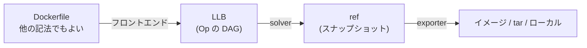
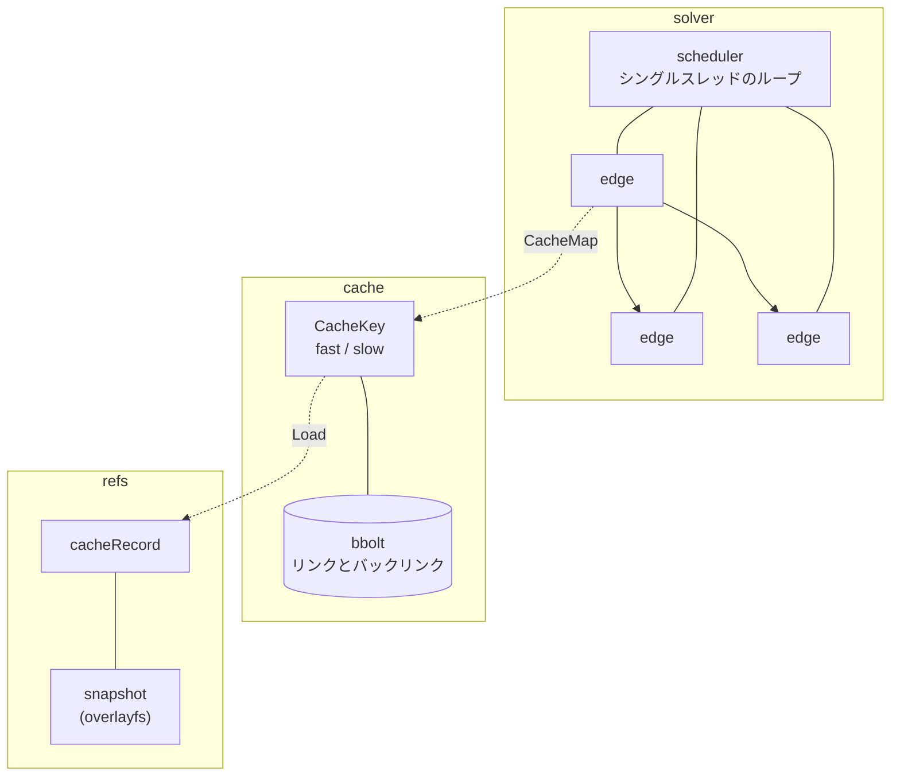

`docker build` は、かつて Dockerfile を上から 1 行ずつ実行するプログラムだった。1 命令ごとにコンテナを起動し、コミットし、そのイメージ ID を次の命令の親にする。キャッシュヒットの判定は「親イメージが同じで、命令の文字列が同じか」であり、それ以外の情報は使われなかった。この設計は理解しやすい代わりに、独立した命令を並列化できず、`COPY` の対象ファイルが変わっていないことを知る手段を持たず、Dockerfile 以外の記法を受け付けられなかった。

BuildKit はこの 3 つを、1 つの発想でまとめて解いた。**ビルドを実行するのではなく、まず DAG に変換する。**

中間表現の名前は LLB (low-level build) という。頂点は「コマンドを実行する」「ファイルをコピーする」「ソースを取ってくる」といった粒度の操作で、辺は「この頂点の出力がこの頂点の入力になる」という依存だけを表す。Dockerfile は LLB へのコンパイラの 1 つに降格し、DAG を解く側は Dockerfile を知らない。

DAG にした瞬間、3 つが同時に手に入る。**並列化**は辺のない頂点を同時に解くだけになり、マルチステージビルドの独立したステージが自動的に並走する。**フロントエンドの差し替え**は、LLB を吐くものなら何でもよいという話になり、`# syntax=` 行 1 本で Dockerfile の方言をコンテナイメージとして配布できるようになる。そして**キャッシュ**は、頂点ごとに「この頂点を実行したら何が出てくるか」を表すキーを作る問題になる。

## 2 本目の軸 — キャッシュヒットの再定義

この章のもう半分は、キャッシュの話だ。BuildKit のキャッシュは、素朴に想像するものとかなり違う。

まず、キーが 2 種類ある。頂点の定義だけから計算できるキー (fast cache) と、実際に入力の中身を見ないと決まらないキー (slow cache) だ。`COPY . /src` の定義は「カレントディレクトリをコピーする」としか言っておらず、そのディレクトリの中身が同じかどうかは定義からは分からない。だから BuildKit は、まず定義ベースのキーで候補を絞り、そこから先はコピー対象のファイルツリーを実際にハッシュして (contenthash)、内容ベースのキーで一致を判定する。

次に、キャッシュ検索が**ハッシュ計算ではなくグラフ探索**になっている。頂点のキーは入力頂点のキーに依存するが、入力頂点には「これまでに観測された複数の許容キー」がありうる。すると探索は、各入力についてキーの集合を持ち歩き、それらの組み合わせのうち永続化されたリンクを辿れるものを探す、という形になる。キャッシュデータベース (bbolt) にはキーからキーへのリンクとバックリンクが保存されていて、検索はそのグラフを歩く。

solver 側もこの探索に合わせて作られている。頂点は自分が何者かを知らず (`Vertex` インターフェースには「実行する」というメソッドすらない)、スケジューラはシングルスレッドのループで、状態遷移はすべて「まだ探索していないキーがあるか」「必要な深さまで掘ったか」という下界と上界の再計算として書かれる。同じキーを持つ 2 つの edge は途中でマージされて 1 本になる。この章の 6 群目と 7 群目は、ほぼこの探索の話に費やされる。

## containerd 章との関係

[containerd](../containerd/) が「イメージを積んでコンテナを動かす」までを扱ったのに対し、この章は**その手前、ソースコードからイメージを作る側**を扱う。BuildKit は content store も snapshotter も containerd のものを (あるいは同等の実装を) 使うので、レイヤの積み方や lease の話は containerd 章にリンクして先に進む。逆に、BuildKit 側にしかないもの — キャッシュキー、DAG の解き方、フロントエンドという拡張点 — をこの章の中心に置く。

## この章の読み方

前半 5 群 (1〜31) は「ビルドを DAG にする」側だ。LLB の形を読み、Dockerfile パーサと LLB へのコンパイラを読み、フロントエンドがどう差し替え可能になっているかを読む。ここは 1 群目から順に読むのがよい。

後半 (32〜) は「DAG を解く」側で、solver コア → キャッシュキー → contenthash → キャッシュの実体、と降りていく。この 4 群は互いに強く依存しているので、6 群目 (solver) を飛ばして 7 群目 (キャッシュキー) を読むのは難しい。逆に 10 群目以降 (ソース・セッション・エクスポート・リモートキャッシュ) は比較的独立していて、興味のあるところから読める。

## 読む順番

ビルドを解く前に:

- [なぜ docker build は BuildKit に置き換わったのか](./why-buildkit/)
- [ビルドを DAG にする — LLB という中間表現の発想](./build-as-dag/)
- [デーモン・クライアント・フロントエンドの三者関係](./daemon-client-frontend/)
- [「何をキャッシュヒットとみなすか」を定義する](./what-is-a-cache-hit/)
- [スコープと信頼境界 — 何を守り、何を守らないか](./scope-and-trust/)
- [アーキテクチャを一枚で読む](./architecture/)
- [buildctl build から結果が出るまでを追う](./buildctl-walkthrough/)

LLB — ビルドの中間表現:

- [Op の平坦な配列が DAG になる — digest がそのまま頂点 ID](./llb-definition/)
- [決定性 marshal がキャッシュの前提になっている](./deterministic-marshal/)
- [ExecOp — mount から入力と出力の番号を決める](./exec-op/)
- [FileOp — 1 頂点にアクションの DAG を詰め込む](./file-op/)
- [MergeOp / DiffOp と COPY --link](./merge-diff-op/)
- [State API — immutable な連結リストと遅延評価](./state-api/)
- [SourceMap — エラーを Dockerfile の行に戻す](./source-map/)

Dockerfile を読む:

- [「複雑な言語には向かない」と自嘲するパースツリー](./dockerfile-parser/)
- [行の連結とエスケープトークンの差し替え](./line-continuation-escape/)
- [parser directive — 先頭でしか効かないステートマシン](./parser-directives/)
- [heredoc — 引用符の数を数えて展開の可否を決める](./heredoc/)
- [--mount はどこで本文から切り離されるか](./instruction-flags/)
- [shell.Lex — bash 風展開のサブセットと文字列反転トリック](./shell-lex/)

Dockerfile を LLB にする:

- [9 フェーズ・パイプライン](./dockerfile2llb-phases/)
- [ステージ依存グラフと、到達不能ステージの枝刈り](./stage-graph/)
- [RUN / COPY / FROM がどの Op になるか](./instructions-to-ops/)
- [mutableOutput — ビルドコンテキストを後から埋める](./mutable-output/)
- [ONBUILD の不動点ループ](./onbuild/)
- [named context がステージ名を乗っ取る](./named-context/)

フロントエンドという拡張点:

- [#syntax= はフロントエンドの再帰呼び出しである](./syntax-directive/)
- [gateway — コンテナの stdin/stdout の上に gRPC を張る](./gateway-grpc/)
- [フロントエンドは LABEL で自己申告する — ネットワーク遮断はオプトイン](./frontend-labels/)
- [ref は不透明 ID と Definition の 2 点セットで往復する](./gateway-ref/)
- [apicaps — ID 文字列 1 個で前方後方互換を管理する](./apicaps/)

solver — DAG を解く:

- [Vertex は何も知らない — solver コアの抽象境界](./vertex-abstraction/)
- [Job / state / edge / sharedOp の 4 層](./job-state-edge/)
- [スケジューラのシングルスレッドループと pipe](./scheduler-loop/)
- [edge の状態機械 — 下界と上界から現在地を再計算する](./edge-state-machine/)
- [desiredState — 必要な分だけ深く掘る](./desired-state/)
- [edge のマージ — 同じキーの edge を 1 本に潰す](./edge-merge/)
- [unpark の 2 つの契約と、自分のバグを検出するスケジューラ](./unpark-contract/)
- [ジョブの共有と破棄 — flightcontrol と参照カウント](./job-sharing/)

キャッシュキーの設計:

- [fast cache と slow cache — 定義から決まるキーと中身で決まるキー](./fast-slow-cache/)
- [キャッシュキーの合成 — 入力ごとの「許容キー集合」](./cachekey-composition/)
- [キャッシュ検索はハッシュ計算ではなくグラフ探索である](./cache-query-graph/)
- [Query が副作用でリンクを張る](./query-side-effects/)
- [bbolt にリンクとバックリンクを永続化する](./bbolt-cache-links/)
- [キャッシュのエクスポート — 通らなかった経路まで書き出す](./cache-export/)
- [ExecOp の CacheMap — 何をキーから外し、どのバグを再現し続けるか](./execop-cachemap/)

contenthash — COPY のキャッシュ:

- [immutable radix tree に「ディレクトリ 2 レコード」を置く](./contenthash-radix-tree/)
- [増分更新 — 変更通知でダイジェストを無効化して伝播させる](./contenthash-incremental/)
- [ファイルのハッシュは「tar にしたときの姿」で取る](./contenthash-tar-digest/)
- [シンボリックリンク解決と、スキャンが要るかの判定](./contenthash-symlink/)

キャッシュの実体 — ref とレイヤ:

- [cacheRecord と 2 種類の ref — Commit と Finalize を分ける](./cache-record-refs/)
- [参照カウントをカウンタではなく集合で持つ](./refcount-set/)
- [GetByBlob — chainID と blobChainID、2 つの同一性](./get-by-blob/)
- [lazy ref — blob を落とさずに ref を作る](./lazy-ref/)
- [Prune のスコアリングと GC ポリシーの階層](./prune-and-gc/)
- [cache/metadata — bbolt と自前の二次索引](./cache-metadata/)
- [overlayfs の upperdir を直接読んで差分を作る](./overlayfs-diff/)
- [圧縮バリアントを GC ラベルで束ねる — estargz は gzip の顔をしている](./compression-variants/)

ソースと実行:

- [git source — 共有 bare リポジトリと「タグが動いた」ときのリカバリ](./git-source/)
- [http source — 仕様どおりに動かないサーバを前提にした条件付き GET](./http-source/)
- [local source — 毎回変わるキーと SharedKey の折り合い](./local-source/)
- [image source の lazy pull](./image-source/)
- [runc executor が 1 回の Run でやること](./runc-executor/)
- [OCI spec の生成、entitlements、RUN --mount=type=cache](./oci-spec-and-mounts/)

セッション — 逆向きの gRPC:

- [1 本の接続を逆走させる (grpchijack)](./grpchijack/)
- [SessionManager と、複数ジョブでのセッション共有](./session-manager/)
- [filesync — メタデータを先に流し、必要なものだけ要求させる](./filesync/)
- [secret が snapshot に残らない理由と SSH agent 転送](./secrets-and-ssh/)
- [認証情報はクライアントから出ない — トークン権限の委譲](./auth-delegation/)

結果を出す:

- [Export と Finalize の 2 相分割](./export-finalize/)
- [image exporter — blob 化から index 組み立てまで](./image-exporter/)
- [再現ビルド — SOURCE_DATE_EPOCH とタイムスタンプの書き換え](./reproducible-build/)
- [attestation の格納 — 2 つの形式が併存する理由](./attestation-storage/)
- [provenance — solver が DAG を歩いて出所を集める](./provenance/)

リモートキャッシュ:

- [CacheChains — 「正規化をやめた日」](./cache-chains/)
- [循環をどこで切るか — 書き込み時・直列化時・読み込み時](./cycle-breaking/)
- [content-addressable な config の決定性](./cache-config-determinism/)
- [manifest がある世界とない世界 — 6 バックエンドの構造的な二分](./remotecache-backends/)

運用・互換・観測:

- [progress — 意図的に lossy な進捗ツリー](./progress/)
- [エラーを gRPC 越しに運ぶ — 型付きエラーとスタックトレース](./grpc-errors/)
- [sourcepolicy — ソースを書き換え、拒否する](./sourcepolicy/)
- [compatibility-version と cachedigest — 出力の互換とキャッシュミスの追跡](./compat-and-cachedigest/)

## 扱わないこと

- **Windows コンテナ** — `util/winlayers`、hcsshim 経由の実行。Linux の経路だけを読む
- **containerd 本体** — content store / snapshotter / lease の内部は [containerd 章](../containerd/)
- **fsutil の内部実装** — filesync のプロトコルは扱うが、ライブラリ本体は対象外
- **buildx / docker CLI** — BuildKit の外側。`--build-context target:` のような buildx 側の変換に触れる程度
- **CNI プラグイン本体、rootless の詳細**
