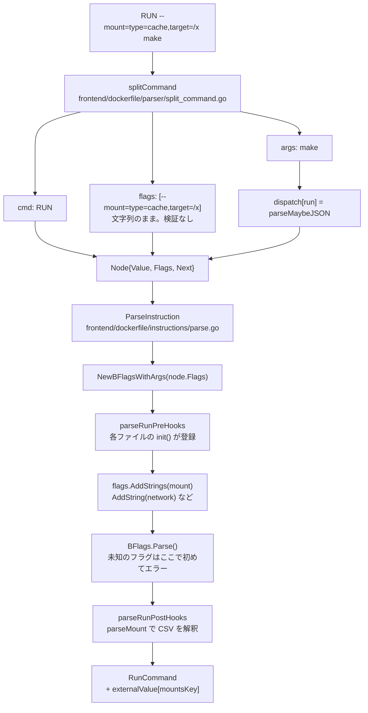

## 何を学んだか

`RUN --mount=type=cache,target=/x make` の `--mount=...` は、**パーサ段で本文から切り離される**。ただし切り離すだけで、中身は一切見ない。`Node.Flags` は `[]string` で、`"--mount=type=cache,target=/x"` という文字列がそのまま入る。フラグ名が正しいか、値が何を意味するかは、次の instructions 段の `BFlags` が決める。

そして `--mount` は `parseRun` の中に書かれていない。別ファイルの `init()` から**フックとして登録される**。



## パーサ段 — 先頭の `--` で始まる語だけを刈る

`splitCommand` は行を「命令名」と「残り」に割り、残りの先頭からフラグを抜く。

```go title="frontend/dockerfile/parser/split_command.go"
func splitCommand(line string, d *directives) (string, []string, string, error) {
	var args string
	var flags []string

	// Make sure we get the same results irrespective of leading/trailing spaces
	cmdline := reWhitespace.Split(strings.TrimSpace(line), 2)

	if len(cmdline) == 2 {
		var err error
		args, flags, err = extractBuilderFlags(cmdline[1], d)
		// ...
	}

	return cmdline[0], flags, strings.TrimSpace(args), nil
}
```

([frontend/dockerfile/parser/split_command.go L8-L26](https://github.com/moby/buildkit/blob/ca4838f8ddbd3612bca94bcb8a938d8a326110a3/frontend/dockerfile/parser/split_command.go#L8-L26))

`extractBuilderFlags` は `inSpaces` / `inWord` / `inQuote` の 3 状態を持つ手書きスキャナで、規則は 2 つだけだ。

```go title="frontend/dockerfile/parser/split_command.go"
			// Only keep going if the next word starts with --
			if ch != '-' || pos+1 == len(line) || rune(line[pos+1]) != '-' {
				return line[pos:], words, nil
			}
```

([frontend/dockerfile/parser/split_command.go L57-L60](https://github.com/moby/buildkit/blob/ca4838f8ddbd3612bca94bcb8a938d8a326110a3/frontend/dockerfile/parser/split_command.go#L57-L60))

**`--` で始まらない語が来たら、そこから先は全部本文。** だから `RUN make --jobs=4` の `--jobs=4` はフラグにならない。命令名の直後に連続して並んでいるものだけがフラグになる。

**`--` 単独が来たらそこで打ち切る。** POSIX のオプション終端と同じで、`COPY --doit=true -- foo /tmp/` は `--doit=true` だけをフラグにし、`foo /tmp/` を本文にする。`--` 自体は捨てられる。

引用符とエスケープトークンはここでも解釈される。`--mount=type=bind,source="a b"` のようにフラグの値に空白を入れられるのはそのためで、エスケープトークンは [`escape` ディレクティブ](../line-continuation-escape/)で差し替えたものが使われる。

決定的なのは、**この段でフラグ名の検証をしない**ことだ。`testfiles/flags/result` を見ると、存在しない `--user` も `--doit` もそのまま `Node.Flags` に入っている。

```
(copy ["--user=me" "--doit=true"] "foo" "/tmp/")
(cmd ["--doit"] "a" "b")
```

([frontend/dockerfile/parser/testfiles/flags/result](https://github.com/moby/buildkit/blob/ca4838f8ddbd3612bca94bcb8a938d8a326110a3/frontend/dockerfile/parser/testfiles/flags/result))

パーサは「どの命令にどのフラグがあるか」を知らない。知る必要がないというより、知ってはいけない。フラグの集合は BuildKit のバージョンで増えるので、パーサに埋め込むと AST の形がバージョン依存になる。

## instructions 段 — BFlags が意味を与える

`ParseInstruction` の入口で、`Node.Flags` は `BFlags` に包まれる。

```go title="frontend/dockerfile/instructions/parse.go"
func newParseRequestFromNode(node *parser.Node) parseRequest {
	return parseRequest{
		command:    node.Value,
		args:       nodeArgs(node),
		heredocs:   node.Heredocs,
		attributes: node.Attributes,
		original:   node.Original,
		flags:      NewBFlagsWithArgs(node.Flags),
		location:   node.Location(),
		comments:   node.PrevComment,
	}
}
```

([frontend/dockerfile/instructions/parse.go L54-L65](https://github.com/moby/buildkit/blob/ca4838f8ddbd3612bca94bcb8a938d8a326110a3/frontend/dockerfile/instructions/parse.go#L54-L65))

各命令の parse 関数は「まず受け付けるフラグを宣言し、次に `Parse()` を呼ぶ」という 2 段階を踏む。

```go title="frontend/dockerfile/instructions/parse.go"
func parseCopy(req parseRequest) (*CopyCommand, error) {
	if len(req.args) < 2 {
		return nil, errNoDestinationArgument("COPY")
	}

	flChown := req.flags.AddString("chown", "")
	flFrom := req.flags.AddString("from", "")
	flChmod := req.flags.AddString("chmod", "")
	flLink := req.flags.AddBool("link", false)
	flExcludes := req.flags.AddStrings("exclude")
	flParents := req.flags.AddBool("parents", false)

	if err := req.flags.Parse(); err != nil {
		return nil, err
	}
	// ...
}
```

([frontend/dockerfile/instructions/parse.go L362-L377](https://github.com/moby/buildkit/blob/ca4838f8ddbd3612bca94bcb8a938d8a326110a3/frontend/dockerfile/instructions/parse.go#L362-L377))

型は 3 つ。`boolType` は `--link` と `--link=true` の両方を受け、`stringType` は `=` 必須、`stringsType` だけが複数回の指定を許して `StringValues` に積む。`--mount` と `--exclude` が `AddStrings` なのは、1 つの `RUN` に複数のマウントを書けるからだ。

`AddXXX` はエラーを返さない。重複定義などは `bf.Err` に溜め、`Parse()` でまとめて返す。理由がコメントに書いてある。

```go title="frontend/dockerfile/instructions/bflag.go"
// Parse parses and checks if the BFlags is valid.
// Any error noticed during the AddXXX() funcs will be generated/returned
// here.  We do this because an error during AddXXX() is more like a
// compile time error so it doesn't matter too much when we stop our
// processing as long as we do stop it, so this allows the code
// around AddXXX() to be just:
//
//	defFlag := AddString("description", "")
//
// w/o needing to add an if-statement around each one.
```

([frontend/dockerfile/instructions/bflag.go L132-L141](https://github.com/moby/buildkit/blob/ca4838f8ddbd3612bca94bcb8a938d8a326110a3/frontend/dockerfile/instructions/bflag.go#L132-L141))

「`AddString` の重複はプログラマのバグであってユーザ入力のエラーではないので、検出のタイミングは遅くてよい。そのぶん宣言側を 1 行で書けるようにする」。エラーの性質で扱いを分けている。

未知のフラグが弾かれるのは `Parse()` の中だ。

```go title="frontend/dockerfile/instructions/bflag.go"
		flag, ok := bf.flags[arg]
		if !ok {
			err := errors.Errorf("unknown flag: %s", flagName)
			return suggest.WrapError(err, arg, allFlags(bf.flags), true)
		}

		if _, ok = bf.used[arg]; ok && flag.flagType != stringsType {
			return errors.Errorf("duplicate flag specified: %s", flagName)
		}
```

([frontend/dockerfile/instructions/bflag.go L168-L176](https://github.com/moby/buildkit/blob/ca4838f8ddbd3612bca94bcb8a938d8a326110a3/frontend/dockerfile/instructions/bflag.go#L168-L176))

`suggest.WrapError` に「その命令が受け付けるフラグ名の一覧」を渡しているので、`--form=build` と書けば `--from` を提案できる。これができるのは、フラグの宣言が命令ごとに閉じているからだ。パーサ段でグローバルなフラグ表を持っていたら、`COPY` の候補として `--mount` を提案してしまう。

## `--mount` は `parseRun` に書かれていない

`parseRun` の中身は驚くほど短い。

```go title="frontend/dockerfile/instructions/parse.go"
func parseRun(req parseRequest) (*RunCommand, error) {
	cmd := &RunCommand{}

	for _, fn := range parseRunPreHooks {
		if err := fn(cmd, req); err != nil {
			return nil, err
		}
	}

	if err := req.flags.Parse(); err != nil {
		return nil, err
	}
	cmd.FlagsUsed = req.flags.Used()

	cmdline, err := parseShellDependentCommand(req, false)
	// ...
	for _, fn := range parseRunPostHooks {
		if err := fn(cmd, req); err != nil {
			return nil, err
		}
	}

	return cmd, nil
}
```

([frontend/dockerfile/instructions/parse.go L507-L536](https://github.com/moby/buildkit/blob/ca4838f8ddbd3612bca94bcb8a938d8a326110a3/frontend/dockerfile/instructions/parse.go#L507-L536))

pre フックが `BFlags.Parse()` の**前**、post フックが**後**に走る。この前後関係が意味を持つ。pre でフラグを宣言し、post で宣言したフラグの値を読む、という分担になっている。

`--mount` を登録するのは別ファイルの `init()` だ。

```go title="frontend/dockerfile/instructions/commands_runmount.go"
func init() {
	parseRunPreHooks = append(parseRunPreHooks, runMountPreHook)
	parseRunPostHooks = append(parseRunPostHooks, runMountPostHook)
}

func runMountPreHook(cmd *RunCommand, req parseRequest) error {
	st := &mountState{}
	st.flag = req.flags.AddStrings("mount")
	cmd.setExternalValue(mountsKey, st)
	return nil
}

func runMountPostHook(cmd *RunCommand, req parseRequest) error {
	return setMountState(cmd, nil)
}
```

([frontend/dockerfile/instructions/commands_runmount.go L49-L79](https://github.com/moby/buildkit/blob/ca4838f8ddbd3612bca94bcb8a938d8a326110a3/frontend/dockerfile/instructions/commands_runmount.go#L49-L79))

同じ形が `commands_runnetwork.go` (`--network`)、`commands_runsecurity.go` (`--security`)、`commands_rundevice.go` (`--device`) にもある。4 ファイルが同じ 2 本のスライスに `append` する。

結果を `RunCommand` のフィールドではなく `withExternalData` (`map[any]any` を包むだけの構造体、[commands.go L566-L579](https://github.com/moby/buildkit/blob/ca4838f8ddbd3612bca94bcb8a938d8a326110a3/frontend/dockerfile/instructions/commands.go#L566-L579)) に置くのが、この分割の要だ。キーは `mountsKeyT` のような非公開の型で、パッケージ外から衝突させられない。型安全は `GetMounts(cmd) []*Mount` のようなアクセサ関数で回復する。`RunCommand` に `Mounts []*Mount` を直接生やすと、`Mount` 型と `RunCommand` の定義が同じファイルに集まってしまう。マップ経由にすることで、`--mount` に関する型・フラグ登録・解析・アクセサが 1 ファイルに閉じている。

## `parseMount` は 2 回呼ばれる

`--mount=type=cache,target=$HOME/.cache` のように値に変数が書ける。しかし変数の値は `ENV` と `ARG` を辿らないと決まらず、それが決まるのは LLB 変換のときだ。だから `parseMount` は expander の有無で 2 通りに動く。

```go title="frontend/dockerfile/instructions/commands_runmount.go"
		// check for potential variable
		if expander != nil {
			value, err = expander(value)
			if err != nil {
				return nil, err
			}
		} else if key == "from" {
			if idx := strings.IndexByte(value, '$'); idx != -1 && idx != len(value)-1 {
				return nil, errors.Errorf("'%s' doesn't support variable expansion, define alias stage instead", key)
			}
		} else {
			// if we don't have an expander, defer evaluation to later
			continue
		}
```

([frontend/dockerfile/instructions/commands_runmount.go L173-L186](https://github.com/moby/buildkit/blob/ca4838f8ddbd3612bca94bcb8a938d8a326110a3/frontend/dockerfile/instructions/commands_runmount.go#L173-L186))

1 回目 (`expander == nil`) は CSV として分解できるかだけを見て、値の解釈は `continue` で飛ばす。2 回目は `RunCommand.Expand` から呼ばれ、展開してから `type` や `target` を解釈する。

```go title="frontend/dockerfile/instructions/commands.go"
func (c *RunCommand) Expand(expander SingleWordExpander) error {
	if err := setMountState(c, expander); err != nil {
		return err
	}
	return nil
}
```

([frontend/dockerfile/instructions/commands.go L372-L377](https://github.com/moby/buildkit/blob/ca4838f8ddbd3612bca94bcb8a938d8a326110a3/frontend/dockerfile/instructions/commands.go#L372-L377))

`from` だけ 1 回目で `$` を弾く分岐があるのが例外で、エラーメッセージが理由を説明している。`--mount=from=$STAGE` を許すと、ステージ間の依存グラフが変数の値を決めるまで確定せず、[ステージの依存解析](../stage-graph/)ができなくなる。「別名ステージを定義しろ」というのは、依存を Dockerfile の静的な構造として書けという意味だ。値の末尾の `$` (`idx == len(value)-1`) を見逃しているのは、それが変数参照になり得ないため。

CSV の分解には `go-csvvalue` を使っている。`--mount=type=cache,target=/x,sharing=locked` はカンマ区切りの `key=value` で、引用でカンマを含められる。ここでも未知のキーは `suggest.WrapError` で候補付きのエラーになる。

## フラグと apicaps

`--mount` に書ける値が全部使えるとは限らない。フロントエンドは新しいが BuildKit デーモンは古い、という組み合わせがあるからだ。LLB の機能は [apicaps](../apicaps/) で表明されていて、変換時に問い合わせる。

```go title="frontend/dockerfile/dockerfile2llb/convert_runmount.go"
		if mount.ReadOnly {
			mountOpts = append(mountOpts, llb.Readonly)
		} else if mount.Type == instructions.MountTypeBind && opt.llbCaps.Supports(pb.CapExecMountBindReadWriteNoOutput) == nil {
			mountOpts = append(mountOpts, llb.ForceNoOutput)
		}
```

([frontend/dockerfile/dockerfile2llb/convert_runmount.go L103-L107](https://github.com/moby/buildkit/blob/ca4838f8ddbd3612bca94bcb8a938d8a326110a3/frontend/dockerfile/dockerfile2llb/convert_runmount.go#L103-L107))

`Supports` が `nil` を返したときだけ最適化を有効にする。`--mount=type=tmpfs,size=...` も同じで、`CapExecMountTmpfsSize` が無ければ黙って落とす。

つまり「フラグが受け入れられるか」の判定が 4 つの層に分かれている。

| 層                             | 何を弾くか                   | 例                                    |
| ------------------------------ | ---------------------------- | ------------------------------------- |
| パーサ (`extractBuilderFlags`) | 何も弾かない                 | `--zzz=1` も通る                      |
| instructions (`BFlags.Parse`)  | フラグ名。候補を提案         | `unknown flag: --form`                |
| instructions (`parseMount`)    | フラグの値の文法と組み合わせ | `secret mount should not have a from` |
| dockerfile2llb (`apicaps`)     | デーモン側の対応状況         | 古いデーモンでは機能を落とす          |

`Dockerfile` の文法として正しいかと、目の前のデーモンで実行できるかを、別の層で判定している。前者はフロントエンドの中で完結し、後者は接続先に依存する。

## なぜそうなっているか

パーサ段でフラグの名前を知らないことには、はっきりした利点がある。`Node` は `# syntax=` で差し替えられる[外部フロントエンド](../syntax-directive/)からも `parser` パッケージとして使われうる。パーサが `--mount` を知っていると、独自のフラグを持つ Dockerfile 方言を作るのに `parser` の改造が要る。`Flags []string` という素の形にしておけば、パーサは全方言で共有できる。

フック方式のほうは、Go の `init()` を使った古典的なプラグイン登録だ。`--mount` `--network` `--security` `--device` は、それぞれ型 (`Mount`, `NetworkMode`, `SecurityMode`) と検証と後段のアクセサを持つ。これを `parse.go` に集めると `parseRun` が数百行になり、`Mount` の話と `NetworkMode` の話が同じ関数に混ざる。フックと `withExternalData` の組で、1 機能 1 ファイルに保っている。

ただしこの方式は代償を払っている。`init()` に依存するのでフックの登録順が (ファイル名順という) 暗黙のものになり、`RunCommand` から `--mount` の値を取るのに `GetMounts()` というパッケージレベルの関数を通す必要がある。フックが 4 つしかなく、互いに独立していて、順序に意味がないから成立している。

`parseMount` を 2 回呼ぶのは、Dockerfile が「静的に決まる構造」と「実行時 (ビルド時) に決まる値」を混ぜて書ける言語だからだ。マウント先のパスは変数でよく、マウント元のステージは変数ではいけない。この線引きは実装の都合ではなく、DAG を組み立てるのに必要な情報が何かで決まっている。

## どう活かすか

**構文の切り出しと意味づけを別の層に置き、切り出す側には辞書を持たせない。** 「`--` で始まる先頭の語はフラグ」という規則だけならパーサはバージョンに依存しない。フラグ名の一覧を持った瞬間、パーサはドメイン知識を持つことになり、共有できなくなる。パースの結果を `[]string` のような素の型で置いておくと、解釈する側を差し替えられる。

**エラーの種類でチェックのタイミングを変える。** `BFlags` は「プログラマのバグ」(重複定義) を遅延させ、「ユーザ入力のエラー」(未知のフラグ) をその場で候補付きで返す。前者を厳密に扱うと呼び出し側に `if err != nil` が 6 行並ぶ。どちらも同じ `error` 型だが、直す人が違うので扱いを変えていい。

**遅延評価が必要なパラメータと、そうでないパラメータを型で分けなくてもいい。** `parseMount` は同じ関数を `expander == nil` かどうかで 2 モード動かしている。パース済み構造体と未パース構造体を別の型にすると、フィールドの対応表を保守することになる。同じ関数を 2 回通す設計は、2 回目が 1 回目のスーパーセットになっているときだけ成立する。
