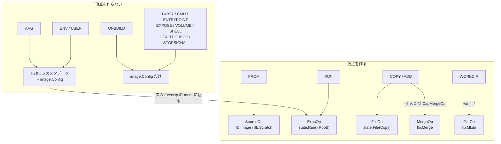

## 何を学んだか

Dockerfile の命令は、LLB への落ち方で 2 種類に分かれる。

- **頂点を作る命令**: `FROM` (SourceOp)、`RUN` (ExecOp)、`COPY` / `ADD` (FileOp、`--link` なら MergeOp)、`WORKDIR` (FileOp)
- **頂点を作らない命令**: `ENV` / `USER` / `LABEL` / `CMD` / `ENTRYPOINT` / `EXPOSE` / `VOLUME` / `STOPSIGNAL` / `SHELL` / `HEALTHCHECK` / `MAINTAINER` / `ARG` / `ONBUILD`

後者は `dispatchState.image` (出力イメージの config) と `llb.State` のメタデータを更新するだけで、DAG の形を一切変えない。`ENV FOO=bar` を追加しても LLB のダイジェストは変わらず、`RUN` に到達したときのキャッシュキーだけが変わる。この分離が、`ENV` を書き足しただけでレイヤが増えない理由であり、同時に `ENV` を書き足すと後続の `RUN` のキャッシュが飛ぶ理由でもある。

## ソースコードのどこか

### dispatch — 1 つの型スイッチ

命令の振り分けは `dispatch` の型スイッチ 1 か所に集約されている ([convert.go L1065-L1162](https://github.com/moby/buildkit/blob/ca4838f8ddbd3612bca94bcb8a938d8a326110a3/frontend/dockerfile/dockerfile2llb/convert.go#L1065-L1162))。スイッチの前に、変数展開が済まされる。

```go title="frontend/dockerfile/dockerfile2llb/convert.go"
	if ex, ok := cmd.Command.(instructions.SupportsSingleWordExpansion); ok && !isArg {
		err := ex.Expand(func(word string) (string, error) {
			env := getEnv(d.state)
			newword, unmatched, err := opt.shlex.ProcessWord(word, env)
			reportUnmatchedVariables(cmd, d.buildArgs, env, unmatched, &opt)
			return newword, err
		})
		// ...
	}
```

([convert.go L1040-L1050](https://github.com/moby/buildkit/blob/ca4838f8ddbd3612bca94bcb8a938d8a326110a3/frontend/dockerfile/dockerfile2llb/convert.go#L1040-L1050))

展開に使う環境は `getEnv(d.state)` — つまり**その時点の `llb.State` に積まれた環境変数**だ。`ENV` が Op を作らずに `llb.State` を更新することが、ここで効いてくる ([シェル的な変数展開](../shell-lex/))。



### FROM — SourceOp、ただし scratch は頂点にならない

`FROM` は `dispatch` を通らない。ステージの境界なので、フェーズ 7 の `resolveBaseImage` が処理する。

```go title="frontend/dockerfile/dockerfile2llb/convert.go"
	if isScratch {
		d.state = llb.Scratch()
	} else {
		d.state = llb.Image(d.stage.BaseName,
			dfCmd(d.stage.SourceCode),
			llb.Platform(*platform),
			dctx.opt.ImageResolveMode,
			llb.WithCustomName(prefixCommand(d, "FROM "+d.stage.BaseName, ...)),
			location(dctx.opt.SourceMap, d.stage.Location),
		)
		// ...
	}
```

([convert.go L742-L755](https://github.com/moby/buildkit/blob/ca4838f8ddbd3612bca94bcb8a938d8a326110a3/frontend/dockerfile/dockerfile2llb/convert.go#L742-L755))

`llb.Image` は `docker-image://` という識別子の SourceOp を作る ([client/llb/source.go L221](https://github.com/moby/buildkit/blob/ca4838f8ddbd3612bca94bcb8a938d8a326110a3/client/llb/source.go#L221))。`llb.Scratch()` は出力を持たない `State` で、頂点にならない。

ここで `d.stage.BaseName` はすでに**ダイジェスト付きに書き換えられている**点が重要だ。`resolveBaseImage` の中で `metaResolver.ResolveImageConfig` を呼び、返ってきたダイジェストを参照に付け直している。

```go title="frontend/dockerfile/dockerfile2llb/convert.go"
		if dgst != "" {
			ref, err = reference.WithDigest(ref, dgst)
			// ...
		}
		d.stage.BaseName = ref.String()
```

([convert.go L723-L729](https://github.com/moby/buildkit/blob/ca4838f8ddbd3612bca94bcb8a938d8a326110a3/frontend/dockerfile/dockerfile2llb/convert.go#L723-L729))

`FROM alpine:3.20` と書いても、LLB に載るのは `docker.io/library/alpine:3.20@sha256:...` になる。LLB がイミュータブルな参照だけを含むから、同じ LLB からは同じ結果が出る。タグの指す先が変わったときにキャッシュが正しく無効化されるのも、この書き換えのおかげだ。

`isScratch` の判定に、schema1 イメージへの回避策が入っている。

```go title="frontend/dockerfile/dockerfile2llb/convert.go"
		if len(img.RootFS.DiffIDs) == 0 {
			isScratch = true
			// schema1 images can't return diffIDs so double check :(
			for _, h := range img.History {
				if !h.EmptyLayer {
					isScratch = false
					break
				}
			}
		}
```

([convert.go L730-L739](https://github.com/moby/buildkit/blob/ca4838f8ddbd3612bca94bcb8a938d8a326110a3/frontend/dockerfile/dockerfile2llb/convert.go#L730-L739))

レイヤを持たないイメージは `llb.Scratch()` に潰される。SourceOp を 1 つ減らせるうえ、空のレイヤを取りにいく往復もなくなる。

### RUN — ExecOp

`dispatchRun` の本体は 160 行あるが、LLB を伸ばすのは最後の 2 行だけだ。

```go title="frontend/dockerfile/dockerfile2llb/convert.go"
	d.state = d.state.Run(opt...).Root()
	return commitToHistory(&d.image, "RUN "+runCommandString(args, d.buildArgs, env), true, &d.state, d.epoch)
```

([convert.go L1506-L1507](https://github.com/moby/buildkit/blob/ca4838f8ddbd3612bca94bcb8a938d8a326110a3/frontend/dockerfile/dockerfile2llb/convert.go#L1506-L1507))

残りの 158 行は `[]llb.RunOption` を積み上げる作業で、`--mount` / `--network` / `--security` のフラグ、プロキシ環境変数、`--add-host`、ulimit、CDI デバイス、cgroup、`/dev/shm` のサイズがすべて `RunOption` になる。`.Root()` は ExecOp のルートファイルシステム出力を指す `State` を返す ([ExecOp](../exec-op/))。

`llb.AddUlimit` や `llb.WithCgroupParent` の追加は、必ず `llbCaps` のチェックで囲まれている。

```go title="frontend/dockerfile/dockerfile2llb/convert.go"
	if dopt.llbCaps != nil && dopt.llbCaps.Supports(pb.CapExecMetaUlimit) == nil {
		for _, u := range dopt.ulimit {
			opt = append(opt, llb.AddUlimit(llb.UlimitName(u.Name), u.Soft, u.Hard))
		}
	}
```

([convert.go L1443-L1447](https://github.com/moby/buildkit/blob/ca4838f8ddbd3612bca94bcb8a938d8a326110a3/frontend/dockerfile/dockerfile2llb/convert.go#L1443-L1447))

フロントエンドは自分より古い buildkitd に LLB を渡す可能性があるので、対応していないフィールドは黙って落とす ([apicaps](../apicaps/))。

`RUN` はファイルシステム全体を読む可能性があるので、その旨を記録する。

```go title="frontend/dockerfile/dockerfile2llb/convert.go"
	// Run command can potentially access any file. Mark the full filesystem as used.
	d.paths["/"] = struct{}{}
```

この `paths` は、そのステージが `--build-context` の local から来ている場合に「転送すべきパス」を絞るために使われる。`RUN` が 1 つでもあれば絞り込みは諦める。

### COPY / ADD — FileOp、`--link` なら MergeOp

`dispatchCopy` は、ソースの種類ごとに `llb.FileAction` を組み立てて、最後に 1 回だけ `State` に適用する。ソースは 4 種類ある。

| ソース                          | 生成されるもの                                 |
| ------------------------------- | ---------------------------------------------- |
| ビルドコンテキスト / 他ステージ | `llb.Copy(cfg.source, src, dest, ...)` だけ    |
| `ADD https://...`               | `llb.HTTP` (SourceOp) → `Copy`                 |
| `ADD https://github.com/...git` | `llb.Git` (SourceOp) → `Copy`                  |
| `COPY <<EOF` (heredoc)          | `llb.Scratch().File(llb.Mkfile(...))` → `Copy` |

複数ソースは `a = a.Copy(...)` でチェーンされ、**1 つの FileOp に複数のアクションが載る**。`COPY a b c /dst/` はレイヤを 3 枚作らない。

最後の適用が、`--link` の有無で分かれる。

```go title="frontend/dockerfile/dockerfile2llb/convert_copy.go"
	// cfg.opt.llbCaps can be nil in unit tests
	if cfg.opt.llbCaps != nil && cfg.opt.llbCaps.Supports(pb.CapMergeOp) == nil && cfg.link && cfg.chmod == "" {
		// ...
		d.state = d.state.WithOutput(llb.Merge([]llb.State{d.state, llb.Scratch().File(a, copyOpts...)}, mergeOpts...).Output())
	} else {
		d.state = d.state.File(a, fileOpt...)
	}
```

([convert_copy.go L334-L352](https://github.com/moby/buildkit/blob/ca4838f8ddbd3612bca94bcb8a938d8a326110a3/frontend/dockerfile/dockerfile2llb/convert_copy.go#L334-L352))

通常の `COPY` は `d.state.File(a)` で、**現在の状態の上に**ファイルを置く FileOp になる。つまり親の内容に依存する。

`--link` を付けると、コピー先が `llb.Scratch()` に変わる。空の状態の上にファイルを置いた独立した FileOp を作り、それと現在の状態を `llb.Merge` で重ねる。生成される FileOp は現在の状態を入力に取らないので、**ベースイメージが変わってもこの FileOp のキャッシュは有効なまま**になる ([MergeOp と DiffOp](../merge-diff-op/))。`--chmod` が指定されているときに MergeOp を使わないのは、`chmod` がコピー先の既存パーミッションに依存しうるためだ。

`d.cmdIndex--` が 2 回出てくるのは、`prefixCommand` が呼ばれるたびに進捗表示のカウンタを進めてしまうのを打ち消すためだ。`--link` のときはプログレス上「COPY」と「LINK」の 2 行が出るが、命令としては 1 つに数えたい。

### WORKDIR — 唯一「config だけ」ではない設定系命令

`WORKDIR` は config を書き換えるだけに見えて、FileOp を作る。

```go title="frontend/dockerfile/dockerfile2llb/convert.go"
	d.image.Config.WorkingDir = wd
	// From this point forward, we can use UNIX style paths.
	wd = system.ToSlash(wd, d.platform.OS)
	d.state = d.state.Dir(wd)

	if commit {
		withLayer := false
		if wd != "/" {
			mkdirOpt := []llb.MkdirOption{llb.WithParents(true)}
			// ...
			d.state = d.state.File(llb.Mkdir(wd, 0755, mkdirOpt...), ...)
			withLayer = true
		}
		return commitToHistory(&d.image, "WORKDIR "+wd, withLayer, nil, d.epoch)
	}
	return nil
```

([convert.go L1536-L1566](https://github.com/moby/buildkit/blob/ca4838f8ddbd3612bca94bcb8a938d8a326110a3/frontend/dockerfile/dockerfile2llb/convert.go#L1536-L1566))

`WORKDIR` はディレクトリを**作る**と規定されているので、`llb.Mkdir` の FileOp が必要になる。だから `buildDispatchStates` で `cmdTotal` を数えるとき、`WORKDIR` だけが設定系命令の中で数に入っている ([convert.go L491-L498](https://github.com/moby/buildkit/blob/ca4838f8ddbd3612bca94bcb8a938d8a326110a3/frontend/dockerfile/dockerfile2llb/convert.go#L491-L498))。

`commit` フラグが `false` で呼ばれる経路もある。フェーズ 8 の頭で、ベースイメージ config の `WorkingDir` を状態に反映するときだ。

```go title="frontend/dockerfile/dockerfile2llb/convert.go"
		if d.image.Config.WorkingDir != "" {
			if err := dispatchWorkdir(d, &instructions.WorkdirCommand{Path: d.image.Config.WorkingDir}, false, nil); err != nil {
```

([convert.go L812-L814](https://github.com/moby/buildkit/blob/ca4838f8ddbd3612bca94bcb8a938d8a326110a3/frontend/dockerfile/dockerfile2llb/convert.go#L812-L814))

ベースイメージがすでに持っているディレクトリを作り直す必要はないので、このときは Mkdir を出さない。`commit` は「これは Dockerfile に書かれた命令か、ベースイメージ由来か」を表すフラグとして、履歴と lint の両方を分岐させている。

### ENV / USER — Output を変えない

`dispatchEnv` と `dispatchUser` は、状態とイメージ config の両方を更新する。

```go title="frontend/dockerfile/dockerfile2llb/convert.go"
		d.state = d.state.AddEnv(e.Key, e.Value)
		d.image.Config.Env = addEnv(d.image.Config.Env, e.Key, e.Value)
```

```go title="frontend/dockerfile/dockerfile2llb/convert.go"
func dispatchUser(d *dispatchState, c *instructions.UserCommand, commit bool) error {
	d.state = d.state.User(c.User)
	d.image.Config.User = c.User
	// ...
}
```

`d.state.AddEnv` が新しい頂点を作らないことは、`llb.State` の実装で確かめられる。

```go title="client/llb/state.go"
func (s State) withValue(k any, v func(context.Context, *Constraints) (any, error)) State {
	return State{
		out:   s.Output(),
		prev:  &s, // doesn't need to be original pointer
		key:   k,
		value: v,
	}
}
```

([client/llb/state.go L86](https://github.com/moby/buildkit/blob/ca4838f8ddbd3612bca94bcb8a938d8a326110a3/client/llb/state.go#L86))

`out` が引き継がれている。`AddEnv` / `Dir` / `User` はすべて `withValue` 経由なので、**同じ Output を指したまま、キーバリューの連鎖だけが伸びる**。この連鎖は次に `Run` が呼ばれたときに読み出され、ExecOp の `meta` (env / cwd / user) に焼かれる ([State API](../state-api/))。

だから `ENV` は「レイヤを作らないが後続の `RUN` のキャッシュキーを変える」。`ENV` そのものはハッシュされるものを何も作らず、次の ExecOp の `meta` に載って初めてキーになる。

`LABEL` / `CMD` / `ENTRYPOINT` / `EXPOSE` / `VOLUME` / `SHELL` / `STOPSIGNAL` / `HEALTHCHECK` / `MAINTAINER` はさらに単純で、`d.image.Config` を書くだけだ。`llb.State` にすら触れない。これらは**後続の `RUN` の挙動さえ変えない**。

命令が Op を作るかどうかは、履歴エントリの `withLayer` 引数とちょうど一致する。

```go title="frontend/dockerfile/dockerfile2llb/convert.go"
func commitToHistory(img *dockerspec.DockerOCIImage, msg string, withLayer bool, st *llb.State, tm *time.Time) error {
	if st != nil {
		msg += " # buildkit"
	}
	img.History = append(img.History, ocispecs.History{
		CreatedBy:  msg,
		Comment:    historyComment,
		EmptyLayer: !withLayer,
		Created:    tm,
	})
	return nil
}
```

([convert.go L1816](https://github.com/moby/buildkit/blob/ca4838f8ddbd3612bca94bcb8a938d8a326110a3/frontend/dockerfile/dockerfile2llb/convert.go#L1816))

`docker history` に出る `<missing>` と 0B の行が、`EmptyLayer: true` の行だ。

## なぜそうなっているか

Dockerfile の命令は歴史的に「レイヤを作るもの」と「メタデータを設定するもの」が混ざったまま増えてきた。旧来の docker build はすべての命令でコンテナをコミットしていたので、`ENV` にも空レイヤという実体があった。BuildKit は DAG の頂点だけがキャッシュと並列化の単位なので、実体のない命令に頂点を割り当てる理由がない。

だがイメージ config は依然として順序を持った履歴として出力されなければならないので、`dispatchState` は 2 つの状態を並行して持つ。**DAG のカーソル (`state`) と、イメージ config (`image`)** だ。前者だけが頂点を増やし、後者だけが `docker history` に出る。両者は `commitToHistory` の `withLayer` 引数で結び付けられている。

`ENV` の値が `llb.State` にも入るのは、変数展開と ExecOp の `meta` の 2 つに必要だからだ。イメージ config だけに入れておくと、`dispatch` の頭で `getEnv(d.state)` から引けなくなる。

## どう活かすか

- **「グラフを伸ばす操作」と「メタデータを更新する操作」を型で分ける。** BuildKit は前者を `State.Output()` の付け替え、後者を `withValue` の連鎖として実装している。どちらも `State` を返すので使う側は区別しないが、marshal されたとき片方だけが頂点になる。この境界がないと「どの命令がキャッシュを壊すか」を説明できなくなる。
- **参照はできるだけ早くイミュータブルにする。** `FROM alpine:3.20` をダイジェスト付きに解決してから LLB に載せる。可変な参照を中間表現に残すと、中間表現のハッシュが「同じ入力なら同じ結果」を保証しなくなる。
- **オプションの適用を能力チェックで囲む。** 新しいフィールドを追加するとき、受け手が古い可能性があるなら、送る側が黙って落とす。この分岐が `dispatchRun` に 4 回出てくるのは煩雑に見えるが、フロントエンドが独立したイメージとして配布される以上、避けられないコストだ。
- **同種の操作は 1 つの頂点にまとめる。** `COPY a b c /dst/` が 3 つの FileOp ではなく 1 つの FileOp に 3 アクションを載せるように、粒度を細かくしすぎると DAG の頂点数だけが増えてキャッシュ効率は上がらない。

各 Op の詳細は [ExecOp](../exec-op/)、[FileOp](../file-op/)、[MergeOp / DiffOp](../merge-diff-op/) を参照。
