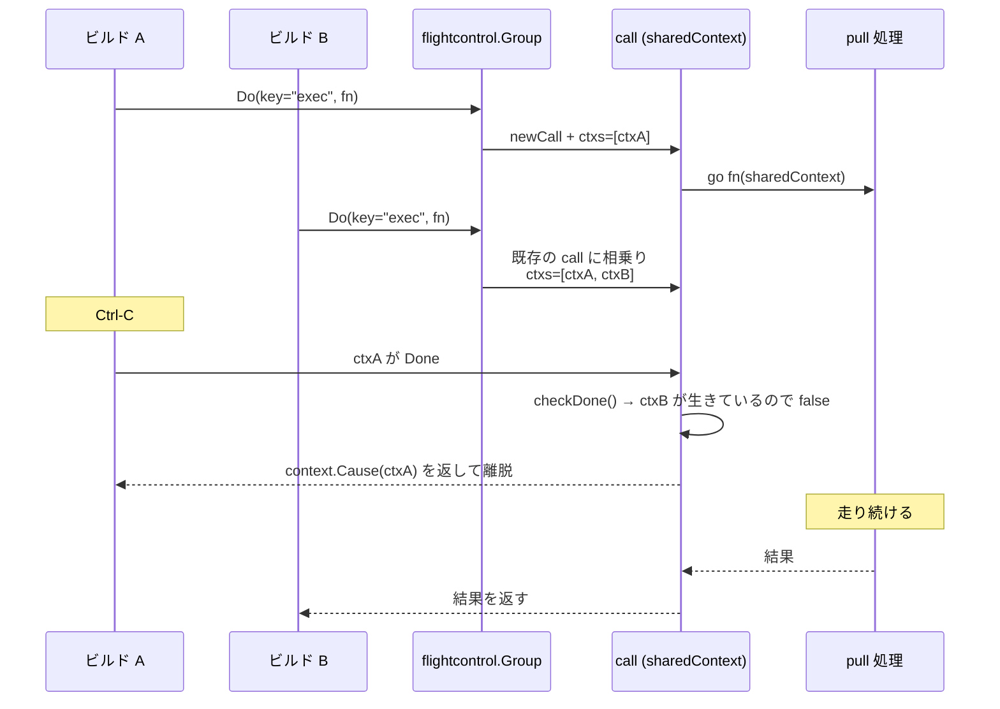

## 何を学んだか

`docker build` を 2 つの端末から同時に走らせて、両方が同じ `FROM golang:1.24` を使っていたとする。BuildKit は pull を 1 回しかしない。ここまでは singleflight でよくある話だ。

問題は片方が Ctrl-C されたときで、素朴な singleflight は最初の呼び出し元のコンテキストを共有処理に渡すので、**先に来たほうがキャンセルされると、後から相乗りしたほうも巻き添えで死ぬ**。BuildKit はこれを避けるために独自の singleflight を書いている。

```go title="util/flightcontrol/flightcontrol.go"
// flightcontrol is like singleflight but with support for cancellation and
// nested progress reporting
```

([util/flightcontrol/flightcontrol.go L15-L16](https://github.com/moby/buildkit/blob/ca4838f8ddbd3612bca94bcb8a938d8a326110a3/util/flightcontrol/flightcontrol.go#L15-L16))

キャンセルと、入れ子の進捗報告。この 2 つが標準的な singleflight に足されている。

共有と破棄は 2 つの層でそれぞれ管理される。

| 層                         | 何を共有するか                     | 誰がいなくなったら壊すか                             |
| -------------------------- | ---------------------------------- | ---------------------------------------------------- |
| `state` (`Solver.actives`) | 頂点の状態、`sharedOp`、進捗、edge | `state.jobs` と `state.parents` が両方空になったとき |
| `flightcontrol.call`       | 実行中の 1 回の関数呼び出し        | 登録された context が全部 Done になったとき          |

## flightcontrol — 待ち手が全員消えたらキャンセル

`Group.do` はキーで `call` を引き、無ければ作って `wait` に入るだけの素朴なマップ操作だ ([util/flightcontrol/flightcontrol.go L57-L80](https://github.com/moby/buildkit/blob/ca4838f8ddbd3612bca94bcb8a938d8a326110a3/util/flightcontrol/flightcontrol.go#L57-L80))。面白いのは `call.wait` のほうにある。

```go title="util/flightcontrol/flightcontrol.go"
	ctx, cancel := context.WithCancelCause(ctx)
	defer func() { cancel(errors.WithStack(context.Canceled)) }()

	c.ctxs = append(c.ctxs, ctx)

	c.mu.Unlock()

	go c.once.Do(c.run)

	select {
	case <-ctx.Done():
		if c.ctx.checkDone() {
			// if this cancelled the last context, then wait for function to shut down
			// and don't accept any more callers
			<-c.ready
			return c.result, c.err
		}
		if ok {
			c.progressState.close(pw)
		}
		return empty, context.Cause(ctx)
	case <-c.ready:
		return c.result, c.err // shared not implemented yet
	}
```

([util/flightcontrol/flightcontrol.go L159-L182](https://github.com/moby/buildkit/blob/ca4838f8ddbd3612bca94bcb8a938d8a326110a3/util/flightcontrol/flightcontrol.go#L159-L182))

待ち手は自分の context を `c.ctxs` に**登録する**。自分の context がキャンセルされたら `c.ctx.checkDone()` を呼び、「これで最後の 1 人だったか」を確かめる。最後でなければ、自分だけ抜ける (`return empty, context.Cause(ctx)`)。関数は走り続ける。

`checkDone` の中身が判定そのものだ。

```go title="util/flightcontrol/flightcontrol.go"
func (sc *sharedContext[T]) checkDone() bool {
	sc.mu.Lock()
	select {
	case <-sc.done:
		sc.mu.Unlock()
		return true
	default:
	}
	var err error
	for _, ctx := range sc.ctxs {
		select {
		case <-ctx.Done():
			err = ctx.Err()
		default:
			sc.mu.Unlock()
			return false
		}
	}
	sc.err = err
	close(sc.done)
	sc.mu.Unlock()
	return true
}
```

([util/flightcontrol/flightcontrol.go L254-L278](https://github.com/moby/buildkit/blob/ca4838f8ddbd3612bca94bcb8a938d8a326110a3/util/flightcontrol/flightcontrol.go#L254-L278))

登録された context を全部見て、1 つでも生きていれば即 `false`。全部死んでいたら `sc.done` を閉じる。

そして実行中の関数に渡される context は、この `sharedContext` から派生している。

```go title="util/flightcontrol/flightcontrol.go"
func (c *call[T]) run() {
	defer c.closeProgressWriter(errors.WithStack(context.Canceled))
	ctx, cancel := context.WithCancelCause(c.ctx)
	defer func() { cancel(errors.WithStack(context.Canceled)) }()
	v, err := c.fn(ctx)
	// ...
}
```

([util/flightcontrol/flightcontrol.go L118-L128](https://github.com/moby/buildkit/blob/ca4838f8ddbd3612bca94bcb8a938d8a326110a3/util/flightcontrol/flightcontrol.go#L118-L128))

`c.ctx` は `sharedContext` で、`Done()` は `sc.done` を返す。つまり **実行中の関数から見たキャンセルは「待ち手が全員消えた」ときにしか起きない。** `context.Context` インターフェースを自前実装することで、「複数の context の論理積」という標準ライブラリに無い合成を作っている。



## 進捗も後から合流できる

もう 1 つの「nested progress reporting」は `progressState` が担当する。

```go title="util/flightcontrol/flightcontrol.go"
func (ps *progressState) add(pw progress.Writer) {
	// ...
	slices.SortFunc(plist, func(a, b *progress.Progress) int {
		return a.Timestamp.Compare(b.Timestamp)
	})
	for _, p := range plist {
		rw.WriteRawProgress(p)
	}
	if ps.done {
		rw.Close()
	} else {
		ps.writers = append(ps.writers, rw)
	}
	ps.mu.Unlock()
}
```

([util/flightcontrol/flightcontrol.go L323-L345](https://github.com/moby/buildkit/blob/ca4838f8ddbd3612bca94bcb8a938d8a326110a3/util/flightcontrol/flightcontrol.go#L323-L345))

途中から相乗りしたビルドには、**それまでの進捗を時刻順にリプレイしてから**購読者に加える。pull が 50% 進んでから 2 本目のビルドが参加しても、その端末には 0% から 50% までのバーが一瞬で流れてから続きが表示される。既に終わっていれば (`ps.done`) 即 `Close` する。`ps.items` が ID ごとの最新値しか持たないので、リプレイは常に有限だ ([progress — 意図的に lossy な進捗ツリー](../progress/))。

## sharedOp — キャンセルを記憶しない

solver 側は `sharedOp` が持つ 3 つのグループ (`gDigest` / `gCacheRes` / `gExecRes`) でこれを使う ([solver/jobs.go L992-L998](https://github.com/moby/buildkit/blob/ca4838f8ddbd3612bca94bcb8a938d8a326110a3/solver/jobs.go#L992-L998))。`Exec` の中身に、キャンセル時の扱いが書かれている。

```go title="solver/jobs.go"
		res, err := op.Exec(ctx, s.st, inputs)
		complete := true
		if err != nil {
			select {
			case <-ctx.Done():
				if errdefs.IsCanceled(ctx, err) {
					complete = false
					releaseError(err)
					err = errors.Wrap(context.Cause(ctx), err.Error())
				}
			default:
			}
		}
		if complete {
			s.execDone = true
			// ...
			s.execErr = err
		}
```

([solver/jobs.go L1248-L1274](https://github.com/moby/buildkit/blob/ca4838f8ddbd3612bca94bcb8a938d8a326110a3/solver/jobs.go#L1248-L1274))

**キャンセルで終わった実行は `execDone` にしない。** 通常のエラーなら `execErr` に記録して、以後の呼び出しに同じエラーを返す (同じ `RUN` は何度やっても失敗するので、やり直す意味がない)。しかしキャンセルは「この実行が悪かった」わけではないので、記憶しない。後から来たジョブがもう一度実行できる。

`releaseError(err)` は、エラーに包まれた結果参照を解放する再帰関数だ ([solver/jobs.go L1415-L1425](https://github.com/moby/buildkit/blob/ca4838f8ddbd3612bca94bcb8a938d8a326110a3/solver/jobs.go#L1415-L1425))。記憶しないと決めた以上、それに付随する参照も手放す。

`CacheMap` と `CalcSlowCache` にもまったく同じ `complete` の扱いが入っている ([solver/jobs.go L1169-L1196](https://github.com/moby/buildkit/blob/ca4838f8ddbd3612bca94bcb8a938d8a326110a3/solver/jobs.go#L1169-L1196), [L1104-L1122](https://github.com/moby/buildkit/blob/ca4838f8ddbd3612bca94bcb8a938d8a326110a3/solver/jobs.go#L1104-L1122))。

## errRetry — 完了直後の隙間を埋める

`flightcontrol` にはもう 1 つ、リトライの仕掛けがある。

```go title="util/flightcontrol/flightcontrol.go"
	select {
	case <-c.ready:
		c.mu.Unlock()
		if c.err != nil { // on error retry
			<-c.cleaned
			return empty, errRetry
		}
		// ...
	case <-c.ctx.done: // could return if no error
		c.mu.Unlock()
		<-c.cleaned
		return empty, errRetry
	default:
	}
```

([util/flightcontrol/flightcontrol.go L132-L152](https://github.com/moby/buildkit/blob/ca4838f8ddbd3612bca94bcb8a938d8a326110a3/util/flightcontrol/flightcontrol.go#L132-L152))

「マップから取れたが、その `call` は既に終わっていた」という競合がありうる。`do` がマップを引いてから `wait` に入るまでの間に、掃除用の goroutine がキーを消すかもしれないからだ。このとき `errRetry` を返し、`cleaned` を待ってから `Do` のループがもう一度回る。

```go title="util/flightcontrol/flightcontrol.go"
	for {
		v, err = g.do(ctx, key, fn)
		if err == nil || !errors.Is(err, errRetry) {
			return v, err
		}
		// backoff logic
		if backoff >= 15*time.Second {
			err = errors.Wrapf(errRetryTimeout, "flightcontrol")
			return v, err
		}
		if backoff > 0 {
			backoff = time.Duration(float64(backoff) * 1.2)
		} else {
			// randomize initial backoff to avoid all goroutines retrying at once
			backoff = time.Millisecond + time.Duration(rand.Intn(1e7))*time.Nanosecond
		}
		time.Sleep(backoff)
	}
```

([util/flightcontrol/flightcontrol.go L34-L55](https://github.com/moby/buildkit/blob/ca4838f8ddbd3612bca94bcb8a938d8a326110a3/util/flightcontrol/flightcontrol.go#L34-L55))

初回のバックオフをランダムにするのは、待っていた全員が同時に再挑戦して同じ競合を再発させるのを防ぐため。上限 15 秒で `errRetryTimeout` を返して諦める。**無限リトライにしないことで、リトライループ自体がバグったときにハングしない。**

## state の参照カウント

flightcontrol が守るのは 1 回の関数呼び出しの寿命だけだ。頂点そのものの寿命は `state` が管理する。

```go title="solver/jobs.go"
	for k, st := range j.list.actives {
		st.mu.Lock()
		if _, ok := st.jobs[j]; ok {
			// ...
			delete(st.jobs, j)
			j.list.deleteIfUnreferenced(k, st)
		}
		delete(st.allPw, j.pw)
		st.mu.Unlock()
	}
```

([solver/jobs.go L859-L898](https://github.com/moby/buildkit/blob/ca4838f8ddbd3612bca94bcb8a938d8a326110a3/solver/jobs.go#L859-L898))

`actives` を全走査して、この Job を参照集合から抜く。**抜いた結果まだ誰かがいれば、何も壊さない。**

```go title="solver/jobs.go"
// called with solver lock
func (jl *Solver) deleteIfUnreferenced(k digest.Digest, st *state) {
	if len(st.jobs) == 0 && len(st.parents) == 0 {
		// ...
		for chKey := range st.childVtx {
			chState := jl.actives[chKey]
			delete(chState.parents, k)
			jl.deleteIfUnreferenced(chKey, chState)
		}
		st.Release()
		delete(jl.actives, k)
	}
	// ...
}
```

([solver/jobs.go L746-L783](https://github.com/moby/buildkit/blob/ca4838f8ddbd3612bca94bcb8a938d8a326110a3/solver/jobs.go#L746-L783))

参照は 2 種類ある。`jobs` (クライアントのビルド) と `parents` (この頂点を入力として使っている上流頂点)。両方が空になったときだけ破棄し、破棄したら子頂点の `parents` から自分を外して再帰する。**DAG の上から順に参照が剥がれていく。**

`state.Release` は edge / `sharedOp` / `releasers` の 3 つを解放する ([solver/jobs.go L315-L330](https://github.com/moby/buildkit/blob/ca4838f8ddbd3612bca94bcb8a938d8a326110a3/solver/jobs.go#L315-L330))。edge はマージされているかもしれないので `owner` を辿ってから解放する ([edge のマージ](../edge-merge/))。その edge 側にもう 1 段のカウンタがある。

```go title="solver/edge.go"
// release releases the edge resources
func (e *edge) release() {
	if e.releaserCount > 0 {
		e.releaserCount--
		return
	}
	e.releaseResult()
}
```

([solver/edge.go L130-L137](https://github.com/moby/buildkit/blob/ca4838f8ddbd3612bca94bcb8a938d8a326110a3/solver/edge.go#L130-L137))

マージで吸収した edge の数だけ空振りして、最後の 1 回で本当に解放する。

`releasers` は `JobContext.Cleanup` で登録された関数だ。

```go title="solver/types.go"
	// Cleanup adds a function that is called when the job is done. This can be used to associate
	// resources with the job and keep them from being released until the job is done.
	Cleanup(func() error) error
```

([solver/types.go L188-L190](https://github.com/moby/buildkit/blob/ca4838f8ddbd3612bca94bcb8a938d8a326110a3/solver/types.go#L188-L190))

Op が実行中に確保した資源 (一時的な lease やマウント) をここに預けておくと、頂点が破棄されるまで生き残る。

## Job 自体は 10 秒生き残る

`Discard` の末尾に、少し変わった処理がある。

```go title="solver/jobs.go"
	go func() {
		// don't clear job right away. there might still be a status request coming to read progress
		time.Sleep(10 * time.Second)
		j.list.mu.Lock()
		defer j.list.mu.Unlock()
		delete(j.list.jobs, j.id)
	}()
```

([solver/jobs.go L890-L896](https://github.com/moby/buildkit/blob/ca4838f8ddbd3612bca94bcb8a938d8a326110a3/solver/jobs.go#L890-L896))

`Job` の資源はすぐ解放するが、`jobs` マップからの削除だけ 10 秒待つ。進捗ストリームは別の gRPC 呼び出しで来るので、ビルドが終わってから `Status` が来ることがある。ID が消えていると `Solver.Get` が `UnknownJobError` を返してしまう。

逆に、`Build` より先に `Status` が来ることもある。`Solver.Get` は 6 秒のタイムアウト付きで `updateCond` を待ち、その間にジョブが登録されれば返す ([solver/jobs.go L717-L744](https://github.com/moby/buildkit/blob/ca4838f8ddbd3612bca94bcb8a938d8a326110a3/solver/jobs.go#L717-L744))。**「Status が Build より先に着く」と「Status が Discard より後に着く」の両方を、寿命の両端に猶予を置いて吸収している。** 分散システムの端でよく見る形の対処が、単一プロセスの中でも要る。

## なぜそうなっているか

`docs/dev/solver.md` は共有の理由をこう書く。

> if two other vertexes request a vertex with the same digest as an input, they will wait for the same operation to finish.

([docs/dev/solver.md L57-L59](https://github.com/moby/buildkit/blob/ca4838f8ddbd3612bca94bcb8a938d8a326110a3/docs/dev/solver.md#L57-L59))

> When the job finishes, it removes all of its references from the loaded vertex. The resources are released if no more references remain.

([docs/dev/solver.md L180-L182](https://github.com/moby/buildkit/blob/ca4838f8ddbd3612bca94bcb8a938d8a326110a3/docs/dev/solver.md#L180-L182))

BuildKit がデーモンであることが、この設計の前提だ。1 プロセスが複数のクライアントの複数のビルドを同時に抱える以上、共有は避けられないし、片方の都合でもう片方を壊すわけにもいかない。

`sync.WaitGroup` や参照カウンタ 1 個では足りないのは、**「待っている人が全員消えたら止めたい」が context のキャンセル伝播と噛み合わない**からだ。標準の `context` は木構造で、親をキャンセルすれば子が全部死ぬ。ここで欲しいのは逆で、子が全部死んだら親を止めたい。`sharedContext` が `context.Context` を自前実装しているのはそのためだ。

## どう活かすか

**共有処理には「呼び出し元の context」を渡さない。** 最初に来た人の都合で全員が巻き添えになる。`context.WithoutCancel` で切り離すだけでは今度は止まらなくなるので、待ち手の集合から論理積の context を作る。`context.Context` は interface なので、こういう合成は自分で書ける。

**キャンセルはメモ化しない。** 失敗の記憶は正しいが、キャンセルの記憶は間違いだ。`complete` フラグ 1 個で「この結果を記憶してよいか」を分けておくと、リトライの意味論が壊れない。

**参照は「誰が」まで持つ。** `map[*Job]struct{}` と `map[Digest]struct{}` の 2 本を分けて持つことで、「ビルドが要求している」と「上流頂点が要求している」を区別できる。デバッグログで `jobs` の ID 一覧をそのまま出せるのも、集合で持っている副産物だ。

**リトライには必ず上限を置く。** 競合を吸収するリトライは有用だが、上限が無いとリトライ自体のバグでプロセスがハングする。BuildKit は 15 秒で諦めて専用のエラーを返す。

**寿命の両端に猶予を置く。** 「まだ来ていない要求」と「もう来ないはずの要求」の両方が現実には来る。入口で待ち、出口で残す。単一プロセスの中でも、非同期な参照者がいるなら必要になる。
