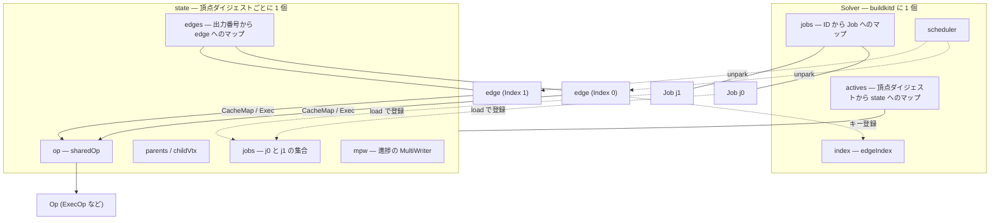

## 何を学んだか

solver に出てくる 4 つの型は、粒度がすべて違う。

| 型         | 粒度                                      | 主な持ち物                                             |
| ---------- | ----------------------------------------- | ------------------------------------------------------ |
| `Job`      | ビルド 1 本 (クライアントの 1 リクエスト) | 進捗リーダ、セッション ID、解放関数                    |
| `state`    | 頂点 1 個 (ダイジェスト単位)              | この頂点を要求している Job の集合、`edges`、`sharedOp` |
| `edge`     | 頂点の出力 1 本 (頂点 × Index)            | 状態機械、依存への要求、キャッシュキー                 |
| `sharedOp` | 頂点 1 個の実行                           | flightcontrol グループ、実行結果のメモ                 |

この分割の要点は 2 つある。**同じ頂点を複数のビルドが要求しても `state` は 1 個**であること、そして **`state` の中に出力番号ごとの `edge` がぶら下がる**ことだ。前者が「同じ `RUN` を 2 本のビルドが要求したら 1 回しか実行しない」を成立させ、後者が「1 回の実行が複数の出力を返す」を成立させる。



## Solver — 共有グラフの入れ物

```go title="solver/jobs.go"
// Solver provides a shared graph of all the vertexes currently being
// processed. Every vertex that is being solved needs to be loaded into job
// first.
type Solver struct {
	mu      sync.RWMutex
	jobs    map[string]*Job
	actives map[digest.Digest]*state
	opts    SolverOpt

	updateCond *sync.Cond
	s          *scheduler
	index      *edgeIndex
}
```

([solver/jobs.go L37-L50](https://github.com/moby/buildkit/blob/ca4838f8ddbd3612bca94bcb8a938d8a326110a3/solver/jobs.go#L37-L50))

`Solver` は buildkitd に 1 個しかない。`scheduler` も `edgeIndex` もここにぶら下がっているので、**別々のクライアントから来た別々のビルドが、同じスケジューラと同じインデックスを共有する**。これが並列ビルド間の重複排除の土台になる。

`actives` のキーは頂点ダイジェストだ。ビルドを開始すると、まず DAG 全体がここに載る。

## load — 頂点を actives に載せる

```go title="solver/jobs.go"
func (j *Job) Build(ctx context.Context, e Edge) (CachedResultWithProvenance, error) {
	// ...
	v, err := j.list.load(ctx, e.Vertex, nil, j)
	if err != nil {
		return nil, err
	}
	e.Vertex = v

	res, err := j.list.s.build(ctx, e)
	// ...
}
```

([solver/jobs.go L785-L804](https://github.com/moby/buildkit/blob/ca4838f8ddbd3612bca94bcb8a938d8a326110a3/solver/jobs.go#L785-L804))

`load` は DAG を根から辿って全頂点を `actives` に入れ、`Build` に渡された `Edge.Vertex` を「`actives` に載っているほうの `Vertex`」に差し替える。ここで差し替えが起きるのが重要で、以降のコードはすべて共有グラフ上の頂点だけを見る。

`loadUnlocked` の中心はこうだ。

```go title="solver/jobs.go"
if !ok {
	st = &state{ /* ... vtx: v, edges: map[Index]*edge{}, solver: jl ... */ }
	jl.actives[dgst] = st
}
// ...
if j != nil {
	if _, ok := st.jobs[j]; !ok {
		st.jobs[j] = struct{}{}
	}
}
```

([solver/jobs.go L576-L644](https://github.com/moby/buildkit/blob/ca4838f8ddbd3612bca94bcb8a938d8a326110a3/solver/jobs.go#L576-L644))

既に `actives` にあれば新しい `state` は作らず、`st.jobs` に Job を足すだけだ。**`state.jobs` は参照カウントそのもの**であり、`Job.Discard` でここから抜けたときに誰もいなくなれば `state` が破棄される ([ジョブの共有と破棄](../job-sharing/))。

`--no-cache` 相当の `IgnoreCache` が絡むと、キーが 1 段ずれる。

```go title="solver/jobs.go"
dgstWithoutCache := digest.FromBytes(fmt.Appendf(nil, "%s-ignorecache", dgst))

// if same vertex is already loaded without cache just use that
st, ok := jl.actives[dgstWithoutCache]
// ...
	// !ignorecache merges with ignorecache but ignorecache doesn't merge with !ignorecache
	if ok && !st.vtx.Options().IgnoreCache && v.Options().IgnoreCache {
		dgst = dgstWithoutCache
	}
```

([solver/jobs.go L547-L565](https://github.com/moby/buildkit/blob/ca4838f8ddbd3612bca94bcb8a938d8a326110a3/solver/jobs.go#L547-L565))

キャッシュを使ってよいビルドは、キャッシュを無視して走っているビルドに相乗りしてよい (その実行結果は正しい)。逆はだめだ (キャッシュから読んだ結果を `--no-cache` のビルドに渡すことになる)。この非対称性を、ダイジェストの空間を 2 つに割ることで表現している。

## state — 頂点 1 個ぶんの共有状態

```go title="solver/jobs.go"
type state struct {
	jobs      map[*Job]struct{}
	parents   map[digest.Digest]struct{}
	childVtx  map[digest.Digest]struct{}
	releasers []func() error

	mpw      *progress.MultiWriter
	// ...
	vtx          Vertex
	origDigest   digest.Digest

	mu    sync.RWMutex
	op    *sharedOp
	edges map[Index]*edge
	// ...
	mainCache CacheManager
	solver    *Solver
}
```

([solver/jobs.go L52-L78](https://github.com/moby/buildkit/blob/ca4838f8ddbd3612bca94bcb8a938d8a326110a3/solver/jobs.go#L52-L78))

`state` は 3 つのことを引き受けている。

1. **誰がこの頂点を必要としているか** — `jobs` と `parents` / `childVtx`。`parents` はサブビルド (フロントエンドが solver を再帰的に呼ぶ場合) の親頂点で、Job と同じく参照として数えられる。
2. **進捗の合流点** — `mpw` は `MultiWriter` で、この頂点を要求している全 Job の progress writer が足される。だから 2 本のビルドが同じ `RUN` を共有していれば、1 回の実行のログが両方の端末に出る。
3. **実行と辺の入れ物** — `op` と `edges`。

`state` は `JobContext` インターフェースも実装している。

```go title="solver/jobs.go"
func (s *state) Session() session.Group { return s }
func (s *state) ResolverCache() ResolverCache { return s }
```

([solver/jobs.go L80-L93](https://github.com/moby/buildkit/blob/ca4838f8ddbd3612bca94bcb8a938d8a326110a3/solver/jobs.go#L80-L93))

`Session()` が `state` 自身を返すのは、共有された頂点にとって「どのクライアントのセッションを使うか」が一意でないからだ。`sessionIterator` は `state.jobs` を順に舐め、それでも見つからなければ `parents` を辿って上流の Job のセッションを試す。認証情報の取得やファイル同期は、この順で候補を試していく ([SessionManager と、複数ジョブでのセッション共有](../session-manager/))。

## edge — 出力 1 本ぶんの状態機械

`edge` は `state` の中で遅延生成される。

```go title="solver/jobs.go"
func (s *state) getEdge(index Index) *edge {
	s.mu.Lock()
	defer s.mu.Unlock()
	if e, ok := s.edges[index]; ok {
		for e.owner != nil {
			e = e.owner
		}
		return e
	}

	if s.op == nil {
		s.op = newSharedOp(s.opts.ResolveOpFunc, s)
	}

	e := newEdge(Edge{Index: index, Vertex: s.vtx}, s.op, s.index)
	s.edges[index] = e
	return e
}
```

([solver/jobs.go L203-L220](https://github.com/moby/buildkit/blob/ca4838f8ddbd3612bca94bcb8a938d8a326110a3/solver/jobs.go#L203-L220))

3 点ある。

- **`edges` は `map[Index]*edge`** — 出力 0 番だけが要求されているなら `edge` は 1 個しか作られない。要求されてもいない出力のために状態機械を回すことはない。
- **`sharedOp` はここで初めて作られる** — 最初に `edge` が要求された瞬間に `newSharedOp` が呼ばれ、以後すべての `edge` が同じ `sharedOp` を共有する。
- **`owner` を辿る** — マージされた `edge` は `owner` に転送先が入る。`getEdge` は必ずチェーンの先頭まで辿るので、呼び出し側はマージを意識しなくてよい ([edge のマージ](../edge-merge/))。

`edge` 本体の持ち物は大きい。

```go title="solver/edge.go"
type edge struct {
	edge Edge
	op   activeOp

	edgeState
	depRequests map[pipeReceiver]*dep
	deps        []*dep

	cacheMapReq        pipeReceiver
	execReq            pipeReceiver
	err                error
	cacheRecords       map[string]*CacheRecord
	// ...
	noCacheMatchPossible      bool
	allDepsCompletedCacheFast bool
	allDepsCompletedCacheSlow bool
	allDepsStateCacheSlow     bool
	allDepsCompleted          bool
	hasActiveOutgoing         bool

	releaserCount int
	owner         *edge
	keysDidChange bool
	index         *edgeIndex
	// ...
}
```

([solver/edge.go L41-L76](https://github.com/moby/buildkit/blob/ca4838f8ddbd3612bca94bcb8a938d8a326110a3/solver/edge.go#L41-L76))

埋め込まれている `edgeState` が「外に見せる状態」で、それ以外はすべて内部の作業領域だ。

```go title="solver/edge.go"
// edgeState hold basic mutable state info for an edge
type edgeState struct {
	state    edgeStatusType
	result   *SharedCachedResult
	cacheMap *CacheMap
	keys     []ExportableCacheKey
}
```

([solver/edge.go L108-L114](https://github.com/moby/buildkit/blob/ca4838f8ddbd3612bca94bcb8a938d8a326110a3/solver/edge.go#L108-L114))

`edge` が上流の `edge` に返すのはこの 4 フィールドだけだ ([edge の状態機械](../edge-state-machine/))。`allDeps*` のようなブール値の束は外に出ない。

依存 1 本ぶんの状態は `dep` にまとまっている。

```go title="solver/edge.go"
// dep holds state for a dependant edge
type dep struct {
	req pipeReceiver
	edgeState
	index             Index
	keyMap            map[string]*CacheKey
	slowCacheReq      pipeReceiver
	slowCacheComplete bool
	slowCacheFoundKey bool
	slowCacheKey      *ExportableCacheKey
	err               error
}
```

([solver/edge.go L78-L89](https://github.com/moby/buildkit/blob/ca4838f8ddbd3612bca94bcb8a938d8a326110a3/solver/edge.go#L78-L89))

`dep` にも `edgeState` が埋め込まれている。これは「入力の edge から最後に受け取った状態のコピー」だ。`keyMap` は「そのキーからこの辺へのキャッシュリンクが実在した」ものだけが入る絞り込み後の集合で、`keys` (入力が持っているキー全部) とは別物だ。この 2 つの差が、状態機械の判断のほぼすべてを決めている。

## sharedOp — 実行を 1 回にする層

```go title="solver/jobs.go"
type sharedOp struct {
	resolver  ResolveOpFunc
	st        *state
	gDigest   flightcontrol.Group[digest.Digest]
	gCacheRes flightcontrol.Group[[]*CacheMap]
	gExecRes  flightcontrol.Group[*execRes]

	opOnce     sync.Once
	op         Op
	subBuilder *subBuilder
	err        error

	execRes  *execRes
	execDone bool
	execErr  error

	cacheRes  []*CacheMap
	cacheDone bool
	cacheErr  error
	// ...
}
```

([solver/jobs.go L992-L1015](https://github.com/moby/buildkit/blob/ca4838f8ddbd3612bca94bcb8a938d8a326110a3/solver/jobs.go#L992-L1015))

`edge` から見た `sharedOp` は `activeOp` インターフェース越しだ。

```go title="solver/jobs.go"
type activeOp interface {
	CacheMap(context.Context, int) (*cacheMapResp, error)
	LoadCache(ctx context.Context, rec *CacheRecord) (Result, func(context.Context) context.Context, error)
	Exec(ctx context.Context, inputs []Result) (outputs []Result, exporters []ExportableCacheKey, ctxOpts func(context.Context) context.Context, err error)
	IgnoreCache() bool
	Cache() CacheManager
	CalcSlowCache(context.Context, Index, PreprocessFunc, ResultBasedCacheFunc, Result) (digest.Digest, error)
}
```

([solver/jobs.go L968-L975](https://github.com/moby/buildkit/blob/ca4838f8ddbd3612bca94bcb8a938d8a326110a3/solver/jobs.go#L968-L975))

`solver.Op` にはなかった `LoadCache` / `IgnoreCache` / `Cache` / `CalcSlowCache` が生えている。つまり **`sharedOp` は `Op` の薄いラッパではなく、「実行系のすべて」を `edge` に対して一枚に見せる層**だ。`Op` が知らないキャッシュマネージャの選択や進捗の接続はここで解決される。

3 つの flightcontrol グループは、それぞれ「キャッシュマップ計算」「slow cache 計算」「実行」を重複排除する。同じ `state` の別 `edge` (出力 0 と出力 1) が同時に `Exec` を呼んでも、走るのは 1 回だ。

```go title="solver/jobs.go"
flightControlKey := "exec"
res, err := s.gExecRes.Do(ctx, flightControlKey, func(ctx context.Context) (ret *execRes, retErr error) {
	if s.execDone {
		if s.execErr != nil {
			return nil, s.execErr
		}
		return s.execRes, nil
	}
	// ...
})
```

([solver/jobs.go L1219-L1226](https://github.com/moby/buildkit/blob/ca4838f8ddbd3612bca94bcb8a938d8a326110a3/solver/jobs.go#L1219-L1226))

flightcontrol は「実行中の重複」を潰し、`execDone` フラグは「完了後の再要求」を潰す。2 段構えなのは、flightcontrol が完了と同時にキーをマップから消すからだ。

## なぜそうなっているか

`docs/dev/solver.md` は、この 4 層の分かれ目を 2 箇所で説明している。

> After new build request is sent to the solver, it first loads all the vertexes to the shared graph structure. For status tracking, a job instance needs to be created, and vertexes are loaded through jobs. A job ID is assigned to every vertex. If vertex with the same digest has already been loaded to the shared graph, a new job ID is appended to the existing record.

([docs/dev/solver.md L176-L182](https://github.com/moby/buildkit/blob/ca4838f8ddbd3612bca94bcb8a938d8a326110a3/docs/dev/solver.md#L176-L182))

> When an edge needs to resolve an operation to call the async `CacheMap` and `Exec` methods, it does so by calling back to the shared graph. This makes sure that two different edges pointing to the same vertex do not execute twice.

([docs/dev/solver.md L313-L318](https://github.com/moby/buildkit/blob/ca4838f8ddbd3612bca94bcb8a938d8a326110a3/docs/dev/solver.md#L313-L318))

**「解く単位」と「実行する単位」が違う**のがこの設計の核心だ。同じドキュメントは冒頭でこう書いている。

> While the build definition is defined with vertexes, the scheduler is solving edges.

([docs/dev/solver.md L226-L232](https://github.com/moby/buildkit/blob/ca4838f8ddbd3612bca94bcb8a938d8a326110a3/docs/dev/solver.md#L226-L232))

`RUN` が 2 つの出力 (ルートファイルシステムと `--mount=type=cache` の書き込み先) を返すとき、上流の頂点が欲しいのはどちらか一方かもしれない。辺ごとにキャッシュキーも状態も別々に進むが、実行は 1 回でよい。**辺ごとに状態機械を持ち、実行だけを頂点単位に落とす**のが、この矛盾する要求に対する答えになっている。

## どう活かすか

**参照カウントを整数ではなく集合で持つ。** `state.jobs` は `map[*Job]struct{}` であって `int` ではない。集合にしておくと「誰が握っているか」がデバッグで見えるし、同じ Job が二重に登録されても壊れない。BuildKit はキャッシュ参照でも同じ手を使っている ([参照カウントをカウンタではなく集合で持つ](../refcount-set/))。

**共有の粒度を、キャンセルの粒度と一致させない。** ビルドはキャンセルされるが、実行は共有されている。この 2 つを同じオブジェクトに載せると、片方のキャンセルがもう片方を殺す。`Job` と `sharedOp` を分け、間に `state` の参照集合を挟んだことで、「要求している人が全員いなくなったときだけ止める」が書けるようになっている。

**非対称なマージ規則は、キー空間を割って表現する。** `IgnoreCache` の相乗り可否は本質的に非対称だ。`if` 文で場合分けするのではなく `dgst` と `dgst-ignorecache` の 2 つのキーを用意することで、「載る側は 1 方向にしか動かない」ことがデータ構造として保証されている。
