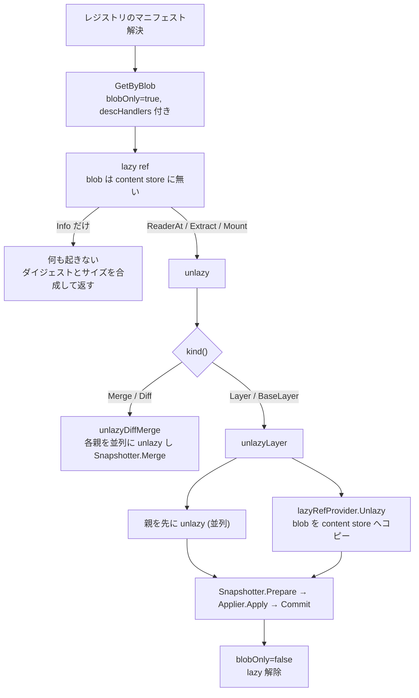

## 何を学んだか

`GetByBlob` はレイヤの blob をダウンロードせずにキャッシュレコードを作る ([GetByBlob](../get-by-blob/))。ダイジェストと「どこから取ってこられるか」のハンドラだけあれば、ref は成立する。この状態の ref を BuildKit は lazy と呼ぶ。

lazy な ref は、実際に中身が要求されたとき (マウントする、tar を読む、レジストリに存在しないので upload する) に初めて実体を取りに行く。逆に言えば、要求されなければ落ちてこない。`FROM golang:1.24 AS builder` と書いても、その stage の成果物が最終イメージに入らず、キャッシュキーだけ確定すればよいなら、golang のレイヤはダウンロードされない。

## 何が lazy なのか

判定は `cacheRecord.isLazy` にある。

```go title="cache/refs.go"
func (cr *cacheRecord) isLazy(ctx context.Context) (bool, error) {
	if !cr.getBlobOnly() {
		return false, nil
	}
	dgst := cr.getBlob()
	// special case for moby where there is no compressed blob (empty digest)
	if dgst == "" {
		return false, nil
	}
	_, err := cr.cm.ContentStore.Info(ctx, dgst)
	if errors.Is(err, cerrdefs.ErrNotFound) {
		return true, nil
	} else if err != nil {
		return false, err
	}

	// If the snapshot is a remote snapshot, this layer is lazy.
	if info, err := cr.cm.Snapshotter.Stat(ctx, cr.getSnapshotID()); err == nil {
		if _, ok := info.Labels["containerd.io/snapshot/remote"]; ok {
			return true, nil
		}
	}

	return false, nil
}
```

([cache/refs.go L297-L321](https://github.com/moby/buildkit/blob/ca4838f8ddbd3612bca94bcb8a938d8a326110a3/cache/refs.go#L297-L321))

条件は 2 通り。`blobOnly` (スナップショットに展開していない) かつ content store に blob が無い場合と、スナップショットが remote スナップショット (stargz など、マウント時に必要な部分だけ取ってくる形式) の場合。前者が本命だ。

`blobOnly` は `GetByBlob` が新規レコードに立てるフラグで、展開が済むと `unlazyLayer` の最後で `queueBlobOnly(false)` に落ちる ([cache/refs.go L1426](https://github.com/moby/buildkit/blob/ca4838f8ddbd3612bca94bcb8a938d8a326110a3/cache/refs.go#L1426))。

## 取ってくる術が無い ref は作らせない

lazy な ref は「後で取ってこられる」ことが前提なので、その術を持たない ref を掴ませてはいけない。`getRecord` の冒頭に検査がある。

```go title="cache/manager.go"
	checkLazyProviders := func(rec *cacheRecord) error {
		missing := NeedsRemoteProviderError(nil)
		dhs := descHandlersOf(opts...)
		if err := rec.walkUniqueAncestors(func(cr *cacheRecord) error {
			blob := cr.getBlob()
			if isLazy, err := cr.isLazy(ctx); err != nil {
				return err
			} else if isLazy && dhs[blob] == nil {
				missing = append(missing, blob)
			}
			return nil
		}); err != nil {
			return err
		}
		if len(missing) > 0 {
			return missing
		}
		return nil
	}
```

([cache/manager.go L395-L413](https://github.com/moby/buildkit/blob/ca4838f8ddbd3612bca94bcb8a938d8a326110a3/cache/manager.go#L395-L413))

自分だけでなく祖先を全部歩き、lazy なのに `DescHandlers` にエントリが無い blob を集めて `NeedsRemoteProviderError` として返す。エラー型自体がダイジェストのスライスになっているので、何が足りないのかを呼び出し側が読める。

```go title="cache/opts.go"
type DescHandler struct {
	Provider       func(session.Group) content.Provider
	Progress       progress.Controller
	SnapshotLabels map[string]string
	Annotations    map[string]string
	Ref            string // string representation of desc origin, can be used as a sync key
}

type DescHandlers map[digest.Digest]*DescHandler
```

([cache/opts.go L12-L20](https://github.com/moby/buildkit/blob/ca4838f8ddbd3612bca94bcb8a938d8a326110a3/cache/opts.go#L12-L20))

`Provider` がセッションを受け取って `content.Provider` を返す形になっているのは、レジストリ認証がクライアント側のセッション経由で来るからだ ([auth-delegation](../auth-delegation/))。ハンドラは `RefOption` として `Get` / `GetByBlob` に渡され、生成された ref の `descHandlers` フィールドに保持される。イメージ pull の側は、マニフェストを解決した時点でレイヤごとのハンドラを作って `solver.CacheOpts` に載せる ([image-source](../image-source/))。

## 読まれるまで取りに行かない — lazyRefProvider

lazy な ref を content store のように見せるアダプタが `lazyRefProvider` だ。3 つのメソッドの挙動が要点になる。

```go title="cache/remote.go"
func (p lazyRefProvider) ReaderAt(ctx context.Context, desc ocispecs.Descriptor) (content.ReaderAt, error) {
	if desc.Digest != p.desc.Digest {
		return nil, cerrdefs.ErrNotFound
	}
	if err := p.Unlazy(ctx); err != nil {
		return nil, err
	}
	return p.ref.cm.ContentStore.ReaderAt(ctx, desc)
}

func (p lazyRefProvider) Info(ctx context.Context, dgst digest.Digest) (content.Info, error) {
	if dgst != p.desc.Digest {
		return content.Info{}, cerrdefs.ErrNotFound
	}
	info, err := p.ref.cm.ContentStore.Info(ctx, dgst)
	if err == nil {
		return info, nil
	}

	if isLazy, err1 := p.ref.isLazy(ctx); err1 != nil {
		return content.Info{}, err1
	} else if !isLazy {
		return content.Info{}, err
	}

	// for lazy records don't unlazy without read request
	return content.Info{
		Digest: p.desc.Digest,
		Size:   p.desc.Size,
	}, nil
}
```

([cache/remote.go L302-L332](https://github.com/moby/buildkit/blob/ca4838f8ddbd3612bca94bcb8a938d8a326110a3/cache/remote.go#L302-L332))

`Info` はダイジェストとサイズを合成して返し、ダウンロードしない。コメントがそのまま設計判断になっている。`ReaderAt` だけが `Unlazy` を呼ぶ。「メタデータの問い合わせ」と「バイト列の読み出し」を分けているのがこの層の全部で、これによって「存在確認だけして終わる利用者」が無料になる。

`Unlazy` の本体は、ダイジェストをキーにした flightcontrol で重複を潰しつつ、blob を content store へまるごとコピーする。

```go title="cache/remote.go"
		// For now, just pull down the whole content and then return a ReaderAt from the local content
		// store. If efficient partial reads are desired in the future, something more like a "tee"
		// that caches remote partial reads to a local store may need to replace this.
		err := contentutil.Copy(ctx, p.ref.cm.ContentStore, &pullprogress.ProviderWithProgress{
			Provider: p.dh.Provider(p.session),
			Manager:  p.ref.cm.ContentStore,
		}, p.desc, p.dh.Ref, logs.LoggerFromContext(ctx))
```

([cache/remote.go L334-L400](https://github.com/moby/buildkit/blob/ca4838f8ddbd3612bca94bcb8a938d8a326110a3/cache/remote.go#L334-L400))

コピーが終わると `defer` で `linkBlob` を呼び、blob をレコードに紐づける ([圧縮バリアント](../compression-variants/))。ダウンロード元のイメージ参照が分かっていれば、レコードの description を `pulled from <ref>` に書き換える。進捗表示に「どこから来たレイヤか」が出るのはここ。

## unlazy が強制される場所

`isLazy` を解除する経路は 2 系統ある。**content store に blob を用意するだけ**の `ensureLocalContentBlob` と、**スナップショットまで展開する** `Extract` だ。

```go title="cache/refs.go"
func (sr *immutableRef) ensureLocalContentBlob(ctx context.Context, s session.Group) error {
	if (sr.kind() == Layer || sr.kind() == BaseLayer) && !sr.getBlobOnly() {
		return nil
	}

	return sr.unlazy(ctx, sr.descHandlers, sr.progress, s, true, true)
}

func (sr *immutableRef) Extract(ctx context.Context, s session.Group) (rerr error) {
	if (sr.kind() == Layer || sr.kind() == BaseLayer) && !sr.getBlobOnly() {
		return nil
	}
	// ... stargz / overlaybd の特別扱い ...
	return sr.unlazy(ctx, sr.descHandlers, sr.progress, s, true, false)
}
```

([cache/refs.go L1010-L1040](https://github.com/moby/buildkit/blob/ca4838f8ddbd3612bca94bcb8a938d8a326110a3/cache/refs.go#L1010-L1040))

最後の引数 `ensureContentStore` が両者の差だ。true なら「スナップショットがあっても content store に blob が無ければ落としてくる」。

強制される具体的な地点は次のとおり。

| 呼び出し元                                                                                                                                                                                | なぜ必要か                               |
| ----------------------------------------------------------------------------------------------------------------------------------------------------------------------------------------- | ---------------------------------------- |
| `immutableRef.Mount` ([cache/refs.go L976](https://github.com/moby/buildkit/blob/ca4838f8ddbd3612bca94bcb8a938d8a326110a3/cache/refs.go#L976))                                            | マウントするにはファイルシステムが要る   |
| `cacheManager.New` ([cache/manager.go L585](https://github.com/moby/buildkit/blob/ca4838f8ddbd3612bca94bcb8a938d8a326110a3/cache/manager.go#L585))                                        | 親の上に書き込み可能レイヤを作る         |
| `FileList` ([cache/filelist.go L38](https://github.com/moby/buildkit/blob/ca4838f8ddbd3612bca94bcb8a938d8a326110a3/cache/filelist.go#L38))                                                | レイヤ tar を読んでファイル名を列挙する  |
| `FileOp` の一部 ([solver/llbsolver/ops/file.go L707](https://github.com/moby/buildkit/blob/ca4838f8ddbd3612bca94bcb8a938d8a326110a3/solver/llbsolver/ops/file.go#L707))                   | ファイル操作の対象を実体化する           |
| `ensureCompression` ([cache/blobs.go L491-L498](https://github.com/moby/buildkit/blob/ca4838f8ddbd3612bca94bcb8a938d8a326110a3/cache/blobs.go#L491-L498))                                 | 別の圧縮形式へ変換するには元データが要る |
| エクスポータの `Unlazy` ([exporter/containerimage/export.go L495](https://github.com/moby/buildkit/blob/ca4838f8ddbd3612bca94bcb8a938d8a326110a3/exporter/containerimage/export.go#L495)) | ローカルのイメージストアに保存する       |

`ensureCompression` には例外がある。要求された圧縮形式にすでに合致していれば、変換不要なので lazy のまま返す。

```go title="cache/blobs.go"
		} else if layerConvertFunc == nil {
			if isLazy, err := ref.isLazy(ctx); err != nil {
				return nil, err
			} else if isLazy {
				// This ref can be used as the specified compressionType. Keep it lazy.
				return l, nil
			}
```

([cache/blobs.go L472-L478](https://github.com/moby/buildkit/blob/ca4838f8ddbd3612bca94bcb8a938d8a326110a3/cache/blobs.go#L472-L478))



## 効くのはどんな場面か

**pull してそのまま push する。** `pushImage` は `GetRemotes` で得た provider をそのまま `push.Push` に渡し、`Unlazy` を呼ばない ([exporter/containerimage/export.go L416-L441](https://github.com/moby/buildkit/blob/ca4838f8ddbd3612bca94bcb8a938d8a326110a3/exporter/containerimage/export.go#L416-L441))。push 側はまず宛先レジストリにその blob が既にあるかを問い合わせ、あればアップロードを飛ばす。無いときだけ `ReaderAt` が呼ばれ、そこで初めてダウンロードが走る。同一レジストリ内のタグ付け直しのような操作では、レイヤが 1 バイトも BuildKit を通らない。

一方、ローカルのイメージストアに保存する経路 (`--output type=image` で store するとき) は `!e.storeAllowIncomplete` の条件下で明示的に `Unlazy` する。保存先にはバイト列が必要だからだ。

**マルチプラットフォームビルド。** `linux/amd64` と `linux/arm64` を同時にビルドして push するとき、ベースイメージのレイヤはどちらもキャッシュキーの計算に使われるが、実際に展開が要るのは実行を伴う stage だけだ。実行のないプラットフォームのレイヤは lazy のまま push へ流れる。

**キャッシュヒットで終わったビルド。** `ExecOp` がキャッシュヒットして結果 ref が既存レコードになった場合、その親レイヤをマウントする必要がない。lazy な祖先は lazy のまま最終出力へ流れる。

## なぜそうなっているか

ビルドの多くの経路で、レイヤの中身は「ダイジェストが分かっていれば十分」になる。

- キャッシュキーの計算はダイジェストだけで済む ([キャッシュキーの合成](../cachekey-composition/))
- マニフェストの組み立てはディスクリプタだけで済む
- 別レジストリへの push は、宛先に無いときだけ中身が要る

にもかかわらず、素直に実装すると「ref を作る = pull する」になってしまう。BuildKit は `content.Provider` インターフェースを実装したアダプタを噛ませて、`Info` と `ReaderAt` の呼び分けを「ダウンロードするかどうか」に翻訳した。上位のコード (push、マニフェスト生成) は content store を触っているつもりのまま、遅延取得の恩恵を受ける。

境界を `Info` / `ReaderAt` に置いたのは、containerd の `content.Provider` がもともとその粒度だったからだ。新しい抽象を発明せず、既存インターフェースの意味論に「読まれるまで取りに行かない」を載せている。

`getRecord` の `checkLazyProviders` が祖先まで歩くのも、この設計の帰結だ。ref を作った時点では取りに行かないので、「取りに行けない ref」が黙って作られると、失敗が実体化の瞬間まで遅れる。しかもそのときには session が閉じているかもしれない。ref を掴む時点で全祖先の到達可能性を検査することで、失敗を早い側に寄せている。

## どう活かすか

**「ハンドルを作る」と「実体を取ってくる」を分ける。** リモートの資源を扱うキャッシュでは、識別子とメタデータだけで成立する操作が想像より多い。実体化を遅らせるだけで、ネットワークとディスクの消費が大きく変わる。

**遅延を既存インターフェースの意味論に載せる。** 新しい `LazyThing` 型を作って上位に条件分岐を撒くのではなく、`content.Provider` の `Info` と `ReaderAt` の差を「実体化するか」に対応させる。上位のコードは何も知らないまま最適化を受け取る。逆に、そのインターフェースに「メタデータだけ返す」操作が無いなら、この手は使えない。

**実体化を強制する地点を数え上げられるようにする。** BuildKit は `unlazy` を呼ぶ場所が数箇所しかなく、それぞれに「なぜ必要か」がはっきりしている。遅延評価は、どこで評価が起きるかが読めなくなると途端に扱いにくくなる。強制点を絞り、そこにだけ集約する。

**「取ってこられない」を、取ってくる直前ではなく参照を作る時点で失敗させる。** 遅延の代償は失敗の遅延だ。BuildKit は祖先を歩いて欠けている blob をまとめてエラーに載せ、参照取得の時点で返す。遅延評価を入れるなら、「後でできる」の前提が今も成り立つかを、早い側で検査する経路を必ず用意する。
