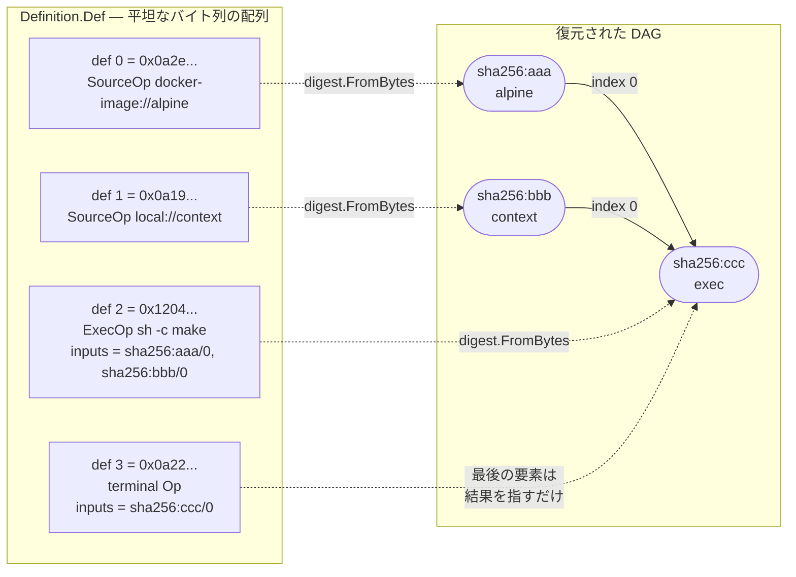

## 何を学んだか

LLB の Definition は、グラフを表す構造体ではない。`repeated bytes def` — marshal 済みの `Op` メッセージを並べただけの平坦なバイト列の配列だ。頂点 ID にあたるフィールドは `Op` のどこにも存在せず、**バイト列の digest がそのまま頂点 ID になる**。辺は `Input{digest, index}` が別の要素の digest を指すことで表現される。

この設計の効果は 2 つある。ID を採番する主体が要らないので、クライアント側で独立に組み立てた 2 つの部分グラフを連結しても衝突しない。そして、内容が 1 バイトでも同じなら digest も同じになるので、**同一の頂点は自動的に 1 つに畳まれる**。

## Definition の形

```proto title="solver/pb/ops.proto"
// Definition is the LLB definition structure with per-vertex metadata entries
message Definition {
	// def is a list of marshaled Op messages
	repeated bytes def = 1;
	// metadata contains metadata for the each of the Op messages.
	// A key must be an LLB op digest string.
	map<string, OpMetadata> metadata = 2;
	// Source contains the source mapping information for the vertexes in the definition
	Source Source = 3;
}
```

([solver/pb/ops.proto L309-318](https://github.com/moby/buildkit/blob/ca4838f8ddbd3612bca94bcb8a938d8a326110a3/solver/pb/ops.proto#L309-L318))

頂点そのものは `Op` で、依存は `Input` の配列だ。

```proto title="solver/pb/ops.proto"
// Op represents a vertex of the LLB DAG.
message Op {
	// inputs is a set of input edges.
	repeated Input inputs = 1;
	oneof op {
		ExecOp exec = 2;
		SourceOp source = 3;
		FileOp file = 4;
		BuildOp build = 5;
		MergeOp merge = 6;
		DiffOp diff = 7;
		PassthroughOp passthrough = 8;
	}
	Platform platform = 10;
	WorkerConstraints constraints = 11;
}

// Input represents an input edge for an Op.
message Input {
	// digest of the marshaled input Op
	string digest = 1;
	// output index of the input Op
	int64 index = 2;
}
```

([solver/pb/ops.proto L9-42](https://github.com/moby/buildkit/blob/ca4838f8ddbd3612bca94bcb8a938d8a326110a3/solver/pb/ops.proto#L9-L42))

`Input` が持つのは digest と `index` の 2 つだけだ。`index` は「その入力頂点の**何番目の出力**を使うか」を指す。1 つの `ExecOp` が複数の mount に書き込めば出力も複数になるので、辺は「どの頂点か」だけでは決まらない ([ExecOp](../exec-op/) を参照)。



## digest はどこで計算されるか

marshal 側と load 側の両方で、同じ 1 行が頂点 ID を決めている。クライアント側の `State.Marshal` は DAG を深さ優先で辿り、入力を先に marshal してから自分を追加する。

```go title="client/llb/state.go"
func marshal(ctx context.Context, v Vertex, def *Definition, s *sourceMapCollector, cache map[digest.Digest]struct{}, vertexCache map[Vertex]struct{}, c *Constraints) (*Definition, error) {
	if _, ok := vertexCache[v]; ok {
		return def, nil
	}
	for _, inp := range v.Inputs() {
		var err error
		def, err = marshal(ctx, inp.Vertex(ctx, c), def, s, cache, vertexCache, c)
		// ...
	}

	dgst, dt, opMeta, sls, err := v.Marshal(ctx, c)
	// ...
	s.Add(dgst, sls)
	if _, ok := cache[dgst]; ok {
		return def, nil
	}
	def.Def = append(def.Def, dt)
	cache[dgst] = struct{}{}
	return def, nil
}
```

([client/llb/state.go L196-223](https://github.com/moby/buildkit/blob/ca4838f8ddbd3612bca94bcb8a938d8a326110a3/client/llb/state.go#L196-L223))

重複除去が `cache[dgst]` の 1 行だけで済んでいるのが要点だ。同じ digest の頂点は 2 度 `Def` に入らない。`vertexCache` のほうは Go のオブジェクト同一性で、同じ `Vertex` を 2 度辿る無駄を省くための別の枝刈りだ。

入力を先に追加してから自分を追加するので、`Def` はトポロジカル順に並ぶ。ただし後述するように、読む側はこの順序にほとんど依存していない。

## 最後の要素は「結果を指すだけ」の Op

`Def` の末尾には、`oneof op` を持たない特殊な `Op` が 1 個足される。

```go title="client/llb/state.go"
	inp, err := s.Output().ToInput(ctx, c)
	if err != nil {
		return def, err
	}
	proto := &pb.Op{Inputs: []*pb.Input{inp}}
	dt, err := proto.MarshalVT()
	if err != nil {
		return def, err
	}
	def.Def = append(def.Def, dt)
```

([client/llb/state.go L156-165](https://github.com/moby/buildkit/blob/ca4838f8ddbd3612bca94bcb8a938d8a326110a3/client/llb/state.go#L156-L165))

これは実行される頂点ではなく、「この Definition の結果はどの頂点のどの出力か」を書き留めるための番兵だ。`Definition` に「ルートはこれ」というフィールドを足す代わりに、`Def` の末尾という位置で表している。だから `Def` の順序が唯一意味を持つのは末尾だけで、そこだけは末尾でなければならない。

読む側もそれを前提にしている。

```go title="client/llb/marshal.go"
func (def *Definition) Head() (digest.Digest, error) {
	if len(def.Def) == 0 {
		return "", nil
	}
	last := def.Def[len(def.Def)-1]
	var pop pb.Op
	if err := pop.UnmarshalVT(last); err != nil {
		return "", err
	}
	if len(pop.Inputs) == 0 {
		return "", nil
	}
	return digest.Digest(pop.Inputs[0].Digest), nil
}
```

([client/llb/marshal.go L45-60](https://github.com/moby/buildkit/blob/ca4838f8ddbd3612bca94bcb8a938d8a326110a3/client/llb/marshal.go#L45-L60))

## solver 側の復元 — 順序ではなく digest で引く

daemon 側で Definition を `solver.Edge` に変換するのが `loadLLB` だ。

```go title="solver/llbsolver/vertex.go"
	for _, dt := range def.Def {
		var pbop pb.Op
		if err := pbop.Unmarshal(dt); err != nil {
			return solver.Edge{}, errors.Wrap(err, "failed to parse llb proto op")
		}
		for i, input := range pbop.Inputs {
			if input.Index < 0 {
				return solver.Edge{}, errors.Errorf("invalid input %d output index %d", i, input.Index)
			}
		}
		dgst := digest.FromBytes(dt)
		// ...
		allOps[dgst] = &op{
			Op:       &pbop,
			Metadata: def.Metadata[string(dgst)],
		}
		lastDgst = dgst
	}
```

([solver/llbsolver/vertex.go L365-384](https://github.com/moby/buildkit/blob/ca4838f8ddbd3612bca94bcb8a938d8a326110a3/solver/llbsolver/vertex.go#L365-L384))

`allOps` は digest をキーにした map なので、配列の順序はここで捨てられる。使われるのは `lastDgst` — 末尾の要素だけだ。そこから `Inputs[0]` を辿ってルート頂点を決め、あとは `rec` が digest でメモ化しながら再帰的に `solver.Vertex` を組み立てる。

```go title="solver/llbsolver/vertex.go"
	lastOp := allOps[lastDgst]
	delete(allOps, lastDgst)
	if len(lastOp.Inputs) == 0 {
		return solver.Edge{}, errors.Errorf("invalid LLB with no inputs on last vertex")
	}
	dgst := lastOp.Inputs[0].Digest
	// ...
	return solver.Edge{Vertex: v, Index: solver.Index(lastOp.Inputs[0].Index)}, nil
```

([solver/llbsolver/vertex.go L431-466](https://github.com/moby/buildkit/blob/ca4838f8ddbd3612bca94bcb8a938d8a326110a3/solver/llbsolver/vertex.go#L431-L466))

末尾の番兵は `delete` されてグラフから消える。つまりトポロジカル順は「クライアント側が自然にそう並べる」だけの性質で、プロトコルの要件ではない。要件は「末尾がルートを指す番兵であること」と「`Input.digest` が集合の中に存在すること」の 2 つだけだ。

`loadLLB` は読み込んだ digest をそのまま信用せず、全 Op を再 marshal して digest を計算し直す (`recomputeDigests`)。この理由は [決定性 marshal](../deterministic-marshal/) で扱う。

## Metadata は digest をキーにした別のマップ

`OpMetadata` — `ignore_cache`、進捗表示用の `description`、cap の申告、cgroup のリソース制限 — は `Op` の中には入らず、digest をキーにしたサイドテーブルに置かれる。

```proto title="solver/pb/ops.proto"
message OpMetadata {
	bool ignore_cache = 1;
	map<string, string> description = 2;
	ExportCache export_cache = 4;
	map<string, bool> caps = 5;
	ProgressGroup progress_group = 6;
	LinuxResources linux_resources = 7;
}
```

([solver/pb/ops.proto L219-234](https://github.com/moby/buildkit/blob/ca4838f8ddbd3612bca94bcb8a938d8a326110a3/solver/pb/ops.proto#L219-L234))

分けてあるのは、**ここに入る値が頂点の同一性を変えてはいけないから**だ。`--no-cache` を付けても、進捗表示の名前を変えても、メモリ上限を変えても、digest は変わらない。実際 `LinuxResources` のコメントは「キャッシュキーに影響させずにステップごとのリソース制限を設定する」ためだと明言している。`Op` の中に入れていたら、表示名を変えただけでキャッシュが全部飛ぶ。

## Definition から Vertex に戻す — DefinitionOp

Definition は一方通行ではない。`DefinitionOp` は marshal 済みの Definition を再び `llb.Vertex` として振る舞わせる。

```go title="client/llb/definition.go"
// DefinitionOp implements llb.Vertex using a marshalled definition.
//
// For example, after marshalling a LLB state and sending over the wire, the
// LLB state can be reconstructed from the definition.
type DefinitionOp struct {
	mu         sync.Mutex
	ops        map[digest.Digest]*pb.Op
	defs       map[digest.Digest][]byte
	// ...
	dgst       digest.Digest
	index      pb.OutputIndex
}
```

([client/llb/definition.go L15-29](https://github.com/moby/buildkit/blob/ca4838f8ddbd3612bca94bcb8a938d8a326110a3/client/llb/definition.go#L15-L29))

`Marshal` は再 marshal をせず、保存しておいたバイト列をそのまま返す。

```go title="client/llb/definition.go"
	meta := d.metas[d.dgst]
	return d.dgst, d.defs[d.dgst], meta, d.sources[d.dgst], nil
```

([client/llb/definition.go L171-172](https://github.com/moby/buildkit/blob/ca4838f8ddbd3612bca94bcb8a938d8a326110a3/client/llb/definition.go#L171-L172))

これがフロントエンドにとって重要になる。gateway 経由で受け取った他人の Definition を、自分の State グラフに `Copy` の入力として差し込んでも、バイト列が保存されている限り digest は変わらない ([ref は不透明 ID と Definition の 2 点セットで往復する](../gateway-ref/))。

## 中身を見る

`buildctl debug dump-llb` は Definition を読んで、各要素の digest と `Op` を JSON で吐くだけのコマンドだ。ここでも digest の計算は 1 行しかない。

```go title="cmd/buildctl/debug/dumpllb.go"
	for _, dt := range def.Def {
		var op pb.Op
		if err := op.UnmarshalVT(dt); err != nil {
			return nil, errors.Wrap(err, "failed to parse op")
		}
		dgst := digest.FromBytes(dt)
		ent := llbOp{Op: &op, Digest: dgst, OpMetadata: def.Metadata[dgst].ToPB()}
		ops = append(ops, ent)
	}
```

([cmd/buildctl/debug/dumpllb.go L63-79](https://github.com/moby/buildkit/blob/ca4838f8ddbd3612bca94bcb8a938d8a326110a3/cmd/buildctl/debug/dumpllb.go#L63-L79))

`--dot` を付けると Graphviz 用の DOT が出る。`Input` を辺に落とすだけなので、グラフ構造が Definition の中に完全に閉じていることがそのまま確認できる。

## なぜそうなっているか

「頂点 ID を採番しない」は、LLB が**プロセスをまたいで組み立てられる**ことから来ている。Dockerfile フロントエンドは自分でコンテナの中で動き、gateway 越しに部分的な Definition をやり取りする。`# syntax=` で呼ばれた別のフロントエンドが返した Definition と、呼び出し側が作った Definition を連結することもある。ID を連番にしていたら、この連結のたびに全体の再採番が必要になり、しかも再採番したらキャッシュキーが変わる。

内容アドレスにしておけば、連結は 2 つの配列の連接と重複除去だけで済む。しかも「同じ内容の頂点が 2 つある」状態が構造的に作れない — `map[digest]` に入れた時点で 1 つになる。ビルドグラフの共通部分式除去 (マルチステージビルドで同じベースイメージを 2 つのステージが使う、など) が、専用の最適化パスなしに成立している。

代償は 2 つある。1 つは、**シリアライズのバイト列が意味を持ってしまう**こと。同じ論理的な Op が違うバイト列になれば別の頂点になる。これが [決定性 marshal](../deterministic-marshal/) が必須になる理由だ。もう 1 つは、`Op` に対する後方互換な変更ができないこと。フィールドを 1 つ足してデフォルト値のまま送っても proto3 なら出力バイト列は変わらないが、値を入れれば digest が変わりキャッシュは全ミスになる。BuildKit がフィールド追加を [apicaps](../apicaps/) で厳密に管理しているのはこのためだ。

## どう活かすか

内容アドレスな DAG を自分で作るときに持ち帰れるのは、**「ID を持たせない」という選択肢**だ。ノードに UUID を振ってグラフ構造体を作るのは自然に見えるが、そうすると「同じノードが 2 つある」状態が表現できてしまい、正規化のパスが必要になる。シリアライズ結果の digest を ID にすれば、正規化は不要になり、代わりにシリアライズの決定性という別の責務が生まれる。どちらの責務を引き受けるかの選択だと理解しておくとよい。

もう 1 つは、**ワイヤ表現をグラフではなく「辺付きノードの集合」にする**こと。順序に依存しないので、部分グラフの連結・分割・並べ替えがすべて集合演算になる。BuildKit が末尾 1 要素だけを「ルートを指す番兵」として順序に頼っているのは、この原則をほぼ守ったうえでの最小限の例外だ。ルートを表すフィールドを足すより、既にある `Op` の形を再利用したほうが、`Op` を読める実装がそのままルートも読める。

そして、**同一性に影響する情報と、そうでない情報を型で分ける**こと。`Op` と `OpMetadata` の分離は「キャッシュキーに入るか入らないか」という 1 本の線で引かれている。ログ用の表示名やリソース制限をうっかり同一性側に混ぜると、無害なはずの変更でキャッシュが全滅する。この線を型レベルで引いておくと、後から人が判断しなくてよくなる。
