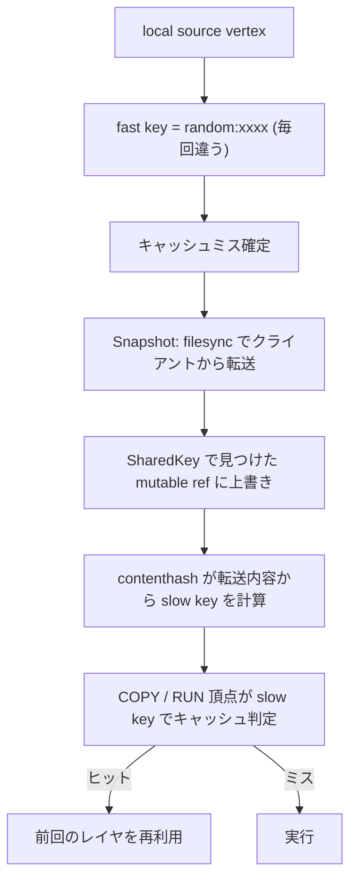

## 何を学んだか

`local://context` のキャッシュキーは **毎回必ず違う**。セッション ID が材料に入っているうえに、solver 側でわざわざ digest のアルゴリズム名を `random:` に書き換えられて、キャッシュレコードとして永続化されないようにされている。

にもかかわらずビルドはキャッシュヒットする。理由は 2 つ。

- **一致判定を上の層に押し出している。** local source は「クライアントから今のファイルを持ってくる」だけを担い、「前回と同じか」の判定は `COPY` や `RUN --mount` 側の slow cache (contenthash) がやる。
- **SharedKey はキャッシュキーではない。** 転送先の mutable ref を使い回して `filesync` を差分転送にするための鍵で、キャッシュヒットの判定には一切関わらない。

「キーが毎回変わってもキャッシュは効く」という設計は、[fast cache と slow cache](../fast-slow-cache/) の slow cache がどういう場面のために存在するかの、最もはっきりした実例になっている。

## キーにはセッション ID が入る

```go title="source/local/source.go"
func (ls *localSourceHandler) CacheKey(ctx context.Context, jobCtx solver.JobContext, index int) (string, string, solver.CacheOpts, bool, error) {
	sessionID := ls.src.SessionID

	if sessionID == "" {
		id := jobCtx.Session().SessionIterator().NextSession()
		if id == "" {
			return "", "", nil, false, errors.New("could not access local files without session")
		}
		sessionID = id
	}
	dt, err := json.Marshal(struct {
		SessionID          string
		IncludePatterns    []string
		ExcludePatterns    []string
		FollowPaths        []string
		MetadataTransfer   bool     `json:",omitempty"`
		MetadataExceptions []string `json:",omitempty"`
	}{
		SessionID:          sessionID,
		// ...
	})
	// ...
	return "session:" + ls.src.Name + ":" + dgst.String(), dgst.String(), nil, true, nil
}
```

([source/local/source.go L129-L162](https://github.com/moby/buildkit/blob/ca4838f8ddbd3612bca94bcb8a938d8a326110a3/source/local/source.go#L129-L162))

セッション ID は `buildctl build` を 1 回叩くごとに新しく振られる。だから同じディレクトリを同じフィルタで転送しても、キーは毎回別物になる。

そして返り値のキーは `session:` で始まる。この prefix には意味がある。

## `session:` prefix は solver で `random:` に化ける

`SourceOp.CacheMap` はソースが返したキー文字列を digest に変換するが、そこで prefix を見ている。

```go title="solver/llbsolver/ops/source.go"
	dgst, err := cachedigest.FromBytes([]byte(sourceCacheType+":"+k), cachedigest.TypeString)
	if err != nil {
		return nil, false, err
	}
	if strings.HasPrefix(k, "session:") {
		dgst = digest.Digest("random:" + dgst.Encoded())
	}
```

([solver/llbsolver/ops/source.go L91-L98](https://github.com/moby/buildkit/blob/ca4838f8ddbd3612bca94bcb8a938d8a326110a3/solver/llbsolver/ops/source.go#L91-L98))

digest のアルゴリズム名を `sha256` から `random` に差し替えている。この `random:` は、キャッシュ層のあちこちで特別扱いされる合図だ。

```go title="solver/cachemanager.go"
func rootKey(dgst digest.Digest, output Index) digest.Digest {
	out, _ := cachedigest.FromBytes(fmt.Appendf(nil, "%s@%d", dgst, output), cachedigest.TypeString)
	if strings.HasPrefix(dgst.String(), "random:") {
		return digest.Digest("random:" + dgst.Encoded())
	}
	return out
}
```

([solver/cachemanager.go L451-L457](https://github.com/moby/buildkit/blob/ca4838f8ddbd3612bca94bcb8a938d8a326110a3/solver/cachemanager.go#L451-L457))

`random:` のキーは、そこから派生する root key も `random:` のままになる。汚染が伝播する。

リモートキャッシュのエクスポートでは、そもそもレコードを作らない。

```go title="cache/remotecache/v1/chains.go"
func (c *CacheChains) Add(dgst digest.Digest, deps [][]solver.CacheLink, results []solver.CacheExportResult) (solver.CacheExporterRecord, bool, error) {
	if strings.HasPrefix(dgst.String(), "random:") {
		return nil, false, nil
	}
```

([cache/remotecache/v1/chains.go L53-L56](https://github.com/moby/buildkit/blob/ca4838f8ddbd3612bca94bcb8a938d8a326110a3/cache/remotecache/v1/chains.go#L53-L56))

「セッション固有の値を含むキーはエクスポートしても意味がない」ので、[リモートキャッシュ](../cache-chains/) の対象から外している。

つまり local source は、**自分のキーが再利用されないことを型 (digest のアルゴリズム名) で宣言している**。キーが偶然一致してしまう事故を、キーの値ではなく名前空間で防いでいる。

## ではなぜ COPY がキャッシュヒットするのか

local source の出力を使う側が、内容ベースのキーを別に計算する。`ExecOp.CacheMap` は依存ごとに `ComputeDigestFunc` を設定する。

```go title="solver/llbsolver/ops/exec.go"
		if dep.ContentBasedHash {
			cm.Deps[i].ComputeDigestFunc = opsutils.NewContentHashFunc(toSelectors(dedupePaths(dep.Selectors)))
		}
```

([solver/llbsolver/ops/exec.go L210-L212](https://github.com/moby/buildkit/blob/ca4838f8ddbd3612bca94bcb8a938d8a326110a3/solver/llbsolver/ops/exec.go#L210-L212))

`ComputeDigestFunc` は `Result` を受け取る関数なので、**入力を実際に解いてからでないと呼べない**。だから解決の順序はこうなる。

1. local source の fast key は毎回違う → 必ずミス
2. local source の `Snapshot` が走り、クライアントから今のファイルが転送される
3. 転送されたスナップショットに対して contenthash が走り、slow key が決まる
4. その slow key で、上位の頂点 (COPY や RUN) がキャッシュにヒットする



local source 自体は**必ず走る**。ファイル転送は毎ビルド発生する。省けるのはその先の、コンテナを起こしてレイヤを作る処理のほうだ。

内容ベースのキーを使ってよい条件が厳しく絞られているのも見ておくとよい。

```go title="solver/llbsolver/ops/exec.go"
		// Allow content-based cached where safe - these are enforced to avoid
		// the following case:
		// - A "snapshot" contains "foo/a.txt" and "bar/b.txt"
		// - "RUN --mount from=snapshot,src=bar touch bar/c.txt" creates a new
		//   file in bar
		// - If we run again, but this time "snapshot" contains a new
		//   "foo/sneaky.txt", the content-based cache matches the previous
		//   run, since we only select "bar"
		// - But this cached result is incorrect - "foo/sneaky.txt" isn't in
		//   our cached result, but it is in our input.
		if m.Output == int64(pb.SkipOutput) {
```

([solver/llbsolver/ops/exec.go L312-L326](https://github.com/moby/buildkit/blob/ca4838f8ddbd3612bca94bcb8a938d8a326110a3/solver/llbsolver/ops/exec.go#L312-L326))

selector で一部だけを見てハッシュを取ると、見ていない部分の変化を取りこぼす。出力を持たないマウント・読み取り専用のマウント・ルート全体を見るマウントの 3 つだけが安全とされている。

## SharedKey は転送先の使い回し

`Snapshot` の中で、転送先の mutable ref を探す鍵が組み立てられる。

```go title="source/local/source.go"
	sharedKey := ls.src.Name + ":" + ls.src.SharedKeyHint + ":" + caller.SharedKey() + metaSfx // TODO: replace caller.SharedKey() with source based hint from client(absolute-path+nodeid)

	var mutable cache.MutableRef
	sis, err := searchSharedKey(ctx, ls.cm, sharedKey)
	// ...
	for _, si := range sis {
		if m, err := ls.cm.GetMutable(ctx, si.ID()); err == nil {
			bklog.G(ctx).Debugf("reusing ref for local: %s", m.ID())
			mutable = m
			break
		}
	}
```

([source/local/source.go L204-L233](https://github.com/moby/buildkit/blob/ca4838f8ddbd3612bca94bcb8a938d8a326110a3/source/local/source.go#L204-L233))

3 つの材料でできている。

- `ls.src.Name` — コンテキスト名 (`context`、`dockerfile` など)
- `ls.src.SharedKeyHint` — LLB 属性 `local.sharedkeyhint` でクライアントが渡すヒント
- `caller.SharedKey()` — セッション確立時に HTTP ヘッダ `X-Docker-Expose-Session-Sharedkey` で渡される値 ([session/session.go L23](https://github.com/moby/buildkit/blob/ca4838f8ddbd3612bca94bcb8a938d8a326110a3/session/session.go#L23))

**セッション ID は入っていない**。ここが `CacheKey` との決定的な違いだ。同じクライアントが同じディレクトリを何度ビルドしても、SharedKey は同じ値になる。だから前回のビルドで作った mutable ref がそのまま見つかる。

見つかった ref にはすでに前回の内容が入っている。そこに `filesync` をかけると、fsutil のプロトコルが差分だけを送る。

```go title="source/local/source.go"
	cc, err := contenthash.GetCacheContext(ctx, mutable)
	// ...
	opt := filesync.FSSendRequestOpt{
		Name:            ls.src.Name,
		IncludePatterns: ls.src.IncludePatterns,
		ExcludePatterns: ls.src.ExcludePatterns,
		FollowPaths:     ls.src.FollowPaths,
		DestDir:         dest,
		CacheUpdater:    &cacheUpdater{cc, mount.IdentityMapping()},
		// ...
	}
	// ...
	if err := filesync.FSSync(ctx, caller, opt); err != nil {
		return nil, err
	}
	// ...
	if err := contenthash.SetCacheContext(ctx, mutable, cc); err != nil {
		return nil, err
	}
```

([source/local/source.go L264-L315](https://github.com/moby/buildkit/blob/ca4838f8ddbd3612bca94bcb8a938d8a326110a3/source/local/source.go#L264-L315))

`CacheUpdater` に渡している `cacheUpdater` が肝で、これは `contenthash.CacheContext` をそのまま埋め込んだ薄いラッパだ。

```go title="source/local/source.go"
type cacheUpdater struct {
	contenthash.CacheContext
	idmap *user.IdentityMapping
}

func (cu *cacheUpdater) MarkSupported(bool) {
}

func (cu *cacheUpdater) ContentHasher() fsutil.ContentHasher {
	return contenthash.NewFromStat
}
```

([source/local/source.go L360-L370](https://github.com/moby/buildkit/blob/ca4838f8ddbd3612bca94bcb8a938d8a326110a3/source/local/source.go#L360-L370))

**転送しながら、変わったパスの分だけ contenthash の木を無効化する**。ref を使い回している以上、contenthash の木も前回の状態が残っているので、丸ごと計算し直す必要がない。SharedKey で ref を引き当てることが、そのまま [contenthash の増分更新](../contenthash-incremental/) の前提になっている。この 2 つはセットで初めて意味を持つ。

失敗したときの後始末が徹底しているのもここが理由だ。

```go title="source/local/source.go"
	defer func() {
		if retErr != nil && mutable != nil {
			// on error remove the record as checksum update is in undefined state
			if err := mutable.SetCachePolicyDefault(); err != nil {
				bklog.G(ctx).Errorf("failed to reset mutable cachepolicy: %v", err)
			}
			contenthash.ClearCacheContext(mutable)
			go mutable.Release(context.WithoutCancel(ctx))
		}
	}()
```

([source/local/source.go L235-L244](https://github.com/moby/buildkit/blob/ca4838f8ddbd3612bca94bcb8a938d8a326110a3/source/local/source.go#L235-L244))

転送の途中で落ちると、ディスク上のファイルと contenthash の木がずれる。ずれた木を再利用すると**間違ったキャッシュヒット**になるので、木を捨てて `CachePolicyRetain` も解除する。

## セッションが切れたときのフォールバック

`Snapshot` は指定されたセッション ID を 5 秒待って掴もうとし、駄目なら「今つながっている誰か」に切り替える。

```go title="source/local/source.go"
	caller, err := ls.sm.Get(timeoutCtx, sessionID, false)
	if err != nil {
		return ls.snapshotWithAnySession(ctx, g)
	}

	ref, err := ls.snapshot(ctx, caller)
	if err != nil {
		var serr filesync.InvalidSessionError
		if errors.As(err, &serr) {
			return ls.snapshotWithAnySession(ctx, g)
		}
		return nil, err
	}
```

([source/local/source.go L171-L188](https://github.com/moby/buildkit/blob/ca4838f8ddbd3612bca94bcb8a938d8a326110a3/source/local/source.go#L171-L188))

これは [ジョブの共有](../job-sharing/) と対になる仕組みだ。同じビルドを 2 つのクライアントが同時に投げてジョブが合流したとき、先に来たクライアントが切断しても、後から来たクライアントのセッションでファイルを取り直せる。`CacheKey` が返したキーに含まれるセッション ID と、実際に転送に使われるセッションが一致しない可能性がある、ということになる。キーがどうせ `random:` なので実害がない。

## なぜそうなっているか

ローカルファイルは **daemon 側から見て検証不能**だ。クライアントのディスク上のファイルが前回と同じかどうかは、実際に読みに行かないと分からない。しかも読みに行く前にキャッシュキーが必要、というのが solver の要求だ。この矛盾は解けない。

BuildKit の答えは「解こうとしない」だ。local source の fast key は毎回ミスすると決めてしまい、その代わりに転送コストを最小化する (SharedKey + 差分転送 + 増分 contenthash) 方向に投資している。そして本当のキャッシュ判定は、転送が済んだあとの slow key に任せる。

`random:` への書き換えは、この決定を**キーの値でなく型で表明する**ためのものだ。セッション ID が偶然衝突する確率は無視できるが、それでも「このキーは再利用されてはいけない」という意図をコード上に残しておけば、リモートキャッシュのエクスポートのような後から足された機能が誤ってこのキーを拾うことがない。実際 `CacheChains.Add` は digest の prefix を見るだけで正しく除外できている。

## どう活かすか

- **検証できない入力にキャッシュキーを付けようとしない。** 「毎回ミスする」と決めて、その先の層で内容ベースに判定するほうが、間違ったヒットより安全で結果的に速い。
- **「使ってはいけない値」は値ではなく名前空間で示す。** `random:` prefix のように型レベルで区別しておくと、後から増える利用側が個別に条件を書かなくても正しく振る舞う。
- **キャッシュキーと「作業領域の使い回し鍵」は別物として設計する。** local source の SharedKey は前者ではない。混ぜると「使い回したいが再現性は保ちたい」が両立できなくなる。
- **増分更新する副次データは、失敗したら必ず捨てる。** 中途半端に更新された contenthash の木は、無いよりも危険だ。エラーパスで `ClearCacheContext` を呼ぶのはそのための保険になっている。
