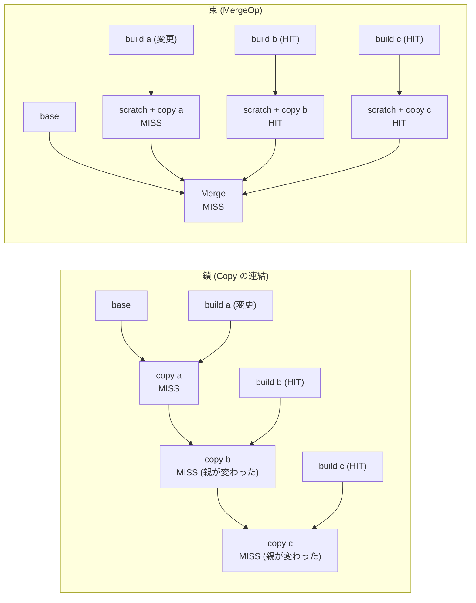

## 何を学んだか

`COPY --from=a` を 3 回並べると、LLB では FileOp が 3 段の鎖になる。鎖なので、1 段目が変わると 2 段目も 3 段目もキャッシュが外れる — たとえ 2 段目と 3 段目の入力が何も変わっていなくても、**親が変わったから**だ。

`MergeOp` はこれを構造で解く。3 つのコピーをそれぞれ `Scratch` の上で独立に行い、結果を「重ね合わせる」1 つの頂点にまとめる。依存が鎖から束になるので、1 つの入力の変更が他の入力に伝播しない。そして `COPY --link` の実装は、この変換をフロントエンド側で自動的に行うだけの 1 行だ。

`DiffOp` はその逆で、「`upper` から `lower` を引いた差分」を状態として取り出す。`Merge(A, Diff(A, B)) == B` が成り立つように作られている。

## 問題 — 鎖は変更を下流に伝播させる

BuildKit のリポジトリには、この 2 つの Op の設計文書がある。問題設定がそのまま書かれている。

> One issue with this type of pattern is that if any of the inputs to the copy chain change, that doesn't just invalidate Buildkit's cache for that input, it also invalidates Buildkit's cache for any copied layers after that one.
>
> — [docs/dev/merge-diff.md](https://github.com/moby/buildkit/blob/ca4838f8ddbd3612bca94bcb8a938d8a326110a3/docs/dev/merge-diff.md)



右側では、再実行が必要なのは `copy a` と `Merge` だけになる。しかも `Merge` は遅延実装なので、結果をイメージとしてエクスポートするだけなら**ファイルシステムを作る作業すら要らない** — 各入力のレイヤをそのまま並べればよい。

## proto — 入力を指す薄いラッパー

```proto title="solver/pb/ops.proto"
message MergeInput {
	int64 input = 1;
}

message MergeOp {
	repeated MergeInput inputs = 1;
}

message LowerDiffInput {
	int64 input = 1;
}

message UpperDiffInput {
	int64 input = 1;
}

message DiffOp {
	LowerDiffInput lower = 1;
	UpperDiffInput upper = 2;
}
```

([solver/pb/ops.proto L443-462](https://github.com/moby/buildkit/blob/ca4838f8ddbd3612bca94bcb8a938d8a326110a3/solver/pb/ops.proto#L443-L462))

`Op.Inputs` の並び順をそのまま使えば `MergeOp.inputs` は要らないように見える。実際 Go クライアントは常に `inputs[i].input == i` になるように詰めている。

```go title="client/llb/merge.go"
	op := &pb.MergeOp{}
	for _, input := range m.inputs {
		op.Inputs = append(op.Inputs, &pb.MergeInput{Input: int64(len(pop.Inputs))})
		pbInput, err := input.ToInput(ctx, constraints)
		// ...
		pop.Inputs = append(pop.Inputs, pbInput)
	}
```

([client/llb/merge.go L49-57](https://github.com/moby/buildkit/blob/ca4838f8ddbd3612bca94bcb8a938d8a326110a3/client/llb/merge.go#L49-L57))

`DiffOp` のほうは、この間接が実際に必要になる。入力を持たない側を表現できるからだ。

```go title="client/llb/diff.go"
	op.Lower = &pb.LowerDiffInput{Input: int64(len(proto.Inputs))}
	if m.lower == nil {
		op.Lower.Input = int64(pb.Empty)
	} else {
		pbLowerInput, err := m.lower.ToInput(ctx, constraints)
		// ...
		proto.Inputs = append(proto.Inputs, pbLowerInput)
	}

	op.Upper = &pb.UpperDiffInput{Input: int64(len(proto.Inputs))}
	if m.upper == nil {
		op.Upper.Input = int64(pb.Empty)
	} else {
		// ...
	}
```

([client/llb/diff.go L49-69](https://github.com/moby/buildkit/blob/ca4838f8ddbd3612bca94bcb8a938d8a326110a3/client/llb/diff.go#L49-L69))

`lower` が空なら `Op.Inputs` には何も足さず、`Lower.Input = -1` にする。すると `upper` の番号は 0 になる。`Op.Inputs` の位置だけで表していたら「1 番目が空」を表現できない — [ExecOp](../exec-op/) の `Mount.input = -1` と同じ手だ。

## クライアント側の畳み込み

`Merge` と `Diff` は、頂点を作る前に自明なケースを潰す。

```go title="client/llb/merge.go"
func Merge(inputs []State, opts ...ConstraintsOpt) State {
	// filter out any scratch inputs, which have no effect when merged
	var filteredInputs []State
	for _, input := range inputs {
		if input.Output() != nil {
			filteredInputs = append(filteredInputs, input)
		}
	}
	if len(filteredInputs) == 0 {
		// a merge of only scratch results in scratch
		return Scratch()
	}
	if len(filteredInputs) == 1 {
		// a merge of a single non-empty input results in that non-empty input
		return filteredInputs[0]
	}
	// ...
	addCap(&c, pb.CapMergeOp)
	return filteredInputs[0].WithOutput(NewMerge(filteredInputs, c).Output())
}
```

([client/llb/merge.go L101-124](https://github.com/moby/buildkit/blob/ca4838f8ddbd3612bca94bcb8a938d8a326110a3/client/llb/merge.go#L101-L124))

```go title="client/llb/diff.go"
func Diff(lower, upper State, opts ...ConstraintsOpt) State {
	if lower.Output() == nil {
		if upper.Output() == nil {
			// diff of scratch and scratch is scratch
			return Scratch()
		}
		// diff of scratch and upper is just upper
		return upper
	}
	// ...
}
```

([client/llb/diff.go L97-112](https://github.com/moby/buildkit/blob/ca4838f8ddbd3612bca94bcb8a938d8a326110a3/client/llb/diff.go#L97-L112))

これは最適化であると同時に、**生成されるグラフの正規化**でもある。`Merge([a])` と `a` が別の digest になってしまうと、片方を使ったビルドのキャッシュがもう片方で当たらない。頂点を作る前に畳んでおけば、そもそも 2 通りの表現が存在しない。

`Merge` の最終行が `filteredInputs[0].WithOutput(...)` になっているのも意図的だ。返る `State` は最初の入力のメタデータ (env・workdir・platform) を引き継ぎ、出力だけが MergeOp を指す。`Merge` はファイルシステムだけを混ぜ、State の値は混ぜない。

`WithOutput` を使うのは `COPY --link` の側でも同じで、こちらは「ベース State のメタデータを保ったまま、出力だけを Merge に差し替える」ために使われる。

## 最後の畳み込みは daemon 側にもある

DiffOp の実行は、まず特殊ケースを潰してから本体を呼ぶ。

```go title="solver/llbsolver/ops/diff.go"
	if lowerRef == nil {
		if upperRef == nil {
			// The diff of nothing and nothing is nothing. Just return an empty ref.
			return []solver.Result{worker.NewWorkerRefResult(nil, d.worker)}, nil
		}
		// The diff of nothing and upper is upper. Just return a clone of upper
		return []solver.Result{worker.NewWorkerRefResult(upperRef.Clone(), d.worker)}, nil
	}
	if upperRef != nil && lowerRef.ID() == upperRef.ID() {
		// The diff of a ref and itself is nothing, return an empty ref.
		return []solver.Result{worker.NewWorkerRefResult(nil, d.worker)}, nil
	}
```

([solver/llbsolver/ops/diff.go L104-115](https://github.com/moby/buildkit/blob/ca4838f8ddbd3612bca94bcb8a938d8a326110a3/solver/llbsolver/ops/diff.go#L104-L115))

`lowerRef.ID() == upperRef.ID()` は LLB の digest では判定できない。同じ ref に解決される 2 つの異なる頂点がありうるからだ (キャッシュヒットの結果として)。だから定義レベルの畳み込みと実行レベルの畳み込みの両方が要る。

`MergeOp` 側も同様に、nil や空の ref を落としてから `CacheManager().Merge` を呼ぶ ([solver/llbsolver/ops/merge.go L65-95](https://github.com/moby/buildkit/blob/ca4838f8ddbd3612bca94bcb8a938d8a326110a3/solver/llbsolver/ops/merge.go#L65-L95))。

## キャッシュキーは定義だけで決まる

両方の `CacheMap` は、Op を JSON にしてハッシュするだけだ。

```go title="solver/llbsolver/ops/merge.go"
const mergeCacheType = "buildkit.merge.v0"

func (m *mergeOp) CacheMap(ctx context.Context, jobCtx solver.JobContext, index int) (*solver.CacheMap, bool, error) {
	dt, err := json.Marshal(struct {
		Type  string
		Merge *pb.MergeOp
	}{
		Type:  mergeCacheType,
		Merge: m.op,
	})
	// ...
	cm := &solver.CacheMap{
		Digest: dgst,
		Deps: make([]struct { /* ... */ }, len(m.op.Inputs)),
	}
	return cm, true, nil
}
```

([solver/llbsolver/ops/merge.go L18-63](https://github.com/moby/buildkit/blob/ca4838f8ddbd3612bca94bcb8a938d8a326110a3/solver/llbsolver/ops/merge.go#L18-L63))

`Deps` の各要素に `ComputeDigestFunc` が入っていないことに注目したい。つまり MergeOp と DiffOp は **fast cache だけで完結する** — 入力の中身を見る必要がない ([fast cache と slow cache](../fast-slow-cache/))。これが「Merge が遅延できる」ことと対応している。マージ結果のファイルシステムを作らずにキャッシュキーが決まるので、作らずに済ませられる。

`DiffOp` の `Deps` の長さだけは、`Empty` の数によって変わる。

```go title="solver/llbsolver/ops/diff.go"
	var depCount int
	if d.op.Lower.Input != int64(pb.Empty) {
		depCount++
	}
	if d.op.Upper.Input != int64(pb.Empty) {
		depCount++
	}
```

([solver/llbsolver/ops/diff.go L48-54](https://github.com/moby/buildkit/blob/ca4838f8ddbd3612bca94bcb8a938d8a326110a3/solver/llbsolver/ops/diff.go#L48-L54))

`Deps` の長さは `Op.Inputs` の長さと一致していなければならないので、`Empty` の分を数えないようにしている。

## COPY --link — 1 行の書き換え

Dockerfile フロントエンドの `COPY` ディスパッチは、最後にこの分岐を通る。

```go title="frontend/dockerfile/dockerfile2llb/convert_copy.go"
	// cfg.opt.llbCaps can be nil in unit tests
	if cfg.opt.llbCaps != nil && cfg.opt.llbCaps.Supports(pb.CapMergeOp) == nil && cfg.link && cfg.chmod == "" {
		pgID := identity.NewID()
		d.cmdIndex-- // prefixCommand increases it
		pgName := prefixCommand(d, name, d.prefixPlatform, &platform, env)

		copyOpts := []llb.ConstraintsOpt{
			llb.Platform(*d.platform),
		}
		copyOpts = append(copyOpts, fileOpt...)
		copyOpts = append(copyOpts, llb.ProgressGroup(pgID, pgName, true))

		mergeOpts := slices.Clone(fileOpt)
		d.cmdIndex--
		mergeOpts = append(mergeOpts, llb.ProgressGroup(pgID, pgName, false), llb.WithCustomName(prefixCommand(d, "LINK "+name, d.prefixPlatform, &platform, env)))

		d.state = d.state.WithOutput(llb.Merge([]llb.State{d.state, llb.Scratch().File(a, copyOpts...)}, mergeOpts...).Output())
	} else {
		d.state = d.state.File(a, fileOpt...)
	}
```

([frontend/dockerfile/dockerfile2llb/convert_copy.go L333-352](https://github.com/moby/buildkit/blob/ca4838f8ddbd3612bca94bcb8a938d8a326110a3/frontend/dockerfile/dockerfile2llb/convert_copy.go#L333-L352))

差分は 1 行だ。`--link` なしは `d.state.File(a, ...)` — 現在の State の上に FileOp を積む。`--link` ありは `llb.Scratch().File(a, ...)` — **空の State の上に同じ FileOp を積み**、それをベース State と `Merge` する。`FileAction` `a` は両方の経路で共通で、変わるのは「何の上に載せるか」だけだ。

`DiffOp` はここには出てこない。`COPY --link` は Merge だけで足りる — コピー先が `Scratch` なので、そのレイヤはコピーされた内容だけを含み、既に「差分」になっているからだ。DiffOp が要るのは、既存のベースの上で何かを実行してから差分を取り出したいとき ([docs/dev/merge-diff.md](https://github.com/moby/buildkit/blob/ca4838f8ddbd3612bca94bcb8a938d8a326110a3/docs/dev/merge-diff.md) の「Modeling Package Builds」の節) だ。

条件に細かい点が 3 つある。

- `llbCaps.Supports(pb.CapMergeOp) == nil` — daemon が MergeOp を知らなければ黙って通常の COPY に落ちる。`--link` は「速くなるかもしれないヒント」であって、意味を変えるフラグではない ([apicaps](../apicaps/))
- `cfg.chmod == ""` — `--chmod` が指定されていると `--link` は効かず、通常経路になる
- `ProgressGroup` で copy と merge を同じ ID にまとめ、copy 側を `weak=true` にしている。ユーザから見て `COPY --link` は 1 ステップなので、内部で 2 頂点に分かれたことを進捗表示に出さない ([progress](../progress/))

## 落とし穴 — 削除もマージの対象になる

設計文書が長く割いている注意点が 1 つある。「ファイルの削除」もマージ入力の一部として振る舞う。

```go
foo := llb.Scratch().File(llb.Mkfile("/foo", 0644, nil))
rmFoo := foo.File(llb.Rm("/foo"))
bar := rmFoo.File(llb.Mkfile("/bar", 0644, nil))

merged := llb.Merge([]llb.State{foo, bar})
```

`merged` に `/foo` は残らない。`bar` の履歴に「`/foo` を消す」というレイヤが含まれていて、それもマージされるからだ。設計文書はこの挙動を、「マージとは各入力の履歴上の diff を全部マージすることだ」と説明したうえで、こう理由づけている。

> One important principal of LLB results is that when they are exported as container images, an external runtime besides Buildkit that pulls and unpacks the image must see the same filesystem that is seen during build time.

MergeOp の結果はコンテナイメージのレイヤとしてエクスポートされる。レイヤの重ね合わせは OCI の仕様で決まっていて、whiteout ファイルによる削除も含まれる。BuildKit がビルド時に見せるファイルシステムと、docker pull した人が見るファイルシステムが違ってはいけないので、MergeOp は**イメージのレイヤ合成の意味論に合わせる**しかない。直感より仕様が優先されている。

## なぜそうなっているか

MergeOp が解いているのは、レイヤ型ファイルシステムの本質的な制約だ。レイヤは順序付きの積み重ねなので、「A の上に B」という関係は必ず B が A に依存する。ところが実際のビルドでは、`/usr/local/bin/a` と `/usr/local/bin/b` を置く 2 つの操作は互いに独立していることが多い。この独立性を LLB の DAG に持ち込む方法が MergeOp だ。

依存関係を鎖から束に変えると、キャッシュの粒度が上がるだけでなく、**エクスポート時のレイヤ再利用**も効くようになる。設計文書が挙げているとおり、レジストリに既にあるレイヤは push すら不要になる。極端な例では、既存イメージ 3 つを `Merge` して新しいイメージを作る操作が、マニフェストの生成だけで完了する — レイヤを pull すらしない。

DiffOp が必要になるのは、「独立したレイヤを作る」ために `Scratch` から始められない場合だ。`make install` が `DESTDIR` に対応していなければ、ビルド環境の上にインストールするしかない。そこから成果物だけを取り出す汎用の手段が DiffOp になる。設計文書は `DESTDIR` が使えるならそちらのほうがわずかに速いとも書いていて、DiffOp を万能薬として売っていない。

そして `COPY --link` は、この機構を Dockerfile のユーザに開くための最小の表面積だ。フラグ 1 つで「コピー先をベースから scratch に変えて Merge する」という変換が起き、daemon が古ければ黙って元の挙動に戻る。LLB という中間表現を挟んでいるからこそ、フロントエンド側の 1 行の書き換えで済んでいる。

## どう活かすか

**「同じ結果を作る 2 通りの依存グラフ」を意識的に選ぶ。** 逐次実行モデルでは A→B→C という鎖しか書けないが、結果が同じなら束に組み替えられることは多い。鎖を束にするとキャッシュの無効化が伝播しなくなる。組み替えられるかどうかは「操作が可換か・独立か」で決まるので、そこを型や API で表明できると自動化できる。

**畳み込みは定義レベルと実行レベルの両方で要る。** `Merge([a]) == a` は定義を作る時点で潰せるが、`Diff(x, y)` の `x` と `y` が実行時に同じ ref に解決されることは定義からは分からない。前者を潰すのは「グラフの正規化」で、キャッシュの当たり方に効く。後者を潰すのは「実行の最適化」だ。両方あって初めて無駄が消える。

**互換のない機能はサイレントフォールバックできる形で入れる。** `COPY --link` は、daemon が対応していなければ通常の `COPY` になる。速さは変わるが結果は同じなので、これが成立する。「結果が変わらない最適化」として設計しておくと、cap 判定 1 つでフォールバックが書ける。逆に結果が変わる機能なら、エラーにするしかない。

**直感より仕様に合わせる判断を文書に残す。** `Merge(foo, bar)` から `/foo` が消えるのは、ほぼ全員が最初に驚く。それでもその挙動を選んだ理由 (OCI のレイヤ合成と一致させる必要がある) が `docs/dev/merge-diff.md` に書かれているので、バグ報告ではなく仕様として扱える。驚く挙動には、驚く理由ではなくそう決めた理由を書いておくとよい。
