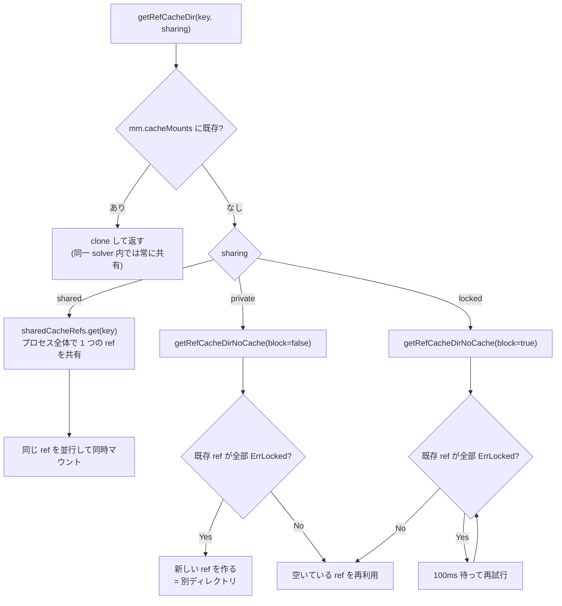

## 何を学んだか

コンテナを起こす直前の 2 つの仕事を見る。

- **`GenerateSpec`** は `oci.SpecOpts` (spec を変更する関数) をリストに積み上げ、最後に containerd の spec ジェネレータへ一括で渡す。デフォルトは十分に絞られていて、緩めるのは `security.insecure` のときの `WithInsecureSpec` 1 箇所だけだ。
- **`RUN --mount=type=cache`** は共有モードごとにロックの取り方が変わるだけで、中身の管理は普通の mutable ref と変わらない。そして **cache mount の内容も ID もキャッシュキーには入らない**。だから cache mount を使ったビルドは原理的に再現性がない。

entitlements は 2 つをつなぐ。`--allow` はクライアントの意思表示で、デーモン側の `insecure-entitlements` 設定と突き合わせて初めて有効になる。

## SpecOpts を積み上げてから 1 回だけ生成する

`GenerateSpec` の構造は一貫している。

```go title="executor/oci/spec.go"
	opts = append(opts, generateMountOpts(resolvConf, hostsFile)...)

	if securityOpts, err := generateSecurityOpts(meta.SecurityMode, apparmorProfile, selinuxB); err == nil {
		opts = append(opts, securityOpts...)
	} else {
		return nil, nil, err
	}

	if processModeOpts, err := generateProcessModeOpts(processMode); err == nil {
		opts = append(opts, processModeOpts...)
	} else {
		return nil, nil, err
	}
	// ... idmap / rlimit / linuxResource / CDI
	s, err := oci.GenerateSpec(ctx, nil, c, opts...)
```

([executor/oci/spec.go L112-L176](https://github.com/moby/buildkit/blob/ca4838f8ddbd3612bca94bcb8a938d8a326110a3/executor/oci/spec.go#L112-L176))

`oci.SpecOpts` は `func(ctx, client, container, *specs.Spec) error` という型で、spec を受け取って書き換える。**順番に意味がある**ことがコメントに明記されている。

```go title="executor/oci/spec_linux.go"
// generateSecurityOpts may affect mounts, so must be called after generateMountOpts
// ...
// withDefaultProfile sets the default seccomp profile to the spec.
// Note: must follow the setting of process capabilities
```

([executor/oci/spec_linux.go L54](https://github.com/moby/buildkit/blob/ca4838f8ddbd3612bca94bcb8a938d8a326110a3/executor/oci/spec_linux.go#L54), [L222-L223](https://github.com/moby/buildkit/blob/ca4838f8ddbd3612bca94bcb8a938d8a326110a3/executor/oci/spec_linux.go#L222-L223))

seccomp プロファイルが capabilities のあとでなければならないのは、`seccomp.GetDefaultProfile(s)` が spec の capabilities を見てシステムコールの許可リストを変えるからだ。`CAP_SYS_ADMIN` があれば `mount` を許す、といった条件がプロファイルの中にある。**関数のリストという形で順序依存を表現している**ので、間に別の opt を挟むと壊れる。コメントがその契約になっている。

## デフォルトのマウントと絞り込み

デフォルトのマウント設定は 4 つだ。

```go title="executor/oci/spec_linux.go"
func generateMountOpts(resolvConf, hostsFile string) []oci.SpecOpts {
	return []oci.SpecOpts{
		// https://github.com/moby/buildkit/issues/429
		withRemovedMount("/run"),
		withROBind(resolvConf, "/etc/resolv.conf"),
		withROBind(hostsFile, "/etc/hosts"),
		withCGroup(),
	}
}
```

([executor/oci/spec_linux.go L44-L52](https://github.com/moby/buildkit/blob/ca4838f8ddbd3612bca94bcb8a938d8a326110a3/executor/oci/spec_linux.go#L44-L52))

`/run` を **消す** のが 1 つ目に来る。containerd のデフォルト spec は `/run` に tmpfs を張るが、ビルドでは `/run` にファイルを置くパッケージがあり、それがレイヤに残らないと困る。

`/etc/resolv.conf` と `/etc/hosts` は `nosuid,noexec,nodev,rbind,ro` で bind される ([L232-L242](https://github.com/moby/buildkit/blob/ca4838f8ddbd3612bca94bcb8a938d8a326110a3/executor/oci/spec_linux.go#L232-L242))。read-only なので、`RUN echo nameserver ... >> /etc/resolv.conf` は失敗する。そしてこの 2 つは bind mount なので**レイヤに残らない**。`docker build` で resolv.conf がイメージに焼き込まれない理由がここにある。

cgroup は `ro,nosuid,noexec,nodev` でマウントされ、cgroup namespace は cgroup v2 のときだけ足す。cgroup v1 で cgroup namespace を使うと非標準の階層で EINVAL になるからだ ([executor/oci/spec_linux.go L312-L317](https://github.com/moby/buildkit/blob/ca4838f8ddbd3612bca94bcb8a938d8a326110a3/executor/oci/spec_linux.go#L312-L317))。

ulimit を指定しなかったときの扱いも独特だ。

```go title="executor/oci/spec.go"
	if len(meta.Ulimit) == 0 {
		// reset open files limit
		s.Process.Rlimits = nil
	}
```

([executor/oci/spec.go L184-L187](https://github.com/moby/buildkit/blob/ca4838f8ddbd3612bca94bcb8a938d8a326110a3/executor/oci/spec.go#L184-L187))

containerd のデフォルト spec は `RLIMIT_NOFILE=1024` を入れるが、BuildKit はそれを消して buildkitd プロセスの制限をそのまま継承させる。ビルド中のコンパイラやリンカが 1024 fd で足りないことがある。

## 追加マウントは spec 生成のあと、spec に直接積む

`--mount` で指定されたマウントは `SpecOpts` にならず、spec ができてから手で追加される。

```go title="executor/oci/spec.go"
	for _, m := range mounts {
		mountable, err := m.Src.Mount(ctx, m.Readonly)
		// ...
		mounts, release, err := mountable.Mount()
		// ...
		releasers = append(releasers, release)
		for _, mount := range mounts {
			mount, release, err := compactLongOverlayMount(mount, m.Readonly)
			// ...
			mount, err = sm.subMount(mount, m.Selector)
			// ...
			s.Mounts = append(s.Mounts, specs.Mount{
				Destination: system.GetAbsolutePath(m.Dest),
				// ...
			})
		}
	}
```

([executor/oci/spec.go L207-L251](https://github.com/moby/buildkit/blob/ca4838f8ddbd3612bca94bcb8a938d8a326110a3/executor/oci/spec.go#L207-L251))

マウント作成が副作用を持つので、解放関数 `releaseAll` を返り値として呼び出し側に渡している。`SpecOpts` にはこの「あとで解放する」を返す口がないため、spec 生成の外に出さざるを得ない。

途中の 2 つの変換に実装上の知見がある。`compactLongOverlayMount` は overlay のオプション文字列が `4096-512` バイトを超えるときに一度自分でマウントして bind に置き換える ([L370-L393](https://github.com/moby/buildkit/blob/ca4838f8ddbd3612bca94bcb8a938d8a326110a3/executor/oci/spec.go#L370-L393))。`mount(2)` のデータ引数は 1 ページに収まらなければならず、レイヤが積み重なると lowerdir のリストがそれを超える。`subMount` は `--mount=source=<subdir>` の解決で、シンボリックリンクによる脱出を防ぐために `O_PATH` した fd のパス (`/proc/self/fd/N`) をマウント元にし、`readlink` で狙ったパスを指しているか確認してからマウントする ([executor/oci/spec_linux.go L329-L369](https://github.com/moby/buildkit/blob/ca4838f8ddbd3612bca94bcb8a938d8a326110a3/executor/oci/spec_linux.go#L329-L369))。runc の `WithProcfd` と同じ TOCTOU 対策だ。

## entitlements は二重の許可制

`Entitlement` は 3 つしかない。

```go title="util/entitlements/entitlements.go"
const (
	EntitlementSecurityInsecure Entitlement = "security.insecure"
	EntitlementNetworkHost      Entitlement = "network.host"
	EntitlementDevice           Entitlement = "device"
)
```

([util/entitlements/entitlements.go L16-L20](https://github.com/moby/buildkit/blob/ca4838f8ddbd3612bca94bcb8a938d8a326110a3/util/entitlements/entitlements.go#L16-L20))

許可は 2 段階だ。`WhiteList(allowed, supported)` の第 2 引数がデーモン側の設定で、solve の入口で突き合わされる。

```go title="solver/llbsolver/solver.go"
	set, err := entitlements.WhiteList(ent, supportedEntitlements(s.entitlements))
	if err != nil {
		return nil, err
	}
	j.SetValue(keyEntitlements, set)
```

([solver/llbsolver/solver.go L243-L247](https://github.com/moby/buildkit/blob/ca4838f8ddbd3612bca94bcb8a938d8a326110a3/solver/llbsolver/solver.go#L243-L247))

`supported` 側に無ければ `granting entitlement %s is not allowed by build daemon configuration` で落ちる ([util/entitlements/entitlements.go L132-L136](https://github.com/moby/buildkit/blob/ca4838f8ddbd3612bca94bcb8a938d8a326110a3/util/entitlements/entitlements.go#L132-L136))。

- `ent` = クライアントが `buildctl build --allow network.host` で渡した値
- `s.entitlements` = buildkitd の TOML の `insecure-entitlements` ([cmd/buildkitd/config/config.go L19-L20](https://github.com/moby/buildkit/blob/ca4838f8ddbd3612bca94bcb8a938d8a326110a3/cmd/buildkitd/config/config.go#L19-L20))

**両方に書かれていなければ通らない**。デーモンが許していない権限は、クライアントが `--allow` してもエラーになる。逆にデーモンが許していてもクライアントが `--allow` しなければ使えない。共有ビルダで、管理者が「許してもよい」と「今回のビルドで使う」を分離できる。

そしてその Set が job に置かれ、LLB のロード時に頂点ごとに検査される。

```go title="solver/llbsolver/vertex.go"
func ValidateEntitlements(ent entitlements.Set, cdiManager *cdidevices.Manager) LoadOpt {
	return func(op *pb.Op, _ *pb.OpMetadata, opt *solver.VertexOptions) error {
		switch op := op.Op.(type) {
		case *pb.Op_Exec:
			v := entitlements.Values{
				NetworkHost:      op.Exec.Network == pb.NetMode_HOST,
				SecurityInsecure: op.Exec.Security == pb.SecurityMode_INSECURE,
			}
			if err := ent.Check(v); err != nil {
				return err
			}
```

([solver/llbsolver/vertex.go L129-L140](https://github.com/moby/buildkit/blob/ca4838f8ddbd3612bca94bcb8a938d8a326110a3/solver/llbsolver/vertex.go#L129-L140))

**executor ではなく LLB のロード時**に検査するのが要点だ。LLB は任意のフロントエンドが生成する — 信頼できないフロントエンドイメージが `Security: INSECURE` の ExecOp を吐いてくるかもしれない。頂点が solver に入る前に落とせば、あとの層は「入ってきた LLB は許可済み」と仮定できる。[スコープと信頼境界](../scope-and-trust/) の考え方がそのまま形になっている。

## spec の緩和は 1 箇所に集約されている

`security.insecure` が spec に及ぼす影響は `generateSecurityOpts` の最初の分岐だけだ。

```go title="executor/oci/spec_linux.go"
	if mode == pb.SecurityMode_INSECURE {
		return []oci.SpecOpts{
			security.WithInsecureSpec(),
			oci.WithWriteableCgroupfs,
			oci.WithWriteableSysfs,
			// ... selinux label disable
		}, nil
	}

	if cdseccomp.IsEnabled() {
		opts = append(opts, withDefaultProfile())
	}
	if apparmorProfile != "" {
		// ...
		opts = append(opts, oci.WithApparmorProfile(apparmorProfile))
	}
```

([executor/oci/spec_linux.go L63-L88](https://github.com/moby/buildkit/blob/ca4838f8ddbd3612bca94bcb8a938d8a326110a3/executor/oci/spec_linux.go#L63-L88))

insecure のときは **seccomp プロファイルも AppArmor プロファイルも一切設定されない**。`else` ではなく `return` で抜けているので、下の 2 つのブロックに到達しない。

`WithInsecureSpec` の中身は容赦がない。

```go title="util/entitlements/security/security_linux.go"
		s.Process.Capabilities.Bounding = append(s.Process.Capabilities.Bounding, addCaps...)
		// ... Ambient / Effective / Inheritable / Permitted も同じ

		s.Linux.ReadonlyPaths = []string{}
		s.Linux.MaskedPaths = []string{}
		s.Process.ApparmorProfile = ""

		s.Linux.Resources.Devices = []specs.LinuxDeviceCgroup{
			{Allow: true, Type: "c", Access: "rwm"},
			{Allow: true, Type: "b", Access: "rwm"},
		}
```

([util/entitlements/security/security_linux.go L20-L50](https://github.com/moby/buildkit/blob/ca4838f8ddbd3612bca94bcb8a938d8a326110a3/util/entitlements/security/security_linux.go#L20-L50))

`addCaps` は `getAllCaps` が返す **buildkitd プロセスが現在持っている capability 全部**だ。ハードコードした一覧ではなく実際に持っているものを見る (足りないものは warn ログを出す、[L145-L161](https://github.com/moby/buildkit/blob/ca4838f8ddbd3612bca94bcb8a938d8a326110a3/util/entitlements/security/security_linux.go#L145-L161)) ので、buildkitd 自体を絞って動かせば insecure ビルドの上限もそのぶん下がる。

`ReadonlyPaths` と `MaskedPaths` を空にすると `/proc/sys` に書けて `/proc/kcore` が読める。加えて `/dev/kmsg` `/dev/fuse` `/dev/kvm` などのデバイスが追加される。**実質的にホストと同じ権限**になる。`security.insecure` を許すというのは、任意のビルドにホストの root を渡すということだ。

`network.host` のほうは spec を緩めない。`network.Provider` の実装が違うだけだ。

```go title="util/network/host.go"
func (h *hostNS) Set(s *specs.Spec) error {
	return oci.WithHostNamespace(specs.NetworkNamespace)(nil, nil, nil, s)
}
```

([util/network/host.go L31-L33](https://github.com/moby/buildkit/blob/ca4838f8ddbd3612bca94bcb8a938d8a326110a3/util/network/host.go#L31-L33))

`spec.Linux.Namespaces` から network の項目を消すだけで、ホストの netns に残る。

## cache mount の 3 つの共有モード

`RUN --mount=type=cache,sharing=...` の値は 3 つ。

```go title="frontend/dockerfile/instructions/commands_runmount.go"
const (
	MountSharingShared  ShareMode = "shared"
	MountSharingPrivate ShareMode = "private"
	MountSharingLocked  ShareMode = "locked"
)
```

([frontend/dockerfile/instructions/commands_runmount.go L31-L37](https://github.com/moby/buildkit/blob/ca4838f8ddbd3612bca94bcb8a938d8a326110a3/frontend/dockerfile/instructions/commands_runmount.go#L31-L37))

分岐は `getRefCacheDir` の 3 行に集約されている。

```go title="solver/llbsolver/mounts/mount.go"
	switch sharing {
	case pb.CacheSharingOpt_SHARED:
		return g.globalCacheRefs.get(ctx, key, func() (cache.MutableRef, error) {
			return g.getRefCacheDirNoCache(ctx, key, ref, id, false)
		})
	case pb.CacheSharingOpt_PRIVATE:
		return g.getRefCacheDirNoCache(ctx, key, ref, id, false)
	case pb.CacheSharingOpt_LOCKED:
		return g.getRefCacheDirNoCache(ctx, key, ref, id, true)
	}
```

([solver/llbsolver/mounts/mount.go L88-L99](https://github.com/moby/buildkit/blob/ca4838f8ddbd3612bca94bcb8a938d8a326110a3/solver/llbsolver/mounts/mount.go#L88-L99))

違いは 2 つだけだ。**プロセス全体の共有マップを通すか**と、**ロックされていたら待つか (`block` フラグ)**。



待ちループはこうなっている。

```go title="solver/llbsolver/mounts/mount.go"
		locked := false
		for _, si := range sis {
			if mRef, err := g.cm.GetMutable(ctx, si.ID()); err == nil {
				return mRef, nil
			} else if errors.Is(err, cache.ErrLocked) {
				locked = true
			}
		}
		if block && locked {
			cacheRefsLocker.Unlock(key)
			select {
			case <-ctx.Done():
				// ...
			case <-time.After(100 * time.Millisecond):
				cacheRefsLocker.Lock(key)
			}
		} else {
			break
		}
```

([solver/llbsolver/mounts/mount.go L114-L142](https://github.com/moby/buildkit/blob/ca4838f8ddbd3612bca94bcb8a938d8a326110a3/solver/llbsolver/mounts/mount.go#L114-L142))

`ErrLocked` は「その mutable ref を別のビルドが今使っている」の意味だ。

- **private** — 待たずに `makeMutable` に落ちる。同じ ID の cache mount が並行して使われると、ディレクトリが増えていく。中身は共有されない。
- **locked** — 100ms ポーリングで空くのを待つ。同じディレクトリを直列に使い回す。`apt` や `yum` のように排他が要るキャッシュ向け。
- **shared** — `sharedCacheRefs` を通るので、そもそも `ErrLocked` にならない。**1 つの ref を同時に複数コンテナがマウントする**。

`shared` の実体は参照カウント付きの共有オブジェクトだ。`clone` で `cacheRef` を配り、全部が `Release` されたときだけ本体の `MutableRef` と共有マップのエントリを解放する ([mount.go L434-L453](https://github.com/moby/buildkit/blob/ca4838f8ddbd3612bca94bcb8a938d8a326110a3/solver/llbsolver/mounts/mount.go#L434-L453))。この形は [参照カウントの集合](../refcount-set/) と同じ考え方になる。

なお `MountManager` はもう 1 段外側にキャッシュを持っていて、既存エントリがあれば sharing を見ずに `clone` を返す ([L77-L79](https://github.com/moby/buildkit/blob/ca4838f8ddbd3612bca94bcb8a938d8a326110a3/solver/llbsolver/mounts/mount.go#L77-L79))。`private` を指定しても、同じビルドの中で同じ ID の cache mount を 2 回使えば同じディレクトリになる。**sharing の 3 モードは「別のビルドとの間でどうするか」だけを決めている**。

キーは `id`、`--mount=type=cache,from=<stage>` で初期内容を指定した場合は `id + ":" + ref.ID()` になる ([L69-L72](https://github.com/moby/buildkit/blob/ca4838f8ddbd3612bca94bcb8a938d8a326110a3/solver/llbsolver/mounts/mount.go#L69-L72))。初期内容が違えば別の cache ディレクトリだ。

## cache mount の中身も ID もキャッシュキーに入らない

`ExecOp.CacheMap` は、キャッシュキーを計算する前に op のコピーから cache mount の情報を消す。

```go title="solver/llbsolver/ops/exec.go"
	for i := range op.Mounts {
		m := op.Mounts[i]
		m.Selector = ""

		if checkShouldClearCacheOpts(m) {
			m.CacheOpt.ID = ""
			m.CacheOpt.Sharing = 0
		}
	}
```

([solver/llbsolver/ops/exec.go L123-L131](https://github.com/moby/buildkit/blob/ca4838f8ddbd3612bca94bcb8a938d8a326110a3/solver/llbsolver/ops/exec.go#L123-L131))

`checkShouldClearCacheOpts` が false を返す (= 消さない) のは Dockerfile のデフォルト形だけだ。

```go title="solver/llbsolver/ops/exec.go"
	// This is a dockerfile default cache mount.
	// We are treating this as a special case so we don't cause a cache miss unintentionally.
	if m.CacheOpt.ID == m.Dest && m.CacheOpt.Sharing == 0 {
		return false
	}
```

([solver/llbsolver/ops/exec.go L93-L111](https://github.com/moby/buildkit/blob/ca4838f8ddbd3612bca94bcb8a938d8a326110a3/solver/llbsolver/ops/exec.go#L93-L111))

その場合の ID は `m.Dest` と等しく、`Dest` はどのみちキーに入っている。つまり **実質的に cache mount の ID はキャッシュキーに影響しない**。この変更を入れたコミットメッセージが理由をそのまま書いている。

> A cache ID should not have any impact on whether or not a step should be re-run any more than the content of that cache does (or rather, doesn't).

([584ec4008](https://github.com/moby/buildkit/commit/584ec4008))

「cache の中身がキャッシュキーに影響しないのだから、cache の ID も影響すべきでない」という理屈だ。中身が入らないのは `getMountDeps` の入口で分かる — `m.Input == int64(pb.Empty)` のマウントは依存として登録されない ([solver/llbsolver/ops/exec.go L294-L303](https://github.com/moby/buildkit/blob/ca4838f8ddbd3612bca94bcb8a938d8a326110a3/solver/llbsolver/ops/exec.go#L294-L303))。cache mount は `from=` を指定しない限り `Input` が空なので、ここに引っかかる。依存でなければ `ComputeDigestFunc` も付かず、内容ハッシュも取られない。cache mount の中身は **solver から見えない**。

その帰結として、**cache mount を使った `RUN` は再現性がない**。同じキャッシュキーの `RUN` が、`/root/.cache/go-build` の中身次第で違う結果を出す。BuildKit はそれを分かったうえで、性能のために許容している。逆に言うと cache mount に入れてよいのは「あってもなくても結果が同じもの」= 本来の意味でのキャッシュだけだ。ビルド成果物を cache mount に書いて次のステージで読む、という使い方は仕組みの前提を破っている。この線引きは [ExecOp の CacheMap](../execop-cachemap/) にも出てくる。

## なぜそうなっているか

spec の生成が「関数のリストを積んで最後に 1 回適用」になっているのは、containerd の `oci.SpecOpts` に合わせたからだが、結果として **どの設定がどの条件で入るかが 1 つの関数の中で上から下に読める**。条件分岐が spec のフィールドを直接いじると、最終的な spec の姿を追うのに全分岐を頭に入れる必要が出る。opts のリストなら、リストに何が積まれたかだけを見ればいい。

entitlements が LLB ロード時に検査されるのは、フロントエンドが信頼できないからだ。BuildKit のフロントエンドは任意のコンテナイメージで、`# syntax=` に書けば誰でも差し替えられる。フロントエンドが吐く LLB を「クライアントの意思表示」とは見なせない。だから **クライアントが gRPC の引数として明示した `--allow` だけを信じ**、LLB の中身と突き合わせて検査する。この検査を executor まで持ち越すと、間に挟まる層 (キャッシュ、gateway 経由の再帰的な solve) のどこかで抜け道ができる。

cache mount がキャッシュキーに入らないのは、入れられないからだ。`RUN` を実行する前にキーが必要なのに、cache mount の中身は「その `RUN` が書き換えるもの」でもある。入力でも出力でもあるものはキャッシュキーにできない。BuildKit の選択は「キーから外し、その代わり cache mount の内容がビルド結果に影響しないことをユーザの責任にする」というものだ。

## どう活かすか

- **設定の適用を「関数のリスト + 最後に一括適用」にすると、最終状態が読みやすくなる。** ただし順序依存が発生するので、依存があるならコメントで契約として書き残す。
- **緩和は 1 箇所に集める。** `security.insecure` の影響が `WithInsecureSpec` + 3 つの opt に閉じているので、「insecure だと何が変わるのか」を 1 ファイル読めば全部分かる。緩和が散らばると監査できなくなる。
- **危険な権限は「管理者が許す」と「利用者が使う」を別々に要求する。** どちらか一方だけでは有効にならない構造にすれば、デフォルトが安全側に倒れる。
- **信頼境界の検査は、信頼できないデータが入ってくる一番外側で行う。** 実行直前まで持ち越すと、途中の経路が増えるたびに抜け道の検討が必要になる。
- **入力でも出力でもあるものは、キャッシュキーにできない。** 諦めてキーから外すなら、「そこに置いてよいものは結果に影響しないものだけ」という契約をドキュメント化しておく必要がある。
