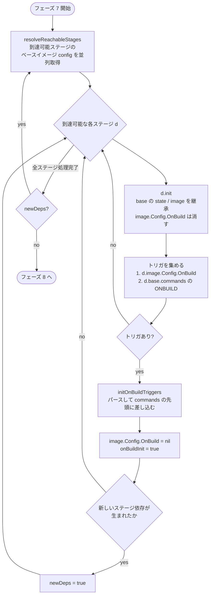

## 何を学んだか

`ONBUILD RUN npm install` と書くと、その命令は**文字列のまま**イメージ config の `OnBuild` フィールドに保存される。そのイメージを `FROM` したビルドは、config から文字列を取り出し、Dockerfile パーサに通し直し、自分の命令列の**先頭に差し込む**。

問題は、差し込んだ命令が `COPY --from=other` かもしれないことだ。そうすると新しいステージ依存が生まれ、到達可能なステージ集合が広がり、新しく到達可能になったステージのベースイメージを解決する必要が出て、そのベースイメージにも `ONBUILD` があるかもしれない。

だから BuildKit のベースイメージ解決フェーズは、**新しい依存が生まれなくなるまで回るループ**になっている。回数の上限はなく、「各ステージのトリガは高々 1 回しか差し込まれない」という不変条件で停止が保証されている。

## ソースコードのどこか

### 保存側 — dispatchOnbuild は 2 行

書く側は拍子抜けするほど単純だ。

```go title="frontend/dockerfile/dockerfile2llb/convert.go"
func dispatchOnbuild(d *dispatchState, c *instructions.OnbuildCommand) error {
	d.image.Config.OnBuild = append(d.image.Config.OnBuild, c.Expression)
	return nil
}
```

([convert.go L1590](https://github.com/moby/buildkit/blob/ca4838f8ddbd3612bca94bcb8a938d8a326110a3/frontend/dockerfile/dockerfile2llb/convert.go#L1590))

`c.Expression` は `ONBUILD ` を剥がした残りの文字列そのものだ。パーサ側で正規表現に通して先頭を落としている。

```go title="frontend/dockerfile/instructions/parse.go"
	triggerInstruction := strings.ToUpper(strings.TrimSpace(req.args[0]))
	switch strings.ToUpper(triggerInstruction) {
	case "ONBUILD":
		return nil, errors.New("Chaining ONBUILD via `ONBUILD ONBUILD` isn't allowed")
	case "MAINTAINER", "FROM":
		return nil, errors.Errorf("%s isn't allowed as an ONBUILD trigger", triggerInstruction)
	}

	original := regexp.MustCompile(`(?i)^\s*ONBUILD\s*`).ReplaceAllString(req.original, "")
```

([frontend/dockerfile/instructions/parse.go L436-L452](https://github.com/moby/buildkit/blob/ca4838f8ddbd3612bca94bcb8a938d8a326110a3/frontend/dockerfile/instructions/parse.go#L436-L452))

禁止されている組み合わせは 3 つ。`ONBUILD ONBUILD` は無限の入れ子を作れてしまう。`ONBUILD FROM` はステージの境界を子ビルドに注入することになり、ステージ列が変換前に確定しなくなる。`ONBUILD MAINTAINER` は歴史的な理由だ。

保存されるのは文字列で、パース結果ではない。イメージ config は JSON なので、`ONBUILD` の値は文字列の配列でしかありえない。**構文の解釈は消費側の Dockerfile フロントエンドに委ねられる。**その結果、10 年前のイメージに入っている `ONBUILD` が、今日の BuildKit のパーサで解釈されることになる。

### ループ — resolveStages

不動点ループはフェーズ 7 の本体だ。

```go title="frontend/dockerfile/dockerfile2llb/convert.go"
func (dctx *dispatchContext) resolveStages(ctx context.Context, target *dispatchState) (map[*dispatchState]struct{}, error) {
	var allReachable map[*dispatchState]struct{}
	for {
		var err error
		allReachable, err = dctx.resolveReachableStages(ctx, dctx.allDispatchStates.states, target)
		if err != nil {
			return nil, err
		}

		// initialize onbuild triggers in case they create new dependencies
		newDeps := false
		for d := range allReachable {
			d.init()

			onbuilds := slices.Clone(d.image.Config.OnBuild)
			if d.base != nil && !d.onBuildInit {
				for _, cmd := range d.base.commands {
					if obCmd, ok := cmd.Command.(*instructions.OnbuildCommand); ok {
						onbuilds = append(onbuilds, obCmd.Expression)
					}
				}
				d.onBuildInit = true
			}

			if len(onbuilds) > 0 {
				if b, err := initOnBuildTriggers(d, onbuilds, dctx.allDispatchStates, dctx.shlex); err != nil {
					return nil, parser.SetLocation(err, d.stage.Location)
				} else if b {
					newDeps = true
				}
				d.image.Config.OnBuild = nil
			}
		}
		if !newDeps {
			break
		}
	}
	return allReachable, nil
}
```

([convert.go L548-L586](https://github.com/moby/buildkit/blob/ca4838f8ddbd3612bca94bcb8a938d8a326110a3/frontend/dockerfile/dockerfile2llb/convert.go#L548-L586))

トリガの出どころは 2 つある。

1. **`d.image.Config.OnBuild`** — レジストリから取得したベースイメージの config。`resolveReachableStages` が直前に埋めている。
2. **`d.base.commands`** — 同じ Dockerfile 内の前のステージに書かれた `ONBUILD` 命令。

2 番目が別扱いなのは、同一 Dockerfile 内のステージにはイメージ config が存在しないからだ。`FROM x AS a` に `ONBUILD` を書いて `FROM a AS b` としたとき、`b` が `a` の `ONBUILD` を拾うには、`a` のパース済み命令列を直接見るしかない。`dispatchState.init()` の中に、そのための明示的な打ち消しがある。

```go title="frontend/dockerfile/dockerfile2llb/convert.go"
	ds.image = clone(ds.base.image)
	// onbuild triggers to not carry over from base stage
	ds.image.Config.OnBuild = nil
```

([convert.go L1219-L1221](https://github.com/moby/buildkit/blob/ca4838f8ddbd3612bca94bcb8a938d8a326110a3/frontend/dockerfile/dockerfile2llb/convert.go#L1219-L1221))

これがないと、ベースステージの config を丸ごとコピーした結果、トリガが子・孫と無限に伝播してしまう。`ONBUILD` は 1 世代だけ効く、という Docker のセマンティクスがここで保たれている。

`onBuildInit` と `d.image.Config.OnBuild = nil` の 2 つが、**同じトリガを 2 周目で再注入しない**ためのフラグだ。前者は「前ステージの命令列を走査済み」、後者は「イメージ config 由来のトリガを消費済み」を表す。



### 差し込み — initOnBuildTriggers

```go title="frontend/dockerfile/dockerfile2llb/convert.go"
	for _, trigger := range triggers {
		ast, err := parser.Parse(strings.NewReader(trigger))
		if err != nil {
			return false, err
		}
		if len(ast.AST.Children) != 1 {
			return false, errors.New("onbuild trigger should be a single expression")
		}
		node := ast.AST.Children[0]
		// reset the location to the onbuild trigger
		node.StartLine, node.EndLine = rangeStartEnd(d.stage.Location)
		ic, err := instructions.ParseCommand(ast.AST.Children[0])
		// ...
		cmd, err := toCommand(ic, allDispatchStates, shlex)
		// ...
		cmd.isOnBuild = true
		if len(cmd.sources) > 0 {
			hasNewDeps = true
		}
		commands = append(commands, cmd)

		for _, src := range cmd.sources {
			if src != nil {
				d.deps[src] = cmd
				if src.unregistered {
					allDispatchStates.addState(src)
				}
			}
		}
	}
	d.commands = append(commands, d.commands...)
	d.cmdTotal += len(commands)
```

([convert.go L1286-L1329](https://github.com/moby/buildkit/blob/ca4838f8ddbd3612bca94bcb8a938d8a326110a3/frontend/dockerfile/dockerfile2llb/convert.go#L1286-L1329))

注目点が 4 つある。

**行番号の付け替え。** `node.StartLine, node.EndLine = rangeStartEnd(d.stage.Location)` で、トリガの位置を**現在のステージの `FROM` 行**にすげ替える。トリガ文字列を単独でパースすると行番号は 1 になるが、それは今ビルドしている Dockerfile の 1 行目とは無関係だ。`FROM` 行を指しておけば、`ONBUILD` の失敗が「このベースイメージを使ったせいだ」と読める。

**依存の判定は `cmd.sources` の有無。** `hasNewDeps` が立つのは `toCommand` が `sources` を返したとき、つまりトリガが `COPY --from=` か `RUN --mount=from=` だったときだけだ。`ONBUILD RUN make` はいくら差し込んでもグラフの形を変えないので、ループを 1 周追加する必要がない。

**先頭への差し込み。** `d.commands = append(commands, d.commands...)` で、トリガは既存の命令の**前**に入る。Docker の仕様どおりで、`ONBUILD` は子ビルドのステージの最初に走る。

**`cmd.isOnBuild = true`。** このフラグは `dispatch` の頭で `d.cmdIsOnBuild` に写され、`prefixCommand` がプログレス行に `ONBUILD ` を付ける ([convert.go L1965-L1967](https://github.com/moby/buildkit/blob/ca4838f8ddbd3612bca94bcb8a938d8a326110a3/frontend/dockerfile/dockerfile2llb/convert.go#L1965-L1967))。ログを見ている人が「これは自分の Dockerfile に書いていない命令だ」と気づける。`cmdTotal` も同時に増やされるので、進捗の分母も合う。

### 停止の根拠

このループには回数の上限がない。停止は次の 2 点に依存している。

- **各ステージのトリガは高々 1 回しか集められない。** 2 周目には `d.image.Config.OnBuild` は `nil` で、`onBuildInit` は `true` になっている。`len(onbuilds) > 0` に入らないので、そのステージから `newDeps` が立つことはない。
- **`ONBUILD ONBUILD` がパース時点で禁止されている。** トリガがトリガを生むことはないので、1 つのステージについて注入は 1 段で終わる。

`newDeps` が立ちうるのは、そのステージのトリガを**初めて**処理したときだけだ。新しく到達可能になったステージが `ONBUILD` 付きイメージを `FROM` していて、そのトリガがまた `COPY --from` を含む — という連鎖は原理的には伸びうるが、その長さは Dockerfile とレジストリ上のイメージが作る有限の連鎖に等しい。

なお `frontend/dockerui` にある `maxContextRecursion = 10` は named context の解決の再帰上限で、この ONBUILD ループとは無関係だ ([named context](../named-context/))。

### エクスポート側

`dispatchOnbuild` はフェーズ 8 で走る。つまり**このループの後**だ。`d.image.Config.OnBuild` への追記は、今ビルドしているステージが `ONBUILD` を宣言した記録であり、出力イメージの config に載ってレジストリに push される。次に誰かがこのイメージを `FROM` したとき、フェーズ 7 のループがそれを読む。

「フェーズ 7 が読み、フェーズ 8 が書く」というフィールドの使われ方が、この機能が**ビルドをまたいだプロトコル**であることを表している。

## なぜそうなっているか

`ONBUILD` は「フレームワークの雛形イメージ」のための仕組みだった。`node:onbuild` のようなイメージが `ONBUILD COPY package.json .` と `ONBUILD RUN npm install` を持っていて、ユーザーは `FROM node:onbuild` の 1 行だけを書けばよい、という使い方だ。この体験を成り立たせるには、消費側のビルドが**イメージ config から命令列を復元する**しかない。イメージ config は JSON なので、運べるのは文字列だけになる。

BuildKit にとって厄介なのは、この文字列が**依存グラフを変えうる**ことだ。フェーズ 6 で確定したはずのグラフに、フェーズ 7 で辺が増える。パイプラインの他の部分は後戻りしないのに、ここだけがループになっているのはそのためだ。

ループを避ける代案はある。トリガを差し込んだ後に「グラフ再構築 → 到達判定 → ベースイメージ解決」をもう一度やり直す、と決め打ちすることだ。だが `ONBUILD` を持つイメージは実際には稀なので、`newDeps` を見て**必要なときだけ**回す形になっている。`ONBUILD` のない普通の Dockerfile では、ループは 1 周で抜ける。

`hasNewDeps` の粒度が「トリガに `sources` があったか」であって「トリガがあったか」でないのも同じ理屈だ。`ONBUILD RUN` だけのイメージなら、トリガを差し込んでもループは追加されない。

## どう活かすか

- **「他所から来たコードを自分のパイプラインに差し込む」なら、位置情報をすげ替える。** `node.StartLine = rangeStartEnd(d.stage.Location)` の 1 行がないと、エラーが「1 行目」を指して誰にも意味が伝わらない。生成したコードや取り込んだ設定を扱うとき、位置は「それを取り込んだ場所」に付け直す。
- **不動点ループの停止条件は「変化があったか」ではなく「解決が必要な変化があったか」にする。** 「トリガがあった」でループを回すと、`ONBUILD RUN` だけの Dockerfile も必ず 2 周する。追加の解決を要求する変化 (新しい依存) だけを検出すれば、大多数のケースが 1 周で抜ける。
- **入れ子を許さないことが停止性の担保になる。** `ONBUILD ONBUILD` の禁止は使い勝手の話に見えるが、実際には「トリガの注入は 1 段で終わる」を保証している。再帰的な拡張機能を作るとき、深さ 1 に制限すれば上限のないループを書かずに済む。
- **世代をまたぐメタデータは、明示的に消す。** `init()` の `ds.image.Config.OnBuild = nil` のような打ち消しは、コピーコンストラクタの中に置く。継承の起点で消しておかないと、「なぜか孫にまで効いている」というバグの形で出てくる。
