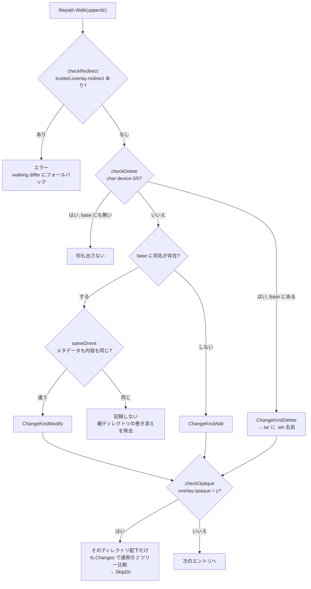

## 何を学んだか

コンテナのレイヤ tar は「下のツリーと上のツリーの差分」だ。素直に作るなら両方を walk して 1 ファイルずつ比較する (containerd の walking differ がこれをやる)。しかしスナップショッタが overlayfs なら、**upperdir がすでに差分そのもの** である。BuildKit はその場合に upperdir だけを歩き、比較をほぼ全部飛ばす。

残る仕事は変換だ。overlayfs は削除を「メジャー 0 マイナー 0 のキャラクタデバイス」で、ディレクトリの上書きを「`trusted.overlay.opaque` xattr」で表す。tar 側は AUFS 形式の `.wh.<名前>` エントリで表す。この対応づけと、「upperdir に出てくるが実は変更されていないもの」の除外がこの実装の中身になる。

## 使えるかどうかの判定

入口は `tryComputeOverlayBlob` で、まず「これが overlayfs のマウントか、しかも差分が 1 段か」を確かめる。

```go title="cache/blobs_linux.go"
// computeOverlayBlob provides overlayfs-specialized method to compute
// diff between lower and upper snapshot. If the passed mounts cannot
// be computed (e.g. because the mounts aren't overlayfs), it returns
// an error.
func (sr *immutableRef) tryComputeOverlayBlob(ctx context.Context, lower, upper []mount.Mount, mediaType string, ref string, compressorFunc compression.Compressor) (_ ocispecs.Descriptor, ok bool, err error) {
	// Get upperdir location if mounts are overlayfs that can be processed by this differ.
	upperdir, err := overlay.GetUpperdir(lower, upper)
	if err != nil {
		// This is not an overlayfs snapshot. This is not an error so don't return error here
		// and let the caller fallback to another differ.
		return emptyDesc, false, nil
	}
```

([cache/blobs_linux.go L22-L35](https://github.com/moby/buildkit/blob/ca4838f8ddbd3612bca94bcb8a938d8a326110a3/cache/blobs_linux.go#L22-L35))

エラーを返さず `ok = false` で返すのが規約だ。「この最適化は使えない」は失敗ではない。

`GetUpperdir` が許すのは 2 パターンだけ。

```go title="util/overlay/overlay_linux.go"
func GetUpperdir(lower, upper []mount.Mount) (string, error) {
	var upperdir string
	if len(lower) == 0 && len(upper) == 1 { // upper is the bottommost snapshot
		// Get layer directories of upper snapshot
		upperM := upper[0]
		if upperM.Type != "bind" {
			return "", errors.Errorf("bottommost upper must be bind mount but %q", upperM.Type)
		}
		upperdir = upperM.Source
	} else if len(lower) == 1 && len(upper) == 1 {
		// ... lower / upper のレイヤディレクトリ列を取り出す ...

		// Check if the diff directory can be determined
		if len(upperlayers) != len(lowerlayers)+1 {
			return "", errors.Errorf("cannot determine diff of more than one upper directories")
		}
		for i := range lowerlayers {
			if upperlayers[i] != lowerlayers[i] {
				return "", errors.Errorf("layer %d must be common between upper and lower snapshots", i)
			}
		}
		upperdir = upperlayers[len(upperlayers)-1] // get the topmost layer that indicates diff
	} else {
		return "", errors.Errorf("multiple mount configurations are not supported")
	}
	// ...
}
```

([util/overlay/overlay_linux.go L25-L81](https://github.com/moby/buildkit/blob/ca4838f8ddbd3612bca94bcb8a938d8a326110a3/util/overlay/overlay_linux.go#L25-L81))

条件を言い換えると「upper が lower より**ちょうど 1 段だけ**上で、下の部分が完全に一致している」こと。2 段以上離れていたら upperdir 1 つでは差分を表せない。この検査が、`DiffOp` のような任意の 2 点間の差分でこの最適化が効かない理由でもある。

レイヤディレクトリの取り出しにも保守的な検査が入る。

```go title="util/overlay/overlay_linux.go"
		} else if strings.HasPrefix(o, "workdir=") || o == "index=off" || o == "userxattr" || strings.HasPrefix(o, "redirect_dir=") {
			// these options are possible to specfied by the snapshotter but not indicate dir locations.
			continue
		} else {
			// encountering an unknown option. return error and fallback to walking differ
			// to avoid unexpected diff.
			return nil, errors.Errorf("unknown option %q specified by snapshotter", o)
		}
```

([util/overlay/overlay_linux.go L94-L102](https://github.com/moby/buildkit/blob/ca4838f8ddbd3612bca94bcb8a938d8a326110a3/util/overlay/overlay_linux.go#L94-L102))

知らないマウントオプションを見たら諦める。overlayfs のオプションには差分の意味を変えるものがあるので、「知らないから無視する」ではなく「知らないから使わない」に倒している。

呼び出し側にもスナップショッタ名による門番がある。

```go title="cache/blobs.go"
				} else if !isTypeWindows(sr) {
					enableOverlay, fallback = true, true
					switch sr.cm.Snapshotter.Name() {
					case "overlayfs", "stargz":
						// overlayfs-based snapshotters should support overlay diff except when running an arbitrary diff
						// (in which case lower and upper may differ by more than one layer), so print warn log on unexpected
						// failure.
						logWarnOnErr = sr.kind() != Diff
					case "fuse-overlayfs", "native":
						// not supported with fuse-overlayfs snapshotter which doesn't provide overlayfs mounts.
						// TODO: add support for fuse-overlayfs
						enableOverlay = false
					}
				}
```

([cache/blobs.go L174-L187](https://github.com/moby/buildkit/blob/ca4838f8ddbd3612bca94bcb8a938d8a326110a3/cache/blobs.go#L174-L187))

`logWarnOnErr` の使い分けが実装者の期待を表している。`overlayfs` / `stargz` で `Diff` 以外なら成功して当然なので、失敗したら警告を出す。`Diff` は 2 段以上離れうるので失敗しても黙る。デバッグ用に `BUILDKIT_DEBUG_FORCE_OVERLAY_DIFF` で強制でき、そのときは fallback を禁止して失敗をエラーにする ([cache/blobs.go L168-L173](https://github.com/moby/buildkit/blob/ca4838f8ddbd3612bca94bcb8a938d8a326110a3/cache/blobs.go#L168-L173))。

## 2 つのビューを用意する

`WriteUpperdir` は、tar を書く前に一時マウントを 2 つ作る。

```go title="util/overlay/overlay_linux.go"
// WriteUpperdir writes a layer tar archive into the specified writer, based on
// the diff information stored in the upperdir.
func WriteUpperdir(ctx context.Context, w io.Writer, upperdir string, lower []mount.Mount) error {
	emptyLower, err := os.MkdirTemp("", "buildkit") // empty directory used for the lower of diff view
	if err != nil {
		return errors.Wrapf(err, "failed to create temp dir")
	}
	defer os.Remove(emptyLower)
	upperView := []mount.Mount{
		{
			Type:    "overlay",
			Source:  "overlay",
			Options: []string{fmt.Sprintf("lowerdir=%s", strings.Join([]string{upperdir, emptyLower}, ":"))},
		},
	}
	return mount.WithTempMount(ctx, lower, func(lowerRoot string) error {
		return mount.WithTempMount(ctx, upperView, func(upperViewRoot string) error {
			cw := archive.NewChangeWriter(&cancellableWriter{ctx, w}, upperViewRoot)
			if err := Changes(ctx, cw.HandleChange, upperdir, upperViewRoot, lowerRoot); err != nil {
				// ...
			}
			return cw.Close()
		})
	})
}
```

([util/overlay/overlay_linux.go L111-L138](https://github.com/moby/buildkit/blob/ca4838f8ddbd3612bca94bcb8a938d8a326110a3/util/overlay/overlay_linux.go#L111-L138))

- `lowerRoot` — 下のスナップショットを普通にマウントしたもの。「このパスは下に存在するか」を `Lstat` で問い合わせるために使う
- `upperViewRoot` — **upperdir を、空ディレクトリの上に重ねた overlay としてマウントしたもの**

2 つ目が効く。upperdir を overlay の lowerdir として使うと、overlayfs 自身が whiteout と opaque を解釈してくれるので、このビューには whiteout のキャラクタデバイスが現れない。tar に書き込むファイルの内容やメタデータはこちらから読む。生の upperdir を直接読むと whiteout デバイスをそのままファイルとして tar に入れてしまう。

`Changes` は 3 つのパスを受け取る。「歩く対象 = 生の upperdir」「読む対象 = upperView」「比較対象 = lower」という役割分担になっている。

## 3 種類の変更を判定する



**削除。** overlayfs は「下にあるファイルを消した」を、upperdir にメジャー 0 マイナー 0 のキャラクタデバイスを置くことで表す。

```go title="util/overlay/overlay_linux.go"
// checkDelete checks if the specified file is a whiteout
func checkDelete(path string, base string, f os.FileInfo) (delete, skip bool, _ error) {
	if f.Mode()&os.ModeCharDevice != 0 {
		if _, ok := f.Sys().(*syscall.Stat_t); ok {
			maj, min, err := devices.DeviceInfo(f)
			if err != nil {
				return false, false, errors.Wrapf(err, "failed to get device info")
			}
			if maj == 0 && min == 0 {
				// This file is a whiteout (char 0/0) that indicates this is deleted from the base
				if _, err := os.Lstat(filepath.Join(base, path)); err != nil {
					if !os.IsNotExist(err) {
						return false, false, errors.Wrapf(err, "failed to lstat")
					}
					// This file doesn't exist even in the base dir.
					// We don't need whiteout. Just skip this file.
					return false, true, nil
				}
				return true, false, nil
			}
		}
	}
	return false, false, nil
}
```

([util/overlay/overlay_linux.go L246-L270](https://github.com/moby/buildkit/blob/ca4838f8ddbd3612bca94bcb8a938d8a326110a3/util/overlay/overlay_linux.go#L246-L270))

whiteout があっても、下に対応するファイルが無ければ tar には出さない。無いものを消す指示を入れても意味がないうえ、レイヤが無駄に大きくなる。`ChangeKindDelete` を受けた containerd の `ChangeWriter` が、AUFS 形式の `.wh.<名前>` エントリに翻訳する ([vendor 内 archive/tar.go L544-L555](https://github.com/moby/buildkit/blob/ca4838f8ddbd3612bca94bcb8a938d8a326110a3/vendor/github.com/containerd/containerd/v2/pkg/archive/tar.go#L544-L555))。ここで `f` (whiteout デバイスの FileInfo) をあえて残しているのもコメントに書かれている。merge の実装がこのデバイスをハードリンクするのに使う。

**opaque ディレクトリ。** 「下にあったディレクトリの中身を全部無かったことにして置き換えた」場合、overlayfs は個々のファイルに whiteout を置かず、ディレクトリに xattr を 1 個立てる。

```go title="util/overlay/overlay_linux.go"
func checkOpaque(upperdir string, path string, base string, f os.FileInfo) (isOpaque bool, _ error) {
	if f.IsDir() {
		for _, oKey := range []string{"trusted.overlay.opaque", "user.overlay.opaque"} {
			opaque, err := sysx.LGetxattr(filepath.Join(upperdir, path), oKey)
			if err != nil && !errors.Is(err, unix.ENODATA) {
				return false, errors.Wrapf(err, "failed to retrieve %s attr", oKey)
			} else if len(opaque) == 1 && opaque[0] == 'y' {
				// ...
			}
		}
	}
	return false, nil
}
```

([util/overlay/overlay_linux.go L271-L294](https://github.com/moby/buildkit/blob/ca4838f8ddbd3612bca94bcb8a938d8a326110a3/util/overlay/overlay_linux.go#L271-L294))

`trusted.` と `user.` の両方を見るのは、rootless で動くときに `userxattr` オプションで後者が使われるため。

opaque を見つけたときの処理が面白い。upperdir を歩くだけでは「下にあったが消えたファイル」の情報が upperdir に無いので、そこだけ通常の 2 ツリー比較に切り替える。

```go title="util/overlay/overlay_linux.go"
			} else if isOpaque {
				// This is an opaque directory. Start a new walking differ to get adds/deletes of
				// this directory. We use "upperdirView" directory which doesn't contain whiteouts.
				if err := fs.Changes(ctx, filepath.Join(base, path), filepath.Join(upperdirView, path),
					func(k fs.ChangeKind, p string, f os.FileInfo, err error) error {
						return changeFn(k, filepath.Join(path, p), f, err) // rebase path to be based on the opaque dir
					},
				); err != nil {
					return err
				}
				return filepath.SkipDir // We completed this directory. Do not walk files under this directory anymore.
			}
```

([util/overlay/overlay_linux.go L229-L241](https://github.com/moby/buildkit/blob/ca4838f8ddbd3612bca94bcb8a938d8a326110a3/util/overlay/overlay_linux.go#L229-L241))

最適化を全部か無かにせず、効かない部分木だけ通常の差分計算に落として、パスを付け替えて同じ出力ストリームに合流させている。

**redirect_dir は諦める。** ディレクトリの rename を xattr で表す overlayfs の機能で、これがあると upperdir の構造から元のパスを復元できない。

```go title="util/overlay/overlay_linux.go"
		} else if redirect {
			// Return error when redirect_dir is enabled which can result to a wrong diff.
			// TODO: support redirect_dir
			return errors.New("redirect_dir is used but it's not supported in overlayfs differ")
		}
```

([util/overlay/overlay_linux.go L182-L186](https://github.com/moby/buildkit/blob/ca4838f8ddbd3612bca94bcb8a938d8a326110a3/util/overlay/overlay_linux.go#L182-L186))

「間違った差分を出すくらいなら失敗する」。呼び出し側が walking differ にフォールバックする。

## 変更されていないのに upperdir に現れるもの

overlayfs では、`/foo/bar/baz` に書き込むと `/foo` と `/foo/bar` も copy-up されて upperdir に現れる。これをそのまま差分にすると、変わっていないディレクトリのエントリがレイヤに混ざる。

```go title="util/overlay/overlay_linux.go"
		} else if baseF, err := os.Lstat(filepath.Join(base, path)); err == nil {
			// File exists in the base layer. Thus this is modified.
			kind = fs.ChangeKindModify
			// Avoid including directory that hasn't been modified. If /foo/bar/baz is modified,
			// then /foo will apper here even if it's not been modified because it's the parent of bar.
			if same, err := sameDirent(baseF, f, filepath.Join(base, path), filepath.Join(upperdirView, path)); same {
				skipRecord = true // Both are the same, don't record the change
			} else if err != nil {
				return err
			}
		}
```

([util/overlay/overlay_linux.go L202-L213](https://github.com/moby/buildkit/blob/ca4838f8ddbd3612bca94bcb8a938d8a326110a3/util/overlay/overlay_linux.go#L202-L213))

`sameDirent` は継続的に厳しくなる比較を並べる。`os.SameFile` → メタデータ (種別・パーミッション・uid/gid・サイズ・mtime) → capability xattr → シンボリックリンク先 → 最後にファイル内容。内容比較まで到達する条件について、長いコメントがある。

```go title="util/overlay/overlay_linux.go"
// sameDirent performs continity-compatible comparison of files and directories.
// https://github.com/containerd/continuity/blob/v0.1.0/fs/path.go#L91-L133
// This will only do a slow content comparison of two files if they have all the
// same metadata and both have truncated nanosecond mtime timestamps. In practice,
// this can only happen if both the base file in the lowerdirs has a truncated
// timestamp (i.e. was unpacked from a tar) and the user did something like
// "mv foo tmp && mv tmp foo" that results in the file being copied up to the
// upperdir without making any changes to it. This is much rarer than similar
// cases in the double-walking differ, where the slow content comparison will
// be used whenever a file with a truncated timestamp is in the lowerdir at
// all and left unmodified.
```

([util/overlay/overlay_linux.go L307-L317](https://github.com/moby/buildkit/blob/ca4838f8ddbd3612bca94bcb8a938d8a326110a3/util/overlay/overlay_linux.go#L307-L317))

tar から展開したファイルは mtime のナノ秒が切り捨てられているので、「メタデータが完全一致するが本当に同じか分からない」状況が起きうる。walking differ ではその条件が lower 側の全ファイルに当てはまるが、この実装では「copy-up されたが変更されていないファイル」に限られる。同じ比較関数を使いながら、対象集合が小さいぶんだけ速いという構図になる。

## tar の書き出しと圧縮

`tryComputeOverlayBlob` は content store の Writer に直接書く。

```go title="cache/blobs_linux.go"
	bufW := bufio.NewWriterSize(cw, 128*1024)
	var labels map[string]string
	if compressorFunc != nil {
		dgstr := digest.SHA256.Digester()
		compressed, err := compressorFunc(bufW, mediaType)
		// ...
		if err := overlay.WriteUpperdir(ctx, io.MultiWriter(compressed, dgstr.Hash()), upperdir, lower); err != nil {
			return emptyDesc, false, errors.Wrap(err, "failed to write compressed diff")
		}
		// ...
		labels = map[string]string{
			labelspkg.LabelUncompressed: dgstr.Digest().String(),
		}
	} else {
		if err = overlay.WriteUpperdir(ctx, bufW, upperdir, lower); err != nil {
			return emptyDesc, false, errors.Wrap(err, "failed to write diff")
		}
	}
```

([cache/blobs_linux.go L67-L89](https://github.com/moby/buildkit/blob/ca4838f8ddbd3612bca94bcb8a938d8a326110a3/cache/blobs_linux.go#L67-L89))

`io.MultiWriter(compressed, dgstr.Hash())` で、圧縮前のバイト列を圧縮器とダイジェスト計算器の両方に流す。これで diffID (非圧縮のダイジェスト) が 1 パスで求まる。content store の Writer 側が圧縮後のダイジェストを数えているので、[GetByBlob](../get-by-blob/) が必要とする 2 つのダイジェストが 1 回の走査で揃う。

## なぜそうなっているか

walking differ の計算量は「両方のツリーの全ファイル数」に比例する。ベースイメージが数万ファイルあり、変更が 3 ファイルでも、毎回全部を stat して比べることになる。`RUN` を 1 個実行するたびにこれが走るので、ビルド時間への影響が大きい。

一方 overlayfs では、カーネルがすでに copy-on-write の過程で「何が変わったか」を upperdir という形で記録している。作り直す必要がない。BuildKit がやるのは、その表現 (キャラクタデバイス、xattr) を tar の表現 (`.wh.` エントリ) に翻訳することだけになる。

実装が保守的なのは、差分を間違えるとレイヤが壊れて、しかもそれがキャッシュに乗って残るからだ。だからこそ「知らないマウントオプションを見たら諦める」「redirect_dir ならエラー」「2 段以上離れていたらエラー」と、少しでも自信が無ければ通常の経路に落とす。フォールバックが常に用意されているので、諦めるコストは「遅くなる」だけで済む。

`blobs_linux.go` / `blobs_nolinux.go` のビルドタグ分割も同じ形だ。Linux 以外では常に「未サポート」を返し、呼び出し側が walking differ を使う。

## どう活かすか

**下位層がすでに持っている情報を作り直さない。** 差分計算は「2 つの状態を比べる」以外に「変更のログを読む」でも実装できる。ファイルシステム、DB の WAL、Git のインデックスなど、変更をすでに記録している層があるなら、そちらを読むほうがほぼ常に速い。

**「使えない」を失敗ではなく `(結果, ok, error)` の ok で返す。** `tryComputeOverlayBlob` が `ok = false, err = nil` を返す規約は、呼び出し側の分岐を単純にしている。最適化パスは「条件が合わないこと」が普通に起こるので、それをエラーとして扱うとログもエラーハンドリングも汚れる。

**最適化が効かない部分だけ、汎用の実装に落として合流させる。** opaque ディレクトリの扱いがこれだ。全体を諦めるのでも、opaque を無理に扱うのでもなく、その部分木だけ `fs.Changes` に投げてパスを付け替えて同じストリームに流す。最適化の適用範囲を部分木単位にできると、対応できるケースが一気に広がる。

**危険な最適化には、常に検証済みのフォールバックを用意する。** BuildKit は環境変数で強制できるようにしつつ、そのときはフォールバックを切っている。「速い経路が本当に正しい結果を出すか」をテストで確かめられる仕掛けで、これが無いとフォールバックに逃げているせいでバグに気づかない。

**1 パスで複数のダイジェストを取る。** `io.MultiWriter` で圧縮器とハッシュ計算器に同時に流せば、非圧縮と圧縮の両方のダイジェストが 1 回の走査で揃う。ストリームを 2 回読む設計にすると、データ量に比例したコストがそのまま倍になる。
