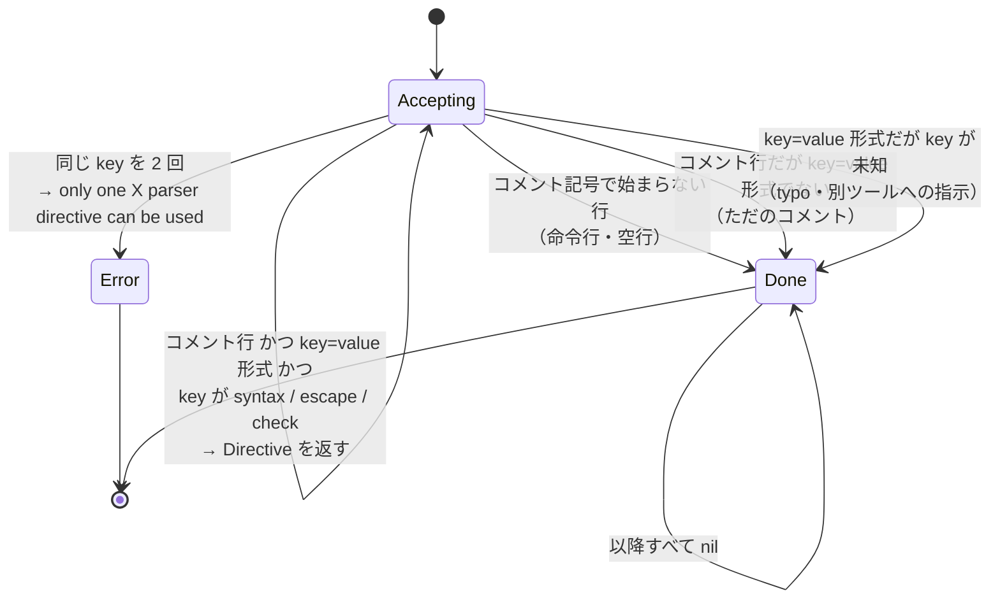

## 何を学んだか

parser directive が「Dockerfile の先頭にしか書けない」という規則は、ドキュメント上の約束ではなく `DirectiveParser` の `done` フラグそのものだ。ディレクティブとして解釈できない行を 1 行読んだ時点で `done = true` になり、以降 `ParseLine` は何も返さない。ラッチであって、リセットする手段は無い。

```go title="frontend/dockerfile/parser/directives.go"
// DirectiveParser is a parser for Dockerfile directives that enforces the
// quirks of the directive parser.
type DirectiveParser struct {
	line    int
	comment *string
	seen    map[string]struct{}
	done    bool
}
```

([frontend/dockerfile/parser/directives.go L33-L40](https://github.com/moby/buildkit/blob/ca4838f8ddbd3612bca94bcb8a938d8a326110a3/frontend/dockerfile/parser/directives.go#L33-L40))

型コメントの "enforces the quirks" が正直だ。仕様を実装したのではなく、歴史的な奇癖を固定するための型だと言っている。

## 4 つの終了条件

`ParseLine` は 1 行を受け取り、ディレクティブなら `*Directive` を、そうでなければ `nil` を返す。`done` を立てる経路が 4 つある。

```go title="frontend/dockerfile/parser/directives.go"
func (d *DirectiveParser) ParseLine(line []byte) (*Directive, error) {
	d.line++
	if d.done {
		return nil, nil
	}
	if d.comment == nil {
		d.SetComment("#")
	}

	line, ok := bytes.CutPrefix(line, []byte(*d.comment))
	if !ok {
		d.done = true
		return nil, nil
	}
	line = bytes.TrimLeftFunc(line, unicode.IsSpace)

	match := directiveRegexp().FindSubmatch(line)
	if len(match) == 0 {
		d.done = true
		return nil, nil
	}

	k := strings.ToLower(string(match[1]))
	if _, ok := validDirectives[k]; !ok {
		d.done = true
		return nil, nil
	}
	if d.seen == nil {
		d.seen = map[string]struct{}{}
	}
	if _, ok := d.seen[k]; ok {
		return nil, errors.Errorf("only one %s parser directive can be used", k)
	}
	d.seen[k] = struct{}{}
	// ...
}
```

([frontend/dockerfile/parser/directives.go L50-L96](https://github.com/moby/buildkit/blob/ca4838f8ddbd3612bca94bcb8a938d8a326110a3/frontend/dockerfile/parser/directives.go#L50-L96))



3 つ目の「未知のキーでも打ち切る」が一番きつい。`# foo = bar` という無害なコメントを 1 行目に書くと、2 行目の `# syntax=...` はもう読まれない。`directives_test.go` がその挙動をそのまま固定している。

```go title="frontend/dockerfile/parser/directives_test.go"
	dt := `#escape=\
# key = FOO bar

# smth
`
	parser := DirectiveParser{}
	d, err := parser.ParseAll([]byte(dt))
	require.NoError(t, err)
	require.Len(t, d, 1)
```

([frontend/dockerfile/parser/directives_test.go L9-L24](https://github.com/moby/buildkit/blob/ca4838f8ddbd3612bca94bcb8a938d8a326110a3/frontend/dockerfile/parser/directives_test.go#L9-L24))

`testfiles/escape-after-comment/Dockerfile` は、この落とし穴を Dockerfile の中で説明している。

```dockerfile
# Comment here. Should not be looking for the following parser directive.
# Hence the following line will be ignored, and the subsequent backslash
# continuation will be the default.
# escape = `

FROM image
```

コメント 1 行が先にあるだけで `escape` が効かなくなり、`\` が継続文字のままになる。

### キーは正規化、値はしない

```go title="frontend/dockerfile/parser/directives.go"
var directiveRegexp = sync.OnceValue(func() *regexp.Regexp {
	return regexp.MustCompile(`^([a-zA-Z][a-zA-Z0-9]*)\s*=\s*(.+?)\s*$`)
})
```

([frontend/dockerfile/parser/directives.go L42-L44](https://github.com/moby/buildkit/blob/ca4838f8ddbd3612bca94bcb8a938d8a326110a3/frontend/dockerfile/parser/directives.go#L42-L44))

キーは英字始まりの英数字のみ。ハイフンもアンダースコアも使えない。`\s*=\s*` なので `# syntax=x` も `# syntax = x` も通り、末尾の空白は `(.+?)\s*$` の非貪欲マッチで落ちる。

そのうえでキーだけ `strings.ToLower` される。`# EScape=\` が `escape` として通ることをテストが確かめていて、コメントに「for some reason Moby implementation in case insensitive for escape」と書かれている。値は小文字化されないので、`# syntax=docker/Dockerfile` の大文字はそのまま参照名として使われる。

重複だけは `done` ではなくエラーになる。`# syntax=a` の次に `# syntax=b` を書くと `only one syntax parser directive can be used` で失敗する。無視して先勝ちにすると、どちらが効いているのか読み手に分からなくなるので、曖昧さを残さず落としている。

## パーサ本体への組み込み

`Parse` は毎行 `processLine` を呼び、その中で必ず `possibleParserDirective` を通す。`done` が立っていれば即 `nil` が返るだけなので、判定はループの外に出されていない。

```go title="frontend/dockerfile/parser/parser.go"
func (d *directives) possibleParserDirective(line []byte) (bool, error) {
	directive, err := d.parser.ParseLine(line)
	if err != nil {
		return false, err
	}
	if directive != nil && directive.Name == keyEscape {
		err := d.setEscapeToken(directive.Value)
		return err == nil, err
	}
	return directive != nil, nil
}
```

([frontend/dockerfile/parser/parser.go L172-L185](https://github.com/moby/buildkit/blob/ca4838f8ddbd3612bca94bcb8a938d8a326110a3/frontend/dockerfile/parser/parser.go#L172-L185))

パーサ本体が自分で処理するディレクティブは `escape` だけだ。`syntax` と `check` は「有効なディレクティブとして受理して `done` を立てない」だけで、値は使われない。使うのは別の呼び出し元 (後述) になる。`escape` を受理すると `setEscapeToken` が走り、行連結の正規表現が組み直される ([../line-continuation-escape/](../line-continuation-escape/))。

戻り値の bool は AST に載るコメントの掃除に使われる。

```go title="frontend/dockerfile/parser/parser.go"
		bytesRead, directiveOk, err = processLine(d, bytesRead, true)
		// If the line is a directive, strip it from the comments
		// so it doesn't get added to the AST.
		if directiveOk {
			comments = comments[:len(comments)-1]
		}
```

([frontend/dockerfile/parser/parser.go L309-L314](https://github.com/moby/buildkit/blob/ca4838f8ddbd3612bca94bcb8a938d8a326110a3/frontend/dockerfile/parser/parser.go#L309-L314))

ディレクティブ行は見た目がコメントなので、直前の `isComment` 分岐ですでに `comments` に積まれている。それを 1 個だけ引き抜く。`# syntax=...` が次の命令の `PrevComment` に混ざらないようにするためだ。

## syntax だけ 3 つの記法を受け付ける

`DetectSyntax` は `syntax` に限って、`#` 以外の書き方も試す。

```go title="frontend/dockerfile/parser/directives.go"
// DetectSyntax returns the syntax of provided input.
//
// The traditional dockerfile directives '# syntax = ...' are used by default,
// however, the function will also fallback to c-style directives '// syntax = ...'
// and json-encoded directives '{ "syntax": "..." }'. Finally, starting lines
// with '#!' are treated as shebangs and ignored.
//
// This allows for a flexible range of input formats, and appropriate syntax
// selection.
func DetectSyntax(dt []byte) (string, string, []Range, bool) {
	return parseDirective(keySyntax, dt, true)
}
```

([frontend/dockerfile/parser/directives.go L117-L128](https://github.com/moby/buildkit/blob/ca4838f8ddbd3612bca94bcb8a938d8a326110a3/frontend/dockerfile/parser/directives.go#L117-L128))

`parseDirective` は BOM を落とし、シェバン行があれば飛ばしてから、`#` 版 → `//` 版 → JSON 版の順に試す。`DirectiveParser` は `SetComment` でコメント記号を差し替えられるので、`//` 版は同じ構造体をもう 1 つ作って `SetComment("//")` するだけで済む。

これが要るのは、[`# syntax=` で指定するフロントエンド](../syntax-directive/)が Dockerfile 以外の記法を実装しうるからだ。JavaScript や JSON でビルドを書く言語では `#` がコメントにならない。ビルド定義の中身を解釈するのは指定されたフロントエンド自身なので、BuildKit 側は「どのフロントエンドに渡すか」だけを、記法に依存しない形で読み出せる必要がある。

シェバンを飛ばす分岐は、ビルド定義を実行可能スクリプトとして書けるようにするためのものだ。ただし飛ばせるのは 1 行目だけで、シェバンの後に空行を挟むと `done` が立つ。テストがその境界を押さえている。

```go title="frontend/dockerfile/parser/directives_test.go"
	dt = `#!/bin/sh

# syntax = dockerfile:experimental
`
	_, _, _, ok = DetectSyntax([]byte(dt))
	require.False(t, ok)
```

([frontend/dockerfile/parser/directives_test.go L64-L69](https://github.com/moby/buildkit/blob/ca4838f8ddbd3612bca94bcb8a938d8a326110a3/frontend/dockerfile/parser/directives_test.go#L64-L69))

`DetectSyntax` は AST を作る前、Dockerfile のバイト列を読んだ直後に呼ばれる。

```go title="frontend/dockerfile/builder/build.go"
		} else if ref, cmdline, loc, ok := parser.DetectSyntax(src.Data); ok {
			res, err := forwardGateway(ctx, c, ref, cmdline)
			// ...
		}
```

([frontend/dockerfile/builder/build.go L62-L67](https://github.com/moby/buildkit/blob/ca4838f8ddbd3612bca94bcb8a938d8a326110a3/frontend/dockerfile/builder/build.go#L62-L67))

一致すればそのまま `forwardGateway` に投げて、以降の処理を別のフロントエンドに丸投げする。組み込みのパーサは 1 行も動かない。返り値の `loc []Range` は、フロントエンドの起動に失敗したときに Dockerfile の何行目を指すかに使われる。

## check は 2 か所で読まれる

`check` は linter の設定で、参照される場所が 2 つある。1 つは Dockerfile 全体の既定値。

```go title="frontend/dockerfile/dockerfile2llb/convert.go"
		lintOptionStr, _, _, _ := parser.ParseDirective("check", dt)
		lintConfig, err = linter.ParseLintOptions(lintOptionStr)
```

([frontend/dockerfile/dockerfile2llb/convert.go L197-L198](https://github.com/moby/buildkit/blob/ca4838f8ddbd3612bca94bcb8a938d8a326110a3/frontend/dockerfile/dockerfile2llb/convert.go#L197-L198))

`ParseDirective` は `anyFormat = false` なので `#` 版だけを見る。`syntax` と違って `//` や JSON は試さない。

もう 1 つが面白い。命令ごとの `# check=skip=...` を、同じ `DirectiveParser` で読んでいる。

```go title="frontend/dockerfile/linter/linter.go"
	for _, comment := range comments {
		p := parser.DirectiveParser{}
		p.SetComment("")

		d, _ := p.ParseLine([]byte(comment))
		if d == nil || d.Name != "check" {
			continue
		}
		// ...
	}
```

([frontend/dockerfile/linter/linter.go L104-L112](https://github.com/moby/buildkit/blob/ca4838f8ddbd3612bca94bcb8a938d8a326110a3/frontend/dockerfile/linter/linter.go#L104-L112))

`SetComment("")` でコメント記号を空文字にしている。`Node.PrevComment` に入っている文字列は `#` と前後の空白がすでに剥がされているので、プレフィックスを要求しないようにしてから同じパーサに通す。`bytes.CutPrefix(line, []byte(""))` は常に成功するので、この使い方だと `done` の第 1 経路が無効になり、`key=value` の形かどうかだけで判定される。

毎回 `DirectiveParser` を新しく作っているので、`done` も `seen` もリセットされる。ラッチを持つ型を「1 行だけ解釈するユーティリティ」として使い回すために、値型で作り直すという素直な方法を採っている。

## なぜそうなっているか

parser directive は、**パースを始める前に読めなければ意味がない**。`escape` は行連結の解釈そのものを変えるので、行連結を確定させてから読むわけにいかない。`syntax` に至っては、Dockerfile を BuildKit のパーサで読むかどうかを決めるので、パーサより前にある必要がある。だから「先頭の連続したコメント行だけ」という位置制限が付く。

その制限を「N 行目までなら OK」ではなく「非ディレクティブ行が来たら終わり」という形にしたのは、既存の Dockerfile を壊さないためだと読める。行数で切ると、間に空行を入れた Dockerfile がバージョンによって挙動を変える。「1 行でも違う行が来たら閉じる」なら、閉じる位置が Dockerfile の内容だけで決まる。

未知のキーでも打ち切るのは、逆方向の互換性のためだろう。将来 `# foo=bar` という新しいディレクティブを追加したとき、古い BuildKit がそれを「ただのコメント」として読み飛ばしてしまうと、その後に続く `# syntax=` の解釈が新旧で食い違う。未知のキーで一律に閉じておけば、少なくとも「新しいディレクティブより後ろに書いたディレクティブは古い実装で効かない」という一貫した挙動になる。

## どう活かすか

**位置に依存する設定は、位置ではなく状態遷移で表現する。** 「ファイルの先頭 N 行」という規則はテストしにくく、空行やコメントの扱いで簡単に曖昧になる。「受理できないものを 1 つでも見たら閉じる」というラッチにすると、規則が `done` という 1 つの bool に落ち、境界のテストが「閉じる 4 経路」の列挙になる。

**同じパーサを再利用するときは、状態のリセット手段を型のレベルで決めておく。** linter が `parser.DirectiveParser{}` を値で作り直しているのは、`Reset()` を生やすより安全だ。ラッチや累積状態を持つ型は、ゼロ値が使える構造体にしておくと使い回しが効く。逆に `sync.Once` やポインタを内部に持たせると、この手の使い方ができなくなる。

**「どの記法まで許すか」をキーごとに変える。** `syntax` だけ `//` と JSON を許し、`check` は `#` だけ。フロントエンドを差し替えるという入口の 1 か所にだけ柔軟性を集中させ、それ以外は狭く保っている。拡張ポイントを全体に薄く広げるより、1 か所に厚く置くほうが仕様も実装も小さくなる。
