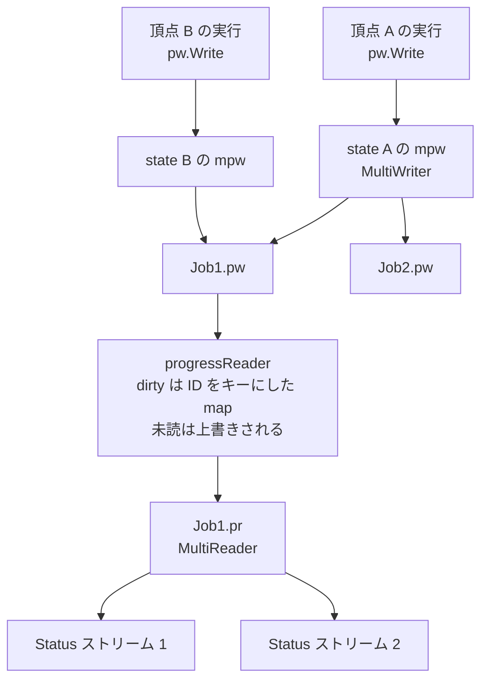

## 何を学んだか

BuildKit の進捗配信は、届かなかった更新を諦める前提で作られている。進捗の 1 単位は `ID` を持ち、購読者がまだ読んでいない同じ ID の更新は、新しいものに**上書きされて消える**。パッケージ冒頭のコメントがそう明言している。

```go title="util/progress/progress.go"
// Progress package provides utility functions for using the context to capture
// progress of a running function. All progress items written contain an ID
// that is used to collapse unread messages.
```

([util/progress/progress.go L14-L16](https://github.com/moby/buildkit/blob/ca4838f8ddbd3612bca94bcb8a938d8a326110a3/util/progress/progress.go#L14-L16))

つまり「どの ID で書くか」が、そのまま「取りこぼしてよいか」の宣言になっている。レイヤのダウンロード進捗は毎回同じ ID で書かれるので古い値は捨てられ、実行ログの 1 行 1 行は毎回新しい ID で書かれるので捨てられない。この 1 つの選択で、進捗は帯域に応じて劣化し、ログは劣化しない。

## 未読を溜める場所は map である

受け側の `progressReader` は、未読の進捗をスライスではなく `map[string]*Progress` で持つ。

```go title="util/progress/progress.go"
type progressReader struct {
	ctx     context.Context
	cond    *sync.Cond
	mu      sync.Mutex
	writers map[*progressWriter]struct{}
	dirty   map[string]*Progress
}
```

([util/progress/progress.go L110-L116](https://github.com/moby/buildkit/blob/ca4838f8ddbd3612bca94bcb8a938d8a326110a3/util/progress/progress.go#L110-L116))

書き込みは、この map への代入 1 行と `cond.Broadcast()` だけだ。チャネルへの送信ではないのでブロックしない。

```go title="util/progress/progress.go"
func (pw *progressWriter) writeRawProgress(p *Progress) error {
	pw.reader.mu.Lock()
	pw.reader.dirty[p.ID] = p
	pw.reader.cond.Broadcast()
	pw.reader.mu.Unlock()
	return nil
}
```

([util/progress/progress.go L241-L247](https://github.com/moby/buildkit/blob/ca4838f8ddbd3612bca94bcb8a938d8a326110a3/util/progress/progress.go#L241-L247))

読み側は `dirty` を丸ごと引き取って空の map に差し替え、タイムスタンプ順に並べて返す。

```go title="util/progress/progress.go"
		dmap := pr.dirty
		// ...
		pr.dirty = make(map[string]*Progress)
		pr.mu.Unlock()

		out := make([]*Progress, 0, len(dmap))
		for _, p := range dmap {
			out = append(out, p)
		}
		slices.SortFunc(out, func(a, b *Progress) int {
			return a.Timestamp.Compare(b.Timestamp)
		})
```

([util/progress/progress.go L148-L172](https://github.com/moby/buildkit/blob/ca4838f8ddbd3612bca94bcb8a938d8a326110a3/util/progress/progress.go#L148-L172))

生産側にバックプレッシャがかからない代わりに、購読が 1 秒止まればその 1 秒に起きた同じ ID の更新は最後の 1 個しか残らない。

典型例がイメージ pull のバイトカウンタで、150ms ごとに containerd の ingest 状態を読み、**descriptor の digest を ID にして**書き込む。

```go title="util/pull/pullprogress/progress.go"
	ticker := time.NewTicker(150 * time.Millisecond)
	// ...
			pw.Write(desc.Digest.String(), progress.Status{
				Current: int(status.Offset),
				Total:   int(status.Total),
				Started: &started,
			})
```

([util/pull/pullprogress/progress.go L94-L124](https://github.com/moby/buildkit/blob/ca4838f8ddbd3612bca94bcb8a938d8a326110a3/util/pull/pullprogress/progress.go#L94-L124))

頂点の開始と完了も同じで、`notifyStarted` が採番した 1 個の ID を開始時と完了時の両方で使い回す。完了が先に読まれれば、その頂点の「実行中」という状態はクライアントに一度も届かない。

```go title="solver/jobs.go"
func notifyStarted(ctx context.Context, v *client.Vertex, cached bool) func(err error, cached bool) {
	pw, _, _ := progress.NewFromContext(ctx)
	start := time.Now()
	v.Started = &start
	// ...
	id := identity.NewID()
	pw.Write(id, *v)
	return func(err error, cached bool) {
		// ...
		pw.Write(id, *v)
	}
}
```

([solver/jobs.go L1368-L1388](https://github.com/moby/buildkit/blob/ca4838f8ddbd3612bca94bcb8a938d8a326110a3/solver/jobs.go#L1368-L1388))

## ジョブごとに枝分かれする

進捗は頂点から出て、ジョブごとに分かれてクライアントへ届く。分岐点は `state` が持つ `MultiWriter` だ。

```go title="solver/jobs.go"
			mpw:          progress.NewMultiWriter(progress.WithMetadata("vertex", dgst)),
```

([solver/jobs.go L583](https://github.com/moby/buildkit/blob/ca4838f8ddbd3612bca94bcb8a938d8a326110a3/solver/jobs.go#L583))

`WithMetadata("vertex", dgst)` がここで効く。個々の書き手は自分がどの頂点にいるかを知らずに `progress.Status` や `client.VertexLog` を書くだけで、頂点 digest はメタデータとして後から合流させられる。読み側の `Job.Status` はこのメタデータを見て、頂点の分からない進捗を捨てる。

```go title="solver/progress.go"
			case progress.Status:
				vtx, ok := p.Meta("vertex")
				if !ok {
					bklog.G(ctx).Warnf("progress %s status without vertex info", p.ID)
					continue
				}
```

([solver/progress.go L41-L46](https://github.com/moby/buildkit/blob/ca4838f8ddbd3612bca94bcb8a938d8a326110a3/solver/progress.go#L41-L46))

同じ頂点が複数ジョブから参照されたとき ([ジョブの共有と破棄](../job-sharing/))、`connectProgressFromState` がその頂点の `mpw` に各ジョブの writer を足していく。しかも親をたどって再帰する — 上流の頂点の進捗も、下流を要求したジョブに流れなければならないからだ。

```go title="solver/jobs.go"
func (jl *Solver) connectProgressFromState(target, src *state) {
	for j := range src.jobs {
		// ...
		if _, ok := target.allPw[pw]; !ok {
			target.mpw.Add(pw)
			target.allPw[pw] = struct{}{}
			pw.Write(identity.NewID(), target.clientVertex)
			// ...
		}
	}
	for p := range src.parents {
		jl.connectProgressFromState(target, jl.actives[p])
	}
}
```

([solver/jobs.go L665-L684](https://github.com/moby/buildkit/blob/ca4838f8ddbd3612bca94bcb8a938d8a326110a3/solver/jobs.go#L665-L684))

`MultiWriter.Add` は、後から加わった writer に**それまでの全 item を時刻順で再生**する。edge がマージされて既に走っている頂点に別ジョブがぶら下がったとき、そのジョブのクライアントにも頂点の開始が見えるのはこのためだ。

```go title="util/progress/multiwriter.go"
	plist := make([]*Progress, 0, len(ps.items))
	plist = append(plist, ps.items...)
	slices.SortFunc(plist, func(a, b *Progress) int {
		return a.Timestamp.Compare(b.Timestamp)
	})
	for _, p := range plist {
		rw.WriteRawProgress(p)
	}
```

([util/progress/multiwriter.go L48-L56](https://github.com/moby/buildkit/blob/ca4838f8ddbd3612bca94bcb8a938d8a326110a3/util/progress/multiwriter.go#L48-L56))

`Add` には自己参照検出も入っている。`MultiWriter` の輪ができるとデッドロックするので、輪を見つけたら黙って壊れるのではなく panic する。コメントは輪の出どころまで名指ししている。

```go title="util/progress/multiwriter.go"
			// this would cause a deadlock, so we should panic instead
			// NOTE: this can be caused by a cycle in the scheduler states,
			// which is created by a series of unfortunate edge merges
			panic("multiwriter loop detected")
```

([util/progress/multiwriter.go L41-L45](https://github.com/moby/buildkit/blob/ca4838f8ddbd3612bca94bcb8a938d8a326110a3/util/progress/multiwriter.go#L41-L45))

ジョブ側の受け口は `MultiReader` で、1 本の reader を複数の `Status` 購読へ再分配する。こちらは既に配った分を `sent` に貯めていて、遅れて来た購読者にはまず履歴を流し込んでから合流させる。

```go title="util/progress/multireader.go"
	isBehind := len(mr.sent) > 0
```

([util/progress/multireader.go L38](https://github.com/moby/buildkit/blob/ca4838f8ddbd3612bca94bcb8a938d8a326110a3/util/progress/multireader.go#L38))



## キャッシュヒットを上流に塗り直す

`Job.Status` が持つ `vertexStream` は、単なる変換器ではない。頂点の状態を溜めておいて、**後から分かった事実で過去の頂点を書き換える**。

```go title="solver/progress.go"
func (vs *vertexStream) append(v client.Vertex) []*client.Vertex {
	var out []*client.Vertex
	vs.cache[v.Digest] = &v
	if v.Started != nil {
		for _, inp := range v.Inputs {
			if inpv, ok := vs.cache[inp]; ok {
				if !inpv.Cached && inpv.Completed == nil {
					inpv.Cached = true
					inpv.Started = v.Started
					inpv.Completed = v.Started
					out = append(out, vs.append(*inpv)...)
					delete(vs.cache, inp)
				}
			}
		}
	}
	if v.Cached {
		vs.markCached(v.Digest)
	}
	// ...
}
```

([solver/progress.go L110-L132](https://github.com/moby/buildkit/blob/ca4838f8ddbd3612bca94bcb8a938d8a326110a3/solver/progress.go#L110-L132))

理屈はこうだ。ある頂点が「開始した」ということは、その入力はもう揃っている。にもかかわらず入力側の頂点が「開始したが完了していない」まま残っているなら、それは実行されずにキャッシュから取れたということだ。だから `Cached = true` を立て、開始時刻と完了時刻を下流の開始時刻に揃えて再送する。solver 側には「この頂点はキャッシュヒットだった」を明示的に上流へ伝播させる経路がなく、進捗ストリームの側で推論している。

さらに `markCached` は、キャッシュヒットした頂点から入力方向へ再帰して `wasCached` に印を付ける。この印は最後の `encore` で使われる。ジョブが途中で終わったとき、開始したまま完了していない頂点をすべて閉じるのだが、キャッシュ扱いになったことがない頂点にだけ `context.Canceled` を入れる。

```go title="solver/progress.go"
func (vs *vertexStream) encore() []*client.Vertex {
	var out []*client.Vertex
	for _, v := range vs.cache {
		if v.Started != nil && v.Completed == nil {
			now := time.Now()
			v.Completed = &now
			if _, ok := vs.wasCached[v.Digest]; !ok && v.Error == "" {
				v.Error = context.Canceled.Error()
			}
			out = append(out, v)
		}
	}
	return out
}
```

([solver/progress.go L145-L157](https://github.com/moby/buildkit/blob/ca4838f8ddbd3612bca94bcb8a938d8a326110a3/solver/progress.go#L145-L157))

## ログは ID では捨てない — 代わりにサイズと速度で切る

実行ログは毎回新しい ID で書かれるので、`dirty` map で潰れることがない。

```go title="util/progress/logs/logs.go"
	sw.pw.Write(identity.NewID(), client.VertexLog{
		Stream: sw.stream,
		Data:   dt,
	})
```

([util/progress/logs/logs.go L141-L144](https://github.com/moby/buildkit/blob/ca4838f8ddbd3612bca94bcb8a938d8a326110a3/util/progress/logs/logs.go#L141-L144))

潰れないということは、暴走した `RUN` がデーモンとクライアントを埋め尽くせるということでもある。そこで別の切り方が入る。合計サイズの上限と、**経過秒数に比例して伸びる上限** (実質的な速度制限) の小さい方でクリップする。

```go title="util/progress/logs/logs.go"
var defaultMaxLogSize = 2 * 1024 * 1024
var defaultMaxLogSpeed = 200 * 1024 // per second
```

([util/progress/logs/logs.go L22-L23](https://github.com/moby/buildkit/blob/ca4838f8ddbd3612bca94bcb8a938d8a326110a3/util/progress/logs/logs.go#L22-L23))

```go title="util/progress/logs/logs.go"
	maxSize := -1
	if defaultMaxLogSpeed != -1 {
		maxSize = int(math.Ceil(time.Since(sw.created).Seconds())) * defaultMaxLogSpeed
		sw.clipReasonSpeed = true
	}
	if maxSize == -1 || maxSize > defaultMaxLogSize {
		maxSize = defaultMaxLogSize
		sw.clipReasonSpeed = false
	}
```

([util/progress/logs/logs.go L77-L85](https://github.com/moby/buildkit/blob/ca4838f8ddbd3612bca94bcb8a938d8a326110a3/util/progress/logs/logs.go#L77-L85))

速度でクリップしている間だけ 256KiB の circular buffer に退避しておき、ストリームを閉じるときに `flushBuffer` で末尾を吐く。途中は落とすが末尾は残す、という割り切りだ。上限は `BUILDKIT_STEP_LOG_MAX_SIZE` と `BUILDKIT_STEP_LOG_MAX_SPEED` で変えられ、`-1` で無効化できる。

最後に gRPC のメッセージ境界でももう 1 回切られる。`SolveStatus.Marshal` はログが 1MiB を超えたところで打ち切り、残りを次の `StatusResponse` に回す。

```go title="client/status.go"
			logSize += len(v.Data) + emptyLogVertexSize
			// avoid logs growing big and split apart if they do
			if logSize > 1024*1024 {
				ss.Vertexes = nil
				ss.Statuses = nil
				ss.Logs = ss.Logs[i+1:]
				retry = true
				break
			}
```

([client/status.go L102-L110](https://github.com/moby/buildkit/blob/ca4838f8ddbd3612bca94bcb8a938d8a326110a3/client/status.go#L102-L110))

## なぜそうなっているか

進捗はビルドの成否に影響してはいけない。クライアントがターミナルを止めた、ネットワークが細い、`buildctl` を Ctrl-Z した — どれもビルドを遅らせる理由にはならない。だから書き込みは常にノンブロッキングで、溢れた分は捨てる。同期を取る唯一の道具が `sync.Cond` であって、容量付きチャネルですらないのは、この方針を徹底した結果だ。

そのうえで「捨ててよいもの」と「捨ててはいけないもの」を、追加の型やフラグではなく **ID の付け方**だけで区別している。同じ ID を使い回すと最新の状態だけが残り、毎回新しい ID にすると全部残る。バイトカウンタと頂点の開始/完了は前者、ログ行と警告は後者。`Write(id, value)` という 1 つの API で両方を表現できているのは、`dirty` を map にした結果である。

`vertexStream` が上流を `Cached` に塗る処理が進捗の側にあるのも同じ理由で説明できる。solver の本体はキャッシュヒットを「実行しなかった」としか記録せず、それを頂点の表示状態に変換するのは表示側の仕事になっている。進捗を消しても solver は 1 行も変わらない。

## どう活かすか

- **観測データの配信には、キューではなく最新値の map を検討する。** 進捗・メトリクス・ヘルス状態のように「最新だけ分かればよい」ものをキューで運ぶと、遅い購読者が生産側を止めるか、無限に溜まるかの二択になる。ID をキーにした map で受ければ、どちらも起きずに自然に間引かれる。
- **「取りこぼしてよいか」をデータ側に持たせる。** BuildKit は writer に flag を渡すのではなく、ID の選び方で表現している。呼び出し側が `identity.NewID()` を書いた瞬間に「これは全部届けてほしい」と宣言していることになり、API の面積が増えない。
- **落とさない経路には別の上限を必ず用意する。** ログを潰さないと決めた以上、サイズ・速度・メッセージ長の 3 段で切っている。「間引かない」は「無制限」ではない。
- **導出できる状態は、書き込み側ではなく読み出し側で計算してよい。** 「入力がキャッシュヒットだった」は、下流が開始したという事実から導ける。これを solver 本体に持たせるとキャッシュの状態管理が進捗の都合で汚れる。導出を表示側に閉じ込めると、表示を丸ごと差し替えても本体は無傷で済む。
