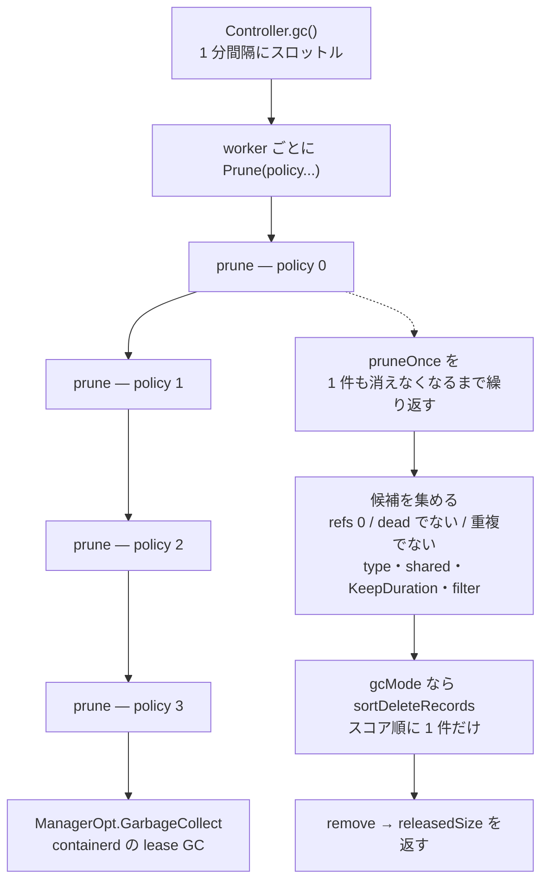

## 何を学んだか

BuildKit のキャッシュ GC は、単一のしきい値ではなく **ポリシーの配列** で表現される。各ポリシーは「どのレコードを対象にするか (filter / All)」「いつまで残すか (KeepDuration)」「どこまで使ってよいか (ReservedSpace / MaxUsedSpace / MinFreeSpace)」の 3 つを持ち、配列の先頭から順に適用される。先のポリシーほど条件が狭く、捨てても復元しやすいものだけを狙う。それでディスクが足りなければ、後のポリシーが範囲を広げる。

1 つのポリシーの中では、削除候補を「最終使用時刻」と「使用回数」の 2 軸で順位づけし、両者の正規化順位の和が小さいものから消す。単純な LRU ではない。

## 3 層の構造



`Prune` は与えられたポリシーを順に適用し、最後に下位層の GC を回す。

```go title="cache/manager.go"
func (cm *cacheManager) Prune(ctx context.Context, ch chan client.UsageInfo, opts ...client.PruneInfo) error {
	cm.muPrune.Lock()

	for _, opt := range opts {
		if err := cm.prune(ctx, ch, opt); err != nil {
			cm.muPrune.Unlock()
			return err
		}
	}

	cm.muPrune.Unlock()

	if cm.GarbageCollect != nil {
		if _, err := cm.GarbageCollect(ctx); err != nil {
			return err
		}
	}

	return nil
}
```

([cache/manager.go L1015-L1034](https://github.com/moby/buildkit/blob/ca4838f8ddbd3612bca94bcb8a938d8a326110a3/cache/manager.go#L1015-L1034))

`muPrune` で並列 prune を禁じている。コメントいわく "make sure parallel prune is not allowed so there will not be inconsistent results" ([cache/manager.go L104](https://github.com/moby/buildkit/blob/ca4838f8ddbd3612bca94bcb8a938d8a326110a3/cache/manager.go#L104))。空き容量を見ながら消す処理なので、同時に走ると両方が「まだ足りない」と判断して消しすぎる。

呼び出し元はデーモンの定期 GC だ。

```go title="control/control.go"
	for _, w := range workers {
		eg.Go(func() error {
			if policy := w.GCPolicy(); len(policy) > 0 {
				return w.Prune(ctx, ch, policy...)
			}
			return nil
		})
	}
```

([control/control.go L699-L706](https://github.com/moby/buildkit/blob/ca4838f8ddbd3612bca94bcb8a938d8a326110a3/control/control.go#L699-L706))

`c.gc` は `throttle.After(time.Minute, c.gc)` でくるまれ、`Solve` の呼び出しごとに `time.AfterFunc(time.Second, c.throttledGC)` が仕掛けられる ([control/control.go L143](https://github.com/moby/buildkit/blob/ca4838f8ddbd3612bca94bcb8a938d8a326110a3/control/control.go#L143), [L428-L430](https://github.com/moby/buildkit/blob/ca4838f8ddbd3612bca94bcb8a938d8a326110a3/control/control.go#L428-L430))。ビルドが終わるたびに GC を要求するが、実際に走るのは 1 分に 1 回まで。

## デフォルトの 4 ポリシー

```go title="cmd/buildkitd/config/gcpolicy.go"
	return []GCPolicy{
		// if build cache uses more than 512MB delete the most easily reproducible data after it has not been used for 2 days
		{
			Filters:      []string{"type==source.local", "type==exec.cachemount", "type==source.git.checkout"},
			KeepDuration: Duration{Duration: time.Duration(48) * time.Hour}, // 48h
			MaxUsedSpace: DiskSpace{Bytes: 512 * 1e6},                       // 512MB
		},
		// remove any data not used for 60 days
		{
			KeepDuration:  Duration{Duration: time.Duration(60) * 24 * time.Hour}, // 60d
			MinFreeSpace:  cfg.GCMinFreeSpace,
			ReservedSpace: cfg.GCReservedSpace,
			MaxUsedSpace:  cfg.GCMaxUsedSpace,
		},
		// keep the unshared build cache under cap
		{
			MinFreeSpace:  cfg.GCMinFreeSpace,
			ReservedSpace: cfg.GCReservedSpace,
			MaxUsedSpace:  cfg.GCMaxUsedSpace,
		},
		// if previous policies were insufficient start deleting internal data to keep build cache under cap
		{
			All:           true,
			MinFreeSpace:  cfg.GCMinFreeSpace,
			ReservedSpace: cfg.GCReservedSpace,
			MaxUsedSpace:  cfg.GCMaxUsedSpace,
		},
	}
```

([cmd/buildkitd/config/gcpolicy.go L71-L101](https://github.com/moby/buildkit/blob/ca4838f8ddbd3612bca94bcb8a938d8a326110a3/cmd/buildkitd/config/gcpolicy.go#L71-L101))

コメントが階層の意図をそのまま述べている。

1. **再現しやすいものを先に。** ローカルコンテキストのコピー、`RUN --mount=type=cache` のキャッシュマウント、git チェックアウト。どれも捨てても再取得が安いか、そもそもローカルにある。しきい値も 512MB と低く、2 日使っていなければ落とす
2. **60 日使っていないものは何であれ落とす。** 時間による無条件の掃除
3. **共有されていないビルドキャッシュを容量上限に収める。** filter が無いので通常のレコード全般が対象。ただし `All` が false なので internal / frontend / shared は除外される
4. **それでも足りなければ内部データも消す。** `All: true`

`All` の効きどころは候補選別の中にある。

```go title="cache/manager.go"
			if !opt.all {
				if recordType == client.UsageRecordTypeInternal || recordType == client.UsageRecordTypeFrontend || shared {
					cr.mu.Unlock()
					continue
				}
			}
```

([cache/manager.go L1159-L1164](https://github.com/moby/buildkit/blob/ca4838f8ddbd3612bca94bcb8a938d8a326110a3/cache/manager.go#L1159-L1164))

`shared` は `ExternalRefChecker` に問い合わせた結果で、「そのレイヤが BuildKit の外 (containerd のイメージなど) からも参照されているか」を意味する。共有されているレイヤを消しても、実体は他の参照が生かしているのでディスクは減らない。だから最後のポリシーまで手を付けない。

## 容量の 3 つのつまみ

`ReservedSpace` / `MaxUsedSpace` / `MinFreeSpace` は 1 個の内部値 `keepBytes` に畳まれる。

```go title="cache/manager.go"
func calculateKeepBytes(totalSize int64, dstat disk.DiskStat, opt client.PruneInfo) int64 {
	// 0 values are special, and means we have no keep cap
	if opt.MaxUsedSpace == 0 && opt.ReservedSpace == 0 && opt.MinFreeSpace == 0 {
		return 0
	}

	// try and keep as many bytes as we can
	keepBytes := opt.MaxUsedSpace

	// if we need to free up space, then decrease to that
	if excess := opt.MinFreeSpace - dstat.Free; excess > 0 {
		if keepBytes == 0 {
			keepBytes = totalSize - excess
		} else {
			keepBytes = min(keepBytes, totalSize-excess)
		}
	} else if opt.MinFreeSpace != 0 && keepBytes == 0 {
		// if only minFreeSpace is set and it doesn't match then we don't delete anything
		keepBytes = totalSize
	}

	// but make sure we don't take the total below the reserved space
	keepBytes = max(keepBytes, opt.ReservedSpace)

	return keepBytes
}
```

([cache/manager.go L1090-L1115](https://github.com/moby/buildkit/blob/ca4838f8ddbd3612bca94bcb8a938d8a326110a3/cache/manager.go#L1090-L1115))

読み方はこうなる。

- `MaxUsedSpace` — キャッシュが使ってよい上限。これが `keepBytes` の出発点
- `MinFreeSpace` — ディスク全体の空きの目標。足りない分 (`excess`) だけ `keepBytes` を下げる。つまり「他のプロセスがディスクを食っているなら、キャッシュ側が譲る」
- `ReservedSpace` — キャッシュに保証する下限。どれだけディスクが逼迫していても、ここより下には削らない

3 つとも 0 なら `keepBytes` は 0 で、容量による削除は起きない (その場合、そのポリシーでは `KeepDuration` と filter だけが効く)。デフォルト値はディスクサイズから推定される ([cmd/buildkitd/config/gcpolicy.go L114-L131](https://github.com/moby/buildkit/blob/ca4838f8ddbd3612bca94bcb8a938d8a326110a3/cmd/buildkitd/config/gcpolicy.go#L114-L131))。設定ファイルでは `"30%"` のようなパーセント指定と `"10GB"` のようなバイト指定の両方が書け、`DiskSpace.UnmarshalText` が振り分ける ([cmd/buildkitd/config/gcpolicy.go L45-L66](https://github.com/moby/buildkit/blob/ca4838f8ddbd3612bca94bcb8a938d8a326110a3/cmd/buildkitd/config/gcpolicy.go#L45-L66))。

`totalSize` の計算で shared なレコードを除いている点も重要だ。

```go title="cache/manager.go"
		for _, ui := range du {
			if ui.Shared {
				continue
			}
			totalSize += ui.Size
		}
```

([cache/manager.go L1058-L1063](https://github.com/moby/buildkit/blob/ca4838f8ddbd3612bca94bcb8a938d8a326110a3/cache/manager.go#L1058-L1063))

共有レイヤを消してもディスクは減らないので、「BuildKit が占めている量」の計算にも入れない。

## 候補の選別

`pruneOnce` の前半が候補集めだ。順に見ていく。

```go title="cache/manager.go"
	if opt.keepBytes != 0 && opt.totalSize < opt.keepBytes {
		return 0, 0, nil
	}
```

([cache/manager.go L1117-L1120](https://github.com/moby/buildkit/blob/ca4838f8ddbd3612bca94bcb8a938d8a326110a3/cache/manager.go#L1117-L1120))

まず容量に余裕があれば即座に終わる。ただし `keepBytes == 0` (容量制限なし) のポリシーはここを通過するので、`KeepDuration` や filter だけによる削除が走る。

続いてレコードを一巡する。除外条件は 3 段。

```go title="cache/manager.go"
		// ignore duplicates that share data
		if cr.equalImmutable != nil && len(cr.equalImmutable.refs) > 0 || cr.equalMutable != nil && len(cr.refs) == 0 {
			cr.mu.Unlock()
			continue
		}

		if cr.isDead() {
			cr.mu.Unlock()
			continue
		}

		if len(cr.refs) == 0 {
```

([cache/manager.go L1137-L1148](https://github.com/moby/buildkit/blob/ca4838f8ddbd3612bca94bcb8a938d8a326110a3/cache/manager.go#L1137-L1148))

同じデータを指す 2 レコードのうち片方を飛ばす ([cacheRecord と 2 種類の ref](../cache-record-refs/))。すでに削除マークが付いているものを飛ばす。誰かが掴んでいるものを飛ばす ([参照カウントの集合](../refcount-set/))。

そのうえで、`All` でなければ internal / frontend / shared を除外し、`KeepDuration` を見る。

```go title="cache/manager.go"
			if opt.keepDuration != 0 {
				if lastUsedAt != nil && lastUsedAt.After(cutOff) {
					cr.mu.Unlock()
					continue
				}
			}

			if opt.filter.Match(adaptUsageInfo(c)) {
				toDelete = append(toDelete, &deleteRecord{
					cacheRecord: cr,
					lastUsedAt:  c.LastUsedAt,
					usageCount:  c.UsageCount,
				})
				locked[cr.mu] = struct{}{}
				continue // leave the record locked
			}
```

([cache/manager.go L1178-L1194](https://github.com/moby/buildkit/blob/ca4838f8ddbd3612bca94bcb8a938d8a326110a3/cache/manager.go#L1178-L1194))

`lastUsedAt == nil` (一度も使われていない) は cutOff 判定を素通りして候補になる。

最後の filter は containerd の filter 式で、`adaptUsageInfo` が対応するフィールドを提供する。使えるのは `id` / `parents` / `description` / `inuse` / `mutable` / `immutable` / `type` / `shared` / `private` の 9 個 ([cache/manager.go L1634-L1665](https://github.com/moby/buildkit/blob/ca4838f8ddbd3612bca94bcb8a938d8a326110a3/cache/manager.go#L1634-L1665))。デフォルトポリシー 1 の `type==source.local` はここに当たる。数値や日時の比較は未対応で、`// TODO: add int/datetime/bytes support for more fields` のコメントが残っている。だから「サイズが N 以上のものを」といった指定は filter では書けない。

候補になったレコードは、ロックを保持したままリストに積まれる (`continue // leave the record locked`)。`locked` マップに `cr.mu` を入れているのは、データを共有するレコードが同じミューテックスを持つため、同じロックを二度取りに行かないようにするためだ。

## スコアリング — 何を先に捨てるか

容量を理由に削るモード (`gcMode = opt.keepBytes != 0`) では、一度に 1 件しか消さない。

```go title="cache/manager.go"
	batchSize := len(toDelete)
	if gcMode && len(toDelete) > 0 {
		batchSize = 1
		sortDeleteRecords(toDelete)
	} else if batchSize > maxPruneBatch {
		batchSize = maxPruneBatch
	}
```

([cache/manager.go L1198-L1204](https://github.com/moby/buildkit/blob/ca4838f8ddbd3612bca94bcb8a938d8a326110a3/cache/manager.go#L1198-L1204))

`prune` は「1 件も消えなくなるまで `pruneOnce` を繰り返し、消えたぶんを `totalSize` から引く」ループなので ([cache/manager.go L1081-L1087](https://github.com/moby/buildkit/blob/ca4838f8ddbd3612bca94bcb8a938d8a326110a3/cache/manager.go#L1081-L1087))、1 件ずつ消して毎回容量を測り直すことになる。目標を下回った時点で次の `pruneOnce` が即 return するので、消しすぎない。

一方、容量が理由でない削除 (期限切れ、filter 一致) は消す量が確定しているので、`maxPruneBatch = 10` 件ずつまとめる。マネージャのロックを長く握らないための上限だ ([cache/manager.go L45](https://github.com/moby/buildkit/blob/ca4838f8ddbd3612bca94bcb8a938d8a326110a3/cache/manager.go#L45))。

順位づけは 2 軸の正規化順位の和になっている。

```go title="cache/manager.go"
func sortDeleteRecords(toDelete []*deleteRecord) {
	slices.SortFunc(toDelete, func(a, b *deleteRecord) int {
		if a.lastUsedAt == nil {
			return -1
		}
		if b.lastUsedAt == nil {
			return 1
		}
		return a.lastUsedAt.Compare(*b.lastUsedAt)
	})

	maxLastUsedIndex := 1.0
	var val time.Time
	for _, v := range toDelete {
		if v.lastUsedAt != nil && v.lastUsedAt.After(val) {
			val = *v.lastUsedAt
			maxLastUsedIndex++
		}
		v.lastUsedAtIndex = maxLastUsedIndex
	}

	// ... 使用回数でも同様に usageCountIndex を振る ...

	slices.SortFunc(toDelete, func(a, b *deleteRecord) int {
		return cmp.Compare(
			a.lastUsedAtIndex/maxLastUsedIndex+a.usageCountIndex/maxUsageCountIndex,
			b.lastUsedAtIndex/maxLastUsedIndex+b.usageCountIndex/maxUsageCountIndex,
		)
	})
}
```

([cache/manager.go L1686-L1727](https://github.com/moby/buildkit/blob/ca4838f8ddbd3612bca94bcb8a938d8a326110a3/cache/manager.go#L1686-L1727))

手順はこうだ。

1. 最終使用時刻でソートし、**順位**を `lastUsedAtIndex` に振る。同じ時刻のものには同じ順位。未使用 (`nil`) は最小
2. 使用回数でソートし直し、同じ要領で `usageCountIndex` を振る
3. 両方をそれぞれの最大値で割って 0〜1 に正規化し、和の小さい順に並べる

実際の値 (何秒前か、何回か) ではなく順位を使うのが要点だ。時刻と回数は単位が違うので直接足せない。順位に落としてから正規化すると、「候補集合の中での相対的な古さ」と「相対的な使われなさ」を同じ尺度で足せる。外れ値 (1 個だけ 1000 回使われたレコード) がスコア全体を潰さないという性質も付いてくる。

**サイズはスコアに入っていない。** 大きいレコードを優先して消せば早く目標に到達するが、そうはしていない。サイズを入れると「1 回しか使っていない小さなレイヤ」より「毎回使う巨大なベースイメージ」が先に消えかねない。実際にサイズが計算されるのは削除が確定した後で、しかもロックを外してから行われる。

```go title="cache/manager.go"
	// calculate sizes here so that lock does not need to be held for slow process
	for _, cr := range toDelete {
		size := cr.getSize()
		// ...
	}
```

([cache/manager.go L1241-L1252](https://github.com/moby/buildkit/blob/ca4838f8ddbd3612bca94bcb8a938d8a326110a3/cache/manager.go#L1241-L1252))

削除前には、クラッシュ耐性のためにメタデータへ削除マークを書く。

```go title="cache/manager.go"
			cr.dead = true
			// mark metadata as deleted in case we crash before cleanup finished
			if err := cr.queueDeleted(); err != nil {
```

([cache/manager.go L1219-L1222](https://github.com/moby/buildkit/blob/ca4838f8ddbd3612bca94bcb8a938d8a326110a3/cache/manager.go#L1219-L1222))

再起動時に `getRecord` がこのマークを見つけると、そこで実データを消してから not found を返す ([cache/manager.go L486-L492](https://github.com/moby/buildkit/blob/ca4838f8ddbd3612bca94bcb8a938d8a326110a3/cache/manager.go#L486-L492))。

## なぜそうなっているか

単一のしきい値ではなくポリシーの配列にしたのは、「捨てるコスト」がレコードによって桁違いだからだ。ローカルコンテキストのコピーは再取得が数秒で、git チェックアウトも同様。一方、ベースイメージのレイヤはネットワーク越しで、frontend イメージや internal レコードを消せばビルド全体が遅くなる。この差を 1 つのスコア関数に押し込むと、重み付けの調整が効かない。ポリシーの配列にすると「まずこの範囲、次にこの範囲」と段階を宣言でき、しかも設定ファイルでユーザーが差し替えられる ([docs/buildkitd.toml.md](https://github.com/moby/buildkit/blob/ca4838f8ddbd3612bca94bcb8a938d8a326110a3/docs/buildkitd.toml.md))。

各ポリシーが独立して容量目標を持つのも意図的だ。ポリシー 1 の `MaxUsedSpace` は 512MB で、ポリシー 3 のそれはディスクの数十パーセントになる。「再現しやすいデータは少しでも増えたら削る、そうでないものは上限まで許す」という非対称な扱いを、同じ構造で表現している。

`GarbageCollect` を最後に 1 回だけ呼ぶのは、BuildKit のレコード削除がリースの削除でしかないからだ。実際のスナップショットと content の回収は containerd 側の lease GC が行う ([containerd 章](../../containerd/))。ポリシーごとに呼ぶと同じ走査を 4 回することになる。

## どう活かすか

**「何を先に捨てるか」を、コードではなく設定可能なポリシーの列にする。** 段階を宣言的に書けると、しきい値を 1 つ動かすだけで挙動を調整できる。ハードコードした優先度は、運用の現場で必ず合わなくなる。

**容量の制約を「上限・下限・全体の空き」の 3 つに分ける。** BuildKit の `MaxUsedSpace` / `ReservedSpace` / `MinFreeSpace` は、それぞれ「自分の取り分」「絶対に確保する分」「他人への配慮」に対応する。1 つの数値では、ディスクを共有する他のプロセスの都合を表現できない。

**単位の違う指標を混ぜるときは、値ではなく順位を正規化して足す。** 「最後に使った時刻」と「使った回数」は直接比較できない。候補集合の中での順位に落としてから 0〜1 に正規化すれば、重みを決めずに合成できて、外れ値にも強い。

**容量を理由にした削除は 1 件ずつ、それ以外はまとめて。** 目標が「ある量まで減らす」なら、消しすぎないために 1 件ごとに測り直す必要がある。目標が「条件に合うものを全部」なら、ロックを握る時間の方が問題になるので上限付きでまとめる。同じ削除でも、理由によって適切なバッチサイズが違う。

**削除は「マークしてから消す」。** メタデータに削除マークを書いてから実データを消し、起動時にマークを見つけたら後始末する。1 つの削除が複数のストレージ (メタデータ DB、スナップショッタ、content store) にまたがるとき、途中でクラッシュしても孤児が残らない。
