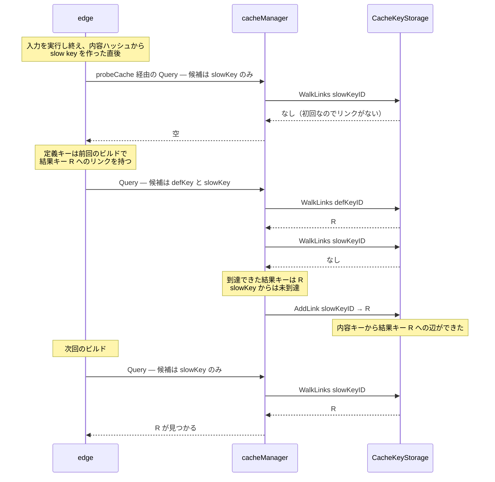

## 何を学んだか

`cacheManager.Query` は名前どおりの検索メソッドではない。**探索の過程でキャッシュストレージに書き込む。**

- 入力の候補キーのうち一部だけが結果キー R に到達したとき、**到達しなかった候補キーからも R へのリンクを張る**。
- `getID` が呼ばれると、合成キーの ID がその場で決まり、`CacheKey.ids` に記録される。ID は探索するまで存在しない。
- `edge` には**返り値を完全に捨てて `Query` を呼ぶ行**がある。副作用だけが目的だ。

「検索が状態を書き換える」というのは普通なら設計の匂いだが、ここでは「キーの ID がストレージの状態から決まる」という設計からの必然になっている。

## Query の後半 — 存在しなかったリンクを埋める

`Query` は 2 つのループでできている。前半は既に見た和集合の探索で、問題は後半だ。

```go title="solver/cachemanager.go"
	// link the results against the keys that didn't exist
	for id, key := range allRes {
		for _, d := range allDeps {
			if _, ok := d.results[id]; !ok {
				if err := c.backend.AddLink(c.getID(d.key.CacheKey.CacheKey), CacheInfoLink{
					Input:    input,
					Output:   output,
					Digest:   dgst,
					Selector: d.key.Selector,
				}, c.getID(key)); err != nil {
					return nil, err
				}
			}
		}
	}
```

([solver/cachemanager.go L113-L127](https://github.com/moby/buildkit/blob/ca4838f8ddbd3612bca94bcb8a938d8a326110a3/solver/cachemanager.go#L113-L127))

`allRes` は「いずれかの候補キーから到達できた結果キー」の集合、`d.results` は「この候補キー `d` から到達できた結果キー」の集合だ。`d.results` に無い `id` があるということは、**候補 `d` からはまだ辺が張られていない結果キーがある**ということになる。そこに辺を足す。

意味を言い換えるとこうなる。**同じ入力について許容されている複数のキーは、同じ結果に到達すべきである。** どれか 1 つが到達できたなら、残りも到達できるようにしておく。

## 典型例 — 定義キーと内容キーを繋ぐ

これが効く場面は `edge` の slow cache 処理にはっきり出ている。

```go title="solver/edge.go"
		if e.cacheMap.Deps[int(dep.index)].ComputeDigestFunc != nil && dgst != "" {
			k := NewCacheKey(dgst, "", -1)
			dep.slowCacheKey = &ExportableCacheKey{CacheKey: k, Exporter: &exporter{k: k}}
			slowKeyExp := CacheKeyWithSelector{CacheKey: *dep.slowCacheKey}
			defKeys := make([]CacheKeyWithSelector, 0, len(dep.result.CacheKeys()))
			for _, dk := range dep.result.CacheKeys() {
				defKeys = append(defKeys, CacheKeyWithSelector{CacheKey: dk, Selector: e.cacheMap.Deps[index].Selector})
			}
			dep.slowCacheFoundKey = e.probeCache(dep, []CacheKeyWithSelector{slowKeyExp})

			// connect def key to slow key
			e.op.Cache().Query(append(defKeys, slowKeyExp), dep.index, e.cacheMap.Digest, e.edge.Index)
		}
```

([solver/edge.go L709-L721](https://github.com/moby/buildkit/blob/ca4838f8ddbd3612bca94bcb8a938d8a326110a3/solver/edge.go#L709-L721))

最後の `Query` は**返り値もエラーも受け取っていない**。コメントは `// connect def key to slow key` とだけ書いてある。

何が起きるかを追う。



定義が変わって定義キーが変わっても、**入力の中身が同じなら slow key は同じ**なので、次回は内容キーだけで R に到達できる。これは fast cache が外れたときに slow cache で拾うという 2 段構えを、グラフに書き込む形で実現している ([fast cache と slow cache](../fast-slow-cache/))。

`probeCache` と `Query` を続けて呼んでいるのも意味がある。先に `probeCache([slowKey])` で「純粋な検索」をして `dep.slowCacheFoundKey` を立て、そのあと副作用目的の `Query` を呼ぶ。順序が逆だと、自分で張ったリンクを自分で見つけて「ヒットした」と誤判定しかねない。

## なぜ ID を先に計算できないか

副作用の根っこは `getID` にある。

```go title="solver/cachemanager.go"
func (c *cacheManager) getID(k *CacheKey) string {
	k.mu.Lock()
	id, ok := k.ids[c]
	if ok {
		k.mu.Unlock()
		return id
	}
	if len(k.deps) == 0 {
		k.ids[c] = k.ID
		k.mu.Unlock()
		return k.ID
	}
	id = c.getIDFromDeps(k)
	k.ids[c] = id
	k.mu.Unlock()
	return id
}
```

([solver/cachemanager.go L368-L384](https://github.com/moby/buildkit/blob/ca4838f8ddbd3612bca94bcb8a938d8a326110a3/solver/cachemanager.go#L368-L384))

`getIDFromDeps` はリンクを辿って既存 ID を探し、無ければ `identity.NewID()` を返す ([solver/cachemanager.go L410-L449](https://github.com/moby/buildkit/blob/ca4838f8ddbd3612bca94bcb8a938d8a326110a3/solver/cachemanager.go#L410-L449))。つまり**合成キーの ID は「ストレージを引いた瞬間」に確定する**。しかも結果は `k.ids[c]` にメモ化される。`getID` は読み出しメソッドの見た目で、キーオブジェクトを変更する。

ここから 2 つのことが従う。

**ID を事前に計算して渡す API にできない。** `Query(id string)` のような形にしようとすると、呼び出し側が ID を計算する必要があり、そのために結局ストレージを引くことになる。

**ID の確定と、その ID へのリンクの記録は同時に行うのが自然になる。** ID が「リンクを辿って見つけた合流点」である以上、新しい経路を見つけたらその場で合流点に繋いでおかないと、次回また別の ID が生まれてしまう。

`Query` が返すキーも、この文脈で作られている。

```go title="solver/cachemanager.go"
func (c *cacheManager) newKeyWithID(id string, dgst digest.Digest, output Index) *CacheKey {
	k := newKey()
	k.digest = dgst
	k.output = output
	k.ID = id
	k.ids[c] = id
	return k
}
```

([solver/cachemanager.go L355-L362](https://github.com/moby/buildkit/blob/ca4838f8ddbd3612bca94bcb8a938d8a326110a3/solver/cachemanager.go#L355-L362))

`ids[c] = id` を先に埋めてあるので、返されたキーに対して `getID` を呼んでも再探索は起きない。`deps` は空のままで、呼び出し側 (`recalcCurrentState`) が後から詰める。

## 書き込むのは Query だけではない

キャッシュマネージャのメソッドは、ほとんどが何かしら書く。

| メソッド              | 見た目   | 実際の副作用                                                          |
| --------------------- | -------- | --------------------------------------------------------------------- |
| `Query`               | 検索     | 未接続の候補キーからリンクを張る、ID を確定してメモ化する             |
| `Records`             | 検索     | 実体が消えている結果を `Release` する                                 |
| `Load`                | 読み出し | `getID` によるメモ化                                                  |
| `Save`                | 書き込み | 結果の保存に加え `ensurePersistentKey` で入力方向のリンクをすべて張る |
| `ReleaseUnreferenced` | 掃除     | 実体のない結果を全走査して削除                                        |

`Records` の掃除はこうなっている。

```go title="solver/cachemanager.go"
	if err := c.backend.WalkResults(c.getID(ck), func(r CacheResult) error {
		if c.results.Exists(ctx, r.ID) {
			outs = append(outs, &CacheRecord{...})
		} else {
			c.backend.Release(r.ID)
		}
		return nil
	}); err != nil {
```

([solver/cachemanager.go L159-L171](https://github.com/moby/buildkit/blob/ca4838f8ddbd3612bca94bcb8a938d8a326110a3/solver/cachemanager.go#L159-L171))

キャッシュのメタデータと実体は別々に GC されるので、メタデータだけが残ることがある。それを検索のついでに落としている。同じ掃除を起動時に一括でもやる。

```go title="solver/cachemanager.go"
func (c *cacheManager) ReleaseUnreferenced(ctx context.Context) error {
	visited := map[string]struct{}{}
	return c.backend.Walk(func(id string) error {
		return c.backend.WalkResults(id, func(cr CacheResult) error {
			if _, ok := visited[cr.ID]; ok {
				return nil
			}
			visited[cr.ID] = struct{}{}
			if !c.results.Exists(ctx, cr.ID) {
				c.backend.Release(cr.ID)
			}
			return nil
		})
	})
}
```

([solver/cachemanager.go L45-L59](https://github.com/moby/buildkit/blob/ca4838f8ddbd3612bca94bcb8a938d8a326110a3/solver/cachemanager.go#L45-L59))

`NewCacheManager` がこれを構築時に呼ぶ ([solver/cachemanager.go L30-L32](https://github.com/moby/buildkit/blob/ca4838f8ddbd3612bca94bcb8a938d8a326110a3/solver/cachemanager.go#L30-L32))。エラーはログに出すだけで、失敗してもマネージャは作られる。掃除は best effort という位置付けになっている。

## 危うさと、それでも成立している理由

副作用のある検索は、普通なら次の点で危ない。

**ロックの粒度が合わない。** `Query` は `c.mu.RLock()` を取る ([solver/cachemanager.go L87-L88](https://github.com/moby/buildkit/blob/ca4838f8ddbd3612bca94bcb8a938d8a326110a3/solver/cachemanager.go#L87-L88))。読み込みロックの下で `AddLink` を呼ぶので、複数の `Query` が並行してストレージに書く。これが破綻しないのは、バックエンド自身が排他を持つからだ。bbolt 実装は `db.Update` でトランザクションを取り ([solver/bboltcachestorage/storage.go L314-L341](https://github.com/moby/buildkit/blob/ca4838f8ddbd3612bca94bcb8a938d8a326110a3/solver/bboltcachestorage/storage.go#L314-L341))、メモリ実装は `s.mu.Lock()` を取る ([solver/memorycachestorage.go L188-L210](https://github.com/moby/buildkit/blob/ca4838f8ddbd3612bca94bcb8a938d8a326110a3/solver/memorycachestorage.go#L188-L210))。`cacheManager` 側の `mu` は `Save` との順序付けのためのもので、ストレージの一貫性はストレージが担保している。

**冪等でないと壊れる。** `AddLink` は集合への追加でしかない。同じ辺を何度足しても結果は変わらないし、順序も効かない。`ensurePersistentKey` が `HasLink` で事前確認するのは正しさのためではなく、無駄な書き込みと再帰を避けるためだ。

**追加しかしないので、意味が壊れない。** `Query` の副作用は辺を**足す**だけで、消したり付け替えたりしない。辺が増えることは「到達できる経路が増える」ことであり、既に成立していた探索結果を無効にしない。逆に言えば、誤った辺を足すと誤ヒットが永続化する。だからこそ「同じ入力の許容キー同士は同じ結果に到達すべき」という前提が正しいかどうかが、この設計の全体重を支えている。

**探索と記録が同じ情報を必要とする。** リンクを張るには「どの候補キーから、どのラベルで、どの結果キーへ」の 3 つが要る。この 3 つが揃っているのは探索の最中だけだ。探索を終えて呼び出し側に戻ってから記録しようとすると、同じ情報を組み立て直すことになる。

## どう活かすか

**「探索の途中でしか分からないこと」は探索の中で記録する。** 探索と記録を分けると、記録に必要な文脈を戻り値で運ぶ設計になり、API が太る。BuildKit は `Query` の返り値を「見つかったキー」だけに保ち、記録は中で済ませた。代わりに「これは純粋な検索ではない」ことを名前とコメントで伝えるコストを払っている。

**副作用のある検索を許すなら、副作用を「単調な追加」に限る。** 足すだけ・冪等・順序非依存、という 3 条件が揃えば、並行に呼んでも、途中でエラーが出て中断しても、状態は壊れない。削除や更新が混ざった瞬間にこの安全性は消える。BuildKit で削除を行うのは `Release` と `ReleaseUnreferenced` だけで、経路は完全に分けてある。

**返り値を捨てる呼び出しには理由をコメントで残す。** `// connect def key to slow key` の 1 行がなければ、`e.op.Cache().Query(...)` は「エラーを握り潰しているバグ」に見える。副作用が目的の呼び出しは、そう書いてないと必ず後から削られる。
