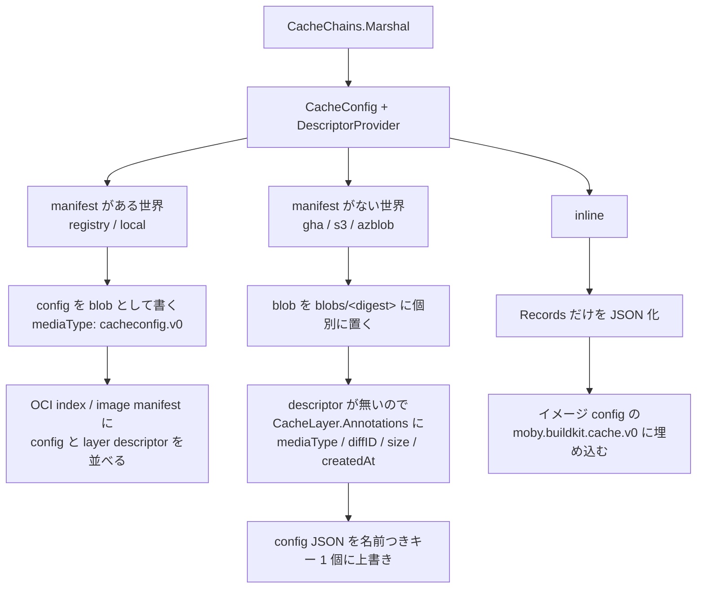

## 何を学んだか

`--export-cache type=...` に指定できるバックエンドは 6 つある。`buildkitd` の起動時にマップとして登録される。

```go title="cmd/buildkitd/main.go"
	remoteCacheExporterFuncs := map[string]remotecache.ResolveCacheExporterFunc{
		"registry": registryremotecache.ResolveCacheExporterFunc(sessionManager, resolverFn),
		"local":    localremotecache.ResolveCacheExporterFunc(sessionManager),
		"inline":   inlineremotecache.ResolveCacheExporterFunc(),
		"gha":      gha.ResolveCacheExporterFunc(cfg.Cache.GHA, verifierProvider),
		"s3":       s3remotecache.ResolveCacheExporterFunc(),
		"azblob":   azblob.ResolveCacheExporterFunc(),
	}
	remoteCacheImporterFuncs := map[string]remotecache.ResolveCacheImporterFunc{
		"registry": registryremotecache.ResolveCacheImporterFunc(sessionManager, w.ContentStore(), resolverFn),
		"local":    localremotecache.ResolveCacheImporterFunc(sessionManager),
		"gha":      gha.ResolveCacheImporterFunc(cfg.Cache.GHA, verifierProvider),
		"s3":       s3remotecache.ResolveCacheImporterFunc(),
		"azblob":   azblob.ResolveCacheImporterFunc(),
	}
```

([cmd/buildkitd/main.go L922-L936](https://github.com/moby/buildkit/blob/ca4838f8ddbd3612bca94bcb8a938d8a326110a3/cmd/buildkitd/main.go#L922-L936))

エクスポータは 6 個、インポータは 5 個。`inline` にインポータが無いのが最初の手がかりだ。

6 つを読み比べると、コードの形を決めているのは 1 つの問いだと分かる。**「config と blob をまとめて指す manifest (OCI index) を置けるか」**。置けるバックエンド (registry / local) は共通の `contentCacheExporter` を使い、レイヤのメタデータを OCI の descriptor に載せる。置けないバックエンド (gha / s3 / azblob) は blob をキーごとにばらばらに置くしかなく、descriptor に載せられないメタデータを **`CacheLayer.Annotations` という spec のフィールドに逃がす**。`inline` はそのどちらでもなく、既存のイメージに寄生する。

## 全バックエンドの共通部分

型の上では 6 つとも `remotecache.Exporter` を実装する。

```go title="cache/remotecache/export.go"
type Exporter interface {
	solver.CacheExporterTarget
	// Name uniquely identifies the exporter
	Name() string
	// Finalize finalizes and return metadata that are returned to the client
	// e.g. ExporterResponseManifestDesc
	Finalize(ctx context.Context) (map[string]string, error)
	Config() Config
}
```

([cache/remotecache/export.go L32-L40](https://github.com/moby/buildkit/blob/ca4838f8ddbd3612bca94bcb8a938d8a326110a3/cache/remotecache/export.go#L32-L40))

`solver.CacheExporterTarget` の部分 (`Add`) は、6 つとも [CacheChains](../cache-chains/) に丸投げしている。実装の差はすべて `Finalize` に入る。`Finalize` の最初の 1 行はどれも同じだ。

```go
	config, descs, err := ce.chains.Marshal(ctx)
```

`CacheConfig` (JSON にする対象) と `DescriptorProvider` (blob を読む口) の 2 つが手に入る。ここから先が二分する。



## manifest がある世界 — registry と local

`registry` と `local` は、どちらも `remotecache.NewExporter` が返す `contentCacheExporter` をそのまま埋め込んでいる。違うのは `content.Ingester` を何にするかだけだ。

```go title="cache/remotecache/registry/registry.go"
		return &exporter{remotecache.NewExporter(contentutil.FromPusher(pusher), refString, ociMediatypes, imageManifest, compressionConfig)}, nil
```

([cache/remotecache/registry/registry.go L99](https://github.com/moby/buildkit/blob/ca4838f8ddbd3612bca94bcb8a938d8a326110a3/cache/remotecache/registry/registry.go#L99))

```go title="cache/remotecache/local/local.go"
		return &exporter{remotecache.NewExporter(cs, "", ociMediatypes, imageManifest, compressionConfig)}, nil
```

([cache/remotecache/local/local.go L70](https://github.com/moby/buildkit/blob/ca4838f8ddbd3612bca94bcb8a938d8a326110a3/cache/remotecache/local/local.go#L70))

registry はレジストリへの pusher、local は**セッション越しにクライアント側の content store** を掴む。`local:` 前綴の store ID でセッションから引く形なので ([cache/remotecache/local/local.go L105-L120](https://github.com/moby/buildkit/blob/ca4838f8ddbd3612bca94bcb8a938d8a326110a3/cache/remotecache/local/local.go#L105-L120))、書き先はデーモンのディスクではなくクライアントのディレクトリだ。詳しくは [セッション](../session-manager/) 群を参照。あとの処理は完全に共有されている。

共有部分では、blob を `images.Dispatch` で並列に push してから、`ExportableCache` に順番どおり積み直す ([cache/remotecache/export.go L214-L232](https://github.com/moby/buildkit/blob/ca4838f8ddbd3612bca94bcb8a938d8a326110a3/cache/remotecache/export.go#L214-L232))。`ExportableCache` は index (manifest list) と image manifest の 2 形態を持ち分ける小さなラッパで、`AddCacheBlob` と `SetConfig` がその差を吸収する。

```go title="cache/remotecache/export.go"
func (ec *ExportableCache) SetConfig(config ocispecs.Descriptor) {
	if ec.CacheType == ManifestList {
		ec.ExportedIndex.Manifests = append(ec.ExportedIndex.Manifests, config)
	} else {
		ec.ExportedManifest.Config = config
	}
}
```

([cache/remotecache/export.go L152-L158](https://github.com/moby/buildkit/blob/ca4838f8ddbd3612bca94bcb8a938d8a326110a3/cache/remotecache/export.go#L152-L158))

index 形式では、config は `manifests` 配列に紛れ込む。レイヤ blob も同じ配列に並ぶ。イメージ index としては明らかに変則的 (manifests にレイヤが直接並ぶ) だが、レジストリは配列の中身のメディアタイプを気にしないので通る。`image-manifest=true` の形式のほうは、config が `config` フィールド、レイヤが `layers` フィールドに入る素直な OCI artifact になる。こちらが既定値で、`oci-mediatypes=false` を指定したときだけ index 形式に落ちる ([cache/remotecache/registry/registry.go L74-L83](https://github.com/moby/buildkit/blob/ca4838f8ddbd3612bca94bcb8a938d8a326110a3/cache/remotecache/registry/registry.go#L74-L83))。

インポート側は、manifest を読んで**メディアタイプで config を選り分ける**。

```go title="cache/remotecache/import.go"
		for _, m := range mfst.Manifests {
			if m.MediaType == cacheimporttypes.CacheConfigMediaTypeV0 {
				configDesc = m
				continue
			}
			allLayers[m.Digest] = v1.DescriptorProviderPair{
				Descriptor: m,
				Provider:   ci.provider,
			}
		}
```

([cache/remotecache/import.go L72-L81](https://github.com/moby/buildkit/blob/ca4838f8ddbd3612bca94bcb8a938d8a326110a3/cache/remotecache/import.go#L72-L81))

ここが manifest を持てることの利益だ。レイヤの `ocispecs.Descriptor` が**そのまま manifest に書いてある**。メディアタイプ、サイズ、annotations (非圧縮ダイジェスト `containerd.io/uncompressed`、`buildkit/createdat`) が丸ごと手に入る。config は「どの blob をどう繋ぐか」だけを言えばよい。

## manifest がない世界 — gha / s3 / azblob

この 3 つはキー・バリューのストアで、複数の blob を束ねる仕組みが無い。だから config を 1 個の名前つきキーに置き、blob はダイジェストをキーにしてばらばらに置く。

```go title="cache/remotecache/s3/s3.go"
func (s3Client *s3Client) manifestKey(name string) string {
	return s3Client.prefix + s3Client.manifestsPrefix + name
}

func (s3Client *s3Client) blobKey(dgst digest.Digest) string {
	return s3Client.prefix + s3Client.blobsPrefix + dgst.String()
}
```

([cache/remotecache/s3/s3.go L663-L669](https://github.com/moby/buildkit/blob/ca4838f8ddbd3612bca94bcb8a938d8a326110a3/cache/remotecache/s3/s3.go#L663-L669))

既定の前綴は `manifests/` と `blobs/` ([cache/remotecache/s3/s3.go L93-L103](https://github.com/moby/buildkit/blob/ca4838f8ddbd3612bca94bcb8a938d8a326110a3/cache/remotecache/s3/s3.go#L93-L103))。azblob もほぼ同じ ([cache/remotecache/azblob/utils.go L165-L173](https://github.com/moby/buildkit/blob/ca4838f8ddbd3612bca94bcb8a938d8a326110a3/cache/remotecache/azblob/utils.go#L165-L173))。gha は GitHub Actions のキャッシュ API なので前綴が文字列に埋め込まれる。

```go title="cache/remotecache/gha/gha.go"
func blobKey(dgst digest.Digest) string {
	return blobKeyPrefix() + dgst.String()
}

// ...

func indexKey(scope string, config *Config) string {
	scope = digest.FromBytes([]byte(scope)).Hex()[:8]
	key := "index-" + config.Scope + "-" + version + "-" + scope
	// just to be sure lets namespace the signed vs unsigned caches
	if config.Sign != nil || config.Verify.Required {
		key += "-sig"
	}
	return key
}
```

([cache/remotecache/gha/gha.go L186-L208](https://github.com/moby/buildkit/blob/ca4838f8ddbd3612bca94bcb8a938d8a326110a3/cache/remotecache/gha/gha.go#L186-L208))

manifest が無いので、レイヤの descriptor をどこにも書けない。ここで `CacheLayer.Annotations` が効いてくる。

```go title="cache/remotecache/v1/types/spec.go"
type LayerAnnotations struct {
	MediaType string        `json:"mediaType,omitempty"`
	DiffID    digest.Digest `json:"diffID,omitempty"`
	Size      int64         `json:"size,omitempty"`
	CreatedAt time.Time     `json:"createdAt"`
}
```

([cache/remotecache/v1/types/spec.go L22-L27](https://github.com/moby/buildkit/blob/ca4838f8ddbd3612bca94bcb8a938d8a326110a3/cache/remotecache/v1/types/spec.go#L22-L27))

これは `ocispecs.Descriptor` から digest を抜いた残りに等しい (digest は `CacheLayer.Blob` にある)。3 つのバックエンドは、`Finalize` の中で descriptor をここに詰め替える。

```go title="cache/remotecache/s3/s3.go"
				la := &cacheimporttypes.LayerAnnotations{
					DiffID:    diffID,
					Size:      dgstPair.Descriptor.Size,
					MediaType: dgstPair.Descriptor.MediaType,
				}
				if v, ok := dgstPair.Descriptor.Annotations["buildkit/createdat"]; ok {
					var t time.Time
					if err := (&t).UnmarshalText([]byte(v)); err != nil {
						return err
					}
					la.CreatedAt = t.UTC()
				}
				cacheConfig.Layers[index].Annotations = la
```

([cache/remotecache/s3/s3.go L307-L319](https://github.com/moby/buildkit/blob/ca4838f8ddbd3612bca94bcb8a938d8a326110a3/cache/remotecache/s3/s3.go#L307-L319))

インポート側では逆向きに、`Annotations` から descriptor を復元する。3 つのバックエンドに `makeDescriptorProviderPair` というほぼ同一の関数があるのはそのためだ。

```go title="cache/remotecache/s3/s3.go"
func (i *importer) makeDescriptorProviderPair(l cacheimporttypes.CacheLayer) (*v1.DescriptorProviderPair, error) {
	if l.Annotations == nil {
		return nil, errors.Errorf("cache layer with missing annotations")
	}
	if l.Annotations.DiffID == "" {
		return nil, errors.Errorf("cache layer with missing diffid")
	}
	annotations := map[string]string{}
	annotations[labels.LabelUncompressed] = l.Annotations.DiffID.String()
	// ...
	return &v1.DescriptorProviderPair{
		Provider: i.s3Client,
		Descriptor: ocispecs.Descriptor{
			MediaType:   l.Annotations.MediaType,
			Digest:      l.Blob,
			Size:        l.Annotations.Size,
			Annotations: annotations,
		},
	}, nil
}
```

([cache/remotecache/s3/s3.go L362-L387](https://github.com/moby/buildkit/blob/ca4838f8ddbd3612bca94bcb8a938d8a326110a3/cache/remotecache/s3/s3.go#L362-L387)、対応する gha 版は [gha.go L455-L480](https://github.com/moby/buildkit/blob/ca4838f8ddbd3612bca94bcb8a938d8a326110a3/cache/remotecache/gha/gha.go#L455-L480)、azblob 版は [importer.go L146-L172](https://github.com/moby/buildkit/blob/ca4838f8ddbd3612bca94bcb8a938d8a326110a3/cache/remotecache/azblob/importer.go#L146-L172))

`Annotations` が無い config は読めない。registry 由来の config はこのフィールドを埋めていないので、**registry に書いたキャッシュを s3 のインポータで読むことはできない**。同じ `CacheConfig` 型を共有していても、互換性はバックエンドの世界の中で閉じている。

インタフェースの形にもこの二分が現れている。`ResolveCacheImporterFunc` は `(Importer, ocispecs.Descriptor, error)` を返すが、gha / s3 / azblob は空の `ocispecs.Descriptor{}` を返し、`Resolve` の第 1 引数も `_` で捨てている ([cache/remotecache/azblob/importer.go L31-L50](https://github.com/moby/buildkit/blob/ca4838f8ddbd3612bca94bcb8a938d8a326110a3/cache/remotecache/azblob/importer.go#L31-L50))。この API は「タグを解決すると manifest の descriptor が得られる」という registry の世界を前提に作られていて、後から来た 3 つはその枠に入っていない。

manifest が無い側にだけ現れる工夫もある。

- **複数の名前**。s3 / azblob は `Names` を持ち、同じ config を複数のキーに書く ([cache/remotecache/s3/s3.go L334-L338](https://github.com/moby/buildkit/blob/ca4838f8ddbd3612bca94bcb8a938d8a326110a3/cache/remotecache/s3/s3.go#L334-L338))。インポート時は名前ごとに `CacheChains` を作り、`NewCombinedCacheManager` で束ねる。レジストリならタグで済む話をキーの複製でやっている
- **存在チェックしてから上げる**。blob は content-addressable なので、既にあればアップロードを飛ばせる。azblob のコメントがその判断を明記している ([cache/remotecache/azblob/exporter.go L168-L171](https://github.com/moby/buildkit/blob/ca4838f8ddbd3612bca94bcb8a938d8a326110a3/cache/remotecache/azblob/exporter.go#L168-L171))。逆に config は「最後に書いた者が勝つ」上書きになる
- **触って寿命を延ばす**。s3 は `touch_refresh` を持ち、既存 blob の最終更新時刻が古ければコピーし直す ([cache/remotecache/s3/s3.go L284-L290](https://github.com/moby/buildkit/blob/ca4838f8ddbd3612bca94bcb8a938d8a326110a3/cache/remotecache/s3/s3.go#L284-L290))。ライフサイクルルールでの自動削除を避けるためで、レジストリの GC には無い発想だ
- **署名**。gha は config JSON に外部コマンドで署名を付け、`<digest>-sig` というキーに置ける。インポート時に `Verify.Required` なら検証してから parse する ([cache/remotecache/gha/gha.go L501-L525](https://github.com/moby/buildkit/blob/ca4838f8ddbd3612bca94bcb8a938d8a326110a3/cache/remotecache/gha/gha.go#L501-L525))。共有 CI キャッシュという書き込み権限の緩い置き場に対する防御である

gha はさらに「スコープ」の概念を持つ。GitHub Actions のキャッシュはブランチごとに読める範囲が違うので、読み込み可能なスコープすべてから index を並列に読み、それぞれ `CacheChains` にして結合する ([cache/remotecache/gha/gha.go L550-L580](https://github.com/moby/buildkit/blob/ca4838f8ddbd3612bca94bcb8a938d8a326110a3/cache/remotecache/gha/gha.go#L550-L580))。書き込みは write 権限のあるスコープ 1 つだけだ。

## inline — 第 3 の形

`inline` は独自の置き場所を持たない。**出力するイメージの config にキャッシュ情報を埋め込む。** そのため solver 側で特別扱いされている。

```go title="solver/llbsolver/export.go"
type inlineCacheExporter interface {
	solver.CacheExporterTarget
	ExportForLayers(context.Context, []digest.Digest) ([]byte, error)
}
```

([solver/llbsolver/export.go L276-L279](https://github.com/moby/buildkit/blob/ca4838f8ddbd3612bca94bcb8a938d8a326110a3/solver/llbsolver/export.go#L276-L279))

`splitCacheExporters` がこの型アサーションで `inline` を拾い出し、他のエクスポータの列から抜く ([solver/llbsolver/export.go L264-L274](https://github.com/moby/buildkit/blob/ca4838f8ddbd3612bca94bcb8a938d8a326110a3/solver/llbsolver/export.go#L264-L274))。`Finalize` は空を返すだけで何もしない ([cache/remotecache/inline/inline.go L46-L48](https://github.com/moby/buildkit/blob/ca4838f8ddbd3612bca94bcb8a938d8a326110a3/cache/remotecache/inline/inline.go#L46-L48))。代わりに、イメージエクスポータが「このイメージのレイヤはこれです」と `ExportForLayers` を呼ぶ。

やることは 2 つある。1 つは、config の `Layers` を捨てて `json.Marshal(cfg.Records)` だけを出力すること ([cache/remotecache/inline/inline.go L149](https://github.com/moby/buildkit/blob/ca4838f8ddbd3612bca94bcb8a938d8a326110a3/cache/remotecache/inline/inline.go#L149))。レイヤ配列が要らないのは、**イメージの manifest がその役割を兼ねる**からだ。もう 1 つは、レイヤ添字をイメージのレイヤ順に合わせて書き換えること。順序が一致すれば `CacheResult.LayerIndex` を「最上位レイヤの添字」に直せるが、一致しない場合は `ChainedResult` に切り替える。

```go title="cache/remotecache/inline/inline.go"
			if match {
				// The layers of the result are in the same order as the image, so we can
				// specify it just using the CacheResult struct and specifying LayerIndex
				// as the top-most layer of the result.
				rr.LayerIndex = len(resultBlobs) - 1
				r.Results[j] = rr
			} else {
				// The layers of the result are not in the same order as the image, so we
				// have to use ChainedResult to specify each layer of the result individually.
				chainedResult := cacheimporttypes.ChainedResult{}
```

([cache/remotecache/inline/inline.go L117-L126](https://github.com/moby/buildkit/blob/ca4838f8ddbd3612bca94bcb8a938d8a326110a3/cache/remotecache/inline/inline.go#L117-L126))

`ChainedResult` (`"chains"`) が spec に存在する理由がこれだ。通常の `CacheResult` は「このレイヤとその全祖先」を意味するので親子関係に乗っている必要があるが、`ChainedResult` は「この添字のレイヤを、この順で、親を辿らずに積む」を意味する ([cache/remotecache/v1/types/doc.go L33-L44](https://github.com/moby/buildkit/blob/ca4838f8ddbd3612bca94bcb8a938d8a326110a3/cache/remotecache/v1/types/doc.go#L33-L44))。イメージのレイヤ順に押し込むための逃げ道である。

インポート側は独立していない。`inline` にインポータが登録されていないのは、`registry` のインポータが**フォールバックとして**読むからだ。

```go title="cache/remotecache/import.go"
	if configDesc.Digest == "" {
		return ci.importInlineCache(ctx, dt, id, w)
	}
```

([cache/remotecache/import.go L111-L113](https://github.com/moby/buildkit/blob/ca4838f8ddbd3612bca94bcb8a938d8a326110a3/cache/remotecache/import.go#L111-L113))

manifest の中に `cacheconfig.v0` の descriptor が見つからなかったら、それは普通のイメージだ。ならばイメージ config を読み、`moby.buildkit.cache.v0` という JSON フィールドを探す。`image` 構造体は `rootfs.diff_ids`、そのフィールド、`history` の 3 つだけを拾う形になっている ([cache/remotecache/import.go L302-L312](https://github.com/moby/buildkit/blob/ca4838f8ddbd3612bca94bcb8a938d8a326110a3/cache/remotecache/import.go#L302-L312))。

`Records` しか入っていないので、`Layers` はイメージの manifest から組み立て直す。1 本の線形な鎖なので `ParentIndex` は `i - 1` でよい ([cache/remotecache/import.go L216-L235](https://github.com/moby/buildkit/blob/ca4838f8ddbd3612bca94bcb8a938d8a326110a3/cache/remotecache/import.go#L216-L235))。`createdat` や `description` の annotation はイメージ config の `history` から復元する ([cache/remotecache/import.go L314-L331](https://github.com/moby/buildkit/blob/ca4838f8ddbd3612bca94bcb8a938d8a326110a3/cache/remotecache/import.go#L314-L331))。マルチプラットフォームイメージなら index を再帰的に降りて manifest ごとに `CacheChains` を作り、`NewCombinedCacheManager` で束ねる。

## 一覧

| バックエンド | config の置き場所                                            | blob の置き場所                    | レイヤのメタデータ                       | 更新の仕方                  | importer                    |
| ------------ | ------------------------------------------------------------ | ---------------------------------- | ---------------------------------------- | --------------------------- | --------------------------- |
| `registry`   | OCI index / image manifest 内の blob (`cacheconfig.v0`)      | レジストリの blob                  | manifest 内の descriptor                 | タグを push                 | あり (タグ解決)             |
| `local`      | 同上 (クライアント側 content store)                          | 同 content store                   | 同上                                     | store に書く                | あり (`digest` 属性で明示)  |
| `inline`     | イメージ config の `moby.buildkit.cache.v0` (`Records` のみ) | イメージのレイヤそのもの           | イメージの manifest と `rootfs.diff_ids` | イメージを push             | なし (registry の fallback) |
| `gha`        | `index-<scope>-<version>-<hash>`                             | `buildkit-blob-<version>-<digest>` | `CacheLayer.Annotations`                 | `SaveMutable` で上書き      | あり (desc は無視)          |
| `s3`         | `<prefix>manifests/<name>`                                   | `<prefix>blobs/<digest>`           | `CacheLayer.Annotations`                 | PutObject で上書き          | あり (desc は無視)          |
| `azblob`     | `<prefix>/<manifests>/<name>`                                | `<prefix>/<blobs>/<digest>`        | `CacheLayer.Annotations`                 | `Upload` (last writer wins) | あり (desc は無視)          |

## なぜそうなっているか

`CacheConfig` の spec は registry を先に想定して作られている。`doc.go` の書き出しがそれを示す。

```go title="cache/remotecache/v1/types/doc.go"
// Distributable build cache
//
// Main manifest is OCI image index
// https://github.com/opencontainers/image-spec/blob/master/image-index.md .
// Manifests array contains descriptors to the cache layers and one instance of
// build cache config with media type application/vnd.buildkit.cacheconfig.v0 .
```

([cache/remotecache/v1/types/doc.go L3-L8](https://github.com/moby/buildkit/blob/ca4838f8ddbd3612bca94bcb8a938d8a326110a3/cache/remotecache/v1/types/doc.go#L3-L8))

「主 manifest は OCI image index である」と言い切っている。レイヤの記述は index が持ち、config はグラフだけを持つという分担だ。

その後、レジストリを持たない置き場所 (GitHub Actions のキャッシュ、S3、Azure Blob) にも対応する必要が出た。ここで取れた道は 2 つある。

1. 置き場所ごとに index に相当する何かをでっちあげる
2. config を自己完結させ、index に頼らない

BuildKit は 2 を選んだ。`CacheLayer.Annotations` を足すだけで、`Layers` 配列が descriptor の代わりになる。`CacheConfig` の型は 1 つのままで、`Annotations` が付いているかどうかで両方の世界を表現できる。**`omitempty` が付いたポインタ 1 個で、spec を分岐させずに済ませた**わけだ。代償は、registry 用の config と s3 用の config が相互に読めないという暗黙の非互換で、その事実は型のどこにも書かれていない。

`inline` が第 3 の形になっているのは、目的が違うからだ。ほかの 5 つは「キャッシュを置く場所を指定する」ものだが、`inline` は「イメージを push するついでにキャッシュも持たせる」もので、追加の置き場所も認証も要らない。その代わり、`CacheExportModeMin` に固定され ([solver/llbsolver/export.go L286-L313](https://github.com/moby/buildkit/blob/ca4838f8ddbd3612bca94bcb8a938d8a326110a3/solver/llbsolver/export.go#L286-L313))、イメージに残らない中間レイヤのキャッシュは書き出せない。イメージのレイヤしか参照先がないという制約が、そのまま機能の上限になっている。

## どう活かすか

**プラグイン境界を「一番能力の高い実装」に合わせて切ると、後から来た実装が歪む。** `ResolveCacheImporterFunc` が descriptor を返す設計は registry には自然だが、キーバリューの 3 つは空の値を返して捨てるだけになった。共通インタフェースは、能力の一番低い実装で成立する形にしておくほうが後が楽だ。少なくとも、後から追加された実装が引数を `_` で捨て始めたら、その引数は境界の位置がずれているという合図として読める。

**「容れ物のメタデータ」と「中身のメタデータ」を分けて考える。** registry ではメディアタイプもサイズも容れ物 (manifest) が持ってくれるが、容れ物の無い場所ではデータ側が自分で持たなければならない。ストレージ抽象を作るときは、「オブジェクトを列挙できるか」「オブジェクトにメタデータを付けられるか」の 2 点を先に確かめておくと、あとでフォーマットを分岐させずに済む。BuildKit は `Annotations` という 1 フィールドでこれを吸収した。

**フォールバックを別の型ではなく既存の読み手の分岐として置く。** `inline` にインポータを作らず、registry インポータの中で「config descriptor が無ければイメージとして読む」と分岐したのは、利用者から見た体験と一致する — `--import-cache type=registry,ref=...` の参照先が inline キャッシュ付きイメージでも、そのまま動く。形式の判別ができるなら、入口を増やすより 1 つの入口で分岐したほうが説明することが減る。
