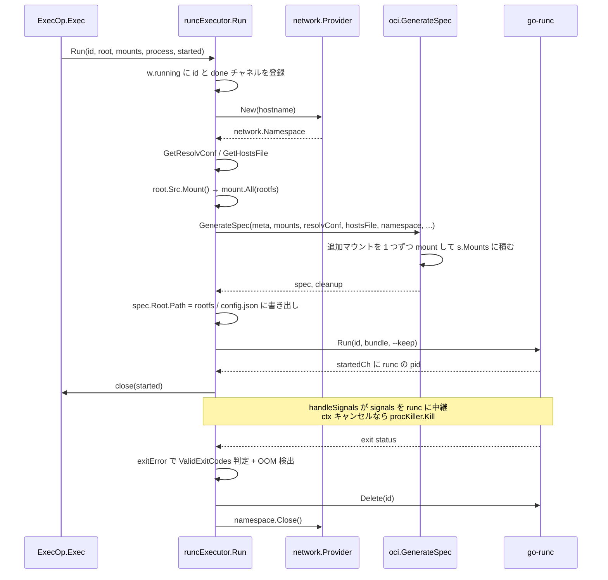

## 何を学んだか

`runcExecutor.Run` は 250 行ほどの 1 関数で、**上から下に読むだけで 1 回の `RUN` の全工程が追える**。抽象化のレイヤを挟まず、`defer` を積み上げていくスタイルで書かれている。

やることは 8 つ。

1. コンテナ ID の登録 (`w.running` マップ) — `Exec` から見つけられるようにする
2. ネットワーク名前空間の確保
3. `/etc/resolv.conf` と `/etc/hosts` の生成
4. bundle ディレクトリを作り、rootfs をその中にマウント
5. OCI spec を生成して `config.json` に書き出す
6. cgroup をリソースモニタに登録
7. `runc run --keep` を起動し、シグナルと IO を中継しながら待つ
8. 終了コードを判定し、`runc delete` と名前空間解放

`--mount` で指定された追加マウントは **`Run` の中では処理されない**。`GenerateSpec` に渡して、そちらでマウントされる。この分担が Run のコードを短く保っている。

## 1 回の Run の流れ



## ネットワーク名前空間を先に取る

`Run` の最初の実処理はネットワークだ。

```go title="executor/runcexecutor/executor.go"
	var namespace network.Namespace
	if proxyConfig != nil {
		namespace, err = w.proxyProvider.NewProxy(ctx, proxyConfig)
	} else {
		namespace, err = provider.New(ctx, meta.Hostname, network.NamespaceOptions{})
	}
	if err != nil {
		return nil, err
	}
	// ...
	doReleaseNetwork := true
	defer func() {
		if doReleaseNetwork {
			namespace.Close()
		}
	}()
```

([executor/runcexecutor/executor.go L206-L223](https://github.com/moby/buildkit/blob/ca4838f8ddbd3612bca94bcb8a938d8a326110a3/executor/runcexecutor/executor.go#L206-L223))

`network.Provider` は `pb.NetMode` ごとに用意されており、CNI・host・none の 3 種類がある。`Namespace` のインターフェースは驚くほど小さい。

```go title="util/network/network.go"
// Namespace of network for workers
type Namespace interface {
	io.Closer
	// Set the namespace on the spec
	Set(*specs.Spec) error

	Sample() (*resourcestypes.NetworkSample, error)
}
```

([util/network/network.go L19-L26](https://github.com/moby/buildkit/blob/ca4838f8ddbd3612bca94bcb8a938d8a326110a3/util/network/network.go#L19-L26))

「spec に自分を書き込む」「閉じる」「統計を取る」の 3 つだけ。CNI で netns を作るのも、host モードで何もしないのも、この 3 メソッドの実装違いに畳まれている。実際 `GenerateSpec` の中で 1 行呼ばれるだけだ ([executor/oci/spec.go L190](https://github.com/moby/buildkit/blob/ca4838f8ddbd3612bca94bcb8a938d8a326110a3/executor/oci/spec.go#L190))。

`doReleaseNetwork` というフラグ付きの defer が特徴的で、正常終了したら false にして defer を無効化し、代わりに `releaseContainer` の中で閉じる ([L387-L395](https://github.com/moby/buildkit/blob/ca4838f8ddbd3612bca94bcb8a938d8a326110a3/executor/runcexecutor/executor.go#L387-L395))。`Run` が返ったあとも `Recorder` が生きている間はコンテナと名前空間を保持する必要があるからだ。

## resolv.conf と hosts はワーカー root に 1 個だけ作る

どちらも「ワーカーの root ディレクトリに実ファイルを作り、それを read-only bind mount する」形になっている。

```go title="executor/runcexecutor/executor.go"
	resolvConfName, err := oci.GetResolvConf(ctx, stateDirRoot, w.idmap, w.dns, meta.NetMode)
	// ...
	resolvConf := filepath.Join(w.root, resolvConfName)

	hostsName, clean, err := oci.GetHostsFile(ctx, stateDirRoot, meta.ExtraHosts, w.idmap, meta.Hostname)
```

([executor/runcexecutor/executor.go L231-L244](https://github.com/moby/buildkit/blob/ca4838f8ddbd3612bca94bcb8a938d8a326110a3/executor/runcexecutor/executor.go#L231-L244))

デフォルト設定 (extraHosts なし・hostname がデフォルト) の場合、hosts ファイルは `flightcontrol.Group` で 1 回だけ生成され、以降は全コンテナで同じ実ファイルを共有する ([executor/oci/hosts.go L17-L30](https://github.com/moby/buildkit/blob/ca4838f8ddbd3612bca94bcb8a938d8a326110a3/executor/oci/hosts.go#L17-L30))。カスタム設定のときだけ `hosts.<random>` というユニークな名前で作り、cleanup 関数を返す。返り値の 2 番目 (`clean`) を `defer clean()` するのは呼び出し側の仕事だ。

`resolv.conf` は生成条件がもう少し込み入っていて、**ホストの `/etc/resolv.conf` より mtime が古かったら作り直す** ([executor/oci/resolvconf.go L91-L93](https://github.com/moby/buildkit/blob/ca4838f8ddbd3612bca94bcb8a938d8a326110a3/executor/oci/resolvconf.go#L91-L93))。長時間動き続ける buildkitd の途中で DHCP が DNS を変えても追随できる。参照元のパス選択にも実運用の知見が入っている。

```go title="executor/oci/resolvconf.go"
	// When /etc/resolv.conf contains 127.0.0.53 as the only nameserver, then
	// it is assumed systemd-resolved manages DNS. Because inside the container
	// 127.0.0.53 is not a valid DNS server, then return /run/systemd/resolve/resolv.conf
```

([executor/oci/resolvconf.go L40-L43](https://github.com/moby/buildkit/blob/ca4838f8ddbd3612bca94bcb8a938d8a326110a3/executor/oci/resolvconf.go#L40-L43))

`network.host` のときは逆に `/etc/resolv.conf` をそのまま使う。ホストのネットワーク名前空間にいるなら 127.0.0.53 に到達できるからだ。

## bundle と rootfs

rootfs のマウントは `executor.Mount` の抽象を 2 段で剥がす。

```go title="executor/runcexecutor/executor.go"
	mountable, err := root.Src.Mount(ctx, false)
	// ...
	rootMount, release, err := mountable.Mount()
	// ...
	bundle := filepath.Join(w.root, id)

	if err := os.Mkdir(bundle, 0o711); err != nil {
		return nil, errors.WithStack(err)
	}
	defer os.RemoveAll(bundle)
	// ...
	rootFSPath := filepath.Join(bundle, "rootfs")
	if err := user.MkdirAllAndChown(rootFSPath, 0o700, rootUID, rootGID); err != nil {
		return nil, errors.WithStack(err)
	}
	if err := mount.All(rootMount, rootFSPath); err != nil {
		return nil, errors.WithStack(err)
	}
	defer mount.Unmount(rootFSPath, 0)
```

([executor/runcexecutor/executor.go L246-L278](https://github.com/moby/buildkit/blob/ca4838f8ddbd3612bca94bcb8a938d8a326110a3/executor/runcexecutor/executor.go#L246-L278))

インターフェースは 2 段になっている。

```go title="executor/executor.go"
type MountableRef interface {
	Mount() ([]mount.Mount, func() error, error)
	IdentityMapping() *user.IdentityMapping
}

type Mountable interface {
	Mount(ctx context.Context, readonly bool) (MountableRef, error)
}
```

([executor/executor.go L36-L43](https://github.com/moby/buildkit/blob/ca4838f8ddbd3612bca94bcb8a938d8a326110a3/executor/executor.go#L36-L43))

1 段目 (`Mountable.Mount`) が「マウント記述子を用意する」で、2 段目 (`MountableRef.Mount`) が「実際にマウント可能な `[]mount.Mount` を返す」。返るのは overlayfs の lowerdir/upperdir を並べた記述であって、まだカーネルには何も渡っていない。実際に mount(2) を呼ぶのは `mount.All` のほうだ。この分離があるので、同じ ref を「マウントせずに記述だけ渡す」用途 (spec の `s.Mounts` に積む) にも使える。

bundle は `<worker root>/<container id>` で、`defer os.RemoveAll(bundle)` で必ず消える。`config.json` も rootfs のマウントポイントもこの中にある。

その直後に置かれる defer が実は重要だ。

```go title="executor/runcexecutor/executor.go"
	defer executor.MountStubsCleaner(context.WithoutCancel(ctx), rootFSPath, mounts, meta.RemoveMountStubsRecursive)()
```

([executor/runcexecutor/executor.go L280](https://github.com/moby/buildkit/blob/ca4838f8ddbd3612bca94bcb8a938d8a326110a3/executor/runcexecutor/executor.go#L280))

`defer f()()` という二重呼び出しで、**外側が今すぐ実行され、内側が defer される**。`MountStubsCleaner` は今の時点で「これから作られるマウントポイントのうち、まだ存在しないパス」を記録し、返した関数が終了時にそれを消す ([executor/stubs.go L49-L84](https://github.com/moby/buildkit/blob/ca4838f8ddbd3612bca94bcb8a938d8a326110a3/executor/stubs.go#L49-L84))。runc は `/etc/resolv.conf` や `--mount` の宛先が rootfs に無ければ作るが、そのまま残すとイメージに空ファイル・空ディレクトリが混入する。**もともと無かったものだけを消す**ために、マウント前のスナップショットを取っている。

## spec を作って config.json に書く

追加マウントの処理は `GenerateSpec` の中だ。`Run` から渡すのは記述子のリストだけになる。

```go title="executor/runcexecutor/executor.go"
	spec, cleanup, err := oci.GenerateSpec(ctx, meta, mounts, id, resolvConf, hostsFile, namespace, w.cgroupParent, w.processMode, w.idmap, w.apparmorProfile, w.selinux, w.tracingSocket, w.cdiManager, opts...)
	if err != nil {
		return nil, err
	}
	defer cleanup()

	spec.Root.Path = rootFSPath
	if root.Readonly {
		spec.Root.Readonly = true
	}
```

([executor/runcexecutor/executor.go L314-L323](https://github.com/moby/buildkit/blob/ca4838f8ddbd3612bca94bcb8a938d8a326110a3/executor/runcexecutor/executor.go#L314-L323))

`spec.Root.Path` だけは `Run` 側で後から入れている。`GenerateSpec` は rootfs のパスを知らない — rootfs をどこにマウントするかは executor の bundle 構造の話なので、spec 生成のロジックから切り離されている。spec の中身については [OCI spec の生成、entitlements、RUN --mount=type=cache](../oci-spec-and-mounts/) を参照。

`USER` の解決 (`oci.GetUser(rootFSPath, meta.User)`, [L289](https://github.com/moby/buildkit/blob/ca4838f8ddbd3612bca94bcb8a938d8a326110a3/executor/runcexecutor/executor.go#L289)) は rootfs をマウントしたあとでしかできない。`/etc/passwd` を読む必要があるからだ。

作業ディレクトリも同様で、存在しなければ作る。

```go title="executor/runcexecutor/executor.go"
	newp, err := fs.RootPath(rootFSPath, meta.Cwd)
	// ...
	if _, err := os.Stat(newp); err != nil {
		if err := user.MkdirAllAndChown(newp, 0o755, rootUID, rootGID); err != nil {
```

([executor/runcexecutor/executor.go L325-L333](https://github.com/moby/buildkit/blob/ca4838f8ddbd3612bca94bcb8a938d8a326110a3/executor/runcexecutor/executor.go#L325-L333))

`fs.RootPath` はシンボリックリンクを rootfs 内に閉じ込めて解決する。`WORKDIR /tmp/../../etc` のような指定でホスト側に出られない。

## runc の起動とシグナル中継

起動そのものは `go-runc` に投げるだけだ。

```go title="executor/runcexecutor/executor_linux.go"
func (w *runcExecutor) run(ctx context.Context, id, bundle string, process executor.ProcessInfo, started func(), keep bool) error {
	killer := newRunProcKiller(w.runc, id)
	return w.callWithIO(ctx, process, started, killer, func(ctx context.Context, started chan<- int, io runc.IO, pidfile string) error {
		extraArgs := []string{}
		if keep {
			extraArgs = append(extraArgs, "--keep")
		}
		_, err := w.runc.Run(ctx, id, bundle, &runc.CreateOpts{
			NoPivot:   w.noPivot,
			Started:   started,
			IO:        io,
			ExtraArgs: extraArgs,
		})
		return err
	})
}
```

([executor/runcexecutor/executor_linux.go L29-L44](https://github.com/moby/buildkit/blob/ca4838f8ddbd3612bca94bcb8a938d8a326110a3/executor/runcexecutor/executor_linux.go#L29-L44))

`--keep` は「プロセスが終わってもコンテナの状態を消さない」オプションだ。これが無いと `runc run` の終了と同時に状態が消え、あとから終了コードや cgroup の統計を取れない。だから明示的に `runc delete` する責任が BuildKit 側に来る。

面倒なのは **kill するときに何を殺すか**だ。BuildKit は `runc` プロセス (モニタ) と、その中で動くプロセスの 2 つを区別している。

```go title="executor/runcexecutor/executor.go"
			case sig := <-signals:
				if sig == syscall.SIGKILL {
					// never send SIGKILL directly to runc, it needs to go to the
					// process in-container
					if err := runcProcess.killer.Kill(ctx); err != nil {
						return err
					}
					continue
				}
				if err := runcProcess.monitorProcess.Signal(sig); err != nil {
```

([executor/runcexecutor/executor.go L781-L790](https://github.com/moby/buildkit/blob/ca4838f8ddbd3612bca94bcb8a938d8a326110a3/executor/runcexecutor/executor.go#L781-L790))

SIGKILL だけは `runc kill` 経由でコンテナ内プロセスに送る。runc 自体を SIGKILL すると後始末なしにモニタが消え、コンテナが残留する。他のシグナル (SIGINT など) は runc に送れば中に転送される。

`ctx` がキャンセルされたときも同じ経路を通る。

```go title="executor/runcexecutor/executor.go"
// runcProcessHandle will create a procHandle that will be monitored, where
// on ctx.Done the in-container process will receive a SIGKILL.  The returned
// context should be used for the go-runc.(Run|Exec) invocations.  The returned
// context will only be canceled in the case where the request context is
// canceled and we are unable to send the SIGKILL to the in-container process.
// The goal is to allow for runc to gracefully shutdown when the request context
// is cancelled.
func runcProcessHandle(ctx context.Context, killer procKiller) (*procHandle, context.Context) {
	runcCtx, cancel := context.WithCancelCause(context.Background())
```

([executor/runcexecutor/executor.go L666-L674](https://github.com/moby/buildkit/blob/ca4838f8ddbd3612bca94bcb8a938d8a326110a3/executor/runcexecutor/executor.go#L666-L674))

`context.Background()` から新しい ctx を作って `go-runc` に渡すのがポイントだ。リクエストの ctx をそのまま渡すと、キャンセル時に `exec.Cmd` が runc プロセスを即座に殺してしまう。そうではなく **中のプロセスに SIGKILL を送ってから runc に自然に終わらせる**。SIGKILL を送れなかったときにだけ、この新しい ctx をキャンセルして runc を強制終了する。

## 終了コードは「0 だけが成功」ではない

```go title="executor/runcexecutor/executor.go"
	if validExitCodes == nil {
		// no exit codes specified, so only 0 is allowed
		if exitErr.ExitCode == 0 {
			return nil
		}
	} else {
		// exit code in allowed list, so exit cleanly
		if slices.Contains(validExitCodes, int(exitErr.ExitCode)) {
			return nil
		}
	}
```

([executor/runcexecutor/executor.go L432-L442](https://github.com/moby/buildkit/blob/ca4838f8ddbd3612bca94bcb8a938d8a326110a3/executor/runcexecutor/executor.go#L432-L442))

OOM の検出も入る。cgroup v2 の `memory.events` から `oom_kill` のカウントを読み、0 より大きければエラーを `syscall.ENOMEM` に差し替える ([executor/runcexecutor/executor_linux.go L208-L223](https://github.com/moby/buildkit/blob/ca4838f8ddbd3612bca94bcb8a938d8a326110a3/executor/runcexecutor/executor_linux.go#L208-L223))。「exit 137」だけ見せられるよりずっと親切な失敗になる。

## Exec は config.json を読み直す

`Exec` は `Run` と全く違う構造をしている。

```go title="executor/runcexecutor/executor.go"
	// load default process spec (for Env, Cwd etc) from bundle
	f, err := os.Open(filepath.Join(state.Bundle, "config.json"))
	// ...
	spec := &specs.Spec{}
	dec := json.NewDecoder(f)
	if err := dec.Decode(spec); err != nil {
		return err
	}
	if _, err := dec.Token(); !errors.Is(err, io.EOF) {
		return errors.New("unexpected data after JSON spec object")
	}
```

([executor/runcexecutor/executor.go L483-L497](https://github.com/moby/buildkit/blob/ca4838f8ddbd3612bca94bcb8a938d8a326110a3/executor/runcexecutor/executor.go#L483-L497))

**`Run` が書いた `config.json` をそのまま読み戻し、`spec.Process` だけを差し替えて `runc exec` に渡す**。ネットワークもマウントも rootfs も、`Run` が作ったものをそのまま使う。だから `Exec` には対応する後始末が一切無い。

その前に「コンテナが本当に走っているか」を待つループがある。

```go title="executor/runcexecutor/executor.go"
		state, _ = w.runc.State(ctx, id)
		if state != nil && state.Status == "running" {
			break
		}
		select {
		case <-ctx.Done():
			return context.Cause(ctx)
		case err, ok := <-done:
			if !ok || err == nil {
				return errors.Errorf("container %s has stopped", id)
			}
			return errors.Wrapf(err, "container %s has exited with error", id)
		case <-time.After(100 * time.Millisecond):
		}
```

([executor/runcexecutor/executor.go L467-L480](https://github.com/moby/buildkit/blob/ca4838f8ddbd3612bca94bcb8a938d8a326110a3/executor/runcexecutor/executor.go#L467-L480))

`w.running[id]` に登録されたチャネルを見ることで、「まだ起動中」と「もう死んだ」を区別している。`Run` の defer がこのチャネルに終了エラーを流して閉じるので ([L171-L182](https://github.com/moby/buildkit/blob/ca4838f8ddbd3612bca94bcb8a938d8a326110a3/executor/runcexecutor/executor.go#L171-L182))、`Exec` は待つべきか諦めるべきかを判断できる。

kill の仕方も違う。`runc run` は `runc kill <id>` でコンテナ内 init を殺せるが、`runc exec` で追加したプロセスにはそれが使えない。だから pidfile を書かせて pid を読み、直接シグナルを送る。しかも pidfile は runc の pid を受け取った数ミリ秒後に書かれるので、生成直後に kill する場合はリトライが要る ([L620-L639](https://github.com/moby/buildkit/blob/ca4838f8ddbd3612bca94bcb8a938d8a326110a3/executor/runcexecutor/executor.go#L620-L639))。`newRunProcKiller` と `newExecProcKiller` が別関数になっているのは、この違いを型で分けるためだ ([L556-L580](https://github.com/moby/buildkit/blob/ca4838f8ddbd3612bca94bcb8a938d8a326110a3/executor/runcexecutor/executor.go#L556-L580))。

## なぜそうなっているか

executor の責務は「1 つの `RUN` を実行して終了コードを返す」だけで、キャッシュもキーも知らない。だから状態を持たない — `w.running` マップと `resmon` 以外にフィールドはすべて設定値だ。1 回の `Run` で作ったものはすべて `defer` で戻るので、途中でどこで失敗しても後始末が漏れない。

`Exec` が `config.json` を読み戻すのは、**`Run` の環境を再現するのではなく、そのまま借りている**ということだ。`buildctl debug` でコンテナに入るとき、`RUN` と同じ env・同じマウント・同じネットワークが見えるのはこのためになる。逆に言うと、`Run` が終わって bundle が消えたら `Exec` はできない。`--keep` と `w.running` の両方が、その「まだ生きている」状態を支えている。

IO の扱いが tty 有無で完全に分岐しているのも実装の都合そのままだ。tty なしの経路では stdin を `os.Pipe` 経由にしていて、その理由が長いコメントで残っている ([executor/runcexecutor/executor_linux.go L88-L96](https://github.com/moby/buildkit/blob/ca4838f8ddbd3612bca94bcb8a938d8a326110a3/executor/runcexecutor/executor_linux.go#L88-L96))。`cmd.Stdin` が `*os.File` なら `exec.Cmd` は dup2 して子に渡すので `cmd.Wait` は runc の終了と同時に返るが、そうでなければ内部 goroutine が呼び出し側の Reader でブロックし続けて `Wait` が返らない。`exec.Cmd` の実装詳細に依存した回避策で、知らないと「プロセスは殺したのに Wait が返らない」というハングになる。

## どう活かすか

- **確保と解放を隣に書く。** `Run` は「作る → `defer` で壊す」を 8 回繰り返すだけの構造になっている。途中の早期 return がどれだけ増えてもリークしない。関数を分割して確保と解放が離れるより読みやすく、安全だ。
- **フラグ付き defer で「成功したら寿命を延ばす」を表現する。** `doReleaseNetwork = false` は、正常系だけ後始末の責任を別の場所に移す書き方になる。エラーパスは何も考えなくていい。
- **外部プロセスを扱うなら「誰にシグナルを送るか」を最初に設計する。** モニタプロセスと本体を混同すると、graceful shutdown が graceful でなくなる。ここでは SIGKILL だけ経路を分けている。
- **「元から無かったもの」を消すには、変更前の状態を先に記録する。** マウント前にパスの存在を調べてから消す `MountStubsCleaner` のやり方は、副作用の巻き戻し一般に使える。
- **同じリソースへの 2 つ目のアクセス経路 (`Exec`) は、1 つ目が書き出した宣言を読み戻す。** 状態を二重に持たなくて済み、ずれようがない。
