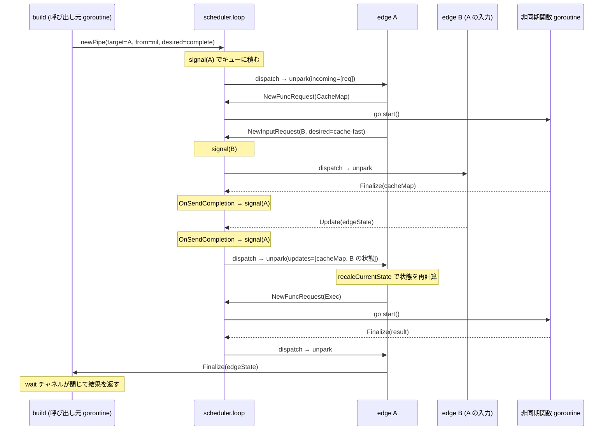

## 何を学んだか

`solver/edge.go` は 1000 行あるが、`sync.Mutex` は 1 つも出てこない (`failedOnce sync.Once` だけがある)。edge の状態を触るコードは**すべて 1 本の goroutine の上でしか動かない**からだ。

```go title="solver/scheduler.go"
func newScheduler(ef edgeFactory) *scheduler {
	s := &scheduler{
		waitq:    map[*edge]struct{}{},
		incoming: map[*edge][]*edgePipe{},
		outgoing: map[*edge][]*edgePipe{},
		// ...
	}
	s.cond = cond.NewStatefulCond(&s.mu)

	go s.loop()

	return s
}
```

([solver/scheduler.go L13-L29](https://github.com/moby/buildkit/blob/ca4838f8ddbd3612bca94bcb8a938d8a326110a3/solver/scheduler.go#L13-L29))

`go s.loop()` はここ 1 箇所だけだ。ネットワーク I/O もコンテナ実行もキャッシュ検索も、この goroutine の上ではやらない。それらは `pipe` の向こう側に追い出され、終わったら「その edge をもう一度処理せよ」という信号だけがループに戻ってくる。

## ループ本体

```go title="solver/scheduler.go"
	s.mu.Lock()
	for {
		select {
		case <-s.stopped:
			s.mu.Unlock()
			return
		default:
		}
		s.muQ.Lock()
		l := s.next
		if l != nil {
			if l == s.last {
				s.last = nil
			}
			s.next = l.next
			delete(s.waitq, l.e)
		}
		s.muQ.Unlock()
		if l == nil {
			s.cond.Wait()
			continue
		}
		s.dispatch(l.e)
	}
```

([solver/scheduler.go L73-L96](https://github.com/moby/buildkit/blob/ca4838f8ddbd3612bca94bcb8a938d8a326110a3/solver/scheduler.go#L73-L96))

キューは `dispatcher` の単方向連結リストで、`next` が先頭、`last` が末尾だ。

```go title="solver/scheduler.go"
type dispatcher struct {
	next *dispatcher
	e    *edge
}
```

([solver/scheduler.go L31-L34](https://github.com/moby/buildkit/blob/ca4838f8ddbd3612bca94bcb8a938d8a326110a3/solver/scheduler.go#L31-L34))

ロックが 2 つあるのが目を引く。`s.mu` はループ全体が握りっぱなしのロックで、`dispatch` の間ずっと保持される。`s.muQ` はキューだけを守る。**キューへの投入 (`signal`) は `muQ` しか取らない**ので、`dispatch` の実行中でも他の goroutine から自由にキューに積める。

```go title="solver/scheduler.go"
// signal notifies that an edge needs to be processed again
func (s *scheduler) signal(e *edge) {
	s.muQ.Lock()
	if _, ok := s.waitq[e]; !ok {
		d := &dispatcher{e: e}
		if s.last == nil {
			s.next = d
		} else {
			s.last.next = d
		}
		s.last = d
		s.waitq[e] = struct{}{}
		s.cond.Signal()
	}
	s.muQ.Unlock()
}
```

([solver/scheduler.go L192-L207](https://github.com/moby/buildkit/blob/ca4838f8ddbd3612bca94bcb8a938d8a326110a3/solver/scheduler.go#L192-L207))

`waitq` は集合で、同じ edge が二重にキューに入るのを防ぐ。1 つの edge に 5 本の依存が同時に完了しても、`dispatch` は 1 回しか呼ばれず、5 本ぶんの更新をまとめて処理する。これは効率のためだけでなく、`unpark` が「前回から今までに起きた変化」をまとめて見る前提で書かれているからでもある。

## StatefulCond — 取りこぼさない Signal

`signal` は `s.mu` を取らないのに `s.cond.Signal()` を呼ぶ。素の `sync.Cond` ならこれは wakeup を取りこぼす。BuildKit は専用の cond を用意している。

```go title="util/cond/cond.go"
// NewStatefulCond returns a stateful version of sync.Cond . This cond will
// never block on `Wait()` if `Signal()` has been called after the `Wait()` last
// returned. This is useful for avoiding to take a lock on `cond.Locker` for
// signalling.
```

([util/cond/cond.go L7-L10](https://github.com/moby/buildkit/blob/ca4838f8ddbd3612bca94bcb8a938d8a326110a3/util/cond/cond.go#L7-L10))

```go title="util/cond/cond.go"
func (s *StatefulCond) Wait() {
	s.main.Unlock()
	s.mu.Lock()
	if !s.signalled {
		s.c.Wait()
	}
	s.signalled = false
	s.mu.Unlock()
	s.main.Lock()
}
```

([util/cond/cond.go L24-L33](https://github.com/moby/buildkit/blob/ca4838f8ddbd3612bca94bcb8a938d8a326110a3/util/cond/cond.go#L24-L33))

`signalled` フラグを 1 個持つだけで、「Wait に入る直前に Signal が来た」を吸収する。これで **Signal 側が重いロック (`s.mu`) を取る必要がなくなる**。`dispatch` は長く `s.mu` を握るので、そこで Signal 側がブロックしたらループが止まる。

## dispatch — unpark の前後でやること

```go title="solver/scheduler.go"
func (s *scheduler) dispatch(e *edge) {
	inc := make([]pipeSender, len(s.incoming[e]))
	for i, p := range s.incoming[e] {
		inc[i] = p.Sender
	}
	out := make([]pipeReceiver, len(s.outgoing[e]))
	for i, p := range s.outgoing[e] {
		out[i] = p.Receiver
	}

	e.hasActiveOutgoing = false
	updates := []pipeReceiver{}
	for _, p := range out {
		if ok := p.Receive(); ok {
			updates = append(updates, p)
		}
		if !p.Status().Completed {
			e.hasActiveOutgoing = true
		}
	}

	pf := &pipeFactory{s: s, e: e}

	// unpark the edge
	debugSchedulerPreUnpark(e, inc, updates, out)
	e.unpark(inc, updates, out, pf)
	debugSchedulerPostUnpark(e, inc)
	// ...
}
```

([solver/scheduler.go L99-L127](https://github.com/moby/buildkit/blob/ca4838f8ddbd3612bca94bcb8a938d8a326110a3/solver/scheduler.go#L99-L127))

edge から見て、pipe には 2 方向ある。

- **incoming** — 「この edge の結果をよこせ」という要求。edge は `Sender` 側を持ち、`Update` / `Finalize` で返事をする。
- **outgoing** — この edge が出した要求。edge は `Receiver` 側を持ち、`Receive()` で新しい値が来ているか調べる。

`dispatch` は unpark の前に全 outgoing を `Receive()` し、値が変わっていたものだけを `updates` に集める。同時に `hasActiveOutgoing` を再計算する。これは「まだ完了していない outgoing があるか」で、後で「今返事を確定してよいか」の判断に使われる。

unpark から戻ったら、開いたままの pipe を数え直す。

```go title="solver/scheduler.go"
	openIncoming := make([]*edgePipe, 0, len(inc))
	for _, r := range s.incoming[e] {
		if !r.Sender.Status().Completed {
			openIncoming = append(openIncoming, r)
		}
	}
```

([solver/scheduler.go L128-L151](https://github.com/moby/buildkit/blob/ca4838f8ddbd3612bca94bcb8a938d8a326110a3/solver/scheduler.go#L128-L151))

完了した pipe をマップから外し、空になったらキーごと消す。outgoing 側も同じ形で `openOutgoing` を作る。この数え直しの結果は、そのまま `unpark` の契約検査に使われる ([unpark の 2 つの契約](../unpark-contract/))。

## pipe — 「前回見たときから変わったか」

pipe の中身は、驚くほど小さい。

```go title="solver/internal/pipe/pipe.go"
type channel[V any] struct {
	OnSendCompletion func()
	value            atomic.Pointer[V]
	lastValue        *V
}

func (c *channel[V]) Send(v V) {
	c.value.Store(&v)
	if c.OnSendCompletion != nil {
		c.OnSendCompletion()
	}
}

func (c *channel[V]) Receive() (V, bool) {
	v := c.value.Load()
	if v == nil || v == c.lastValue {
		return *new(V), false
	}
	c.lastValue = v
	return *v, true
}
```

([solver/internal/pipe/pipe.go L11-L31](https://github.com/moby/buildkit/blob/ca4838f8ddbd3612bca94bcb8a938d8a326110a3/solver/internal/pipe/pipe.go#L11-L31))

Go のチャネルではない。**ポインタ 1 個の atomic なスロット**だ。`Send` は上書きし、`Receive` は「前回読んだポインタと違うか」だけを見る。値はキューイングされないので、送信側が 10 回 `Update` しても、受信側が 1 回しか読まなければ最後の値だけが見える。

これは意図的な設計だ。edge の状態は単調に進むので、途中の値は落としてよい。バッファを持たないことで、送信側がブロックすることもない。`Send` は必ず即座に返る。

pipe 1 本には `Sender` と `Receiver` があり、それぞれ逆向きの `channel` を持つ。

```go title="solver/internal/pipe/pipe.go"
func New[Payload, Value any](req Request[Payload]) *Pipe[Payload, Value] {
	cancelCh := &channel[Request[Payload]]{}
	roundTripCh := &channel[Status[Value]]{}
	// ...
}
```

([solver/internal/pipe/pipe.go L87-L98](https://github.com/moby/buildkit/blob/ca4838f8ddbd3612bca94bcb8a938d8a326110a3/solver/internal/pipe/pipe.go#L87-L98))

`roundTripCh` が結果を運び、`cancelCh` がキャンセル要求を逆向きに運ぶ。`Receiver.Cancel()` は `Request.Canceled = true` にして送り返すだけで、実際に何を止めるかは受け取った側が決める。

## 非同期処理は pipe の向こうへ

edge がキャッシュマップを取りたくなったら、直接呼ばずに関数リクエストを作る。

```go title="solver/scheduler.go"
// newRequestWithFunc creates a new request pipe that invokes a async function
func (s *scheduler) newRequestWithFunc(e *edge, f func(context.Context) (any, error)) pipeReceiver {
	pp, start := pipe.NewWithFunction[*edgeRequest](f)
	p := &edgePipe{
		Pipe: pp,
		From: e,
	}
	p.OnSendCompletion = func() {
		p.mu.Lock()
		defer p.mu.Unlock()
		s.signal(p.From)
	}
	s.outgoing[e] = append(s.outgoing[e], p)
	go start()
	return p.Receiver
}
```

([solver/scheduler.go L271-L286](https://github.com/moby/buildkit/blob/ca4838f8ddbd3612bca94bcb8a938d8a326110a3/solver/scheduler.go#L271-L286))

`go start()` で関数を別 goroutine に投げ、`OnSendCompletion` に「終わったら発行元の edge を signal しろ」を仕込む。edge 側のコードは 3 行で済む。

```go title="solver/edge.go"
	e.cacheMapReq = f.NewFuncRequest(func(ctx context.Context) (any, error) {
		cm, err := e.op.CacheMap(ctx, index)
		return cm, errors.Wrap(err, "failed to load cache key")
	})
```

([solver/edge.go L344-L347](https://github.com/moby/buildkit/blob/ca4838f8ddbd3612bca94bcb8a938d8a326110a3/solver/edge.go#L344-L347))

`e.cacheMapReq` に `Receiver` を保存しておき、次に `unpark` が呼ばれたとき `processUpdate` で「この update は `cacheMapReq` からか」を突き合わせる。

```go title="solver/edge.go"
	// response for cachemap request
	if upt == e.cacheMapReq && upt.Status().Completed {
		e.processCacheMapReq()
		return true
	}
```

([solver/edge.go L393-L398](https://github.com/moby/buildkit/blob/ca4838f8ddbd3612bca94bcb8a938d8a326110a3/solver/edge.go#L393-L398))

ポインタの同一性で振り分けている。edge は「何を待っているか」をフィールドに直接持つので、状態機械のどこにいるかがフィールドを見れば分かる。

## 全体の流れ

`Job.Build` から結果が出るまでを 1 本で追うとこうなる。



入り口の `build` も、pipe を 1 本作って待つだけだ。

```go title="solver/scheduler.go"
	p := s.newPipe(e, nil, pipeRequest{Payload: &edgeRequest{desiredState: edgeStatusComplete}})
	p.OnSendCompletion = func() {
		p.Receiver.Receive()
		if p.Receiver.Status().Completed {
			close(wait)
		}
	}
	s.mu.Unlock()
	// ...
	<-wait
```

([solver/scheduler.go L218-L242](https://github.com/moby/buildkit/blob/ca4838f8ddbd3612bca94bcb8a938d8a326110a3/solver/scheduler.go#L218-L242))

`from` が `nil` なので、この pipe は「誰の outgoing でもない incoming」になる。edge から見ると外から来た要求と内部の依存要求の区別がない。

## なぜそうなっているか

`docs/dev/solver.md` に、狙いと迷いの両方が書いてある。

> The scheduler is implemented as a single threaded non-blocking event loop. The single threaded constraint is for simplicity and might be removed in the future - currently, it is not known if this would have any performance impact.

([docs/dev/solver.md L234-L242](https://github.com/moby/buildkit/blob/ca4838f8ddbd3612bca94bcb8a938d8a326110a3/docs/dev/solver.md#L234-L242))

**simplicity のため**とはっきり書かれている。そして「性能に影響があるかどうかは分かっていない」とも。

この判断は妥当に見える。スケジューラが実際にやるのは、依存の状態を突き合わせて次の要求を組み立てることだけで、CPU も I/O もほとんど使わない。重い処理 (pull、実行、contenthash) はすべて pipe の向こうにあり、そちらは goroutine 数だけ並列に走る。**直列なのは「判断」だけで、「作業」は並列**だ。

代償は `unpark` が守るべき制約が増えることで、ドキュメントは続けてこう書いている。

> The unpark handler for an edge needs to be non-blocking and execute quickly.

([docs/dev/solver.md L244](https://github.com/moby/buildkit/blob/ca4838f8ddbd3612bca94bcb8a938d8a326110a3/docs/dev/solver.md#L244))

`unpark` の中で `Cache().Query()` や `Cache().Records()` を同期的に呼んでいる箇所があるのは、この制約からするとやや際どい。実際 `recalcCurrentState` は `e.op.Cache().Records(context.Background(), mergedKey)` を直接呼ぶ ([solver/edge.go L471](https://github.com/moby/buildkit/blob/ca4838f8ddbd3612bca94bcb8a938d8a326110a3/solver/edge.go#L471))。ローカルの bbolt / インメモリなら速いという前提が置かれている。

## どう活かすか

**状態機械はシングルスレッドに閉じ込め、I/O だけを外に出す。** 「どこにロックを置くか」を考える代わりに「ロックが要らない領域を作る」ほうが、状態が絡み合った問題では圧倒的に読みやすい。BuildKit の edge は 20 個以上のフィールドが相互に依存するが、ロックの議論はゼロで済んでいる。

**イベントは値ではなくレベルで運ぶ。** pipe はキューではなく「最新値のスロット」だ。受信側が遅れても送信側が詰まらず、まとめ読みが自然にできる。単調に進む状態を扱うなら、キューよりこちらのほうが正しいことが多い。

**「もう一度見ろ」という 1 種類の信号に統一する。** 完了通知も更新通知もキャンセル通知も、スケジューラから見れば `signal(e)` でしかない。イベントの種類を増やさず、状態の差分は edge 自身に再計算させる。`waitq` による重複排除がそのまま効くのも、信号が 1 種類だからだ。
